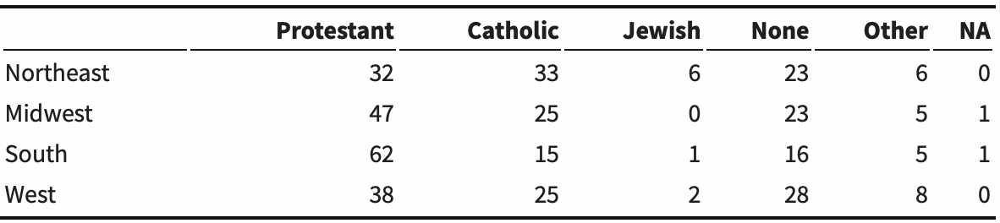
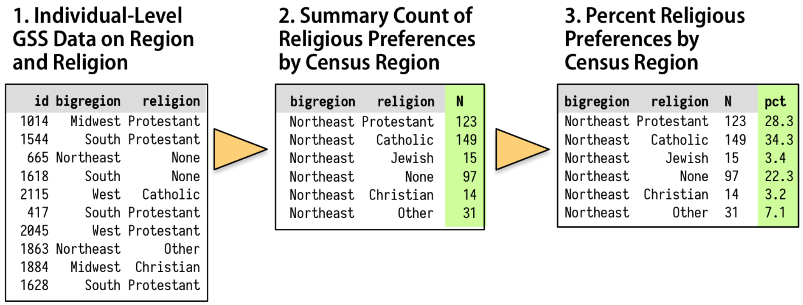
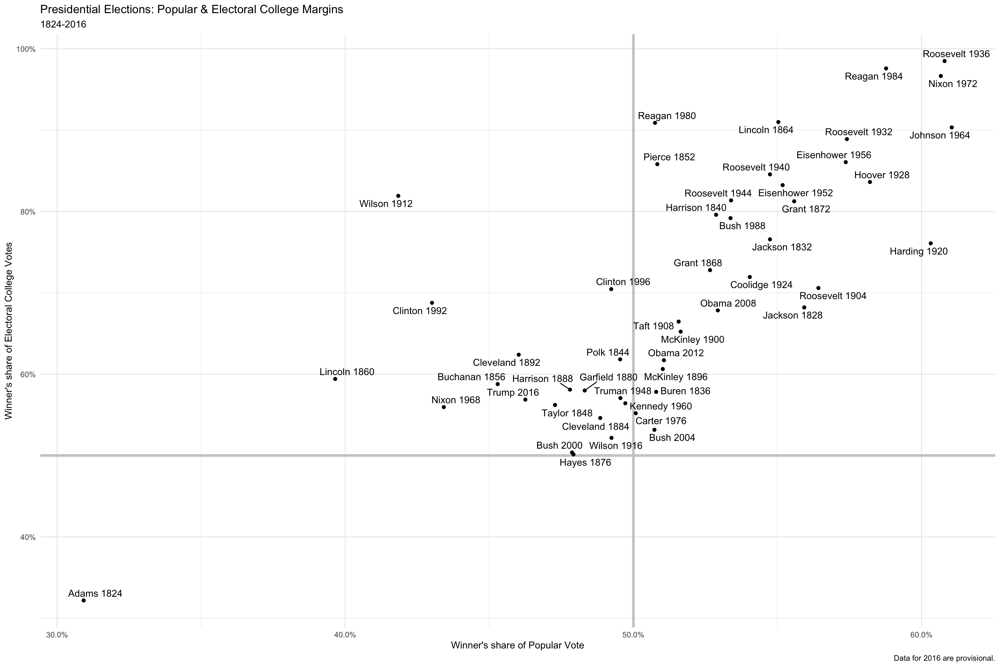

# Graph tables, add labels, make notes


## Graph tables, add labels, make notes {.build .faster}
- We will learn about how to transform data *before* we send it to ggplot to be turned into a figure.

- We will expand the number of geoms we know about, and learn more about how to choose between them.
  - How to reorder the variables displayed in our figures;
  - How to subset the data we use before we display it.

- We will learn a little more about the scale, guide, and theme functions.

## Loading the R packages

```{r setup}
library(tidyverse)
library(skimr)   # a better summary of data frame
library(scales)  # scales for ggplot
library(gapminder) # gapminder data
library(socviz)  # data for visualization practice
library(ggrepel)  # for text on plot, geom_text_repel(), geom_label_repel()
```


## The 2016 General Social Survey data

- The `socviz` package includes the `gss_sm` data frame.
  - `gss_sm` is a dataset containing an extract from the 2016 General Social Survey.

```{r, echo=T, eval=F, fig.align='center', fig.height=5.5, message=FALSE, warning=FALSE}
?gss_sm
glimpse(gss_sm)
skim(gss_sm)
view(gss_sm)
```


## Graph tables {.build .faster}
```{r, echo=T, eval=F, fig.align='center', fig.height=5.5, message=FALSE, warning=FALSE}
p <- ggplot(data = gss_sm,
            mapping = aes(x = bigregion, fill = religion))
p + geom_bar(position = "fill")
```
- Setting the position argument to `"fill"` in the `geom_bar()` is to compare proportions across groups.

## Graph tables
```{r, echo=F, eval=T, fig.align='center', fig.height=5.5, message=FALSE, warning=FALSE}
p <- ggplot(data = gss_sm,
            mapping = aes(x = bigregion, fill = religion))
p + geom_bar(position = "fill")
```


## Graph tables

{width=100%}

## Graph tables {.build .faster}
```{r, echo=T, eval=F, fig.align='center', fig.height=5.5, message=FALSE, warning=FALSE}
p <- ggplot(data = gss_sm,
            mapping = aes(x = bigregion ))
p + geom_bar(position = "dodge",
             mapping = aes(y = ..prop.., group = religion)) +
    facet_wrap(~ religion, ncol = 1)
```

- Instead, we can ask ggplot to give us a proportional bar chart of region, and then facet that by religion.
  - The proportions are calculated within each panel, which is the breakdown we wanted.

## Graph tables
```{r, echo=F, eval=T, fig.align='center', fig.height=5.5, message=FALSE, warning=FALSE}
p <- ggplot(data = gss_sm,
            mapping = aes(x = bigregion ))
p + geom_bar(position = "dodge",
             mapping = aes(y = ..prop.., group = religion)) +
    facet_wrap(~ religion, ncol = 1)
```


## Graph tables

{width=100%}

## Graph tables
{width=100%}


## Use pipes to summarize data {.build .faster}

- We will use the `%>%` (pipe) operator when tidying data.
  - The point of the pipe is to help you write code in a way that is easier to read and understand. 
  - A good way to pronounce `%>%` when reading code is “then”.


## Use pipes to summarize data {.build .faster}

- A pipeline is typically a series of operations that do one or more of four things:
  - `group_by()`: Group the data into the nested structure we want for our summary, such as “Religion by Region” or “Authors by Publications by Year”.
  - `filter()` rows or `select()` columns: Filter or select pieces of the data by row, column, or both. 
  - `mutate()`: Mutate the data by creating new variables at the current level of grouping. 
  - `summarize()`: Summarize or aggregate the grouped data. 
    - For example we might calculate means with `mean()` or counts with `n()`. 


## Use pipes to summarize data {.build .faster}
```{r, echo=T, eval=T, fig.align='center', fig.height=5.5, message=FALSE, warning=FALSE}
rel_by_region <- gss_sm %>%
    group_by( bigregion, religion ) %>%
    summarize( N = n() ) %>%
    mutate( freq = N / sum(N),
            pct = round((freq*100), 0) )
rel_by_region
```


## Use pipes to summarize data {.build .faster}
- Reading from the left, the code says this:

  - `rel_by_region <- gss_sm %>%`: Create a new object, `rel_by_region`. Start with the gss_sm data, and then ...
  
  - `group_by(bigregion, religion) %>%`: Group the rows by bigregion and, within that, by religion.


## Use pipes to summarize data {.build .faster}
  - `summarize(N = n()) %>%`: Summarize this table to create a new, much smaller table, with three columns: 
    - `bigregion`  
    - `religion`  
    - `N`: a count of the number of observations within each religious group for each region.
  
  
## Use pipes to summarize data {.build .faster}
  - `mutate(freq = N / sum(N), pct = round((freq*100), 0))`: With this new table, use the `N` variable to calculate two new columns: 
    - the relative proportion (`freq`)
    - the percentage (`pct`) for each religious category, still grouped by region. 
      - Round the results to the nearest percentage point.


## Use pipes to summarize data {.build .faster}
```{r, echo=T, eval=T, fig.align='center', fig.height=5.5, message=FALSE, warning=FALSE}
rel_by_region %>% group_by(bigregion) %>%
    summarize(total = sum(pct))
```


## Use pipes to summarize data {.build .faster}
```{r, echo=T, eval=F, fig.align='center', fig.height=5.5, message=FALSE, warning=FALSE}
p <- ggplot(rel_by_region, aes(x = bigregion, y = pct, fill = religion))

p + geom_col(position = "dodge") +
    labs(x = "Region",y = "Percent", fill = "Religion") +
    theme(legend.position = "top")
```

- We use a different position argument here, `dodge2` instead of `dodge`.

## Use pipes to summarize data 
```{r, echo=F, eval=T, fig.align='center', fig.height=5.5, message=FALSE, warning=FALSE}
p <- ggplot(rel_by_region, aes(x = bigregion, y = pct, fill = religion))

p + geom_col(position = "dodge2") +
    labs(x = "Region",y = "Percent", fill = "Religion") +
    theme(legend.position = "top")
```


## Use pipes to summarize data {.build .faster}
```{r, echo=T, eval=F, fig.align='center', fig.height=5.5, message=FALSE, warning=FALSE}
p <- ggplot(rel_by_region, aes(x = religion, y = pct, fill = religion))

p + geom_col(position = "dodge2") +
    labs(x = NULL, y = "Percent", fill = "Religion") +
    guides(fill = "none") + 
    coord_flip() + 
    facet_grid(~ bigregion)

```
- The `coord_flip()` function switches the x and y axes after the plot is made.

## Use pipes to summarize data
```{r, echo=F, eval=T, fig.align='center', fig.height=5.5, message=FALSE, warning=FALSE}
p <- ggplot(rel_by_region, aes(x = religion, y = pct, fill = religion))

p + geom_col(position = "dodge2") +
    labs(x = NULL, y = "Percent", fill = "Religion") +
    guides(fill = "none") + 
    coord_flip() + 
    facet_grid(~ bigregion)
```


## The `organdata` data

- The `socviz` package includes the `organdata` data frame.
  - `organdata` contains a little more than a decade’s worth of information on the donation of organs for transplants in seventeen OECD countries.

```{r, echo=T, eval=F, fig.align='center', fig.height=5.5, message=FALSE, warning=FALSE}
?organdata
glimpse(organdata)
skim(organdata)
view(organdata)
```


## Continuous variables by group or category {.build .faster}
```{r, echo=T, eval=F, fig.align='center', fig.height=5.5, message=FALSE, warning=FALSE}
p <- ggplot(data = organdata,
            mapping = aes(x = year, y = donors))
p + geom_point()
```
- Would it be informative?

## Continuous variables by group or category
```{r, echo=F, eval=T, fig.align='center', fig.height=5.5, message=FALSE, warning=FALSE}
p <- ggplot(data = organdata,
            mapping = aes(x = year, y = donors))
p + geom_point()
```


## Continuous variables by group or category {.build .faster}
```{r, echo=T, eval=F, fig.align='center', fig.height=5.5, message=FALSE, warning=FALSE}
p <- ggplot(data = organdata,
            mapping = aes(x = year, y = donors))
p + geom_line(aes(group = country)) + facet_wrap(~ country) +
  theme(axis.text.x = element_text(angle = 45))
```
- We could use `geom_line()` to plot each country's time series.
- We can also facet the figure by country.

## Continuous variables by group or category
```{r, echo=F, eval=T, fig.align='center', fig.height=5.5, message=FALSE, warning=FALSE}
p <- ggplot(data = organdata,
            mapping = aes(x = year, y = donors))
p + geom_line(aes(group = country)) + facet_wrap(~ country) +
  theme(axis.text.x = element_text(angle = 45))
```


## Continuous variables by group or category {.build .faster}
```{r, echo=T, eval=F, fig.align='center', fig.height=5.5, message=FALSE, warning=FALSE}
p <- ggplot(data = organdata,
            mapping = aes(x = country, y = donors))
p + geom_boxplot() + coord_flip()
```
- We can use `geom_boxplot()` to get a picture of variation by year across countries.

## Continuous variables by group or category
```{r, echo=F, eval=T, fig.align='center', fig.height=5.5, message=FALSE, warning=FALSE}
p <- ggplot(data = organdata,
            mapping = aes(x = country, y = donors))
p + geom_boxplot() + coord_flip()
```


## Continuous variables by group or category {.build .faster}
```{r, echo=T, eval=F, fig.align='center', fig.height=5.5, message=FALSE, warning=FALSE}
p <- ggplot(data = organdata,
            mapping = aes(x = reorder(country, donors, na.rm=TRUE),
                          y = donors))
p + geom_boxplot() +
    labs(x=NULL) +
    coord_flip()
```
- We generally want our plots to present data in some meaningful order.
- The `reorder()` function will do this for us.
  - `reorder(country, donors)`: Reorder `country` by `donors`.

## Continuous variables by group or category
```{r, echo=F, eval=T, fig.align='center', fig.height=5.5, message=FALSE, warning=FALSE}
p <- ggplot(data = organdata,
            mapping = aes(x = reorder(country, donors, na.rm=TRUE),
                          y = donors))
p + geom_boxplot() +
    labs(x=NULL) +
    coord_flip()
```


## Continuous variables by group or category {.build .faster}
```{r, echo=T, eval=F, fig.align='center', fig.height=5.5, message=FALSE, warning=FALSE}
p <- ggplot(data = organdata,
            mapping = aes(x = reorder(country, donors, na.rm=TRUE),
                          y = donors, fill = world))
p + geom_boxplot() + labs(x=NULL) +
    coord_flip() + theme(legend.position = "top")
```
-  Boxplots can also take `color` and `fill` aesthetic mappings like other geoms.

- The plots can be quite compact and fit a relatively large number of cases in by row. 

## Continuous variables by group or category
```{r, echo=F, eval=T, fig.align='center', fig.height=5.5, message=FALSE, warning=FALSE}
p <- ggplot(data = organdata,
            mapping = aes(x = reorder(country, donors, na.rm=TRUE),
                          y = donors, fill = world))
p + geom_boxplot() + labs(x=NULL) +
    coord_flip() + theme(legend.position = "top")
```


## Continuous variables by group or category {.build .faster}
```{r, echo=T, eval=F, fig.align='center', fig.height=5.5, message=FALSE, warning=FALSE}
p <- ggplot(data = organdata,
            mapping = aes(x = reorder(country, donors, na.rm=TRUE),
                          y = donors, color = world))
p + geom_point(alpha = .5) + labs(x=NULL) +
    coord_flip() + theme(legend.position = "top")
```
- When we use `geom_point()` like this, there is some overplotting of observations.

## Continuous variables by group or category
```{r, echo=F, eval=T, fig.align='center', fig.height=5.5, message=FALSE, warning=FALSE}
p <- ggplot(data = organdata,
            mapping = aes(x = reorder(country, donors, na.rm=TRUE),
                          y = donors, color = world))
p + geom_point(alpha = .5) + labs(x=NULL) +
    coord_flip() + theme(legend.position = "top")
```


## Continuous variables by group or category {.build .faster}
```{r, echo=T, eval=F, fig.align='center', fig.height=5.5, message=FALSE, warning=FALSE}
p <- ggplot(data = organdata,
            mapping = aes(x = reorder(country, donors, na.rm=TRUE),
                          y = donors, color = world))
p + geom_jitter(position = position_jitter(width=0.15)) +
    labs(x=NULL) + coord_flip() + theme(legend.position = "top")
```
- `geom_jitter()` can be useful to perturb the data just a little bit in order to get a better sense of how many observations there are at different values.

## Continuous variables by group or category
```{r, echo=F, eval=T, fig.align='center', fig.height=5.5, message=FALSE, warning=FALSE}
p <- ggplot(data = organdata,
            mapping = aes(x = reorder(country, donors, na.rm=TRUE),
                          y = donors, color = world))
p + geom_jitter(position = position_jitter(width=0.15)) +
    labs(x=NULL) + coord_flip() + theme(legend.position = "top")
```


## Continuous variables by group or category {.build .faster}
```{r, echo=T, eval=F, fig.align='center', fig.height=5.5, message=FALSE, warning=FALSE}
p <- ggplot(data = organdata,
            mapping = aes(x = reorder(country, donors, na.rm=TRUE),
                          y = donors, color = world))
p + geom_jitter(position = position_jitter(width=0.15)) +
    labs(x=NULL) + coord_flip() + theme(legend.position = "top")
```
- We can control it using `height` and `width` arguments to a `position_jitter()` function within the geom. 

## Continuous variables by group or category
```{r, echo=F, eval=T, fig.align='center', fig.height=5.5, message=FALSE, warning=FALSE}
p <- ggplot(data = organdata,
            mapping = aes(x = reorder(country, donors, na.rm=TRUE),
                          y = donors, color = world))
p + geom_jitter(position = position_jitter(width=0.15)) +
    labs(x=NULL) + coord_flip() + theme(legend.position = "top")
```


## Continuous variables by group or category {.build .faster}

- When we want to summarize a categorical variable that just has one point per category, we should use this approach as well. 


## Continuous variables by group or category {.build .faster}
```{r, echo=T, eval=T, fig.align='center', fig.height=5.5, message=FALSE, warning=FALSE}
by_country <- organdata %>% group_by(consent_law, country) %>%
    summarize(donors_mean= mean(donors, na.rm = TRUE),
              donors_sd = sd(donors, na.rm = TRUE),
              gdp_mean = mean(gdp, na.rm = TRUE),
              health_mean = mean(health, na.rm = TRUE),
              roads_mean = mean(roads, na.rm = TRUE),
              cerebvas_mean = mean(cerebvas, na.rm = TRUE))

by_country
```

## Continuous variables by group or category {.build .faster}
- What we would like to do is apply the `mean()` and `sd()` functions to every numerical variable in `organdata`, but only the numerical ones. 

- `summarize_if()` examines each column in our data and applies a test to it. 
  - `summarize_if()` only summarizes if the test is passed, that is, if it returns a value of `TRUE`.


## Continuous variables by group or category {.build .faster}
```{r, echo=T, eval=T, fig.align='center', fig.height=5.5, message=FALSE, warning=FALSE}
by_country <- organdata %>% group_by(consent_law, country) %>%
    summarize_if(is.numeric, funs(mean, sd), na.rm = TRUE) %>%
    ungroup()

by_country
```

## Cleveland dotplot {.build .faster}
```{r, echo=T, eval=F, fig.align='center', fig.height=5.5, message=FALSE, warning=FALSE}
p <- ggplot(data = by_country,
            mapping = aes(x = donors_mean, y = reorder(country, donors_mean),
                          color = consent_law))
p + geom_point(size=3) +
    labs(x = "Donor Procurement Rate",
         y = "", color = "Consent Law") +
    theme(legend.position="top")
```
- **Cleveland dotplot** is a simple and extremely effective method of presenting data that is usually better than either a bar chart or a table. 

## Cleveland dotplot
```{r, echo=F, eval=T, fig.align='center', fig.height=5.5, message=FALSE, warning=FALSE}
p <- ggplot(data = by_country,
            mapping = aes(x = donors_mean, y = reorder(country, donors_mean),
                          color = consent_law))
p + geom_point(size=3) +
    labs(x = "Donor Procurement Rate",
         y = "", color = "Consent Law") +
    theme(legend.position="top")
```


## Cleveland dotplot {.build .faster}
```{r, echo=T, eval=F, fig.align='center', fig.height=5.5, message=FALSE, warning=FALSE}
p <- ggplot(data = by_country,
            mapping = aes(x = donors_mean,
                          y = reorder(country, donors_mean)))

p + geom_point(size=3) +
    facet_wrap(~ consent_law, scales = "free_y", ncol = 1) +
    labs(x= "Donor Procurement Rate",
         y= "") 
```
- We could use a facet instead of coloring the points.  

- In the `facet_wrap()` here, ...
  - `scales = "free_y"` allows the y-axes scale to be free, which removes countries that do not dots in the panel.
  - `ncol=1` makes it easy to compare.

## Cleveland dotplot
```{r, echo=F, eval=T, fig.align='center', fig.height=5.5, message=FALSE, warning=FALSE}
p <- ggplot(data = by_country,
            mapping = aes(x = donors_mean,
                          y = reorder(country, donors_mean)))

p + geom_point(size=3) +
    facet_wrap(~ consent_law, scales = "free_y", ncol = 1) +
    labs(x= "Donor Procurement Rate",
         y= "") 
```


## Cleveland dotplot {.build .faster}
```{r, echo=T, eval=F, fig.align='center', fig.height=5.5, message=FALSE, warning=FALSE}
p <- ggplot(data = by_country, mapping = aes(x = reorder(country,
              donors_mean), y = donors_mean))

p + geom_pointrange(mapping = aes(ymin = donors_mean - donors_sd,
       ymax = donors_mean + donors_sd)) +
     labs(x= "", y= "Donor Procurement Rate") + coord_flip()
```
- The Cleveland-style dotplot can be extended to cases where we want to include some information about variance or error in the plot.

- Using `geom_pointrange()`, we can tell ggplot to show us a point estimate and a range around it. 

## Cleveland dotplot
```{r, echo=F, eval=T, fig.align='center', fig.height=5.5, message=FALSE, warning=FALSE}
p <- ggplot(data = by_country, mapping = aes(x = reorder(country,
              donors_mean), y = donors_mean))

p + geom_pointrange(mapping = aes(ymin = donors_mean - donors_sd,
       ymax = donors_mean + donors_sd)) +
     labs(x= "", y= "Donor Procurement Rate") + coord_flip()
```


## Plot text directly {.build .faster}
```{r, echo=T, eval=F, fig.align='center', fig.height=5.5, message=FALSE, warning=FALSE}
p <- ggplot(data = by_country,
            mapping = aes(x = roads_mean, y = donors_mean))
p + geom_point() + geom_text(mapping = aes(label = country))
```
- It can sometimes be useful to plot the labels along with the points in a scatterplot, or just plot informative labels directly. 
  - We can do this with `geom_text()`. 

## Plot text directly
```{r, echo=F, eval=T, fig.align='center', fig.height=5.5, message=FALSE, warning=FALSE}
p <- ggplot(data = by_country,
            mapping = aes(x = roads_mean, y = donors_mean))
p + geom_point() + geom_text(mapping = aes(label = country))
```


## Plot text directly {.build .faster}
```{r, echo=T, eval=F, fig.align='center', fig.height=5.5, message=FALSE, warning=FALSE}
p <- ggplot(data = by_country,
            mapping = aes(x = roads_mean, y = donors_mean))

p + geom_point() + geom_text(mapping = aes(label = country), hjust = 0)
```
- We can left- or right-justify the labels using the `hjust` argument to `geom_text()`. 
  - Setting `hjust=0` will left justify the label, and `hjust=1` will right justify it.
  - Trying different values to `hjust` is not a robust approach.

## Plot text directly
```{r, echo=F, eval=T, fig.align='center', fig.height=5.5, message=FALSE, warning=FALSE}
p <- ggplot(data = by_country,
            mapping = aes(x = roads_mean, y = donors_mean))

p + geom_point() + geom_text(mapping = aes(label = country), hjust = 0)

```


## Historical U.S. presidential election data

- The `socviz` package includes the `elections_historic` data frame.
  - `elections_historic` provides historical U.S. presidential election data.

```{r, echo=T, eval=F, fig.align='center', fig.height=5.5, message=FALSE, warning=FALSE}
?elections_historic
glimpse(elections_historic)
skim(elections_historic)
view(elections_historic)
```


## Plot text directly {.build .faster}
```{r, echo=T, eval=F, fig.align='center', fig.height=5.5, message=FALSE, warning=FALSE}
p_title <- "Presidential Elections: Popular & Electoral College Margins"
p_subtitle <- "1824-2016"
p_caption <- "Data for 2016 are provisional."
x_label <- "Winner's share of Popular Vote"
y_label <- "Winner's share of Electoral College Votes"
p <- ggplot(elections_historic, aes(x = popular_pct, y = ec_pct, label = winner_label))
p + geom_hline(yintercept = 0.5, size = 1.4, color = "gray80") + 
    geom_vline(xintercept = 0.5, size = 1.4, color = "gray80") +
    geom_point() + geom_text_repel() +  
    scale_x_continuous(labels = scales::percent) +
    scale_y_continuous(labels = scales::percent) +
    labs(x = x_label, y = y_label, title = p_title, subtitle = p_subtitle,
         caption = p_caption)
```

- `geom_hline()` and `geom_vline()` to make the lines. 

- `geom_text_repel()` makes sure the labels do not overlap with each other, or obscure other points.


## Plot text directly
{width=84%}