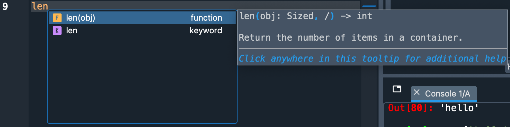
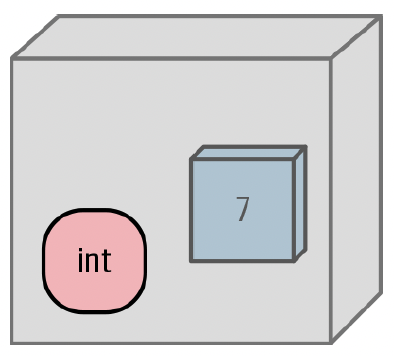
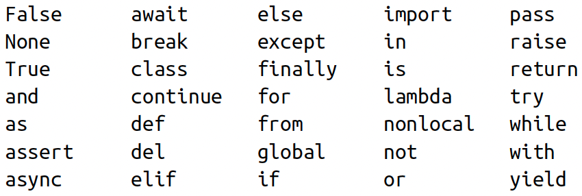
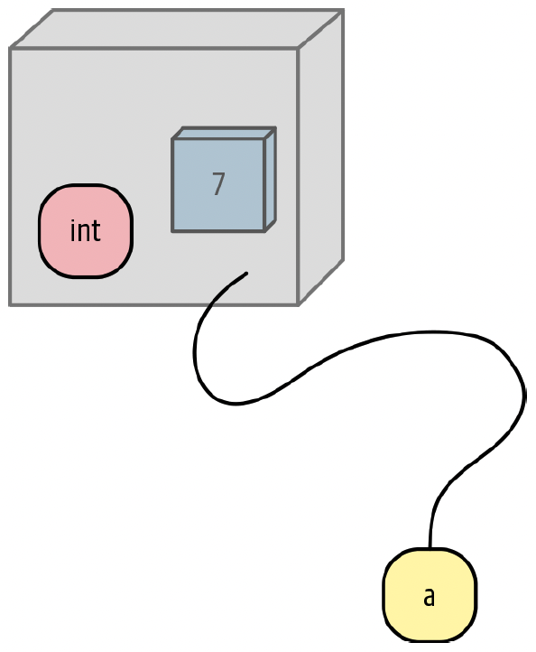
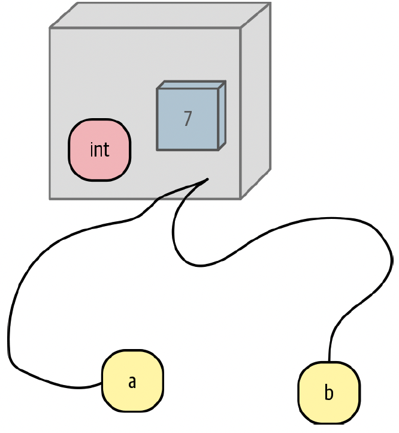
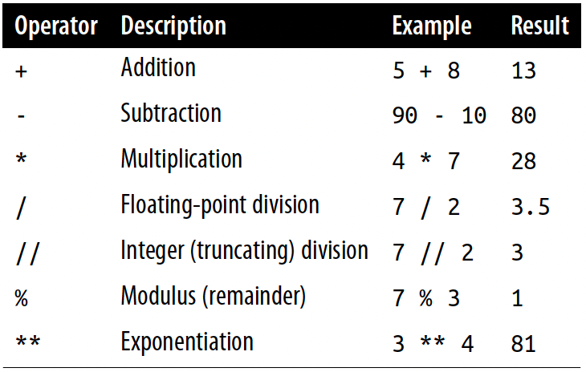

---
title: "Lecture 3"
subtitle: "DANL 100: Programming for Data Analytics"
author: "Byeong-Hak Choe"
institute: "SUNY Geneseo"
date: "Septermber 6, 2022"
output:
  xaringan::moon_reader:
    css: 
      - default
      - css/nhsr.css
      - css/nhsr-fonts.css
    lib_dir: libs
    seal: false
    nature:
      highlightStyle: googlecode
      highlightLines: true
      highlightLanguage: ["r"]
      countIncrementalSlides: false
      ratio: "16:9"
    includes:
      after_body: [css/insert-logo.html]
---

```{r setup, include = FALSE}
library(knitr)
library(kableExtra)
library(tidyverse)
library(NHSRtheme)
library(fontawesome)
# set default options
opts_chunk$set(echo = FALSE,
               fig.width = 7.252,
               fig.height = 4,
               comment = "#",
               dpi = 300)

knitr::knit_engines$set("markdown")

xaringanExtra::use_tile_view()
xaringanExtra::use_panelset()
xaringanExtra::use_clipboard()
xaringanExtra::use_webcam()
xaringanExtra::use_broadcast()
xaringanExtra::use_share_again()
xaringanExtra::style_share_again(
  share_buttons = c("twitter", "linkedin", "pocket")
)


xaringanExtra::use_extra_styles(
  hover_code_line = TRUE,         #<<
  mute_unhighlighted_code = TRUE  #<<
)

# uncomment the following lines if you want to use the NHS-R theme colours by default
# scale_fill_continuous <- partial(scale_fill_nhs, discrete = FALSE)
# scale_fill_discrete <- partial(scale_fill_nhs, discrete = TRUE)
# scale_colour_continuous <- partial(scale_colour_nhs, discrete = FALSE)
# scale_colour_discrete <- partial(scale_colour_nhs, discrete = TRUE)
```

class: title-slide, left, bottom

# `r rmarkdown::metadata$title`
----
## **`r rmarkdown::metadata$subtitle`**
### `r rmarkdown::metadata$author`
### `r rmarkdown::metadata$date`


---
# Announcement

### <p style="color:#00449E">Changes in Office Hours</p>

- Office: South Hall 117B.


- Office Hours: 
  - Mondays 3:30 PM-5:30 PM 
  - Wednesdays 1:30 PM-3:30 PM.


---
# Tips on using Presentation Slides

<!-- ### <p style="color:#00449E"></p> -->

- To go to a previous/next page (or tab), use keyboard arrows, `r fa("arrow-left")` and `r fa("arrow-right")`.

- To see a tile view of the lecture slides, use the alphabet key, `o`.

- If we hover a mouse cursor on the code block, we can see and click the "Copy Code".


---
class: inverse, center, middle

# Installing the Tools
<html><div style='float:left'></div><hr color='#EB811B' size=1px width=796px></html>


---
# Installing the Tools
### <p style="color:#00449E"> R programming </p>

The R language is available as a free download from the R Project website at:

- Windows: [https://cran.r-project.org/bin/windows/base/](https://cran.r-project.org/bin/windows/base/)

- Mac: [https://cran.r-project.org/bin/macosx/](https://cran.r-project.org/bin/macosx/)
  -  Download the file of R that corresponds to your Mac OS (Big Sur, Apple silicon arm64, High Sierra, El Capitan, Mavericks, etc.)


---
# Installing the Tools
### <p style="color:#00449E"> RStudio </p>

- **RStudio** offers a graphical interface to assist in creating R code:

  - The RStudio Desktop is available as a free download from the following webpage:
    - [https://www.rstudio.com/products/rstudio/download/#download](https://www.rstudio.com/products/rstudio/download/#download)


---
# Installing the Tools
### <p style="color:#00449E"> Excel </p>

- If you have not installed Microsoft Office on your computer, visit [software.geneseo.edu](https://wiki.geneseo.edu/display/cit/Software+at+Geneseo#SoftwareatGeneseo-MicrosoftOffice).

  - Download and install Microsoft Office from the software.geneseo.edu.


---
# Installing the Tools
### <p style="color:#00449E"> Anaconda </p>

- Anaconda is an all-in-one Python distribution.
  - Anaconda includes Python 3.x and its standard modules such as pip, pandas, matplotlib, etc.
  - Anaconda also includes several software applications of integrated development environment (IDE), which is a software for editing codes.
  - For the Python code, we will use **Spyder** IDE.  
    - Do not use RStudio from Anaconda, because RStudio from Anaconda is out-dated.

  
- To install Anaconda, go to the following download page:
  - [https://www.anaconda.com/products/distribution](https://www.anaconda.com/products/distribution).
  - Click the "Download" button.


---
# Installing the Tools
### <p style="color:#00449E"> Spyder Environment </p>
.pull-left[
```{r, echo=FALSE, out.width = '100%', fig.align='center'}
knitr::include_graphics("../lec_figs/spyder_env.png")
```
]

.pull-right[
- Red box is **Script Editor** where we can create, open and edit files.


]
---
# Installing the Tools
### <p style="color:#00449E"> Spyder Environment </p>
.pull-left[
```{r, echo=FALSE, out.width = '100%', fig.align='center'}
knitr::include_graphics("../lec_figs/spyder_env.png")
```
]

.pull-right[
- Blue box is **Console Pane** that allows us to interact directly with the Python interpreter and type commands where Python will immediately execute them.

]
---
# Installing the Tools
### <p style="color:#00449E"> Spyder Environment </p>
.pull-left[
```{r, echo=FALSE, out.width = '100%', fig.align='center'}
knitr::include_graphics("../lec_figs/spyder_env.png")
```
]

.pull-right[
- Yellow box is **Variable Explorer** where we can see the values of variables, data frames, and other objects that are currently stored in memory.
  - Double-clicking a variable will open a specialized viewer, allowing us to inspect its contents.


]


---
# Starting with Python
- Let's try a few commands to help you become familiar with Python and its basic data types.

.pull-left[
```{python, eval = F, echo = T}
1   # integer
1/2   # floats
'Joe'
"Joe"   # string
"Joe"=='Joe'   # boolean
```
]
.pull-right[

```{python, eval = F, echo = T}

(1, 2)    # tuple
("Apple", 'Orange')
len((1, 2))
vec = [1, 2]   # list
vec
```
]


---
class: inverse, center, middle

# Workflow
<html><div style='float:left'></div><hr color='#EB811B' size=1px width=796px></html>


---
# Workflow
### <p style="color:#00449E"> Shortcuts </p>
- **F9** runs a current line (where the blinking cursor bar is) or selected lines.

- **Home/End** moves the blinking cursor bar to the beginning/End of the line.

.pull-left[
### <p style="color:#00449E"> Mac </p>
- **command + N** opens a new script.
- **command + 1** is the shortcut for #.
- **command + 4** is the shortcut for block comment.
]

.pull-right[
### <p style="color:#00449E"> Windows </p>
- **Ctrl + N** opens a new script.
- **Ctrl + 1** is the shortcut for #.
- **Ctrl + 4** is the shortcut for block comment.
]


---
# Workflow


- **Ctrl** (**command** for Mac Users) **+ Z** undoes the previous action.
- **Ctrl** (**command** for Mac Users) **+ Shift + Z** redoes when undo is executed.


- **Ctrl** (**command** for Mac Users) **+ F** is useful when finding a phrase in the script.
- **Ctrl** (**command** for Mac Users) **+ R** is useful when replacing a specific phrase with something in the script.


- Auto-completion of command is sometimes useful.
  - Type `len` in the script in Spyder and wait for a second.
  
.pull-left[
```r
len
```
]
.pull-right[
```{r, echo=FALSE, out.width = '100%', fig.align='center'}

```

]


---
# Workflow
### <p style="color:#00449E"> Code and comment style </p>
- The two main principles for coding and managing data are:
  - Make things easier for your future self.
  - Don't trust your future self.

- The `#` mark is Spyder's comment character.
  - The `#` character has many names: `hash`, `sharp`, `pound`, or `octothorpe`.
  - `#` indicates that the rest of the line is to be ignored.
  - Write comments before the line that you want the comment to apply to.

- Consider using block commenting for separating code sections.
  - `#%%` defines a coding block in Spyder.

- Break down long lines and long algebraic expressions with backslash `\`.


---
# Workflow
### <p style="color:#00449E"> Parentheses, brackets and `...` </p>


- Parentheses/brackets must always come in a pair.
- If not, Console Pane will show you the continuation character `...:`:

```{python, eval = F, echo = T}
x = [1, 2
```

- The `...:` tells you that Python is waiting for more input; it doesn’t think you’re done yet. 


---
class: inverse, center, middle

# Management of Files, Directories, and Scripts
<html><div style='float:left'></div><hr color='#EB811B' size=1px width=796px></html>


---
# Management of Files, Directories, and Scripts
### <p style="color:#00449E"> Some materials for data </p>

- The following page has some materials of data files and R codes: [https://github.com/WinVector/PDSwR2](https://github.com/WinVector/PDSwR2).

.panelset[

.panel[.panel-name[Windows]

- **Step 1.** Go to your Download folder (or the folder where the downloaded file is saved) using the File Explorer.
- **Step 2.** Click the ZIP file.
- **Step 3.** Cut the file by using the shortcut (**Ctrl+X**).  
- **Step 4.** Go to your working directory (e.g., `DANL100` Folder  on Desktop) for the course using the File Explorer.
- **Step 5.** Paste the file to your working directory by using the shortcut (**Ctrl+V**).
- **Step 6.** Right-click the ZIP file and click "Extract ..."
]

 <!---->

.panel[.panel-name[Mac]

- **Step 1.** Go to your Download directory (or the directory where the downloaded file is saved) using the File Explorer.
- **Step 2.** Click the ZIP file (or the directory if the ZIP file is extracted).
- **Step 3.** Copy the file (or the directory) by using the shortcut (**command+C**).  
- **Step 4.** Go to your working directory (e.g., `DANL100` Folder  on Desktop) for the course using the Finder.
- **Step 5.** Paste the file (or the directory) to your working directory by using the shortcut (**command+option+V**).
- **Step 6.** Right-click the ZIP file and click "Extract ..."
] <!---->

] <!--end of panelset-->


---
# Management of Files and Directories
### <p style="color:#00449E"> Finding the path name of the file </p>

.panelset[

.panel[.panel-name[Windows 11]

- **Step 1.** Go to your folder using the File Explorer.
- **Step 2.** Right-click the file.
- **Step 3.** Click "Copy as path".
- **Step 4.** Paste the path name of the file to the R script (Ctrl+V).
- **Step 5.** 
  - *Option 1.* Replace backslash(`\`) with slash(`/`) in the path name.
  - *Option 2.* Replace backslash(`\`) with double-backslash(`\\`) in the path name.
]

 <!---->


.panel[.panel-name[Windows 10]

- **Step 1.** Go to your folder using the File Explorer.
- **Step 2.** Keep pressing the "Shift" key
- **Step 3.** Right-click the file.
- **Step 4.** Click "Copy as path".
- **Step 5.** Paste the path name of the file to the Python script in Spyder (Ctrl+V).
- **Step 6.** 
  - *Option 1.* Replace backslash(`\`) with slash(`/`) in the path name.
  - *Option 2.* Replace backslash(`\`) with double-backslash(`\\`) in the path name.
]

 <!---->

.panel[.panel-name[Mac]

- **Step 1.** Go to your folder using the Finder.
- **Step 2.** Right-click the file in the folder
- **Step 3.** Keep pressing "option"
- **Step 4.** Click "Copy 'PATH\_FOR\_YOUR\_FILE' as Pathname" from the menu.
- **Step 5.** Paste it to the the Python script in Spyder (command+V).

] <!---->

] <!--end of panelset-->


---
# Working with Data from Files

- Step 1. Find the path name for the file, `car.data.csv`, from the sub-folder, 'UCICar', in the folder, 'PDSwR2-main'.

- Step 2. In the code below, replace 'PATH_NAME_FOR_THE_FILE_car.data.csv' with the path name for the file, `car.data.csv`.

- Step 3. Run the following Python code:

```{python, eval = F, echo = T}
# importing the module 'pandas' using an alias 'pd'
import pandas as pd

# assigning 'path' to ...
path = 'PATH_NAME_FOR_THE_FILE_car.data.csv'

uciCar = pd.read_csv(path)    # reading data file
```


---
class: inverse, center, middle

# Data Types, Values, Variables, and Names
<html><div style='float:left'></div><hr color='#EB811B' size=1px width=796px></html>


---
# Data Types, Values, Variables, and Names
### <p style="color:#00449E"> Python Data Are Objects </p>

- Python keeps track of where data are, and what (data type) they are.

- Python wraps each data value---booleans, integers, floats, strings, even large data structures, functions, and programs---in memory as an **object**.

- We can think of **objects** in Python programming as variable-sized boxes occupying spaces on memory shelves:

```{r, echo=FALSE, out.width = '23%', fig.align='center'}

```


---
# Data Types, Values, Variables, and Names
### <p style="color:#00449E"> Python Data Are Objects </p>

- In Python, an object is a chunk of data that contains at least the following:

  - A **type** that defines what it can do, like a factory stamp on the box saying what it can do.
    - If a Python object is an integer, it has the type `int`,
and could be added to another `int`.
  - A **value** consistent with its type.
  - A **unique id** to distinguish it from other objects, like its location on the shelf.
  - A **reference count** that tracks how often this object is used.


---
# Data Types, Values, Variables, and Names
### <p style="color:#00449E"> Types </p>

.pull-left[
```{r, echo=FALSE, out.width = '100%', fig.align='center', fig.cap = "Python’s basic data types"}
knitr::include_graphics("../lec_figs/int-py-tab2-1.png")
```
]

.pull-right[
- The second column (Type) contains the Python name of that type. 

- The third column (Mutable?) indicates whether the value can be changed after creation.
]


---
# Data Types, Values, Variables, and Names
### <p style="color:#00449E"> Mutability </p>

- The type determines whether the data value contained by the box can be changed (mutable) or is constant (immutable).

  - A mutable object is like a box with a lid: not only can we see the value inside, we can also change it; 
  - However, we can’t change the type of an object.
  
  

---
# Data Types, Values, Variables, and Names
### <p style="color:#00449E"> Variables </p>

- Python lets you define **variables**---names for *values* in
your computer’s memory that you want to use in a program.
  
- Variable names can contain only these characters:
  - Lowercase letters (`a` through `z`)
  - Uppercase letters (`A` through `Z`)
  - Digits (`0` through `9`)
  - Underscore (`_`)
  - They are case-sensitive: `thing`, `Thing`, and `THING` are different names.
  - They must begin with a letter or an underscore, not a digit.
  - Names that begin with an underscore are treated specially.


---
# Data Types, Values, Variables, and Names
### <p style="color:#00449E"> Variables </p>

- Variable names cannot be one of Python’s reserved words (also known as *keywords*):

```{r, echo=FALSE, out.width = '55%', fig.align='center'}

```

- Within a Python program, we can find the reserved words with:
```{python, eval = F, echo = T}
help("keywords")
```


---
# Data Types, Values, Variables, and Names
### <p style="color:#00449E"> Variables </p>
.pull-left[
- Which names are valid?

  - `a`
  - `a1`
  - `a_b_c___95`
  - `_abc`
  - `_1a`
  - `1`
  - `1a`
  - `1_`
  - `name!`
  - `another-name`
]

.pull-right[
```{python, eval = F, echo = T}
a
a1
a_b_c___95
_abc
_1a
1
1a
1_
name!
another-name
```

]


---
# Data Types, Values, Variables, and Names
### <p style="color:#00449E"> Assignment </p>

- In Python, we use `=` to assign a value to a variable.

```{python, eval = F, echo = T}
# Here we assign the integer value 5 to the variable x.
x = 5   

# Now we can use the variable x in the next line.
y = x + 12  
y
```

- In math, `=` means *equality* of both sides.
- In programs, `=` means **assignment**: *assign the value on the right side to the variable on the left side*.


---
# Data Types, Values, Variables, and Names
### <p style="color:#00449E"> Assignment </p>


- In programs, everything on the right side needs to have a value.
  - The right side can be a literal value, or a variable that has already been assigned a value, or a combination.
  
- When Python reads `y = x + 12`, it does the following:
  - Sees the `=` in the middle.
  - Knows that this is an assignment.
  - Calculates the right side (gets the value of the object referred to by `x` and adds it to `12`).
  - Assigns the result to the left-side variable, `y`.


---
# Data Types, Values, Variables, and Names
### <p style="color:#00449E"> Variables Are Names, Not Places </p>

- In Python, *variables* are just names.


```{r, echo=FALSE, out.width = '30%', fig.align='center'}

```

- Names point to objects (variable `a` points to an integer object with value `7`)

---
# Data Types, Values, Variables, and Names
### <p style="color:#00449E"> Variables Are Names, Not Places </p>

- If we want to print the value of anything (a variable (e.g., `x`, `y`) or a literal value (e.g., `5`, `12`, `abcd`)), we can use `print(thing)` or type `thing`. 

- If we want to know the type of anything, we can use `type(anything)`. 

- If we want to check whether a variable points to an object of a specific type, use `isinstance(type)`:

.pull-left[

```{python, eval = F, echo = T}
type(7)
isinstance(7, int)
a = 7
print(a)
b = a
```
]
.pull-right[

```{python, eval = F, echo = T}
type(a)
type(b)
type(50)
type(99.9)
type('abcd')
```
]


---
# Data Types, Values, Variables, and Names
### <p style="color:#00449E"> Copying </p>

- Assignment does not copy a value; 
  - It just attaches a name to the object that contains the data.

- What value is *assigned* to variable `y` at the end of the following code?

```{python, eval = F, echo = T}
# Here we assign the integer value 5 to the variable x.
x = 5   

# Now we can use the variable x in the next line.
y = x + 12  
y

x = 8
```


---
# Data Types, Values, Variables, and Names
### <p style="color:#00449E"> Copying </p>

- Assigning an existing variable `a` to a new variable named `b`
just makes `b` point to the same object that `a` does.

```{r, echo=FALSE, out.width = '29%', fig.align='center', fig.cap="Copying a name (now variable `b` also points to the same integer object)"}

```


---
# Data Types, Values, Variables, and Names
### <p style="color:#00449E"> Copying </p>

- What value is *assigned* to variable `y` at the end of the following code?

```{python, eval = F, echo = T}
x = 5   
y = x 
x = 29
```


---
# Data Types, Values, Variables, and Names
### <p style="color:#00449E"> Copying </p>

- A **list** is a *mutable* array of values.

- In the code below, `a` and `b` each points to a list with three integer members:

```{python, eval = F, echo = T}
a = [2, 4, 6]
b = a
a[1] = 0
```

- List members (`a[0]`, `a[1]`, and `a[2]`) are themselves like names, pointing to integer objects with the values 2, 4, and 6.

- If both names point to a mutable object, we can change the object’s value via either name, and we’ll see the changed value when we use either name.


---
# Data Types, Values, Variables, and Names
### <p style="color:#00449E"> Choose Good Variable Names </p>

- It’s surprising how important it is to choose good names for your variables. 

- In many of the code examples so far, I’ve been using throwaway names like a and x. 

- In real programs, you’ll have many more variables to keep track of at once, and you’ll need to balance *brevity* and *clarity*. 

  - For example, it’s faster to type `num_loons` rather than `number_of_loons` or `gaviidae_inventory`, but it’s more explanatory than `n`.


---
# Data Types, Values, Variables, and Names
### <p style="color:#00449E"> Things to Do </p>
1. Assign the integer value 33 to the variable `queen`, and print it.

2. What type is the value `3`?

3. What type is the value `3.0`?

4. What type is the expression `8 + 3.0`?


---
class: inverse, center, middle

# Numbers
<html><div style='float:left'></div><hr color='#EB811B' size=1px width=796px></html>


---
# Numbers

- Let's look at the following Python’s simplest built-in data types in detail:

  - **Booleans** (which have the value `True` or `False`)
  - **Integers** (whole numbers such as `10` and `28`)
  - **Floats** (numbers with decimal points such as `3.141592`, or sometimes exponents like `1.0e8`, which means one times ten to the eighth power, or `100000000.0`)


---
# Numbers
### <p style="color:#00449E"> Booleans </p>

- The only values for the boolean data type are `True` and `False`.

- The special Python function `bool()` can convert any Python data
type to a boolean.
  - The `bool()` function takes any value as its argument and returns the boolean equivalent.
  
.pull-left[
```{python, eval = F, echo = T}
bool(True)
bool(1)
bool(4)
bool(-4)
```
]


.pull-right[
```{python, eval = F, echo = T}
bool(False)
bool(0)
bool(0.0)
```
]


---
# Numbers
### <p style="color:#00449E"> Integers </p>

- Any sequence of digits in Python represents *a literal integer*:

.pull-left[
- We can’t have an initial 0 followed by a digit between 1 and 9:
```{python, eval = F, echo = T}
0
01
```
]


.pull-right[
- We can’t have any commas as a digit separator in the integer.
- We can use the underscore (`_`) character as a digit separator
```{python, eval = F, echo = T}
1,000,000   # We get a tuple!
billion = 1_000_000_000
billion
3_2_1
```

]


---
# Numbers
### <p style="color:#00449E"> Integer Operations </p>

.pull-left[
- Python can be a simple calculator.

- Here is a table of the math operators:

```{r, echo=FALSE, out.width = '29%', fig.align='center'}

```

]
.pull-right[
- Dividing by zero with either kind of division causes a Python exception

```{python, eval = F, echo = T}
12 + 8
12 - 8
13 * 1.2
(12.3895 * 1.05) * 1.2
2 / 0
2 // 0
```
]


---
# Numbers
### <p style="color:#00449E"> Integers and Variables </p>

- In Python, the expression on the right side of the `=` is calculated first, and then assigned to the variable on the left side.


.pull-left[
- Subtract `2` from `a`.
- Assign the result of that subtraction to a temporary variable, `tmp`.
- Assign the value of the temporary variable to `a`.

]
.pull-right[

```{python, eval = F, echo = T}
a = 72
tmp = a - 2
a = tmp
```
]


---
# Numbers
### <p style="color:#00449E"> Integers and Variables </p>

- We can combine the arithmetic operators with assignment by putting the operator before the `=`.


.pull-left[
```{python, eval = F, echo = T}
a = 72
a -= 2   # This is like a = a - 2
```

]

.pull-right[
```{python, eval = F, echo = T}
b = 62
b += 2    # This is like b = b + 2
```
]

.pull-left[
```{python, eval = F, echo = T}
c = 72
c *= 2   # This is like c = c * 2
```

]

.pull-right[
```{python, eval = F, echo = T}
d = 62
d /= 2    # This is like d = d / 2
```

]


---
# Numbers
### <p style="color:#00449E"> Type Conversions </p>

- To change other Python data types to an integer, use the `int()` function.
  - `int()` keeps the whole number and discard any fractional part.

- `True` and `False` are converted to integer values `1` and `0`.

.pull-left[
```{python, eval = F, echo = T}
int(True)
int(False)
```

]

.pull-right[
```{python, eval = F, echo = T}
bool(1)
bool(0)
```
]

.pull-left[
```{python, eval = F, echo = T}
int(72.3)
int(1.0e4)
```

]

.pull-right[
```{python, eval = F, echo = T}
bool(1.0)
bool(0.0)
```

]


---
# Numbers
### <p style="color:#00449E"> Floats </p>

- Integers are whole numbers, but floating-point numbers (called **floats** in Python) have decimal points:


.pull-left[
```{python, eval = F, echo = T}
4.
4.0
04.0
```

]

.pull-right[
```{python, eval = F, echo = T}
4e0
4e1
4.0e1
4.0 * (10 ** 1)
```
]

---
# Numbers
### <p style="color:#00449E"> Floats </p>

- To convert other types to floats, we use the `float()` function.

.pull-left[
```{python, eval = F, echo = T}
float(True)
float(False)
```

]

.pull-right[
```{python, eval = F, echo = T}
float(88)
float('89')
```
]


---
# Numbers
### <p style="color:#00449E"> Things to Do </p>
1. Multiply the number of seconds in a minute (`60`) by the number of minutes in an hour (also `60`) using Python as a calculator.

2. Assign the result from the previous task (seconds in an hour) to a variable called `seconds_per_hour`.

3. How many seconds are in a day? Use your `seconds_per_hour` variable.

4. Calculate seconds per day again, but this time save the result in a variable called `seconds_per_day`

5. Divide `seconds_per_day` by `seconds_per_hour`. Use floating-point (`/`) division.

