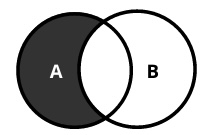

```{r setup, include = FALSE}
library(knitr)
library(kableExtra)
library(tidyverse)
library(NHSRtheme)
library(fontawesome)
# set default options
opts_chunk$set(echo = FALSE,
               fig.width = 7.252,
               fig.height = 4,
               comment = "#",
               dpi = 300)

knitr::knit_engines$set("markdown")

xaringanExtra::use_tile_view()
xaringanExtra::use_panelset()
xaringanExtra::use_clipboard()
xaringanExtra::use_webcam()
xaringanExtra::use_broadcast()
xaringanExtra::use_share_again()
xaringanExtra::style_share_again(
  share_buttons = c("twitter", "linkedin", "pocket")
)


xaringanExtra::use_extra_styles(
  hover_code_line = TRUE,         #<<
  mute_unhighlighted_code = F  #<<
)

# uncomment the following lines if you want to use the NHS-R theme colours by default
# scale_fill_continuous <- partial(scale_fill_nhs, discrete = FALSE)
# scale_fill_discrete <- partial(scale_fill_nhs, discrete = TRUE)
# scale_colour_continuous <- partial(scale_colour_nhs, discrete = FALSE)
# scale_colour_discrete <- partial(scale_colour_nhs, discrete = TRUE)
```

class: title-slide, left, bottom

# `r rmarkdown::metadata$title`
----
## **`r rmarkdown::metadata$subtitle`**
### `r rmarkdown::metadata$author`
### `r rmarkdown::metadata$date`

---
# Announcement

### <p style="color:#00449E"> Tutoring and TA-ing Schedules </p>

- Marcie Hogan (Tutor):
  1. Sunday, 2:00 PM--5:00 PM 
  2. Wednesday, 12:30 PM--1:30 PM


- Andrew Mosbo (Tutor): 
  1. Mondays, 4:00 PM--5:00 PM
  2. Wednesdays, 11:00 A.M.--noon
  3. Thursdays, 5:00 PM--6:00 PM


- Emine Morris (TA): 
  1. Mondays and Wednesdays, 5:00 PM--6:30 PM
  2. Tuesdays and Thursdays, 3:00 PM--4:45 PM

---
# Workflow
### <p style="color:#00449E"> Shortcuts </p>
- **F9** runs a current line (where the blinking cursor bar is) or selected lines.

- **Home/End** moves the blinking cursor bar to the beginning/end of the line.
  - **Fn + ** `r fa("arrow-left")` / `r fa("arrow-right")` works too.

- **PgUp/PgDn** moves the blinking cursor bar to the top/bottom line of the script on the screen. 
  - **Fn + ** `r fa("arrow-up")` / `r fa("arrow-down")` works too.


---
# Workflow
### <p style="color:#00449E"> Shortcuts </p>

.pull-left[
### <p style="color:#00449E"> Mac </p>
- **command + N** opens a new script.
- **command + 1** is the shortcut for `#`.
- **command + 4** is the shortcut for block comment.
]

.pull-right[
### <p style="color:#00449E"> Windows </p>
- **Ctrl + N** opens a new script.
- **Ctrl + 1** is the shortcut for `#`.
- **Ctrl + 4** is the shortcut for block comment.
]

- `# %%` defines a coding block in Spyder IDE.

---
# Workflow
### <p style="color:#00449E"> More Shortcuts </p>


- **Ctrl** (**command** for Mac Users) **+ Z** undoes the previous action.
- **Ctrl** (**command** for Mac Users) **+ Shift + Z** redoes when undo is executed.


- **Ctrl** (**command** for Mac Users) **+ F** is useful when finding a phrase in the script.
- **Ctrl** (**command** for Mac Users) **+ R** is useful when replacing a specific phrase with something in the script.


- **Ctrl** (**command** for Mac Users) **+ D** deletes a current line.


---
class: inverse, center, middle

# Choose with `if`
<html><div style='float:left'></div><hr color='#EB811B' size=1px width=796px></html>


---
# Choose with `if`
### <p style="color:#00449E"> `if`-`else` statement </p>

- The `if` and `else` lines are Python *statements* that check whether a condition is a boolean `True` value, or can be evaluated as `True`.

```{python, eval = F, echo = T}
disaster = True
if disaster:
    print("Woe!")
else:
    print("Whee!")
```

  - The recommended style is to use *four* spaces before the statement below `if`/`else`.


---
# Choose with `if`
### <p style="color:#00449E"> Compare with `if`, `elif`, and `else` </p>

If there are more than two possibilities to test, use `if` for the first, `elif` (meaning *else if*) for the middle ones, and `else` for the last:
```{python, eval = F, echo = T}
color = "mauve"
if color == "red":
    print("It's a rasberry")
elif color == "green":
    print("It's a green chili")
elif color == "bee purple":
    print("I don't know what it is, but only bees can see it")
else:
    print("I've never heard of the color", color)
```


---
# Choose with `if`
### <p style="color:#00449E"> Compare with `if`, `elif`, and `else` </p>

- Indentation determines how the `if` and `else` sections are paired.

```{python, eval = F, echo = T}
furry = True
large = True
if furry:
    if large:
        print("It's a yeti.")
    else:
        print("It's a cat!")
else:
    if large:
        print("It's a whale!")
    else:
        print("It's a human. Or a hairless cat.")
```


---
# Choose with `if`
### <p style="color:#00449E"> Comparison Operators </p>

- Here are Python's comparison operators:

```{r, echo=FALSE, out.width = '24%', fig.align='center'}
knitr::include_graphics("../lec_figs/int-py-ch4-comparison.png")
```


---
# Choose with `if`
### <p style="color:#00449E"> Comparison Operators </p>

- Here are Python's comparison operators:

```{python, eval = F, echo = T}
# Assign x to 7
x = 7

x == 5    # Test equality
x == 7
5 < x
x < 10
```

---
# Choose with `if`
### <p style="color:#00449E"> Boolean Operator </p>

- The shaded regions show which parts each Boolean operator (**and**, **or**, **not**) selects.


.panelset[
.panel[.panel-name[and]
.left-column[
```{r, echo=FALSE, out.width = '100%', fig.align='center'}

```
]

.right-column[
- *A* **and** *B* is `True` if both *A* and *B* statements are `True`.

- *A* **and** *B* is `False` otherwise.

]
]


.panel[.panel-name[or]
.left-column[
```{r, echo=FALSE, out.width = '100%', fig.align='center'}

```
]

.right-column[
- *A* **or** *B* is `True` if either *A* or *B* statement is `True`.

- *A* **or** *B* is `False` otherwise.

]

]


.panel[.panel-name[and not]
.left-column[
```{r, echo=FALSE, out.width = '100%', fig.align='center'}

```
]

.right-column[

- *A* **and not** *B* is `True` if *A* statement is `True` and *B* statement is `False`.

- *A* **and not** *B* is `False` otherwise.

]
]
]
---
# Choose with `if`
### <p style="color:#00449E"> Comparison Operators </p>

- Logical operators have lower *precedence* than the chunks of code that they’re comparing.

  -  This means that the chunks are calculated first, and then compared.


```{python, eval = F, echo = T}
5 < x and x < 10
```

- The easiest way to avoid confusion about *precedence* is to add parentheses:

```{python, eval = F, echo = T}
(5 < x) and (x < 10)
```


---
# Choose with `if`
### <p style="color:#00449E"> Comparison Operators </p>

- Here are some other tests:
```{python, eval = F, echo = T}
5 < x or x < 10
5 < x and x > 10
5 < x and not x > 10
```

- If you’re `and`-ing multiple comparisons with one variable, Python lets you do this:
```{python, eval = F, echo = T}
5 < x < 10      # It’s the same as 5 < x and x < 10
```


---
# Choose with `if`
### <p style="color:#00449E"> What Is `True`? </p>

- What does Python consider `True` and `False`?


- A `False` value doesn’t necessarily need to explicitly be a boolean `False`. 
  - The followings are all considered `False`:
  
.pull-left[
```{r, echo=FALSE, out.width = '36%', fig.align='center'}
knitr::include_graphics("../lec_figs/int-py-ch4-false1.png")
```
]
.pull-right[
```{r, echo=FALSE, out.width = '36%', fig.align='center'}
knitr::include_graphics("../lec_figs/int-py-ch4-false2.png")
```
]


- Anything else is considered `True`.


---
# Choose with `if`
### <p style="color:#00449E"> What Is `True`? </p>
- Python programs use these definitions of "truthiness" and "falsiness" to check for empty data structures as well as `False` conditions:

```{python, eval = F, echo = T}
some_list = []
if some_list:
    print("There's something in here")
else:
    print("Hey, it's empty!")
```


---
# Choose with `if`
### <p style="color:#00449E"> Do Multiple Comparisons with `in` </p>
- Suppose that you have a letter and want to know whether it’s a vowel. 
  - One way would be to write a long `if` statement:
  
```{python, eval = F, echo = T}
letter = 'o'
if letter == 'a' or letter == 'e' or letter == 'i' \
    or letter == 'o' or letter == 'u':
    print(letter, 'is a vowel')
else:
    print(letter, 'is not a vowel')
```


---
# Choose with `if`
### <p style="color:#00449E"> Do Multiple Comparisons with `in` </p>
- Whenever you need to make a lot of comparisons like that, separated by or, use Python’s *membership operator* `in`, instead.
  
```{python, eval = F, echo = T}
vowels = 'aeiou'
letter = 'o'

letter in vowels

if letter in vowels:
    print(letter, 'is a vowel')
```


---
# Choose with `if`
### <p style="color:#00449E"> Do Multiple Comparisons with `in` </p>
- Here are some examples of how to use `in` with some data types:

.panelset[

.panel[.panel-name[Set]
```{python, eval = F, echo = T}
letter = 'o'
vowel_set = {'a', 'e', 'i', 'o', 'u'}
letter in vowel_set
```
]

.panel[.panel-name[List]
```{python, eval = F, echo = T}
vowel_list = ['a', 'e', 'i', 'o', 'u']
letter in vowel_list
```
]

.panel[.panel-name[Tuple]
```{python, eval = F, echo = T}
vowel_tuple = ('a', 'e', 'i', 'o', 'u')
letter in vowel_tuple
```
]

.panel[.panel-name[Dictionary]
```{python, eval = F, echo = T}
vowel_dict = {'a': 'apple', 'e': 'elephant',
              'i': 'impala', 'o': 'ocelot', 
              'u': 'unicorn'}
letter in vowel_dict
```
- For the dictionary, `in` looks at the keys (the left-hand side of the `:`) instead of their values.
]

.panel[.panel-name[String]
```{python, eval = F, echo = T}
vowel_string = "aeiou"
letter in vowel_string
```
]

]


---
# Choose with `if`
### <p style="color:#00449E"> Walrus Operator </p>

- The *walrus operator* looks like this:

```{r, echo=FALSE, out.width = '24%', fig.align='center'}
knitr::include_graphics("../lec_figs/int-py-ch5-walrus.png")
```


.panelset[

.panel[.panel-name[Two-step assignments]
```{python, eval = F, echo = T}
tweet_limit = 280
tweet_string = "Blah" * 50
diff = tweet_limit - len(tweet_string)
if diff >= 0:
    print("A fitting tweet")
else:
    print("Went over by", abs(diff))
```
]

.panel[.panel-name[Walrus]
```{python, eval = F, echo = T}
tweet_limit = 280
tweet_string = "Blah" * 50
if ( diff := tweet_limit - len(tweet_string) ) >= 0:
    print("A fitting tweet")
else:
    print("Went over by", abs(diff))
```
]


]


---
# Choose with `if`
### <p style="color:#00449E"> Class Exercises </p>
1. Choose a number between 1 and 10 and assign it to the variable `secret`. Then, select another number between 1 and 10 and assign it to the variable `guess`. Next, write the conditional tests (`if`, `else`, and `elif`) to print the string '`too low`' if `guess` is less than `secret`, '`too high`' if greater than `secret`, and '`just right`' if equal to `secret`.

2. Assign `True` or `False` to the variables `small` and `green`, respectively. Write some `if`/`else` statements to print which of these matches those choices: `cherry`, `pea`, `watermelon`, `pumpkin`.


---
class: inverse, center, middle

# Text Strings
<html><div style='float:left'></div><hr color='#EB811B' size=1px width=796px></html>

---
# Text Strings
### <p style="color:#00449E">  </p>

- Data scientists often work with *strings* of text.

- Strings in Python are immutable. 
  - We can’t change a string in place, but we can copy parts of strings to another string to get the same effect.


---
# Text Strings
### <p style="color:#00449E"> Create with Quotes </p>

- We make a Python string by enclosing characters in matching single or double quotes:

```{python, eval = F, echo = T}
'Business'
"Data"
```

- The Console (interactive interpreter) echoes strings with a single quote, but all are treated exactly the same by Python.


---
# Text Strings
### <p style="color:#00449E"> Create with Quotes </p>

- Why have two kinds of quote characters?
  - The main purpose is to create strings containing quote characters. 
  - We can have single quotes inside double-quoted strings, or double quotes inside single-quoted strings.

```{python, eval = F, echo = T}
"'Nay!' said the naysayer. 'Neigh?' said the horse."

'The rare double quote in captivity: ".'

'A "two by four" is actually 1 1⁄2" × 3 1⁄2".'

"'There's the man that shot my paw!' cried the limping hound."
```


---
# Text Strings
### <p style="color:#00449E"> Create with Quotes </p>

- We can also use three single quotes (''') or three double quotes ("""):
```{python, eval = F, echo = T}
'''Hi!'''
"""Hello!"""
```

- The most common use of triple quotes is to create multiline strings:
```{python, eval = F, echo = T}
poem_bluebird = '''there’s a bluebird in my heart that
wants to get out
but I’m too tough for him,
I say, stay in there, I’m not going
to let anybody see
you.'''
```


---
# Text Strings
### <p style="color:#00449E"> Create with Quotes </p>
- There’s a difference between the output of `print()` and the automatic echoing done by the interactive interpreter:
```{python, eval = F, echo = T}
poem_bluebird
print(poem_bluebird)
print('Give', "us", '''some''', """space""")
```
- `print()` strips quotes from strings and prints their contents.     - It’s meant for human output.


---
# Text Strings
### <p style="color:#00449E"> Create with `str()` </p>

- We can make a string from another data type by using the `str()` function:
```{python, eval = F, echo = T}
str(3.141592)
str(1.0e4)
str(True)
```


---
# Text Strings
### <p style="color:#00449E"> Escape with `\` </p>
- Python lets us escape the meaning of some characters within strings to achieve effects that would otherwise be difficult to express. 
  - By preceding a character with a backslash (`\`), we give it a special meaning. 

- The most common escape sequence is `\n`, which means to begin a new line. 
  - With this we can create multiline strings from a one-line string:

```{python, eval = F, echo = T}
palindrome = 'A man,\nA plan,\nA canal:\nPanama.'
print(palindrome)
```


---
# Text Strings
### <p style="color:#00449E"> Escape with `\` </p>


.panelset[
.panel[.panel-name[\t]

- The escape sequence `\t` (tab) is used to align text:

```{python, eval = F, echo = T}
print('\tabc')
print('a\tbc')
print('ab\tc')
print('abc\t')
```

]

.panel[.panel-name[`\'` or `\"`]

- We might also need `\'` or `\"` to specify a literal single or double quote inside a string that’s quoted by the same character:

```{python, eval = F, echo = T}
testimony = "\"I did nothing!\" he said. \"Or that other thing.\""
testimony
print(testimony)
```

]

.panel[.panel-name[`\\\`]
- If we need a literal backslash (`\`), type two of them (the first escapes the second):
```{python, eval = F, echo = T}
speech = 'The backslash (\\) bends over backwards to please you.'
print(speech)
```
]


.panel[.panel-name[`r`]
- A raw string (`r`) negates these escapes:
```{python, eval = F, echo = T}
info = r'Type a \n to get a new line in a normal string'
info
```
- A raw string does not undo any real (not `\n`) newlines:
```{python, eval = F, echo = T}
poem = r'''Boys and girls, come out to play.
The moon doth shine as bright as day.'''
poem
print(poem)
```

]

]


---
# Text Strings
### <p style="color:#00449E"> Combine by Using `+` </p>

- We can combine literal strings or string variables in Python by using the `+` operator:
```{python, eval = F, echo = T}
'DANL 100: Programming for ' + 'Data Analytics'
```

- We can also combine literal strings (not string variables) just by having one after the other:
```{python, eval = F, echo = T}
'DANL 100: Programming for ' 'Data Analytics'
```


---
# Text Strings
### <p style="color:#00449E"> Duplicate with `*` </p>
- We use the `*` operator to duplicate a string. 
```{python, eval = F, echo = T}
start = 'Na ' * 4 + '\n'
middle = 'Hey ' * 3 + '\n'
end = 'Goodbye.'
print(start + start + middle + end)
```


---
# Text Strings
### <p style="color:#00449E"> Get a Character with `[]` </p>

- To get a single character from a string, specify its *offset* inside square brackets after the string’s name. 

  - The first (leftmost) offset is 0, the next is 1, and so on. 
  - The last (rightmost) offset can be specified with –1, so you don’t have to count; going to the left are –2, –3, and so on:
  
```{python, eval = F, echo = T}
letters = 'abcdefghijklmnopqrstuvwxyz'
letters[0]
letters[1]
letters[-1]
letters[5]
letters[100]
```


---
# Text Strings
### <p style="color:#00449E"> Get a Character with `[]` </p>

- Because strings are immutable, we can’t insert a character directly into one or change the character at a specific index.
  
```{python, eval = F, echo = T}
name = 'Macintosh'
name[0] = 'P'
```

- Instead, we need to use some combination of string functions such as `replace()` or a *slice* (which we look at in a moment):
```{python, eval = F, echo = T}
name = 'Macintosh'
name.replace('M', 'P')
'P' + name[1:]
```


---
# Text Strings
### <p style="color:#00449E"> Get a Substring with a Slice </p>

- We can extract a substring (a part of a string) from a string by using a **slice**. 

- We define a slice by using square brackets (`[]`), a *start* offset, an *end* offset, and an optional *step* count between them. 

  - We can omit some of these. 

- The slice will include characters from offset *start* to one before *end*:


---
# Text Strings
### <p style="color:#00449E"> Get a Substring with a Slice </p>


.panelset[
.panel[.panel-name[`[:]`]
- `[:]` extracts the entire sequence from start to end.
```{python, eval = F, echo = T}
letters = 'abcdefghijklmnopqrstuvwxyz'
letters[:]
```
]

.panel[.panel-name[`[ start :]`]
- `[ start :]` specifies from the *start* offset to the end.
```{python, eval = F, echo = T}
letters = 'abcdefghijklmnopqrstuvwxyz'
letters[20:]
letters[10:]
letters[-3:]
letters[-50:]
```
]

.panel[.panel-name[`[: end ]`]
- `[: end ]` specifies from the beginning to the *end* offset minus 1.
```{python, eval = F, echo = T}
letters = 'abcdefghijklmnopqrstuvwxyz'
letters[:3]
letters[:-3]
letters[:70]
```
]


.panel[.panel-name[`[ start : end ]`]
- `[ start : end ]` indicates from the *start* offset to the *end* offset minus 1.
```{python, eval = F, echo = T}
letters = 'abcdefghijklmnopqrstuvwxyz'
letters[12:15]
letters[-51:-50]
letters[70:71]
```
]

.panel[.panel-name[`[ start : end : step ]`]
- `[ start : end : step ]` extracts from the *start* offset to the *end* offset minus 1, skipping characters by *step*.
```{python, eval = F, echo = T}
letters = 'abcdefghijklmnopqrstuvwxyz'
letters[4:20:3]   # From offset 4 to 20, by steps of 3 characters
letters[::7]      # From the start to the end, in steps of 7 characters
letters[19::4]    # From offset 19 to the end, by 4
letters[:21:5]    # From the start to offset 20 by 5:
letters[-1::-1]   # Starts at the end and ends at the start
letters[::-1]
```
]

]


- Offsets go 0, 1, and so on from the start to the right.
- Offsets go –1,–2, and so forth from the end to the left.


---
# Text Strings
### <p style="color:#00449E"> String-related Functions </p>

.panelset[
.panel[.panel-name[`len()`]
### Get Length with `len()`
- The `len()` function counts characters in a string:
```{python, eval = F, echo = T}
len(letters)
empty = ""
len(empty)
```
]
.panel[.panel-name[`split()`]
### Split with `split()`
- We can use the built-in string `split()` function to break a string into a list of smaller strings based on some *separator*.
  - If we don’t specify a *separator*, `split()` uses any sequence of white space characters---newlines, spaces, and tabs:
```{python, eval = F, echo = T}
tasks = 'get gloves,get mask,give cat vitamins,call ambulance'
tasks.split(',')
tasks.split()
```
]
.panel[.panel-name[`join()`]
### Combine by Using `join()`
- `join()` collapses a *list* of strings into a single string.
```{python, eval = F, echo = T}
crypto_list = ['Yeti', 'Bigfoot', 'Loch Ness Monster']
crypto_string = ', '.join(crypto_list)
print('Found and signing book deals:', crypto_string)
```
]
.panel[.panel-name[`replace()`]
### Substitute by Using `replace()`
- We use `replace()` for simple substring substitution.
```{python, eval = F, echo = T}
setup = "a duck goes into a bar..."
setup.replace('duck', 'marmoset')
setup
setup.replace('a ', 'a famous ', 100) # Change up to 100 of them
setup.replace('a', 'a famous', 100) # If we're unsure the exact substring
```
]
.panel[.panel-name[`strip()`]
### Strip with `strip()`
- The `strip()` functions assume that we want to get rid of whitespace characters (`' '`, `'\t'`, `'\n'`) if we don’t give them an argument. 
- `strip()` strips both ends, `lstrip()` only from the left, and `rstrip()` only from the right. 
```{python, eval = F, echo = T}
world = " earth "
world.strip()
world.lstrip()
world.rstrip()
```
]

.panel[.panel-name[`strip()`]
### Strip with `strip()`
- We can also tell `strip()` to remove any character in a multicharacter string:
```{python, eval = F, echo = T}
world = " earth "
world.strip(' ')
world.strip('!')

blurt = "What the...!!?"
blurt.strip('.?!')
```
]
.panel[.panel-name[`count()`]
### Count with `count()`
- How many times does the three-letter sequence *the* occur?
```{python, eval = F, echo = T}
poem = '''All that doth flow we cannot liquid name
Or else would fire and water be the same;
But that is liquid which is moist and wet
Fire that property can never get.
Then 'tis not cold that doth the fire put out
But 'tis the wet that makes it die, no doubt.'''
word = 'the'
poem.count(word)
```
]


]


---
# Text Strings
### <p style="color:#00449E"> Case and Allignment </p>
- We have more built-in functions for case and allignment:
```{python, eval = F, echo = T}
setup = 'a duck goes into a bar...'

setup.capitalize()    # Capitalize the first word
setup.title()    # Capitalize all the words
setup.upper()    # Convert all characters to uppercase
setup.lower()    # Convert all characters to lowercase
setup.swapcase()    # Swap uppercase and lowercase

setup.center(30)    # Center the string within 30 spaces
setup.ljust(30)    # Left justify
setup.rjust(30)    # Right justify
```


---
# Text Strings
### <p style="color:#00449E"> Formatting </p>
- We’ve seen that we can concatenate strings by using `+`.

- Let’s look at how to *interpolate* data values into strings using *f-strings* formats.

  - *f-strings* appeared in Python 3.6, and are now the recommended way of formatting strings.
  
  - There exists an old style of string formatting with `%` and a new style of it with `{}`, which we may not discuss here.
  
  
  

---
# Text Strings
### <p style="color:#00449E"> Formatting </p>
  
- To make an f-string:

  - Type the letter *f* or *F* directly before the initial quote.
  - Include variable names or expressions within curly brackets (*{}*) to get their values into the string.

```{python, eval = F, echo = T}
thing = 'wereduck'
place = 'werepond'
f'The {thing} is in the {place}'
f'The {thing.capitalize()} is in the {place.rjust(20)}'
```


