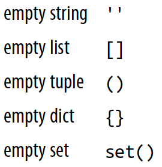

```{r setup, include = FALSE}
library(knitr)
library(kableExtra)
library(tidyverse)
library(NHSRtheme)
library(fontawesome)
# set default options
opts_chunk$set(echo = FALSE,
               fig.width = 7.252,
               fig.height = 4,
               comment = "#",
               dpi = 300)

knitr::knit_engines$set("markdown")

xaringanExtra::use_tile_view()
xaringanExtra::use_panelset()
xaringanExtra::use_clipboard()
xaringanExtra::use_webcam()
xaringanExtra::use_broadcast()
xaringanExtra::use_share_again()
xaringanExtra::style_share_again(
  share_buttons = c("twitter", "linkedin", "pocket")
)


xaringanExtra::use_extra_styles(
  hover_code_line = TRUE,         #<<
  mute_unhighlighted_code = F  #<<
)

# uncomment the following lines if you want to use the NHS-R theme colours by default
# scale_fill_continuous <- partial(scale_fill_nhs, discrete = FALSE)
# scale_fill_discrete <- partial(scale_fill_nhs, discrete = TRUE)
# scale_colour_continuous <- partial(scale_colour_nhs, discrete = FALSE)
# scale_colour_discrete <- partial(scale_colour_nhs, discrete = TRUE)
```

class: title-slide, left, bottom

# `r rmarkdown::metadata$title`
----
## **`r rmarkdown::metadata$subtitle`**
### `r rmarkdown::metadata$author`
### `r rmarkdown::metadata$date`

---
# Announcement

### <p style="color:#00449E"> </p>

  

---
class: inverse, center, middle

# Workflow
<html><div style='float:left'></div><hr color='#EB811B' size=1px width=796px></html>


---
# Workflow
### <p style="color:#00449E"> Shortcuts </p>
- **F9** runs a current line (where the blinking cursor bar is) or selected lines.

- **Home/End** moves the blinking cursor bar to the beginning/end of the line.
  - **Fn + ** `r fa("arrow-left")` / `r fa("arrow-right")` works too.

- **PgUp/PgDn** moves the blinking cursor bar to the top/bottom line of the script on the screen. 
  - **Fn + ** `r fa("arrow-up")` / `r fa("arrow-down")` works too.


---
# Workflow
### <p style="color:#00449E"> Shortcuts </p>

.pull-left[
### <p style="color:#00449E"> Mac </p>
- **command + N** opens a new script.
- **command + 1** is the shortcut for #.
- **command + 4** is the shortcut for block comment.
]

.pull-right[
### <p style="color:#00449E"> Windows </p>
- **Ctrl + N** opens a new script.
- **Ctrl + 1** is the shortcut for #.
- **Ctrl + 4** is the shortcut for block comment.
]


---
# Workflow
### <p style="color:#00449E"> More Shortcuts </p>


- **Ctrl** (**command** for Mac Users) **+ Z** undoes the previous action.
- **Ctrl** (**command** for Mac Users) **+ Shift + Z** redoes when undo is executed.


- **Ctrl** (**command** for Mac Users) **+ F** is useful when finding a phrase in the script.
- **Ctrl** (**command** for Mac Users) **+ R** is useful when replacing a specific phrase with something in the script.


- **Ctrl** (**command** for Mac Users) **+ D** deletes a current line.


---
# Workflow
### <p style="color:#00449E"> Code and comment style </p>
- The two main principles for coding and managing data are:
  - Make things easier for your future self.
  - Don't trust your future self.


- The `#` mark is Spyder's comment character.
  - The `#` character has many names: `hash`, `sharp`, `pound`, or `octothorpe`.
  - `#` indicates that the rest of the line is to be ignored.
  - Write comments before the line that you want the comment to apply to.


- Consider using block commenting for separating code sections.
  - `# %%` defines a coding block in Spyder.

<!-- - Break down long lines and long algebraic expressions with backslash `\`. -->


---
class: inverse, center, middle

# Choose with `if`
<html><div style='float:left'></div><hr color='#EB811B' size=1px width=796px></html>


---
# Choose with `if`
### <p style="color:#00449E"> Compare with `if`, `elif`, and `else` </p>

- The `if` and `else` lines are Python *statements* that check whether a condition is a boolean `True` value, or can be evaluated as `True`.

```{python, eval = F, echo = T}
disaster = True
if disaster:
    print("Woe!")
else:
    print("Whee!")
```


---
# Choose with `if`
### <p style="color:#00449E"> Compare with `if`, `elif`, and `else` </p>

- Indentation determines how the `if` and `else` sections are paired.
  - The recommended style is to use *four* spaces.

```{python, eval = F, echo = T}
furry = True
large = True
if furry:
    if large:
        print("It's a yeti.")
    else:
        print("It's a cat!")
else:
    if large:
        print("It's a whale!")
    else:
        print("It's a human. Or a hairless cat.")
```


---
# Choose with `if`
### <p style="color:#00449E"> Compare with `if`, `elif`, and `else` </p>

If there are more than two possibilities to test, use `if` for the first, `elif` (meaning *else if*) for the middle ones, and `else` for the last:
```{python, eval = F, echo = T}
color = "mauve"
if color == "red":
    print("It's a rasberry")
elif color == "green":
    print("It's a green chili")
elif color == "bee purple":
    print("I don't know what it is, but only bees can see it")
else:
    print("I've never heard of the color", color)
```


---
# Choose with `if`
### <p style="color:#00449E"> Comparison Operators </p>

- Here are Python's comparison operators:

```{r, echo=FALSE, out.width = '24%', fig.align='center'}
knitr::include_graphics("../lec_figs/int-py-ch4-comparison.png")
```


---
# Choose with `if`
### <p style="color:#00449E"> Comparison Operators </p>

- Here are Python's comparison operators:

```{python, eval = F, echo = T}
# Assign x to 7
x = 7

x == 5    # Test equality
x == 7
5 < x
x < 10
```

---
# Choose with `if`
### <p style="color:#00449E"> Boolean Operator </p>

- The shaded regions show which parts each Boolean operator (*and, or, not*) selects.

.left-column[
```{r, echo=FALSE, out.width = '75%', fig.align='center'}

```
]

.right-column[


- `A` **and** `B`:
  - Both `A` and `B` statements are `True`.


- `A` **or** `B`:
  - Either `A` or `B` statement is `True`.


- `A` **and not** `B`:
  - `A` statement is `True` and `B` statement is `False`.
]

---
# Choose with `if`
### <p style="color:#00449E"> Comparison Operators </p>

- Logical operators have lower *precedence* than the chunks of code that they’re comparing.

  -  This means that the chunks are calculated first, and then compared.


```{python, eval = F, echo = T}
5 < x and x < 10
```

- The easiest way to avoid confusion about *precedence* is to add parentheses:

```{python, eval = F, echo = T}
(5 < x) and (x < 10)
```


---
# Choose with `if`
### <p style="color:#00449E"> Comparison Operators </p>

- Here are some other tests:
```{python, eval = F, echo = T}
5 < x or x < 10
5 < x and x > 10
5 < x and not x > 10
```

- If you’re `and`-ing multiple comparisons with one variable, Python lets you do this:
```{python, eval = F, echo = T}
5 < x < 10      # It’s the same as 5 < x and x < 10
```


---
# Choose with `if`
### <p style="color:#00449E"> What Is `True`? </p>

- What does Python consider `True` and `False`?


- A `False` value doesn’t necessarily need to explicitly be a boolean `False`. 
  - The followings are all considered `False`:
  
.pull-left[
```{r, echo=FALSE, out.width = '36%', fig.align='center'}
knitr::include_graphics("../lec_figs/int-py-ch4-false1.png")
```
]
.pull-right[
```{r, echo=FALSE, out.width = '36%', fig.align='center'}

```
]


- Anything else is considered `True`.


---
# Choose with `if`
### <p style="color:#00449E"> What Is `True`? </p>
- Python programs use these definitions of "truthiness" and "falsiness" to check for empty data structures as well as `False` conditions:

```{python, eval = F, echo = T}
some_list = []
if some_list:
    print("There's something in here")
else:
    print("Hey, it's empty!")
```


---
# Choose with `if`
### <p style="color:#00449E"> Do Multiple Comparisons with `in` </p>
- Suppose that you have a letter and want to know whether it’s a vowel. 
  - One way would be to write a long `if` statement:
  
```{python, eval = F, echo = T}
letter = 'o'
if letter == 'a' or letter == 'e' or letter == 'i' \
    or letter == 'o' or letter == 'u':
    print(letter, 'is a vowel')
else:
    print(letter, 'is not a vowel')
```


---
# Choose with `if`
### <p style="color:#00449E"> Do Multiple Comparisons with `in` </p>
- Whenever you need to make a lot of comparisons like that, separated by or, use Python’s *membership operator* `in`, instead.
  
```{python, eval = F, echo = T}
vowels = 'aeiou'
letter = 'o'

letter in vowels

if letter in vowels:
    print(letter, 'is a vowel')
```


---
# Choose with `if`
### <p style="color:#00449E"> Do Multiple Comparisons with `in` </p>
- Here are some examples of how to use `in` with some data types:

.panelset[

.panel[.panel-name[Set]
```{python, eval = F, echo = T}
letter = 'o'
vowel_set = {'a', 'e', 'i', 'o', 'u'}
letter in vowel_set
```
]

.panel[.panel-name[List]
```{python, eval = F, echo = T}
vowel_list = ['a', 'e', 'i', 'o', 'u']
letter in vowel_list
```
]

.panel[.panel-name[Tuple]
```{python, eval = F, echo = T}
vowel_tuple = ('a', 'e', 'i', 'o', 'u')
letter in vowel_tuple
```
]

.panel[.panel-name[Dictionary]
```{python, eval = F, echo = T}
vowel_dict = {'a': 'apple', 'e': 'elephant',
              'i': 'impala', 'o': 'ocelot', 
              'u': 'unicorn'}
letter in vowel_dict
```
- For the dictionary, `in` looks at the keys (the left-hand side of the `:`) instead of their values.
]

.panel[.panel-name[String]
```{python, eval = F, echo = T}
vowel_string = "aeiou"
letter in vowel_string
```
]

]


---
# Choose with `if`
### <p style="color:#00449E"> Walrus Operator </p>

- The *walrus operator* looks like this:

```{r, echo=FALSE, out.width = '24%', fig.align='center'}
knitr::include_graphics("../lec_figs/int-py-ch5-walrus.png")
```


.panelset[

.panel[.panel-name[Two-step assignments]
```{python, eval = F, echo = T}
tweet_limit = 280
tweet_string = "Blah" * 50
diff = tweet_limit - len(tweet_string)
if diff >= 0:
    print("A fitting tweet")
else:
    print("Went over by", abs(diff))
```
]

.panel[.panel-name[Walrus]
```{python, eval = F, echo = T}
tweet_limit = 280
tweet_string = "Blah" * 50
if ( diff := tweet_limit - len(tweet_string) ) >= 0:
    print("A fitting tweet")
else:
    print("Went over by", abs(diff))
```
]


]


---
# Choose with `if`
### <p style="color:#00449E"> Class Exercises </p>
1. Choose a number between 1 and 10 and assign it to the variable `secret`. Then, select another number between 1 and 10 and assign it to the variable `guess`. Next, write the conditional tests (`if`, `else`, and `elif`) to print the string '`too low`' if `guess` is less than `secret`, '`too high`' if greater than `secret`, and '`just right`' if equal to `secret`.

2. Assign `True` or `False` to the variables `small` and `green`. Write some `if`/`else` statements to print which of these matches those choices: `cherry`, `pea`, `watermelon`, `pumpkin`.

