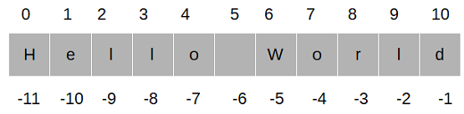

```{r setup, include = FALSE}
library(knitr)
library(kableExtra)
library(tidyverse)
library(NHSRtheme)
library(fontawesome)
# set default options
opts_chunk$set(echo = FALSE,
               fig.width = 7.252,
               fig.height = 4,
               comment = "#",
               dpi = 300)

knitr::knit_engines$set("markdown")

xaringanExtra::use_tile_view()
xaringanExtra::use_panelset()
xaringanExtra::use_clipboard()
xaringanExtra::use_webcam()
xaringanExtra::use_broadcast()
xaringanExtra::use_share_again()
xaringanExtra::style_share_again(
  share_buttons = c("twitter", "linkedin", "pocket")
)


xaringanExtra::use_extra_styles(
  hover_code_line = TRUE,         #<<
  mute_unhighlighted_code = F  #<<
)

# uncomment the following lines if you want to use the NHS-R theme colours by default
# scale_fill_continuous <- partial(scale_fill_nhs, discrete = FALSE)
# scale_fill_discrete <- partial(scale_fill_nhs, discrete = TRUE)
# scale_colour_continuous <- partial(scale_colour_nhs, discrete = FALSE)
# scale_colour_discrete <- partial(scale_colour_nhs, discrete = TRUE)
```

class: title-slide, left, bottom

# `r rmarkdown::metadata$title`
----
## **`r rmarkdown::metadata$subtitle`**
### `r rmarkdown::metadata$author`
### `r rmarkdown::metadata$date`

---
# Announcement

### <p style="color:#00449E"> Tutoring/TA-ing at Data Analytics Lab (South 321) </p>

- Marcie Hogan (Tutor):
  1. Sunday, 2:00 PM--5:00 PM 
  2. Wednesday, 12:30 PM--1:30 PM


- Andrew Mosbo (Tutor): 
  1. Mondays, 4:00 PM--5:00 PM
  2. Wednesdays, 11:00 A.M.--noon
  3. Thursdays, 5:00 PM--6:00 PM


- Emine Morris (TA): 
  1. Mondays and Wednesdays, 5:00 PM--6:30 PM
  2. Tuesdays and Thursdays, 3:00 PM--4:45 PM


---
# Workflow
### <p style="color:#00449E"> Shortcuts </p>
- **F9** runs a current line (where the blinking cursor bar is) or selected lines.

- **Home/End** moves the blinking cursor bar to the beginning/end of the line.
  - **Fn + ** `r fa("arrow-left")` / `r fa("arrow-right")` works too.

- **PgUp/PgDn** moves the blinking cursor bar to the top/bottom line of the script on the screen. 
  - **Fn + ** `r fa("arrow-up")` / `r fa("arrow-down")` works too.


---
# Workflow
### <p style="color:#00449E"> Shortcuts </p>

.pull-left[
### <p style="color:#00449E"> Mac </p>
- **command + N** opens a new script.
- **command + 1** is the shortcut for `#`.
- **command + 4** is the shortcut for block comment.
]

.pull-right[
### <p style="color:#00449E"> Windows </p>
- **Ctrl + N** opens a new script.
- **Ctrl + 1** is the shortcut for `#`.
- **Ctrl + 4** is the shortcut for block comment.
]

- `# %%` defines a coding block in Spyder IDE.

---
# Workflow
### <p style="color:#00449E"> More Shortcuts </p>


- **Ctrl** (**command** for Mac Users) **+ Z** undoes the previous action.
- **Ctrl** (**command** for Mac Users) **+ Shift + Z** redoes when undo is executed.


- **Ctrl** (**command** for Mac Users) **+ F** is useful when finding a phrase in the script.
- **Ctrl** (**command** for Mac Users) **+ R** is useful when replacing a specific phrase with something in the script.


- **Ctrl** (**command** for Mac Users) **+ D** deletes a current line.


---
class: inverse, center, middle

# Text Strings
<html><div style='float:left'></div><hr color='#EB811B' size=1px width=796px></html>

---
# Text Strings
### <p style="color:#00449E">  </p>

- Data scientists often work with *strings* of text.

- Strings in Python are immutable. 
  - We can’t change a string in place, but we can copy parts of strings to another string to get the same effect.


---
# Text Strings
### <p style="color:#00449E"> Create with Quotes </p>

- We make a Python string by enclosing characters in matching single or double quotes:

```{python, eval = F, echo = T}
'Business'
"Data"
```

- The Console (interactive interpreter) echoes strings with a single quote, but all are treated exactly the same by Python.


---
# Text Strings
### <p style="color:#00449E"> Create with Quotes </p>

- Why have two kinds of quote characters?
  - The main purpose is to create strings containing quote characters. 
  - We can have single quotes inside double-quoted strings, or double quotes inside single-quoted strings.

```{python, eval = F, echo = T}
"'Nay!' said the naysayer. 'Neigh?' said the horse."

'The rare double quote in captivity: ".'

'A "two by four" is actually 1 1⁄2" × 3 1⁄2".'

"'There's the man that shot my paw!' cried the limping hound."
```


---
# Text Strings
### <p style="color:#00449E"> Create with Quotes </p>

- We can also use three single quotes (''') or three double quotes ("""):
```{python, eval = F, echo = T}
'''Hi!'''
"""Hello!"""
```

- The most common use of triple quotes is to create multiline strings:
```{python, eval = F, echo = T}
poem_bluebird = '''there’s a bluebird in my heart that
wants to get out
but I’m too tough for him,
I say, stay in there, I’m not going
to let anybody see
you.'''
```


---
# Text Strings
### <p style="color:#00449E"> Create with `str()` </p>

- We can make a string from another data type by using the `str()` function:
```{python, eval = F, echo = T}
str(3.141592)
str(1.0e4)
str(True)
```


---
# Text Strings
### <p style="color:#00449E"> Escape with `\` </p>
- Python lets us escape the meaning of some characters within strings to achieve effects that would otherwise be difficult to express. 
  - By preceding a character with a backslash (`\`), we give it a special meaning. 

- The most common escape sequence is `\n`, which means to begin a new line. 
  - With this we can create multiline strings from a one-line string:

```{python, eval = F, echo = T}
palindrome = 'A man,\nA plan,\nA canal:\nPanama.'
print(palindrome)
```


---
# Text Strings
### <p style="color:#00449E"> Escape with `\` </p>


.panelset[
.panel[.panel-name[\t]

- The escape sequence `\t` (tab) is used to align text:

```{python, eval = F, echo = T}
print('\tabc')
print('a\tbc')
print('ab\tc')
print('abc\t')
```

]

.panel[.panel-name[`\'` or `\"`]

- We might also need `\'` or `\"` to specify a literal single or double quote inside a string that’s quoted by the same character:

```{python, eval = F, echo = T}
testimony = "\"I did nothing!\" he said. \"Or that other thing.\""
testimony
print(testimony)
```

]

.panel[.panel-name[`\\\`]
- If we need a literal backslash (`\`), type two of them (the first escapes the second):
```{python, eval = F, echo = T}
speech = 'The backslash (\\) bends over backwards to please you.'
print(speech)
```
]


.panel[.panel-name[`r`]
- A raw string (`r`) negates these escapes:
```{python, eval = F, echo = T}
info = r'Type a \n to get a new line in a normal string'
info
```

]

.panel[.panel-name[`r`]
- A raw string does not undo any real (not `\n`) newlines:
```{python, eval = F, echo = T}
poem = r'''Boys and girls, come out to play.
The moon doth shine as bright as day.'''
poem
print(poem)
```

]

]


---
# Text Strings
### <p style="color:#00449E"> Combine by Using `+` </p>

- We can combine literal strings or string variables in Python by using the `+` operator:
```{python, eval = F, echo = T}
'DANL 100: Programming for ' + 'Data Analytics'
```

- We can also combine literal strings (not string variables) just by having one after the other:
```{python, eval = F, echo = T}
'DANL 100: Programming for ' 'Data Analytics'
```


---
# Text Strings
### <p style="color:#00449E"> Duplicate with `*` </p>
- We use the `*` operator to duplicate a string. 
```{python, eval = F, echo = T}
start = 'Na ' * 4 + '\n'
middle = 'Hey ' * 3 + '\n'
end = 'Goodbye.'
print(start + start + middle + end)
```


---
# Text Strings
### <p style="color:#00449E"> Get a Character with `[]` </p>

- To get a single character from a string, specify its *offset* inside square brackets after the string’s name. 

  - The first (leftmost) offset is 0, the next is 1, and so on. 
  - The last (rightmost) offset can be specified with –1, so you don’t have to count; going to the left are –2, –3, and so on:
  
  
```{r, echo=FALSE, out.width = '75%', fig.align='center'}

```


---
# Text Strings
### <p style="color:#00449E"> Get a Character with `[]` </p>

- To get a single character from a string, specify its *offset* inside square brackets after the string’s name. 

  - The first (leftmost) offset is 0, the next is 1, and so on. 
  - The last (rightmost) offset can be specified with –1, so you don’t have to count; going to the left are –2, –3, and so on:
  
```{python, eval = F, echo = T}
letters = 'abcdefghijklmnopqrstuvwxyz'
letters[0]
letters[1]
letters[-1]
letters[5]
letters[100]
```


---
# Text Strings
### <p style="color:#00449E"> Get a Character with `[]` </p>

- Because strings are immutable, we can’t insert a character directly into one or change the character at a specific index.
  
```{python, eval = F, echo = T}
name = 'Macintosh'
name[0] = 'P'
```

- Instead, we need to use some combination of string functions such as `replace()` or a *slice* (which we look at in a moment):
```{python, eval = F, echo = T}
name = 'Macintosh'
name.replace('M', 'P')
'P' + name[1:]
```


---
# Text Strings
### <p style="color:#00449E"> Get a Substring with a Slice </p>

- We can extract a substring (a part of a string) from a string by using a **slice**. 

- We define a slice by using square brackets (`[]`), a *start* offset, an *end* offset, and an optional *step* count between them. 

  - We can omit some of these. 

- The slice will include characters from offset *start* to one before *end*:


---
# Text Strings
### <p style="color:#00449E"> Get a Substring with a Slice </p>


.panelset[
.panel[.panel-name[`[:]`]
- `[:]` extracts the entire sequence from start to end.
```{python, eval = F, echo = T}
letters = 'abcdefghijklmnopqrstuvwxyz'
letters[:]
```
]

.panel[.panel-name[`[ start :]`]
- `[ start :]` specifies from the *start* offset to the end.
```{python, eval = F, echo = T}
letters = 'abcdefghijklmnopqrstuvwxyz'
letters[20:]
letters[10:]
letters[-3:]
letters[-50:]
```
]

.panel[.panel-name[`[: end ]`]
- `[: end ]` specifies from the beginning to the *end* offset minus 1.
```{python, eval = F, echo = T}
letters = 'abcdefghijklmnopqrstuvwxyz'
letters[:3]
letters[:-3]
letters[:70]
```
]


.panel[.panel-name[`[ start : end ]`]
- `[ start : end ]` indicates from the *start* offset to the *end* offset minus 1.
```{python, eval = F, echo = T}
letters = 'abcdefghijklmnopqrstuvwxyz'
letters[12:15]
letters[-51:-50]
letters[70:71]
```
]

.panel[.panel-name[`[ start : end : step ]`]
- `[ start : end : step ]` extracts from the *start* offset to the *end* offset minus 1, skipping characters by *step*.
```{python, eval = F, echo = T}
letters = 'abcdefghijklmnopqrstuvwxyz'
letters[4:10:3]   # From offset 4 to 9, by steps of 3 characters
letters[::7]      # From the start to the end, in steps of 7 characters
letters[19::4]    # From offset 19 to the end, by 4
letters[:21:5]    # From the start to offset 20 by 5:
letters[-1::-1]   # Starts at the end and ends at the start
letters[::-1]
```
]

]


---
# Text Strings
### <p style="color:#00449E"> String-related Functions </p>

.panelset[
.panel[.panel-name[`len()`]
### Get Length with `len()`
- The `len()` function counts characters in a string:
```{python, eval = F, echo = T}
len(letters)
empty = ""
len(empty)
```
]

.panel[.panel-name[`dot`]
### Dot operation

- In Python, we can access attributes by using a dot notation (`.`).

- Unlike `len()`, some functions use a dot to access to strings. 

- To use those string functions, type (1) the name of the string, (2) a dot, (3) the name of the function, and (4) any arguments that the function needs: 

  - `string_name.some_function(arguments)`.

]

.panel[.panel-name[`split()`]
### Split with `split()`
- We can use the built-in string `split()` function to break a string into a list of smaller strings based on some *separator*.
  - If we don’t specify a *separator*, `split()` uses any sequence of white space characters---newlines, spaces, and tabs:
```{python, eval = F, echo = T}
tasks = 'get gloves,get mask,give cat vitamins,call ambulance'
tasks.split(',')
tasks.split()
```
]
.panel[.panel-name[`join()`]
### Combine by Using `join()`
- `join()` collapses a *list* of strings into a single string.
```{python, eval = F, echo = T}
crypto_list = ['Yeti', 'Bigfoot', 'Loch Ness Monster']
crypto_string = ', '.join(crypto_list)
print('Found and signing book deals:', crypto_string)
```
]
.panel[.panel-name[`replace()`]
### Substitute by Using `replace()`
- We use `replace()` for simple substring substitution.
```{python, eval = F, echo = T}
setup = "a duck goes into a bar..."
setup.replace('duck', 'marmoset')
setup
setup.replace('a ', 'a famous ', 100) # Change up to 100 of them
setup.replace('a', 'a famous', 100) # If we're unsure the exact substring
```
]
.panel[.panel-name[`strip()`]
### Strip with `strip()`
- The `strip()` functions assume that we want to get rid of whitespace characters (`' '`, `'\t'`, `'\n'`) if we don’t give them an argument. 
- `strip()` strips both ends, `lstrip()` only from the left, and `rstrip()` only from the right. 
```{python, eval = F, echo = T}
world = " earth "
world.strip()
world.lstrip()
world.rstrip()
```
]

.panel[.panel-name[`strip()`]
### Strip with `strip()`
- We can also tell `strip()` to remove any character in a multicharacter string:
```{python, eval = F, echo = T}
world = " earth "
world.strip(' ')
world.strip('!')

blurt = "What the...!!?"
blurt.strip('.?!')
```
]
.panel[.panel-name[`count()`]
### Count with `count()`
- How many times does the three-letter sequence *the* occur?
```{python, eval = F, echo = T}
poem = '''All that doth flow we cannot liquid name
Or else would fire and water be the same;
But that is liquid which is moist and wet
Fire that property can never get.'''
word = 'the'
poem.count(word)
```
]


]


---
# Text Strings
### <p style="color:#00449E"> Case and Allignment </p>
- We have more built-in functions for case and allignment:
```{python, eval = F, echo = T}
setup = 'a duck goes into a bar...'

setup.capitalize()    # Capitalize the first word
setup.title()         # Capitalize all the words
setup.upper()         # Convert all characters to uppercase
setup.lower()         # Convert all characters to lowercase
setup.swapcase()      # Swap uppercase and lowercase

setup.center(30)    # Center the string within 30 spaces
setup.ljust(30)     # Left justify
setup.rjust(30)     # Right justify
```


---
# Text Strings
### <p style="color:#00449E"> Formatting </p>
- We’ve seen that we can concatenate strings by using `+`.

- Let’s look at how to *interpolate* data values into strings using *f-strings* formats.

  - *f-strings* appeared in Python 3.6, and are now the recommended way of formatting strings.
  
  - There are (1) an old style of string formatting with `%` and (2) a new style of string formatting with `{}`, for which we may not discuss here.
  
  
  

---
# Text Strings
### <p style="color:#00449E"> Formatting </p>
  
- To make an f-string:

  - Type the letter *f* or *F* directly before the initial quote.
  - Include variable names or expressions within curly brackets (*{}*) to get their values into the string.

```{python, eval = F, echo = T}
thing = 'wereduck'
place = 'werepond'
f'The {thing} is in the {place}'
f'The {thing.capitalize()} is in the {place.rjust(20)}'
```


---
class: inverse, center, middle

# Loop with `while` and `for`
<html><div style='float:left'></div><hr color='#EB811B' size=1px width=796px></html>


---
# Loop with `while` and `for`

- Sometimes, we need to do something more than once. 
  - We need a loop, and Python gives us two choices: `while` and `for`.
  
### <p style="color:#00449E"> Repeat with `while` </p>

<!-- - Try the following example: -->

```{python, eval = F, echo = T}
count = 1        
while count <= 5:
    print(count)
    count += 1
```

.panelset[
.panel[.panel-name[Step 1.]
- We first assigned the value 1 to `count`.
]

.panel[.panel-name[Step 2.]
- The `while` loop compared the value of `count` to 5 and continued if `count` was less than or equal to 5.
]

.panel[.panel-name[Step 3.]
- Inside the loop, we printed the value of `count` and then *incremented* its value by one with the statement `count += 1`.
]

.panel[.panel-name[Step 4.]
- Python goes back to the top of the loop, and again compares `count` with 5.
]

.panel[.panel-name[Step 5.]
- The value of `count` is now 2, so the contents of the `while` loop are again executed, and `count` is incremented to 3.
]

.panel[.panel-name[Step 6.]
- This continues until `count` is incremented from 5 to 6 at the bottom of the loop.
]

.panel[.panel-name[Step 7.]
- On the next trip to the top, `count <= 5` is now `False`, and the `while` loop ends.
]

]


---
# Repeat with `while`
### <p style="color:#00449E"> Asking the user for input </p>

- Sometimes we would like to take the value for a variable from the user via their keyboard. 
  - The `input()` function gets *input* from the keyboard.
  - When the `input()` is called, the program stops and waits for the user to type something on Console (interactive Python interpreter).
  - When the user presses **Return** or **Enter** on Console, the program resumes and input returns what the user typed as a string.
  
```{python, eval = F, echo = T}
stuff = input()
# Type something and press Return/Enter on Console 
# before running print(stuff)
print(stuff)
```


---
# Repeat with `while`
### <p style="color:#00449E"> Cancel with `break` </p>

- `While` loop is used to execute a block of code repeatedly until given boolean condition evaluated to `False`. 
  - `while True` loop will run forever unless we write it with a `break` statement.


- If we want to loop until something occurs, but we’re not sure when that might happen, we can use an infinite loop with a `break` statement. 

```{python, eval = F, echo = T}
while True:
    stuff = input("String to capitalize [type q to quit]: ")
    if stuff == "q":
        break
    print(stuff.capitalize())
```


---
# Repeat with `while`
### <p style="color:#00449E"> Skip Ahead with `continue` </p>

- Sometimes, we don’t want to break out of a loop but just want to skip ahead to the
next iteration for some reason. 

- The `continue` statement is used to skip the rest of the code inside a loop for the *current iteration* only. 
  <!-- - Loop does not terminate but *continues* on with the next iteration. -->

<!-- - The `pass` statement in Python is used when a statement is required syntactically but you do not want any command or code to execute. -->


```{python, eval = F, echo = T}
while True:
    value = input("Integer, please [q to quit]: ")
    if value == 'q': # quit
        break
    number = int(value)
    if number % 2 == 0: # an even number
        continue
    print(number, "squared is", number*number)
```


---
# Repeat with `while`
### <p style="color:#00449E"> Check `break` Use with `else` </p>

- We can consider using `while` with `else` when we’ve coded a `while` loop to check for something, and `break`ing as soon as it’s found. 
  <!-- - The `else` would be run if the `while` loop completed but the object was not found. -->
  
```{python, eval = F, echo = T}
numbers = [1, 3, 5]
position = 0
while position < len(numbers):
    number = numbers[position]
    if number % 2 == 0:
        print('Found even number', number)
        break
    position += 1
else: # break not called
    print('No even number found')
```
- Consider it a break checker.


---
# Loop with `while` and `for`
### <p style="color:#00449E"> Iterate with `for` and `in` </p>

- Sometimes we want to loop through a set of things such as a string of text, a list of words or a list of numbers.

  - When we have a list of things to loop through, we can construct a `for` loop. 

  - A `for` loop makes it possible for you to traverse data structures without knowing how large they are or how they are implemented. 
  
  <!-- - We can iterate over data that is created on the fly, allowing processing of data streams that would otherwise not fit in the computer’s memory all at once. -->


<!-- - To do iteration, we need something like *strings*, *lists* and *tuples* or *dictionaries* to iterate over.  -->


---
# Loop with `while` and `for`
### <p style="color:#00449E"> Iterate with `for` and `in` </p>

- Let's see two ways to walk through a string here:

.pull-left[
```{python, eval = F, echo = T}
word = 'thud'
offset = 0
while offset < len(word):
    print(word[offset])
    offset += 1
```
]
.pull-right[
```{python, eval = F, echo = T}
word = 'thud'
for letter in word:
    print(letter)
```
]

- Which one do you prefer?

---
# Iterate with `for` and `in`


.pull-left[
### <p style="color:#00449E"> Cancel with `break` </p>
- A `break` in a `for` loop breaks out of the loop, as it does for a `while` loop:

```{python, eval = F, echo = T}
word = 'thud'
for letter in word:
    if letter == 'u':
        break
    print(letter)
```
]

.pull-right[
### <p style="color:#00449E"> Skip with `continue` </p>
- Inserting a `continue` in a `for` loop jumps to the next iteration of the loop, as it does
for a `while` loop.

```{python, eval = F, echo = T}
word = 'thud'
for letter in word:
    if letter == 'u':
        continue
    print(letter)
```
]


---
# Iterate with `for` and `in`
### <p style="color:#00449E"> Check `break` Use with `else` </p>
- Similar to `while`, `for` has an optional `else` that checks whether the `for` completed
normally. If `break` was not called, the `else` statement is run.

  - This is useful when we want to verify that the previous `for` loop ran to completion instead of being stopped early with a `break`:

```{python, eval = F, echo = T}
word = 'thud'
for letter in word:
    if letter == 'x':
        print("Eek! An 'x'!")
        break
    print(letter)
else:
    print("No 'x' in there.")
```

<!-- - It makes more sense if we think of the `for` as looking for something, and `else` being called if we didn’t find it.  -->
<!--   - To get the same effect without `else`, we can use some variable to indicate whether we found what we wanted in the `for` loop. -->


---
# Iterate with `for` and `in`
### <p style="color:#00449E"> Generate Number Sequences with `range()` </p>

.panelset[
.panel[.panel-name[Why `range()`?]
- The `range()` function returns a stream of numbers within a specified range, without
first having to create and store a large data structure such as a *list* or *tuple*. 

  - This lets us create huge ranges without using all the memory in our computers and crashing our program.
  
  - `range()` returns an iterable object, so we need to step through the values with `for` ... `in`, or convert the object to a sequence like a *list*. 


]

.panel[.panel-name[`for` ... `in` `range()`]
- We use `range()` similar to how we use *slices*: `range( start, stop, step )`. 
  - If we omit `start`, the `range` begins at 0. 
  - The only required value is `stop`; as with *slices*, the last value created will be just before stop. 
  - The default value of `step` is 1, but we can change it.

```{python, eval = F, echo = T}
for x in range(0, 3):
    print(x)
list( range(0, 3) )
```

]


.panel[.panel-name[step < 0]
- How can we make a range from 2 down to 0?

```{python, eval = F, echo = T}
for x in range(2, -1, -1):
    print(x)
    
list( range(2, -1, -1) )
```

]


.panel[.panel-name[step > 1]
- How can we get only even numbers?

```{python, eval = F, echo = T}
for x in range(0, 11, 2):
    print(x)
    
list( range(0, 11, 2) )
```

]

]


---
# Loop with `while` and `for`
### <p style="color:#00449E"> Class Exercises </p>

.panelset[
.panel[.panel-name[`while` loop]

1. Use a `while` loop to print the values of the list [3, 2, 1, 0].

2. Assign the value 7 to the variable `guess_me`, and the value 1 to the variable `number`. Write a `while` loop that compares `number` with `guess_me.` Print 'too low' if `number` is less than guess me. If `number` equals `guess_me`, print 'found it!' and then exit the loop. If `number` is greater than `guess_me`, print 'oops' and then exit the loop. Increment `number` at the end of the loop.


]


.panel[.panel-name[`for` loop]

1. Use a `for` loop to print the values of the list [3, 2, 1, 0].

2. Assign the value 5 to the variable `guess_me.` Use a `for` loop to iterate a variable called `number` over `range(10)`. If `number` is less than `guess_me`, print 'too low'. If `number` equals `guess_me`, print 'found it!' and then `break` out of the `for` loop. If `number` is greater than `guess_me`, print 'oops' and then exit the loop.

]
]


