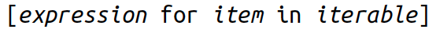
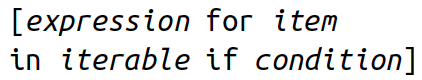

```{r setup, include = FALSE}
library(knitr)
library(kableExtra)
library(tidyverse)
library(NHSRtheme)
library(fontawesome)
# set default options
opts_chunk$set(echo = FALSE,
               fig.width = 7.252,
               fig.height = 4,
               comment = "#",
               dpi = 300)

knitr::knit_engines$set("markdown")

xaringanExtra::use_tile_view()
xaringanExtra::use_panelset()
xaringanExtra::use_clipboard()
xaringanExtra::use_webcam()
xaringanExtra::use_broadcast()
xaringanExtra::use_share_again()
xaringanExtra::style_share_again(
  share_buttons = c("twitter", "linkedin", "pocket")
)


xaringanExtra::use_extra_styles(
  hover_code_line = TRUE,         #<<
  mute_unhighlighted_code = F  #<<
)

# uncomment the following lines if you want to use the NHS-R theme colours by default
# scale_fill_continuous <- partial(scale_fill_nhs, discrete = FALSE)
# scale_fill_discrete <- partial(scale_fill_nhs, discrete = TRUE)
# scale_colour_continuous <- partial(scale_colour_nhs, discrete = FALSE)
# scale_colour_discrete <- partial(scale_colour_nhs, discrete = TRUE)
```

class: title-slide, left, bottom

# `r rmarkdown::metadata$title`
----
## **`r rmarkdown::metadata$subtitle`**
### `r rmarkdown::metadata$author`
### `r rmarkdown::metadata$date`

---
# Announcement

### <p style="color:#00449E"> Tutoring/TA-ing at Data Analytics Lab (South 321) </p>

- Marcie Hogan (Tutor for Data Analytics):
  1. Sunday, 2:00 PM--5:00 PM 
  2. Wednesday, 12:30 PM--1:30 PM


- Andrew Mosbo (Tutor for Data Analytics): 
  1. Mondays, 4:00 PM--5:00 PM
  2. Wednesdays, 11:00 A.M.--noon
  3. Thursdays, 5:00 PM--6:00 PM


- Jason Rappazzo (Tutor for Data Analytics; TA for Prof. Yazdani)
  1. Tuesdays and Thursdays, 9:30 AM--10:45 AM
  2. Friday, 9:00 AM--10:15 AM
  3. Friday, 9:00 PM--10:15 PM


---
# Announcement 

### <p style="color:#00449E"> Tutoring/TA-ing at Data Analytics Lab (South 321) </p>

- Emine Morris (TA for Byeong-Hak): 
  1. Mondays and Wednesdays, 5:00 PM--6:30 PM
  2. Tuesdays and Thursdays, 3:00 PM--4:45 PM
  
  
  
  
  
  
---
# Workflow
### <p style="color:#00449E"> Shortcuts </p>
- **F9** runs a current line (where the blinking cursor bar is) or selected lines.

- **Home/End** moves the blinking cursor bar to the beginning/end of the line.
  - **Fn + ** `r fa("arrow-left")` / `r fa("arrow-right")` works too.

- **PgUp/PgDn** moves the blinking cursor bar to the top/bottom line of the script on the screen. 
  - **Fn + ** `r fa("arrow-up")` / `r fa("arrow-down")` works too.


---
# Workflow
### <p style="color:#00449E"> Shortcuts </p>

.pull-left[
### <p style="color:#00449E"> Mac </p>
- **command + N** opens a new script.
- **command + 1** is the shortcut for `#`.
- **command + 4** is the shortcut for block comment.
]

.pull-right[
### <p style="color:#00449E"> Windows </p>
- **Ctrl + N** opens a new script.
- **Ctrl + 1** is the shortcut for `#`.
- **Ctrl + 4** is the shortcut for block comment.
]

- `# %%` defines a coding block in Spyder IDE.

---
# Workflow
### <p style="color:#00449E"> More Shortcuts </p>


- **Ctrl** (**command** for Mac Users) **+ Z** undoes the previous action.
- **Ctrl** (**command** for Mac Users) **+ Shift + Z** redoes when undo is executed.


- **Ctrl** (**command** for Mac Users) **+ F** is useful when finding a phrase in the script.
- **Ctrl** (**command** for Mac Users) **+ R** is useful when replacing a specific phrase with something in the script.


- **Ctrl** (**command** for Mac Users) **+ D** deletes a current line.


---
class: inverse, center, middle

# Loop with `while` and `for`
<html><div style='float:left'></div><hr color='#EB811B' size=1px width=796px></html>


---
# Loop with `while` and `for`

- Sometimes, we need to do something more than once. 
  - We need a loop, and Python gives us two choices: `while` and `for`.
  
### <p style="color:#00449E"> Repeat with `while` </p>

<!-- - Try the following example: -->

```{python, eval = F, echo = T}
count = 1        
while count <= 5:
    print(count)
    count += 1
```

.panelset[
.panel[.panel-name[Step 1.]
- We first assigned the value 1 to `count`.
]

.panel[.panel-name[Step 2.]
- The `while` loop compared the value of `count` to 5 and continued if `count` was less than or equal to 5.
]

.panel[.panel-name[Step 3.]
- Inside the loop, we printed the value of `count` and then *incremented* its value by one with the statement `count += 1`.
]

.panel[.panel-name[Step 4.]
- Python goes back to the top of the loop, and again compares `count` with 5.
]

.panel[.panel-name[Step 5.]
- The value of `count` is now 2, so the contents of the `while` loop are again executed, and `count` is incremented to 3.
]

.panel[.panel-name[Step 6.]
- This continues until `count` is incremented from 5 to 6 at the bottom of the loop.
]

.panel[.panel-name[Step 7.]
- On the next trip to the top, `count <= 5` is now `False`, and the `while` loop ends.
]

]


---
# Repeat with `while`
### <p style="color:#00449E"> Asking the user for input </p>

- Sometimes we would like to take the value for a variable from the user via their keyboard. 
  - The `input()` function gets *input* from the keyboard.
  - When the `input()` is called, the program stops and waits for the user to type something on Console (interactive Python interpreter).
  - When the user presses **Return** or **Enter** on Console, the program resumes and input returns what the user typed as a string.
  
```{python, eval = F, echo = T}
stuff = input()
# Type something and press Return/Enter on Console 
# before running print(stuff)
print(stuff)
```


---
# Repeat with `while`
### <p style="color:#00449E"> Cancel with `break` </p>

- `While` loop is used to execute a block of code repeatedly until given boolean condition evaluated to `False`. 
  - `while True` loop will run forever unless we write it with a `break` statement.


- If we want to loop until something occurs, but we’re not sure when that might happen, we can use an infinite loop with a `break` statement. 

```{python, eval = F, echo = T}
while True:
    stuff = input("String to capitalize [type q to quit]: ")
    if stuff == "q":
        break
    print(stuff.capitalize())
```


---
# Repeat with `while`
### <p style="color:#00449E"> Skip Ahead with `continue` </p>

- Sometimes, we don’t want to break out of a loop but just want to skip ahead to the
next iteration for some reason. 

- The `continue` statement is used to skip the rest of the code inside a loop for the *current iteration* only. 
  <!-- - Loop does not terminate but *continues* on with the next iteration. -->

<!-- - The `pass` statement in Python is used when a statement is required syntactically but you do not want any command or code to execute. -->


```{python, eval = F, echo = T}
while True:
    value = input("Integer, please [q to quit]: ")
    if value == 'q': # quit
        break
    number = int(value)
    if number % 2 == 0: # an even number
        continue
    print(number, "squared is", number*number)
```


---
# Repeat with `while`
### <p style="color:#00449E"> Check `break` Use with `else` </p>

- We can consider using `while` with `else` when we’ve coded a `while` loop to check for something, and `break`ing as soon as it’s found. 
  <!-- - The `else` would be run if the `while` loop completed but the object was not found. -->
  
```{python, eval = F, echo = T}
numbers = [1, 3, 5]
position = 0
while position < len(numbers):
    number = numbers[position]
    if number % 2 == 0:
        print('Found even number', number)
        break
    position += 1
else: # break not called
    print('No even number found')
```
- Consider it a break checker.


---
# Loop with `while` and `for`
### <p style="color:#00449E"> Iterate with `for` and `in` </p>

- Sometimes we want to loop through a set of things such as a string of text, a list of words or a list of numbers.

  - When we have a list of things to loop through, we can construct a `for` loop. 

  - A `for` loop makes it possible for you to traverse data structures without knowing how large they are or how they are implemented. 
  
  <!-- - We can iterate over data that is created on the fly, allowing processing of data streams that would otherwise not fit in the computer’s memory all at once. -->


<!-- - To do iteration, we need something like *strings*, *lists* and *tuples* or *dictionaries* to iterate over.  -->


---
# Loop with `while` and `for`
### <p style="color:#00449E"> Iterate with `for` and `in` </p>

- Let's see two ways to walk through a string here:

.pull-left[
```{python, eval = F, echo = T}
word = 'thud'
offset = 0
while offset < len(word):
    print(word[offset])
    offset += 1
```
]
.pull-right[
```{python, eval = F, echo = T}
word = 'thud'
for letter in word:
    print(letter)
```
]

- Which one do you prefer?

---
# Iterate with `for` and `in`


.pull-left[
### <p style="color:#00449E"> Cancel with `break` </p>
- A `break` in a `for` loop breaks out of the loop, as it does for a `while` loop:

```{python, eval = F, echo = T}
word = 'thud'
for letter in word:
    if letter == 'u':
        break
    print(letter)
```
]

.pull-right[
### <p style="color:#00449E"> Skip with `continue` </p>
- Inserting a `continue` in a `for` loop jumps to the next iteration of the loop, as it does
for a `while` loop.

```{python, eval = F, echo = T}
word = 'thud'
for letter in word:
    if letter == 'u':
        continue
    print(letter)
```
]


---
# Iterate with `for` and `in`
### <p style="color:#00449E"> Check `break` Use with `else` </p>
- Similar to `while`, `for` has an optional `else` that checks whether the `for` completed
normally. If `break` was not called, the `else` statement is run.

  - This is useful when we want to verify that the previous `for` loop ran to completion instead of being stopped early with a `break`:

```{python, eval = F, echo = T}
word = 'thud'
for letter in word:
    if letter == 'x':
        print("Eek! An 'x'!")
        break
    print(letter)
else:
    print("No 'x' in there.")
```

<!-- - It makes more sense if we think of the `for` as looking for something, and `else` being called if we didn’t find it.  -->
<!--   - To get the same effect without `else`, we can use some variable to indicate whether we found what we wanted in the `for` loop. -->


---
# Iterate with `for` and `in`
### <p style="color:#00449E"> Generate Number Sequences with `range()` </p>

.panelset[
.panel[.panel-name[Why `range()`?]
- The `range()` function returns a stream of numbers within a specified range, without
first having to create and store a large data structure such as a *list* or *tuple*. 

  - This lets us create huge ranges without using all the memory in our computers and crashing our program.
  
  - `range()` returns an iterable object, so we need to step through the values with `for` ... `in`, or convert the object to a sequence like a *list*. 


]

.panel[.panel-name[`for` ... `in` `range()`]
- We use `range()` similar to how we use *slices*: `range( start, stop, step )`. 
  - If we omit `start`, the `range` begins at 0. 
  - The only required value is `stop`; as with *slices*, the last value created will be just before stop. 
  - The default value of `step` is 1, but we can change it.

```{python, eval = F, echo = T}
for x in range(0, 3):
    print(x)
list( range(0, 3) )
```

]


.panel[.panel-name[step < 0]
- How can we make a range from 2 down to 0?

```{python, eval = F, echo = T}
for x in range(2, -1, -1):
    print(x)
    
list( range(2, -1, -1) )
```

]


.panel[.panel-name[step > 1]
- How can we get only even numbers?

```{python, eval = F, echo = T}
for x in range(0, 11, 2):
    print(x)
    
list( range(0, 11, 2) )
```

]

]


---
# Loop with `while` and `for`
### <p style="color:#00449E"> Class Exercises </p>

.panelset[
.panel[.panel-name[`while` loop]

1. Use a `while` loop to print the values of the list [3, 2, 1, 0].

2. Assign the value 7 to the variable `guess_me`, and the value 1 to the variable `number`. Write a `while` loop that compares `number` with `guess_me.` Print 'too low' if `number` is less than guess me. If `number` equals `guess_me`, print 'found it!' and then exit the loop. If `number` is greater than `guess_me`, print 'oops' and then exit the loop. Increment `number` at the end of the loop.


]


.panel[.panel-name[`for` loop]

1. Use a `for` loop to print the values of the list [3, 2, 1, 0].

2. Assign the value 5 to the variable `guess_me.` Use a `for` loop to iterate a variable called `number` over `range(10)`. If `number` is less than `guess_me`, print 'too low'. If `number` equals `guess_me`, print 'found it!' and then `break` out of the `for` loop. If `number` is greater than `guess_me`, print 'oops' and then exit the loop.

]
]


---
class: inverse, center, middle

# Tuples and Lists
<html><div style='float:left'></div><hr color='#EB811B' size=1px width=796px></html>


---
# Tuples and Lists
### <p style="color:#00449E">  </p>

- In the previous classes, we started with some of Python’s basic data types: booleans,
integers, floats, and strings. 
  
  - If we think of those as atoms, the data structures in tuples and lists are like molecules.
  

- Like strings, tuples and lists have a sequence structures indexed by their integer position.
  

- Unlike strings, the elements in tuples and lists can be of different types.
  

- Why does Python contain both lists and tuples? 

  - Tuples are immutable; when we assign elements (only once) to a tuple, they’re baked in the cake and can’t be changed.

  - Lists are mutable, meaning we can insert and delete elements with great enthusiasm.


---
# Tuples
### <p style="color:#00449E"> Create with Commas and () </p>

- The syntax to make tuples is a little inconsistent.

.panelset[
.panel[.panel-name[(1)]
- Let's begin by making an empty tuple using ():
```{python, eval = F, echo = T}
empty_tuple = ()
```

]

.panel[.panel-name[(2)]
- To make a tuple with one or more elements, follow each element with a comma. 
  - This works for one-element tuples:
```{python, eval = F, echo = T}
one_geneseo = 'Geneseo',
```

]

.panel[.panel-name[(3)]
- We could enclose them in parentheses and still get the same tuple:
```{python, eval = F, echo = T}
one_geneseo = ('Geneseo',)
```
]

.panel[.panel-name[(4)]
- If we have a single thing in parentheses and omit that comma, we would not get a tuple, but just the thing.
```{python, eval = F, echo = T}
one_geneseo = ('Geneseo')
```
]

.panel[.panel-name[(5)]
- If we have more than one element, follow all but the last one with a comma:
```{python, eval = F, echo = T}
suny_tuple = 'Geneseo', 'Borckport', 'Oswego'
```
]

.panel[.panel-name[(6)]
- We often don’t need parentheses when we define a tuple, but using parentheses is a little safer, and it helps to make the tuple more visible:
```{python, eval = F, echo = T}
suny_tuple = ('Geneseo', 'Borckport', 'Oswego')
```
]


.panel[.panel-name[(7)]
- We do need the parentheses for cases in which commas might also have another use.
```{python, eval = F, echo = T}
one_geneseo = 'Geneseo',
type(one_geneseo)

type('Groucho',)
type(('Groucho',))
```

]

.panel[.panel-name[(8)]
- Tuples let us assign multiple variables at once:
```{python, eval = F, echo = T}
suny_tuple = ('Geneseo', 'Borckport', 'Oswego')
a, b, c = suny_tuple
a
b
c
```

  - This is sometimes called *tuple unpacking*.

]

.panel[.panel-name[(9)]
- We can use tuples to exchange values in one statement without using a temporary
variable:
```{python, eval = F, echo = T}
password = 'swordfish'
icecream = 'tuttifrutti'
password, icecream = icecream, password

password
icecream
```

]


]


---
# Tuples
### <p style="color:#00449E">  </p>


.panelset[
.panel[.panel-name[`tuple()`]
### Create with `tuple()`
- The tuple() conversion function makes tuples from other things:

```{python, eval = F, echo = T}
suny_list = ['Geneseo', 'Borckport', 'Oswego']
tuple = tuple(suny_list)
```
]

.panel[.panel-name[with `+`]
### Combine Tuples by Using `+`
- This is similar to combining strings:

```{python, eval = F, echo = T}
('Geneseo',) + ('Borckport', 'Oswego')
```

]

.panel[.panel-name[with `*`]
### Duplicate Items with `*`
- This is like repeated use of `+`:

```{python, eval = F, echo = T}
('yada',) * 3
```

]

.panel[.panel-name[comparision]
### Compare Tuples
- This works much like list comparisons:

```{python, eval = F, echo = T}
a = (7, 2)
b = (7, 2, 9)
a == b
a <= b
a < b
```

]

.panel[.panel-name[`for` loop]
### Iterate with `for` and `in`
- Tuple iteration is like iteration of other types:

```{python, eval = F, echo = T}
words = ('fresh','out', 'of', 'ideas')
for word in words:
    print(word)
```

]

.panel[.panel-name[with `+=`]
### Modify a Tuple
- We can’t! 
  - Like strings, tuples are immutable, so we can’t change an existing one. 
  - As we saw just before, we can concatenate (combine) tuples to make a new one, as we can with strings:

```{python, eval = F, echo = T}
t1 = ('Fee', 'Fie', 'Foe')
id(t1)
t2 = ('Flop,')
t1 + t2
t1 += t2
id(t1)
```

]


]


---
# Lists

- Lists are good for keeping track of things by their order, especially when the order and contents might change.

  - Lists are *mutable*---we can change a list in place, add new elements, and delete or replace existing elements. 
  
  - The same value can occur more than once in a list.
  


---
# Lists

.panelset[
.panel[.panel-name[with `[]`]
### <p style="color:#00449E"> Create with [] </p>

- A list is made from zero or more elements, separated by commas and surrounded by
square brackets:
```{python, eval = F, echo = T}
empty_list = [ ]
weekdays = ['Monday', 'Tuesday', 'Wednesday', 'Thursday', 'Friday']
big_birds = ['emu', 'ostrich', 'cassowary']
first_names = ['Mary', 'Susan', 'Nicholas', 'Nicholas', 'Michael']
leap_years = [2012, 2016, 2020]
```

]


.panel[.panel-name[`list()`]
### Create or Convert with `list()`
- We can also make an empty list with the `list()` function.

- `list()` function also converts other iterable data types (such as tuples, strings, sets, and dictionaries) to lists.

```{python, eval = F, echo = T}
another_empty_list = list()
another_empty_list

list('cat')

a_tuple = ('ready', 'fire', 'aim')
list(a_tuple)
```
]


.panel[.panel-name[`split()`]
### Create from a String with `split()`
- We can use `split()` to chop a string into a *list* by some separator:

```{python, eval = F, echo = T}
coffee_day = '10/1/2022'
coffee_day.split('/')

splitme = 'a/b//c/d///e'
splitme.split('/')
splitme.split('//')
```
]

]


---
# Lists

.panelset[
.panel[.panel-name[`[offset]`]
### Get an Item by `[offset]`
- As with strings, we can extract a single value from a list by specifying its offset:
```{python, eval = F, echo = T}
suny = ['Geneseo', 'Brockport', 'Oswego']
```

.pull-left[
```{python, eval = F, echo = T}
suny[0]
suny[1]
suny[2]
suny[5]
```
]
.pull-right[
```{python, eval = F, echo = T}
suny[-1]
suny[-2]
suny[-3]
suny[-5]
```
]

]


.panel[.panel-name[slice]
### Get an Item with a Slice
- We can extract a subsequence of a list by using a *slice*:
```{python, eval = F, echo = T}
suny = ['Geneseo', 'Brockport', 'Oswego']
suny[0:2]    # A slice of a list is also a list.
```


.pull-left[
```{python, eval = F, echo = T}
suny[::2]
suny[::-2]
suny[::-1]
```
]
.pull-right[
```{python, eval = F, echo = T}
suny[4:]
suny[-6:]
suny[-6:-2]
suny[-6:-4]
```
]


]


.panel[.panel-name[`reverse()`]
### Reverse a list with `reverse()`
- To reverse a list in place, use `list.reverse()`:
```{python, eval = F, echo = T}
suny.reverse()
suny
```

]


.panel[.panel-name[`append()`]
### Add an Item to the End with `append()`
- The `append()` function adds items to the end of the list.
```{python, eval = F, echo = T}
suny = ['Geneseo', 'Brockport', 'Oswego']
suny.append('Buffalo')
suny

suny = ['Geneseo', 'Brockport', 'Oswego']
others = ['Buffalo', 'Cortland']
suny.append(others)
suny
```

]


.panel[.panel-name[`insert()`]
### Add an Item by Offset with `insert()`
- When we want to add an item before any offset in the list, we can use `insert()`.
```{python, eval = F, echo = T}
suny = ['Geneseo', 'Brockport', 'Oswego']
suny.insert(2, 'Buffalo')
suny
suny.insert(10, 'Cortland')
suny
```

]


.panel[.panel-name[`*`]
### Duplicate All Items with *
- We saw that we can duplicate a string’s characters with `*`. The same works for a list:
```{python, eval = F, echo = T}
["blah"] * 3

suny = ['Geneseo', 'Brockport', 'Oswego']
suny * 2
```

]


.panel[.panel-name[`extend()`]
### Combine Lists by Using `extend()` or `+`
- We can merge one list into another by using `extend()` or `+`.
```{python, eval = F, echo = T}
suny = ['Geneseo', 'Brockport', 'Oswego']
others = ['Buffalo', 'Cortland']
suny.extend(others)
suny

suny = ['Geneseo', 'Brockport', 'Oswego']
others = ['Buffalo', 'Cortland']
suny += others
suny
```

]


]


---
# Change Items in a List
### <p style="color:#00449E">  </p>

.panelset[
.panel[.panel-name[`[offset]`]
### Change an Item by `[offset]`
- Just as you can get the value of a list item by its offset, we can change it:

```{python, eval = F, echo = T}
suny = ['Geneseo', 'Brockport', 'Oswego']
suny[2] = 'Buffalo'
suny
```

- We can change how many items a list contains as well as the items themselves.
]


.panel[.panel-name[Slice]
### Change Items with a Slice
.pull-left[
- We can assign values to a sublist with a slice.
```{python, eval = F, echo = T}
numbers = [1, 2, 3, 4]
numbers[1:3] = ['eight', 'nine']
numbers
```
]
.pull-right[
- The right-hand thing that we’re assigning to the list doesn’t need to have the same number of elements as the slice on the left:
```{python, eval = F, echo = T}
numbers = [1, 2, 3, 4]
numbers[1:3] = [7, 8, 9]
numbers
```
]

]


.panel[.panel-name[`del`]
### Delete an Item by Offset with `del`
- We can use a `del` statement to delete an item by its position in a list.

```{python, eval = F, echo = T}
suny = ['Geneseo', 'Brockport', 'Oswego', 'Rochester']
suny[-1]
del suny[-1]    
suny
```

]


.panel[.panel-name[`remove()`]
### Delete an Item by Value with `remove()`
- If we're not sure or don’t care where the item is in the list, we can use `remove()` to delete it by value.

```{python, eval = F, echo = T}
suny = ['Geneseo', 'Brockport', 'Oswego', 'Rochester']
suny.remove('Rochester')
suny

suny = ['Geneseo', 'Brockport', 'Oswego', 'Rochester', 'Rochester']
suny.remove('Rochester')
suny
```

]


.panel[.panel-name[`pop()`]
### Get an Item by Offset and Delete It with `pop()`
- We can get an item from a list and delete it from the list at the same time by using `pop()`.
  - If we call `pop()` with an offset, it will return the item at that offset; with no argument, it uses -1.

```{python, eval = F, echo = T}
suny = ['Geneseo', 'Brockport', 'Oswego', 'Rochester']
suny.pop()
suny
suny.pop(1)
suny
```

]


.panel[.panel-name[`clear()`]
### Delete All Items with `clear()`
- We can use `clear()` to clear a list of all its elements:

```{python, eval = F, echo = T}
suny_roc = ['Rochester', 'Rochester', 'Rochester', 'Rochester']
suny.clear()
suny
```

]


]


---
# Lists
### <p style="color:#00449E">  </p>

.panelset[
.panel[.panel-name[`index()`]
### Find an Item’s Offset by Value with `index()`
- If we want to know the offset of an item in a list by its value, we use `index()`:

```{python, eval = F, echo = T}
suny = ['Geneseo', 'Brockport', 'Oswego', 'Buffalo']
suny.index('Geneseo')

suny = ['Geneseo', 'Brockport', 'Oswego', 'Geneseo']
suny.index('Geneseo')
```

]


.panel[.panel-name[`in`]
### Test for a Value with `in`
- The way to check for the existence of a value in a list is using `in`:

```{python, eval = F, echo = T}
suny = ['Geneseo', 'Brockport', 'Oswego', 'Buffalo']
'Geneseo' in suny
'Rochester' in suny

words = ['a', 'deer', 'a' 'male', 'deer']
'deer' in words
```

]


.panel[.panel-name[`count()`]
### Count Occurrences of a Value with `count()`
- To count how many times a particular value occurs in a list, we can use `count()`:

```{python, eval = F, echo = T}
suny = ['Geneseo', 'Brockport', 'Oswego', 'Buffalo']
suny.count('Geneseo')
suny.count('Rochester')

mcdonald = ['cheeseburger', 'cheeseburger', 'cheeseburger']
mcdonald.count('cheeseburger')
```

]


.panel[.panel-name[`join()`]
### Convert a List to a String with `join()`
- `join()` is a string method, not a list method.

```{python, eval = F, echo = T}
suny = ['Geneseo', 'Brockport', 'Oswego', 'Buffalo']
', '.join(suny)
```
  - We can’t say `suny.join(', ')`.

- The argument to `join()` is a string or any iterable sequence of strings (including a list), and its output is a string.


]


.panel[.panel-name[`sort`]
### Reorder Items with `sort()` or `sorted()`
- We may often need to sort the items in a list by their values rather than their offsets.
  - The list method `sort()` sorts the list itself, in place.
  - The general function `sorted()` returns a sorted copy of the list.

.pull-left[
```{python, eval = F, echo = T}
suny = ['Geneseo', 'Brockport', 
        'Oswego']
sorted_suny = sorted(suny)
sorted_suny
suny
```

]
.pull-right[
```{python, eval = F, echo = T}
suny.sort()
suny
```

]
]


.panel[.panel-name[`reverse=True`]
### Reorder Items with `sort()` or `sorted()`
- The default sort order is ascending, but we can add the argument `reverse=True` to set it to descending.

.pull-left[
```{python, eval = F, echo = T}
numbers = [2, 1, 4.0, 3]
numbers.sort()
numbers
numbers = [2, 1, 4.0, 3]
numbers.sort(reverse=True)
numbers
```

]
.pull-right[
```{python, eval = F, echo = T}
suny = ['Geneseo', 'Brockport', 
        'Oswego']
sorted_suny = sorted(suny, 
                     reverse=True)
sorted_suny
```

]
]


.panel[.panel-name[`len()`]
### Get Length with `len()`
- `len()` returns the number of items in a list:

```{python, eval = F, echo = T}
suny = ['Geneseo', 'Brockport', 'Oswego']
len(suny)
```

]


]


---
# Lists
### <p style="color:#00449E">  </p>

.panelset[

.panel[.panel-name[`=`]
### Assign with `=`
- When we assign one list to more than one variable, changing the list in one place also changes it in the other:

.pull-left[
```{python, eval = F, echo = T}
a = [1, 2, 3]
b = a
b
a[0] = 'suprise'
a
```
- So what’s in `b` now?

]
.pull-right[
```{python, eval = F, echo = T}
b[0] = 'I hate suprises'
b
```
- So what’s in `a` now?
]
]


.panel[.panel-name[copy]
### Copy with copy(), list(), or a Slice
We can copy the values of a list to an independent, fresh list by using (1) the list `copy()` method, (2) the `list()` conversion function, or (3) the list slice `[:]`:
  
.pull-left[
```{python, eval = F, echo = T}
a = [1, 2, 3]
b = a.copy()
c = list(a)
d = a[:]
a[0] = 'integer lists'
```


]
.pull-right[
- `b`, `c`, and `d` are copies of `a`: 
  - They are new objects with their own values and no connection to the original list object [1, 2, 3] to which `a` refers.
  - What are `b`, `c`, and `d` now?

]
]


.panel[.panel-name[deepcopy]
### Copy with copy(), list(), or a Slice
- Using (1) the list `copy()` method, (2) the `list()` conversion function, or (3) the list slice `[:]` works well if the list values are all *immutable*.
  
.pull-left[
```{python, eval = F, echo = T}
a = [1, 2, [8, 9]]
b = a.copy()
c = list(a)
d = a[:]
a[2][1] = 10
```


]
.pull-right[
- `b`, `c`, and `d` are copies of `a`.
- The value of `a[2]` is now a list, and its elements can be changed.

  - What are `b`, `c`, and `d` now?
]
]


.panel[.panel-name[`deepcopy()`]
### Copy with copy(), list(), or a Slice
- To fix these *shallow* copies, we need to use the `deepcopy()` function:
  
.pull-left[
```{python, eval = F, echo = T}
import copy
a = [1, 2, [8, 9]]
b = copy.deepcopy(a)
a[2][1] = 10
a
b
```


]
.pull-right[
-  `deepcopy()` can handle deeply nested lists, dictionaries, and other objects.

- We'll discuss more about `import` later.
]
]


.panel[.panel-name[Comparison]
### Compare Lists
- We can directly compare lists with the comparison operators like `==`, `<`, and so on.

.pull-left[
```{python, eval = F, echo = T}
a = [7, 2]
b = [7, 2, 9]

a == b
a <= b
a < b
```


]
.pull-right[
- The operators walk through both lists, comparing elements at the same offsets. 
- If list `a` is shorter than list `b`, and all of its elements are equal, `a` is less than `b`.
]
]

]


---
# Lists
### <p style="color:#00449E"> Iterate with `for` and `in` </p>


.panelset[
.panel[.panel-name[`for`]
- `for` loop is quite common to iterate over lists.

```{python, eval = F, echo = T}
cheeses = ['brie', 'gjetost', 'havarti']
for cheese in cheeses:
    print(cheese)
```
]


.panel[.panel-name[`break`]
- `break` ends the for loop and `continue` steps to the next iteration:
```{python, eval = F, echo = T}
cheeses = ['brie', 'gjetost', 'havarti']
for cheese in cheeses:
    if cheese.startswith('g'):
        print("I won't eat anything that starts with 'g'")
        break
    else:
        print(cheese)
```
]


.panel[.panel-name[`else` (1)]
- We can still use the optional `else` if the for completed without a `break`:
```{python, eval = F, echo = T}
cheeses = ['brie', 'gjetost', 'havarti']
for cheese in cheeses:
    if cheese.startswith('x'):
        print("I won't eat anything that starts with 'x'")
        break
    else:
        print(cheese)
else:
    print("Didn't find anything that started with 'x'")
```
]

.panel[.panel-name[`else` (2)]
- If the initial `for` never ran, control goes to the `else`:
```{python, eval = F, echo = T}
cheeses = []
for cheese in cheeses:
    print('This shop has some lovely', cheese)
    break
else: # no break means no cheese
    print('This is not much of a cheese shop, is it?')
```
]

]


---
# Lists
### <p style="color:#00449E"> Iterate Multiple Sequences with `zip()` </p>

.panelset[
.panel[.panel-name[`for` and `zip()`]
- There’s one more nice iteration trick: iterating over multiple sequences in parallel by using the `zip()` function.

```{python, echo = T, eval = F}
days = ['Monday', 'Tuesday', 'Wednesday']
fruits = ['banana', 'orange', 'peach']
drinks = ['coffee', 'coffee', 'coffee']
desserts = ['tiramisu', 'ice cream', 'pie', 'pudding']
for day, fruit, drink, dessert in zip(days, fruits, drinks, desserts):
    print(day, ": drink", drink, "- eat", fruit, "- enjoy", dessert)

```

]

.panel[.panel-name[`zip()`, `list()`, and `dict()`]
- We can use `zip()` to walk through multiple sequences and make tuples from items at the same offsets.

```{python, echo = T, eval = F}
english = 'Monday', 'Tuesday', 'Wednesday'
french = 'Lundi', 'Mardi', 'Mercredi'

list( zip(english, french) )
dict( zip(english, french) )
```
- We will discuss how the `dict()` function can create dictionaries from two-item sequences like tuples, lists, or strings later.

]

]

---
# Lists
### <p style="color:#00449E"> Create a List with a Comprehension </p>

- Here, we look at how to create a list with a list *comprehension*, which incorporates the `for`/`in` iteration that we just saw.

  - Let's make a list of integers from 1 to 5:

.panelset[
.panel[.panel-name[`append()`]
```{python, echo = T, eval = F}
number_list = []
number_list.append(1)
number_list.append(2)
number_list.append(3)
number_list.append(4)
number_list.append(5)
```
]


.panel[.panel-name[`for`/`append()`]
```{python, echo = T, eval = F}
number_list = []
for number in range(1, 6):
    number_list.append(number)

number_list
```
]


.panel[.panel-name[`range()`]
```{python, echo = T, eval = F}
number_list = list(range(1, 6))
number_list
```
]


.panel[.panel-name[comprehession]
```{python, echo = T, eval = F}
number_list = [number for number in range(1,6)]
number_list
```
]


]


---
# Lists
### <p style="color:#00449E"> Create a List with a Comprehension </p>


.panelset[
.panel[.panel-name[basic]
- *List comprehensions* are a convenient and widely used Python language feature. 
  - The simplest form of list comprehension looks like this:

```{r, echo=FALSE, out.width = '66%', fig.align='center'}

```
]

.panel[.panel-name[example 1]
```{python, echo = T, eval = F}
number_list = [number for number in range(1,6)]
number_list
```
- In the first line, we need the first `number` variable to produce values for the list: that is, to put a result of the loop into `number_list`. 

- The second `number` is part of the for loop.
]

.panel[.panel-name[example 2]
- To show that the first `number` in example 1 is an expression, try this variant:

```{python, echo = T, eval = F}
number_list = [number - 1 for number in range(1,6)]
number_list
```
- The list comprehension moves the loop inside the square brackets.
]


.panel[.panel-name[with if]
- A list comprehension can include a conditional expression, looking something like this:

```{r, echo=FALSE, out.width = '50%', fig.align='center'}

```


- Let’s make a new comprehension that builds a list of only the odd numbers between 1 and 5.
```{python, echo = T, eval = F}
a_list = [number for number in range(1,6) if number % 2 == 1]
```
]

.panel[.panel-name[traditional `for`]
- Now, the comprehension is a little more compact than its traditional counterpart:
```{python, echo = T, eval = F}
a_list = []
for number in range(1,6):
    if number % 2 == 1:
        a_list.append(number)
```
]


]


---
# Lists
### <p style="color:#00449E"> Create a List with a Comprehension </p>

.panelset[
.panel[.panel-name[nested `for`]
- Just as there can be nested loops, there can be more than one set of `for ...` clauses in the corresponding comprehension.

```{python, echo = T, eval = F}
rows = range(1,4)
cols = range(1,3)
for row in rows:
    for col in cols:
        print(row, col)
```
]


.panel[.panel-name[comprehension using nested `for`]
- Let’s use a comprehension and assign it to the variable cells, making it a list of *(row, col)* tuples:

```{python, echo = T, eval = F}
rows = range(1,4)
cols = range(1,3)
cells = [(row, col) for row in rows for col in cols]

for cell in cells:
    print(cell)
```

]

.panel[.panel-name[tuple unpacking]
- We can also use *tuple unpacking* to get the row and col values from each tuple as you iterate over the cells list.

```{python, echo = T, eval = F}
rows = range(1,4)
cols = range(1,3)
cells = [(row, col) for row in rows for col in cols]

for row, col in cells:
    print(row, col)
```

]


]


---
# Lists
### <p style="color:#00449E"> Lists of Lists </p>

- Lists can contain elements of different types, including other lists:

```{python, echo = T, eval = F}
small_birds = ['hummingbird', 'finch']
extinct_birds = ['dodo', 'passenger pigeon', 'Norwegian Blue']
carol_birds = [3, 'French hens', 2, 'turtledoves']
all_birds = [small_birds, extinct_birds, 'macaw', carol_birds]
```

- So what does `all_birds`, a list of lists, look like?

```{python, echo = T, eval = F}
all_birds
all_birds[0]
all_birds[1]
all_birds[1][0]  # [0] refers to the first item in that inner list.
```


---
# Tuples and Lists
### <p style="color:#00449E"> Tuples Versus Lists </p>
- We can often use tuples in place of lists, but tuples have many fewer functions—there is no `append()`, `insert()`, and so on—because they can’t be modified after creation.


- Why not just use lists instead of tuples everywhere?
  - Tuples use less space.
  - We can’t clobber tuple items by mistake.
  - We can use tuples as dictionary keys, which we will cover later.


- In everyday programming, we would use lists and dictionaries more.


---
# Tuples and Lists
### <p style="color:#00449E"> There Are No Tuple Comprehensions </p>
- Mutable types (lists, dictionaries, and sets) have comprehensions. 
  
  
- Would changing the square brackets of a list comprehension to
parentheses create a tuple comprehension? 

```{python, echo = T, eval = F}
number_thing = (number for number in range(1, 6))
type(number_thing)
```

- A *generator* is one way to provide data to an iterator.


---
# Tuples and Lists
### <p style="color:#00449E"> Class Exercises 1 </p>
1. Create a list called `years_list`, starting with the year of your birth, and each year thereafter until the year of your fifth birthday. For example, if you were born in 2003, the list would be years_list = [2003, 2004, 2005, 2006, 2007, 2008].

2. In which of these years was your third birthday? Remember, you were 0 years of age for your first year.

3. In which year in `years_list` were you the oldest?


---
# Tuples and Lists
### <p style="color:#00449E"> Class Exercises 2 </p>
1. Make a list called `things` with these three strings as elements: `"mozzarella"`, `"cinderella"`, `"salmonella"`.

2. Capitalize the element in `things` that refers to a person and then print the list. Did it change the element in the list?

3. Make the cheesy element of `things` all uppercase and then print the list.

4. Delete the disease element of `things`, and then print the list.


---
# Tuples and Lists
### <p style="color:#00449E"> Class Exercises 3 </p>
1. Create a list called `surprise` with the elements `"Groucho"`, `"Chico"`, and `"Harpo"`.

2. Lowercase the last element of the `surprise` list, reverse it, and then capitalize it.


---
# Tuples and Lists
### <p style="color:#00449E"> Class Exercises 4 </p>
1. Use a list comprehension to make a list called `even` of the even numbers in `range(10)`.

