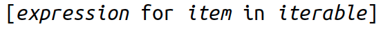
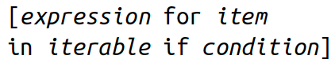
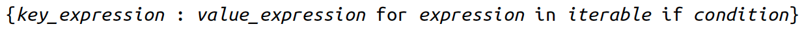

```{r setup, include = FALSE}
library(knitr)
library(kableExtra)
library(tidyverse)
library(NHSRtheme)
library(fontawesome)
# set default options
opts_chunk$set(echo = FALSE,
               fig.width = 7.252,
               fig.height = 4,
               comment = "#",
               dpi = 300)

knitr::knit_engines$set("markdown")

xaringanExtra::use_tile_view()
xaringanExtra::use_panelset()
xaringanExtra::use_clipboard()
xaringanExtra::use_webcam()
xaringanExtra::use_broadcast()
xaringanExtra::use_share_again()
xaringanExtra::style_share_again(
  share_buttons = c("twitter", "linkedin", "pocket")
)


xaringanExtra::use_extra_styles(
  hover_code_line = TRUE,         #<<
  mute_unhighlighted_code = F  #<<
)

# uncomment the following lines if you want to use the NHS-R theme colours by default
# scale_fill_continuous <- partial(scale_fill_nhs, discrete = FALSE)
# scale_fill_discrete <- partial(scale_fill_nhs, discrete = TRUE)
# scale_colour_continuous <- partial(scale_colour_nhs, discrete = FALSE)
# scale_colour_discrete <- partial(scale_colour_nhs, discrete = TRUE)
```

class: title-slide, left, bottom

# `r rmarkdown::metadata$title`
----
## **`r rmarkdown::metadata$subtitle`**
### `r rmarkdown::metadata$author`
### `r rmarkdown::metadata$date`


  

---
# Announcement 

### <p style="color:#00449E"> Installing the Spyder IDE </p>

- If the `input()` function does not work well with your Spyder IDE from Anaconda Distribution, install the Spyder IDE in addition to Anaconda.
  
  
- To install the Spyder IDE in addition to Anaconda, go to the following web-page:
  - [https://www.spyder-ide.org](https://www.spyder-ide.org).
  - Click the "DOWNLOAD" menu.


- After downloading the installation file, double-click it from the Finder/File Explorer.
  - After double-clicking the installation file, Mac users should click and drag the Spyder icon to the Applications folder.


---
# Workflow
### <p style="color:#00449E"> Shortcuts </p>
- **F9** runs a current line (where the blinking cursor bar is) or selected lines.

- **Home/End** moves the blinking cursor bar to the beginning/end of the line.
  - **Fn + ** `r fa("arrow-left")` / `r fa("arrow-right")` works too.

- **PgUp/PgDn** moves the blinking cursor bar to the top/bottom line of the script on the screen. 
  - **Fn + ** `r fa("arrow-up")` / `r fa("arrow-down")` works too.


---
# Workflow
### <p style="color:#00449E"> Shortcuts </p>
- **Ctrl + Enter/Return** runs a current cell, defined by `# %%`.

- Incidentally, **Ctrl + Enter/Return** is the keyboard shortcut for running the **selection** (or **current line**) in R Studio, not Spyder, which may be where I sometimes got confused.


- If you prefer using **Ctrl** (or **command**) **+ Return**, you can go to Tools -> Preferences -> Keyboard shortcuts. Search for 'run selection', double click and set **Ctrl/command+Return** as the 'New shortcut'.


- In my Spyder on Mac, I set **command + Return** for *running selection*, and **F9** for *running cell*.


---
# Workflow
### <p style="color:#00449E"> Shortcuts </p>

.pull-left[
### <p style="color:#00449E"> Mac </p>
- **command + N** opens a new script.
- **command + 1** is the shortcut for `#`.
- **command + 4** is the shortcut for block comment.
]

.pull-right[
### <p style="color:#00449E"> Windows </p>
- **Ctrl + N** opens a new script.
- **Ctrl + 1** is the shortcut for `#`.
- **Ctrl + 4** is the shortcut for block comment.
]

- `# %%` defines a coding block in Spyder IDE.

---
# Workflow
### <p style="color:#00449E"> More Shortcuts </p>


- **Ctrl** (**command** for Mac Users) **+ Z** undoes the previous action.
- **Ctrl** (**command** for Mac Users) **+ Shift + Z** redoes when undo is executed.


- **Ctrl** (**command** for Mac Users) **+ F** is useful when finding a phrase in the script.
- **Ctrl** (**command** for Mac Users) **+ R** is useful when replacing a specific phrase with something in the script.


- **Ctrl** (**command** for Mac Users) **+ D** deletes a current line.


---
class: inverse, center, middle

# Tuples and Lists
<html><div style='float:left'></div><hr color='#EB811B' size=1px width=796px></html>


---
# Tuples and Lists
### <p style="color:#00449E">  </p>

- In the previous classes, we started with some of Python’s basic data types: booleans, integers, floats, and strings. 
  
  - If we think of those as atoms, the data structures in tuples and lists are like molecules.
  

- Like strings, tuples and lists have a sequence structures indexed by their integer position.
  

- Unlike strings, the elements in tuples and lists can be of different types.
  

- Why does Python contain both lists and tuples? 

  - Tuples are immutable; when we assign elements (only once) to a tuple, they’re baked in the cake and can’t be changed.

  - Lists are mutable, meaning we can insert and delete elements with great enthusiasm.


---
# Tuples
### <p style="color:#00449E"> Create with Commas and () </p>

- The syntax to make tuples is a little inconsistent.

.panelset[
.panel[.panel-name[(1)]
- Let's begin by making an empty tuple using ():
```{python, eval = F, echo = T}
empty_tuple = ()
```

]

.panel[.panel-name[(2)]
- To make a tuple with one or more elements, follow each element with a comma. 
  - This works for one-element tuples:
```{python, eval = F, echo = T}
one_geneseo = 'Geneseo',
```

]

.panel[.panel-name[(3)]
- We could enclose them in parentheses and still get the same tuple:
```{python, eval = F, echo = T}
one_geneseo = ('Geneseo',)
```
]

.panel[.panel-name[(4)]
- If we have a single thing in parentheses and omit that comma, we would not get a tuple, but just the thing.
```{python, eval = F, echo = T}
one_geneseo = ('Geneseo')
```
]

.panel[.panel-name[(5)]
- If we have more than one element, follow all but the last one with a comma:
```{python, eval = F, echo = T}
suny_tuple = 'Geneseo', 'Borckport', 'Oswego'
```
]

.panel[.panel-name[(6)]
- We often don’t need parentheses when we define a tuple, but using parentheses is a little safer, and it helps to make the tuple more visible:
```{python, eval = F, echo = T}
suny_tuple = ('Geneseo', 'Borckport', 'Oswego')
```
]


.panel[.panel-name[(7)]
- We do need the parentheses for cases in which commas might also have another use.
```{python, eval = F, echo = T}
one_geneseo = 'Geneseo',
type(one_geneseo)

type('Groucho',)
type(('Groucho',))
```

]

.panel[.panel-name[(8)]
- Tuples let us assign multiple variables at once:
```{python, eval = F, echo = T}
suny_tuple = ('Geneseo', 'Borckport', 'Oswego')
a, b, c = suny_tuple
a
b
c
```

  - This is sometimes called *tuple unpacking*.

]

.panel[.panel-name[(9)]
- We can use tuples to exchange values in one statement without using a temporary
variable:
```{python, eval = F, echo = T}
password = 'swordfish'
icecream = 'tuttifrutti'
password, icecream = icecream, password

password
icecream
```

]


]


---
# Tuples
### <p style="color:#00449E">  </p>


.panelset[
.panel[.panel-name[`tuple()`]
### Create with `tuple()`
- The tuple() conversion function makes tuples from other things:

```{python, eval = F, echo = T}
suny_list = ['Geneseo', 'Borckport', 'Oswego']
tuple = tuple(suny_list)
```
]

.panel[.panel-name[with `+`]
### Combine Tuples by Using `+`
- This is similar to combining strings:

```{python, eval = F, echo = T}
('Geneseo',) + ('Borckport', 'Oswego')
```

]

.panel[.panel-name[with `*`]
### Duplicate Items with `*`
- This is like repeated use of `+`:

```{python, eval = F, echo = T}
('yada',) * 3
```

]

.panel[.panel-name[comparision]
### Compare Tuples
- This works much like list comparisons:

```{python, eval = F, echo = T}
a = (7, 2)
b = (7, 2, 9)
a == b
a <= b
a < b
```

]

.panel[.panel-name[`for` loop]
### Iterate with `for` and `in`
- Tuple iteration is like iteration of other types:

```{python, eval = F, echo = T}
words = ('fresh','out', 'of', 'ideas')
for word in words:
    print(word)
```

]

.panel[.panel-name[with `+=`]
### Modify a Tuple
- We can’t! 
  - Like strings, tuples are immutable, so we can’t change an existing one. 
  - As we saw just before, we can concatenate (combine) tuples to make a new one, as we can with strings:

```{python, eval = F, echo = T}
t1 = ('Fee', 'Fie', 'Foe')
id(t1)
t2 = ('Flop',)
t1 + t2
t1 += t2
id(t1)
```

]


]


---
# Lists

- Lists are good for keeping track of things by their order, especially when the order and contents might change.

  - Lists are *mutable*---we can change a list in place, add new elements, and delete or replace existing elements. 
  
  - The same value can occur more than once in a list.
  


---
# Lists

.panelset[
.panel[.panel-name[with `[]`]
### <p style="color:#00449E"> Create with [] </p>

- A list is made from zero or more elements, separated by commas and surrounded by
square brackets:
```{python, eval = F, echo = T}
empty_list = [ ]
weekdays = ['Monday', 'Tuesday', 'Wednesday', 'Thursday', 'Friday']
big_birds = ['emu', 'ostrich', 'cassowary']
first_names = ['Mary', 'Susan', 'Nicholas', 'Nicholas', 'Michael']
leap_years = [2012, 2016, 2020]
```

]


.panel[.panel-name[`list()`]
### Create or Convert with `list()`
- We can also make an empty list with the `list()` function.

- `list()` function also converts other iterable data types (such as tuples, strings, sets, and dictionaries) to lists.

```{python, eval = F, echo = T}
another_empty_list = list()
another_empty_list

list('cat')

a_tuple = ('ready', 'fire', 'aim')
list(a_tuple)
```
]


.panel[.panel-name[`split()`]
### Create from a String with `split()`
- We can use `split()` to chop a string into a *list* by some separator:

```{python, eval = F, echo = T}
coffee_day = '10/1/2022'
coffee_day.split('/')

splitme = 'a/b//c/d///e'
splitme.split('/')
splitme.split('//')
```
]

]


---
# Lists

.panelset[
.panel[.panel-name[`[offset]`]
### Get an Item by `[offset]`
- As with strings, we can extract a single value from a list by specifying its offset:
```{python, eval = F, echo = T}
suny = ['Geneseo', 'Brockport', 'Oswego']
```

.pull-left[
```{python, eval = F, echo = T}
suny[0]
suny[1]
suny[2]
suny[5]
```
]
.pull-right[
```{python, eval = F, echo = T}
suny[-1]
suny[-2]
suny[-3]
suny[-5]
```
]

]


.panel[.panel-name[slice]
### Get an Item with a Slice
- We can extract a subsequence of a list by using a *slice*:
```{python, eval = F, echo = T}
suny = ['Geneseo', 'Brockport', 'Oswego']
suny[0:2]    # A slice of a list is also a list.
```


.pull-left[
```{python, eval = F, echo = T}
suny[::2]
suny[::-2]
suny[::-1]
```
]
.pull-right[
```{python, eval = F, echo = T}
suny[4:]
suny[-6:]
suny[-6:-2]
suny[-6:-4]
```
]


]


.panel[.panel-name[`reverse()`]
### Reverse a list with `reverse()`
- To reverse a list in place, use `list.reverse()`:
```{python, eval = F, echo = T}
suny.reverse()
suny
```

]


.panel[.panel-name[`append()`]
### Add an Item to the End with `append()`
- The `append()` function adds items to the end of the list.
```{python, eval = F, echo = T}
suny = ['Geneseo', 'Brockport', 'Oswego']
suny.append('Buffalo')
suny

suny = ['Geneseo', 'Brockport', 'Oswego']
others = ['Buffalo', 'Cortland']
suny.append(others)
suny
```

]


.panel[.panel-name[`insert()`]
### Add an Item by Offset with `insert()`
- When we want to add an item before any offset in the list, we can use `insert()`.
```{python, eval = F, echo = T}
suny = ['Geneseo', 'Brockport', 'Oswego']
suny.insert(2, 'Buffalo')
suny
suny.insert(10, 'Cortland')
suny
```

]


.panel[.panel-name[`*`]
### Duplicate All Items with *
- We saw that we can duplicate a string’s characters with `*`. The same works for a list:
```{python, eval = F, echo = T}
["blah"] * 3

suny = ['Geneseo', 'Brockport', 'Oswego']
suny * 2
```

]


.panel[.panel-name[`extend()`]
### Combine Lists by Using `extend()` or `+`
- We can merge one list into another by using `extend()` or `+`.
```{python, eval = F, echo = T}
suny = ['Geneseo', 'Brockport', 'Oswego']
others = ['Buffalo', 'Cortland']
suny.extend(others)
suny

suny = ['Geneseo', 'Brockport', 'Oswego']
others = ['Buffalo', 'Cortland']
suny += others
suny
```

]


]


---
# Change Items in a List
### <p style="color:#00449E">  </p>

.panelset[
.panel[.panel-name[`[offset]`]
### Change an Item by `[offset]`
- Just as we can get the value of a list item by its offset, we can change it:

```{python, eval = F, echo = T}
suny = ['Geneseo', 'Brockport', 'Oswego']
suny[2] = 'Buffalo'
suny
```

- We can change how many items a list contains as well as the items themselves.
]


.panel[.panel-name[Slice]
### Change Items with a Slice
.pull-left[
- We can assign values to a sublist with a slice.
```{python, eval = F, echo = T}
numbers = [1, 2, 3, 4]
numbers[1:3] = ['eight', 'nine']
numbers
```
]
.pull-right[
- The right-hand thing that we’re assigning to the list doesn’t need to have the same number of elements as the slice on the left:
```{python, eval = F, echo = T}
numbers = [1, 2, 3, 4]
numbers[1:3] = [7, 8, 9]
numbers
```
]

]


.panel[.panel-name[`del`]
### Delete an Item by Offset with `del`
- We can use a `del` statement to delete an item by its position in a list.

```{python, eval = F, echo = T}
suny = ['Geneseo', 'Brockport', 'Oswego', 'Rochester']
suny[-1]
del suny[-1]    
suny
```

]


.panel[.panel-name[`remove()`]
### Delete an Item by Value with `remove()`
- If we're not sure or don’t care where the item is in the list, we can use `remove()` to delete it by value.

```{python, eval = F, echo = T}
suny = ['Geneseo', 'Brockport', 'Oswego', 'Rochester']
suny.remove('Rochester')
suny

suny = ['Geneseo', 'Brockport', 'Oswego', 'Rochester', 'Rochester']
suny.remove('Rochester')
suny
```

]


.panel[.panel-name[`pop()`]
### Get an Item by Offset and Delete It with `pop()`
- We can get an item from a list and delete it from the list at the same time by using `pop()`.
  - If we call `pop()` with an offset, it will return the item at that offset; with no argument, it uses -1.

```{python, eval = F, echo = T}
suny = ['Geneseo', 'Brockport', 'Oswego', 'Rochester']
suny.pop()
suny
suny.pop(1)
suny
```

]


.panel[.panel-name[`clear()`]
### Delete All Items with `clear()`
- We can use `clear()` to clear a list of all its elements:

```{python, eval = F, echo = T}
suny_roc = ['Rochester', 'Rochester', 'Rochester', 'Rochester']
suny.clear()
suny
```

]


]


---
# Lists
### <p style="color:#00449E">  </p>

.panelset[
.panel[.panel-name[`index()`]
### Find an Item’s Offset by Value with `index()`
- If we want to know the offset of an item in a list by its value, we use `index()`:

```{python, eval = F, echo = T}
suny = ['Geneseo', 'Brockport', 'Oswego', 'Buffalo']
suny.index('Geneseo')

suny = ['Geneseo', 'Brockport', 'Oswego', 'Geneseo']
suny.index('Geneseo')
```

]


.panel[.panel-name[`in`]
### Test for a Value with `in`
- The way to check for the existence of a value in a list is using `in`:

```{python, eval = F, echo = T}
suny = ['Geneseo', 'Brockport', 'Oswego', 'Buffalo']
'Geneseo' in suny
'Rochester' in suny

words = ['a', 'deer', 'a' 'male', 'deer']
'deer' in words
```

]


.panel[.panel-name[`count()`]
### Count Occurrences of a Value with `count()`
- To count how many times a particular value occurs in a list, we can use `count()`:

```{python, eval = F, echo = T}
suny = ['Geneseo', 'Brockport', 'Oswego', 'Buffalo']
suny.count('Geneseo')
suny.count('Rochester')

mcdonald = ['cheeseburger', 'cheeseburger', 'cheeseburger']
mcdonald.count('cheeseburger')
```

]


.panel[.panel-name[`join()`]
### Convert a List to a String with `join()`
- `join()` is a string method, not a list method.

```{python, eval = F, echo = T}
suny = ['Geneseo', 'Brockport', 'Oswego', 'Buffalo']
', '.join(suny)
```
  - We can’t say `suny.join(', ')`.

- The argument to `join()` is a string or any iterable sequence of strings (including a list), and its output is a string.


]


.panel[.panel-name[`sort`]
### Reorder Items with `sort()` or `sorted()`
- We may often need to sort the items in a list by their values rather than their offsets.
  - The list method `sort()` sorts the list itself, in place.
  - The general function `sorted()` returns a sorted copy of the list.

.pull-left[
```{python, eval = F, echo = T}
suny = ['Geneseo', 'Brockport', 
        'Oswego']
sorted_suny = sorted(suny)
sorted_suny
suny
```

]
.pull-right[
```{python, eval = F, echo = T}
suny.sort()
suny
```

]
]


.panel[.panel-name[`reverse=True`]
### Reorder Items with `sort()` or `sorted()`
- The default sort order is ascending, but we can add the argument `reverse=True` to set it to descending.

.pull-left[
```{python, eval = F, echo = T}
numbers = [2, 1, 4.0, 3]
numbers.sort()
numbers
numbers = [2, 1, 4.0, 3]
numbers.sort(reverse=True)
numbers
```

]
.pull-right[
```{python, eval = F, echo = T}
suny = ['Geneseo', 'Brockport', 
        'Oswego']
sorted_suny = sorted(suny, 
                     reverse=True)
sorted_suny
```

]
]


.panel[.panel-name[`len()`]
### Get Length with `len()`
- `len()` returns the number of items in a list:

```{python, eval = F, echo = T}
suny = ['Geneseo', 'Brockport', 'Oswego']
len(suny)
```

]


]


---
# Lists
### <p style="color:#00449E">  </p>

.panelset[

.panel[.panel-name[`=`]
### Assign with `=`
- When we assign one list to more than one variable, changing the list in one place also changes it in the other:

.pull-left[
```{python, eval = F, echo = T}
a = [1, 2, 3]
b = a
b
a[0] = 'suprise'
a
```
- So what’s in `b` now?

]
.pull-right[
```{python, eval = F, echo = T}
b[0] = 'I hate suprises'
b
```
- So what’s in `a` now?
]
]


.panel[.panel-name[copy]
### Copy with copy(), list(), or a Slice
We can copy the values of a list to an independent, fresh list by using (1) the list `copy()` method, (2) the `list()` conversion function, or (3) the list slice `[:]`:
  
.pull-left[
```{python, eval = F, echo = T}
a = [1, 2, 3]
b = a.copy()
c = list(a)
d = a[:]
a[0] = 'integer lists'
```


]
.pull-right[
- `b`, `c`, and `d` are copies of `a`: 
  - They are new objects with their own values and no connection to the original list object [1, 2, 3] to which `a` refers.
  - What are `b`, `c`, and `d` now?

]
]


.panel[.panel-name[deepcopy]
### Copy with copy(), list(), or a Slice
- Using (1) the list `copy()` method, (2) the `list()` conversion function, or (3) the list slice `[:]` works well if the list values are all *immutable*.
  
.pull-left[
```{python, eval = F, echo = T}
a = [1, 2, [8, 9]]
b = a.copy()
c = list(a)
d = a[:]
a[2][1] = 10
```


]
.pull-right[
- `b`, `c`, and `d` are copies of `a`.
- The value of `a[2]` is now a list, and its elements can be changed.

  - What are `b`, `c`, and `d` now?
]
]


.panel[.panel-name[`deepcopy()`]
### Copy with copy(), list(), or a Slice
- To fix these *shallow* copies, we need to use the `deepcopy()` function:
  
.pull-left[
```{python, eval = F, echo = T}
import copy
a = [1, 2, [8, 9]]
b = copy.deepcopy(a)
a[2][1] = 10
a
b
```


]
.pull-right[
-  `deepcopy()` can handle deeply nested lists, dictionaries, and other objects.

- We'll discuss more about `import` soon.
]
]


.panel[.panel-name[comparison]
### Compare Lists
- We can directly compare lists with the comparison operators like `==`, `<`, and so on.

.pull-left[
```{python, eval = F, echo = T}
a = [7, 2]
b = [7, 2, 9]

a == b
a <= b
a < b
```


]
.pull-right[
- The operators walk through both lists, comparing elements at the same offsets. 
- If list `a` is shorter than list `b`, and all of its elements are equal, `a` is less than `b`.
]
]

]


---
# Lists
### <p style="color:#00449E"> Iterate with `for` and `in` </p>


.panelset[
.panel[.panel-name[`for`]
- `for` loop is quite common to iterate over lists.

```{python, eval = F, echo = T}
cheeses = ['brie', 'gjetost', 'havarti']
for cheese in cheeses:
    print(cheese)
```
]


.panel[.panel-name[`break`]
- `break` ends the for loop and `continue` steps to the next iteration:
```{python, eval = F, echo = T}
cheeses = ['brie', 'gjetost', 'havarti']
for cheese in cheeses:
    if cheese.startswith('g'):
        print("I won't eat anything that starts with 'g'")
        break
    else:
        print(cheese)
```
]


.panel[.panel-name[`else` (1)]
- We can still use the optional `else` if the for completed without a `break`:
```{python, eval = F, echo = T}
cheeses = ['brie', 'gjetost', 'havarti']
for cheese in cheeses:
    if cheese.startswith('x'):
        print("I won't eat anything that starts with 'x'")
        break
    else:
        print(cheese)
else:
    print("Didn't find anything that started with 'x'")
```
]

.panel[.panel-name[`else` (2)]
- If the initial `for` never ran, control goes to the `else`:
```{python, eval = F, echo = T}
cheeses = []
for cheese in cheeses:
    print('This shop has some lovely', cheese)
    break
else: # no break means no cheese
    print('This is not much of a cheese shop, is it?')
```
]

]


---
# Lists
### <p style="color:#00449E"> Iterate Multiple Sequences with `zip()` </p>

.panelset[
.panel[.panel-name[`for` and `zip()`]
- There’s one more nice iteration trick: iterating over multiple sequences in parallel by using the `zip()` function.

```{python, echo = T, eval = F}
days = ['Monday', 'Tuesday', 'Wednesday']
fruits = ['banana', 'orange', 'peach']
drinks = ['coffee', 'coffee', 'coffee']
desserts = ['tiramisu', 'ice cream', 'pie', 'pudding']
for day, fruit, drink, dessert in zip(days, fruits, drinks, desserts):
    print(day, ": drink", drink, "- eat", fruit, "- enjoy", dessert)

```

]

.panel[.panel-name[`zip()`, `list()`, and `dict()`]
- We can use `zip()` to walk through multiple sequences and make tuples from items at the same offsets.

```{python, echo = T, eval = F}
english = 'Monday', 'Tuesday', 'Wednesday'
french = 'Lundi', 'Mardi', 'Mercredi'

list( zip(english, french) )
dict( zip(english, french) )
```
- We will discuss soon how the `dict()` function can create dictionaries from two-item sequences like tuples, lists, or strings.

]

]

---
# Lists
### <p style="color:#00449E"> Create a List with a Comprehension </p>

- Here, we look at how to create a list with a list *comprehension*, which incorporates the `for`/`in` iteration that we just saw.

  - Let's make a list of integers from 1 to 5:

.panelset[
.panel[.panel-name[`append()`]
```{python, echo = T, eval = F}
number_list = []
number_list.append(1)
number_list.append(2)
number_list.append(3)
number_list.append(4)
number_list.append(5)
```
]


.panel[.panel-name[`for`/`append()`]
```{python, echo = T, eval = F}
number_list = []
for number in range(1, 6):
    number_list.append(number)

number_list
```
]


.panel[.panel-name[`range()`]
```{python, echo = T, eval = F}
number_list = list(range(1, 6))
number_list
```
]


.panel[.panel-name[comprehession]
```{python, echo = T, eval = F}
number_list = [number for number in range(1,6)]
number_list
```
]


]


---
# Lists
### <p style="color:#00449E"> Create a List with a Comprehension </p>


.panelset[
.panel[.panel-name[basic]
- *List comprehensions* are a convenient and widely used Python language feature. 
  - The simplest form of list comprehension looks like this:

```{r, echo=FALSE, out.width = '66%', fig.align='center'}

```
]

.panel[.panel-name[example 1]
```{python, echo = T, eval = F}
number_list = [number for number in range(1,6)]
number_list
```
- In the first line, we need the first `number` variable to produce values for the list: that is, to put a result of the loop into `number_list`. 

- The second `number` is part of the for loop.
]

.panel[.panel-name[example 2]
- To show that the first `number` in example 1 is an expression, try this variant:

```{python, echo = T, eval = F}
number_list = [number - 1 for number in range(1,6)]
number_list
```
- The list comprehension moves the loop inside the square brackets.
]


.panel[.panel-name[with if]
- A list comprehension can include a conditional expression, looking something like this:

```{r, echo=FALSE, out.width = '50%', fig.align='center'}

```


- Let’s make a new comprehension that builds a list of only the odd numbers between 1 and 5.
```{python, echo = T, eval = F}
a_list = [number for number in range(1,6) if number % 2 == 1]
```
]

.panel[.panel-name[traditional `for`]
- Now, the comprehension is a little more compact than its traditional counterpart:
```{python, echo = T, eval = F}
a_list = []
for number in range(1,6):
    if number % 2 == 1:
        a_list.append(number)
```
]


]


---
# Lists
### <p style="color:#00449E"> Create a List with a Comprehension </p>

.panelset[
.panel[.panel-name[nested `for`]
- Just as there can be nested loops, there can be more than one set of `for ...` clauses in the corresponding comprehension.

```{python, echo = T, eval = F}
rows = range(1,4)
cols = range(1,3)
for row in rows:
    for col in cols:
        print(row, col)
```
]


.panel[.panel-name[comprehension using nested `for`]
- Let’s use a comprehension and assign it to the variable cells, making it a list of *(row, col)* tuples:

```{python, echo = T, eval = F}
rows = range(1,4)
cols = range(1,3)
cells = [(row, col) for row in rows for col in cols]

for cell in cells:
    print(cell)
```

]

.panel[.panel-name[tuple unpacking]
- We can also use *tuple unpacking* to get the row and col values from each tuple as we iterate over the cells list.

```{python, echo = T, eval = F}
rows = range(1,4)
cols = range(1,3)
cells = [(row, col) for row in rows for col in cols]

for row, col in cells:
    print(row, col)
```

]


]


---
# Lists
### <p style="color:#00449E"> Lists of Lists </p>

- Lists can contain elements of different types, including other lists:

```{python, echo = T, eval = F}
small_birds = ['hummingbird', 'finch']
extinct_birds = ['dodo', 'passenger pigeon', 'Norwegian Blue']
carol_birds = [3, 'French hens', 2, 'turtledoves']
all_birds = [small_birds, extinct_birds, 'macaw', carol_birds]
```

- So what does `all_birds`, a list of lists, look like?

```{python, echo = T, eval = F}
all_birds
all_birds[0]
all_birds[1]
all_birds[1][0]  # [0] refers to the first item in that inner list.
```


---
# Tuples and Lists
### <p style="color:#00449E"> Tuples Versus Lists </p>
- We can often use tuples in place of lists, but tuples have many fewer functions—there is no `append()`, `insert()`, and so on—because they can’t be modified after creation.


- Why not just use lists instead of tuples everywhere?
  - Tuples use less space.
  - We can’t clobber tuple items by mistake.
  - We can use tuples as dictionary keys, which we will cover soon.


- In everyday programming, we would use lists and dictionaries more.


---
# Tuples and Lists
### <p style="color:#00449E"> There Are No Tuple Comprehensions </p>
- Mutable types (lists, dictionaries, and sets) have comprehensions. 
  
  
- Would changing the square brackets of a list comprehension to
parentheses create a tuple comprehension? 

```{python, echo = T, eval = F}
number_thing = (number for number in range(1, 6))
type(number_thing)
```

- A *generator* is one way to provide data to an iterator.


---
# Tuples and Lists
### <p style="color:#00449E"> Class Exercises 1 </p>
1. Create a list called `years_list`, starting with the year of your birth, and each year thereafter until the year of your fifth birthday. For example, if you were born in 2003, the list would be years_list = [2003, 2004, 2005, 2006, 2007, 2008].

2. In which of these years was your third birthday? Remember, you were 0 years of age for your first year.

3. In which year in `years_list` were you the oldest?


---
# Tuples and Lists
### <p style="color:#00449E"> Class Exercises 2 </p>
1. Make a list called `things` with these three strings as elements: `"mozzarella"`, `"cinderella"`, `"salmonella"`.

2. Capitalize the element in `things` that refers to a person and then print the list. Did it change the element in the list?

3. Make the cheesy element of `things` all uppercase and then print the list.

4. Delete the disease element of `things`, and then print the list.


---
# Tuples and Lists
### <p style="color:#00449E"> Class Exercises 3 </p>
1. Create a list called `surprise` with the elements `"Groucho"`, `"Chico"`, and `"Harpo"`.

2. Lowercase the last element of the `surprise` list, reverse it, and then capitalize it.


---
# Tuples and Lists
### <p style="color:#00449E"> Class Exercises 4 </p>
1. Use a list comprehension to make a list called `even` of the even numbers in `range(10)`.


---
class: inverse, center, middle

# Dictionaries and Sets
<html><div style='float:left'></div><hr color='#EB811B' size=1px width=796px></html>


---
# Dictionaries

- A *dictionary* is similar to a list, but the order of items doesn’t matter, and they aren’t selected by an offset such as 0 or 1.

  - Instead, we specify a unique *key* to associate with each value.

  - This *key* is often a string, but it can actually be any of Python’s immutable types: boolean, integer, float, tuple, string, and others.

- Dictionaries are mutable, so we can add, delete, and change their key-value elements.


---
# Dictionaries
### <p style="color:#00449E"> Create with `{}` </p>

- To create a dictionary, we place curly brackets (`{}`) around comma-separated **key : value** pairs.

```{python, echo = T, eval = F}
empty_dict = {}

empty_dict
```

Let’s make a small dictionary with quotes from Ambrose Bierce’s *The Devil’s Dictionary*:

```{python, echo = T, eval = F}
bierce = {"day": "A period of twenty-four hours, mostly misspent",
          "positive": "Mistaken at the top of one's voice",
          "misfortune": "The kind of fortune that never misses"}
bierce
```

---
# Dictionaries
### <p style="color:#00449E"> Create with `dict()` </p>

- We can also create a dictionary by passing named arguments and values to the `dict()` function.

```{python, echo = T, eval = F}
acme_customer = {'first': 'Wile', 'middle': 'E', 'last': 'Coyote'}
acme_customer

acme_customer = dict(first = "Wile", middle = "E", last = "Coyote")
acme_customer
```

- The argument names in `dict()` need to be legal variable names (no spaces, no reserved words):

```{python, echo = T, eval = F}
x = dict(name="Elmer", def="hunter")
```

---
# Dictionaries
### <p style="color:#00449E"> Convert with `dict()` </p>

- We can use `dict()` to convert two-value sequences into a dictionary.
  - We might run into such key-value sequences at times, such as "Geneseo, 20, Brockport, 14." 
  - The first item in each sequence is used as the key and the second as the value.


.panelset[
.panel[.panel-name[lol]
- *lol* (a list of two-item lists):

```{python, echo = T, eval = F}
lol = [ ['a', 'b'], ['c', 'd'], ['e', 'f'] ]
dict(lol)
```
]

.panel[.panel-name[lot]
- *lot* (a list of two-item tuples):

```{python, echo = T, eval = F}
lot = [ ('a', 'b'), ('c', 'd'), ('e', 'f') ]
dict(lot)
```
]

.panel[.panel-name[tol]
- *tol* (a tuple of two-item lists):

```{python, echo = T, eval = F}
tol = ( ['a', 'b'], ['c', 'd'], ['e', 'f'] )
dict(tol)
```
]

.panel[.panel-name[los]
- *los* (a list of two-character strings):

```{python, echo = T, eval = F}
los = [ 'ab', 'cd', 'ef' ]
dict(los)
```
]

.panel[.panel-name[tos]
- *tos* (a tuple of two-character strings):

```{python, echo = T, eval = F}
tos = ( 'ab', 'cd', 'ef' )
dict(tos)
```
]

]


---
# Dictionaries
### <p style="color:#00449E"> Add or Change an Item by `[ key ]` </p>

- Adding an item to a dictionary is not complicated. 

  - Just refer to the item by its *key* and assign a *value*.
  
  - If the key was already present in the dictionary, the existing value is replaced by the new one. 
  
  - If the key is new, it’s added to the dictionary with its value.


---
# Dictionaries
### <p style="color:#00449E"> Add or Change an Item by `[ key ]` </p>


.panelset[
.panel[.panel-name[st_city]
- Let's make a dictionary of some pairs of US cities and states, using their states as *keys* and city names as *values*:

```{python, echo = T, eval = F}
st_city = {
  'MN': 'Rochester',
  'WY': 'Laramie',
  'CO': 'Denver'
  }
st_city
```
]

.panel[.panel-name[Rocjester]
- Here, we want to add Rochester, NY.
  - Here’s an attempt to add it, but it spelled wrong:

```{python, echo = T, eval = F}
st_city['NY'] = 'Rocjester'
st_city
```
]

.panel[.panel-name[Rochester]
- Here's some repair code:

```{python, echo = T, eval = F}
st_city['NY'] = 'Rochester'
st_city
```
]

.panel[.panel-name[city_st]
-  Remember that dictionary keys must be unique. 
  - That’s why we used state names for keys instead of city names.
  - If we use a key more than once, the last value wins:
```{python, echo = T, eval = F}
city_st = {
  'Rochester': 'MN',
  'Laramie': 'WY',
  'Denver': 'CO',
  'Rochester': 'NY'
  }
city_st
```
]

]


---
# Dictionaries
### <p style="color:#00449E"> Get an Item by `[key]` or with `get()` </p>

.panelset[
.panel[.panel-name[`[key]`]
- We specify the dictionary and key to get the corresponding value: 
```{python, echo = T, eval = F}
city_st = {
  'Rochester': 'MN',
  'Laramie': 'WY',
  'Denver': 'CO',
  'Rochester': 'NY'
  }
city_st['Denver']
```
]

.panel[.panel-name[`[key]`]
- If the key is not present in the dictionary, we'll get an exception:
```{python, echo = T, eval = F}
city_st['Buffalo']
```

- There are two good ways to avoid this: `in` and `get()`
]

.panel[.panel-name[`in`]
- Test for the key at the outset by using `in`:
```{python, echo = T, eval = F}
'Buffalo' in city_st
```
]
.panel[.panel-name[`get()`]
- Use the special dictionary `get()` function.
  - If the key exists, we get its value:
```{python, echo = T, eval = F}
city_st.get('Denver')
```
]

.panel[.panel-name[`get()`]
- Use the special dictionary `get()` function.
  - If the key does not exist and the optional value is provided, we get the optional value:
```{python, echo = T, eval = F}
city_st('Buffalo', 'Not in city_st')
```
]


.panel[.panel-name[`get()`]
- Use the special dictionary `get()` function.
  - If the key does not exist and the optional value is not provided, we get `None`, which displays nothing in the console.
```{python, echo = T, eval = F}
city_st('Buffalo')
```
]

]


---
# Dictionaries

.panelset[
.panel[.panel-name[`keys()`]
### <p style="color:#00449E"> Get All Keys with `keys()` </p>

- We can use `keys()` to get all of the keys in a dictionary. 
```{python, echo = T, eval = F}
signals = {'green': 'go', 
           'yellow': 'go faster', 
           'red': 'smile for the camera'}
signals.keys()
list( signals.keys() )   # to turn the result into a list object.
```
]

.panel[.panel-name[`values()`]
### <p style="color:#00449E"> Get All Values with values() </p>

- To obtain all the values in a dictionary, use `values()`:
```{python, echo = T, eval = F}
signals = {'green': 'go', 
           'yellow': 'go faster', 
           'red': 'smile for the camera'}
signals.values()
list( signals.values() )   # to turn the result into a list object.
```
]

.panel[.panel-name[`items()`]
### <p style="color:#00449E"> Get All Key-Value Pairs with `items()` </p>

- When we want to get all the key-value pairs from a dictionary, use the `items()` function:
```{python, echo = T, eval = F}
signals = {'green': 'go', 
           'yellow': 'go faster', 
           'red': 'smile for the camera'}
signals.items()
list( signals.items() )   # to turn the result into a list object.
```
]


.panel[.panel-name[`items()`]
### <p style="color:#00449E"> Get Length with `len()` </p>

- Count your key-value pairs:
```{python, echo = T, eval = F}
signals = {'green': 'go', 
           'yellow': 'go faster', 
           'red': 'smile for the camera'}
len(signals)
```
]


.panel[.panel-name[{**a, **b}]
### <p style="color:#00449E"> Combine Dictionaries with `{**a, **b}` </p>

- Starting with Python 3.5, there’s a new way to merge dictionaries, using the `**`:
```{python, echo = T, eval = F}
first = {'a': 'agony', 'b': 'bliss'}
second = {'b': 'bagels', 'c': 'candy'}
{**first, **second}

third = {'d': 'donuts'}
{**first, **third, **second}
```
]

.panel[.panel-name[`update()`]
### <p style="color:#00449E"> Combine Dictionaries with `update()` </p>

- We can use the `update()` function to copy the keys and values of one dictionary into another.
  - Let's update `st_city` with `other_city`
```{python, echo = T, eval = F}
st_city = { 'MN': 'Rochester',
            'WY': 'Laramie',
            'CO': 'Denver',
            'NY': 'Rochester' }
  
other_city = {'MA': 'Boston'}
st_city.update(other_city)
```
]

.panel[.panel-name[`update()`]
### <p style="color:#00449E"> Combine Dictionaries with `update()` </p>

- What happens if the second dictionary has the same key as the dictionary into which it’s being merged?
```{python, echo = T, eval = F}
first = {'a': 1, 'b': 2}
second = {'b': 'platypus'}
first.update(second)
first
```
]

]


---
# Dictionaries


.panelset[
.panel[.panel-name[`del`]
### <p style="color:#00449E"> Delete an Item by Key with `del` </p>

- We can delete an item in a dictionary with `del`:
```{python, echo = T, eval = F}
del st_city['NY']
st_city
```
]

.panel[.panel-name[`pop()`]
### <p style="color:#00449E"> Get an Item by Key and Delete It with `pop()` </p>

- `pop()` combines get() and del. 
  - If we give `pop()` a key and it exists in the dictionary, it returns the matching value and deletes the key-value pair. 
  - If it doesn’t exist, it raises an exception:
  - If the key doesn’t exist but we give `pop()` a second default argument, all is well and the dictionary is not changed:

```{python, echo = T, eval = F}
len(st_city)
st_city.pop('MN')
len(st_city)
st_city.pop('MN')
st_city.pop('MN', 'Not exist')
```
]

.panel[.panel-name[`clear()`]
### <p style="color:#00449E"> Delete All Items with `clear()` </p>

- To delete all keys and values from a dictionary, use `clear()` or just reassign an empty dictionary (`{}`) to the name:

```{python, echo = T, eval = F}
st_city.clear()
st_city

st_city = { 'MN': 'Rochester',
            'WY': 'Laramie',
            'CO': 'Denver',
            'NY': 'Rochester' }
st_city = {}
st_city
```
]


.panel[.panel-name[`in`]
### <p style="color:#00449E"> Test for a Key with `in` </p>

- If we want to know whether a key exists in a dictionary, use `in`:

```{python, echo = T, eval = F}
st_city = { 'MN': 'Rochester',
            'WY': 'Laramie',
            'CO': 'Denver',
            'NY': 'Rochester' }
'NY' in st_city
'WY' in st_city
'CA' in st_city
```
]


.panel[.panel-name[`=`]
### <p style="color:#00449E"> Assign with `=` </p>

- If we make a change to a dictionary, it will be reflected in all the names that refer to it:

```{python, echo = T, eval = F}
signals = { 'green': 'go',
            'yellow': 'go faster',
            'red': 'smile for the camera' }
save_signals = signals
signals['blue'] = 'confuse everyone'
signals
```
- What are in `save_signals` now?

]


.panel[.panel-name[`copy()`]
### <p style="color:#00449E"> Assign with `=` </p>

- To actually copy keys and values from a dictionary to another dictionary and avoid this, we can use `copy()`:

```{python, echo = T, eval = F}
signals = { 'green': 'go',
            'yellow': 'go faster',
            'red': 'smile for the camera' }
original_signals = signals.copy()
signals['blue'] = 'confuse everyone'
signals
```
- What are in `original_signals` now?

]


.panel[.panel-name[`(1)`]
### <p style="color:#00449E"> Copy Everything with `deepcopy()` </p>

- Suppose that the value for *red* in `signals` was a list instead of a single string:

```{python, echo = T, eval = F}
signals = { 'green': 'go',
            'yellow': 'go faster',
            'red': ['stop', 'smile'] }
signals_copy = signals.copy()
signals
```
- What are in `signals_copy`?

]


.panel[.panel-name[`(2)`]
### <p style="color:#00449E"> Copy Everything with `deepcopy()` </p>

- Let’s change one of the values in the *red* list:

```{python, echo = T, eval = F}
signals = { 'green': 'go',
            'yellow': 'go faster',
            'red': ['stop', 'smile'] }
signals_copy = signals.copy()
signals['red'][1] = 'sweat'
signals
```
- What are in `signals_copy`?

]

.panel[.panel-name[`deepcopy()`]
### <p style="color:#00449E"> Copy Everything with `deepcopy()` </p>

- To avoid this, we can use `deepcopy()`:
```{python, echo = T, eval = F}
import copy
signals = { 'green': 'go',
            'yellow': 'go faster',
            'red': ['stop', 'smile'] }
signals_deepcopy = copy.deepcopy(signals)
signals
signals_deepcopy
signals['red'][1] = 'sweat'
signals
```
- What are in `signals_deepcopy`?


]

]


---
# Dictionaries


.panelset[
.panel[.panel-name[comparison]
### <p style="color:#00449E"> Compare Dictionaries </p>

- Much like lists and tuples, dictionaries can be compared with the simple comparison operators `==` and `!=`:
```{python, echo = T, eval = F}
a = {1:1, 2:2, 3:3}
b = {3:3, 1:1, 2:2}
a == b
a != b
a <= b  # does it work?
```

]


.panel[.panel-name[`for`]
### <p style="color:#00449E"> Iterate with `for` and `in` </p>
- Iterating over a dictionary (or its `keys()` function) returns the keys. 

```{python, echo = T, eval = F}
accusation = {'room': 'ballroom', 
              'weapon': 'lead pipe',
              'person': 'Col. Mustard'}
for card in accusation: # or, for card in accusation.keys():
    print(card)
```

]


.panel[.panel-name[`values()`]
### <p style="color:#00449E"> Iterate with `for` and `in` </p>
- To iterate over the values rather than the keys, we use the dictionary’s `values()` function:


```{python, echo = T, eval = F}
accusation = {'room': 'ballroom', 
              'weapon': 'lead pipe',
              'person': 'Col. Mustard'}
for value in accusation.values():
    print(value)
```

]


.panel[.panel-name[`items()`]
### <p style="color:#00449E"> Iterate with `for` and `in` </p>
- To return both the key and value as a tuple, we can use the `items()` function:


```{python, echo = T, eval = F}
accusation = {'room': 'ballroom', 
              'weapon': 'lead pipe',
              'person': 'Col. Mustard'}
for item in accusation.items():
    print(item)
```

]
.panel[.panel-name[`items()`]
### <p style="color:#00449E"> Iterate with `for` and `in` </p>
- For each tuple returned by `items()`, let's assign the first value (the key) to *card*, and the second (the value) to *contents*:

```{python, echo = T, eval = F}
accusation = {'room': 'ballroom', 
              'weapon': 'lead pipe',
              'person': 'Col. Mustard'}
for card, contents in accusation.items():
    print('Card', card, 'has the contents', contents)
```

]


.panel[.panel-name[comprehensions]
### <p style="color:#00449E"> Dictionary Comprehensions </p>
- Dictionaries also have comprehensions.
  - The simplest form of dictionary comprehension looks like this:

```{r, echo=FALSE, out.width = '70%', fig.align='center'}
knitr::include_graphics("../lec_figs/int-py-dict-comprehension.png")
```

]

.panel[.panel-name[comprehensions]
### <p style="color:#00449E"> Dictionary Comprehensions </p>

- Let's run a loop over each of the seven letters in the string 'letters' and counting how many times that letter appears.

```{python, echo = T, eval = F}
word = 'letters'
letter_counts = {letter: word.count(letter) for letter in word}
letter_counts
```

- How many times do we count 't' here?
]


.panel[.panel-name[comprehensions w/ `set()`]
### <p style="color:#00449E"> Dictionary Comprehensions </p>

- Let's run a loop over each of the seven letters in the string 'letters' and counting how many times that letter appears.

```{python, echo = T, eval = F}
word = 'letters'
letter_counts = {letter: word.count(letter) for letter in set(word)}
letter_counts
```

- How many times do we count 't' here?

]


.panel[.panel-name[comprehensions w/ if]
### <p style="color:#00449E"> Dictionary Comprehensions </p>
- Dictionary comprehensions can also have *if* tests and multiple *for* clauses:

```{r, echo=FALSE, out.width = '70%', fig.align='center'}

```

```{python, echo = T, eval = F}
vowels = 'aeiou'
word = 'onomatopoeia'
vowel_counts = {letter: word.count(letter) for letter in set(word) if letter in vowels}
vowel_counts
```

]

]