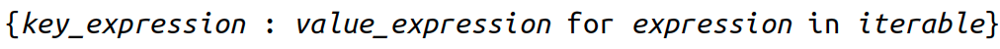
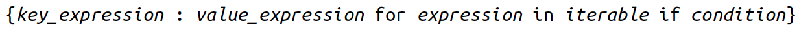
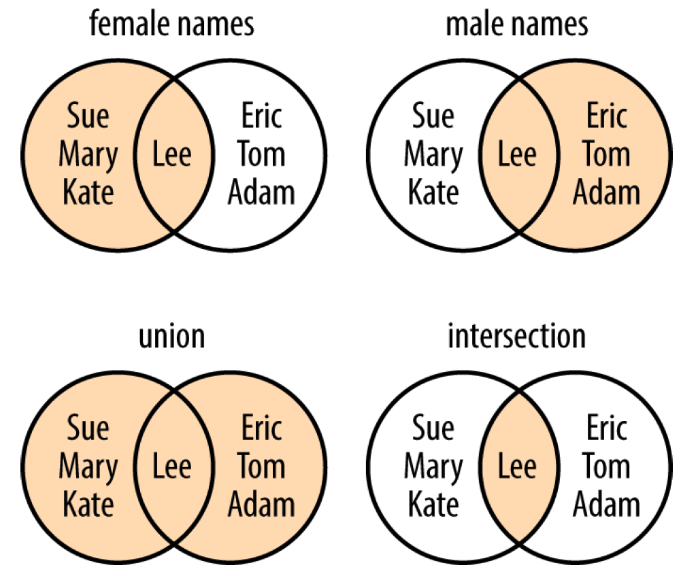
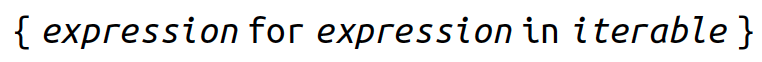
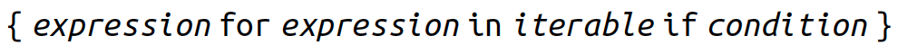

```{r setup, include = FALSE}
library(knitr)
library(kableExtra)
library(tidyverse)
library(NHSRtheme)
library(fontawesome)
# set default options
opts_chunk$set(echo = FALSE,
               fig.width = 7.252,
               fig.height = 4,
               comment = "#",
               dpi = 300)

knitr::knit_engines$set("markdown")

xaringanExtra::use_tile_view()
xaringanExtra::use_panelset()
xaringanExtra::use_clipboard()
xaringanExtra::use_webcam()
xaringanExtra::use_broadcast()
xaringanExtra::use_share_again()
xaringanExtra::style_share_again(
  share_buttons = c("twitter", "linkedin", "pocket")
)


xaringanExtra::use_extra_styles(
  hover_code_line = TRUE,         #<<
  mute_unhighlighted_code = F  #<<
)

# uncomment the following lines if you want to use the NHS-R theme colours by default
# scale_fill_continuous <- partial(scale_fill_nhs, discrete = FALSE)
# scale_fill_discrete <- partial(scale_fill_nhs, discrete = TRUE)
# scale_colour_continuous <- partial(scale_colour_nhs, discrete = FALSE)
# scale_colour_discrete <- partial(scale_colour_nhs, discrete = TRUE)
```

class: title-slide, left, bottom

# `r rmarkdown::metadata$title`
----
## **`r rmarkdown::metadata$subtitle`**
### `r rmarkdown::metadata$author`
### `r rmarkdown::metadata$date`


---
# Exam Policies
During the exam, ...
- Students can read any books, paper sheets, PDF files on PDF reader apps, Python Scripts or text files on Spyder.
  - Students are not allowed to use other apps, for example, Google Docs, Google Sheets, Microsoft Word, Microsoft Excel, Microsoft PowerPoint, Numbers, Pages, Keynotes, Notes.
- Students can visit (1) the class website (https://bcdanl.github.io) and (2) the Canvas website for the course.
  - Students are not allowed to visit any other websites, such as Google, Stack Overflow, and Gmail.
- Students can communicate with Byeong-Hak Choe.
  - Students are not allowed to communicate with other students.


---
class: inverse, center, middle

# Dictionaries and Sets
<html><div style='float:left'></div><hr color='#EB811B' size=1px width=796px></html>


---
# Dictionaries

- A *dictionary* is similar to a list, but the order of items doesn't matter, and they aren't selected by an offset such as 0 or 1.

  - Instead, we specify a unique *key* to associate with each value.

  - This *key* is often a string, but it can actually be any of Python's immutable types: boolean, integer, float, tuple, string, and others.

- Dictionaries are mutable, so we can add, delete, and change their key-value elements.

---
# Dictionaries
### <p style="color:#00449E"> Create with `dict()` </p>

- We can also create a dictionary by passing named arguments and values to the `dict()` function.

```{python, echo = T, eval = F}
acme_customer = {'first': 'Wile', 'middle': 'E', 'last': 'Coyote'}
acme_customer

acme_customer = dict(first = "Wile", middle = "E", last = "Coyote")
acme_customer
```

- The argument names in `dict()` need to be legal variable names (no spaces, no reserved words):

```{python, echo = T, eval = F}
x = dict(name="Elmer", def="hunter")
```

---
# Dictionaries
### <p style="color:#00449E"> Convert with `dict()` </p>

- We can use `dict()` to convert two-value sequences into a dictionary.
  - We might run into such key-value sequences at times, such as "Geneseo, 20, Brockport, 14." 
  - The first item in each sequence is used as the key and the second as the value.


.panelset[
.panel[.panel-name[lol]
- *lol* (a list of two-item lists):

```{python, echo = T, eval = F}
lol = [ ['a', 'b'], ['c', 'd'], ['e', 'f'] ]
dict(lol)
```
]

.panel[.panel-name[lot]
- *lot* (a list of two-item tuples):

```{python, echo = T, eval = F}
lot = [ ('a', 'b'), ('c', 'd'), ('e', 'f') ]
dict(lot)
```
]

.panel[.panel-name[tol]
- *tol* (a tuple of two-item lists):

```{python, echo = T, eval = F}
tol = ( ['a', 'b'], ['c', 'd'], ['e', 'f'] )
dict(tol)
```
]

.panel[.panel-name[los]
- *los* (a list of two-character strings):

```{python, echo = T, eval = F}
los = [ 'ab', 'cd', 'ef' ]
dict(los)
```
]

.panel[.panel-name[tos]
- *tos* (a tuple of two-character strings):

```{python, echo = T, eval = F}
tos = ( 'ab', 'cd', 'ef' )
dict(tos)
```
]

]


---
# Dictionaries
### <p style="color:#00449E"> Add or Change an Item by `[ key ]` </p>


.panelset[
.panel[.panel-name[st_city]
- Let's make a dictionary of some pairs of US cities and states, using their states as *keys* and city names as *values*:

```{python, echo = T, eval = F}
st_city = {
  'MN': 'Rochester',
  'WY': 'Laramie',
  'CO': 'Denver'
  }
st_city
```
]

.panel[.panel-name[Rocjester]
- Here, we want to add Rochester, NY.
  - Here's an attempt to add it, but it spelled wrong:

```{python, echo = T, eval = F}
st_city['NY'] = 'Rocjester'
st_city
```
]

.panel[.panel-name[Rochester]
- Here's some repair code:

```{python, echo = T, eval = F}
st_city['NY'] = 'Rochester'
st_city
```
]

.panel[.panel-name[city_st]
-  Remember that dictionary keys must be unique. 
  - That's why we used state names for keys instead of city names.
  - If we use a key more than once, the last value wins:
```{python, echo = T, eval = F}
city_st = {
  'Rochester': 'MN',
  'Laramie': 'WY',
  'Denver': 'CO',
  'Rochester': 'NY'
  }
city_st
```
]

]


---
# Dictionaries
### <p style="color:#00449E"> Get an Item by `[key]` or with `get()` </p>

.panelset[
.panel[.panel-name[`[key]`]
- We specify the dictionary and key to get the corresponding value: 
```{python, echo = T, eval = F}
city_st = {
  'Rochester': 'MN',
  'Laramie': 'WY',
  'Denver': 'CO',
  'Rochester': 'NY'
  }
city_st['Denver']
```
]

.panel[.panel-name[`[key]`]
- If the key is not present in the dictionary, we'll get an exception:
```{python, echo = T, eval = F}
city_st['Buffalo']
```

- There are two good ways to avoid this: `in` and `get()`
]

.panel[.panel-name[`in`]
- Test for the key at the outset by using `in`:
```{python, echo = T, eval = F}
'Buffalo' in city_st
```
]
.panel[.panel-name[`get()`]
- Use the special dictionary `get()` function.
  - If the key exists, we get its value:
```{python, echo = T, eval = F}
city_st.get('Denver')
```
]

.panel[.panel-name[`get()`]
- Use the special dictionary `get()` function.
  - If the key does not exist and the optional value is provided, we get the optional value:
```{python, echo = T, eval = F}
city_st.get('Buffalo', 'Not in city_st')
```
]


.panel[.panel-name[`get()`]
- Use the special dictionary `get()` function.
  - If the key does not exist and the optional value is not provided, we get `None`, which displays nothing in the console.
```{python, echo = T, eval = F}
city_st.get('Buffalo')
```
]

]


---
# Dictionaries

.panelset[
.panel[.panel-name[`keys()`]
### <p style="color:#00449E"> Get All Keys with `keys()` </p>

- We can use `keys()` to get all of the keys in a dictionary. 
```{python, echo = T, eval = F}
signals = {'green': 'go', 
           'yellow': 'go faster', 
           'red': 'smile for the camera'}
signals.keys()
list( signals.keys() )   # to turn the result into a list object.
```
]

.panel[.panel-name[`values()`]
### <p style="color:#00449E"> Get All Values with values() </p>

- To obtain all the values in a dictionary, use `values()`:
```{python, echo = T, eval = F}
signals = {'green': 'go', 
           'yellow': 'go faster', 
           'red': 'smile for the camera'}
signals.values()
list( signals.values() )   # to turn the result into a list object.
```
]

.panel[.panel-name[`items()`]
### <p style="color:#00449E"> Get All Key-Value Pairs with `items()` </p>

- When we want to get all the key-value pairs from a dictionary, use the `items()` function:
```{python, echo = T, eval = F}
signals = {'green': 'go', 
           'yellow': 'go faster', 
           'red': 'smile for the camera'}
signals.items()
list( signals.items() )   # to turn the result into a list object.
```
]


.panel[.panel-name[`items()`]
### <p style="color:#00449E"> Get Length with `len()` </p>

- Count your key-value pairs:
```{python, echo = T, eval = F}
signals = {'green': 'go', 
           'yellow': 'go faster', 
           'red': 'smile for the camera'}
len(signals)
```
]


.panel[.panel-name[{**a, **b}]
### <p style="color:#00449E"> Combine Dictionaries with `{**a, **b}` </p>

- Starting with Python 3.5, there's a new way to merge dictionaries, using the `**`:
```{python, echo = T, eval = F}
first = {'a': 'agony', 'b': 'bliss'}
second = {'b': 'bagels', 'c': 'candy'}
{**first, **second}

third = {'d': 'donuts'}
{**first, **third, **second}
```
]

.panel[.panel-name[`update()`]
### <p style="color:#00449E"> Combine Dictionaries with `update()` </p>

- We can use the `update()` function to copy the keys and values of one dictionary into another.
  - Let's update `st_city` with `other_city`
```{python, echo = T, eval = F}
st_city = { 'MN': 'Rochester',
            'WY': 'Laramie',
            'CO': 'Denver',
            'NY': 'Rochester' }
  
other_city = {'MA': 'Boston'}
st_city.update(other_city)
```
]

.panel[.panel-name[`update()`]
### <p style="color:#00449E"> Combine Dictionaries with `update()` </p>

- What happens if the second dictionary has the same key as the dictionary into which it's being merged?
```{python, echo = T, eval = F}
first = {'a': 1, 'b': 2}
second = {'b': 'platypus'}
first.update(second)
first
```
]

]


---
# Dictionaries
.panelset[

.panel[.panel-name[`for`]
### <p style="color:#00449E"> Iterate with `for` and `in` </p>
- Iterating over a dictionary (or its `keys()` function) returns the keys. 

```{python, echo = T, eval = F}
accusation = {'room': 'ballroom', 
              'weapon': 'lead pipe',
              'person': 'Col. Mustard'}
for card in accusation: # or, for card in accusation.keys():
    print(card)
```

]


.panel[.panel-name[`values()`]
### <p style="color:#00449E"> Iterate with `for` and `in` </p>
- To iterate over the values rather than the keys, we use the dictionary's `values()` function:


```{python, echo = T, eval = F}
accusation = {'room': 'ballroom', 
              'weapon': 'lead pipe',
              'person': 'Col. Mustard'}
for value in accusation.values():
    print(value)
```

]


.panel[.panel-name[`items()`]
### <p style="color:#00449E"> Iterate with `for` and `in` </p>
- To return both the key and value as a tuple, we can use the `items()` function:


```{python, echo = T, eval = F}
accusation = {'room': 'ballroom', 
              'weapon': 'lead pipe',
              'person': 'Col. Mustard'}
for item in accusation.items():
    print(item)
```

]
.panel[.panel-name[`items()`]
### <p style="color:#00449E"> Iterate with `for` and `in` </p>
- For each tuple returned by `items()`, let's assign the first value (the key) to *card*, and the second (the value) to *contents*:

```{python, echo = T, eval = F}
accusation = {'room': 'ballroom', 
              'weapon': 'lead pipe',
              'person': 'Col. Mustard'}
for card, contents in accusation.items():
    print('Card', card, 'has the contents', contents)
```

]


.panel[.panel-name[comprehensions]
### <p style="color:#00449E"> Dictionary Comprehensions </p>
- Dictionaries also have comprehensions.
  - The simplest form of dictionary comprehension looks like this:

```{r, echo=FALSE, out.width = '80%', fig.align='center'}

```

]

.panel[.panel-name[comprehensions]
### <p style="color:#00449E"> Dictionary Comprehensions </p>

- Let's run a loop over each of the seven letters in the string 'letters' and counting how many times that letter appears.

```{python, echo = T, eval = F}
word = 'letters'
letter_counts = {letter: word.count(letter) for letter in word}
letter_counts
```

- How many times do we count 't' here?
]


.panel[.panel-name[comprehensions w/ `set()`]
### <p style="color:#00449E"> Dictionary Comprehensions </p>

- Let's run a loop over each of the seven letters in the string 'letters' and counting how many times that letter appears.

```{python, echo = T, eval = F}
word = 'letters'
letter_counts = {letter: word.count(letter) for letter in set(word)}
letter_counts
```

- How many times do we count 't' here?

]


.panel[.panel-name[comprehensions w/ if]
### <p style="color:#00449E"> Dictionary Comprehensions </p>
- Dictionary comprehensions can also have *if* tests and multiple *for* clauses:

```{r, echo=FALSE, out.width = '95%', fig.align='center'}

```

```{python, echo = T, eval = F}
vowels = 'aeiou'
word = 'onomatopoeia'
vowel_counts = {letter: word.count(letter) for letter in set(word) 
                                           if letter in vowels}
vowel_counts
```

]

]


---
# Sets
- A set is like a dictionary with its values thrown away, leaving only the keys.

  - As with a dictionary, each key must be unique.


- We use a set when we only want to know that something exists, and nothing else about it.

  - Use a dictionary if we want to attach some information to the key as a value.


---
# Sets
### <p style="color:#00449E"> Common things to do with sets </p>
  
```{r, echo=FALSE, out.width = '55%', fig.align='center'}

```

- The null or empty set is a set with zero elements.

---
# Sets

.panelset[
.panel[.panel-name[`set()`]
### <p style="color:#00449E"> Create with `set()` </p>
- To create a set, we use the `set()` function or enclose one or more comma-separated values in curly brackets:
```{python, echo = T, eval = F}
empty_set = set()
empty_set

even_numbers = {0, 2, 4, 6, 8}
even_numbers

odd_numbers = {1, 3, 5, 7, 9}
odd_numbers
```
]


.panel[.panel-name[`set()`]
### <p style="color:#00449E"> Convert with `set()` </p>
- We can create a set from a list, string, tuple, or dictionary, discarding any duplicate values.
```{python, echo = T, eval = F}
set( 'letters' )   
set( ['Dasher', 'Dancer', 'Prancer', 'Mason-Dixon'] )
set( ('Ummagumma', 'Echoes', 'Atom Heart Mother') )
set( {'apple': 'red', 'orange': 'orange', 'cherry': 'red'} )
```
- Sets are unordered.


]

.panel[.panel-name[`for`]
### <p style="color:#00449E"> Iterate with `for` and `in` </p>
- We can iterate over all items in a set:
```{python, echo = T, eval = F}
furniture = set(('sofa', 'ottoman', 'table'))
for piece in furniture:
    print(piece)
```
]

]

---
# Sets
### <p style="color:#00449E"> Test for a Value with `in` </p>

.panelset[
.panel[.panel-name[`drinks`]

- Here is a dictionary called `drinks`. 
  - Each key is the name of a mixed drink, and the corresponding value is a set of that drink's ingredients:
  - A set is just a bunch of *values*, and a dictionary contains *key : value* pairs.
```{python, echo = T, eval = F}
drinks = {  'martini': {'vodka', 'vermouth'},
            'black russian': {'vodka', 'kahlua'},
            'white russian': {'cream', 'kahlua', 'vodka'},
            'manhattan': {'rye', 'vermouth', 'bitters'},
            'screwdriver': {'orange juice', 'vodka'}   }
```
]

.panel[.panel-name[`vodka`]

- Print drinks that contain vodka:
```{python, echo = T, eval = F}
for name, contents in drinks.items():
    if 'vodka' in contents:
        print(name)
```
]


.panel[.panel-name[`vodka`]

- Print drinks that neither contain either `cream` nor `vermouth` but do `vodka`:
```{python, echo = T, eval = F}
for name, contents in drinks.items():
    if 'vodka' in contents \
        and not ('vermouth' in contents or 'cream' in contents):
        print(name)
```
]

]

---
# Sets
### <p style="color:#00449E"> Combinations and Operators </p>

.panelset[
.panel[.panel-name[`drinks`]

- Here are some examples to consider for set combinations and operations.
```{python, echo = T, eval = F}
drinks = {  'martini': {'vodka', 'vermouth'},
            'black russian': {'vodka', 'kahlua'},
            'white russian': {'cream', 'kahlua', 'vodka'}  }
bruss = drinks['black russian']
wruss = drinks['white russian']
a = {1, 2}
b = {2, 3}
```
]


.panel[.panel-name[intersection]
- We get the intersection (members common to both sets) with the
special punctuation symbol `&`. 
  - The set `intersection()` function does the same.
```{python, echo = T, eval = F}
a & b
a.intersection(b)

bruss & wruss
```

]

.panel[.panel-name[union]
- Let's get the union (members of either set) by using `|` or the set `union()` function:

```{python, echo = T, eval = F}
a | b
a.union(b)

bruss | wruss
```

]
.panel[.panel-name[difference]
- The difference (members of the first set but not the second) is obtained by using the character `-` or the `difference()` function:

```{python, echo = T, eval = F}
a - b
a.difference(b)

bruss - wruss
wruss - bruss
```

]

.panel[.panel-name[exclusive]
- The *exclusive* or (items in one set or the other, but not both) uses `^` or `symmetric_difference()`:

```{python, echo = T, eval = F}
a ^ b
a.symmetric_difference(b)

bruss ^ wruss
```

]

.panel[.panel-name[subset]
- We can check whether one set is a subset of another (all members of the first set are also in the second set) by using `<=` or `issubset()`:

```{python, echo = T, eval = F}
a <= b
a.issubset(b)

bruss <= wruss

a <= a   # any set is a subset of itself?
a.issubset(a)
```

]


.panel[.panel-name[subset]
- To be a *proper subset*, the second set needs to have all the members of the first and more. 
  - Calculate it by using `<`:

```{python, echo = T, eval = F}
a < b
b < a

bruss < wruss
```

]


.panel[.panel-name[superset]
- A *superset* is the opposite of a subset (all members of the second set are also members of the first). This uses `>=` or `issuperset()`:

```{python, echo = T, eval = F}
a >= b
a.issuperset(b)

wruss >= bruss

a >= a   # any set is a superset of itself?
a.issuperset(a)
```

]


.panel[.panel-name[superset]
- To be a *proper superset*, the first set needs to have all the members of the second and more. 
  - Calculate it by using `>`:

```{python, echo = T, eval = F}
a > b

wruss > bruss

a > a 
```

]


.panel[.panel-name[combinations]

- What if we want to check for combinations of set values?
  - Suppose that we want to find any drink that has orange juice or vermouth.
  - Let's use the *set intersection operator*, which is an ampersand (`&`):
  
```{python, echo = T, eval = F}
for name, contents in drinks.items():
    if contents & {'vermouth', 'orange juice'}:
        print(name)
```

]

.panel[.panel-name[combinations]
- Let's rewrite the example from the previous section, in which we wanted vodka but neither cream nor vermouth:

```{python, echo = T, eval = F}
for name, contents in drinks.items():
    if 'vodka' in contents and not contents & {'vermouth', 'cream'}:
        print(name)
```

]


]


---
# Sets

.panelset[
.panel[.panel-name[comprehensions]
### <p style="color:#00449E"> Set Comprehensions </p>

- Sets also have comprehensions:

```{r, echo=FALSE, out.width = '66%', fig.align='center'}

```

```{r, echo=FALSE, out.width = '83%', fig.align='center'}

```


```{python, echo = T, eval = F}
a_set = {number for number in range(1,6) if number % 3 == 1}
```

]

.panel[.panel-name[`frozenset()`]
### <p style="color:#00449E"> Create an Immutable Set with `frozenset()` </p>

- If we want to create a set that can't be changed, call the `frozenset()` function with any iterable argument:
```{python, echo = T, eval = F}
frozenset([3, 2, 1])
frozenset(set([2, 1, 3]))
frozenset({3, 1, 2})
frozenset( (2, 3, 1) )

fs = frozenset([3, 2, 1])
fs
fs.add(4)
```

]


]


---
# Make Bigger Data Structures

.panelset[
.panel[.panel-name[bigger data structures]
- We worked up from simple booleans, numbers, and strings to lists, tuples, sets, and dictionaries. 
- We can combine these built-in data structures into bigger, more complex structures of our own. 

- Let's start with three different lists:
```{python, echo = T, eval = F}
newyork = ['Geneseo', 'Rochester', 'Buffalo']
california = ['San Francisco', 'Los Angeles', 'San Diego']
texas = ['Dallas', 'Houston', 'Austin']
```

]

.panel[.panel-name[tuple_of_lists]
- We can make a tuple that contains each list as an element:
```{python, echo = T, eval = F}
tuple_of_lists = newyork, california, texas
tuple_of_lists
```


]
.panel[.panel-name[list_of_lists]
- We can make a list that contains the three lists:
```{python, echo = T, eval = F}
list_of_lists = [newyork, california, texas]
list_of_lists
```


]
.panel[.panel-name[dict_of_lists]
- Finally, let's create a dictionary of lists. 
  - In this example, let's use the abbreviated name of the state as the key and the list of cities as the value:
```{python, echo = T, eval = F}
dict_of_lists = {'NY': newyork, 'CA': california, 'TX': texas}
dict_of_lists
```


]

]


---
# Dictionaries and Sets
### <p style="color:#00449E"> Class Exercises </p>
*1*. Make an English-to-French dictionary called `e2f` and print it. Here are your starter words: `dog` is `chien`, `cat` is `chat`, and `walrus` is `morse`.

*2*. Using your three-word dictionary `e2f`, print the French word for `walrus`.

*3*. Make a French-to-English dictionary called `f2e` from `e2f` Use the `items` method.

*4*. Print the English equivalent of the French word `chien`.

*5*. Print the set of English words from `e2f`.


---
# Dictionaries and Sets
### <p style="color:#00449E"> Class Exercises </p>
*6*. Make a multilevel dictionary called `life`. Use these strings for the topmost keys: '`animals`', '`plants`', and '`other`'. Make the 'animals' key refer to another dictionary with the keys '`cats`', '`octopi`', and '`emus`'. Make the '`cats`' key refer to a list of strings with the values '`Henri`', '`Grumpy`', and '`Lucy`'. Make all the other keys refer to empty dictionaries.

*7*. Print the top-level keys of `life`.

*8*. Print the keys for `life['animals']`.

*9*. Print the values for `life['animals']['cats']`.


---
# Dictionaries and Sets
### <p style="color:#00449E"> Class Exercises </p>
*10*. Use a dictionary comprehension to create the dictionary `squares`. Use `range(10)` to return the keys, and use the square of each key as its value.

*11*. Use a set comprehension to create the set `odd` from the odd numbers in `range(10)`.


---
class: inverse, center, middle

# Functions
<html><div style='float:left'></div><hr color='#EB811B' size=1px width=796px></html>


---
# Functions


- So far, all of our Python code examples have been little fragments. 
  - These are good for small tasks, but no one wants to retype fragments all the time. 
  - We need some way of organizing larger code into manageable pieces.
  
  
- The first step to code reuse is the *function*: a named piece of code, separate from all others. 


- A function can take any number and type of input *parameters* and return any
number and type of output *results*.


- We can do two things with a function:
  - *Define* it, with zero or more parameters
  - *Call* it, and get zero or more results


---
# Functions
### <p style="color:#00449E"> Define a Function with `def` </p>


.panelset[
.panel[.panel-name[`def`]
- To define a Python function, we type `def`, the function name, parentheses enclosing any input *parameters* to the function, and then finally, a colon (:). 

- Function names have the same rules as variable names (they must start with a letter or _ and contain only letters, numbers, or _).
]

.panel[.panel-name[(1) def]
- Let's define a very simple function that has no parameters.
```{python, echo = T, eval = F}
def do_nothing():
    pass      # indention is needed here
```

- We use the `pass` statement when we want Python to do nothing.
  - It's the equivalent of *This page intentionally left blank.*

]

.panel[.panel-name[(1) call]
- We call the `do_nothing()` function just by typing its name and parentheses. 
```{python, echo = T, eval = F}
do_nothing()
```
]

]

---
# Functions
### <p style="color:#00449E"> Call a Function with Parentheses </p>


.panelset[
.panel[.panel-name[(2)]
- Let's define and call another function that has no parameters but prints a single word:

```{python, echo = T, eval = F}
def make_a_sound():
    print('quack')  

make_a_sound()
```

- When we called this function, Python ran the code inside its definition.
  - In this case, it printed a single word and returned to the main program.

]  

.panel[.panel-name[(3) `def` with `return`]
- Let's try a function that has no parameters but *returns* a value:
```{python, echo = T, eval = F}
def agree():
    return True
```
]


.panel[.panel-name[(3) call]
- We can call the `agree()` function and test its returned value by using `if`:
```{python, echo = T, eval = F}
if agree():
    print('Splendid!')
else:
    print('That was unexpected.')
```

]

]


---
# Functions
### <p style="color:#00449E"> Arguments and Parameters </p>
- Let's define the function `echo()` with one parameter called `anything`.
  - It uses the `return` statement to send the value of anything back to its caller twice, with a space between:

```{python, echo = T, eval = F}
def echo(anything):
    return anything + ' ' + anything
  
echo('Geneseo')
```

- The values we pass into the function when we call it are known as *arguments*. 

- When we call a function with arguments, the values of those arguments are copied to their corresponding *parameters* inside the function.


---
# Functions
### <p style="color:#00449E"> Arguments and Parameters </p>

```{python, echo = T, eval = F}
def echo(anything):
    return anything + ' ' + anything
  
echo('Geneseo')
```

- The function `echo()` was called with the argument string `'Geneseo'`. 

  - The value `'Geneseo'` was copied within `echo()` to the parameter `anything`, and then returned (in this case doubled, with a space) to the caller.
  
  

---
# Functions
### <p style="color:#00449E"> Arguments and Parameters </p>

- Let's write a function that takes an input argument and actually does something with it. 
  - Call it `commentary`, have it take an input string parameter
called `color`, and make it *return* the string description to its caller:

```{python, echo = T, eval = F}
def commentary(color):   
    if color == 'red':
        return "It's a tomato."
    elif color == "green":
        return "It's a green pepper."
    elif color == 'bee purple':
        return "I don't know what it is, but only bees can see it."
    else:
        return "I've never heard of the color " + color + "."
```

  

---
# Functions
### <p style="color:#00449E"> Arguments and Parameters </p>

.panelset[
.panel[.panel-name[call commentary('blue')]
- Call the function `commentary()` with the string argument `'blue'`.
```{python, echo = T, eval = F}
comment = commentary('blue')
```
- The function does the following:
  - Assigns the value `'blue'` to the function's internal color parameter
  - Runs through the `if-elif-else` logic chain
  - Returns a string
- The caller then assigns the string to the variable `comment`.
]

.panel[.panel-name[print(comment)]
- What did we get back?
```{python, echo = T, eval = F}
print(comment)
```

- A function can take any number of input arguments (including zero) of any type. 

- It can return any number of output results (also including zero) of any type. 
]

.panel[.panel-name[print(do_nothing())]
- If a function doesn't call `return` explicitly, the caller gets the result `None`.
```{python, echo = T, eval = F}
def do_nothing():
    pass
  
print(do_nothing())
```

]

]

---
# Functions
### <p style="color:#00449E"> `None` Is Useful </p>


.panelset[
.panel[.panel-name[`None`]
- `None` is a special Python value that holds a place when there is nothing to say. 

  - It is not the same as the boolean value `False`, although it looks false when evaluated as a boolean. 
  
```{python, echo = T, eval = F}
thing = None
if thing:
    print("It's some thing")
else:
    print("It's no thing")
```
]

.panel[.panel-name[`is` `None`]
- To distinguish `None` from a boolean `False` value, use Python's `is` operator:
```{python, echo = T, eval = F}
thing = None
if thing is None:
    print("It's some thing")
else:
    print("It's no thing")
```
- We'll need `None` to distinguish a *missing* value from an *empty* value.
- Zero-valued numbers, empty strings (`''`), lists (`[]`), tuples (`(,)`), dictionaries (`{}`), and sets (`set()`) are all `False`, but are not the same as `None`.
]

.panel[.panel-name[`whatis(thing)`]
- Let's write a quick function that prints whether its argument is `None`, `True`, or `False`:
```{python, echo = T, eval = F}
def whatis(thing):
    if thing is None:
        print(thing, "is None")
    elif thing:
        print(thing, "is True")
    else:
        print(thing, "is False")
```
]

.panel[.panel-name[`whatis()`]
- Let's run some sanity tests:
```{python, echo = T, eval = F}
whatis(None)
whatis(True)
whatis(False)
```

]

.panel[.panel-name[`whatis()`]
- How about some real values?
```{python, echo = T, eval = F}
whatis(0)
whatis(0.0)
whatis('')
whatis("")
whatis('''''')
whatis(())
whatis([])
whatis({})
whatis(set())
```

]

.panel[.panel-name[`whatis()`]
- How about some real values?
```{python, echo = T, eval = F}
whatis(0.00001)
whatis([0])
whatis([''])
whatis(' ')
```

]

]


---
# Functions
.panelset[
.panel[.panel-name[Positional Arguments]
### <p style="color:#00449E"> Positional Arguments </p>

- The most familiar types of arguments are positional arguments, whose values are copied to their corresponding parameters in order.

- This function builds a dictionary from its positional input arguments and returns it:
```{python, echo = T, eval = F}
def menu(wine, entree, dessert):
    return {'wine': wine, 'entree': entree, 'dessert': dessert}
  
menu('chardonnay', 'chicken', 'cake')
```
]

.panel[.panel-name[Positional Arguments]
### <p style="color:#00449E"> Positional Arguments </p>

- A downside of positional arguments is that we need to remember the meaning of each position.
```{python, echo = T, eval = F}
menu('beef', 'bagel', 'bordeaux')
```
]


.panel[.panel-name[Keyword Arguments]

### <p style="color:#00449E"> Keyword Arguments </p>
- To avoid positional argument confusion, we can specify arguments by the names of their corresponding parameters, even in a different order from their definition in the function:
```{python, echo = T, eval = F}
menu(entree='beef', dessert='bagel', wine='bordeaux')
# Specify the wine first, but use keyword arguments for the entree and dessert:
menu('frontenac', dessert='flan', entree='fish') 
```

- If we call a function with both positional and keyword arguments, the positional arguments need to come first.
]

]


---
# Functions
### <p style="color:#00449E"> Specify Default Parameter Values </p>
.panelset[
.panel[.panel-name[default value for parameter]
- We can specify default values for parameters. 
  - The default is used if the caller does not provide a corresponding argument. 
  - Try calling `menu()` without the `dessert` argument:
  
```{python, echo = T, eval = F}
def menu(wine, entree, dessert='pudding'):
    return {'wine': wine, 'entree': entree, 'dessert': dessert}

menu('chardonnay', 'chicken') 
```

]

.panel[.panel-name[argument]
- We can specify default values for parameters. 
  - If we provide an argument, it's used instead of the default:
  
```{python, echo = T, eval = F}
def menu(wine, entree, dessert='pudding'):
    return {'wine': wine, 'entree': entree, 'dessert': dessert}

menu('dunkelfelder', 'duck', 'doughnut')
```

]

]


---
# Functions
### <p style="color:#00449E"> Specify Default Parameter Values </p>
.panelset[
.panel[.panel-name[buggy(arg, result=[])]
- The `buggy()` function is expected to run each time with a fresh empty result list, add the arg argument to it, and then print a single-item list.
```{python, echo = T, eval = F}
def buggy(arg, result=[]):
    result.append(arg)
    print(result)
buggy('a')
buggy('b') # expect ['b']
```
- There's a bug: it's empty only the first time it's called. 
  - The second time, result still has one item from the previous call.
]


.panel[.panel-name[works(arg)]
- It would have worked if it had been written like this:
```{python, echo = T, eval = F}
def works(arg):
    result = []
    result.append(arg)
    return result
    
works('a')
works('b')
```
]

.panel[.panel-name[nonbuggy(arg, result=None)]
- The fix is to pass in something else to indicate the first call:
```{python, echo = T, eval = F}
def nonbuggy(arg, result=None):
    if result is None:
        result = []
    result.append(arg)
    print(result)
    
nonbuggy('a')
nonbuggy('b')
```
]

]


---
# Functions
### <p style="color:#00449E"> Explode/Gather Positional Arguments with `*` </p>

.panelset[
.panel[.panel-name[(1)]
- When an asterisk (`*`) is used inside the function with a parameter, it groups a variable number of positional arguments into a single tuple of parameter values. 
```{python, echo = T, eval = F}
def print_args(*args):
    print('Positional tuple:', args)

print_args()
print_args(3, 2, 1, 'wait!', 'uh...')
```

<!-- - In the following example, `args` is the parameter tuple that resulted from zero or more arguments that were passed to the function `print_args()`. -->
<!--   - Whatever we give, it will be printed as the `args` tuple: -->
]


.panel[.panel-name[(2)]
- If our function has *required* positional arguments, as well, put them first; `*args` goes at the end and grabs all the rest:
```{python, echo = T, eval = F}
def print_more(required1, required2, *args):
    print('Need this one:', required1)
    print('Need this one too:', required2)
    print('All the rest:', args)

print_more('cap', 'gloves', 'scarf', 'monocle', 'mustache wax')
```

]

.panel[.panel-name[summary]
- We can pass positional argument to a function, which will match them inside to positional parameters. 

- We can pass a tuple argument to a function, and inside it will be a tuple parameter.

- We can pass positional arguments to a function, and gather them inside as the parameter `*args`, which resolves to the tuple args.
]

.panel[.panel-name[summary]
- We can also "explode" a tuple argument called `args` to positional parameters `*args` inside the function, which will be regathered inside into the tuple parameter `args`:
```{python, echo = T, eval = F}
def print_args(*args):
    print('Positional tuple:', args)

print_args(2, 5, 7, 'x')

args = (2,5,7,'x')
print_args(args)

print_args(*args)
```


]


.panel[.panel-name[summary]
- We can only use the `*` syntax in a function call or definition:
```{python, echo = T, eval = F}
*args
```

- Outside the function, `*args` explodes the tuple `args` into comma-separated positional parameters.

- Inside the function, `*args` gathers all of the positional arguments into a single args tuple.

]


]


---
# Functions
### <p style="color:#00449E"> Explode/Gather Positional Arguments with `**` </p>

.panelset[
.panel[.panel-name[(1)]

- We can use two asterisks (`**`) to group keyword arguments into a dictionary, where the argument names are the keys, and their values are the corresponding dictionary values.

```{python, echo = T, eval = F}
def print_kwargs(**kwargs):
    print('Keyword arguments:', kwargs)

print_kwargs()
print_kwargs(wine='merlot', entree='mutton', dessert='macaroon')
```

- Inside the function, `kwargs` is a dictionary parameter.

]

.panel[.panel-name[summary]

- We can pass keyword arguments to a function, which will match them inside to keyword parameters. 

- We can pass a dictionary argument to a function, and inside it will be dictionary parameters. 

]


.panel[.panel-name[summary]

- We can pass one or more keyword arguments (*name=value*) to a function, and gather them inside as `**kwargs`, which resolves to the dictionary parameter called `kwargs`. 

- Outside a function, `**kwargs` explodes a dictionary `kwargs` into *name=value* arguments.

- Inside a function, `**kwargs` gathers *name=value* arguments into the single dictionary parameter `kwargs`.
]
]


---
# Functions
### <p style="color:#00449E"> Keyword-Only Arguments </p>


.panelset[
.panel[.panel-name[keyword-only argument]

- *a keyword-only argument* is an argument that can only be provided as a keyword argument when a function is called.
  - It is recommended to be provided as *name=value*. 

```{python, echo = T, eval = F}
def print_data(data, *, start=0, end=100):
    for value in (data[start:end]):
        print(value)
```
- The single `*` in the definition above means that the parameters `start` and `end` must be provided as named arguments if we don’t want their default values.
  
]

.panel[.panel-name[call with keyword-only argument]
```{python, echo = T, eval = F}
data = ['a', 'b', 'c', 'd', 'e', 'f']
print_data(data)
print_data(data, start=4)
print_data(data, end=2)
```
]

.panel[.panel-name[name only]


```{python, echo = T, eval = F}
def print_data2(data, *, start, end):
    for value in (data[start:end]):
        print(value)
print_data2(data)
print_data2(data, start=4)
print_data2(data, end=2)
print_data2(data, start = 2, end = 4)
```
- `start` and `end` are required arguments, because they doesn't have a default value and they must be specified as a keyword argument when we call the `print_data2()` function.

]


]


---
# Functions
### <p style="color:#00449E"> Mutable and Immutable Arguments </p>

- Remember that if you assigned the same list to two variables, you could change it by using either one? And that you could not if the variables both referred to something like an integer or a string? 
  <!-- - We need to watch for the same behavior when passing arguments to functions.  -->
  
- If an argument is mutable, its value can be changed *from inside the function* via its corresponding parameter.

```{python, echo = T, eval = F}
outside = ['one', 'fine', 'day']
def mangle(arg):
    arg[1] = 'terrible!'
outside
mangle(outside)
outside
```