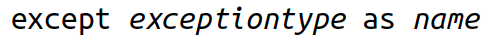

```{r setup, include = FALSE}
library(knitr)
library(kableExtra)
library(tidyverse)
library(NHSRtheme)
library(fontawesome)
# set default options
opts_chunk$set(echo = FALSE,
               fig.width = 7.252,
               fig.height = 4,
               comment = "#",
               dpi = 300)

knitr::knit_engines$set("markdown")

xaringanExtra::use_tile_view()
xaringanExtra::use_panelset()
xaringanExtra::use_clipboard()
xaringanExtra::use_webcam()
xaringanExtra::use_broadcast()
xaringanExtra::use_share_again()
xaringanExtra::style_share_again(
  share_buttons = c("twitter", "linkedin", "pocket")
)


xaringanExtra::use_extra_styles(
  hover_code_line = TRUE,         #<<
  mute_unhighlighted_code = F  #<<
)

# uncomment the following lines if you want to use the NHS-R theme colours by default
# scale_fill_continuous <- partial(scale_fill_nhs, discrete = FALSE)
# scale_fill_discrete <- partial(scale_fill_nhs, discrete = TRUE)
# scale_colour_continuous <- partial(scale_colour_nhs, discrete = FALSE)
# scale_colour_discrete <- partial(scale_colour_nhs, discrete = TRUE)
```

class: title-slide, left, bottom

# `r rmarkdown::metadata$title`
----
## **`r rmarkdown::metadata$subtitle`**
### `r rmarkdown::metadata$author`
### `r rmarkdown::metadata$date`


---
# Exam Policies
During the exam, ...
- Students can read any books, paper sheets, PDF files on PDF reader apps, Python Scripts or text files on Spyder.
  - Students are not allowed to use other apps, for example, Google Docs, Google Sheets, Microsoft Word, Microsoft Excel, Microsoft PowerPoint, Numbers, Pages, Keynotes, Notes.
- Students can visit (1) the class website (https://bcdanl.github.io) and (2) the Canvas website for the course.
  - Students are not allowed to visit any other websites, such as Google, Stack Overflow, and Gmail.
- Students can communicate with Byeong-Hak Choe.
  - Students are not allowed to communicate with other students.


---
class: inverse, center, middle

# Functions
<html><div style='float:left'></div><hr color='#EB811B' size=1px width=796px></html>


---
# Functions


- So far, all of our Python code examples have been little fragments. 
  - These are good for small tasks, but no one wants to retype fragments all the time. 
  - We need some way of organizing larger code into manageable pieces.
  
  
- The first step to code reuse is the *function*: a named piece of code, separate from all others. 


- A function can take any number and type of input *parameters* and return any
number and type of output *results*.


- We can do two things with a function:
  - *Define* it, with zero or more parameters
  - *Call* it, and get zero or more results


---
# Functions
### <p style="color:#00449E"> Define a Function with `def` </p>


.panelset[
.panel[.panel-name[`def`]
- To define a Python function, we type `def`, the function name, parentheses enclosing any input *parameters* to the function, and then finally, a colon (:). 

- Function names have the same rules as variable names (they must start with a letter or `_` and contain only letters, numbers, or `_`).
]

.panel[.panel-name[(1) def]
- Let's define a very simple function that has no parameters.
```{python, echo = T, eval = F}
def do_nothing():
    pass      # indention is needed here
```

- We use the `pass` statement when we want Python to do nothing.
  - It's the equivalent of *This page intentionally left blank.*

]

.panel[.panel-name[(1) call]
- We call the `do_nothing()` function just by typing its name and parentheses. 
```{python, echo = T, eval = F}
do_nothing()
```
]

]

---
# Functions
### <p style="color:#00449E"> Call a Function with Parentheses </p>


.panelset[
.panel[.panel-name[(2)]
- Let's define and call another function that has no parameters but prints a single word:

```{python, echo = T, eval = F}
def make_a_sound():
    print('quack')  

make_a_sound()
```

- When we called this function, Python ran the code inside its definition.
  - In this case, it printed a single word and returned to the main program.

]  

.panel[.panel-name[(3) `def` with `return`]
- Let's try a function that has no parameters but *returns* a value:
```{python, echo = T, eval = F}
def agree():
    return True
```
]


.panel[.panel-name[(3) call]
- We can call the `agree()` function and test its returned value by using `if`:
```{python, echo = T, eval = F}
if agree():
    print('Splendid!')
else:
    print('That was unexpected.')
```

]

]


---
# Functions
### <p style="color:#00449E"> Arguments and Parameters </p>
- Let's define the function `echo()` with one parameter called `anything`.
  - It uses the `return` statement to send the value of anything back to its caller twice, with a space between:

```{python, echo = T, eval = F}
def echo(anything):
    return anything + ' ' + anything
  
echo('Geneseo')
```

- The values we pass into the function when we call it are known as *arguments*. 

- When we call a function with arguments, the values of those arguments are copied to their corresponding *parameters* inside the function.


---
# Functions
### <p style="color:#00449E"> Arguments and Parameters </p>

```{python, echo = T, eval = F}
def echo(anything):
    return anything + ' ' + anything
  
echo('Geneseo')
```

- The function `echo()` was called with the argument string `'Geneseo'`. 

  - The value `'Geneseo'` was copied within `echo()` to the parameter `anything`, and then returned (in this case doubled, with a space) to the caller.
  
  

---
# Functions
### <p style="color:#00449E"> Arguments and Parameters </p>

- Let's write a function that takes an input argument and actually does something with it. 
  - Call it `commentary`, have it take an input string parameter
called `color`, and make it *return* the string description to its caller:

```{python, echo = T, eval = F}
def commentary(color):   
    if color == 'red':
        return "It's a tomato."
    elif color == "green":
        return "It's a green pepper."
    elif color == 'bee purple':
        return "I don't know what it is, but only bees can see it."
    else:
        return "I've never heard of the color " + color + "."
```

  

---
# Functions
### <p style="color:#00449E"> Arguments and Parameters </p>

.panelset[
.panel[.panel-name[call commentary('blue')]
- Call the function `commentary()` with the string argument `'blue'`.
```{python, echo = T, eval = F}
comment = commentary('blue')
```
- The function does the following:
  - Assigns the value `'blue'` to the function's internal color parameter
  - Runs through the `if-elif-else` logic chain
  - Returns a string
- The caller then assigns the string to the variable `comment`.
]

.panel[.panel-name[print(comment)]
- What did we get back?
```{python, echo = T, eval = F}
print(comment)
```

- A function can take any number of input arguments (including zero) of any type. 

- It can return any number of output results (also including zero) of any type. 
]

.panel[.panel-name[print(do_nothing())]
- If a function doesn't call `return` explicitly, the caller gets the result `None`.
```{python, echo = T, eval = F}
def do_nothing():
    pass
  
print(do_nothing())
```

]

]

---
# Functions
### <p style="color:#00449E"> `None` Is Useful </p>


.panelset[
.panel[.panel-name[`None`]
- `None` is a special Python value that holds a place when there is nothing to say. 

  - It is not the same as the boolean value `False`, although it looks false when evaluated as a boolean. 
  
```{python, echo = T, eval = F}
thing = None
if thing:
    print("It's some thing")
else:
    print("It's no thing")
```
]

.panel[.panel-name[`is` `None`]
- To distinguish `None` from a boolean `False` value, use Python's `is` operator:
```{python, echo = T, eval = F}
thing = None
if thing is None:
    print("It's some thing")
else:
    print("It's no thing")
```
- Zero-valued numbers, empty strings (`''`), lists (`[]`), tuples (`(,)`), dictionaries (`{}`), and sets (`set()`) are all `False`, but are not the same as `None`.
]


.panel[.panel-name[`==` vs. `is`]
- `==` is for value equality. It tests if two objects have the same value.

- `is` is for reference equality. It tests if two objects refer to the same object, i.e if they're identical.

.pull-left[
```{python, echo = T, eval = F}
a = [1, 2]
b = a
c = a[:]
```
]

.pull-right[
```{python, echo = T, eval = F}
a == b  # True or False?
a == c  # True or False?
a is b  # True or False?
a is c  # True or False?
```
]

]

.panel[.panel-name[`whatis(thing)`]
- Let's write a quick function that prints whether its argument is `None`, `True`, or `False`:
```{python, echo = T, eval = F}
def whatis(thing):
    if thing is None:
        print(thing, "is None")
    elif thing:
        print(thing, "is True")
    else:
        print(thing, "is False")
```
]

.panel[.panel-name[`whatis()`]
- Let's run some sanity tests:
```{python, echo = T, eval = F}
whatis(None)
whatis(True)
whatis(False)
```

]

.panel[.panel-name[`whatis()`]

.pull-left[
- How about some real values?
```{python, echo = T, eval = F}
whatis(0)
whatis(0.0)
whatis('')
whatis("")
whatis('''''')
whatis(())
whatis([])
whatis({})
whatis(set())
```
]

.pull-right[

- How about some real values?
```{python, echo = T, eval = F}
whatis(0.00001)
whatis([0])
whatis([''])
whatis(' ')
```

]

]


]


---
# Functions
.panelset[
.panel[.panel-name[Positional Arguments]
### <p style="color:#00449E"> Positional Arguments </p>

- The most familiar types of arguments are positional arguments, whose values are copied to their corresponding parameters in order.

- This function builds a dictionary from its positional input arguments and returns it:
```{python, echo = T, eval = F}
def menu(wine, entree, dessert):
    return {'wine': wine, 'entree': entree, 'dessert': dessert}
  
menu('chardonnay', 'chicken', 'cake')
```
]

.panel[.panel-name[Positional Arguments]
### <p style="color:#00449E"> Positional Arguments </p>

- A downside of positional arguments is that we need to remember the meaning of each position.
```{python, echo = T, eval = F}
menu('beef', 'bagel', 'bordeaux')
```
]


.panel[.panel-name[Keyword Arguments]

### <p style="color:#00449E"> Keyword Arguments </p>
- To avoid positional argument confusion, we can specify arguments by the names of their corresponding parameters, even in a different order from their definition in the function:
```{python, echo = T, eval = F}
menu(entree='beef', dessert='bagel', wine='bordeaux')
# Specify the wine first, but use keyword arguments for the entree and dessert:
menu('frontenac', dessert='flan', entree='fish') 
```

- If we call a function with both positional and keyword arguments, the positional arguments need to come first.
]

]


---
# Functions
### <p style="color:#00449E"> Specify Default Parameter Values </p>
.panelset[
.panel[.panel-name[default value for parameter]
- We can specify default values for parameters. 
  - The default is used if the caller does not provide a corresponding argument. 
  - Try calling `menu()` without the `dessert` argument:
  
```{python, echo = T, eval = F}
def menu(wine, entree, dessert='pudding'):
    return {'wine': wine, 'entree': entree, 'dessert': dessert}

menu('chardonnay', 'chicken') 
```

]

.panel[.panel-name[argument]
- We can specify default values for parameters. 
  - If we provide an argument, it's used instead of the default:
  
```{python, echo = T, eval = F}
def menu(wine, entree, dessert='pudding'):
    return {'wine': wine, 'entree': entree, 'dessert': dessert}

menu('dunkelfelder', 'duck', 'doughnut')
```

]

]


---
# Functions
### <p style="color:#00449E"> Specify Default Parameter Values </p>
.panelset[
.panel[.panel-name[buggy(arg, result=[])]
- The `buggy()` function is expected to run each time with a fresh empty result list, add the arg argument to it, and then print a single-item list.
```{python, echo = T, eval = F}
def buggy(arg, result=[]):
    result.append(arg)
    print(result)
buggy('a')
buggy('b') # expect ['b']
```
- There's a bug: it's empty only the first time it's called. 
  - The second time, result still has one item from the previous call.
]


.panel[.panel-name[works(arg)]
- It would have worked if it had been written like this:
```{python, echo = T, eval = F}
def works(arg):
    result = []
    result.append(arg)
    return result
    
works('a')
works('b')
```
]

.panel[.panel-name[nonbuggy(arg, result=None)]
- The fix is to pass in something else to indicate the first call:
```{python, echo = T, eval = F}
def nonbuggy(arg, result=None):
    if result is None:
        result = []
    result.append(arg)
    print(result)
    
nonbuggy('a')
nonbuggy('b')
```
]

]


---
# Functions
### <p style="color:#00449E"> Explode/Gather Positional Arguments with `*` </p>

.panelset[
.panel[.panel-name[(1)]
- When an asterisk (`*`) is used inside the function with a parameter, it groups a variable number of positional arguments into a single tuple of parameter values. 
```{python, echo = T, eval = F}
def print_args(*args):
    print('Positional tuple:', args)

print_args()
print_args(3, 2, 1, 'wait!', 'uh...')
```

<!-- - In the following example, `args` is the parameter tuple that resulted from zero or more arguments that were passed to the function `print_args()`. -->
<!--   - Whatever we give, it will be printed as the `args` tuple: -->
]


.panel[.panel-name[(2)]
- If our function has *required* positional arguments, as well, put them first; `*args` goes at the end and grabs all the rest:
```{python, echo = T, eval = F}
def print_more(required1, required2, *args):
    print('Need this one:', required1)
    print('Need this one too:', required2)
    print('All the rest:', args)

print_more('cap', 'gloves', 'scarf', 'monocle', 'mustache wax')
```

]

.panel[.panel-name[summary]
- We can pass positional argument to a function, which will match them inside to positional parameters. 

- We can pass a tuple argument to a function, and inside it will be a tuple parameter.

- We can pass positional arguments to a function, and gather them inside as the parameter `*args`, which resolves to the tuple args.
]

.panel[.panel-name[summary]
- We can also "explode" a tuple argument called `args` to positional parameters `*args` inside the function, which will be regathered inside into the tuple parameter `args`:
```{python, echo = T, eval = F}
def print_args(*args):
    print('Positional tuple:', args)
print_args(2, 5, 7, 'x')

args = (2,5,7,'x')
print_args(args)
print_args(*args)
```


]


.panel[.panel-name[summary]
- We can only use the `*` syntax in a function call or definition.

- Outside the function, `*args` explodes the tuple `args` into comma-separated positional parameters.

- Inside the function, `*args` gathers all of the positional arguments into a single args tuple.

]


]


---
# Functions
### <p style="color:#00449E"> Explode/Gather Positional Arguments with `**` </p>

.panelset[
.panel[.panel-name[(1)]

- We can use two asterisks (`**`) to group keyword arguments into a dictionary, where the argument names are the keys, and their values are the corresponding dictionary values.

```{python, echo = T, eval = F}
def print_kwargs(**kwargs):
    print('Keyword arguments:', kwargs)

print_kwargs()
print_kwargs(wine='merlot', entree='mutton', dessert='macaroon')
```

- Inside the function, `kwargs` is a dictionary parameter.

]

.panel[.panel-name[summary]

- We can pass keyword arguments to a function, which will match them inside to keyword parameters. 

- We can pass a dictionary argument to a function, and inside it will be dictionary parameters. 

]


.panel[.panel-name[summary]

- We can pass one or more keyword arguments (*name=value*) to a function, and gather them inside as `**kwargs`, which resolves to the dictionary parameter called `kwargs`. 

- Outside a function, `**kwargs` explodes a dictionary `kwargs` into *name=value* arguments.

- Inside a function, `**kwargs` gathers *name=value* arguments into the single dictionary parameter `kwargs`.
]
]


---
# Functions
### <p style="color:#00449E"> Keyword-Only Arguments </p>


.panelset[
.panel[.panel-name[keyword-only argument]

- *a keyword-only argument* is an argument that can only be provided as a keyword argument when a function is called.
  - It is recommended to be provided as *name=value*. 

```{python, echo = T, eval = F}
def print_data(data, *, start=0, end=100):
    for value in (data[start:end]):
        print(value)
```
- The single `*` in the definition above means that the parameters `start` and `end` must be provided as named arguments if we don’t want their default values.
  
]

.panel[.panel-name[call with keyword-only argument]
```{python, echo = T, eval = F}
data = ['a', 'b', 'c', 'd', 'e', 'f']
print_data(data)
print_data(data, start=4)
print_data(data, end=2)
```
]

.panel[.panel-name[name only]


```{python, echo = T, eval = F}
def print_data2(data, *, start, end):
    for value in data[start:end]:
        print(value)
print_data2(data)
print_data2(data, start=4)
print_data2(data, end=2)
print_data2(data, start = 2, end = 4)
```
- `start` and `end` are required arguments, because they doesn't have a default value and they must be specified as a keyword argument when we call the `print_data2()` function.

]


]


---
# Functions
### <p style="color:#00449E"> Mutable and Immutable Arguments </p>

- Remember that if we assigned the same list to two variables, we could change it by using either one? And that we could not if the variables both referred to something like an integer or a string? 
  <!-- - We need to watch for the same behavior when passing arguments to functions.  -->
  
- If an argument is mutable, its value can be changed *from inside the function* via its corresponding parameter.

```{python, echo = T, eval = F}
outside = ['one', 'fine', 'day']
def mangle(arg):
    arg[1] = 'terrible!'
outside
mangle(outside)
outside
```


---
# Exceptions

.panelset[
.panel[.panel-name[Exception handlers]

- In some languages, errors are indicated by special function return values. 
  - Python uses *exceptions*: code that is executed when an associated error occurs.

- When we run code that might fail under some circumstances, we also need appropriate *exception handlers* to intercept any potential errors.

  - Accessing a list or tuple with an out-of-range position, or a dictionary with a nonexistent key.
  
]

.panel[.panel-name[Errors]

- If we don’t provide your own exception handler, Python prints an error message and some information about where the error occurred and then terminates the program:

```{python, echo = T, eval = F}
short_list = [1, 2, 3]
position = 5
short_list[position]
```

]

]


---
# Handle Errors with `try` and `except`

.panelset[
.panel[.panel-name[`try`-`except`]

- Rather than leaving things to chance, use `try` to wrap your code, and `except` to provide the error handling:

```{python, echo = T, eval = F}
short_list = [1, 2, 3]
position = 5

try:
    short_list[position]
except:
    print('Need a position between 0 and', len(short_list)-1, ' but got',
    position)
```

]

.panel[.panel-name[`try`-`except`]

```{python, echo = T, eval = F}
short_list = [1, 2, 3]
position = 5
try:
    short_list[position]
except:
    print('Need a position between 0 and', len(short_list)-1, ' but got',
    position)
```

- The code inside the `try` block is run. 
  - If there is an error, an exception is raised and the code inside the `except` block runs. 
- If there are no errors, the `except` block is skipped.

]

.panel[.panel-name[`except` type]
- Specifying a plain `except` with no arguments, as we did here, is a catchall for any exception type.

- If more than one type of exception could occur, it’s best to provide a
separate exception handler for each.

- We get the full exception object in the variable name if we use the form:

```{r, echo=FALSE, out.width = '50%', fig.align='center'}

```


]

.panel[.panel-name[`except` type]
```{python, echo = T, eval = F}
short_list = [1, 2, 3]
while True:
    value = input('Position [q to quit]? ')
    if value == 'q':
        break
    try:
        position = int(value)
        print(short_list[position])
    except IndexError as err:
        print('Bad index:', position)
    except Exception as other:
        print('Something else broke:', other)
```

]

.panel[.panel-name[`except` type]

- The example looks for an `IndexError` first, because that’s the exception type raised when we provide an illegal position to a sequence. 
- It saves an `IndexError` exception in the variable `err`, and any other exception in the variable `other`. 

- The example prints everything stored in `other` to show what you get in that object.

  - Inputting position `3` raised an `IndexError` as expected. 
  - Entering `two` annoyed the `int()` function, which we handled in our second, catchall `except` code.


]

]
