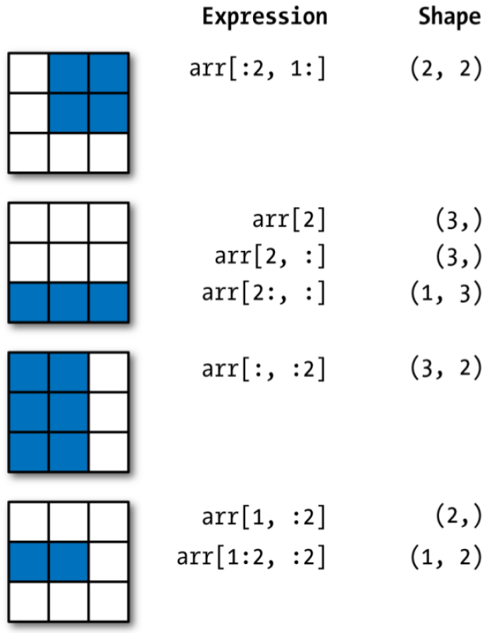

```{r setup, include = FALSE}
library(knitr)
library(kableExtra)
library(tidyverse)
library(NHSRtheme)
library(fontawesome)
# set default options
opts_chunk$set(echo = FALSE,
               fig.width = 7.252,
               fig.height = 4,
               comment = "#",
               dpi = 300)

knitr::knit_engines$set("markdown")

xaringanExtra::use_tile_view()
xaringanExtra::use_panelset()
xaringanExtra::use_clipboard()
xaringanExtra::use_webcam()
xaringanExtra::use_broadcast()
xaringanExtra::use_share_again()
xaringanExtra::style_share_again(
  share_buttons = c("twitter", "linkedin", "pocket")
)


xaringanExtra::use_extra_styles(
  hover_code_line = TRUE,         #<<
  mute_unhighlighted_code = F  #<<
)

# uncomment the following lines if you want to use the NHS-R theme colours by default
# scale_fill_continuous <- partial(scale_fill_nhs, discrete = FALSE)
# scale_fill_discrete <- partial(scale_fill_nhs, discrete = TRUE)
# scale_colour_continuous <- partial(scale_colour_nhs, discrete = FALSE)
# scale_colour_discrete <- partial(scale_colour_nhs, discrete = TRUE)
```

class: title-slide, left, bottom

# `r rmarkdown::metadata$title`
----
## **`r rmarkdown::metadata$subtitle`**
### `r rmarkdown::metadata$author`
### `r rmarkdown::metadata$date`

---
# Announcement

Here are some virtual and in-person events offering our students the opportunity to connect with alumni in the next week or two.

- Nov. 2nd: 1:00 pm - 1:30 pm. SMIF Virtual session with one of our alumni supporters, **Steve Mattus**, UBS. See geneseobusiness instagram for zoom ID and passcode.	

- Nov. 2nd -6:00 pm - 7:00 pm. AlphaSights virtual session with alumni **Talia Itozcowitz**, actively recruiting for a range of internships and F/T. Registration link for session	[here](https://alphasights.zoom.us/webinar/register/WN_oi_KeBoJSoaRxnYh4oOcHw)


- Nov. 4th: 8:30 am - 4:00 pm, **Annual Economics Research and Career Day**, Doty 300. No RSVP required, if interested in lunch, stop in South 110. See Professor Stone with questions.	


---
# Announcement

Here are some virtual and in-person events offering our students the opportunity to connect with alumni in the next week or two.

- Nov. 11th: **Buffalo Business Expo day**, bus transportation provided for students to visit 3 exciting employers in a range of fields. Leave campus at 8:00 am - return at 4:00 pm. Stop in South 110 to reserve your spot, first 30 students accepted. Open to all SoB majors.

- Nov. 16: 4:00 pm - 5:00 pm. **NBT Bank**, virtual session with Chief Investment Officer & Economist Ken Entenmann on the fundamentals of investing. Register here: [NBT Bank Registration](https://teams.microsoft.com/registration/eeSfpvYNRUutvTks2SAGZg,xVDkQ0KpnEmieUwWmiWW2Q,jTw-tKIg50uH3x4OF_eUGg,E_62TH_s40KvLjGiFnQUNg,ZtN_uksEa0mln1HzB_5u6Q,ip0yaRh4zkW52znTN0m6Mg?mode=read&tenantId=a69fe479-0df6-4b45-adbd-392cd9200666)


---
class: inverse, center, middle

# Importing modules, packages, and libraries
<html><div style='float:left'></div><hr color='#EB811B' size=1px width=796px></html>

---
# Importing Modules, Packages, and Libraries

- Python is a general-purpose programming language and is not specialized for numerical or statistical computation.

- The core libraries that enable Python to store and analyze data efficiently are located in Python libraries.

  - NumPy (`numpy`) - provide the basic array block used throughout numerical Python.
  - pandas (`pandas`) - provides DataFrames which are used to store data in an easy-to-use format.
  - matplotlib (`matplotlib`) - graphics. The most important submodule would be `matplotlib.pyplot`.


---
# Importing Modules, Packages, and Libraries

- A *module* is basically a bunch of related codes saved in a file with the extension `.py`.

- A *package* is basically a directory of a collection of modules. 

- A *library* is a collection of packages


- We refer to code of other modules/pacakges/libraries by using the Python `import` statement. 
  - This makes the code and variables in the imported module available to our programming codes.
  - We can use the `as` *keyword* when importing the modules using their canonical names.


---
#  NumPy

```{r, echo=FALSE, out.width = '50%', fig.align='center'}

```

- The *Numerical Python* package `numpy` provides efficient tools for scientific computing and data analysis:

  - `np.array()`: Multidimensional array capable of doing fast and efficient computations;
  - Built-in mathematical functions on arrays without writing loops.

```{python, echo = T, eval = F}
import numpy as np
```


---
# Numpy: Motivation
### <p style="color:#00449E"> Element-wise addition using NumPy

.pull-left[
```{python, echo = T, eval = F}
vec1 = [1, 2, 3, 4, 5, 6, 7, 8, 9]
vec2 = np.array(vec1)

vec1 + vec1
vec2 + vec2
```
]

.pull-right[
```{python, echo = T, eval = F}
for i in range(len(vec1)):
  vec1[i] += vec1[i]
  vec1
```
]


---
#  pandas

```{r, echo=FALSE, out.width = '50%', fig.align='center'}
knitr::include_graphics("../lec_figs/pandas-logo.png")
```

- `pandas` is a Python library including the following features:
  - Data manipulation and analysis,
  - DataFrame objects and Series,
  - Export and import data from files and web,
  - Handling of missing data.

- `pandas` provides high-performance data structures and data analysis tools.

```{python, echo = T, eval = F}
import pandas as pd
```


---
#  matplotlib

```{r, echo=FALSE, out.width = '50%', fig.align='center'}

```

- The package `matplotlib` is a comprehensive Python library for creating static, animated, and interactive visualizations in Python.

- Making informative visualizations (sometimes called plots) is one of the most important tasks in data analysis. 


```{python, echo = T, eval = F}
import matplotlib.pyplot as plt
```


---
# Exploratory Data Analysis (EDA)

- We use visualization and data transformation to explore our data in a systematic way.

- EDA is an iterative cycle. We:

  - Generate questions about our data.

  - Search for answers by visualizing, transforming, and modelling our data.

  - Use what we learn to refine our questions and/or generate new questions.


---
# Management of Files and Directories
### <p style="color:#00449E"> Finding the path name of the file/folder </p>

.panelset[

.panel[.panel-name[Windows 11]

- **Step 1.** Go to your folder using the File Explorer.
- **Step 2.** Right-click the file.
- **Step 3.** Click "Copy as path".
- **Step 4.** Paste the path name of the file to the R script (Ctrl+V).
- **Step 5.** 
  - *Option 1.* Replace backslash(`\`) with double-backslash(`\\`) in the path name.
  - *Option 2.* Replace backslash(`\`) with slash(`/`) in the path name.
]

 <!---->


.panel[.panel-name[Windows 10]

- **Step 1.** Go to your folder using the File Explorer.
- **Step 2.** Click the file.
- **Step 3.** Hold down the "Shift" key
- **Step 4.** Right-click the file.
- **Step 5.** Click "Copy as path".
- **Step 6.** Paste the path name of the file to the R script (Ctrl+V).
- **Step 7.** 
  - *Option 1.* Replace backslash(`\`) with double-backslash(`\\`) in the path name.
  - *Option 2.* Replace backslash(`\`) with slash(`/`) in the path name.
]

 <!---->

.panel[.panel-name[Mac]

- **Step 1.** Go to your folder using the Finder.
- **Step 2.** Right-click the file in the folder
- **Step 3.** Hold down the "option" key
- **Step 4.** Click "Copy 'PATH\_FOR\_YOUR\_FILE' as Pathname" from the menu.
- **Step 5.** Paste it to the R script (command+V).


- The simplest way for Mac users to copy the pathname of the file/folder is using the shortcut:
  - **option + command + c**
  
] <!---->

] <!--end of panelset-->


---
# Finding the pathname of files/folders
### <p style="color:#00449E"> Windows 11 </p>


```{r, echo=FALSE, out.width = '90%', fig.align='center'}

```


---
# Finding the pathname of files/folders
### <p style="color:#00449E"> Windows 10 </p>


```{r, echo=FALSE, out.width = '75%', fig.align='center'}

```


---
# Finding the pathname of files/folders
### <p style="color:#00449E"> Mac </p>


```{r, echo=FALSE, out.width = '90%', fig.align='center'}

```


---
# pandas and matplotlib: Motivation
### <p style="color:#00449E"> Element-wise addition using NumPy

- With `pandas` and `matplotlib`, we can import and visualize data in an efficient way:

.pull-left[
```{python, echo = T, eval = F}
import pandas as pd
import matplotlib.pyplot as plt
folder_path = 'PATH_NAME_OF_YOUR_WORKING_DIRECTORY'  

dow = pd.read_csv(folder_path + 
                      "dji.csv", 
                  index_col=0, 
                  parse_dates=True)
close = dow["Close"]
```
]

.pull-right[
```{python, echo = T, eval = F}
fig = plt.figure()
ax = fig.add_subplot(1, 1, 1)
close.plot(ax=ax)

ax.set_xlabel("Date")
ax.set_ylabel("Price")
ax.set_title("DJI")

fig.savefig(folder_path + "dji.pdf", 
            format="pdf")
```


]


---
class: inverse, center, middle

# Getting started with `numpy`
<html><div style='float:left'></div><hr color='#EB811B' size=1px width=796px></html>


---
# Introduction to `numpy`
### <p style="color:#00449E"> Array basics

`np.array(list)` converts python list into NumPy arrays.
  - `array.ndim` returns dimension of the array.
  - `array.shape` returns shape of the array as a list.
  - `array.dtype` returns data types of the array.

.pull-left[
```{python, echo = T, eval = F}
arr1 = [4, 8]
arr1 = np.array(arr1)
arr2 = np.array([2, 0, 8.1])
arr3 = np.array([ [4, 8], 
                  [9, 3], 
                  [1, 0] ])
```

]
.pull-right[
```{python, echo = T, eval = F}
arr1.ndim
arr3.shape
arr1.dtype
```

]

From now on, the name array refers to an `np.array()`.


---
# Introduction to `numpy`
### <p style="color:#00449E"> Array basics

- `np.arange(start, stop, step)` creates vector of values from start to stop with step width step.
  - An array-valued version of the built-in Python `range()` function
- `np.zeros((rows, columns))` creates array with all values set to 0.
- `np.ones((rows, columns))` creates array with all values set to 1.
- `np.linspace(start, stop, n)` creates vector of n evenly divided values from start to stop.

```{python, echo = T, eval = F}
np.zeros(10)
np.zeros((2, 4))
np.ones((2, 4))
np.arange(6)
np.linspace(0, 80, 5)
```


---
# Introduction to `numpy`
### <p style="color:#00449E"> Array basics


- If we have an array of strings representing numbers, we can use `astype` to convert them to numeric form:
```{python, echo = T, eval = F}
num_strings = np.array(["1.25", "-9.6", "42"])
num_strings = num_strings.astype(float)
```

---
# Introduction to `numpy`
### <p style="color:#00449E"> Arithmetic with NumPy Arrays

- Any arithmetic operations between equal-size arrays apply the operation element-wise.

- Arithmetic operations with scalars propagate the scalar argument to each element in the array.

- Comparisons between arrays of the same size gives Boolean arrays.

.pull-left[
```{python, echo = T, eval = F}
arr = np.array([ [1., 2., 3.], 
                 [4., 5., 6.] ])
arr + arr
arr - arr
arr * arr
```

]
.pull-right[
```{python, echo = T, eval = F}
1 / arr
arr ** 2
arr2 = np.array([ [0., 4., 1.], 
                  [7., 2., 12.] ])
arr2 > arr
```

]


---
# Introduction to `numpy`
### <p style="color:#00449E"> Basic Indexing and Slicing

- NumPy array indexing is a deep topic, as there are many ways you may want to select a subset of your data or individual elements. 

- One-dimensional arrays are simple; on the surface they act similarly to Python lists

.pull-left[
```{python, echo = T, eval = F}
arr = np.arange(10)
arr[5]
arr[5:8]
```

]
.pull-right[
```{python, echo = T, eval = F}
arr[5:8] = 12
arr

arr_slice = arr[5:8]
arr_slice[:] = 64
```

]


---
# Introduction to `numpy`
### <p style="color:#00449E"> Basic Indexing and Slicing

- In a two-dimensional array, the elements at each index are no longer scalars but rather one-dimensional arrays:


```{python, echo = T, eval = F}
arr2d = np.array([[1, 2, 3], [4, 5, 6], [7, 8, 9]])
arr2d[2]
arr2d[0][2]
arr2d[0, 2]
```


---
# Introduction to `numpy`
### <p style="color:#00449E"> Basic Indexing and Slicing

<!-- The following illustrates indexing on a two-dimensional array.  -->
<!--   - Think of axis 0 as the "rows" of the array. -->
<!--   - Think of axis 1 as the "columns" of the array. -->

```{r, echo=FALSE, out.width = '50%', fig.align='center'}

```

<!-- --- -->
<!-- # Introduction to `pandas` and `numpy` -->
<!-- ### <p style="color:#00449E"> Data Structures -->

<!-- To get started with `pandas`, we will need to get comfortable with its two workhorse data structures: `Series` and `DataFrame`.  -->

<!-- - While they are not a universal solution for every problem, they provide a solid foundation for a wide variety of data tasks. -->


<!-- --- -->
<!-- # Getting started with `pandas` -->
<!-- ### <p style="color:#00449E"> Series -->

<!-- - A Series is a one-dimensional array-like object containing a sequence of values (of similar types to NumPy types) of the same type and an associated array of data labels, called its index. The simplest Series is formed from only an array of data: -->


