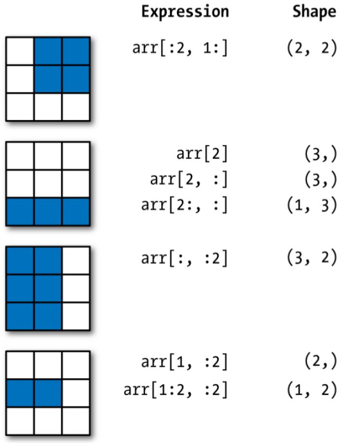

```{r setup, include = FALSE}
library(knitr)
library(kableExtra)
library(tidyverse)
library(NHSRtheme)
library(fontawesome)
# set default options
opts_chunk$set(echo = FALSE,
               fig.width = 7.252,
               fig.height = 4,
               comment = "#",
               dpi = 300)

knitr::knit_engines$set("markdown")

xaringanExtra::use_tile_view()
xaringanExtra::use_panelset()
xaringanExtra::use_clipboard()
xaringanExtra::use_webcam()
xaringanExtra::use_broadcast()
xaringanExtra::use_share_again()
xaringanExtra::style_share_again(
  share_buttons = c("twitter", "linkedin", "pocket")
)


xaringanExtra::use_extra_styles(
  hover_code_line = TRUE,         #<<
  mute_unhighlighted_code = F  #<<
)

# uncomment the following lines if you want to use the NHS-R theme colours by default
# scale_fill_continuous <- partial(scale_fill_nhs, discrete = FALSE)
# scale_fill_discrete <- partial(scale_fill_nhs, discrete = TRUE)
# scale_colour_continuous <- partial(scale_colour_nhs, discrete = FALSE)
# scale_colour_discrete <- partial(scale_colour_nhs, discrete = TRUE)
```

class: title-slide, left, bottom

# `r rmarkdown::metadata$title`
----
## **`r rmarkdown::metadata$subtitle`**
### `r rmarkdown::metadata$author`
### `r rmarkdown::metadata$date`

---
# Announcement
### <p style="color:#00449E"> Change in the Syllabus 

- When selecting the homework assignment with the lowest score, the homework assignment for the programming project (Homework Assignment 3) is not considered. 

  - The lowest homework score will be dropped when calculating the total homework score. 

  - Each homework except for the homework with the lowest score accounts for 20% of the total homework score.


---
# Announcement
### <p style="color:#00449E"> Asynchronous Online Class

- We will have an asynchronous online class on November 22, 2022.

  - On Canvas, I will leave the web-link for the class recording before 8:00 AM, November 22, 2022.
  
  

---
class: inverse, center, middle

# Getting started with `numpy`
<html><div style='float:left'></div><hr color='#EB811B' size=1px width=796px></html>


---
#  NumPy

```{r, echo=FALSE, out.width = '50%', fig.align='center'}

```

- The *Numerical Python* package `numpy` provides efficient tools for scientific computing and data analysis:

  - `np.array()`: Multidimensional array capable of doing fast and efficient computations;
  - Built-in mathematical functions on arrays without writing loops.

```{python, echo = T, eval = F}
import numpy as np
```


---
# Introduction to `numpy`
### <p style="color:#00449E"> Array basics

`np.array(list)` converts python list into NumPy arrays.
  - `array.ndim` returns dimension of the array.
  - `array.shape` returns shape of the array as a list.
  - `array.dtype` returns data types of the array.

.pull-left[
```{python, echo = T, eval = F}
arr1 = [4, 8]
arr1 = np.array(arr1)
arr2 = np.array([2, 0, 8.1])
arr3 = np.array([ [4, 8], 
                  [9, 3], 
                  [1, 0] ])
```

]
.pull-right[
```{python, echo = T, eval = F}
arr1.ndim
arr3.shape
arr1.dtype
```

]

From now on, the name array refers to an `np.array()`.


---
# Introduction to `numpy`
### <p style="color:#00449E"> Array basics

- `np.arange(start, stop, step)` creates vector of values from start to stop with step width step.
  - An array-valued version of the built-in Python `range()` function
- `np.zeros((rows, columns))` creates array with all values set to 0.
- `np.ones((rows, columns))` creates array with all values set to 1.
- `np.linspace(start, stop, n)` creates vector of n evenly divided values from start to stop.

```{python, echo = T, eval = F}
np.zeros(10)
np.zeros((2, 4))
np.ones((2, 4))
np.arange(6)
np.linspace(0, 80, 5)
```


---
# Introduction to `numpy`
### <p style="color:#00449E"> Array basics


- If we have an array of strings representing numbers, we can use `astype` to convert them to numeric form:
```{python, echo = T, eval = F}
num_strings = np.array(["1.25", "-9.6", "42"])
num_strings = num_strings.astype(float)
```

---
# Introduction to `numpy`
### <p style="color:#00449E"> Arithmetic with NumPy Arrays

- Any arithmetic operations between equal-size arrays apply the operation element-wise.

- Arithmetic operations with scalars propagate the scalar argument to each element in the array.

- Comparisons between arrays of the same size gives Boolean arrays.

.pull-left[
```{python, echo = T, eval = F}
arr = np.array([ [1., 2., 3.], 
                 [4., 5., 6.] ])
arr + arr
arr - arr
arr * arr
```

]
.pull-right[
```{python, echo = T, eval = F}
1 / arr
arr ** 2
arr2 = np.array([ [0., 4., 1.], 
                  [7., 2., 12.] ])
arr2 > arr
```

]


---
# Introduction to `numpy`
### <p style="color:#00449E"> Basic Indexing and Slicing

- NumPy array indexing is a deep topic, as there are many ways you may want to select a subset of your data or individual elements. 

- One-dimensional arrays are simple; on the surface they act similarly to Python lists

.pull-left[
```{python, echo = T, eval = F}
arr = np.arange(10)
arr[5]
arr[5:8]
```

]
.pull-right[
```{python, echo = T, eval = F}
arr[5:8] = 12
arr

arr_slice = arr[5:8]
arr_slice[:] = 64
```

]


---
# Introduction to `numpy`
### <p style="color:#00449E"> Basic Indexing and Slicing

- In a two-dimensional array, the elements at each index are no longer scalars but rather one-dimensional arrays:


```{python, echo = T, eval = F}
arr2d = np.array([[1, 2, 3], [4, 5, 6], [7, 8, 9]])
arr2d[2]
arr2d[0][2]
arr2d[0, 2]
```


---
# Introduction to `numpy`
### <p style="color:#00449E"> Basic Indexing and Slicing

<!-- The following illustrates indexing on a two-dimensional array.  -->
<!--   - Think of axis 0 as the "rows" of the array. -->
<!--   - Think of axis 1 as the "columns" of the array. -->

```{r, echo=FALSE, out.width = '50%', fig.align='center'}

```


---
# Introduction to `numpy`
### <p style="color:#00449E"> Boolean Indexing


.panelset[

.panel[.panel-name[example]

- Let's consider an example where we have some data in an array and an array of names with duplicates:

```{python, echo = T, eval = F}
names = np.array(["Bob", "Joe", "Will", "Bob", 
                  "Will", "Joe", "Joe"])
data = np.array([ [4, 7], [0, 2], [-5, 6], [0, 0], 
                  [1, 2], [-12, -4], [3, 4] ])

names
data
```
]


.panel[.panel-name[(1)]

- Suppose each name corresponds to a row in the data array and we wanted to select all the rows with the corresponding name "Bob".

```{python, echo = T, eval = F}
names == "Bob"
data[names == "Bob"]
```

- The Boolean array must be of the same length as the array axis it’s indexing. 

]


.panel[.panel-name[(2)]

- We can select from the rows where `names == "Bob"` and index the columns, too:

```{python, echo = T, eval = F}
data[names == "Bob", 1:]
data[names == "Bob", 1]
```


]


.panel[.panel-name[(3)]

- To select everything but "Bob", we can either use `!=` or negate the condition using `~`:

```{python, echo = T, eval = F}
names != "Bob"
~(names == "Bob")
data[~(names == "Bob")]
```


]


.panel[.panel-name[(4)]
- To select two of the three names to combine multiple Boolean conditions, we can use Boolean arithmetic operators like `&` (and) and `|` (or):

```{python, echo = T, eval = F}
mask = (names == "Bob") | (names == "Will")
mask
data[mask]
```

- The Python keywords `and` and `or` do not work with Boolean arrays. Use `&` (and) and `|` (or) instead.

]


.panel[.panel-name[(5)]
- Setting values with Boolean arrays works by substituting the value or values on the right-hand side into the locations where the Boolean array's values are `True`. 
  - To set all of the negative values in data to 0, we need only do:

```{python, echo = T, eval = F}
data[data < 0] = 0
data
```


]


.panel[.panel-name[(6)]

- We can also set whole rows or columns using a one-dimensional Boolean array:
```{python, echo = T, eval = F}
data[names != "Joe"] = 7
data
```

]


]


---
# Introduction to `numpy`
### <p style="color:#00449E"> NumPy built-in functions
- NumPy has many built-in functions:

```{python, echo = T, eval = F}
arr = np.arange(5)
np.sqrt(arr)
np.exp(arr)

arr2 = np.random.randint(3, size = 5)
```


---
class: inverse, center, middle

# Getting started with `pandas`

---
#  `pandas`

```{r, echo=FALSE, out.width = '48%', fig.align='center'}

```

- `pandas` is a Python library including the following features:
  - Data manipulation and analysis,
  - DataFrame objects and Series,
  - Export and import data from files and web,
  - Handling of missing data.

- `pandas` provides high-performance data structures and data analysis tools.

```{python, echo = T, eval = F}
import pandas as pd
```


---
# Getting started with `pandas`
### <p style="color:#00449E"> Create `Series`

- `pd.Series()` creates one-dimensional array-like object including values
and an index.

```{python, echo = T, eval = F}
obj = pd.Series([4, 7, -5, 3])
obj
```

- Simple `Series` formed only from a list.
- An index is added automatically.


---
# Getting started with `pandas`
### <p style="color:#00449E"> Create `Series`

- NumPy `arrays` can only be indexed by integers, while `Series` can be indexed by the manually set index.

```{python, echo = T, eval = F}
obj2 = pd.Series([2, -5, 9, 4], index=["a", "b", "c", "d"])
npobj = np.array([2, -5, 9, 4])

obj2
obj2["b"]
npobj[1]
```


---
# Getting started with `pandas`
### <p style="color:#00449E"> Create `Series`

- `Series.values` returns the values of a `Series`.
- `Series.index` returns the index of a `Series`.
```{python, echo = T, eval = F}
obj.values
obj.index
obj2.index
```

- The values and the index of a Series can be printed separately.
- The default index, if none was explicitly specified, is a `RangeIndex`.

---
# Getting started with `pandas`
### <p style="color:#00449E"> Create `Series`

- pandas `Series` can be created from NumPy arrays.


.panelset[

.panel[.panel-name[example]

.pull-left[
```{python, echo = T, eval = F}
npobj = np.array([2, -5, 9, 4])
obj2 = pd.Series(npobj, 
                 index=["a", "b", 
                        "c", "d"])
obj2
```
]
.pull-right[
```{python, echo = T, eval = F}
obj2.index
obj2["a"]
obj2["d"] = 6
obj2[ ["c", "a", "d"] ]
```
- Here `["c", "a", "d"]` is interpreted as a list of indices.
]

]


.panel[.panel-name[Series Operations]


- Using NumPy functions or NumPy-like operations will preserve the index-value link.

- Another way to think about a `Series` is as a fixed-length, ordered dictionary, as it is a mapping of index values to data values.


.pull-left[

```{python, echo = T, eval = F}
obj2[obj2 > 0]
obj2 * 2
np.exp(obj2)
```

]

.pull-right[
```{python, echo = T, eval = F}
"b" in obj2
"e" in obj2
```
]


]

]


---
# Getting started with `pandas`
### <p style="color:#00449E"> Create `Series`

- pandas `Series` can be created from dictionaries as well.
  - The index of the resulting `Series` consists of the dict’s keys.
  - The index can be set manually when passing a dictionary to a `Series`

.pull-left[

```{python, echo = T, eval = F}
dictdata = {"Rochester": 210_606, 
            "Buffalo": 276_807,
            "Syracuse": 146_103}
obj3 = pd.Series(dictdata)
obj3
```
]
.pull-right[
```{python, echo = T, eval = F}
cities = ["Niagara", "Buffalo", 
          "Syracuse"]
obj4 = pd.Series(dictdata, 
                index=cities)
obj4
```
]

- `NaN` (not a number) marks missing values where the index and the dict do not match.


---
# Getting started with `pandas`
### <p style="color:#00449E"> `Series` properties
`Series.name` returns name of the `Series`.
`Series.index.name` returns name of the `Series`'s index.

```{python, echo = T, eval = F}
obj4.name = "population"
obj4.index.name = "cities"
obj4
```

The attribute `name` will change the name of the existing `Series`.
There is no default name of the `Series` or the index.


---
# Getting started with `pandas`
### <p style="color:#00449E"> `pd.Series` vs. `np.array`
- NumPy arrays are accessed by their integer positions.

- Series can be accessed by a user defined index, including letters and numbers.

- Different Series can be aligned efficiently by the index.

- Series can work with missing values, so operations do not automatically fail.
  - The `isna` and `notna` functions are used to detect missing data:

```{python, echo = T, eval = F}
pd.isna(obj4)
pd.notna(obj4)

obj4.isna()
obj4.notna()
```


---
# Getting started with `pandas`
### <p style="color:#00449E"> `pd.DataFrame`

- `DataFrame` is the primary structure of pandas.

- `DataFrame` represents a table of data with an ordered collection of columns.
  
- Each column can have a different data type

- `DataFrame` can be thought of as a dictionary of `Series` sharing the same index.


---
# Getting started with `pandas`
### <p style="color:#00449E"> What is *tidy* `DataFrame`? </p>

- There are three rules which make a dataset tidy:

  1. Each **variable** has its own *column*.
  2. Each **observation** has its own *row*.
  3. Each **value** has its own *cell*.


```{r, echo=FALSE, out.width = '75%', fig.align='center'}
knitr::include_graphics("../lec_figs/tidy-1.png")
```


---
# Getting started with `pandas`
### <p style="color:#00449E"> Create `DataFrame`


.panelset[

.panel[.panel-name[DataFrame]

- `pd.DataFrame()` creates a `DataFrame` which is a two-dimensional tabular-like structure with labeled axis (rows and columns).

```{python, echo = T, eval = F}
data = {"state": ["Ohio", "Ohio", "Ohio", "Nevada", "Nevada", "Nevada"],
        "year": [2000, 2001, 2002, 2001, 2002, 2003],
        "population": [1.5, 1.7, 3.6, 2.4, 2.9, 3.2]}
frame = pd.DataFrame(data)
```

- In this example the construction of the `DataFrame` is done by passing a dictionary of equal-length lists.

- It is also possible to pass a dictionary of NumPy arrays.

]

.panel[.panel-name[print DataFrame]

- Passing a column that is not contained in the dict, it will be
marked with `NaN`:

```{python, echo = T, eval = F}
frame2 = pd.DataFrame(data, columns=["state", "year",
"population", "income"])
frame2
```

- The default index will be assigned automatically as with `Series`.

]


.panel[.panel-name[inputs]

- We can pass the following types of objects to `pd.DataFrame()`:
  
  - 2D NumPy arrays

  - Dict of lists, tuples, dicts, arrays, or Series

  - List of lists, tuples, dicts, or Series
  
  - Another DataFrame

]


]

---
# Getting started with `pandas`
### <p style="color:#00449E"> Indexing `DataFrame`

.panelset[

.panel[.panel-name[Adding a column]

- We can add a new column to `DataFrame` as follows:
```{python, echo = T, eval = F}
frame2["change"] = [1.2, -3.2, 0.4, -0.12, 2.4, 0.3]
frame2["change"]
```

- Selecting the column of `DataFrame`, a `Series` is returned,
- A attribute-like access, e.g., `frame2.change`, is also possible.
- The returned `Series` has the same index as the initial `DataFrame`.

]

.panel[.panel-name[Selecting columns]

- The result of using a list of multiple columns is a DataFrame:

```{python, echo = T, eval = F}
frame2[ ["state", "population"] ]
```

]


.panel[.panel-name[Naming properties]

- We can name what the index and the columns are representing by using `index.name` and `columns.name` respectively:

```{python, echo = T, eval = F}
frame2.index.name = "number:"
frame2.columns.name = "variable:"
frame2
```

- In `DataFrames`, there is no default name for the index or the columns.
]


.panel[.panel-name[Reindexing]

- `DataFrame.reindex()` creates new `DataFrame` with data conformed to a new index, while the initial `DataFrame` will not be changed:

```{python, echo = T, eval = F}
frame3 = frame.reindex([0, 2, 3, 4])
frame3
```

]


.panel[.panel-name[Dropping rows]

- Calling `drop` with a sequence of labels will drop values from the row labels (axis 0):

```{python, echo = T, eval = F}
obj = pd.Series(np.arange(5.), 
                index=["a", "b", "c", "d", "e"])
obj
new_obj = obj.drop("c")
new_obj

obj.drop(["d", "c"])
```

]


]


---
# Getting started with `pandas`
### <p style="color:#00449E"> Dropping columns

.panelset[

.panel[.panel-name[(1)]

- With `DataFrame`, index values can be deleted from either axis. To illustrate this, we first create an example `DataFrame`:

```{python, echo = T, eval = F}
data = pd.DataFrame(np.arange(16).reshape((4, 4)),
                    index=["Ohio", "Colorado", "Utah", "New York"],
                    columns=["one", "two", "three", "four"])

data
data.drop(index=["Colorado", "Ohio"])
```

]


.panel[.panel-name[(2)]

- To drop labels from the columns, we can use the `columns` keyword:

```{python, echo = T, eval = F}
data.drop(column=["two"])
```
]


.panel[.panel-name[(3)]
- We can also drop values from the columns by passing `axis=1` or `axis="columns"`:

```{python, echo = T, eval = F}
data.drop("two", axis=1)
data.drop(["two", "four"], axis="columns")
```
]


.panel[.panel-name[del]
- `del` `DataFrame[column]` deletes column from `DataFrame`.

```{python, echo = T, eval = F}
del data["two"]
data
```

]

]


---
# Getting started with `pandas`
### <p style="color:#00449E"> Indexing, selecting and filtering

.panelset[

.panel[.panel-name[(1)]
- Indexing of DataFrames works like indexing an `np.array`.
  - We can use the default index values:

```{python, echo = T, eval = F}
data = {"company": ["Daimler", "E.ON", "Siemens", "BASF", "BMW"],
"price": [69.2, 8.11, 110.92, 87.28, 87.81],
"volume": [4456290, 3667975, 3669487, 1778058, 1824582]}

companies = pd.DataFrame(data)
companies
companies[2:]
```

]

.panel[.panel-name[(2)]

- We can also use a manually set index.

```{python, echo = T, eval = F}
companies2 = pd.DataFrame(data, index=["a", "b", "c", "d", "e"])
companies2
companies2["b":"d"]
```

- When slicing with labels, the *end element is inclusive*.
]


.panel[.panel-name[(3)]

- `DataFrame.loc()` selects a subset of rows and columns from a DataFrame using axis labels.

- `DataFrame.iloc()` selects a subset of rows and columns from a
DataFrame using integers.


```{python, echo = T, eval = F}
companies2.loc[ "c", ["company", "price"] ]
companies2.iloc[ 2, [0, 1] ]

companies2.loc[ ["c", "d", "e"], ["volume", "price", "company"] ]
companies2.iloc[ 2:, ::-1 ]

```

]


.panel[.panel-name[summary]

  - `df[val]` selects single column or set of columns;
  
  
  - `df.loc[val]` selects single row or set of rows;
  - `df.loc[:, val]` selects single column or set of columns;
  - `df.loc[val1, val2]` selects row and column by label;
  
  
  - `df.iloc[where]` selects row or set of rows by integer position;
  - `df.iloc[:, where]` selects column or set of columns by integer position;
  - `df.iloc[w1, w2]` Select row and column by integer position.

]


]


---
# Getting started with `pandas`
### <p style="color:#00449E"> Operations between `DataFrame` and `Series`


.panelset[

.panel[.panel-name[(1)]

- Here the `Series` is generated from the first row of the `DataFrame`:

```{python, echo = T, eval = F}
companies3 = companies[["price", "volume"]]
companies3.index = ["Daimler", "E.ON", "Siemens", "BASF", "BMW"]
series = companies3.iloc[2]

companies3
series

```

]

.panel[.panel-name[(2)]

- By default, arithmetic operations between `DataFrames` and `Series` match the index of the `Series` on the `DataFrame`'s columns:

```{python, echo = T, eval = F}
companies3 + series
```

]

.panel[.panel-name[(3)]

- Here, the `Series` is generated from the `price` column:

```{python, echo = T, eval = F}
series2 = companies3["price"]
companies3.add(series2, axis=0)
```

- The arithmetic operation will be broadcasted along a column matching the `DataFrame`'s row index (axis=0).
]

]


---
# Getting started with `pandas`
### <p style="color:#00449E"> NumPy functions on `DataFrame`


- `DataFrame.apply(np.function, axis)` applies a NumPy function
on the `DataFrame` axis.

```{python, echo = T, eval = F}
companies3.apply(np.mean)
companies3.apply(np.sqrt)
companies3.apply(np.sqrt)[ :2]
```

- The arithmetic operation will be broadcasted along a column matching the `DataFrame`'s row index (axis=0).


---
# Getting started with `pandas`
### <p style="color:#00449E"> Grouping `DataFrame`

- `DataFrame.groupby(col1, col2)` groups `DataFrame` by columns (grouping by one or more than two columns is also possible!!).

  - Adding the functions `count()` or `mean()` to `groupby()` returns the
sum or the mean of the grouped columns.

```{python, echo = T, eval = F}
nbc_show = pd.read_csv("https://bcdanl.github.io/data/nbc_show.csv")
nbc_show.head()   # showing the first five rows

res = nbc_show.groupby(["Genre"]).count()
res2 = nbc_show.groupby(["Genre"]).mean()
```

- `GRP`: audience size; `PE`: audience engagement.


