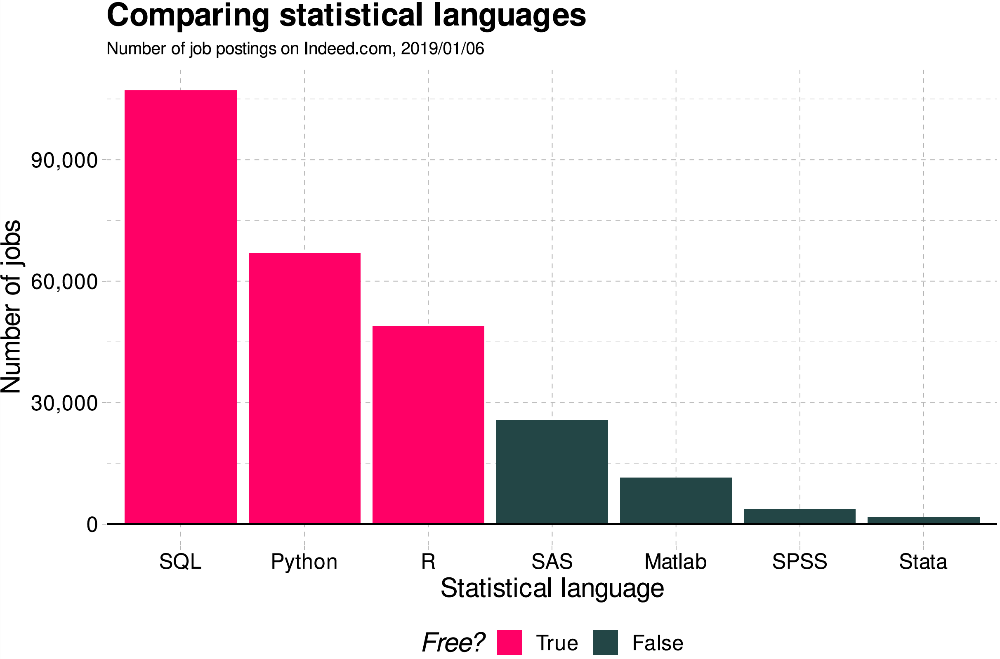

```{r setup, include = FALSE}
library(knitr)
library(kableExtra)
library(tidyverse)
library(NHSRtheme)
library(fontawesome)
# set default options
opts_chunk$set(echo = FALSE,
               fig.width = 7.252,
               fig.height = 4,
               comment = "#",
               dpi = 300)

knitr::knit_engines$set("markdown")

xaringanExtra::use_tile_view()
xaringanExtra::use_panelset()
xaringanExtra::use_clipboard()
xaringanExtra::use_webcam()
xaringanExtra::use_broadcast()
xaringanExtra::use_share_again()
xaringanExtra::style_share_again(
  share_buttons = c("twitter", "linkedin", "pocket")
)


xaringanExtra::use_extra_styles(
  hover_code_line = TRUE,         #<<
  mute_unhighlighted_code = F  #<<
)

# uncomment the following lines if you want to use the NHS-R theme colours by default
# scale_fill_continuous <- partial(scale_fill_nhs, discrete = FALSE)
# scale_fill_discrete <- partial(scale_fill_nhs, discrete = TRUE)
# scale_colour_continuous <- partial(scale_colour_nhs, discrete = FALSE)
# scale_colour_discrete <- partial(scale_colour_nhs, discrete = TRUE)
```

class: title-slide, left, bottom

# `r rmarkdown::metadata$title`
----
## **`r rmarkdown::metadata$subtitle`**
### `r rmarkdown::metadata$author`
### `r rmarkdown::metadata$date`
  


---
# Announcement
### <p style="color:#00449E"> Office Hours

- On November 21, Monday, I will have Zoom office hours from 3:30 PM to 5:30 PM.


---
# For Your Information
### <p style="color:#00449E"> Google Data Analytics Certificate
 
Course programs for [Google Data Analytics Certificate](https://grow.google/certificates/data-analytics/#?modal_active=none) are hosted on [Coursera](https://www.coursera.org/professional-certificates/google-data-analytics?utm_source=google&utm_medium=institutions&utm_campaign=gwgsite&_ga=2.19327484.536055472.1668546492-1708405686.1662938381).


- Foundations: Data, Data, Everywhere
- Ask Questions to Make Data-Driven Decisions
- Prepare Data For Exploration
- Process Data from Dirty to Clean
- Analyze Data to Answer Questions
- Share Data Through the Art of Visualization
- Data Analysis with R Programming
- Data Analytics Capstone Project: Complete a Case Study


---
# For Your Information
### <p style="color:#00449E"> Google Data Analytics Certificate

- Google Data Analytics Certificate program uses *R*. 

  - R is a great starting point for foundational data analysis, and offers helpful packages for beginners to apply to their projects. 
  

- The data analysis tools and platforms included in the certificate curriculum are spreadsheets (Google Sheets or Microsoft Excel), SQL, presentation tools (Powerpoint or Google Slides), Tableau, RStudio, and Kaggle.


---
# For Your Information
### <p style="color:#00449E"> Why Python, R, and SQL?

```{r, echo=FALSE, out.width = '75%', fig.align='center'}

```


---
# For Your Information
### <p style="color:#00449E">  Stack Overflow Trends

- We can see the trends of programming based on tags on the website, [Stack Overflow](https://insights.stackoverflow.com/trends?tags=r%2Cpython%2Csql)


---
class: inverse, center, middle

# Getting started with `pandas`

---
#  `pandas`

```{r, echo=FALSE, out.width = '48%', fig.align='center'}

```

- `pandas` is a Python library including the following features:
  - Data manipulation and analysis,
  - DataFrame objects and Series,
  - Export and import data from files and web,
  - Handling of missing data.

- `pandas` provides high-performance data structures and data analysis tools.

```{python, echo = T, eval = F}
import pandas as pd
```


---
# Getting started with `pandas`
### <p style="color:#00449E"> `pd.DataFrame`

- `DataFrame` is the primary structure of pandas.

- `DataFrame` represents a table of data with an ordered collection of columns.
  
- Each column can have a different data type.

- `DataFrame` can be thought of as a dictionary of `Series` sharing the same index.


---
# Getting started with `pandas`
### <p style="color:#00449E"> Create `DataFrame`


.panelset[

.panel[.panel-name[DataFrame]

- `pd.DataFrame()` creates a `DataFrame` which is a two-dimensional tabular-like structure with labeled axis (rows and columns).

```{python, echo = T, eval = F}
data = {"state": ["Ohio", "Ohio", "Ohio", "Nevada", "Nevada", "Nevada"],
        "year": [2000, 2001, 2002, 2001, 2002, 2003],
        "population": [1.5, 1.7, 3.6, 2.4, 2.9, 3.2]}
frame = pd.DataFrame(data)
```

- In this example the construction of the `DataFrame` is done by passing a dictionary of equal-length lists.

- It is also possible to pass a dictionary of NumPy arrays.

]

.panel[.panel-name[NaN]

- Passing a column that is not contained in the dict, it will be
marked with `NaN`:

```{python, echo = T, eval = F}
frame2 = pd.DataFrame(data, columns=["state", "year",
"population", "income"])
frame2
```

- The default index will be assigned automatically as with `Series`.

]
.panel[.panel-name[Columns]

- If we specify a sequence of columns, the DataFrame's columns will be arranged in that order:

```{python, echo = T, eval = F}
frame2 = pd.DataFrame(data, columns=["year", "state",
                                     "population"])
frame2
```

]


.panel[.panel-name[Inputs]

- We can pass the following types of objects to `pd.DataFrame()`:
  
  - 2D NumPy arrays

  - Dict of lists, tuples, dicts, arrays, or Series

  - List of lists, tuples, dicts, or Series
  
  - Another DataFrame

]


]

---
# Getting started with `pandas`
### <p style="color:#00449E"> Indexing `DataFrame`

.panelset[

.panel[.panel-name[Adding a column]

- We can add a new column to `DataFrame` as follows:
```{python, echo = T, eval = F}
frame2["change"] = [1.2, -3.2, 0.4, -0.12, 2.4, 0.3]
frame2["change"]
```

- Selecting the column of `DataFrame`, a `Series` is returned,
- A attribute-like access, e.g., `frame2.change`, is also possible.
- The returned `Series` has the same index as the initial `DataFrame`.

]

.panel[.panel-name[Selecting columns]

- The result of using a list of multiple columns is a DataFrame:

```{python, echo = T, eval = F}
frame2[ ["state", "population"] ]
```

]


.panel[.panel-name[Naming properties]

- We can name what the index and the columns are representing by using `index.name` and `columns.name` respectively:

```{python, echo = T, eval = F}
frame2.index.name = "number:"
frame2.columns.name = "variable:"
frame2
```

- In `DataFrames`, there is no default name for the index or the columns.
]


.panel[.panel-name[Reindexing]

- `DataFrame.reindex()` creates new `DataFrame` with data conformed to a new index, while the initial `DataFrame` will not be changed:

```{python, echo = T, eval = F}
frame3 = frame.reindex([0, 2, 3, 4])
frame3
```

]

.panel[.panel-name[Example df]


```{python, echo = T, eval = F}
data = {"company": ["Daimler", "E.ON", "Siemens", "BASF", "BMW"],
"price": [69.2, 8.11, 110.92, 87.28, 87.81],
"volume": [4456290, 3667975, 3669487, 1778058, 1824582]}

companies = pd.DataFrame(data)
companies
companies[2:]
```

]

.panel[.panel-name[Missing values]

- Index values that are not already present will be filled with `NaN` by
default.

- The `pd.isna()` and `pd.notna()` functions detect missing data:

```{python, echo = T, eval = F}
companies3 = companies.reindex(index = [0, 2, 3, 4, 5], 
                               columns=["company", "price", "market cap"])
companies3
pd.isna(companies3)
pd.notna(companies3)
```

]

.panel[.panel-name[Dropping rows]

- Calling `drop` with a sequence of labels will drop values from the row labels (axis 0):

```{python, echo = T, eval = F}
obj = pd.Series(np.arange(5.), 
                index = ["a", "b", "c", "d", "e"])
obj
new_obj = obj.drop("c")
new_obj
obj.drop(["d", "c"])
```

]


]


---
# Getting started with `pandas`
### <p style="color:#00449E"> Dropping columns

.panelset[

.panel[.panel-name[(1)]

- With `DataFrame`, index values can be deleted from either axis. To illustrate this, we first create an example `DataFrame`:

```{python, echo = T, eval = F}
data = pd.DataFrame(np.arange(16).reshape((4, 4)),
                    index = ["Ohio", "Colorado", "Utah", "New York"],
                    columns=["one", "two", "three", "four"])

data
data.drop(index = ["Colorado", "Ohio"])
```

]


.panel[.panel-name[(2)]

- To drop labels from the columns, we can use the `columns` keyword:

```{python, echo = T, eval = F}
data.drop(columns=["two"])
```
]


.panel[.panel-name[(3)]
- We can also drop values from the columns by passing `axis=1` or `axis="columns"`:

```{python, echo = T, eval = F}
data.drop("two", axis=1)
data.drop(["two", "four"], axis="columns")
```
]


.panel[.panel-name[del]
- `del DataFrame[column]` deletes column from `DataFrame`.

```{python, echo = T, eval = F}
del data["two"]
data
```

]

]


---
# Getting started with `pandas`
### <p style="color:#00449E"> Indexing, selecting and filtering

.panelset[

.panel[.panel-name[example]
- Indexing of DataFrames works like indexing an `np.array`.
  - We can use the default index values:

```{python, echo = T, eval = F}
data = {"company": ["Daimler", "E.ON", "Siemens", "BASF", "BMW"],
"price": [69.2, 8.11, 110.92, 87.28, 87.81],
"volume": [4456290, 3667975, 3669487, 1778058, 1824582]}

companies = pd.DataFrame(data)
companies
companies[2:]
```

]

.panel[.panel-name[setting index]

- We can also use a manually set index.

```{python, echo = T, eval = F}
companies2 = pd.DataFrame(data, index = ["a", "b", "c", "d", "e"])
companies2
companies2["b":"d"]
```

- When slicing with labels, the *end element is inclusive*.
]


.panel[.panel-name[.loc() and .iloc()]

- `DataFrame.loc()` selects a subset of rows and columns from a DataFrame using **axis labels**.

- `DataFrame.iloc()` selects a subset of rows and columns from a
DataFrame using **integers**.


```{python, echo = T, eval = F}
companies2.loc[ "c", ["company", "price"] ]
companies2.iloc[ 2, [0, 1] ]

companies2.loc[ ["c", "d", "e"], ["volume", "price", "company"] ]
companies2.iloc[ 2:, : :-1 ]

```

]


.panel[.panel-name[summary]

  - `df[val]` selects single column or set of columns;
  
  
  - `df.loc[val]` selects single row or set of rows;
  - `df.loc[:, val]` selects single column or set of columns;
  - `df.loc[val1, val2]` selects row and column by label;
  
  
  - `df.iloc[where]` selects row or set of rows by integer position;
  - `df.iloc[:, where]` selects column or set of columns by integer position;
  - `df.iloc[w1, w2]` Select row and column by integer position.

]


]


---
# Getting started with `pandas`
### <p style="color:#00449E"> Operations between `DataFrame`s and `Series`


.panelset[

.panel[.panel-name[example 1]

- Here the `series` is generated from the first row of the `DataFrame`:


```{python, echo = T, eval = F}
companies3 = companies[["price", "volume"]]
companies3.index =  ["Daimler", "E.ON", "Siemens", "BASF", "BMW"]
series = companies3.iloc[2]

companies3
series

```


]

.panel[.panel-name[+]

- By default, arithmetic operations between `DataFrames` and `Series` match the index of the `Series` on the `DataFrame`'s columns:

```{python, echo = T, eval = F}
companies3 + series
```

]

.panel[.panel-name[.add()]


- `DataFrame.add()` does addition along a column matching the `DataFrame`'s row index (axis=0).

```{python, echo = T, eval = F}
series2 = companies3["price"]
companies3.add(series2, axis=0)
```

]


.panel[.panel-name[example 2]

- Here are the example DataFrames to work with arithmetic operations:


```{python, echo = T, eval = F}
df1 = pd.DataFrame( np.arange(9.).reshape((3, 3)),
                    columns=list("bcd"),
                    index = ["Ohio", "Texas", "Colorado"])
df2 = pd.DataFrame( np.arange(12.).reshape((4, 3)),
                    columns=list("bde"),
                    index = ["Utah", "Ohio", "Texas", "Oregon"])

df1
df2
df1 + df2
```


]

.panel[.panel-name[Transpose]


- `DataFrame.T` transposes DataFrame.

```{python, echo = T, eval = F}
companies3.T
```

]


]


---
# Getting started with `pandas`
### <p style="color:#00449E"> NumPy functions on `DataFrame`


- `DataFrame.apply(np.function, axis)` applies a NumPy function
on the `DataFrame` axis.

```{python, echo = T, eval = F}
companies3.apply(np.mean)
companies3.apply(np.sqrt)
companies3.apply(np.sqrt)[ :2]
```


---
# Getting started with `pandas`
### <p style="color:#00449E"> Import/Export data
`pd.read_csv("PATH_NAME_OF_*.csv")` reads the csv file into `DataFrame`.
  - `header=None` does not read the top row of the csv file as column names.
  - We can set column names with `names`, for example, `names=["a", "b", "c", "d", "e"]`.
  
- `DataFrame.head()` and `DataFrame.tail()` prints the first and last five rows on the Console, respectively.

```{python, echo = T, eval = F}
nbc_show = pd.read_csv("https://bcdanl.github.io/data/nbc_show_na.csv")
# `GRP`: audience size; `PE`: audience engagement.
nbc_show.head()   # showing the first five rows
nbc_show.tail()   # showing the last five rows
```


---
# Getting started with `pandas`
### <p style="color:#00449E"> Export data
`DataFrame.to_csv("filename")` writes `DataFrame` to the csv file.
  - `index = False` and `header=False` do not write row index and column names in the csv file.
  - We can set column names with `header`, for example, `header=["a", "b", "c", "d", "e"]`.

```{python, echo = T, eval = F}
nbc_show.to_csv("PATH_NAME_OF_THE_csv_FILE")
```


---
# Getting started with `pandas`
### <p style="color:#00449E"> Summarizing `DataFrame`

- `DataFrame.count()` returns a Series containing the number of non-missing values for each column.
- `DataFrame.sum()` returns a Series containing the sum of values for each column.
- `DataFrame.mean()` returns a Series containing the mean of values for each column.
  - Passing `axis="columns"` or `axis=1` sums across the columns instead:
  

```{python, echo = T, eval = F}
nbc_count = nbc_show.sum()
nbc_sum = nbc_show.sum()
nbc_sum_c = nbc_show.sum( axis="columns" )
nbc_mean = nbc_show.mean()
```


---
# Getting started with `pandas`
### <p style="color:#00449E"> Grouping `DataFrame`

- `DataFrame.groupby(col1, col2)` groups `DataFrame` by columns (grouping by one or more than two columns is also possible!).

  - Adding the functions `count()`, `sum()`, `mean()` to `groupby()` returns the sum or the mean of the grouped columns.

```{python, echo = T, eval = F}
nbc_genre_count = nbc_show.groupby(["Genre"]).count()
nbc_genre_sum = nbc_show.groupby(["Genre"]).sum()
nbc_network_genre_mean = nbc_show.groupby(["Network", "Genre"]).mean()
```


---
# Getting started with `pandas`
### <p style="color:#00449E"> Sorting `DataFrame`

- `DataFrame.sort_index()` sorts DataFrame by index on either axis.

  - `DataFrame.sort_index(axis="columns")` sorts DataFrame by column index.
  
  - `DataFrame.sort_index(ascending=False)` sorts DataFrame by either index in descending order.

```{python, echo = T, eval = F}
nbc_show.sort_index()
nbc_show.sort_index(ascending = False)
nbc_show.sort_index(axis = "columns")
nbc_show.sort_value()
nbc_show.sort_value(ascending = False)
nbc_show.sort_value(axis = "columns")
```


---
# Getting started with `pandas`
### <p style="color:#00449E"> Sorting `DataFrame`

- `DataFrame.sort_value("SOME_VARIABLE")` sorts DataFrame by values of SOME_VARIABLE.

  - For `Series.sort_value()`, we do not need to provide `"SOME_VARIABLE"` in the `sort_value()` function.

- `DataFrame.sort_value("SOME_VARIABLE", ascdening = False)` sorts DataFrame by values of SOME_VARIABLE in descending order.

```{python, echo = T, eval = F}
nbc_show.sort_value("GRP")
nbc_show.sort_value("GRP", ascending = False)

obj = pd.Series([4, np.nan, 7, np.nan, -3, 2])
obj.sort_values()
```

---
# Getting started with `pandas`
### <p style="color:#00449E"> Class Exercise

Use the `nbc_show_na.csv` file to answer the following questions:

1. Find the top show in terms of the value of `PE` for each Genre.

2. Find the top show in terms of the value of `GRP` for each Network.

3. Which genre does have the largest `GRP` on average?


---
# Workflow
### <p style="color:#00449E"> Installing Python modules

- Let's install the Python visualization library `seaborn`.


.panelset[

.panel[.panel-name[Windows]
- Step 1. Open "Anaconda Prompt".
- Step 2. Type the following:
```{python, echo = T, eval = F}
conda install seaborn
```
or 
```{python, echo = T, eval = F}
pip install seaborn
```
]

.panel[.panel-name[Mac]
- Step 1. Open "Terminal".
- Step 2. Type the following:
```{python, echo = T, eval = F}
conda install seaborn
```
or 
```{python, echo = T, eval = F}
pip install seaborn
```
]


]


---
class: inverse, center, middle

# Data Visualization with `seaborn`


---
# Data Visualization

.pull-left[

```{r, echo=FALSE, out.width = '67%', fig.align='center'}
knitr::include_graphics("../lec_figs/lego.png")
```

]
.pull-right[
- Graphs and charts let us explore and learn about the structure of the information we have in DataFrame. 

- Good data visualizations make it easier to communicate our ideas and findings to other people. 


]


---
# Exploratory Data Analysis (EDA)

- We use visualization and summary statistics (e.g., mean, median, minimum, maximum) to explore our data in a systematic way.

- EDA is an iterative cycle. We:

  - Generate questions about our data.

  - Search for answers by visualizing, transforming, and modelling our data.

  - Use what we learn to refine our questions and/or generate new questions.


---
#  `seaborn`

```{r, echo=FALSE, out.width = '20%', fig.align='center'}

```

- `seaborn` is a Python data visualization library based on `matplotlib`. 
  - It allows us to easily create beautiful but complex graphics using a simple interface.
  - It also provides a general improvement in the default appearance of `matplotlib`-produced plots, and so I recommend using it by default.

```{python, echo = T, eval = F}
import seaborn as sns
```


---
# Data Visualization with `seaborn`
### <p style="color:#00449E"> Types of plots

- We will consider the following types of visualization:

  - Bar chart

  - Histogram

  - Scatter plot
  
  - Scatter plot with Fitted line

  - Line chart


---
# Getting started with `pandas`
### <p style="color:#00449E"> What is *tidy* `DataFrame`? </p>

- There are three rules which make a dataset tidy:

  1. Each **variable** has its own *column*.
  2. Each **observation** has its own *row*.
  3. Each **value** has its own *cell*.


```{r, echo=FALSE, out.width = '75%', fig.align='center'}
knitr::include_graphics("../lec_figs/tidy-1.png")
```


---
# Data Visualization with `seaborn`
### <p style="color:#00449E"> Getting started with `seaborn`

- Let's get the names of `DataFrame`s provided by the `seaborn` library:

```{python, echo = T, eval = F}
import seaborn as sns
print( sns.get_dataset_names() )
```


- Let's use the `titanic` and `tips` DataFrames:

```{python, echo = T, eval = F}
df_titanic = sns.load_dataset('titanic')
df_titanic.head()
df_tips = sns.load_dataset('tips')
df_tips.head()
```


---
# Data Visualization with `seaborn`
### <p style="color:#00449E"> Bar Chart 

- A bar chart is used to plot the frequency of the different categories.
  - It is useful to visualize how values of a **categorical variable** are distributed.
  - A variable is **categorical** if it can only take one of a small set of values.
  
  
- We use `sns.countplot()` function to plot a bar chart:


.pull-left[
```{python, echo = T, eval = F}
sns.countplot(x =  'sex', 
              data = df_titanic)
```
]

.pull-right[

- Mapping
  - `data`: DataFrame.
  - `x`:  Name of a categorical variable (column) in DataFrame

]


---
# Data Visualization with `seaborn`
### <p style="color:#00449E"> Bar Chart 

- We can further break up the bars in the bar chart based on another categorical variable. 

  - This is useful to visualize the relationship between the two categorical variables.


.pull-left[
```{python, echo = T, eval = F}
sns.countplot(x = 'sex', 
              hue = 'survived', 
              data = df_titanic)
```
]

.pull-right[

- Mapping
  - `hue`:  Name of a categorical variable

]


---
# Data Visualization with `seaborn`
### <p style="color:#00449E"> Histogram 

- A histogram is a **continuous** version of a bar chart.
  - It is used to plot the frequency of the different values.
  - It is useful to visualize how values of a **continuous variable** are distributed.
  - A variable is **continuous** if it can take any of an infinite set of ordered values.
  
  
- We use `sns.displot()` function to plot a histogram:
.pull-left[
```{python, echo = T, eval = F}
sns.displot(x =  'age', 
            bins = 5 ,
            data = df_titanic)
```
]

.pull-right[
- Mapping
  - `bins`:  Number of bins

]


---
# Data Visualization with `seaborn`
### <p style="color:#00449E"> Scatter plot 

- A scatter plot is used to display the relationship between two continuous variables.

  -  We can see co-variation as a pattern in the scattered points.

- We use `sns.scatterplot()` function to plot a scatter plot:

.pull-left[
```{python, echo = T, eval = F}
sns.scatterplot(x = 'total_bill', 
                y = 'tip',
                data = df_tips)
```
]

.pull-right[
- Mapping
  - `x`:  Name of a continuous variable on the horizontal axis
  - `y`:  Name of a continuous variable on the vertical axis
]


---
# Data Visualization with `seaborn`
### <p style="color:#00449E"> Scatter plot 

- To the scatter plot, we can add a `hue`-`VARIABLE` mapping to display how the relationship between two continuous variables varies by `VARIABLE`.

- Suppose we are interested in the following question:
  - **Q**. Does a smoker and a non-smoker have a difference in tipping behavior?

```{python, echo = T, eval = F}
sns.scatterplot(x = 'total_bill', 
                y = 'tip',
                hue = 'smoker',
                data = df)
```


---
# Data Visualization with `seaborn`
### <p style="color:#00449E"> Fitted line 

- From the scatter plot, it is often difficult to clearly see the relationship between two continuous variables.

  - `sns.lmplot()` adds a line that fits well into the scattered points.
  
  - On average, the fitted line describes the relationship between two continuous variables.
  

```{python, echo = T, eval = F}
sns.lmplot(x = 'total_bill', 
           y = 'tip',
           data = df_tips)
```


---
# Data Visualization with `seaborn`
### <p style="color:#00449E"> Scatter plot 

- To the scatter plot, we can add a `hue`-`VARIABLE` mapping to display how the relationship between two continuous variables varies by `VARIABLE`.

- Using the fitted lines, let's answer the following question:
  - **Q**. Does a smoker and a non-smoker have a difference in tipping behavior?

```{python, echo = T, eval = F}
sns.scatterplot(x = 'total_bill', 
                y = 'tip',
                hue = 'smoker',
                data = df_tips)
```

  


---
# Data Visualization with `seaborn`
### <p style="color:#00449E"> Line cahrt 

- A line chart is used to display the trend in a continuous variable or the change in a continuous variable over other variable.
  - It draws a line by connecting the scattered points in order of the variable on the x-axis, so that it highlights exactly when changes occur.
- We use `sns.lineplot()` function to plot a line plot:
.pull-left[
```{python, echo = T, eval = F}
path_csv = '/Users/byeong-hakchoe/Google Drive/suny-geneseo/teaching-materials/lecture-data/dji.csv'
dow = pd.read_csv(path_csv, index_col=0, parse_dates=True)
sns.lineplot(x =  'Date', 
             y =  'Close', 
             data = dow)
```
]

.pull-right[
- Mapping
  - `x`:  Name of a continuous variable (often time variable) on the horizontal axis 
  - `y`:  Name of a continuous variable on the vertical axis
]


