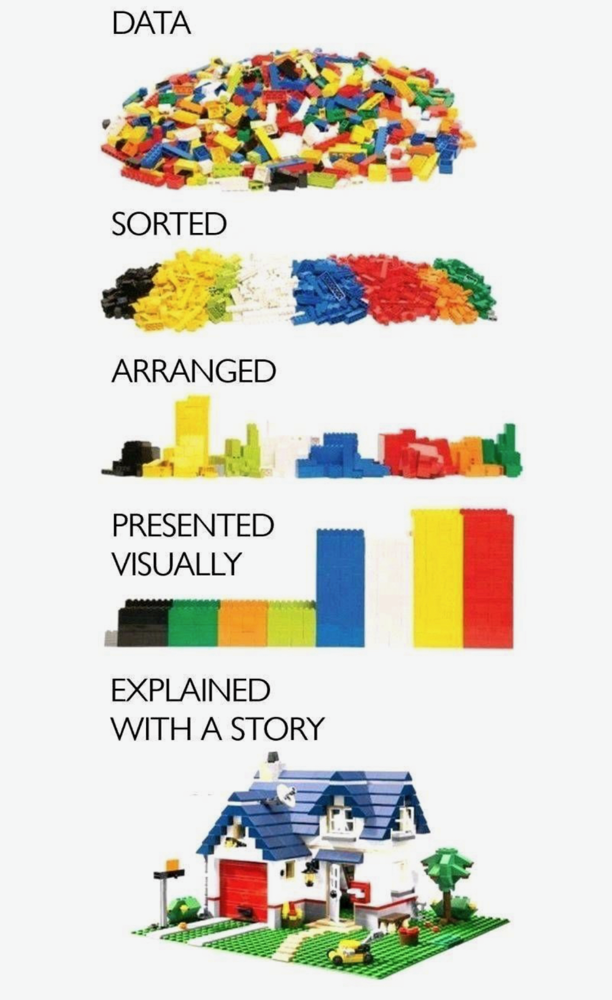
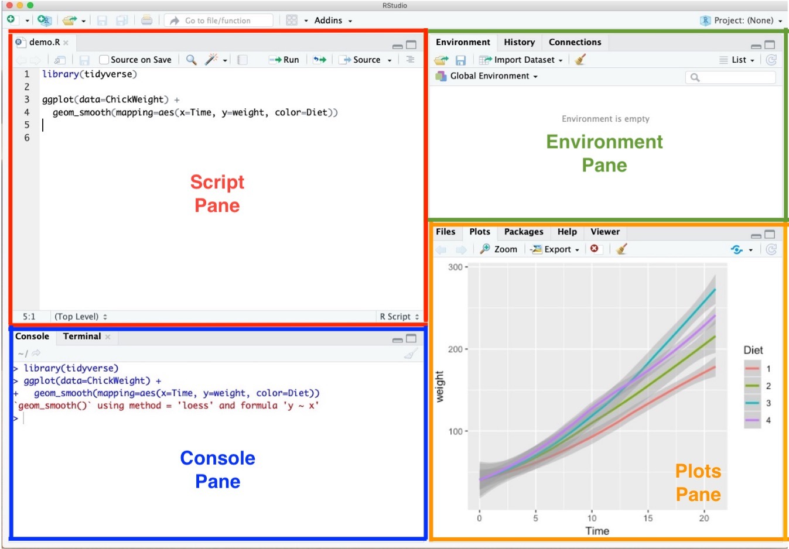

```{r setup, include = FALSE}
library(knitr)
library(kableExtra)
library(tidyverse)
library(NHSRtheme)
library(fontawesome)
# set default options
opts_chunk$set(echo = FALSE,
               fig.width = 7.252,
               fig.height = 4,
               comment = "#",
               dpi = 300)

knitr::knit_engines$set("markdown")

xaringanExtra::use_tile_view()
xaringanExtra::use_panelset()
xaringanExtra::use_clipboard()
xaringanExtra::use_webcam()
xaringanExtra::use_broadcast()
xaringanExtra::use_share_again()
xaringanExtra::style_share_again(
  share_buttons = c("twitter", "linkedin", "pocket")
)


xaringanExtra::use_extra_styles(
  hover_code_line = TRUE,         #<<
  mute_unhighlighted_code = F  #<<
)

# uncomment the following lines if you want to use the NHS-R theme colours by default
# scale_fill_continuous <- partial(scale_fill_nhs, discrete = FALSE)
# scale_fill_discrete <- partial(scale_fill_nhs, discrete = TRUE)
# scale_colour_continuous <- partial(scale_colour_nhs, discrete = FALSE)
# scale_colour_discrete <- partial(scale_colour_nhs, discrete = TRUE)
```

class: title-slide, left, bottom

# `r rmarkdown::metadata$title`
----
## **`r rmarkdown::metadata$subtitle`**
### `r rmarkdown::metadata$author`
### `r rmarkdown::metadata$date`


---
# Announcement
### <p style="color:#00449E"> Geneseo Alumni's Talk on Data Analytics Career

- Name: Lauren Kopac (Class of 2015)

- When: Today 11:00 A.M.--11:45 A.M.

- Where: Zoom (I will leave the Zoom link on Canvas soon.)

- She will give us a talk on the data analytics career with her experiences.

  - As a data analyst, she has worked at (1) Columbia University, New York, NY and (2) Neuberger Berman, New York, NY.
  


---
# Announcement
### <p style="color:#00449E"> Job Opportunities

.panelset[
.panel[.panel-name[M&T]

- **M&T guests**, Leah Froebel and Emily Scheck
  - Dec. 2nd (11:30 am - 12:30 pm) in South 340. 
  - All are welcome! They will be sharing their career stories along with an introduction to their F/T Management Development program (5 states) and prestigious internships in multiple functional areas (H/R, Marketing, Operations, etc...)
]

.panel[.panel-name[McKinsey]
- **McKinsey Consulting** 
  - (F/T grad. Dec. '22 and May '23) 2-year paid rotational fellowship, NYC.  
  - If interested, send email to cannonm@geneseo.edu to meet with one of our McKinsey alumni for prep this week. 
  - [Business Insights Fellow](https://www.mckinsey.com/careers/search-jobs/jobs/businessinsightsfellow-73311)
]

.panel[.panel-name[Blackstone]
- **Blackstone** 
  - (Econ. or Finance) Sophomore & Juniors, 
  - Apply to attend a Blackstone networking event in NYC, Jan. 13th 12:30 - 3:30 pm, application due 12/8. 
  - [Blackstone Networking Event](https://app.joinhandshake.com/edu/jobs/7242483) 
]

]


---
class: inverse, center, middle

# Data Visualization with `seaborn`


---
# Data Visualization

.pull-left[

```{r, echo=FALSE, out.width = '67%', fig.align='center'}

```

]
.pull-right[
- Graphs and charts let us explore and learn about the structure of the information we have in DataFrame. 

- Good data visualizations make it easier to communicate our ideas and findings to other people. 


]


---
# Exploratory Data Analysis (EDA)

- We use visualization and summary statistics (e.g., mean, median, minimum, maximum) to explore our data in a systematic way.

- EDA is an iterative cycle. We:

  - Generate questions about our data.

  - Search for answers by visualizing, transforming, and modelling our data.

  - Use what we learn to refine our questions and/or generate new questions.


---
#  `seaborn`

```{r, echo=FALSE, out.width = '20%', fig.align='center'}

```

- `seaborn` is a Python data visualization library based on `matplotlib`. 
  - It allows us to easily create beautiful but complex graphics using a simple interface.
  - It also provides a general improvement in the default appearance of `matplotlib`-produced plots, and so I recommend using it by default.

```{python, echo = T, eval = F}
import seaborn as sns
```


---
# Data Visualization with `seaborn`
### <p style="color:#00449E"> Types of plots

- We will consider the following types of visualization:

  - Bar chart

  - Histogram

  - Scatter plot
  
  - Scatter plot with Fitted line

  - Line chart


---
# Getting started with `pandas`
### <p style="color:#00449E"> What is *tidy* `DataFrame`? </p>

- There are three rules which make a dataset tidy:

  1. Each **variable** has its own *column*.
  2. Each **observation** has its own *row*.
  3. Each **value** has its own *cell*.


```{r, echo=FALSE, out.width = '75%', fig.align='center'}
knitr::include_graphics("../lec_figs/tidy-1.png")
```


---
# Data Visualization with `seaborn`
### <p style="color:#00449E"> Getting started with `seaborn`

- Let's get the names of `DataFrame`s provided by the `seaborn` library:

```{python, echo = T, eval = F}
import seaborn as sns
print( sns.get_dataset_names() )
```


- Let's use the `titanic` and `tips` DataFrames:

```{python, echo = T, eval = F}
df_titanic = sns.load_dataset('titanic')
df_titanic.head()
df_tips = sns.load_dataset('tips')
df_tips.head()
```


---
# Data Visualization with `seaborn`
### <p style="color:#00449E"> Bar Chart 

- A bar chart is used to plot the frequency of the different categories.
  - It is useful to visualize how values of a **categorical variable** are distributed.
  - A variable is **categorical** if it can only take one of a small set of values.
  
  
- We use `sns.countplot()` function to plot a bar chart:


.pull-left[
```{python, echo = T, eval = F}
sns.countplot(x =  'sex', 
              data = df_titanic)
```
]

.pull-right[

- Mapping
  - `data`: DataFrame.
  - `x`:  Name of a categorical variable (column) in DataFrame

]


---
# Data Visualization with `seaborn`
### <p style="color:#00449E"> Bar Chart 

- We can further break up the bars in the bar chart based on another categorical variable. 

  - This is useful to visualize the relationship between the two categorical variables.


.pull-left[
```{python, echo = T, eval = F}
sns.countplot(x = 'sex', 
              hue = 'survived', 
              data = df_titanic)
```
]

.pull-right[

- Mapping
  - `hue`:  Name of a categorical variable

]


---
# Data Visualization with `seaborn`
### <p style="color:#00449E"> Histogram 

- A histogram is a **continuous** version of a bar chart.
  - It is used to plot the frequency of the different values.
  - It is useful to visualize how values of a **continuous variable** are distributed.
  - A variable is **continuous** if it can take any of an infinite set of ordered values.
  
  
- We use `sns.displot()` function to plot a histogram:
.pull-left[
```{python, echo = T, eval = F}
sns.displot(x =  'age', 
            bins = 5 ,
            data = df_titanic)
```
]

.pull-right[
- Mapping
  - `bins`:  Number of bins

]


---
# Data Visualization with `seaborn`
### <p style="color:#00449E"> Scatter plot 

- A scatter plot is used to display the relationship between two continuous variables.

  -  We can see co-variation as a pattern in the scattered points.

- We use `sns.scatterplot()` function to plot a scatter plot:

.pull-left[
```{python, echo = T, eval = F}
sns.scatterplot(x = 'total_bill', 
                y = 'tip',
                data = df_tips)
```
]

.pull-right[
- Mapping
  - `x`:  Name of a continuous variable on the horizontal axis
  - `y`:  Name of a continuous variable on the vertical axis
]


---
# Data Visualization with `seaborn`
### <p style="color:#00449E"> Scatter plot 

- To the scatter plot, we can add a `hue`-`VARIABLE` mapping to display how the relationship between two continuous variables varies by `VARIABLE`.

- Suppose we are interested in the following question:
  - **Q**. Does a smoker and a non-smoker have a difference in tipping behavior?

```{python, echo = T, eval = F}
sns.scatterplot(x = 'total_bill', 
                y = 'tip',
                hue = 'smoker',
                data = df)
```


---
# Data Visualization with `seaborn`
### <p style="color:#00449E"> Fitted line 

- From the scatter plot, it is often difficult to clearly see the relationship between two continuous variables.

  - `sns.lmplot()` adds a line that fits well into the scattered points.
  
  - On average, the fitted line describes the relationship between two continuous variables.
  

```{python, echo = T, eval = F}
sns.lmplot(x = 'total_bill', 
           y = 'tip',
           data = df_tips)
```


---
# Data Visualization with `seaborn`
### <p style="color:#00449E"> Scatter plot 

- To the scatter plot, we can add a `hue`-`VARIABLE` mapping to display how the relationship between two continuous variables varies by `VARIABLE`.

- Using the fitted lines, let's answer the following question:
  - **Q**. Does a smoker and a non-smoker have a difference in tipping behavior?

```{python, echo = T, eval = F}
sns.scatterplot(x = 'total_bill', 
                y = 'tip',
                hue = 'smoker',
                data = df_tips)
```

  


---
# Data Visualization with `seaborn`
### <p style="color:#00449E"> Line cahrt 

- A line chart is used to display the trend in a continuous variable or the change in a continuous variable over other variable.
  - It draws a line by connecting the scattered points in order of the variable on the x-axis, so that it highlights exactly when changes occur.
- We use `sns.lineplot()` function to plot a line plot:
.pull-left[
```{python, echo = T, eval = F}
path_csv = '/Users/byeong-hakchoe/Google Drive/suny-geneseo/teaching-materials/lecture-data/dji.csv'
dow = pd.read_csv(path_csv, index_col=0, parse_dates=True)
sns.lineplot(x =  'Date', 
             y =  'Close', 
             data = dow)
```
]

.pull-right[
- Mapping
  - `x`:  Name of a continuous variable (often time variable) on the horizontal axis 
  - `y`:  Name of a continuous variable on the vertical axis
]


---
class: inverse, center, middle

# Starting with R and RStudio
<html><div style='float:left'></div><hr color='#EB811B' size=1px width=796px></html>


---
# Installing the Tools
### <p style="color:#00449E"> R programming </p>

The R language is available as a free download from the R Project website at:

- Windows: [https://cran.r-project.org/bin/windows/base/](https://cran.r-project.org/bin/windows/base/)
- Mac: [https://cran.r-project.org/bin/macosx/](https://cran.r-project.org/bin/macosx/)
  -  Download the file of R that corresponds to your Mac OS (Big Sur, Apple silicon arm64, High Sierra, El Capitan, Mavericks, etc.)

---
# Installing the Tools
### <p style="color:#00449E"> RStudio </p>

- **RStudio** offers a graphical interface to assist in creating R code:

  - The RStudio Desktop is available as a free download from the following webpage:
    - [https://www.rstudio.com/products/rstudio/download/#download](https://www.rstudio.com/products/rstudio/download/#download)


---
# Installing the Tools
### <p style="color:#00449E"> RStudio Environment </p>
.pull-left[
```{r, echo=FALSE, out.width = '100%', fig.align='center'}

```
]

.pull-right[
- **Script Pane** is where you write R commands in a script file that you can save. 
  - An R script is simply a text file containing R commands. 
  - RStudio will color-code different elements of your code to make it easier to read.

]
---
# Installing the Tools
### <p style="color:#00449E"> RStudio Environment </p>
.pull-left[
```{r, echo=FALSE, out.width = '100%', fig.align='center'}

```
]

.pull-right[
- **Console Pane** allows you to interact directly with the R interpreter and type commands where R will immediately execute them.

]
---
# Installing the Tools
### <p style="color:#00449E"> RStudio Environment </p>
.pull-left[
```{r, echo=FALSE, out.width = '100%', fig.align='center'}

```
]

.pull-right[
- **Environment Pane** is where you can see the values of variables, data frames, and other objects that are currently stored in memory.

]
---
# Installing the Tools
### <p style="color:#00449E"> RStudio Environment </p>
.pull-left[
```{r, echo=FALSE, out.width = '100%', fig.align='center'}

```
]

.pull-right[
- **Plots Pane** contains any graphics that you generate from your R code.

]


---
# Installing the Tools
### <p style="color:#00449E"> R Packages </p>


```{r, echo = T, eval = F}
pkgs <- c("ggplot2", "readr", "dplyr")
install.packages(pkgs)
```


- While running the above codes, I recommend you to answer "no" to the following question:

.pull-left[

   **Mac**: *"Do you want to install from sources the packages which need compilation?"* from Console Pane.
]

.pull-right[

   **Windows**: *"Would you like to use a personal library instead?"* from Pop-up message.
]


---
# Installing the Tools
### <p style="color:#00449E"> R Packages </p>

- Check whether `ggplot2` is installed well:

```{r, echo = T, eval = F}
library(ggplot2)   # loading the package tidyverse
mpg  # data.frame provided by the package ggplot2
     # ggplot2 is included in tidyverse
```

- Let me know if you have an error from the above code.


---
class: inverse, center, middle

# Workflow
<html><div style='float:left'></div><hr color='#EB811B' size=1px width=796px></html>

---
# Workflow
### <p style="color:#00449E"> Shortcuts for RStudio and RScript </p>

.pull-left[
**Mac**

- **command + shift + N** opens a new RScript.
- **command + return** runs a current line or selected lines.
- **command + shift + C** is the shortcut for # (commenting).
- **option + - ** is the shortcut for `<-`.
]

.pull-right[
**Windows**

- **Ctrl + Shift + N** opens a new RS-cript.
- **Ctrl + return** runs a current line or selected lines.
- **Ctrl + Shift + C** is the shortcut for # (commenting).
- **Alt + - ** is the shortcut for `<-`.
]


---
# Workflow

- **Home/End** moves the blinking cursor bar to the beginning/End of the line.
  - **Ctrl** (**command** for Mac Users) **+** `r fa("arrow-left")` / `r fa("arrow-right")` works too.


- **Ctrl** (**command** for Mac Users) **+ Z** undoes the previous action.
- **Ctrl** (**command** for Mac Users) **+ Shift + Z** redoes when undo is executed.


- **Ctrl** (**command** for Mac Users) **+ F** is useful when finding a phrase (and replace the phrase) in the RScript.

- Auto-completion of command is useful.
  - Type `libr` in the RScript in RStudio and wait for a second.
  
.pull-left[
```{r, echo = T, eval = F}
libr
```
]
.pull-right[
```{r, echo=FALSE, out.width = '100%', fig.align='center'}
knitr::include_graphics("../lec_figs/auto-completionRStudio.png")
```

]

---
# Workflow

- To install R package `PACKAGE`, use `install.packages("PACKAGE")`.
```{r, echo = T, eval = F}
install.packages("ggplot2")  # installing package "ggplot2"
```

- When the code is running, RStudio shows the STOP icon (`r fa("fas fa-stop", fill = "red")`) at the top right corner in the Console Pane.
  - Do not click it unless if you want to stop running the code.

```{r, echo=FALSE, out.width = '90%', fig.align='center'}
knitr::include_graphics("../lec_figs/console-running.png")
```


---
# Workflow
### <p style="color:#00449E"> Quotation marks, parentheses, and `+` </p>


- Quotation marks and parentheses must always come in a pair.
  - If not, Console Pane will show you the continuation character `+`:

```{r, echo = T, eval = F}
> x <- "hello
```

- The `+` tells you that R is waiting for more input; it doesn’t think you’re done yet. 

---
# Workflow
### <p style="color:#00449E"> RStudio Options Setting </p>
.pull-left[
```{r, echo=FALSE, out.width = '100%', fig.align='center'}
knitr::include_graphics("../lec_figs/RStudio_options.png")
```
]

.pull-right[
- This option menu is found by menus as follows:
  - *Mac*: RStudio $>$ Preferences 
  - *Windows*: Tools $>$ Global Options
  
- Check `r fa("check")` as in the picture.
- Choose "Never" on "Save workplace to .RData on exit:".
]


---
class: inverse, center, middle

# Starting with R
<html><div style='float:left'></div><hr color='#EB811B' size=1px width=796px></html>


---
# Starting with R
- Let's try a few commands to help you become familiar with R and its basic data types.

- In R, **vectors** are arrays of same-typed values.
  - They can be built with the `c()` notation.
  
.pull-left[
```{r, echo = T, eval = F}
1
1/2
'Joe'
"Joe"
"Joe"=='Joe'
c()
is.null(c())
is.null(5)
```
]
.pull-right[

```{r, echo = T, eval = F}
c(1)
c(1, 2)
c("Apple", 'Orange')
length(c(1, 2))
vec <- c(1, 2)
vec
```
]


---
# Starting with R
### <p style="color:#00449E"> Assignment </p>
- R has many assignment operators (e.g., `<-`, `=`, `->` ).
- The preferred one is `<-`.

```{r, echo = T, eval = F}
x <- 2
x < - 3
print(x)

x <- 5
x = 5
5 -> x
```


---
# Starting with R
### <p style="color:#00449E"> R data types </p>

- Primary data types in R are as follows:
  - **Logical**: A simple binary variable that may have only two values---TRUE or FALSE.
  - **Numeric**: Decimal numbers
  - **Integer**: Integers
  - **Character**: Text strings
  - **Factor**: Categorical values. Each possible value of a factor is known as a *level*.
  - **Ordered Factor**: A special factor data type where the order of the levels is significant. E.g., Low, Medium, and High


---
# Starting with R
### <p style="color:#00449E"> R data types </p>

- Test the data types.
```{r, echo = T, eval = F}
x <- TRUE
y <- 1
z <- 'Data Analytics'
productCategory <- c('fruit', 'vegetable', 'dry goods', 'fruit',
                     'vegetable', 'dry goods')
productCategoryFactor <- factor(productCategory)
```
- The `class()` function returns the data type of an object.
  - What are classes for `x`, `y`, `z`, `productCategory`, and `productCategoryFactor`?


---
# Starting with R
### <p style="color:#00449E"> R data types </p>


- Most R data types are *mutable*, in that we're allowed to change them.

```{r, echo = T, eval = F}
a <- c(1, 2)
b <- a

print(b)

# Alters a
a[[1]] <- 5

print(a)
print(b)
```


---
# Starting with R
### <p style="color:#00449E"> Lists </p>


- **Lists**, unlike *vectors*, can store more than one type of object.
  - The ways to access items in lists are the `$` operator and the `[[]]` operator.
  
```{r, echo = T, eval = F}
x <- list('a' = 6, b = 'fred')
names(x)

x$a
x$b

x[['a']]

x[c('a', 'a', 'b', 'b')]
```


---
# Starting with R
### <p style="color:#00449E"> R data types </p>


- Here are examples of a vector and a list.

```{r, echo = T, eval = F}
example_vector <- c(10, 20, 30)
example_list <- list(a = 10, b = 20, c = 30)

example_vector[1]
example_list[1]

example_vector[[2]]
example_list[[2]]

example_vector[c(FALSE, TRUE, TRUE)]
example_list[c(FALSE, TRUE, TRUE)]

example_list$b
example_list[["b"]]
```


---
# Starting with R
### <p style="color:#00449E"> Errors </p>


- Errors are just R's way of saying it safely refused to complete an ill-formed operation 

- Fear of errors should not limit experiments.

```{r, echo = T, eval = F}
x <- 1:5
print(x)

x <- meanMISSPELLED(x)  
print(x)                                 

x <- mean(x)                      
print(x)
```


---
# Starting with R
### <p style="color:#00449E"> Data Frames </p>

- R’s central data structure is the data frame. 
- A data frame is organized into rows and columns. 
- Data frames are essentially lists of columns.
- Data frames can have columns of different types.

.pull-left[
```{r, echo = T, eval = F}
d <- data.frame(x=c(1,2),
              y=c('a','b'))

d[['x']]
d$x
d[[1]]
```
]

.pull-right[
```{r, echo = T, eval = F}
d
d[1,]
d[,1]

d[1,1]
d[1, 'x']
```

]


---
# Starting with R
### <p style="color:#00449E"> Data Frames </p>

- The R **data.frame** class is designed to store data in a very good "ready for analysis" format.

```{r, echo = T, eval = F}
d <- data.frame(col1 = c(1, 2, 3), col2 = c(-1, 0, 1))
print(d)
d$col3 <- d$col1 + d$col2
print(d)
```

---
# Starting with R
### <p style="color:#00449E"> NULL and NA values </p>

- `NULL` is just an alias for `c()`, the empty vector.
- `NA` indicates missing or unavailable data.

```{r, echo = T, eval = F}
c(c(), 1, NULL)
c("a", NA, "c")
```


---
# Starting with R
### <p style="color:#00449E"> NULL and NA values </p>

- `NULL` is just an alias for `c()`, the empty vector.
- `NA` indicates missing or unavailable data.

```{r, echo = T, eval = F}
c(c(), 1, NULL)
c("a", NA, "c")
```


---
# Starting with R
### <p style="color:#00449E"> NULL and NA values </p>

- Most R data types are *mutable*, in that we're allowed to change them.

```{r, echo = T, eval = F}
d <- data.frame(x = 1, y = 2)
d2 <- d
d$x <- 5

print(d)
print(d2)
```


---
class: inverse, center, middle

# Management of Files, Directories, and Scripts
<html><div style='float:left'></div><hr color='#EB811B' size=1px width=796px></html>


---
# Management of Files, Directories, and Scripts
### <p style="color:#00449E"> Code and comment style </p>
- The two main principles for coding and managing data are:
  - Make things easier for your future self.
  - Don't trust your future self.

- So we do make comments on codes.


---
# Management of Files, Directories, and Scripts
### <p style="color:#00449E"> Code and comment style </p>

- The `#` mark is R's comment character.
  - `#` indicates that the rest of the line is to be ignored.
  - Write comments before the line that you want the comment to apply to.

- Consider using block commenting for separating code sections.
  - `#####` defines a coding block.

- Break down long lines and long algebraic expressions.


---
# Management of Files, Directories, and Scripts
### <p style="color:#00449E"> Materials for the book, Practical Data Science with R </p>

- Click the green "Code" button and download the ZIP file from the following GitHub page: [https://github.com/WinVector/PDSwR2](https://github.com/WinVector/PDSwR2).

.panelset[

.panel[.panel-name[Windows]

- **Step 1.** Go to your Download folder (or the folder where the downloaded file is saved) using the File Explorer.
- **Step 2.** Click the ZIP file one time.
- **Step 3.** Cut the file by using the shortcut (**Ctrl+X**).  
- **Step 4.** Go to your working folder for the course using the File Explorer.
- **Step 5.** Paste the file to your working folder by using **Ctrl+V**.
- **Step 6.** Right-click the ZIP file and click "Extract ..."
]

 <!---->

.panel[.panel-name[Mac]

- **Step 1.** Go to your Download folder (or the folder where the downloaded file is saved) using the Finder.
- **Step 2.** Click the ZIP file (or the folder if the ZIP file is extracted) one time.
- **Step 3.** Copy the file (or the folder) by using the shortcut (**command+C**).  
- **Step 4.** Go to your working folder for the course using the Finder.
- **Step 5.** Paste the file to your working folder by using **command+option+V**.
- **Step 6.** Right-click the ZIP file and click "Extract ..."
] <!---->

] <!--end of panelset-->


---
# Management of Files and Directories
### <p style="color:#00449E"> Finding the path name of the file </p>

.panelset[

.panel[.panel-name[Windows 11]

- **Step 1.** Go to your folder using the File Explorer.
- **Step 2.** Right-click the file.
- **Step 3.** Click "Copy as path".
- **Step 4.** Paste the path name of the file to the R script (Ctrl+V).
- **Step 5.** 
  - *Option 1.* Replace backslash(`\`) with double-backslash(`\\`) in the path name.
  - *Option 2.* Replace backslash(`\`) with slash(`/`) in the path name.
]

 <!---->


.panel[.panel-name[Windows 10]

- **Step 1.** Go to your folder using the File Explorer.
- **Step 2.** Keep pressing the "Shift" key
- **Step 3.** Right-click the file.
- **Step 4.** Click "Copy as path".
- **Step 5.** Paste the path name of the file to the R script (Ctrl+V).
- **Step 6.** 
  - *Option 1.* Replace backslash(`\`) with double-backslash(`\\`) in the path name.
  - *Option 2.* Replace backslash(`\`) with slash(`/`) in the path name.
]

 <!---->

.panel[.panel-name[Mac]

- **Step 1.** Go to your folder using the Finder.
- **Step 2.** Right-click the file in the folder
- **Step 3.** Keep pressing "option"
- **Step 4.** Click "Copy 'PATH\_FOR\_YOUR\_FILE' as Pathname" from the menu.
- **Step 5.** Paste it to the R script (command+V).

] <!---->

] <!--end of panelset-->


---
class: inverse, center, middle

# Working with Data from Files
<html><div style='float:left'></div><hr color='#EB811B' size=1px width=796px></html>


---
# Working with Data from Files

- Step 1. Find the path name for the file, `car.data.csv`, from the sub-folder, 'UCICar' in the folder, 'PDSwR2-main'.

- Step 2. In the code below, replace 'PATH_NAME_FOR_THE_FILE_car.data.csv' with the path name for the file, `car.data.csv`.

- Step 3. Run the following R code:

```{r, eval = F, echo = T}
# install.packages("readr")
library(readr)

uciCar <- read_csv(
		'PATH_NAME_FOR_THE_FILE_car.data.csv')
View(uciCar)
```

---
# Working with Data from Files
### <p style="color:#00449E"> Examining data frame </p>

- `class()` tells you what kind of R object you have. 
- `dim()` shows how many rows and columns are in the data for `data.frame`.
- `head()` shows the top few rows of the data.
- `help()` provides the documentation for a class. 
  - Try `help(class(uciCar))`.
- `str()` gives us the structure for an object.


---
# Working with Data from Files
### <p style="color:#00449E"> Examining data frame </p>

- `summary()` provides a summary of almost any R object. 
- `skimr::skim()` provides a more detailed summary.
  - `skimr` is the package that provides the function `skim()`.
- `print()` prints all the data. 
  - Note: for large datasets, this can take a very long time and is something you want to avoid.
- `View()` displays the data in a simple spreadsheet-like grid viewer.
- `dplyr::glimpse()` displays brief information about the data.


---
# Working with Data from Files
### <p style="color:#00449E"> Examining data frame </p>

```{r, eval = F, echo = T}
print(uciCar)
class(uciCar)
dim(uciCar)
head(uciCar)
help(class(uciCar))
str(uciCar)
summary(uciCar)

library(skimr)
skim(uciCar)
library(tidyverse)
glimpse(uciCar)
```


---
# Working with Data from Files
### <p style="color:#00449E"> Reading data from an URL </p>

- We can import the data file from the web.

```{r, eval = F, echo = T}
# install.packages("readr")
# library(readr)

tvshows <- read_csv(
		'https://bcdanl.github.io/data/tvshows.csv')
```


---
# Working with Data from Files
### <p style="color:#00449E"> Data visualization </p>

- Let's try some data visualization using `ggplot()`:

```{r, eval = F, echo = T}
# install.packages("ggplot2")
library(ggplot2)

ggplot(tvshows) + 
  geom_point(aes(x=GRP, y=PE, color=Genre))
  
ggplot(tvshows) + 
  geom_point(aes(x=GRP, y=PE)) + 
  facet_wrap(~Genre)
```
-  How is the the relationship between audience size (`GRP`) and audience engagement (`PE`)?


