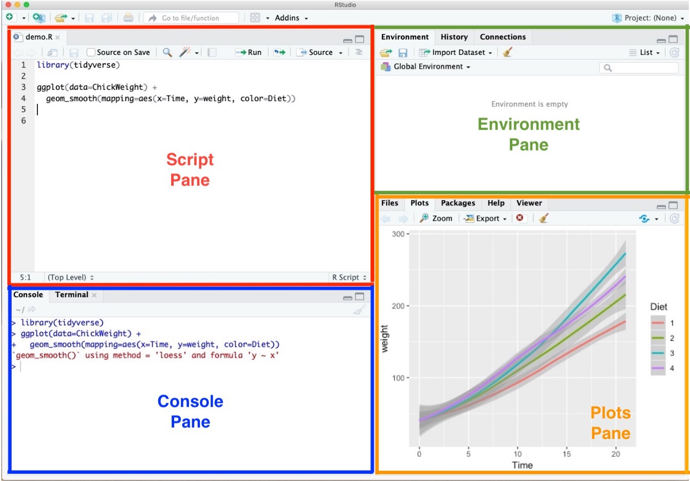

```{r setup, include = FALSE}
library(knitr)
library(kableExtra)
library(tidyverse)
library(NHSRtheme)
library(fontawesome)
# set default options
opts_chunk$set(echo = FALSE,
               fig.width = 7.252,
               fig.height = 4,
               comment = "#",
               dpi = 300)

knitr::knit_engines$set("markdown")

xaringanExtra::use_tile_view()
xaringanExtra::use_panelset()
xaringanExtra::use_clipboard()
xaringanExtra::use_webcam()
xaringanExtra::use_broadcast()
xaringanExtra::use_share_again()
xaringanExtra::style_share_again(
  share_buttons = c("twitter", "linkedin", "pocket")
)


xaringanExtra::use_extra_styles(
  hover_code_line = TRUE,         #<<
  mute_unhighlighted_code = F  #<<
)

# uncomment the following lines if you want to use the NHS-R theme colours by default
# scale_fill_continuous <- partial(scale_fill_nhs, discrete = FALSE)
# scale_fill_discrete <- partial(scale_fill_nhs, discrete = TRUE)
# scale_colour_continuous <- partial(scale_colour_nhs, discrete = FALSE)
# scale_colour_discrete <- partial(scale_colour_nhs, discrete = TRUE)
```

class: title-slide, left, bottom

# `r rmarkdown::metadata$title`
----
## **`r rmarkdown::metadata$subtitle`**
### `r rmarkdown::metadata$author`
### `r rmarkdown::metadata$date`


---
# Announcement
### <p style="color:#00449E"> Student Course Experience (SCE) Survey

- Effective Fall 2022, the Student Course Experience (SCE) survey replaces the Student Observation of Faculty Instruction (SOFI) survey.

- In a web browser, students should visit their [myGeneseo](https://my.geneseo.edu/dashboard) portal, then select KnightWeb, Surveys, then SCE (formerly SOFI) Surveys.


---
# Data Visualization with `seaborn`
### <p style="color:#00449E"> Transparency with `alpha`

- In a scatter plot, adding transparency with `alpha` helps address many data points on the same location.
  - We can map `alpha` to number between 0 and 1.
  
.pull-left[
```{python, echo = T, eval = F}
import seaborn as sns
df_tips = sns.load_dataset('tips')

sns.scatterplot(x = 'total_bill', 
                y = 'tip',
                hue = 'smoker',
                alpha = .25,
                data = df_tips)
```
]

.pull-left[
```{python, echo = T, eval = F}
sns.lmplot(x = 'total_bill', 
           y = 'tip',
           scatter_kws = {'alpha' : 0.2},
           data = df_tips)
```
]


---
class: inverse, center, middle

# Starting with R and RStudio
<html><div style='float:left'></div><hr color='#EB811B' size=1px width=796px></html>


---
# Installing the Tools
### <p style="color:#00449E"> R programming </p>

The R language is available as a free download from the R Project website at:

- Windows: [https://cran.r-project.org/bin/windows/base/](https://cran.r-project.org/bin/windows/base/)
- Mac: [https://cran.r-project.org/bin/macosx/](https://cran.r-project.org/bin/macosx/)
  -  Download the file of R that corresponds to your Mac OS (Big Sur, Apple silicon arm64, High Sierra, El Capitan, Mavericks, etc.)

---
# Installing the Tools
### <p style="color:#00449E"> RStudio </p>

- **RStudio** offers a graphical interface to assist in creating R code:

  - The RStudio Desktop is available as a free download from the following webpage:
    - [https://www.rstudio.com/products/rstudio/download/#download](https://www.rstudio.com/products/rstudio/download/#download)


---
# Installing the Tools
### <p style="color:#00449E"> RStudio Environment </p>
.pull-left[
```{r, echo=FALSE, out.width = '100%', fig.align='center'}

```
]

.pull-right[
- **Script Pane** is where you write R commands in a script file that you can save. 
  - An R script is simply a text file containing R commands. 
  - RStudio will color-code different elements of your code to make it easier to read.

]
---
# Installing the Tools
### <p style="color:#00449E"> RStudio Environment </p>
.pull-left[
```{r, echo=FALSE, out.width = '100%', fig.align='center'}

```
]

.pull-right[
- **Console Pane** allows you to interact directly with the R interpreter and type commands where R will immediately execute them.

]
---
# Installing the Tools
### <p style="color:#00449E"> RStudio Environment </p>
.pull-left[
```{r, echo=FALSE, out.width = '100%', fig.align='center'}

```
]

.pull-right[
- **Environment Pane** is where you can see the values of variables, data frames, and other objects that are currently stored in memory.

]
---
# Installing the Tools
### <p style="color:#00449E"> RStudio Environment </p>
.pull-left[
```{r, echo=FALSE, out.width = '100%', fig.align='center'}

```
]

.pull-right[
- **Plots Pane** contains any graphics that you generate from your R code.

]


---
# Installing the Tools
### <p style="color:#00449E"> R Packages </p>


```{r, echo = T, eval = F}
pkgs <- c("ggplot2", "readr", "dplyr")
install.packages(pkgs)
```


- While running the above codes, I recommend you to answer "no" to the following question:

.pull-left[

   **Mac**: *"Do you want to install from sources the packages which need compilation?"* from Console Pane.
]

.pull-right[

   **Windows**: *"Would you like to use a personal library instead?"* from Pop-up message.
]


---
# Installing the Tools
### <p style="color:#00449E"> R Packages </p>

- Check whether `ggplot2` is installed well:

```{r, echo = T, eval = F}
library(ggplot2)   # loading the package tidyverse
mpg  # data.frame provided by the package ggplot2
     # ggplot2 is included in tidyverse
```

- Let me know if you have an error from the above code.


---
class: inverse, center, middle

# Workflow
<html><div style='float:left'></div><hr color='#EB811B' size=1px width=796px></html>

---
# Workflow
### <p style="color:#00449E"> Shortcuts for RStudio and RScript </p>

.pull-left[
**Mac**

- **command + shift + N** opens a new RScript.
- **command + return** runs a current line or selected lines.
- **command + shift + C** is the shortcut for # (commenting).
- **option + - ** is the shortcut for `<-`.
]

.pull-right[
**Windows**

- **Ctrl + Shift + N** opens a new RS-cript.
- **Ctrl + return** runs a current line or selected lines.
- **Ctrl + Shift + C** is the shortcut for # (commenting).
- **Alt + - ** is the shortcut for `<-`.
]


---
# Workflow

- **Home/End** moves the blinking cursor bar to the beginning/End of the line.
  - **Ctrl** (**command** for Mac Users) **+** `r fa("arrow-left")` / `r fa("arrow-right")` works too.


- **Ctrl** (**command** for Mac Users) **+ Z** undoes the previous action.
- **Ctrl** (**command** for Mac Users) **+ Shift + Z** redoes when undo is executed.


- **Ctrl** (**command** for Mac Users) **+ F** is useful when finding a phrase (and replace the phrase) in the RScript.

- Auto-completion of command is useful.
  - Type `libr` in the RScript in RStudio and wait for a second.
  
.pull-left[
```{r, echo = T, eval = F}
libr
```
]
.pull-right[
```{r, echo=FALSE, out.width = '100%', fig.align='center'}
knitr::include_graphics("../lec_figs/auto-completionRStudio.png")
```

]

---
# Workflow

- To install R package `PACKAGE`, use `install.packages("PACKAGE")`.
```{r, echo = T, eval = F}
install.packages("ggplot2")  # installing package "ggplot2"
```

- When the code is running, RStudio shows the STOP icon (`r fa("fas fa-stop", fill = "red")`) at the top right corner in the Console Pane.
  - Do not click it unless if you want to stop running the code.

```{r, echo=FALSE, out.width = '90%', fig.align='center'}
knitr::include_graphics("../lec_figs/console-running.png")
```


---
# Workflow
### <p style="color:#00449E"> Quotation marks, parentheses, and `+` </p>


- Quotation marks and parentheses must always come in a pair.
  - If not, Console Pane will show you the continuation character `+`:

```{r, echo = T, eval = F}
> x <- "hello
```

- The `+` tells you that R is waiting for more input; it doesn’t think you’re done yet. 

---
# Workflow
### <p style="color:#00449E"> RStudio Options Setting </p>
.pull-left[
```{r, echo=FALSE, out.width = '100%', fig.align='center'}
knitr::include_graphics("../lec_figs/RStudio_options.png")
```
]

.pull-right[
- This option menu is found by menus as follows:
  - *Mac*: RStudio $>$ Preferences 
  - *Windows*: Tools $>$ Global Options
  
- Check `r fa("check")` as in the picture.
- Choose "Never" on "Save workplace to .RData on exit:".
]


---
class: inverse, center, middle

# Starting with R
<html><div style='float:left'></div><hr color='#EB811B' size=1px width=796px></html>


---
# Starting with R
- Let's try a few commands to help you become familiar with R and its basic data types.

- In R, **vectors** are arrays of same-typed values.
  - They can be built with the `c()` notation.
  
.pull-left[
```{r, echo = T, eval = F}
1
1/2
'Joe'
"Joe"
"Joe"=='Joe'
c()
is.null(c())
is.null(5)
```
]
.pull-right[

```{r, echo = T, eval = F}
c(1)
c(1, 2)
c("Apple", 'Orange')
length(c(1, 2))
vec <- c(1, 2)
vec
```
]


---
# Starting with R
### <p style="color:#00449E"> Assignment </p>
- R has many assignment operators (e.g., `<-`, `=`, `->` ).
- The preferred one is `<-`.

```{r, echo = T, eval = F}
x <- 2
x < - 3
print(x)

x <- 5
x = 5
5 -> x
```


---
# Starting with R
### <p style="color:#00449E"> Class Exercise 1 </p>

1. Create a new R script.

2. Enter the following code into your script.
```{r, eval = F, echo = T}
variable2 <- c(12, 1, 10, 2, 18, 3)
variable2
mean(variable2)
variable2 + 2
```

3. Run your code (*Ctrl + Enter* for Windows users; *cmd + Return* for mac users).

4. Save your code.


---
# Starting with R
### <p style="color:#00449E"> R variables and data types </p>

- **Variables** can be thought of as a labelled container used to store information. 

- Variables allow us to recall saved information to later use in calculations. 

- Variables can store many different things in RStudio, from single values, data frames, to graphs.


---
# Starting with R
### <p style="color:#00449E"> R variables and data types </p>

.panelset[

.panel[.panel-name[variable types]

.pull-left[

```{r, echo=FALSE, out.width = '100%', fig.align='center'}

```
]

.pull-right[
  - **Logical**: TRUE or FALSE.
  - **Numeric**: Decimal numbers
  - **Integer**: Integers
  - **Character**: Text strings
  - **Factor**: Categorical values. Each possible value of a factor is known as a *level*.

]


]

.panel[.panel-name[data types]

.pull-left[

```{r, echo=FALSE, out.width = '80%', fig.align='center'}

```
]

.pull-right[
- **vector**:	1D collection of variables of the same type
- **matrix**:	2D collection of variables of the same type
- **data.frame**:	2D collection of variables of multiple types
]

]

]


---
# R variable and data types
### <p style="color:#00449E">  </p>


.panelset[

.panel[.panel-name[Character]
- Strings are known as “character” in R. 
- Use the double quotes " or single quotes ' to wrap around the string

```{r, echo = T, eval = F}
myname <- "my_name"
class(myname)

```
- `class()` function returns the data type of an object.
]


.panel[.panel-name[Numbers]
- Numbers have different classes. 
  - The most common two are integer and numeric. Integers are whole numbers:

```{r, echo = T, eval = F}
favourite.integer <- as.integer(2)
print(favourite.integer)
class(favourite.integer)

favourite.numeric <- as.numeric(8.8)
print(favourite.numeric)
class(favourite.numeric)

pvalue.threshold <- 0.05
```
]


.panel[.panel-name[Logical (True/False)]
- We use the `==` to test for equality in R

```{r, echo = T, eval = F}
class(TRUE)
favourite.numeric == 8.8
favourite.numeric == 9.9
```
]


.panel[.panel-name[Vectors]
- We can create 1D data structures called “vectors”.

```{r, echo = T, eval = F}
1:10
2*(1:10)
seq(0, 10, 2)
myvector <- 1:10
myvector
b <- c(3,4,5)
b^2
beers <- c("BUD LIGHT", "BUSCH LIGHT", "COORS LIGHT", "MILLER LITE", "NATURAL LIGHT")
beers

```
]


.panel[.panel-name[Factors]
- Factors store categorical data. 

- Under the hood, factors are actually integers that have a string label attached to each unique integer. 
  - For example, if we have a long list of Male/Female labels for each of our patients, this will be stored a “row” of zeros and ones by R.


```{r, echo = T, eval = F}
beers <- as.factor(beers)
class(beers)
levels(beers)
nlevels(beers)

```
]


]


---
# Starting with R
### <p style="color:#00449E"> NULL and NA values </p>

- `NULL` is just an alias for `c()`, the empty vector.
- `NA` indicates missing or unavailable data.

```{r, echo = T, eval = F}
c(c(), 1, NULL)
c("a", NA, "c")
```


---
# Starting with R
### <p style="color:#00449E"> NULL and NA values </p>

- `NULL` is just an alias for `c()`, the empty vector.
- `NA` indicates missing or unavailable data.

```{r, echo = T, eval = F}
c(c(), 1, NULL)
c("a", NA, "c")
```


---
class: inverse, center, middle

# Management of Files, Directories, and Scripts
<html><div style='float:left'></div><hr color='#EB811B' size=1px width=796px></html>


---
# Management of Files, Directories, and Scripts
### <p style="color:#00449E"> Code and comment style </p>
- The two main principles for coding and managing data are:
  - Make things easier for your future self.
  - Don't trust your future self.

- So we do make comments on codes.


---
# Management of Files, Directories, and Scripts
### <p style="color:#00449E"> Code and comment style </p>

- The `#` mark is R's comment character.
  - `#` indicates that the rest of the line is to be ignored.
  - Write comments before the line that you want the comment to apply to.

- Consider using block commenting for separating code sections.
  - `#####` defines a coding block.

- Break down long lines and long algebraic expressions.

---
# Management of Files and Directories
### <p style="color:#00449E"> Finding the path name of the file </p>

.panelset[

.panel[.panel-name[Windows 11]

- **Step 1.** Go to your folder using the File Explorer.
- **Step 2.** Right-click the file.
- **Step 3.** Click "Copy as path".
- **Step 4.** Paste the path name of the file to the R script (Ctrl+V).
- **Step 5.** 
  - *Option 1.* Replace backslash(`\`) with double-backslash(`\\`) in the path name.
  - *Option 2.* Replace backslash(`\`) with slash(`/`) in the path name.
]

 <!---->


.panel[.panel-name[Windows 10]

- **Step 1.** Go to your folder using the File Explorer.
- **Step 2.** Keep pressing the "Shift" key
- **Step 3.** Right-click the file.
- **Step 4.** Click "Copy as path".
- **Step 5.** Paste the path name of the file to the R script (Ctrl+V).
- **Step 6.** 
  - *Option 1.* Replace backslash(`\`) with double-backslash(`\\`) in the path name.
  - *Option 2.* Replace backslash(`\`) with slash(`/`) in the path name.
]

 <!---->

.panel[.panel-name[Mac]

- **Step 1.** Go to your folder using the Finder.
- **Step 2.** Right-click the file in the folder
- **Step 3.** Keep pressing "option"
- **Step 4.** Click "Copy 'PATH\_FOR\_YOUR\_FILE' as Pathname" from the menu.
- **Step 5.** Paste it to the R script (command+V).

] <!---->

] <!--end of panelset-->


---
class: inverse, center, middle

# Working with Data from Files
<html><div style='float:left'></div><hr color='#EB811B' size=1px width=796px></html>


---
# Working with Data from Files

- Step 0. Download the zip file, 'car_data.zip' from the Files section in our Canvas.

- Step 1. Find the path name for the file, `car.data.csv`.

- Step 2. In the code below, replace 'PATH_NAME_FOR_THE_FILE_car.data.csv' with the path name for the file, `car.data.csv`.

- Step 3. Run the following R code:

```{r, eval = F, echo = T}
# install.packages("readr")
library(readr)

uciCar <- read_csv(
		'PATH_NAME_FOR_THE_FILE_car.data.csv')
View(uciCar)
```

---
# Working with Data from Files
### <p style="color:#00449E"> Examining data frame </p>

- `class()` tells you what kind of R object you have. 
- `dim()` shows how many rows and columns are in the data for `data.frame`.
- `head()` shows the top few rows of the data.
- `help()` provides the documentation for a class. 
  - Try `help(class(uciCar))`.
- `str()` gives us the structure for an object.


---
# Working with Data from Files
### <p style="color:#00449E"> Examining data frame </p>

- `summary()` provides a summary of almost any R object. 
- `skimr::skim()` provides a more detailed summary.
  - `skimr` is the package that provides the function `skim()`.
- `print()` prints all the data. 
  - Note: for large datasets, this can take a very long time and is something you want to avoid.
- `View()` displays the data in a simple spreadsheet-like grid viewer.
- `dplyr::glimpse()` displays brief information about the data.


---
# Working with Data from Files
### <p style="color:#00449E"> Examining data frame </p>

```{r, eval = F, echo = T}
print(uciCar)
class(uciCar)
dim(uciCar)
head(uciCar)
help(class(uciCar))
str(uciCar)
summary(uciCar)

library(skimr)
skim(uciCar)
library(tidyverse)
glimpse(uciCar)
```


---
# Working with Data from Files
### <p style="color:#00449E"> Reading data from an URL </p>

- We can import the data file from the web.

```{r, eval = F, echo = T}
# install.packages("readr")
# library(readr)

tvshows <- read_csv(
		'https://bcdanl.github.io/data/tvshows.csv')
```


---
# Working with Data from Files
### <p style="color:#00449E"> Accessing Subsets </p>


.panelset[

.panel[.panel-name[head() & tail()]
- `head()` returns the first N rows of our data frame.
- `tail()` returns the last N rows of our data frame.


```{r, eval = F, echo = T}
head(tvshows, n = 3)
head(tvshows, 3)
tail(tvshows, 3)
```
]


.panel[.panel-name[row]
- As in Python, we can use the same slicing methods in R.
  - Starting index in R is 1, unlike Python.
```{r, eval = F, echo = T}
tvshows[ 1:3, ]
tvshows[ c(1, 2, 3), ]
tvshows[ c(1, 2, 3), 1]
```
]


.panel[.panel-name[column]
- Return the “Network” column in the data set:

```{r, eval = F, echo = T}
tvshows$Network
tvshows[, 2]
tvshows[, "Network"]
```

- Return the columns named “Show” and “GRP”

```{r, eval = F, echo = T}
tvshows[ , c("Show", "GRP")]
```
]


.panel[.panel-name[row & column]
- Return only the first 3 rows and columns 2 and 5 of the data set

```{r, eval = F, echo = T}
tvshows[1:3, c(2,5)]
```
]


.panel[.panel-name[filtering]
- Return only the shows whose `Genre` is `Reality`.

```{r, eval = F, echo = T}
tvshows[ tvshows$Genre == "Reality",  ]
```

- Another way to subset the shows is with the `which()` function.    - This returns the TRUE indices of a logical object.

```{r, eval = F, echo = T}
reality <- which(tvshows$Genre == "Reality")
reality
tvshows[ reality, ]
```

]


.panel[.panel-name[filtering]
- What if we want all shows whose PE is greater than 80?

```{r, eval = F, echo = T}
tvshows[tvshows$PE > 80, ]
```

- Another way to subset the shows is with the `which()` function.    - This returns the TRUE indices of a logical object.

```{r, eval = F, echo = T}
reality <- which(tvshows$Genre == "Reality")
reality
tvshows[ reality, ]
```

]


]


---
# Working with Data from Files
### <p style="color:#00449E"> Class Exercises 2 </p>
1. Return those shows whose `Duration` values are `30`.

2. Return those shows whose `GRP` values are greater than the mean value of `GRP`.

2. Return the data.frame with only three variables---`Show`, `PE`, and `GRP`---for which `PE` values are greater than the mean value of `PE`.


---
# Working with Data from Files
### <p style="color:#00449E"> Data visualization </p>

- Let's try some data visualization using `ggplot()`:

```{r, eval = F, echo = T}
# install.packages("ggplot2")
library(ggplot2)

ggplot( data = tvshows ) + 
  geom_point( aes( x = GRP, y = PE, 
                   color = Genre ) )

ggplot( data = tvshows ) + 
  geom_point( aes( x = GRP, y = PE, 
                   color = Genre ) ) + 
  geom_smooth( aes( x = GRP, y = PE, 
                   color = Genre ),
               method = lm )
```
-  How is the the relationship between audience size (`GRP`) and audience engagement (`PE`)?


