```{r setup, include = FALSE}
library(knitr)
library(kableExtra)
library(tidyverse)
library(NHSRtheme)
# set default options
opts_chunk$set(echo = FALSE,
               fig.width = 7.252,
               fig.height = 4,
               comment = "#",
               dpi = 300)

knitr::knit_engines$set("markdown")

xaringanExtra::use_tile_view()
xaringanExtra::use_panelset()
xaringanExtra::use_clipboard()
xaringanExtra::use_webcam()
xaringanExtra::use_broadcast()
xaringanExtra::use_share_again()
xaringanExtra::style_share_again(
  share_buttons = c("twitter", "linkedin", "pocket")
)


xaringanExtra::use_extra_styles(
  hover_code_line = TRUE,         #<<
  mute_unhighlighted_code = TRUE  #<<
)

# uncomment the following lines if you want to use the NHS-R theme colours by default
# scale_fill_continuous <- partial(scale_fill_nhs, discrete = FALSE)
# scale_fill_discrete <- partial(scale_fill_nhs, discrete = TRUE)
# scale_colour_continuous <- partial(scale_colour_nhs, discrete = FALSE)
# scale_colour_discrete <- partial(scale_colour_nhs, discrete = TRUE)
```

class: title-slide, left, bottom

# `r rmarkdown::metadata$title`
----
## **`r rmarkdown::metadata$subtitle`**
### `r rmarkdown::metadata$author`
### `r rmarkdown::metadata$date`


---
class: inverse, center, middle

# Instructor
<html><div style='float:left'></div><hr color='#EB811B' size=1px width=796px></html>
---

# Instructor
### <p style="color:#00449E"> Current Appointment & Education </p>

- Name: Byeong-Hak Choe.
- Lecturer in Data Analytics at School of Business at SUNY Geneseo.

- Ph.D. in Economics from University of Wyoming.
- M.S. in Economics from Arizona State University.
- M.A. in Economics from SUNY Stony Brook.
- B.A. in Economics & B.S. in Applied Mathematics from Hanyang University at Ansan, South Korea
  - Minor in Business Administration.
  - Concentration in Finance.
---

# Instructor
### <p style="color:#00449E"> Data Science and Climate Change </p>

- Choe, B.H., 2021. "Social Media Campaigns, Lobbying and Legislation: Evidence from #climatechange/#globalwarming and Energy Lobbies."

- Question: To what extent do social media campaigns compete with fossil fuel lobbying on climate change legislation?

- Data include:
  - 5.0 million tweets with #climatechange/#globalwarming around the globe;
  - 12.0 million retweets/likes to those tweets;
  - 0.8 million Twitter users who wrote those tweets;
  - 1.4 million Twitter users who retweeted or liked those tweets;
  - 0.3 million US Twitter users with their location at a city level;
  - Firm-level lobbying data (expenses, targeted bills, etc.). 


---
class: inverse, center, middle

# Syllabus
<html><div style='float:left'></div><hr color='#EB811B' size=1px width=796px></html>
---

# Syllabus

### <p style="color:#00449E">Email, Class & Office Hours</p>

- Email: [bchoe@geneseo.edu](bchoe@geneseo.edu)

- Class Homepage: 
  - [https://canvas.geneseo.edu/](https://canvas.geneseo.edu/)
  - [https://bcdanl.github.io](https://bcdanl.github.io)
  
- Office: South Hall 117B.
- Office Hours: 
  - Mondays 3:30 PM-5:30 PM.
  - Wednesdays 1:30 PM-3:30 PM.

---

# Syllabus

### <p style="color:#00449E">Course Prerequisites</p>

- Business & Economics Statistics or Equivalent:
  - Economics 205, Geography 278, Mathematics 242, Mathematics 262, Political Science 251, Psychology 250, or Sociology 211.
  
- Programming for Data Analytics:
  - Data Analytics 100.

---

# Syllabus

### <p style="color:#00449E">Required Textbook</p>

- **Practical Data Science with R, 2nd Edition** by Nina Zumel & John Mount (henceforth, ZM)
  
- **R for Data Science** by Hadley Wickham & Garrett Grolemund (henceforth, r4s)
  - A free online version of this book is available at [https://r4ds.had.co.nz/](https://r4ds.had.co.nz/).

---

# Syllabus

### <p style="color:#00449E">Course Description</p>

- The goal of this course is to help you unlock the potential of data analysis and improve the ability to transform data into a powerful tool in decision making. 

- You will develop foundational data analytics skills to prepare for a career or future learning that involves more advanced topics in data analytics.

- During the course, you will work hands-on with the R programming language and its associated data analysis libraries.

---

# Syllabus

### <p style="color:#00449E">Course Requirements</p>

- Laptop: You should bring your own laptop (**Mac** or **Windows**) to the classroom. 
  - It is recommended to have 2+ core CPU, 4+ GB RAM, and 500+ GB disk storage in your laptop for this course.
- Homework: There will be six homework assignments.
- Exams: There will be midterm and final exams. 
  - The final exam is comprehensive.

---
# Syllabus

### <p style="color:#00449E">Course Contents</p>

- There will be tentatively 28 class sessions:
  - 27 lectures;
  - 1 midterm exam.

```{r, out.width='100%', fig.align='center'}
text_tbl <- data.frame(
  Lecture = c("1", "2"),
  Contents = c("ZM Ch.1 The data science process",
"ZM Ch.2 Starting with R and data"),
  HW = c("",  "")
  )


kable(text_tbl, format = "html") %>%
  kable_paper(full_width = T) %>%
  column_spec(1, bold = T, border_right = T) %>%
  kable_styling(html_font = 'sans-serif, helvetica, arial',
                bootstrap_options = c("hover", "condensed") ) 

```


---
# Syllabus

### <p style="color:#00449E">Course Contents</p>

- There will be tentatively 28 class sessions:
  - 27 lectures;
  - 1 midterm exam.

```{r, out.width='100%', fig.align='center'}
text_tbl <- data.frame(
  Lecture = c("3-4", "5-7", "8-9", "10-11"),
  Contents = c("r4s Ch.3 Data visualization",
"r4s Ch.5 Data transformation",
"r4s Ch.7 Exploratory data analysis",
"ZM Ch.3 Exploring data"),
  HW = c("1", "2", "2", "2")
  )


kable(text_tbl, format = "html") %>%
  kable_paper(full_width = T) %>%
  column_spec(1, bold = T, border_right = T) %>%
  kable_styling(html_font = 'sans-serif, helvetica, arial',
                bootstrap_options = c("hover", "condensed") ) %>% 
  pack_rows("Data Exploration", 1, 4)

```

---

# Syllabus

### <p style="color:#00449E">Course Contents</p>

```{r, out.width='100%', fig.align='center'}
text_tbl <- data.frame(
  Lecture = c("12-14", "15-16", "17-18", "19", "20-27"),
  Contents = c("WG  Ch.12 Tidy Data",
"WG  Ch.13 Relational Data",
"WG Ch.14-16. Strings, Factors, Dates and Time",
"ZM Ch.6. Choosing and evaluating models",
"ZM Ch.7.1 Linear regression and its applications"),
  HW = c("3",  "4", "4", "5-6", "5-6")
  )


kbl(text_tbl) %>%
  kable_paper(full_width = T) %>%
  column_spec(1, bold = T, border_right = T) %>%
  kable_styling(html_font = 'sans-serif, helvetica, arial', bootstrap_options = c("hover", "condensed")) %>% 
  pack_rows("Data Wrangling", 1, 3) %>% 
  pack_rows("Machine Learning Analysis", 4, 5) 

```

---


# Syllabus

### <p style="color:#00449E">Grading</p>

- Homework assignments account for 33% of the total percentage grade.

- Exams account for 67% of the total percentage grade.

$$ 
\begin{align}
&(\text{Total Percentage Grade}) \notag\\
=\; &0.33\times(\text{Total Homework Score}) \,+\, 0.67\times(\text{Total Exam Score}).\notag
\end{align}
$$

---
# Syllabus

### <p style="color:#00449E">Grading</p>

- The lowest homework score will be dropped when calculating the total homework score.

- Each of the five homework accounts for 20% of the total homework score.

---

# Syllabus

### <p style="color:#00449E">Grading</p>

- The total exam score is the maximum between the following two average scores:
  1. the simple average of two exam scores;
  2. the weighted average of them with one-fourth weight on the midterm exam score and three-fourth weight on the final exam score.
  
$$
\begin{align}
&(\text{Total Exam Score}) \notag\\
=\; &\max\,\left\{0.5\times(\text{Midterm Exam Score}) \,+\, 0.5\times(\text{Final Exam Score})\right.,\notag\\ 
&\qquad\;\,\left.0.25\times(\text{Midterm Exam Score}) \,+\, 0.75\times(\text{Final Exam Score})\right\}.\notag
\end{align}
$$

---

# Syllabus

### <p style="color:#00449E">Grading</p>

- Letter grades will be determined by the total percentage grade:
  
$$
\begin{align*}
\! 100\; \geq\; A\;\;\, \geq \;93>\; A- \geq 90;\\
90 >\; B+ \geq 87\; >\; B\;\;\, \geq \;83 >\; B- \geq 80;\\
80 >\; C+ \geq 77\; >\; C\;\;\, \geq \;73 >\; C- \geq 70;\\
70\; >\; D\;\;\, \geq\; 60 >\; E.\qquad\quad\;
\end{align*}
$$


---

# Syllabus

### <p style="color:#00449E">Make-up exams</p>

-  Make-up exams will not be given unless you have either a medically verified excuse or an absence excused by the University.

- If you cannot take exams because of religious obligations, notify me by email at least two weeks in advance so that an alternative exam time may be set.

- A missed exam without an excused absence earns a grade of zero.
  

---

# Syllabus

### <p style="color:#00449E">Academic Integrity and Plagiarism</p>

-  All homework assignments and exams must be the original work by you. 

- Examples of academic dishonesty include:
  - *representing the work, thoughts, and ideas of another person as your own*
  - *allowing others to represent your work, thoughts, or ideas as theirs*, and
  - *being complicit in academic dishonesty by suspecting or knowing of it and not taking action*.


- Geneseo’s Library offers frequent workshops to help you understand how to **paraphrase**, **quote**, and **cite** outside sources properly. 
  - See [https://www.geneseo.edu/library/library-workshops](https://www.geneseo.edu/library/\\library-workshops).
  

---

# Syllabus

### <p style="color:#00449E">Accessibility</p>

-  The Office of Accessibility will coordinate reasonable accommodations for persons with physical, emotional, or cognitive disabilities to ensure equal access to academic programs, activities, and services at Geneseo.

- Please contact me and the Office of Accessibility Services for questions related to access and accommodations.
  


---

# Syllabus

### <p style="color:#00449E">Well-being</p>

- You are strongly encouraged to communicate your needs to faculty and staff and seek support if you are experiencing unmanageable stress or are having difficulties with daily functioning.

- Liz Felski, the School of Business Student Advocate ([felski@geneseo.edu](felski@geneseo.edu), South Hall 303), or the Dean of Students (585-245-5706) can assist and provide direction to appropriate campus resources.

- For more information, see [https://www.geneseo.edu/dean_students](https://www.geneseo.edu/dean_students).
  

---
# Syllabus

### <p style="color:#00449E">Career Design</p>

- To get information about career development, you can visit the Career Development Events Calendar ([https://www.geneseo.edu/career_development/events/calendar](https://www.geneseo.edu/career_development/events/calendar)).

- You can stop by South 112 to get assistance in completing your Handshake Profile [https://app.joinhandshake.com/login](https://app.joinhandshake.com/login).
  - Handshake is ranked #1 by students as the best place to find full-time jobs.
  - 50% of the 2018-2020 graduates received a job or internship offer on Handshake.
  - Handshake is trusted by all 500 of the Fortune 500.
  


---
class: inverse, center, middle

# Data Science Process
<html><div style='float:left'></div><hr color='#EB811B' size=1px width=796px></html>

---
# Data Science Process

### <p style="color:#00449E">Data Science Process</p>

- Data science is a cross-disciplinary practice that draws on methods from data cleaning, exploratory data analysis, and machine learning analysis.
  
- Data science focuses on implementing data-driven decisions and managing their consequences.


---
# Data Science Process

### <p style="color:#00449E">Data science project roles and responsibilities</p>

- **Project sponsor** represents the business interests; champions the project;
- **Client** represents end users' interests;
- **Data scientist** sets and executes analytic strategy; communicates with sponsor and client;
- **Data architect** manages data and data storage and sometimes manages data collection;
- **Operations** manage infrastructure and deploy final project results.  


---
# Data Science Process

### <p style="color:#00449E">Stages of a data science project</p>

```{r, echo=FALSE, out.width = '50%', fig.align='center'}
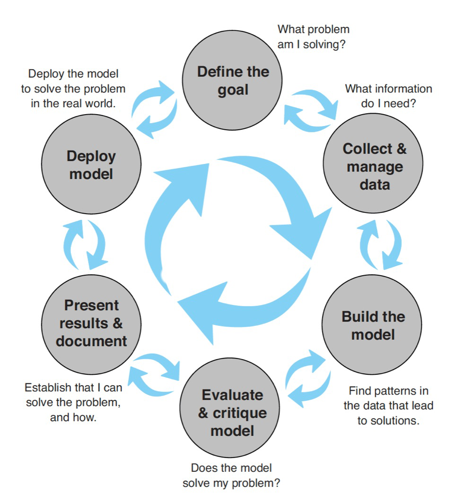
```

---
# Data Science Process

### <p style="color:#00449E">Motivational example of data science project</p>

- Suppose you're interested in how much social media campaigns are effective on climate change legislation.

- The fossil fuel industry may feel that it's losing too much money because of regulations related to climate change and wants to reduce its losses via lobbying. 

- To what extent do social media campaigns competite against fossil fuel lobbying on climate change legislation?


---
class: inverse, center, middle

# Social Media Campaigns, Lobbying and Legislation: Evidence from #climatechange/#globalwarming and Energy Lobbies
<html><div style='float:left'></div><hr color='#EB811B' size=1px width=796px></html>

---
# Social Media

### <p style="color:#00449E">The Rise of Social Media</p>

```{r, echo=FALSE, out.width = '66%', fig.align='center'}

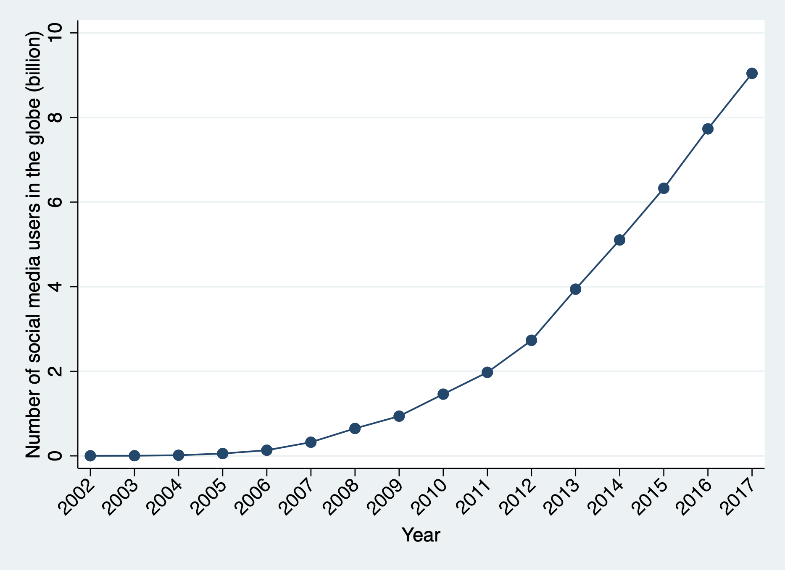
```

---
# Social Media

### <p style="color:#00449E">Climate Change Campaigns in Social Media</p>

```{r, echo=FALSE, out.width = '66%', fig.align='center', fig.cap = "Trend in the number of tweets with #climatechange/#globalwarming and retweets/likes to those tweets"}

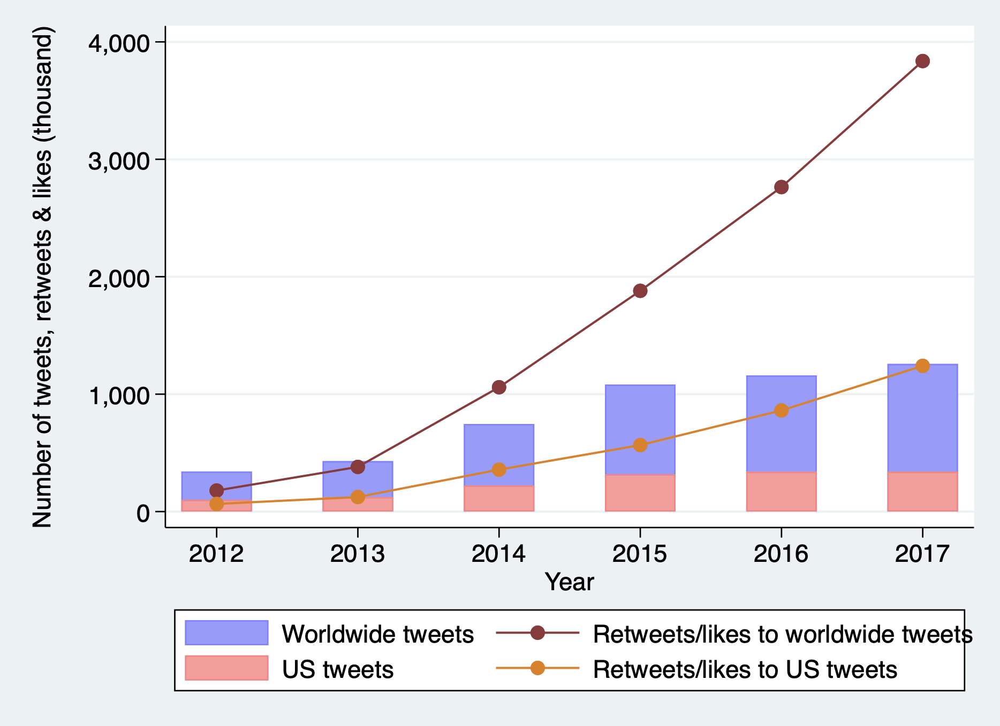
```

---
# Social Media

### <p style="color:#00449E">Climate Change Campaigns in Social Media</p>

- Climate change campaigns in social media are most likely to be driven by a small group of active campaigners.


- During the years 2012-2017,
  - 753,853 users wrote 5.0 million tweets with #climatechange/#globalwarming.
  - 26,000 users, approximately 3% of those 753,853 users,  wrote more than 3.0 million tweets, 60% of those 5.0 million tweets.
  - 1,403,639 users retweeted/liked to those tweets 12.1 million times in total.
  
---
# Social Media

### <p style="color:#00449E">Climate Change Campaigns in Social Media</p>


```{r, echo=FALSE, fig.show="hold", out.width="50%", fig.align='center', fig.cap = "Per-capita number of tweets, retweets and likes with #climatechange/#globalwarming (2012 and 2013)"}

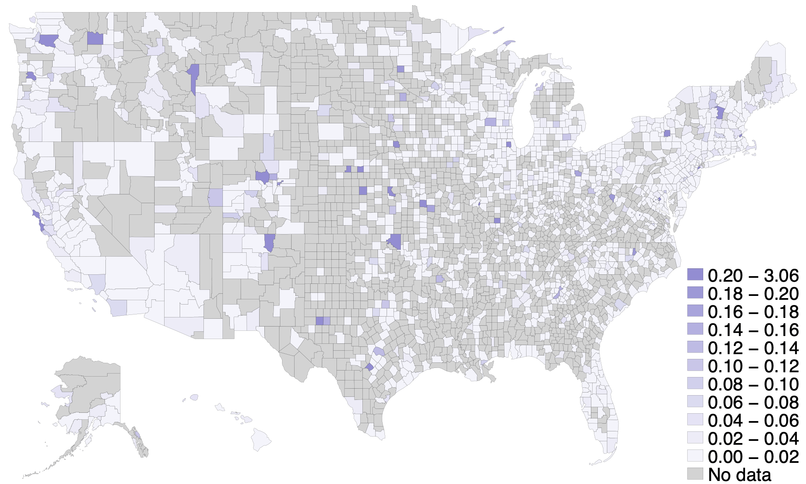
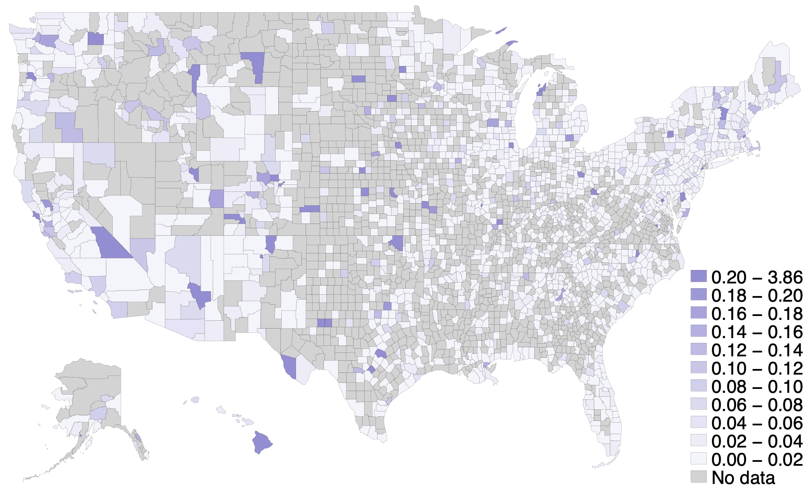

```

  
---
# Social Media

### <p style="color:#00449E">Climate Change Campaigns in Social Media</p>


```{r, echo=FALSE, fig.show="hold", out.width="50%", fig.align='center', fig.cap = "Per-capita number of tweets, retweets and likes with #climatechange/#globalwarming (2014 and 2015)"}

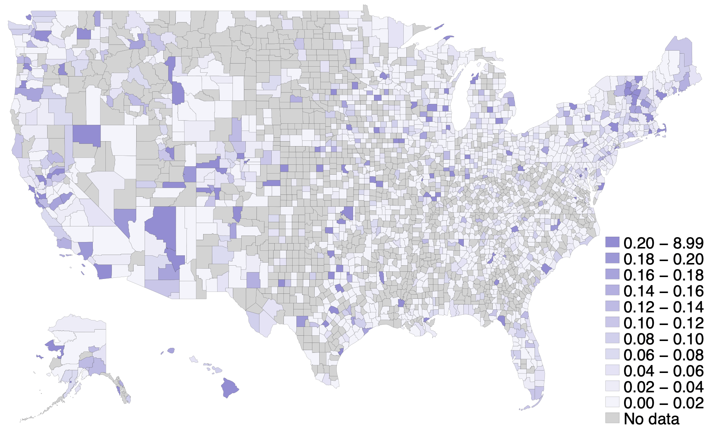
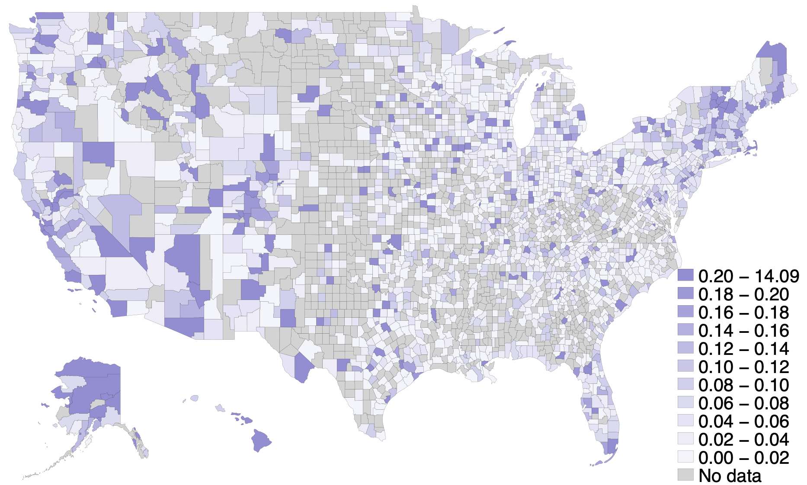

```

  
---
# Social Media

### <p style="color:#00449E">Climate Change Campaigns in Social Media</p>


```{r, echo=FALSE, fig.show="hold", out.width="50%", fig.align='center', fig.cap = "Per-capita number of tweets, retweets and likes with #climatechange/#globalwarming (2016 and 2017)"}

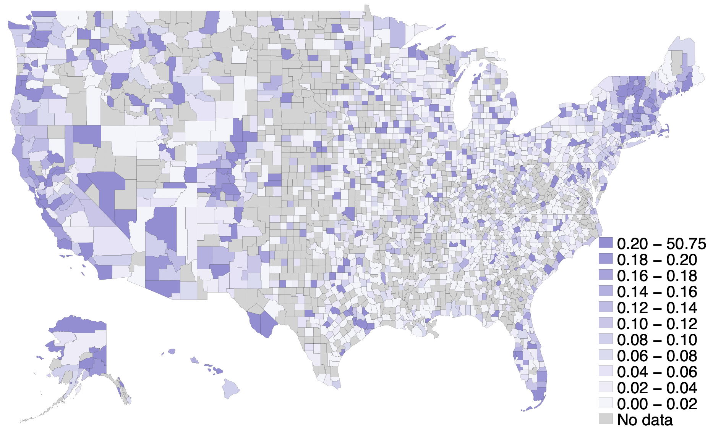
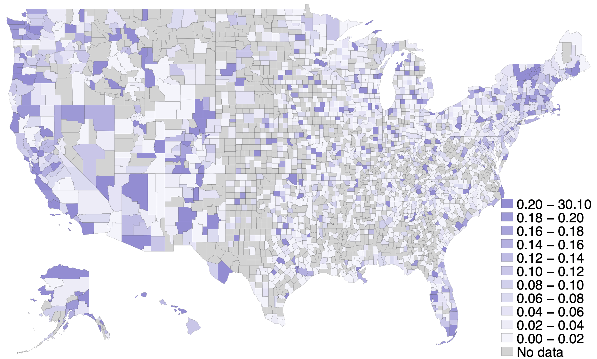

```

  
  
---
# Social Media

### <p style="color:#00449E">Narratives in Social Media Campaigns</p>

- *Topic modeling* method clusters a group of words that best characterize a document.

- The idea behind the topic modeling is that documents are a mixture of latent topics, in which a topic is characterized by a probability distribution over words.


---
# Social Media

### <p style="color:#00449E">Narratives in Social Media Campaigns</p>


```{r, echo=FALSE, fig.show="hold", out.width="33%", fig.align='center', fig.cap = "Topics 1, 2, & 3 from 2016 US tweets with #climatechange/#globalwarming"}

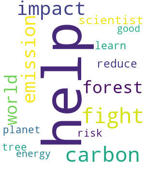
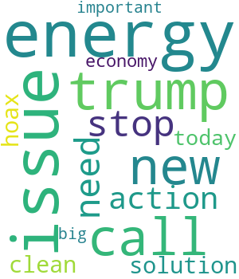
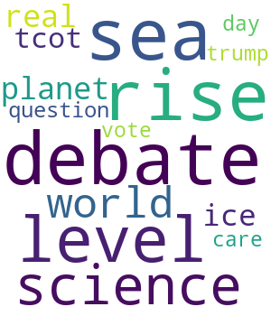

```

---
# Social Media

### <p style="color:#00449E">Narratives in Social Media Campaigns</p>


```{r, echo=FALSE, fig.show="hold", out.width="33%", fig.align='center', fig.cap = "Topics 4, 5, & 6 from 2016 US tweets with #climatechange/#globalwarming"}

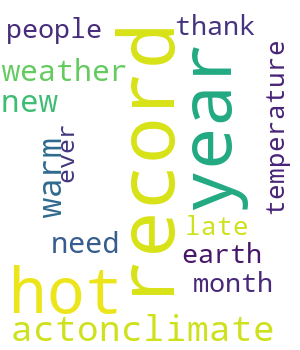
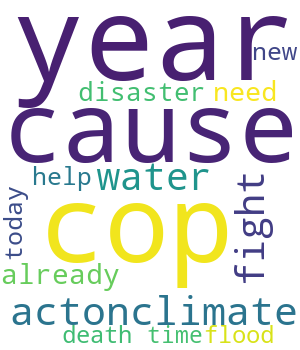
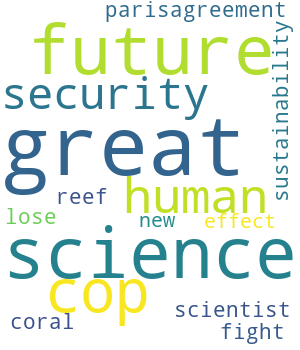

```

  
  
---
# Social Media

### <p style="color:#00449E">Narratives in Social Media Campaigns</p>

- Social media campaigns have increasingly become more politically influential. 
  - My text analysis indicates that at least 20% of US tweets with #climatechange/#globalwarming during 2012-2017 contain some political words. 

- The two most frequently appeared words from the US tweets with #climatechange/#globalwarming during 2012-2017 are:
  - **UniteBlue**: an organization or slogan for the wide range of the left activists.
  - **Tcot**: an acronym for ``Top Conservative on Twitter.''

  
---
# Social Media

### <p style="color:#00449E">Sentiment in Social Media Campaigns</p>

- Sentiment in social media campaigns may play an important role in forming public opinion.

- Some research finds that ...
  - Sentiment of tweets can contribute to the vote outcome.
  - Information with negative sentiment is transmitted faster than one with positive sentiment.
  
  
  
  
---
# Social Media

### <p style="color:#00449E">Sentiment in Social Media Campaigns, Neutral</p>

```{r, echo=FALSE, out.width = '50%', fig.align='center', fig.cap="Word clouds from US tweets with #climatechange/#globalwarming, Neutral"}

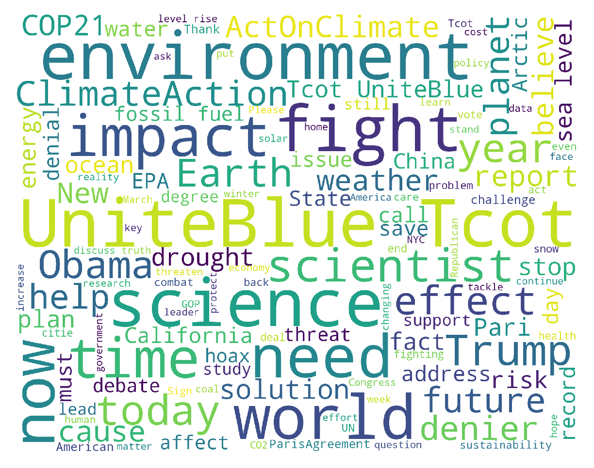
```

  
  
---
# Social Media

### <p style="color:#00449E">Sentiment in Social Media Campaigns, Negative</p>

```{r, echo=FALSE, fig.show="hold", out.width="50%", fig.align='center', fig.cap="Word clouds from US tweets with #climatechange/#globalwarming, Weakly and Strongly Negative"}

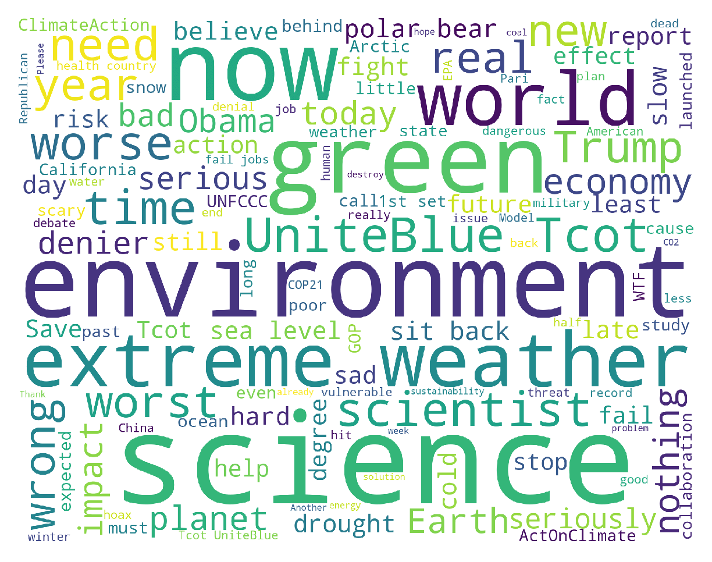
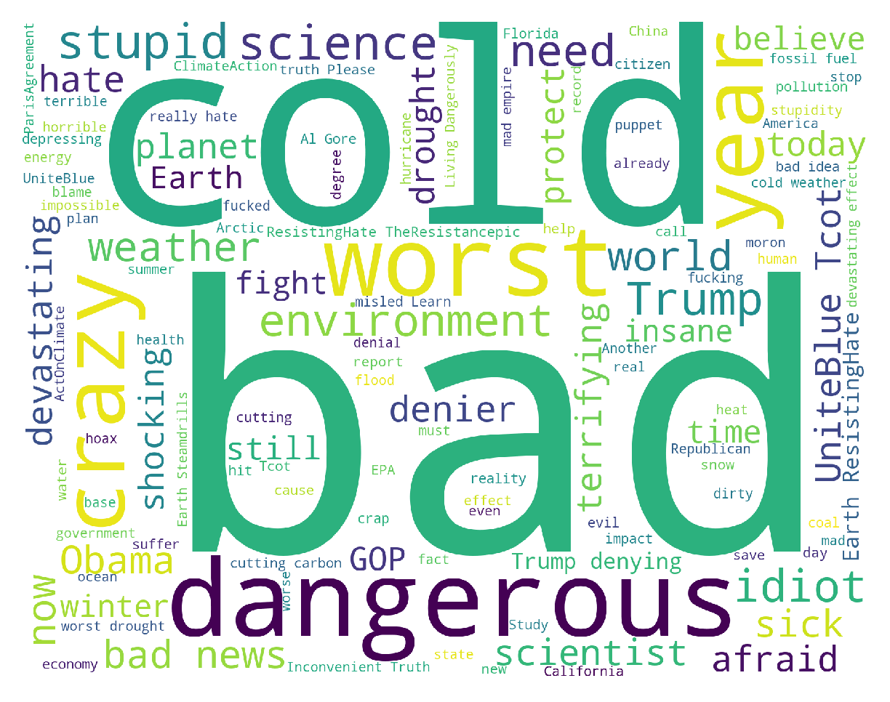
```

---
# Social Media

### <p style="color:#00449E">Sentiment in Social Media Campaigns, Positive</p>

```{r, echo=FALSE, fig.show="hold", out.width="50%", fig.align='center', fig.cap="Word clouds from US tweets with #climatechange/#globalwarming, Weakly and Strongly Positive"}

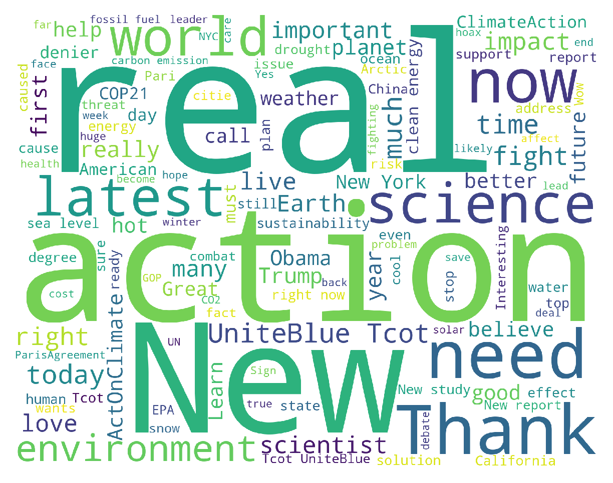
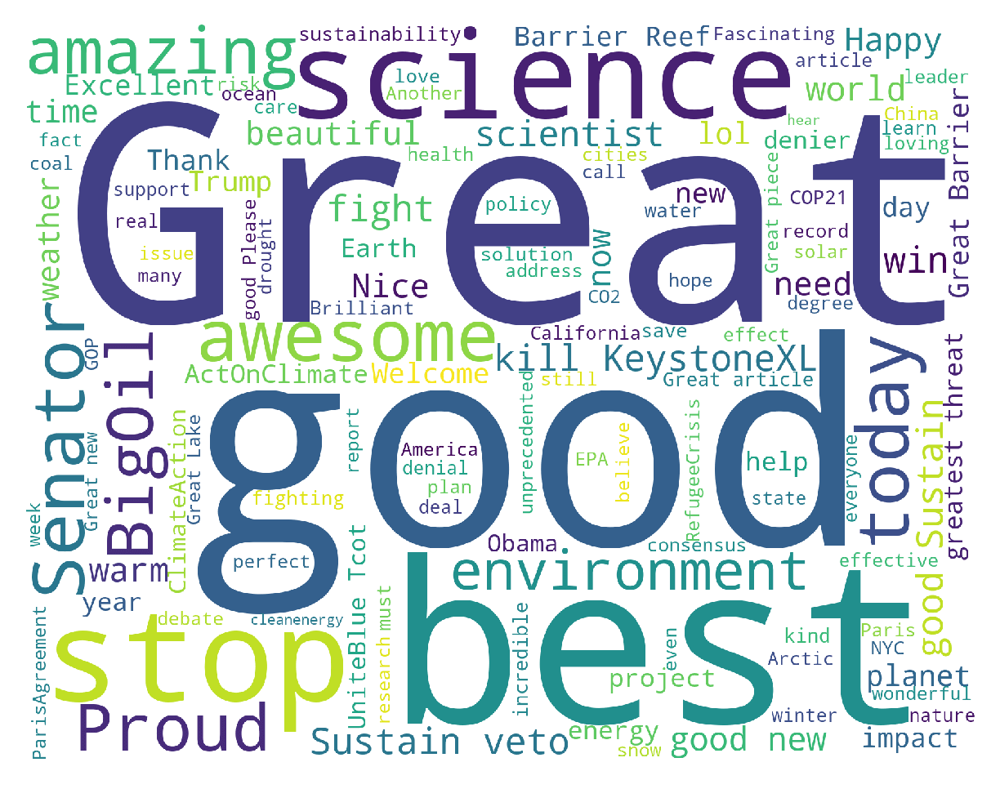
```

  
---
# Climate-unfriendly Bills

### <p style="color:#00449E">Climate-unfriendly legislation</p>

```{r, echo=FALSE, out.width = '61%', fig.align='center', fig.cap="Bills that include sections, which are unfavorable to the action on climate change, 113th US Congress (2013-2014)"}

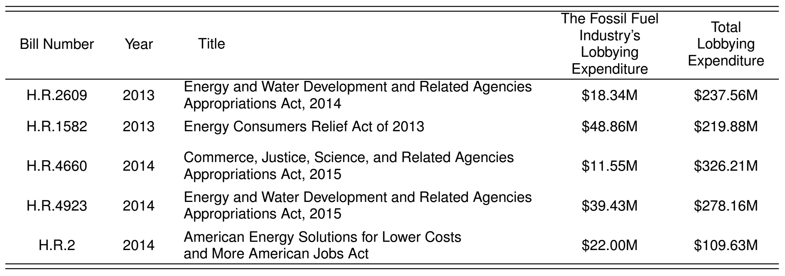
```

- H.R.4923-113th **prohibits** funds made available by this Act from being used to design, implement, administer or carry out several programs, reports, and technical updates related to **global climate change** and the **social cost of carbon**.
  
---
# Climate-unfriendly Bills

### <p style="color:#00449E">Climate-unfriendly legislation</p>

```{r, echo=FALSE, out.width = '67%', fig.align='center', fig.cap="Bills that include sections, which are unfavorable to the action on climate change, 114th US Congress (2015-2016)"}

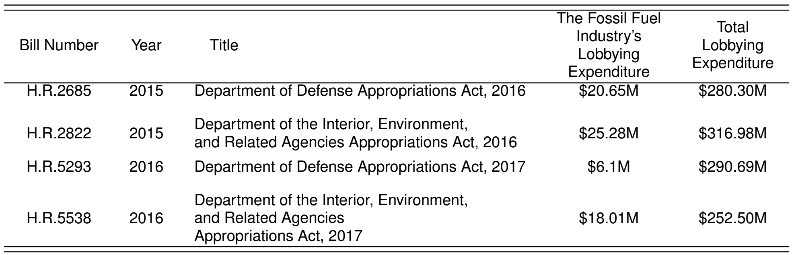
```

- H.R.2822-114th **prohibits** funds from being used to incorporate the **social cost of carbon** into any rule-making or guidance document until a new Interagency Working Group makes specified revisions to the estimates.  

---
# Climate-unfriendly Bills

### <p style="color:#00449E">Climate-unfriendly legislation</p>

```{r, echo=FALSE, out.width = '67%', fig.align='center', fig.cap="Bills that include sections, which are unfavorable to the action on climate change, 115th US Congress (2017-2018)"}


```

- H.CON.RES.119-115th expresses the sense of Congress that a **carbon tax** would be detrimental to American families and businesses and is not in the best interest of the United States.
  
---
# Climate-unfriendly Bills

### <p style="color:#00449E">Climate-unfriendly legislation</p>

```{r, echo=FALSE, out.width = '67%', fig.align='center', fig.cap="Bills that include sections, which are unfavorable to the action on climate change, 115th US Congress (2017-2018)"}

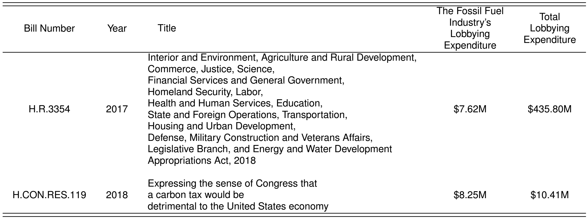
```


---
# Social Media Campaigns vs. Lobbying on Legislation

### <p style="color:#00449E">Why Does It Matter?</p>

- I provide empirical evidence on ...
  - competition between NGO activism and industry lobbying for political influences.
  - the effects of social media campaigns on legislation.
