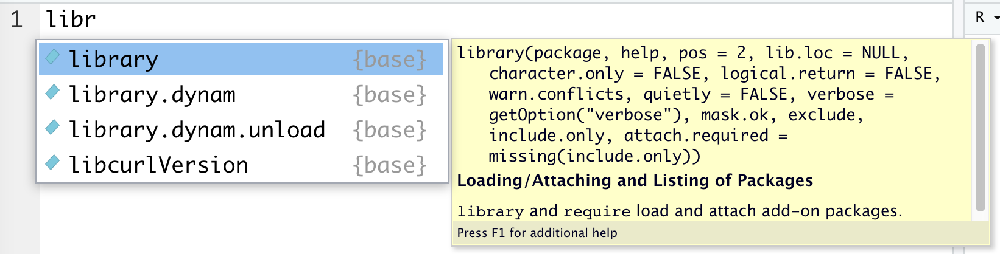
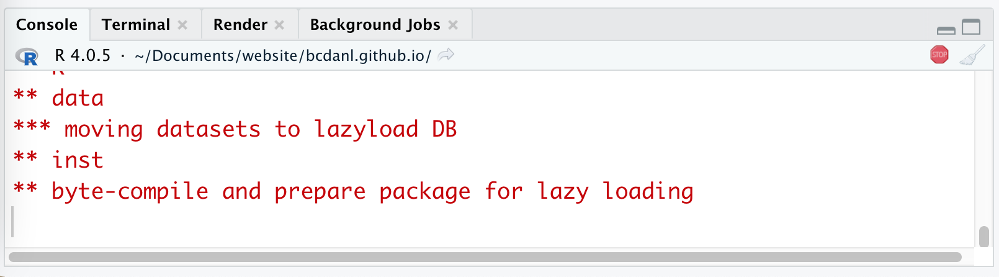
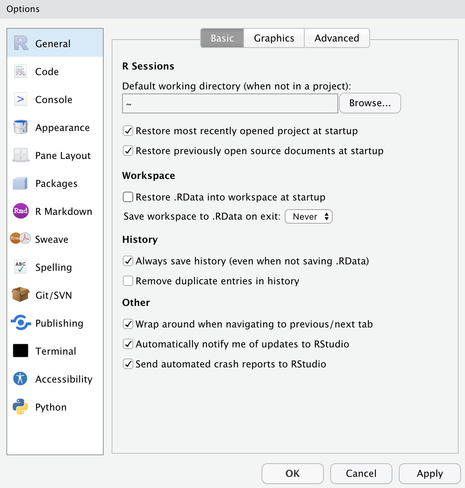

```{r setup, include = FALSE}
library(knitr)
library(kableExtra)
library(tidyverse)
library(NHSRtheme)
library(fontawesome)

# set default options
opts_chunk$set(echo = FALSE,
               fig.width = 7.252,
               fig.height = 4,
               comment = "#",
               dpi = 300)

knitr::knit_engines$set("markdown")

xaringanExtra::use_tile_view()
xaringanExtra::use_panelset()
xaringanExtra::use_clipboard()
xaringanExtra::use_webcam()
xaringanExtra::use_broadcast()
xaringanExtra::use_share_again()
xaringanExtra::style_share_again(
  share_buttons = c("twitter", "linkedin", "pocket")
)


xaringanExtra::use_extra_styles(
  hover_code_line = TRUE,         #<<
  mute_unhighlighted_code = TRUE  #<<
)

# uncomment the following lines if you want to use the NHS-R theme colours by default
# scale_fill_continuous <- partial(scale_fill_nhs, discrete = FALSE)
# scale_fill_discrete <- partial(scale_fill_nhs, discrete = TRUE)
# scale_colour_continuous <- partial(scale_colour_nhs, discrete = FALSE)
# scale_colour_discrete <- partial(scale_colour_nhs, discrete = TRUE)
```

class: title-slide, left, bottom

# `r rmarkdown::metadata$title`
----
## **`r rmarkdown::metadata$subtitle`**
### `r rmarkdown::metadata$author`
### `r rmarkdown::metadata$date`


---
# Tips for using Presentation Slides

<!-- ### <p style="color:#00449E"></p> -->

- To go to a previous/next page, use keyboard arrows, `r fa("arrow-left")` and `r fa("arrow-right")`.

- To see a tile view of the lecture slides, use the alphabet key, `o`.

- If you hover a mouse cursor on the code block in the lecture slide, you can see and click the *"Copy Code"* from the top-right corner of the code block.
  - If you click the *"Copy Code"*, the codes in the block are copied, so that you can paste them to RScript.

- If the presentation slides does not respond, refresh the web-page of the slides by the shortcut, **Ctrl** (or **command** for Mac users) ** + R**.


---
# Tips for the Geneseo Virtual Lab

- The Geneseo Virtual Lab gives you access to a Windows based computer in the cloud with many of the academic and productivity software packages including R, RStudio, and Microsoft Excel.


  - Here is the web-link for [Geneseo Virtual Lab](https://wiki.geneseo.edu/display/cit/Accessing+the+Geneseo+Virtual+Lab).


---
class: inverse, center, middle

# Installing the Tools
<html><div style='float:left'></div><hr color='#EB811B' size=1px width=796px></html>


---
# Installing the Tools
### <p style="color:#00449E"> R Packages </p>


```r
update.packages(ask = FALSE, checkBuilt = TRUE)

pkgs <- c("tidyverse", "nycflights13", "gapminder", "skimr")
install.packages(pkgs,
	dependencies = c("Depends", "Imports", "LinkingTo"))
```


- While running the above codes, I recommend you to answer "no" to the following question:

.pull-left[

   **Mac**: *"Do you want to install from sources the packages which need compilation?"* from Console Pane.
]

.pull-right[

   **Windows**: *"Would you like to use a personal library instead?"* from Pop-up message.
]


---
# Installing the Tools
### <p style="color:#00449E"> R Packages </p>

- Check whether `tidyverse` is installed well:

```r
library(tidyverse)   # loading the package tidyverse
mpg  # data.frame provided by the package ggplot2
     # ggplot2 is included in tidyverse
```

- Let me know if you have an error from the above code.


---
class: inverse, center, middle

# Workflow
<html><div style='float:left'></div><hr color='#EB811B' size=1px width=796px></html>

---
# Workflow
### <p style="color:#00449E"> Shortcuts for RStudio and RScript </p>

.pull-left[
**Mac**

- **command + shift + N** opens a new RScript.
- **command + return** runs a current line or selected lines.
- **command + shift + C** is the shortcut for # (commenting).
- **option + - ** is the shortcut for `<-`.
]

.pull-right[
**Windows**

- **Ctrl + Shift + N** opens a new RS-cript.
- **Ctrl + return** runs a current line or selected lines.
- **Ctrl + Shift + C** is the shortcut for # (commenting).
- **Alt + - ** is the shortcut for `<-`.
]


---
# Workflow

- **Home/End** moves the blinking cursor bar to the beginning/End of the line.
  - **Ctrl** (**command** for Mac Users) **+** `r fa("arrow-left")` / `r fa("arrow-right")` works too.


- **Ctrl** (**command** for Mac Users) **+ Z** undoes the previous action.
- **Ctrl** (**command** for Mac Users) **+ Shift + Z** redoes when undo is executed.


- **Ctrl** (**command** for Mac Users) **+ F** is useful when finding a phrase (and replace the phrase) in the RScript.

- Auto-completion of command is useful.
  - Type `libr` in the RScript in RStudio and wait for a second.
  
.pull-left[
```r
libr
```
]
.pull-right[
```{r, echo=FALSE, out.width = '100%', fig.align='center'}

```

]

---
# Workflow

- To install R package `PACKAGE`, use `install.packages("PACKAGE")`.
```r
install.packages("ggplot2")  # installing package "ggplot2"
```

- When the code is running, RStudio shows the STOP icon (`r fa("fas fa-stop", fill = "red")`) at the top right corner in the Console Pane.
  - Do not click it unless if you want to stop running the code.

```{r, echo=FALSE, out.width = '90%', fig.align='center'}

```


---
# Workflow
### <p style="color:#00449E"> Quotation marks, parentheses, and `+` </p>


- Quotation marks and parentheses must always come in a pair.
  - If not, Console Pane will show you the continuation character `+`:

```r
> x <- "hello
```

- The `+` tells you that R is waiting for more input; it doesn’t think you’re done yet. 

---
# Workflow
### <p style="color:#00449E"> RStudio Options Setting </p>
.pull-left[
```{r, echo=FALSE, out.width = '100%', fig.align='center'}

```
]

.pull-right[
- This option menu is found by menus as follows:
  - *Mac*: RStudio $>$ Preferences 
  - *Windows*: Tools $>$ Global Options
  
- Check `r fa("check")` as in the picture.
- Choose "Never" on "Save workplace to .RData on exit:".
]


---
class: inverse, center, middle

# Starting with R
<html><div style='float:left'></div><hr color='#EB811B' size=1px width=796px></html>


---
# Starting with R
- Let's try a few commands to help you become familiar with R and its basic data types.

- In R, **vectors** are arrays of same-typed values.
  - They can be built with the `c()` notation.
  
.pull-left[
```r
1
1/2
'Joe'
"Joe"
"Joe"=='Joe'
c()
is.null(c())
is.null(5)
```
]
.pull-right[

```r
c(1)
c(1, 2)
c("Apple", 'Orange')
length(c(1, 2))
vec <- c(1, 2)
vec
```
]


---
# Starting with R
### <p style="color:#00449E"> Assignment </p>
- R has many assignment operators (e.g., `<-`, `=`, `->` ).
- The preferred one is `<-`.

```r
x <- 2
x < - 3
print(x)

x <- 5
x = 5
5 -> x
```


---
# Starting with R
### <p style="color:#00449E"> R data types </p>

- Primary data types in R are as follows:
  - **Logical**: A simple binary variable that may have only two values---TRUE or FALSE.
  - **Numeric**: Decimal numbers
  - **Integer**: Integers
  - **Character**: Text strings
  - **Factor**: Categorical values. Each possible value of a factor is known as a *level*.
  - **Ordered Factor**: A special factor data type where the order of the levels is significant. E.g., Low, Medium, and High


---
# Starting with R
### <p style="color:#00449E"> R data types </p>

- Test the data types.
```r
x <- TRUE
y <- 1
z <- 'Data Analytics'
productCategory <- c('fruit', 'vegetable', 'dry goods', 'fruit',
                     'vegetable', 'dry goods')
productCategoryFactor <- factor(productCategory)
```
- The `class()` function returns the data type of an object.
  - What are classes for `x`, `y`, `z`, `productCategory`, and `productCategoryFactor`?


---
# Starting with R
### <p style="color:#00449E"> R data types </p>


- Most R data types are *mutable*, in that we're allowed to change them.

```r
a <- c(1, 2)
b <- a

print(b)

# Alters a
a[[1]] <- 5

print(a)
print(b)
```


---
# Starting with R
### <p style="color:#00449E"> Lists </p>


- **Lists**, unlike *vectors*, can store more than one type of object.
  - The ways to access items in lists are the `$` operator and the `[[]]` operator.
  
```r
x <- list('a' = 6, b = 'fred')
names(x)

x$a
x$b

x[['a']]

x[c('a', 'a', 'b', 'b')]
```


---
# Starting with R
### <p style="color:#00449E"> R data types </p>


- Here are examples of a vector and a list.

```r
example_vector <- c(10, 20, 30)
example_list <- list(a = 10, b = 20, c = 30)

example_vector[1]
example_list[1]

example_vector[[2]]
example_list[[2]]

example_vector[c(FALSE, TRUE, TRUE)]
example_list[c(FALSE, TRUE, TRUE)]

example_list$b
example_list[["b"]]
```


---
# Starting with R
### <p style="color:#00449E"> Errors </p>


- Errors are just R's way of saying it safely refused to complete an ill-formed operation 

- Fear of errors should not limit experiments.

```r
x <- 1:5
print(x)

x <- meanMISSPELLED(x)  
print(x)                                 

x <- mean(x)                      
print(x)
```


---
# Starting with R
### <p style="color:#00449E"> Data Frames </p>

- R’s central data structure is the data frame. 
- A data frame is organized into rows and columns. 
- Data frames are essentially lists of columns.
- Data frames can have columns of different types.

.pull-left[
```r
d <- data.frame(x=c(1,2),
              y=c('a','b'))

d[['x']]
d$x
d[[1]]
```
]

.pull-right[
```r
d
d[1,]
d[,1]

d[1,1]
d[1, 'x']
```

]


---
# Starting with R
### <p style="color:#00449E"> Data Frames </p>

- The R **data.frame** class is designed to store data in a very good "ready for analysis" format.

```r
d <- data.frame(col1 = c(1, 2, 3), col2 = c(-1, 0, 1))
print(d)
d$col3 <- d$col1 + d$col2
print(d)
```

---
# Starting with R
### <p style="color:#00449E"> NULL and NA values </p>

- `NULL` is just an alias for `c()`, the empty vector.
- `NA` indicates missing or unavailable data.

```r
c(c(), 1, NULL)
c("a", NA, "c")
```


---
# Starting with R
### <p style="color:#00449E"> NULL and NA values </p>

- `NULL` is just an alias for `c()`, the empty vector.
- `NA` indicates missing or unavailable data.

```r
c(c(), 1, NULL)
c("a", NA, "c")
```


---
# Starting with R
### <p style="color:#00449E"> NULL and NA values </p>

- Most R data types are *mutable*, in that we're allowed to change them.

```r
d <- data.frame(x = 1, y = 2)
d2 <- d
d$x <- 5

print(d)
print(d2)
```


---
class: inverse, center, middle

# Management of Files, Directories, and Scripts
<html><div style='float:left'></div><hr color='#EB811B' size=1px width=796px></html>


---
# Management of Files, Directories, and Scripts
### <p style="color:#00449E"> Code and comment style </p>
- The two main principles for coding and managing data are:
  - Make things easier for your future self.
  - Don't trust your future self.

- So we do make comments on codes.


---
# Management of Files, Directories, and Scripts
### <p style="color:#00449E"> Code and comment style </p>

- The `#` mark is R's comment character.
  - `#` indicates that the rest of the line is to be ignored.
  - Write comments before the line that you want the comment to apply to.

- Consider using block commenting for separating code sections.
  - `#####` defines a coding block.

- Break down long lines and long algebraic expressions.


---
# Management of Files, Directories, and Scripts
### <p style="color:#00449E"> Materials for the book, Practical Data Science with R </p>

- Click the green "Code" button and download the ZIP file from the following GitHub page: [https://github.com/WinVector/PDSwR2](https://github.com/WinVector/PDSwR2).

.panelset[

.panel[.panel-name[Windows]

- **Step 1.** Go to your Download folder (or the folder where the downloaded file is saved) using the File Explorer.
- **Step 2.** Click the ZIP file one time.
- **Step 3.** Cut the file by using the shortcut (**Ctrl+X**).  
- **Step 4.** Go to your working folder for the course using the File Explorer.
- **Step 5.** Paste the file to your working folder by using **Ctrl+V**.
- **Step 6.** Right-click the ZIP file and click "Extract ..."
]

 <!---->

.panel[.panel-name[Mac]

- **Step 1.** Go to your Download folder (or the folder where the downloaded file is saved) using the Finder.
- **Step 2.** Click the ZIP file (or the folder if the ZIP file is extracted) one time.
- **Step 3.** Copy the file (or the folder) by using the shortcut (**command+C**).  
- **Step 4.** Go to your working folder for the course using the Finder.
- **Step 5.** Paste the file to your working folder by using **command+option+V**.
- **Step 6.** Right-click the ZIP file and click "Extract ..."
] <!---->

] <!--end of panelset-->


---
# Management of Files and Directories
### <p style="color:#00449E"> Finding the path name of the file </p>

.panelset[

.panel[.panel-name[Windows 11]

- **Step 1.** Go to your folder using the File Explorer.
- **Step 2.** Right-click the file.
- **Step 3.** Click "Copy as path".
- **Step 4.** Paste the path name of the file to the R script (Ctrl+V).
- **Step 5.** 
  - *Option 1.* Replace backslash(`\`) with double-backslash(`\\`) in the path name.
  - *Option 2.* Replace backslash(`\`) with slash(`/`) in the path name.
]

 <!---->


.panel[.panel-name[Windows 10]

- **Step 1.** Go to your folder using the File Explorer.
- **Step 2.** Keep pressing the "Shift" key
- **Step 3.** Right-click the file.
- **Step 4.** Click "Copy as path".
- **Step 5.** Paste the path name of the file to the R script (Ctrl+V).
- **Step 6.** 
  - *Option 1.* Replace backslash(`\`) with double-backslash(`\\`) in the path name.
  - *Option 2.* Replace backslash(`\`) with slash(`/`) in the path name.
]

 <!---->

.panel[.panel-name[Mac]

- **Step 1.** Go to your folder using the Finder.
- **Step 2.** Right-click the file in the folder
- **Step 3.** Keep pressing "option"
- **Step 4.** Click "Copy 'PATH\_FOR\_YOUR\_FILE' as Pathname" from the menu.
- **Step 5.** Paste it to the R script (command+V).

] <!---->

] <!--end of panelset-->


---
class: inverse, center, middle

# Working with Data from Files
<html><div style='float:left'></div><hr color='#EB811B' size=1px width=796px></html>


---
# Working with Data from Files

- Step 1. Find the path name for the file, `car.data.csv`, from the sub-folder, 'UCICar' in the folder, 'PDSwR2-main'.

- Step 2. In the code below, replace 'PATH_NAME_FOR_THE_FILE_car.data.csv' with the path name for the file, `car.data.csv`.

- Step 3. Run the following R code:

```r
uciCar <- read.table(
		'PATH_NAME_FOR_THE_FILE_car.data.csv',
		sep = ',',
		header = TRUE,
		stringsAsFactor = TRUE )
View(uciCar)
```

---
# Working with Data from Files
### <p style="color:#00449E"> Examining data frame </p>

- `class()` tells you what kind of R object you have. 
- `dim()` shows how many rows and columns are in the data for `data.frame`.
- `head()` shows the top few rows of the data.
- `help()` provides the documentation for a class. 
  - Try `help(class(uciCar))`.
- `str()` gives us the structure for an object.


---
# Working with Data from Files
### <p style="color:#00449E"> Examining data frame </p>

- `summary()` provides a summary of almost any R object. 
- `skimr::skim()` provides a more detailed summary.
  - `skimr` is the package that provides the function `skim()`.
- `print()` prints all the data. 
  - Note: for large datasets, this can take a very long time and is something you want to avoid.
- `View()` displays the data in a simple spreadsheet-like grid viewer.
- `dplyr::glimpse()` displays brief information about the data.


---
# Working with Data from Files
### <p style="color:#00449E"> Examining data frame </p>

```r
print(uciCar)
class(uciCar)
dim(uciCar)
head(uciCar)
help(class(uciCar))
str(uciCar)
summary(uciCar)

library(skimr)
skim(uciCar)
library(tidyverse)
glimpse(uciCar)
```


---
# Working with Data from Files
### <p style="color:#00449E"> Reading data from an URL </p>

- We can import the data file from the web.

```r
tvshows <- read.table(
		'https://bcdanl.github.io/data/tvshows.csv',
		sep = ',',
		header = TRUE,
		stringsAsFactor = TRUE)
```


---
# Working with Data from Files
### <p style="color:#00449E"> Data visualization </p>

- Let's try some data visualization using `ggplot()`:

```r
ggplot(tvshows) + 
  geom_point(aes(x=GRP, y=PE, color=Genre))
  
ggplot(tvshows) + 
  geom_point(aes(x=GRP, y=PE)) + 
  facet_wrap(~Genre)
```
-  How is the the relationship between audience size (`GRP`) and audience engagement (`PE`)?


---
class: inverse, center, middle

# Data Visualization with `ggplot()`
<html><div style='float:left'></div><hr color='#EB811B' size=1px width=796px></html>


---
# Exploratory Data Analysis

```{r, echo=FALSE, out.width = '40%', fig.align='center'}
knitr::include_graphics("../lec_figs/data-science-explore.png")
```

- In data visualization, you'll learn the basic structure of a `ggplot` plot. It turns data into plots.
  
- In data transformation, you'll learn the key verbs that allow you to select important variables, filter out key observations, create new variables, and compute summaries.

- In **exploratory data analysis**, you'll combine visualization and transformation with your curiosity and skepticism to ask and answer interesting questions about data.


---
# Data Visualization - First Steps

```r
library(tidyverse)
mpg
?mpg
```

- The `mpg` data frame, provided by `ggplot2`, contains observations collected by the US Environmental Protection Agency on 38 models of car.

- Q. Do cars with big engines use more fuel than cars with small engines?
  - `displ`: a car's engine size, in liters.
  - `hwy`: a car's fuel efficiency on the highway, in miles per gallon (mpg). 


---
# Data Visualization - First Steps
### <p style="color:#00449E"> Creating a `ggplot` </p>

-  What does the relationship between engine size and fuel efficiency look like?

  - To plot `mpg`, run the following code to put `displ` on the `x`-axis and `hwy` on the `y`-axis:

```r
ggplot(data = mpg) + 
  geom_point(mapping = aes(x = displ, y = hwy))
```


---
# Data Visualization - First Steps
### <p style="color:#00449E"> Graphing Template </p>
- To make a ggplot plot, replace the bracketed sections in the code below with a `data.frame`, a `geom` function, or a collection of mappings such as `x = VAR_1` and `y = VAR_2` .

```r
ggplot(data = <DATA>) + 
  <GEOM_FUNCTION>(mapping = aes(<MAPPINGS>))
```


---
# Data Visualization - First Steps
### <p style="color:#00449E"> Exercises </p>

1. Run `ggplot(data = mpg)`. What do you see?
```r
ggplot(data = mpg)
```

2. How many rows are in `mpg`? How many columns?

3. What does the `drv` variable describe? Read the help for `?mpg` to find out.

4. Make a scatterplot of `hwy` vs. `cyl`.

5. What happens if you make a scatterplot of `class` vs. `drv`? Why is the plot not useful?
