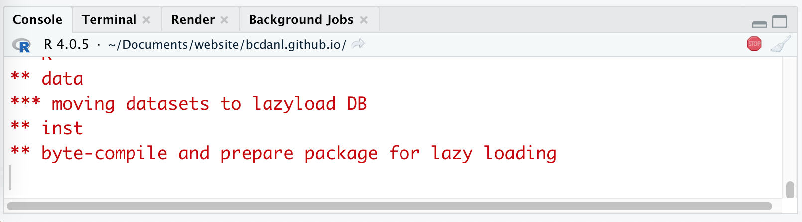
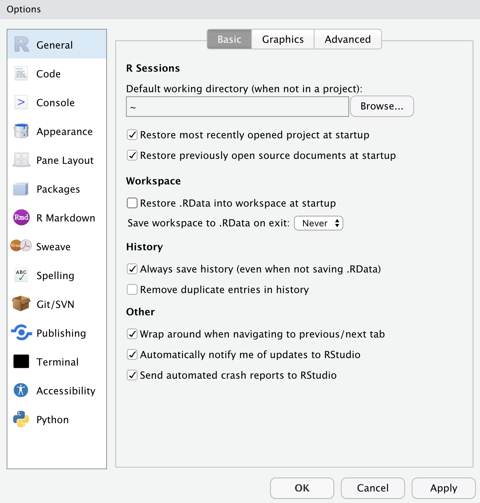
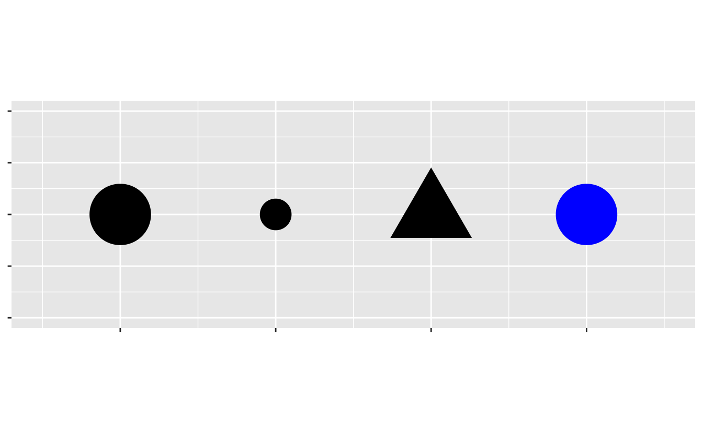

```{r setup, include = FALSE}
library(knitr)
library(kableExtra)
library(tidyverse)
library(NHSRtheme)
library(fontawesome)
# set default options
opts_chunk$set(echo = T, eval = F,
               fig.width = 7.252,
               fig.height = 4,
               comment = "#",
               dpi = 300)

knitr::knit_engines$set("markdown")

xaringanExtra::use_tile_view()
xaringanExtra::use_panelset()
xaringanExtra::use_clipboard()
xaringanExtra::use_webcam()
xaringanExtra::use_broadcast()
xaringanExtra::use_share_again()
xaringanExtra::style_share_again(
  share_buttons = c("twitter", "linkedin", "pocket")
)


xaringanExtra::use_extra_styles(
  hover_code_line = TRUE,         #<<
  mute_unhighlighted_code = TRUE  #<<
)

# uncomment the following lines if you want to use the NHS-R theme colours by default
# scale_fill_continuous <- partial(scale_fill_nhs, discrete = FALSE)
# scale_fill_discrete <- partial(scale_fill_nhs, discrete = TRUE)
# scale_colour_continuous <- partial(scale_colour_nhs, discrete = FALSE)
# scale_colour_discrete <- partial(scale_colour_nhs, discrete = TRUE)
```

class: title-slide, left, bottom

# `r rmarkdown::metadata$title`
----
## **`r rmarkdown::metadata$subtitle`**
### `r rmarkdown::metadata$author`
### `r rmarkdown::metadata$date`


---
class: inverse, center, middle

# RStudio Workflow
<html><div style='float:left'></div><hr color='#EB811B' size=1px width=796px></html>


---
# RStudio Environment
.pull-left[
```{r, echo=FALSE, eval = T, out.width = '100%', fig.align='center'}
knitr::include_graphics("../lec_figs/rstudio_env.png")
```
]

.pull-right[
- **Script Pane** is where you write R commands in a script file that you can save. 
  - An R script is simply a text file containing R commands. 
  - RStudio will color-code different elements of your code to make it easier to read.

]

---
# Workflow
### <p style="color:#00449E"> RStudio Environment </p>
.pull-left[
```{r, echo=FALSE, eval = T, out.width = '100%', fig.align='center'}
knitr::include_graphics("../lec_figs/rstudio_env.png")
```
]

.pull-right[
- **Console Pane** allows you to interact directly with the R interpreter and type commands where R will immediately execute them.

]

---
# Workflow
### <p style="color:#00449E"> RStudio Environment </p>
.pull-left[
```{r, echo=FALSE, eval = T, out.width = '100%', fig.align='center'}
knitr::include_graphics("../lec_figs/rstudio_env.png")
```
]

.pull-right[
- **Environment Pane** is where you can see the values of variables, data frames, and other objects that are currently stored in memory.

]
---
# Workflow
### <p style="color:#00449E"> RStudio Environment </p>
.pull-left[
```{r, echo=FALSE, eval = T, out.width = '100%', fig.align='center'}
knitr::include_graphics("../lec_figs/rstudio_env.png")
```
]

.pull-right[
- **Plots Pane** contains any graphics that you generate from your R code.

]


---
# Workflow
### <p style="color:#00449E"> Shortcuts for RStudio and RScript </p>

.pull-left[
**Mac**

- **command + shift + N** opens a new RScript.
- **command + return** runs a current line or selected lines.
- **command + shift + C** is the shortcut for # (commenting).
- **option + - ** is the shortcut for `<-`.
]

.pull-right[
**Windows**

- **Ctrl + Shift + N** opens a new RS-cript.
- **Ctrl + return** runs a current line or selected lines.
- **Ctrl + Shift + C** is the shortcut for # (commenting).
- **Alt + - ** is the shortcut for `<-`.
]


---
# Workflow

- **Home/End** moves the blinking cursor bar to the beginning/End of the line.
  - **Ctrl** (**command** for Mac Users) **+** `r fa("arrow-left")` / `r fa("arrow-right")` works too.


- **Ctrl** (**command** for Mac Users) **+ Z** undoes the previous action.
- **Ctrl** (**command** for Mac Users) **+ Shift + Z** redoes when undo is executed.


- **Ctrl** (**command** for Mac Users) **+ F** is useful when finding a phrase (and replace the phrase) in the RScript.

- Auto-completion of command is useful.
  - Type `libr` in the RScript in RStudio and wait for a second.
  
.pull-left[
```{r, echo = T, eval = F}
libr
```
]
.pull-right[
```{r, echo=FALSE, eval = T, out.width = '100%', fig.align='center'}
knitr::include_graphics("../lec_figs/auto-completionRStudio.png")
```

]


---
# Workflow
### <p style="color:#00449E"> Code and comment style </p>
- The two main principles for coding and managing data are:
  - Make things easier for your future self.
  - Don't trust your future self.

- The `#` mark is R's comment character.
  - `#` indicates that the rest of the line is to be ignored.
  - Write comments before the line that you want the comment to apply to.

- Consider using block commenting for separating code sections.
  - `####` defines a coding block.

- Break down long lines and long algebraic expressions.


---
# Workflow
### <p style="color:#00449E"> Quotation marks, parentheses, and `+` </p>


- Quotation marks and parentheses must always come in a pair.
  - If not, Console Pane will show you the continuation character `+`:

```{r, echo = T, eval = F}
x <- "hello
```

- The `+` tells you that R is waiting for more input; it doesn’t think you’re done yet. 


---
# Workflow
### <p style="color:#00449E"> Installing R packages </p>

- To install R package `PACKAGE`, use `install.packages("PACKAGE")`.
```{r, echo = T, eval = F}
install.packages("ggplot2")  # installing package "ggplot2"
install.packages("readr")  # installing package "readr"
```

- When the code is running, RStudio shows the STOP icon (`r fa("fas fa-stop", fill = "red")`) at the top right corner in the Console Pane.
  - Do not click it unless if you want to stop running the code.

```{r, echo=FALSE, eval = T, out.width = '90%', fig.align='center'}

```


---
# Workflow
### <p style="color:#00449E"> Loading R packages </p>

- To load R package `PACKAGE`, use `library(PACKAGE)`.
```{r, echo = T, eval = F}
library(skimr)  # loading package "skimr"
```


---
# Workflow
### <p style="color:#00449E"> `tidyverse` package </p>

- Check whether `tidyverse` is installed well:

```{r, echo = T, eval = F}
library(tidyverse)   # loading the package tidyverse
mpg  # data.frame provided by the package ggplot2
     # ggplot2 is included in tidyverse
```

- Please let me know if you have an error from the above code.


---
# Workflow
### <p style="color:#00449E"> RStudio Options Setting </p>

.pull-left[
```{r, echo=FALSE, eval = T, out.width = '100%', fig.align='center'}

```
]

.pull-right[
- This option menu is found by menus as follows:
  - Tools $>$ Global Options
]


---
class: inverse, center, middle

# Starting with R
<html><div style='float:left'></div><hr color='#EB811B' size=1px width=796px></html>


---
# Starting with R
### <p style="color:#00449E"> Assignment </p>
- R has many assignment operators (e.g., `<-`, `=`, `->` ).
- The preferred one is `<-`.

```{r, echo = T, eval = F}
x <- 2
x < - 3
print(x)

x <- 5
x = 5
5 -> x
```


---
# Starting with R
### <p style="color:#00449E"> R variables and data types </p>

- **Variables** can be thought of as a labelled container used to store information. 

- Variables allow us to recall saved information to later use in calculations. 

- Variables can store many different things in RStudio, from single values, data frames, to graphs.


---
# Starting with R
### <p style="color:#00449E"> R variables and data types </p>

.panelset[

.panel[.panel-name[variable types]

.pull-left[

```{r, echo=FALSE, eval = T, out.width = '100%', fig.align='center'}
knitr::include_graphics("../lec_figs/r_variable_types.png")
```
]

.pull-right[
  - **Logical**: TRUE or FALSE.
  - **Numeric**: Decimal numbers
  - **Integer**: Integers
  - **Character**: Text strings
  - **Factor**: Categorical values. Each possible value of a factor is known as a *level*.

]


]

.panel[.panel-name[data types]

.pull-left[

```{r, echo=FALSE, eval = T, out.width = '80%', fig.align='center'}
knitr::include_graphics("../lec_figs/r_data_types.png")
```
]

.pull-right[
- **vector**:	1D collection of variables of the same type
- **matrix**:	2D collection of variables of the same type
- **data.frame**:	2D collection of variables of multiple types
]

]

]


---
# R variable and data types
### <p style="color:#00449E">  </p>


.panelset[

.panel[.panel-name[Character]
- Strings are known as “character” in R. 
- Use the double quotes " or single quotes ' to wrap around the string

```{r, echo = T, eval = F}
myname <- "my_name"
class(myname)

```
- `class()` function returns the data type of an object.
]


.panel[.panel-name[Numbers]
- Numbers have different classes. 
  - The most common two are integer and numeric. Integers are whole numbers:

```{r, echo = T, eval = F}
favourite.integer <- as.integer(2)
print(favourite.integer)
class(favourite.integer)

favourite.numeric <- as.numeric(8.8)
print(favourite.numeric)
class(favourite.numeric)

pvalue.threshold <- 0.05
```
]


.panel[.panel-name[Logical (TRUE/FALSE)]
- We use the `==` to test for equality in R

```{r, echo = T, eval = F}
class(TRUE)
favourite.numeric == 8.8
favourite.numeric == 9.9
```
]


.panel[.panel-name[Vectors]
- We can create 1D data structures called “vectors”.

```{r, echo = T, eval = F}
1:10
2*(1:10)
myvector <- 1:10
myvector
b <- c(3,4,5)
b^2
beers <- c("BUD LIGHT", "BUSCH LIGHT", "COORS LIGHT", "MILLER LITE", "NATURAL LIGHT")
beers

```
]


.panel[.panel-name[Factors]
- Factors store categorical data. 

- Under the hood, factors are actually integers that have a string label attached to each unique integer. 
  - For example, if we have a long list of Male/Female labels for each of our patients, this will be stored a “row” of zeros and ones by R.


```{r, echo = T, eval = F}
beers <- as.factor(beers)
class(beers)
levels(beers)
nlevels(beers)

```
]


]


---
# Starting with R
### <p style="color:#00449E"> NULL and NA values </p>

- `NULL` is just an alias for `c()`, the empty vector.
- `NA` indicates missing or unavailable data.

```{r, echo = T, eval = F}
c(c(), 1, NULL)
c("a", NA, "c")
```


---
class: inverse, center, middle

# Management of Files, Directories, and Scripts
<html><div style='float:left'></div><hr color='#EB811B' size=1px width=796px></html>


---
# Management of Files and Directories
### <p style="color:#00449E"> Finding the absolute path name of the file </p>

.panelset[

.panel[.panel-name[Windows 11]

- **Step 1.** Go to your folder using the File Explorer.
- **Step 2.** Right-click the file.
- **Step 3.** Click "Copy as path".
- **Step 4.** Paste the path name of the file to the R script (Ctrl+V).
- **Step 5.** 
  - *Option 1.* Replace backslash(`\`) with slash(`/`) in the path name.
  - *Option 2.* Replace backslash(`\`) with double-backslash(`\\`) in the path name.
]

 <!---->


.panel[.panel-name[Windows 10]

- **Step 1.** Go to your folder using the File Explorer.
- **Step 2.** Keep pressing the "Shift" key
- **Step 3.** Right-click the file.
- **Step 4.** Click "Copy as path".
- **Step 5.** Paste the path name of the file to the R script (Ctrl+V).
- **Step 6.**  
  - *Option 1.* Replace backslash(`\`) with slash(`/`) in the path name.
  - *Option 2.* Replace backslash(`\`) with double-backslash(`\\`) in the path name.
]

 <!---->

.panel[.panel-name[Mac]

- **Step 1.** Go to your folder using the Finder.
- **Step 2.** Right-click the file in the folder
- **Step 3.** Keep pressing "option"
- **Step 4.** Click "Copy 'PATH\_FOR\_YOUR\_FILE' as Pathname" from the menu.
- **Step 5.** Paste it to the R script (command+V).

] <!---->

] <!--end of panelset-->


---
# Management of Files and Directories
### <p style="color:#00449E"> Finding the absolute path name of the file for Mac and Windows 10 </p>


.panelset[

.panel[.panel-name[Windows 10]

- **Step 1.** Go to your folder using the File Explorer.
- **Step 2.** Click the "Home" tab at the top menu bar of the File Explorer.
- **Step 3.** Click "Copy as path".
- **Step 4.** Paste the path name of the file to the R script (Ctrl+V).
- **Step 5.**  
  - *Option 1.* Replace backslash(`\`) with slash(`/`) in the path name.
  - *Option 2.* Replace backslash(`\`) with double-backslash(`\\`) in the path name.
]

 <!---->

.panel[.panel-name[Mac]

- **Step 1.** Go to your folder using the Finder.
- **Step 2.** Click the file in the folder
- **Step 3.** Use the shortcut, **option** + **command** + **C**
- **Step 4.** Paste it to the R script (command+V).

] <!---->

] <!--end of panelset-->


---
# Working with Data from Files

- Step 0. Download the zip file, 'nbc_show.zip' from the `data` folder the Files section in our Canvas.

- Step 1. Extract the zip file, `nbc_show.zip`.

- Step 2. Find the path name for the file, `nbc_show.csv`.

- Step 3. In the code below, replace 'PATH_NAME_FOR_THE_FILE_nbc_show.csv' with the absolute path name for the file, `nbc_show.csv`.

- Step 3. Run the following R code:

```{r, eval = F, echo = T}
nbc_show <- read_csv(
		'PATH_NAME_FOR_THE_FILE_nbc_show.csv')
```

---
# Working with Data from Files
### <p style="color:#00449E"> Examining data.frame </p>

```{r, eval = F, echo = T}
# class() tells us what kind of R object we have. 
class(nbc_show)

# dim() shows how many rows and columns are in the data for `data.frame`.
dim(nbc_show)

# head() shows the top few rows of the data.
head(nbc_show)

# help() provides the documentation for an R object. 
help( class(nbc_show) )

# str() gives us the structure for an object.
str(nbc_show)
```

---
# Working with Data from Files
### <p style="color:#00449E"> Examining data.frame </p>


```{r, eval = F, echo = T}
# summary() provides a summary of almost any R object. 
summary(nbc_show)

# skimr is the package that provides the function `skim()`.
library(skimr)

# skimr::skim() provides a more detailed summary.
skim(nbc_show)

# View() displays the data in a simple spreadsheet-like grid viewer.
View(nbc_show)


# dplyr::glimpse() displays brief information about the data.
library(tidyverse)
glimpse(nbc_show)
```


---
# Working with Data from Files
### <p style="color:#00449E"> Reading data from an URL </p>

- We can import the data file from the web.

```{r, eval = F, echo = T}
tvshows <- read_csv(
		'https://bcdanl.github.io/data/tvshows.csv')
```


---
# Working with Data from Files
### <p style="color:#00449E"> Accessing Subsets </p>


.panelset[

.panel[.panel-name[head() & tail()]
- `head()` returns the first N rows of our data frame.
- `tail()` returns the last N rows of our data frame.


```{r, eval = F, echo = T}
head(tvshows, n = 3)
head(tvshows, 3)
tail(tvshows, 3)
```
]


.panel[.panel-name[row]
- As in Python, we can use the same slicing methods in R.
  - Starting index in R is 1, unlike Python.
```{r, eval = F, echo = T}
tvshows[ 1:3 , ]
tvshows[ c(1, 2, 3) , ]
tvshows[ c(1, 2, 3) , 1 ]
```
]


.panel[.panel-name[column]
- Return the “Network” column in the data set:

```{r, eval = F, echo = T}
tvshows$Network
tvshows[, 2]
tvshows[, "Network"]
```

- Return the columns named “Show” and “GRP”

```{r, eval = F, echo = T}
tvshows[ , c("Show", "GRP")]
```
]


.panel[.panel-name[row & column]
- Return only the first 3 rows and columns 2 and 5 of the data set

```{r, eval = F, echo = T}
tvshows[1:3, c(2,5)]
```
]


.panel[.panel-name[filtering]
- Return only the shows whose `Genre` is `Reality`.

```{r, eval = F, echo = T}
tvshows[ tvshows$Genre == "Reality",  ]
```

- Another way to subset the shows is with the `which()` function.
  - This returns the `TRUE` indices of a logical object.

```{r, eval = F, echo = T}
reality <- which(tvshows$Genre == "Reality")
reality
tvshows[ reality, ]
```

]


.panel[.panel-name[filtering]
- What if we want all shows whose PE is greater than 80?

```{r, eval = F, echo = T}
tvshows[tvshows$PE > 80, ]
```

- Another way to subset the shows is with the `which()` function.    - This returns the TRUE indices of a logical object.

```{r, eval = F, echo = T}
reality <- which(tvshows$Genre == "Reality")
reality
tvshows[ reality, ]
```

]


]


---
# Working with Data from Files
### <p style="color:#00449E"> Class Exercises 2 </p>
1. Return those shows whose `Duration` values are `30`.

2. Return those shows whose `GRP` values are greater than the mean value of `GRP`.

2. Return the data.frame with only three variables---`Show`, `PE`, and `GRP`---for which `PE` values are greater than the mean value of `PE`.


---
class: inverse, center, middle

# Data Visualization with `ggplot()`
<html><div style='float:left'></div><hr color='#EB811B' size=1px width=796px></html>


---
# Exploratory Data Analysis

```{r, echo=FALSE, eval = T, out.width = '40%', fig.align='center'}
knitr::include_graphics("../lec_figs/data-science-explore.png")
```

- In data visualization, you'll learn the basic structure of a `ggplot` plot. It turns data into plots.
  
- In data transformation, you'll learn the key verbs that allow you to select important variables, filter out key observations, create new variables, and compute summaries.

- In **exploratory data analysis**, you'll combine visualization and transformation with your curiosity and skepticism to ask and answer interesting questions about data.


---
# Data Visualization - First Steps

```{r}
library(tidyverse)   # library(ggplot2) if tidyverse is not available
mpg
?mpg
```

- The `mpg` data frame, provided by `ggplot2`, contains observations collected by the US Environmental Protection Agency on 38 models of car.

- Q. Do cars with big engines use more fuel than cars with small engines?
  - `displ`: a car's engine size, in liters.
  - `hwy`: a car's fuel efficiency on the highway, in miles per gallon (mpg). 


---
# Data Visualization - First Steps
### <p style="color:#00449E"> Creating a `ggplot` </p>

-  What does the relationship between engine size and fuel efficiency look like?

  - To plot `mpg`, run the following code to put `displ` on the `x`-axis and `hwy` on the `y`-axis:

```{r}
ggplot(data = mpg) + 
  geom_point(mapping = aes(x = displ, y = hwy))
```


---
# Data Visualization - First Steps
### <p style="color:#00449E"> Graphing Template </p>
- To make a ggplot plot, replace the bracketed sections in the code below with a `data.frame`, a `geom` function, or a collection of mappings such as `x = VAR_1` and `y = VAR_2`.

```r
ggplot(data = <DATA>) + 
  <GEOM_FUNCTION>(mapping = aes(<MAPPINGS>))
```


---
# Data Visualization - First Steps
### <p style="color:#00449E"> Exercises </p>

- Run `ggplot(data = mpg)`. What do you see?
```r
ggplot(data = mpg)
```

- How many rows are in `mpg`? How many columns?

- What does the `drv` variable describe? Read the help for `?mpg` to find out.

- Make a scatterplot of `hwy` vs. `cyl`.

- What happens if you make a scatterplot of `class` vs. `drv`? Why is the plot not useful?


---
class: inverse, center, middle

# Aesthetic Mappings
<html><div style='float:left'></div><hr color='#EB811B' size=1px width=796px></html>

---
# Aesthetic Mappings

- In the plot below, one group of points (highlighted in red) seems to fall outside of the linear trend. 

```{r, echo=FALSE, eval = T, out.width = '50%', fig.align='center'}
knitr::include_graphics("../lec_figs/r4s_330_1.png")
```

  - How can you explain these cars? Are those hybrids?


---
# Aesthetic Mappings

- An aesthetic is a visual property (e.g., `size`, `shape`, `color`) of the objects (e.g., `class`) in your plot.

- You can display a point in different ways by changing the values of its aesthetic properties. 


```{r, echo=FALSE, eval = T, out.width = '50%', fig.align='center'}

```


---
# Aesthetic Mappings
### <p style="color:#00449E"> Adding a `color` to the plot </p>


```{r, echo = T, eval = F}
ggplot(data = mpg) + 
  geom_point(mapping = aes(x = displ, y = hwy, 
*                          color = class) )
```


--
### <p style="color:#00449E"> Adding a `shape` to the plot </p>

```{r, echo = T, eval = F}

ggplot(data = mpg) + 
  geom_point(mapping = aes(x = displ, y = hwy, 
*                          shape = class) )
```


---
# Aesthetic Mappings
### <p style="color:#00449E"> Adding a `size` to the plot </p>


```{r, echo = T, eval = F}
ggplot(data = mpg) + 
  geom_point(mapping = aes(x = displ, y = hwy, 
*                          size = class) )
```


---
### <p style="color:#00449E"> Adding an `alpha` (transparency) to the plot </p>


```{r, echo = T, eval = F}
ggplot(data = mpg) + 
  geom_point(mapping = aes(x = displ, y = hwy, 
*                          alpha = class) )
```


---
# Aesthetic Mappings
### <p style="color:#00449E"> Discrete vs. Continuous Variables </p>

<!-- - A **variable** is a quantity whose value changes.  -->


- A **discrete variable** is a variable whose value is obtained by *counting*.
  - Number of students present
  - Number of red marbles in a jar
  - Number of heads when flipping three coins 
  - Students’ grade level


- A **continuous variable** is a variable whose value is obtained by *measuring*.
  - Height of students in class
  - Weight of students in class
  - Time it takes to get to school
  - Distance traveled between classes


---
# Aesthetic Mappings
### <p style="color:#00449E"> Specifying a `color` to the plot </p>

```{r, echo = T, eval = F}
ggplot(data = mpg) + 
  geom_point(mapping = aes(x = displ, y = hwy), 
*            color = "blue")
```


---
# Aesthetic Mappings

- To set an aesthetic manually, set the aesthetic by name as an argument of your `geom_` function; i.e. it goes outside of `aes()`. 

  - You'll need to pick a level that makes sense for that aesthetic:

    - The name of a `color` as a *character string*.
  
    - The `size` of a point in *mm*.
  
    - The `shape` of a point as a *number*, as shown below.
  
```{r, echo=FALSE, eval = T, out.width = '60%', fig.align='center'}
knitr::include_graphics("../lec_figs/r4s_330_3.png")
```


---
# Aesthetic Mappings
### <p style="color:#00449E"> Specifying a `color` to the plot? </p>

```{r, echo = T, eval = F}
ggplot(data = mpg) + 
  geom_point( mapping = aes(x = displ, y = hwy, 
*                           color = "blue") )
```


---
# Common problems in ggplot()

- One common problem when creating `ggplot2` graphics is to put the `+` in the wrong place.

```{r, echo = T, eval = F}
ggplot(data = mpg) 
*+ geom_point( mapping = aes(x = displ, y = hwy) )
```


---
# Aesthetic Mappings
### <p style="color:#00449E"> Exercises </p>

- Which variables in mpg are categorical? Which variables are continuous? (Hint: type `?mpg` to read the documentation for the dataset). How can you see this information when you run `mpg`?

- Map a continuous variable to `color`, `size`, and `shape.` How do these aesthetics behave differently for categorical vs. continuous variables?

---
# Aesthetic Mappings
### <p style="color:#00449E"> Exercises </p>

- What happens if you map the same variable to multiple aesthetics?

- What does the stroke aesthetic do? What shapes does it work with? (Hint: use `?geom_point`)

- What happens if you map an aesthetic to something other than a variable name, like `aes(color = displ < 5)`? (Note, you'll also need to specify `x` and `y`).


---
class: inverse, center, middle

# Facets
<html><div style='float:left'></div><hr color='#EB811B' size=1px width=796px></html>


---
# Facets 

- One way to add a variable, particularly useful for categorical variables, is to use **facets** to split your plot into facets, subplots that each display one subset of the data.

- To facet your plot by a single variable, use `facet_wrap()`.

```{r, echo = T, eval = F}
ggplot(data = mpg) + 
  geom_point(mapping = aes(x = displ, y = hwy)) + 
* facet_wrap(~ class, nrow = 2)
```


---
# Facets 

- To facet your plot on the combination of two variables, add `facet_grid()` to your plot call.

- The first argument of `facet_grid()` is also a formula. This time the formula should contain two variable names separated by a `~`.

```{r, echo = T, eval = F}
ggplot(data = mpg) + 
  geom_point(mapping = aes(x = displ, y = hwy)) + 
* facet_grid(drv ~ cyl)
```


---
# Facets
### <p style="color:#00449E"> Exercises </p>

- What happens if you facet on a continuous variable?

- What do the empty cells in plot with `facet_grid(drv ~ cyl)` mean? How do they relate to this plot?
```{r, echo = T, eval = F}
ggplot(data = mpg) + 
  geom_point(mapping = aes(x = drv, y = cyl))
```


- What plots does the following code make? What does `.` do?
```{r, echo = T, eval = F}
ggplot(data = mpg) + 
  geom_point(mapping = aes(x = displ, y = hwy)) +
* facet_grid(drv ~ .)

ggplot(data = mpg) + 
  geom_point(mapping = aes(x = displ, y = hwy)) +
* facet_grid(drv ~ .)

ggplot(data = mpg) + 
  geom_point(mapping = aes(x = displ, y = hwy)) +
* facet_grid(. ~ cyl)
```


---
# Facets
### <p style="color:#00449E"> Exercises </p>

- Take the first faceted plot in this section:
```{r, echo = T, eval = F}

ggplot(data = mpg) + 
  geom_point(mapping = aes(x = displ, y = hwy)) + 
  facet_wrap(~ class, nrow = 2)
```
  - What are the advantages to using faceting instead of the color aesthetic? What are the disadvantages? How might the balance change if you had a larger dataset?


---
# Facets
### <p style="color:#00449E"> Exercises </p>

- Read `?facet_wrap`. What does `nrow` do? What does `ncol` do? What other options control the layout of the individual panels? Why doesn’t `facet_grid()` have `nrow` and `ncol` arguments?

- When using `facet_grid`, you should usually put the variable with more unique levels in the columns. Why?


---
# Aesthetic Mappings and Facets
### <p style="color:#00449E"> Exercises </p>

- Use the following data.frame.

```{r}
tvshows_web <- read_csv(
		'https://bcdanl.github.io/data/tvshows.csv')
```

- Describe the relationship between audience size (`GRP`) and audience engagement (`PE`) using `ggplot`. Explain the relationship in words. 

