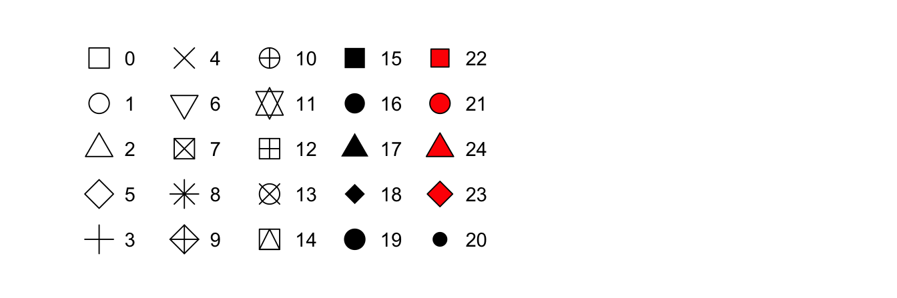

```{r setup, include = FALSE}
library(knitr)
library(kableExtra)
library(tidyverse)
library(NHSRtheme)
library(fontawesome)

# set default options
opts_chunk$set(echo = FALSE,
               fig.width = 7.252,
               fig.height = 4,
               comment = "#",
               dpi = 300)

knitr::knit_engines$set("markdown")

xaringanExtra::use_tile_view()
xaringanExtra::use_panelset()
xaringanExtra::use_clipboard()
xaringanExtra::use_webcam()
xaringanExtra::use_broadcast()
xaringanExtra::use_share_again()
xaringanExtra::style_share_again(
  share_buttons = c("twitter", "linkedin", "pocket")
)


xaringanExtra::use_extra_styles(
  hover_code_line = TRUE,         #<<
  mute_unhighlighted_code = F  #<<
)

# uncomment the following lines if you want to use the NHS-R theme colours by default
# scale_fill_continuous <- partial(scale_fill_nhs, discrete = FALSE)
# scale_fill_discrete <- partial(scale_fill_nhs, discrete = TRUE)
# scale_colour_continuous <- partial(scale_colour_nhs, discrete = FALSE)
# scale_colour_discrete <- partial(scale_colour_nhs, discrete = TRUE)
```

class: title-slide, left, bottom

# `r rmarkdown::metadata$title`
----
## **`r rmarkdown::metadata$subtitle`**
### `r rmarkdown::metadata$author`
### `r rmarkdown::metadata$date`

---
# Announcement

### <p style="color:#00449E">TA and Tutors</p>

- Teaching Assistant (TA): Emine Morris 
  - Major in Accounting
  - Minor in Data Analytics and Mathematics 


- TA Hours: 
  - Mondays and Wednesdays: 5:00 PM-6:30 PM 
  - Tuesdays and Thursdays: 3:00 PM-4:45 PM


- Where: Data Analytics Lab (South Hall, 3rd Floor)


- Tutoring schedules are coming soon.

---
class: inverse, center, middle

# Workflow
<html><div style='float:left'></div><hr color='#EB811B' size=1px width=796px></html>

---
# Workflow
### <p style="color:#00449E"> Shortcuts for RStudio and RScript </p>

.pull-left[
**Mac**

- **command + shift + N** opens a new RScript.
- **command + return** runs a current line or selected lines.
- **command + shift + C** is the shortcut for # (commenting).
- **option + - ** is the shortcut for `<-`.
]

.pull-right[
**Windows**

- **Ctrl + Shift + N** opens a new RS-cript.
- **Ctrl + return** runs a current line or selected lines.
- **Ctrl + Shift + C** is the shortcut for # (commenting).
- **Alt + - ** is the shortcut for `<-`.
]


---
# Workflow

- **Home/End** moves the blinking cursor bar to the beginning/End of the line.
  - **Ctrl** (**command** for Mac Users) **+** `r fa("arrow-left")` / `r fa("arrow-right")` works too.


- **Ctrl** (**command** for Mac Users) **+ Z** undoes the previous action.
- **Ctrl** (**command** for Mac Users) **+ Shift + Z** redoes when undo is executed.


- **Ctrl** (**command** for Mac Users) **+ F** is useful when finding a phrase (and replace the phrase) in the RScript.


- **Ctrl** (**command** for Mac Users) **+ D** deletes a current line.


---
class: inverse, center, middle

# Management of Files, Directories, and Scripts
<html><div style='float:left'></div><hr color='#EB811B' size=1px width=796px></html>

---
# Management of Files and Directories
### <p style="color:#00449E"> Finding the path name of the file </p>

.panelset[

.panel[.panel-name[Windows 11]

- **Step 1.** Go to your folder using the File Explorer.
- **Step 2.** Right-click the file.
- **Step 3.** Click "Copy as path".
- **Step 4.** Paste the path name of the file to the R script (Ctrl+V).
- **Step 5.** 
  - *Option 1.* Replace backslash(`\`) with double-backslash(`\\`) in the path name.
  - *Option 2.* Replace backslash(`\`) with slash(`/`) in the path name.
]

 <!---->


.panel[.panel-name[Windows 10]

- **Step 1.** Go to your folder using the File Explorer.
- **Step 2.** Click the file.
- **Step 3.** Hold down the "Shift" key
- **Step 4.** Right-click the file.
- **Step 5.** Click "Copy as path".
- **Step 6.** Paste the path name of the file to the R script (Ctrl+V).
- **Step 7.** 
  - *Option 1.* Replace backslash(`\`) with double-backslash(`\\`) in the path name.
  - *Option 2.* Replace backslash(`\`) with slash(`/`) in the path name.
]

 <!---->

.panel[.panel-name[Mac]

- **Step 1.** Go to your folder using the Finder.
- **Step 2.** Right-click the file in the folder
- **Step 3.** Hold down the "option" key
- **Step 4.** Click "Copy 'PATH\_FOR\_YOUR\_FILE' as Pathname" from the menu.
- **Step 5.** Paste it to the R script (command+V).

] <!---->

] <!--end of panelset-->


---
class: inverse, center, middle

# Working with Data from Files
<html><div style='float:left'></div><hr color='#EB811B' size=1px width=796px></html>


---
# Working with Data from Files

- Step 1. Download the file, `tvshows.csv`, from the Files section in our Canvas.

- Step 2. In the code below, replace 'PATH_NAME_FOR_THE_FILE_tvshows.csv' with the path name for the file, `tvshows.csv`.

- Step 3. Run the following R code:

```r
tvshows <- read.table(
		'PATH_NAME_FOR_THE_FILE_tvshows.csv',
		sep = ',',
		header = TRUE,
		stringsAsFactor = TRUE )
View(uciCar)
```

---
# Working with Data from Files
### <p style="color:#00449E"> Examining data frame </p>

- `class()` tells you what kind of R object you have. 


- `dim()` shows how many rows and columns are in the data for `data.frame`.


- `head()` shows the top few rows of the data.


- `help()` provides the documentation for a class. 
  - Try `help(class(uciCar))`.
  
  
- `str()` gives us the structure for an object.


---
# Working with Data from Files
### <p style="color:#00449E"> Examining data frame </p>

- `summary()` provides a summary of almost any R object. 


- `skimr::skim()` provides a more detailed summary.
  - `skimr` is the package that provides the function `skim()`.
  
- `print()` prints all the data. 
  - Note: for large datasets, this can take a very long time and is something you want to avoid.
  
- `View()` displays the data in a simple spreadsheet-like grid viewer.

- `dplyr::glimpse()` displays brief information about the data.


---
# Working with Data from Files
### <p style="color:#00449E"> Examining data frame </p>

```r
print(tvshows)

class(tvshows)
dim(tvshows)
head(tvshows)
help(class(tvshows))
str(tvshows)

summary(tvshows)
library(tvshows)
skim(tvshows)

library(tidyverse)  # library(dplyr) if tidyverse is not available
glimpse(tvshows)
```


---
class: inverse, center, middle

# Data Visualization with `ggplot()`
<html><div style='float:left'></div><hr color='#EB811B' size=1px width=796px></html>


---
# Exploratory Data Analysis

```{r, echo=FALSE, out.width = '40%', fig.align='center'}
knitr::include_graphics("../lec_figs/data-science-explore.png")
```

- In data visualization, you'll learn the basic structure of a `ggplot` plot. It turns data into plots.
  
- In data transformation, you'll learn the key verbs that allow you to select important variables, filter out key observations, create new variables, and compute summaries.

- In **exploratory data analysis**, you'll combine visualization and transformation with your curiosity and skepticism to ask and answer interesting questions about data.


---
# Data Visualization - First Steps

```r
library(tidyverse)   # library(ggplot2) if tidyverse is not available
mpg
?mpg
```

- The `mpg` data frame, provided by `ggplot2`, contains observations collected by the US Environmental Protection Agency on 38 models of car.

- Q. Do cars with big engines use more fuel than cars with small engines?
  - `displ`: a car's engine size, in liters.
  - `hwy`: a car's fuel efficiency on the highway, in miles per gallon (mpg). 


---
# Data Visualization - First Steps
### <p style="color:#00449E"> Creating a `ggplot` </p>

-  What does the relationship between engine size and fuel efficiency look like?

  - To plot `mpg`, run the following code to put `displ` on the `x`-axis and `hwy` on the `y`-axis:

```r
ggplot(data = mpg) + 
  geom_point(mapping = aes(x = displ, y = hwy))
```


---
# Data Visualization - First Steps
### <p style="color:#00449E"> Graphing Template </p>
- To make a ggplot plot, replace the bracketed sections in the code below with a `data.frame`, a `geom` function, or a collection of mappings such as `x = VAR_1` and `y = VAR_2`.

```r
ggplot(data = <DATA>) + 
  <GEOM_FUNCTION>(mapping = aes(<MAPPINGS>))
```


---
# Data Visualization - First Steps
### <p style="color:#00449E"> Exercises </p>

- Run `ggplot(data = mpg)`. What do you see?
```r
ggplot(data = mpg)
```

- How many rows are in `mpg`? How many columns?

- What does the `drv` variable describe? Read the help for `?mpg` to find out.

- Make a scatterplot of `hwy` vs. `cyl`.

- What happens if you make a scatterplot of `class` vs. `drv`? Why is the plot not useful?


---
class: inverse, center, middle

# Aesthetic Mappings
<html><div style='float:left'></div><hr color='#EB811B' size=1px width=796px></html>

---
# Aesthetic Mappings

- In the plot below, one group of points (highlighted in red) seems to fall outside of the linear trend. 

```{r, echo=FALSE, out.width = '50%', fig.align='center'}
knitr::include_graphics("../lec_figs/r4s_330_1.png")
```

  - How can you explain these cars? Are those hybrids?


---
# Aesthetic Mappings

- An aesthetic is a visual property (e.g., `size`, `shape`, `color`) of the objects (e.g., `class`) in your plot.

- You can display a point in different ways by changing the values of its aesthetic properties. 


```{r, echo=FALSE, out.width = '50%', fig.align='center'}
knitr::include_graphics("../lec_figs/r4s_330_2.png")
```


---
# Aesthetic Mappings
### <p style="color:#00449E"> Adding a `color` to the plot </p>


```{r, echo = T, eval = F}
ggplot(data = mpg) + 
  geom_point(mapping = aes(x = displ, y = hwy, 
*                          color = class) )
```


--
### <p style="color:#00449E"> Adding a `shape` to the plot </p>

```{r, echo = T, eval = F}

ggplot(data = mpg) + 
  geom_point(mapping = aes(x = displ, y = hwy, 
*                          shape = class) )
```


---
# Aesthetic Mappings
### <p style="color:#00449E"> Adding a `size` to the plot </p>


```{r, echo = T, eval = F}
ggplot(data = mpg) + 
  geom_point(mapping = aes(x = displ, y = hwy, 
*                          size = class) )
```


--
### <p style="color:#00449E"> Adding an `alpha` (transparency) to the plot </p>


```{r, echo = T, eval = F}
ggplot(data = mpg) + 
  geom_point(mapping = aes(x = displ, y = hwy, 
*                          alpha = class) )
```


---
# Aesthetic Mappings
### <p style="color:#00449E"> Discrete vs. Continuous Variables </p>

<!-- - A **variable** is a quantity whose value changes.  -->


- A **discrete variable** is a variable whose value is obtained by *counting*.
  - Number of students present
  - Number of red marbles in a jar
  - Number of heads when flipping three coins 
  - Students’ grade level


- A **continuous variable** is a variable whose value is obtained by *measuring*.
  - Height of students in class
  - Weight of students in class
  - Time it takes to get to school
  - Distance traveled between classes


---
# Aesthetic Mappings
### <p style="color:#00449E"> Specifying a `color` to the plot </p>

```{r, echo = T, eval = F}
ggplot(data = mpg) + 
  geom_point(mapping = aes(x = displ, y = hwy), 
*            color = "blue")
```


---
# Aesthetic Mappings

- To set an aesthetic manually, set the aesthetic by name as an argument of your `geom_` function; i.e. it goes outside of `aes()`. 

  - You'll need to pick a level that makes sense for that aesthetic:

    - The name of a `color` as a *character string*.
  
    - The `size` of a point in *mm*.
  
    - The `shape` of a point as a *number*, as shown below.
  
```{r, echo=FALSE, out.width = '60%', fig.align='center'}

```


---
# Aesthetic Mappings
### <p style="color:#00449E"> Specifying a `color` to the plot? </p>

```{r, echo = T, eval = F}
ggplot(data = mpg) + 
  geom_point( mapping = aes(x = displ, y = hwy, 
*                           color = "blue") )
```


---
# Common problems in ggplot()

- One common problem when creating `ggplot2` graphics is to put the `+` in the wrong place.

```{r, echo = T, eval = F}
ggplot(data = mpg) 
*+ geom_point( mapping = aes(x = displ, y = hwy) )
```


---
# Aesthetic Mappings
### <p style="color:#00449E"> Exercises </p>

- Which variables in mpg are categorical? Which variables are continuous? (Hint: type `?mpg` to read the documentation for the dataset). How can you see this information when you run `mpg`?

- Map a continuous variable to `color`, `size`, and `shape.` How do these aesthetics behave differently for categorical vs. continuous variables?

---
# Aesthetic Mappings
### <p style="color:#00449E"> Exercises </p>

- What happens if you map the same variable to multiple aesthetics?

- What does the stroke aesthetic do? What shapes does it work with? (Hint: use `?geom_point`)

- What happens if you map an aesthetic to something other than a variable name, like `aes(color = displ < 5)`? (Note, you'll also need to specify `x` and `y`).


---
class: inverse, center, middle

# Facets
<html><div style='float:left'></div><hr color='#EB811B' size=1px width=796px></html>


---
# Facets 

- One way to add a variable, particularly useful for categorical variables, is to use **facets** to split your plot into facets, subplots that each display one subset of the data.

- To facet your plot by a single variable, use `facet_wrap()`.

```{r, echo = T, eval = F}
ggplot(data = mpg) + 
  geom_point(mapping = aes(x = displ, y = hwy)) + 
* facet_wrap(~ class, nrow = 2)
```


---
# Facets 

- To facet your plot on the combination of two variables, add `facet_grid()` to your plot call.

- The first argument of `facet_grid()` is also a formula. This time the formula should contain two variable names separated by a `~`.

```{r, echo = T, eval = F}
ggplot(data = mpg) + 
  geom_point(mapping = aes(x = displ, y = hwy)) + 
* facet_grid(drv ~ cyl)
```


---
# Facets
### <p style="color:#00449E"> Exercises </p>

- What happens if you facet on a continuous variable?

- What do the empty cells in plot with `facet_grid(drv ~ cyl)` mean? How do they relate to this plot?
```{r, echo = T, eval = F}
ggplot(data = mpg) + 
  geom_point(mapping = aes(x = drv, y = cyl))
```


- What plots does the following code make? What does `.` do?
```{r, echo = T, eval = F}
ggplot(data = mpg) + 
  geom_point(mapping = aes(x = displ, y = hwy)) +
* facet_grid(drv ~ .)

ggplot(data = mpg) + 
  geom_point(mapping = aes(x = displ, y = hwy)) +
* facet_grid(drv ~ .)

ggplot(data = mpg) + 
  geom_point(mapping = aes(x = displ, y = hwy)) +
* facet_grid(. ~ cyl)
```


---
# Facets
### <p style="color:#00449E"> Exercises </p>

- Take the first faceted plot in this section:
```{r, echo = T, eval = F}

ggplot(data = mpg) + 
  geom_point(mapping = aes(x = displ, y = hwy)) + 
  facet_wrap(~ class, nrow = 2)
```
  - What are the advantages to using faceting instead of the color aesthetic? What are the disadvantages? How might the balance change if you had a larger dataset?


---
# Facets
### <p style="color:#00449E"> Exercises </p>

- Read `?facet_wrap`. What does `nrow` do? What does `ncol` do? What other options control the layout of the individual panels? Why doesn’t `facet_grid()` have `nrow` and `ncol` arguments?

- When using `facet_grid`, you should usually put the variable with more unique levels in the columns. Why?


---
# Aesthetic Mappings and Facets
### <p style="color:#00449E"> Exercises </p>

- Use the following data.frame.

```r
tvshows_web <- read.table(
		'https://bcdanl.github.io/data/tvshows.csv',
		sep = ',',
		header = TRUE,
		stringsAsFactor = TRUE)
```

- Describe the relationship between audience size (`GRP`) and audience engagement (`PE`) using `ggplot`. Explain the relationship in words. 

