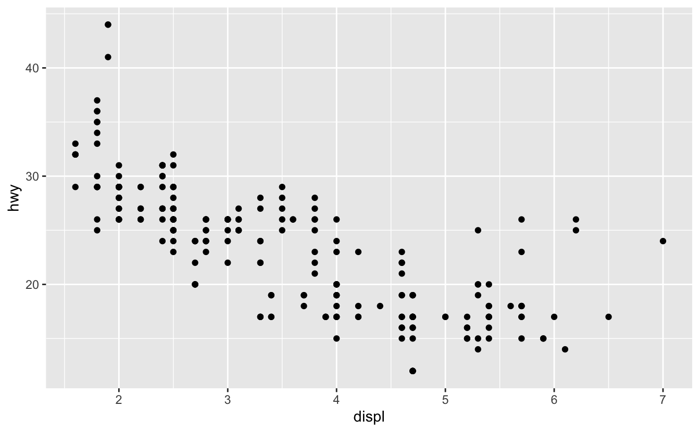

```{r setup, include = FALSE}
library(knitr)
library(kableExtra)
library(tidyverse)
library(NHSRtheme)
library(fontawesome)

# set default options
opts_chunk$set(echo = FALSE,
               fig.width = 7.252,
               fig.height = 4,
               comment = "#",
               dpi = 300)

knitr::knit_engines$set("markdown")

xaringanExtra::use_tile_view()
xaringanExtra::use_panelset()
xaringanExtra::use_clipboard()
xaringanExtra::use_webcam()
xaringanExtra::use_broadcast()
xaringanExtra::use_share_again()
xaringanExtra::style_share_again(
  share_buttons = c("twitter", "linkedin", "pocket")
)


xaringanExtra::use_extra_styles(
  hover_code_line = TRUE,         #<<
  mute_unhighlighted_code = F  #<<
)

# uncomment the following lines if you want to use the NHS-R theme colours by default
# scale_fill_continuous <- partial(scale_fill_nhs, discrete = FALSE)
# scale_fill_discrete <- partial(scale_fill_nhs, discrete = TRUE)
# scale_colour_continuous <- partial(scale_colour_nhs, discrete = FALSE)
# scale_colour_discrete <- partial(scale_colour_nhs, discrete = TRUE)
```

class: title-slide, left, bottom

# `r rmarkdown::metadata$title`
----
## **`r rmarkdown::metadata$subtitle`**
### `r rmarkdown::metadata$author`
### `r rmarkdown::metadata$date`


---
# Announcement

### <p style="color:#00449E">Accounting Expo</p>

- Are you interested in learning about Accounting, Consulting, Audit or Tax?
  - Stop in for pizza and meet 20+ Firms (alumni and employers) from the Big 4, National Players and Regional firms!


- When? September 15th, 5:00 PM-7:00 PM


- Where? Ballroom


- Dress code? Business Casual

  

---
class: inverse, center, middle

# Workflow
<html><div style='float:left'></div><hr color='#EB811B' size=1px width=796px></html>

---
# Workflow
### <p style="color:#00449E"> Shortcuts for RStudio and RScript </p>

.pull-left[
**Mac**

- **command + shift + N** opens a new RScript.
- **command + return** runs a current line or selected lines.
- **command + shift + C** is the shortcut for # (commenting).
- **option + - ** is the shortcut for `<-`.
]

.pull-right[
**Windows**

- **Ctrl + Shift + N** opens a new RS-cript.
- **Ctrl + return** runs a current line or selected lines.
- **Ctrl + Shift + C** is the shortcut for # (commenting).
- **Alt + - ** is the shortcut for `<-`.
]


---
# Workflow

- **Home/End** moves the blinking cursor bar to the beginning/End of the line.
  - **Ctrl** (**command/fn** for Mac Users) **+** `r fa("arrow-left")` / `r fa("arrow-right")` works too.


- **PgUp/PgDn** moves the blinking cursor bar to the top/bottom line of the script on the screen. 
  - **Fn + ** `r fa("arrow-up")` / `r fa("arrow-down")` works too.


- **Ctrl** (**command** for Mac Users) **+ Z** undoes the previous action.
- **Ctrl** (**command** for Mac Users) **+ Shift + Z** redoes when undo is executed.


- **Ctrl** (**command** for Mac Users) **+ F** is useful when finding a phrase (and replace the phrase) in the RScript.


- **Ctrl** (**command** for Mac Users) **+ D** deletes a current line.


---
class: inverse, center, middle

# Data Visualization with `ggplot()`
<html><div style='float:left'></div><hr color='#EB811B' size=1px width=796px></html>


---
# Data Visualization - First Steps
### <p style="color:#00449E"> Graphing Template </p>
- To make a ggplot plot, replace the bracketed sections in the code below with a `data.frame`, a `geom` function, or a collection of mappings such as `x = VAR_1` and `y = VAR_2`.

```r
ggplot(data = <DATA>) + 
  <GEOM_FUNCTION>(mapping = aes(<MAPPINGS>))
```


---
# Aesthetic Mappings
### <p style="color:#00449E"> Adding an `alpha` (transparency) to the plot </p>


```{r, echo = T, eval = F}
ggplot(data = mpg) + 
  geom_point(mapping = aes(x = displ, y = hwy),
*            alpha = .25 )
```

- Why is specifying a level of `alpha` $\in[0, 1]$ in a scatter plot often a good option?


---
# Aesthetic Mappings
### <p style="color:#00449E"> Discrete vs. Continuous Variables </p>

<!-- - A **variable** is a quantity whose value changes.  -->


- A **discrete variable** is a variable whose value is obtained by *counting*.
  - Number of students present
  - Number of red marbles in a jar
  - Number of heads when flipping three coins 
  - Students’ grade level


- A **continuous variable** is a variable whose value is obtained by *measuring*.
  - Height of students in class
  - Weight of students in class
  - Time it takes to get to school
  - Distance traveled between classes


---
# Aesthetic Mappings
### <p style="color:#00449E"> Exercises </p>

- Which variables in `mpg` are categorical? Which variables are continuous? (Hint: type `?mpg` to read the documentation for the dataset). How can you see this information when you run `mpg`?


---
# Aesthetic Mappings
### <p style="color:#00449E"> Specifying a `color` to the plot </p>

```{r, echo = T, eval = F}
ggplot(data = mpg) + 
  geom_point(mapping = aes(x = displ, y = hwy), 
*            color = "blue")
```


--
### <p style="color:#00449E"> Specifying a `color` to the plot? </p>

```{r, echo = T, eval = F}
ggplot(data = mpg) + 
  geom_point( mapping = aes(x = displ, y = hwy, 
*                           color = "blue") )
```


---
class: inverse, center, middle

# Facets
<html><div style='float:left'></div><hr color='#EB811B' size=1px width=796px></html>


---
# Facets 

- One way to add a variable, particularly useful for categorical variables, is to use **facets** to split your plot into facets, subplots that each display one subset of the data.

- To facet your plot by a single variable, use `facet_wrap()`.

```{r, echo = T, eval = F}
ggplot(data = mpg) + 
  geom_point(mapping = aes(x = displ, y = hwy)) + 
* facet_wrap(~ class, nrow = 2)
```


---
# Facets 

- To facet your plot on the combination of two variables, add `facet_grid()` to your plot call.

- The first argument of `facet_grid()` is also a formula. This time the formula should contain two variable names separated by a `~`.

```{r, echo = T, eval = F}
ggplot(data = mpg) + 
  geom_point(mapping = aes(x = displ, y = hwy)) + 
* facet_grid(drv ~ cyl)
```


---
# Facets
### <p style="color:#00449E"> Exercises </p>

- What happens if you facet on a continuous variable?


- Take the first faceted plot in this section:
```{r, echo = T, eval = F}

ggplot(data = mpg) + 
  geom_point(mapping = aes(x = displ, y = hwy)) + 
  facet_wrap(~ class, nrow = 2)
```
  - What are the advantages to using faceting instead of the color aesthetic? What are the disadvantages? How might the balance change if you had a larger dataset?


---
# Aesthetic Mappings and Facets
### <p style="color:#00449E"> Exercises </p>

- Use the following data.frame.

```r
tvshows_web <- read_csv(
		'https://bcdanl.github.io/data/tvshows.csv')
```

- Describe the relationship between audience size (`GRP`) and audience engagement (`PE`) using `ggplot`. Explain the relationship in words. 


---
class: inverse, center, middle

# Geometric Objects
<html><div style='float:left'></div><hr color='#EB811B' size=1px width=796px></html>


---
# Geometric Objects

How are these two plots similar?

.pull-left[
```{r, echo=FALSE, out.width = '100%', fig.align='center'}

```
]

.pull-right[
```{r, echo=FALSE, out.width = '100%', fig.align='center'}
knitr::include_graphics("../lec_figs/r4s_360_2.png")
```
]


---
# Geometric Objects

- A `geom_*()` is the geometrical object that a plot uses to represent data.
  - Bar charts use `geom_bar()`;
  - Line charts use `geom_line()`; 
  - Boxplots use the `geom_boxplot()`; 
  - Scatterplots use the `geom_point()`; 
  - Fitted lines use the `geom_smooth()`;
  - and many more!

- We can use different `geom_*()` to plot the same data.


---
# Geometric Objects


- To change the geom in your plot, change the geom function that you add to `ggplot()`. 

.panelset[

.panel[.panel-name[Scatterplot]
.pull-left[
```{r, echo = T, eval = F}
ggplot(data = mpg) + 
  geom_point(mapping = 
               aes(x = displ, 
                   y = hwy))
```
]
.pull-right[
```{r, echo = F, eval = T}
ggplot(data = mpg) + 
  geom_point(mapping = 
               aes(x = displ, 
                   y = hwy))
```
]

] <!---->


.panel[.panel-name[Fitted lines]
.pull-left[
```{r, echo = T, eval = F}
ggplot(data = mpg) + 
  geom_smooth(mapping = 
                aes(x = displ, 
                    y = hwy))
```
]
.pull-right[
```{r, echo = F, eval = T, warning=F, message=F}
ggplot(data = mpg) + 
  geom_smooth(mapping = 
                aes(x = displ, 
                    y = hwy))
```
]

] <!---->


]


---
# Geometric Objects
### <p style="color:#00449E"> `geom_*()` Functions and Aesthetic mappings </p>


- Every `geom_*()` function  takes specific mapping arguments.

  - Not every aesthetic property works with every `geom_*()` function. 
  - For example, you can set the `shape` of a `geom_point()`, but you cannot set the `shape` of a `geom_smooth()`;
  - You could set the `linetype` of a `geom_smooth()`.


```{r, echo = T, eval = F}
ggplot( data = mpg ) + 
  geom_smooth( mapping = aes( x = displ, y = hwy, 
*                             linetype = drv) )
```


---
# Geometric Objects
### <p style="color:#00449E"> `geom_*()` functions and `group` aesthetic </p>

- You can set the `group` aesthetic to a *categorical variable* to draw multiple objects. 

- `ggplot2` will draw a separate object for each unique value of the grouping variable. 


```{r, echo = T, eval = F}
ggplot(data = mpg) +
  geom_smooth(mapping = aes(x = displ, y = hwy))
              
ggplot(data = mpg) +
  geom_smooth(mapping = aes(x = displ, y = hwy, 
*                           group = drv))
```

---
# Geometric Objects
### <p style="color:#00449E"> `geom_*()` functions and `group` aesthetic </p>

- In practice, `ggplot2` will automatically *group* the data for these `geoms` whenever you map an aesthetic to a discrete variable (as in the `linetype` example). 

```{r, echo = T, eval = F}
ggplot(data = mpg) +
  geom_smooth(
    mapping = aes(x = displ, y = hwy, 
*                 color = drv),
    show.legend = FALSE
  )
```


---
# Geometric Objects
### <p style="color:#00449E"> Multiple `geom_*()` functions </p>

- To display multiple geometric objects in the same plot, add multiple `geom_*()` functions to `ggplot()`:

```{r, echo = T, eval = F}
ggplot(data = mpg) + 
  geom_point(mapping = aes(x = displ, y = hwy)) +
  geom_smooth(mapping = aes(x = displ, y = hwy))
```


---
# Geometric Objects
### <p style="color:#00449E"> Multiple `geom_*()` functions </p>

- If you place mappings in a `geom_*()` function, `ggplot2` will treat them as local mappings for the layer. 

```{r, echo = T, eval = F}
ggplot(data = mpg, 
*      mapping = aes(x = displ, y = hwy)) + 
  geom_point(mapping = aes(color = class)) + 
  geom_smooth()
```


---
# Geometric Objects
### <p style="color:#00449E"> Multiple `geom_*()` functions </p>

- You can use the same idea to specify different data for each layer. 
- Here, our smooth line displays just a subset of the `mpg` dataset, the `subcompact` cars. 

- The local data argument in `geom_smooth()` overrides the global data argument in `ggplot()` for that layer only.

```{r, echo = T, eval = F}
ggplot(data = mpg, 
       mapping = aes(x = displ, y = hwy)) + 
  geom_point(mapping = aes(color = class)) + 
  geom_smooth(data = filter(mpg, class == "subcompact"), 
              se = FALSE)
```


---
class: inverse, center, middle

# Statistical Transformation
<html><div style='float:left'></div><hr color='#EB811B' size=1px width=796px></html>


---
# Statistical Transformations


- Bar charts seem simple, but they are interesting because they reveal something subtle about plots. 

- Consider a basic bar chart, as drawn with `geom_bar()`. 

- The following bar chart displays the total number of diamonds in the `ggplot2::diamonds` dataset, grouped by `cut`. 

```{r, echo = T, eval = F}
ggplot(data = diamonds) + 
  geom_bar(mapping = aes(x = cut))
```

- The `diamonds` dataset comes in `ggplot2` and contains information about ~54,000 diamonds, including the `price`, `carat`, `color`, `clarity`, and `cut` of each diamond. 


---
# Statistical Transformations


- Many graphs, including bar charts, calculate new values to plot:

  - `geom_bar()`, `geom_histogram()`, and `geom_freqpoly()` bin your data and then plot bin counts, the number of observations that fall in each bin.
  
  - `geom_smooth()` fits a model to your data and then plot predictions from the model.
  
  - `geom_boxplot()` compute a summary of the distribution and then display a specially formatted box.


---
# Statistical Transformations


- The algorithm used to calculate new values for a graph is called a `stat`, short for statistical transformation. 

- The figure below describes how this process works with `geom_bar()`.


```{r, echo=FALSE, out.width = '100%', fig.align='center'}
knitr::include_graphics("../lec_figs/r4s_370_1.png")
```


---
# Statistical Transformations
### <p style="color:#00449E"> Observed Value vs. Number of Observations
- There are three reasons you might need to use a `stat` explicitly:

  -  *1*. You might want to override the default `stat`. 

```{r, echo = T, eval = F}
demo <- tribble(         # for a simple data.frame
  ~cut,         ~freq,
  "Fair",       1610,
  "Good",       4906,
  "Very Good",  12082,
  "Premium",    13791,
  "Ideal",      21551 )

ggplot(data = demo) +
  geom_bar(mapping = aes(x = cut, y = freq), 
*          stat = "identity")
```


---
# Statistical Transformations
### <p style="color:#00449E"> Count vs. Proportion
- There are three reasons you might need to use a `stat` explicitly:

  - *2*. You might want to override the default mapping from transformed variables to aesthetics. 


```{r, echo = T, eval = F}
ggplot(data = diamonds) + 
  geom_bar(mapping = aes(x = cut, 
*                        y = stat(prop), 
*                        group = 1))
```


---
# Statistical Transformations
### <p style="color:#00449E"> Stat summary
- There are three reasons you might need to use a `stat` explicitly:

  - *3*. You might want to draw greater attention to the statistical transformation in your code.  


```{r, echo = T, eval = F}
ggplot(data = diamonds) + 
  stat_summary(
    mapping = aes(x = cut, y = depth),
    fun.min = min,
    fun.max = max,
    fun = median
  )
```


---
# Statistical Transformations
### <p style="color:#00449E"> Exercises

- What is the default geom associated with `stat_summary()`? How could you rewrite the previous plot to use that geom function instead of the stat function?

- What does `geom_col()` do? How is it different to `geom_bar()`?

- Most `geoms` and `stats` come in pairs that are almost always used in concert. Read through the documentation and make a list of all the pairs. What do they have in common?

- What variables does `stat_smooth()` compute? What parameters control its behavior?


---
# Statistical Transformations
### <p style="color:#00449E"> Exercises

- In our proportion bar chart, we need to set `group = 1`. Why? In other words what is the problem with these two graphs?

```{r, echo = T, eval = F}
ggplot(data = diamonds) + 
  geom_bar(mapping = aes(x = cut, y = stat(prop) ) )

ggplot(data = diamonds) + 
  geom_bar(mapping = aes(x = cut, y = stat(prop), 
*                        fill = color ) )
```


---
class: inverse, center, middle

# Position Adjustment
<html><div style='float:left'></div><hr color='#EB811B' size=1px width=796px></html>


---
# Position Adjustments
### <p style="color:#00449E"> `color` and `fill` aesthetic


- You can color a bar chart using either the `color` aesthetic, or, more usefully, `fill`:

.panelset[
.panel[.panel-name[`color`]

.pull-left[
```{r, echo = T, eval = F}
ggplot(data = diamonds) + 
  geom_bar(mapping = 
             aes(x = cut, 
*                [?] = cut))
```
]
.pull-right[
```{r, echo = F, eval = T}
ggplot(data = diamonds) + 
  geom_bar(mapping = aes(x = cut, 
                        color = cut))
```
]

]
.panel[.panel-name[`fill`]
.pull-left[
```{r, echo = T, eval = F}
ggplot(data = diamonds) + 
  geom_bar(mapping = 
             aes(x = cut, 
*                [?] = cut))
```
]
.pull-right[
```{r, echo = F, eval = T}
ggplot(data = diamonds) + 
  geom_bar(mapping = aes(x = cut, 
                        fill = cut))
```
]
]

]

---
# Position Adjustments
### <p style="color:#00449E"> Stacked bar charts with `fill` aesthetic


- Note that the bars are automatically stacked if you map the `fill` aesthetic to another variable.

.pull-left[
```{r, echo = T, eval = F}
ggplot(data = diamonds) + 
  geom_bar(mapping = 
             aes(x = cut, 
*                fill = clarity) )
```
]
.pull-right[
```{r, echo = F, eval = T}
ggplot(data = diamonds) + 
  geom_bar(mapping = aes(x = cut, 
                         fill = clarity) )
```
]


---
# Position Adjustments
### <p style="color:#00449E"> Stacked bar charts with `fill` aesthetic

- The `stack`ing is performed automatically by the **position adjustment** specified by the `position` argument. 

.pull-left[
```{r, echo = T, eval = F}
ggplot(data = diamonds) + 
  geom_bar(mapping = 
             aes(x = cut, 
                 fill = clarity),
*          position = "stack")
```
]
.pull-right[
```{r, echo = F, eval = T}
ggplot(data = diamonds) + 
  geom_bar(mapping = aes(x = cut, 
                        fill = clarity),
           position = "stack")
```
]


---
# Position Adjustments
### <p style="color:#00449E">  `position = "fill"` and `position = "dodge"`  

- If you don't want a stacked bar chart with counts, you can use one of two other `position` options: `fill` or `dodge`.


.panelset[

.panel[.panel-name[`position = "fill"`]

- `position = "fill"` works like stacking, but makes each set of stacked bars the same height. 

    - This makes it easier to compare proportions across groups.

```{r, echo = T, eval = F}
ggplot(data = diamonds) + 
  geom_bar(mapping = aes(x = cut, fill = clarity), position = [?])
```


] <!---->


.panel[.panel-name[`position = "dodge"`]

- `position = "dodge"` places overlapping objects directly beside one another. 

```{r, echo = T, eval = F}
ggplot(data = diamonds) + 
  geom_bar(mapping = aes(x = cut, fill = clarity), position = [?])
```

] <!---->

]

  

---
# Position Adjustments
### <p style="color:#00449E"> Overplotting and `position = "jitter"`

- The values of `hwy` and `displ` are rounded so the points appear on a grid and many points overlap each other. 
  - This problem is known as **overplotting**. 

- You can avoid the overlapping problem by setting the position adjustment to `jitter`. 
  - `position = "jitter"` adds a small amount of random noise to each point. 


```{r, echo = T, eval = F}
ggplot(data = mpg) + 
  geom_point(mapping = aes(x = displ, y = hwy), position = [?])
```


---
# Position Adjustments
### <p style="color:#00449E"> Exercises

- What is the problem with this plot? How could you improve it?

```{r, echo = T, eval = F}
ggplot(data = mpg, mapping = aes(x = cty, y = hwy)) + 
  geom_point()
```

- What parameters to `geom_jitter()` control the amount of jittering?

- Compare and contrast `geom_jitter()` with `geom_count()`.

- What’s the default position adjustment for `geom_boxplot()`? Create a visualization of the `mpg` dataset that demonstrates it.


---
class: inverse, center, middle

# Coordinate
<html><div style='float:left'></div><hr color='#EB811B' size=1px width=796px></html>


---
# Coordinate Systems

- The default coordinate system is the Cartesian coordinate system where the `x` and `y` positions act independently to determine the location of each point. 

- There are a number of other coordinate systems that are occasionally helpful.


---
# Coordinate Systems
### <p style="color:#00449E"> `coord_flip()`

- `coord_flip()` switches the `x` and `y` axes. 

- This is useful (for example), if you want horizontal boxplots. 

- It's also useful for long labels: it's hard to get them to fit without overlapping on the `x`-axis.

```{r, echo = T, eval = F}
ggplot(data = mpg, mapping = aes(x = class, y = hwy)) + 
  geom_boxplot()

ggplot(data = mpg, mapping = aes(x = class, y = hwy)) + 
  geom_boxplot() +
* coord_flip()
```


---
# Coordinate Systems
### <p style="color:#00449E"> `coord_quickmap()`

- `coord_quickmap()` sets the aspect ratio correctly for maps. 

```{r, echo = T, eval = F}
county <- map_data("county")   # Map data for US Counties
ny <- filter(county,      # We will discuss 'filter()' in the next chapter
             region == "new york")

ggplot(ny, aes(long, lat, group = group)) +
  geom_polygon(fill = "white", color = "black")

ggplot(ny, aes(long, lat, group = group)) +
  geom_polygon(fill = "white", color = "black") +
  coord_quickmap()
```


---
# Coordinate Systems
### <p style="color:#00449E"> Exercises

- What does `labs()` do? Read the documentation.

- What does the plot below tell you about the relationship between city and highway mpg? Why is `coord_fixed()` important? What does `geom_abline()` do?

```{r, echo = T, eval = F}
ggplot(data = mpg, mapping = aes(x = cty, y = hwy)) +
  geom_point() + 
  geom_abline() +
  coord_fixed()
```


---
class: inverse, center, middle

# `ggplot` grammar
<html><div style='float:left'></div><hr color='#EB811B' size=1px width=796px></html>


---
# The Layered Grammar of Graphics


- Let's add position adjustments, stats, coordinate systems, and faceting to our code template.


```{r, echo = T, eval = F}
ggplot(data = <DATA>) + 
  <GEOM_FUNCTION>(
     mapping = aes(<MAPPINGS>),
     stat = <STAT>, 
     position = <POSITION>) +
  <COORDINATE_FUNCTION> +
  <FACET_FUNCTION>
```

- The seven parameters---(1) a dataset, (2) a geom, (3) a set of mappings, (4) a stat, (5) a position adjustment, (6) a coordinate system, and (7) a faceting scheme---in the template compose the **grammar of graphics**, a formal system for building plots. 


