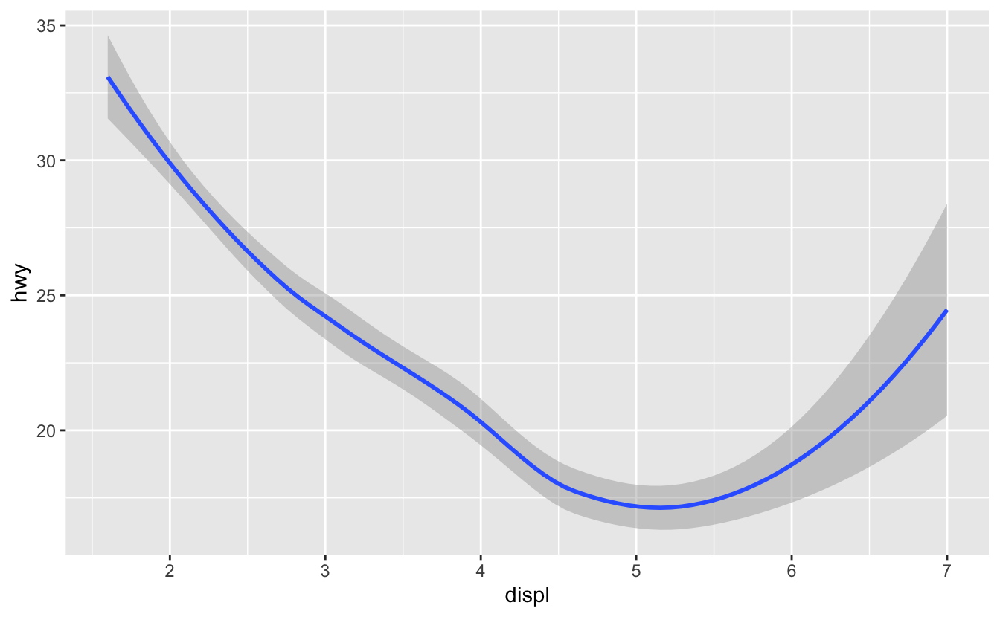

```{r setup, include = FALSE}
library(knitr)
library(kableExtra)
library(tidyverse)
library(NHSRtheme)
library(fontawesome)
# set default options
opts_chunk$set(echo = T, eval = F,
               fig.width = 7.252,
               fig.height = 4,
               comment = "#",
               dpi = 300)

knitr::knit_engines$set("markdown")

xaringanExtra::use_tile_view()
xaringanExtra::use_panelset()
xaringanExtra::use_clipboard()
xaringanExtra::use_webcam()
xaringanExtra::use_broadcast()
xaringanExtra::use_share_again()
xaringanExtra::style_share_again(
  share_buttons = c("twitter", "linkedin", "pocket")
)


xaringanExtra::use_extra_styles(
  hover_code_line = TRUE,         #<<
  mute_unhighlighted_code = TRUE  #<<
)

# uncomment the following lines if you want to use the NHS-R theme colours by default
# scale_fill_continuous <- partial(scale_fill_nhs, discrete = FALSE)
# scale_fill_discrete <- partial(scale_fill_nhs, discrete = TRUE)
# scale_colour_continuous <- partial(scale_colour_nhs, discrete = FALSE)
# scale_colour_discrete <- partial(scale_colour_nhs, discrete = TRUE)
```

class: title-slide, left, bottom

# `r rmarkdown::metadata$title`
----
## **`r rmarkdown::metadata$subtitle`**
### `r rmarkdown::metadata$author`
### `r rmarkdown::metadata$date`


---
# Announcement

### <p style="color:#00449E">Tutoring and TA Hours (Location: South 321 (DANL Lab)) </p>
.pull-left[
- Jack Gramlich ([jcg14@geneseo.edu](jcg14@geneseo.edu))
  - Friday 2:00 -- 4:00 pm
  - Saturday 2:00 -- 5:00 pm
  - Sunday 12:00 -- 3:00 pm
  

- Marcie Hogan ([mlh29@geneseo.edu](mlh29@geneseo.edu))
  - Sunday 2:00 -- 5:00 pm
]  
 
.pull-right[ 
- Emine Morris, TA ([ekm10@geneseo.edu](ekm10@geneseo.edu))
  - Saturday 1:00 – 3:00 pm
  
  
- Jason Rappazzo ([jjr18@geneseo.edu](jjr18@geneseo.edu))
  - Monday 9:00 – 11:30 am
  - Wednesday 9:00 – 11:30 am 
]  


---
class: inverse, center, middle

# Workflow
<html><div style='float:left'></div><hr color='#EB811B' size=1px width=796px></html>


---
# Workflow
### <p style="color:#00449E"> Shortcuts for RStudio and RScript </p>

.pull-left[
**Mac**

- **command + shift + N** opens a new RScript.
- **command + return** runs a current line or selected lines.
- **command + shift + C** is the shortcut for # (commenting).
- **option + - ** is the shortcut for `<-`.
]

.pull-right[
**Windows**

- **Ctrl + Shift + N** opens a new RS-cript.
- **Ctrl + return** runs a current line or selected lines.
- **Ctrl + Shift + C** is the shortcut for # (commenting).
- **Alt + - ** is the shortcut for `<-`.
]


---
class: inverse, center, middle

# Data Visualization with `ggplot()`
<html><div style='float:left'></div><hr color='#EB811B' size=1px width=796px></html>


---
# Data Visualization - First Steps
### <p style="color:#00449E"> Graphing Template </p>
- To make a ggplot plot, replace the bracketed sections in the code below with a `data.frame`, a `geom` function, or a collection of mappings such as `x = VAR_1` and `y = VAR_2`.

```r
ggplot(data = <DATA>) + 
  <GEOM_FUNCTION>(mapping = aes(<MAPPINGS>))
```


---
class: inverse, center, middle

# Aesthetic Mappings
<html><div style='float:left'></div><hr color='#EB811B' size=1px width=796px></html>


---
# Aesthetic Mappings
### <p style="color:#00449E"> Adding a `color` to the plot </p>


```{r, echo = T, eval = F}
ggplot(data = mpg) + 
  geom_point(mapping = aes(x = displ, y = hwy, 
*                          color = class) )
```


--
### <p style="color:#00449E"> Adding a `shape` to the plot </p>

```{r, echo = T, eval = F}

ggplot(data = mpg) + 
  geom_point(mapping = aes(x = displ, y = hwy, 
*                          shape = class) )
```


---
# Aesthetic Mappings
### <p style="color:#00449E"> Adding a `size` to the plot </p>


```{r, echo = T, eval = F}
ggplot(data = mpg) + 
  geom_point(mapping = aes(x = displ, y = hwy, 
*                          size = class) )
```


---
### <p style="color:#00449E"> Adding an `alpha` (transparency) to the plot </p>


```{r, echo = T, eval = F}
ggplot(data = mpg) + 
  geom_point(mapping = aes(x = displ, y = hwy, 
*                          alpha = class) )
```


---
# Aesthetic Mappings
### <p style="color:#00449E"> Specifying a `color` to the plot </p>

```{r, echo = T, eval = F}
ggplot(data = mpg) + 
  geom_point(mapping = aes(x = displ, y = hwy), 
*            color = "blue")
```


---
# Aesthetic Mappings
### <p style="color:#00449E"> Specifying a `color` to the plot? </p>

```{r, echo = T, eval = F}
ggplot(data = mpg) + 
  geom_point( mapping = aes(x = displ, y = hwy, 
*                           color = "blue") )
```


---
# Common problems in ggplot()

- One common problem when creating `ggplot2` graphics is to put the `+` in the wrong place.

```{r, echo = T, eval = F}
ggplot(data = mpg) 
*+ geom_point( mapping = aes(x = displ, y = hwy) )
```


---
# Aesthetic Mappings
### <p style="color:#00449E"> Exercises </p>

- Provide both (1) ggplot() and (2) comments to describe the relationship between GDP per capita and life expectancy using `gapminder` data.

```{r}
install.packages("gapminder")
library(gapminder)    
gapminder::gapminder # gapminder package has the gapminder data.frame.
```

- Provide both (1) ggplot() and (2) comments to describe how the relationship between GDP per capita and life expectancy varies by continent.


---
class: inverse, center, middle

# Facets
<html><div style='float:left'></div><hr color='#EB811B' size=1px width=796px></html>


---
# Facets 

- One way to add a variable, particularly useful for categorical variables, is to use **facets** to split our plot into facets, subplots that each display one subset of the data.

- To facet our plot by a single variable, use `facet_wrap()`.

```{r, echo = T, eval = F}
ggplot(data = mpg) + 
  geom_point(mapping = aes(x = displ, y = hwy)) + 
* facet_wrap( . ~ class, nrow = 2)
```


---
# Facets 

- To facet our plot on the combination of two variables, add `facet_grid()` to our plot call.

- The first argument of `facet_grid()` is also a formula. This time the formula should contain two variable names separated by a `~`.

```{r, echo = T, eval = F}
ggplot(data = mpg) + 
  geom_point(mapping = aes(x = displ, y = hwy)) + 
* facet_grid(drv ~ cyl)
```


---
# Facets
### <p style="color:#00449E"> Exercises </p>

- What happens if you facet on a continuous variable?

- What do the empty cells in plot with `facet_grid(drv ~ cyl)` mean? How do they relate to this plot?
```{r, echo = T, eval = F}
ggplot(data = mpg) + 
  geom_point(mapping = aes(x = drv, y = cyl))
```


- What plots does the following code make? What does `.` do?
```{r, echo = T, eval = F}
ggplot(data = mpg) + 
  geom_point(mapping = aes(x = displ, y = hwy)) +
* facet_grid(drv ~ .)

ggplot(data = mpg) + 
  geom_point(mapping = aes(x = displ, y = hwy)) +
* facet_grid(drv ~ .)

ggplot(data = mpg) + 
  geom_point(mapping = aes(x = displ, y = hwy)) +
* facet_grid(. ~ cyl)
```


---
# Facets
### <p style="color:#00449E"> Exercises </p>

- Take the first faceted plot in this section:
```{r, echo = T, eval = F}

ggplot(data = mpg) + 
  geom_point(mapping = aes(x = displ, y = hwy)) + 
  facet_wrap(~ class, nrow = 2)
```
  - What are the advantages to using faceting instead of the color aesthetic? What are the disadvantages? How might the balance change if you had a larger dataset?


---
# Facets
### <p style="color:#00449E"> Exercises </p>

- Read `?facet_wrap`. What does `nrow` do? What does `ncol` do? What other options control the layout of the individual panels? Why doesn’t `facet_grid()` have `nrow` and `ncol` arguments?

- When using `facet_grid`, you should usually put the variable with more unique levels in the columns. Why?


---
# Aesthetic Mappings and Facets
### <p style="color:#00449E"> Exercises </p>

- Use the following data.frame.

```{r}
tvshows_web <- read_csv(
		'https://bcdanl.github.io/data/tvshows.csv')
```

- Describe the relationship between audience size (`GRP`) and audience engagement (`PE`) using `ggplot`. Explain the relationship in words. 


---
# Aesthetic Mappings and Facets
### <p style="color:#00449E"> Exercises </p>

- Provide both (1) ggplot() and (2) comments to describe how the relationship between GDP per capita and life expectancy varies by continent.

```{r} 
gapminder::gapminder #  the gapminder data.frame from the gapminder package.
```


---
class: inverse, center, middle

# Geometric Objects
<html><div style='float:left'></div><hr color='#EB811B' size=1px width=796px></html>


---
# Geometric Objects

How are these two plots similar?

.pull-left[
```{r, echo=FALSE, out.width = '100%', fig.align='center'}
knitr::include_graphics("../lec_figs/r4s_360_1.png")
```
]

.pull-right[
```{r, echo=FALSE, out.width = '100%', fig.align='center'}

```
]


---
# Geometric Objects

- A `geom_*()` is the geometrical object that a plot uses to represent data.
  - Bar charts use `geom_bar()`;
  - Line charts use `geom_line()`; 
  - Boxplots use the `geom_boxplot()`; 
  - Scatterplots use the `geom_point()`; 
  - Fitted lines use the `geom_smooth()`;
  - and many more!

- We can use different `geom_*()` to plot the same data.


---
# Geometric Objects


- To change the geom in our plot, change the geom function that we add to `ggplot()`. 

.panelset[

.panel[.panel-name[Scatterplot]
.pull-left[
```{r, echo = T, eval = F}
ggplot(data = mpg) + 
  geom_point(mapping = 
               aes(x = displ, 
                   y = hwy))
```
]
.pull-right[
```{r, echo = F, eval = T}
ggplot(data = mpg) + 
  geom_point(mapping = 
               aes(x = displ, 
                   y = hwy))
```
]

] <!---->


.panel[.panel-name[Fitted lines]
.pull-left[
```{r, echo = T, eval = F}
ggplot(data = mpg) + 
  geom_smooth(mapping = 
                aes(x = displ, 
                    y = hwy))
```
]
.pull-right[
```{r, echo = F, eval = T, warning=F, message=F}
ggplot(data = mpg) + 
  geom_smooth(mapping = 
                aes(x = displ, 
                    y = hwy))
```
]

] <!---->


]


---
# Geometric Objects


- Every geom function in `ggplot2` takes a mapping argument.

- However, not every aesthetic works with every `geom`. 
  - We could set the `shape` of a point, but you couldn't set the `shape` of a line;
  - We could set the `linetype` of a line.


```{r, echo = T, eval = F}
ggplot( data = mpg ) + 
  geom_smooth( mapping = aes( x = displ, y = hwy, 
*                             linetype = drv) )
```


---
# Geometric Objects
- We can set the `group` aesthetic to a *categorical variable* to draw multiple objects. 

- `ggplot2` will draw a separate object for each unique value of the grouping variable. 


```{r, echo = T, eval = F}
ggplot(data = mpg) +
  geom_smooth(mapping = aes(x = displ, y = hwy))
              
ggplot(data = mpg) +
  geom_smooth(mapping = aes(x = displ, y = hwy, 
*                           group = drv))
```

---
# Geometric Objects
- In practice, `ggplot2` will automatically group the data for these `geoms` whenever we map an aesthetic to a discrete variable (as in the `linetype` example). 

```{r, echo = T, eval = F}
ggplot(data = mpg) +
  geom_smooth(
    mapping = aes(x = displ, y = hwy, 
*                 color = drv),
    show.legend = FALSE
  )
```


---
# Geometric Objects

- To display multiple geometric objects in the same plot, add multiple `geom_*()` functions to `ggplot()`:

```{r, echo = T, eval = F}
ggplot(data = mpg) + 
  geom_point(mapping = aes(x = displ, y = hwy)) +
  geom_smooth(mapping = aes(x = displ, y = hwy))
```


---
# Geometric Objects

- If we place mappings in a geom function, `ggplot2` will treat them as local mappings for the layer. 

```{r, echo = T, eval = F}
ggplot(data = mpg, 
*      mapping = aes(x = displ, y = hwy)) + 
  geom_point(mapping = aes(color = class)) + 
  geom_smooth()
```


---
# Geometric Objects

- We can use the same idea to specify different data for each layer. 
- Here, our smooth line displays just a subset of the `mpg` dataset, the `subcompact` cars. 

- The local data argument in `geom_smooth()` overrides the global data argument in `ggplot()` for that layer only.

```{r, echo = T, eval = F}
ggplot(data = mpg, 
       mapping = aes(x = displ, y = hwy)) + 
  geom_point(mapping = aes(color = class)) + 
  geom_smooth(data = filter(mpg, class == "subcompact"), 
              se = FALSE)
```


---
# Geometric Objects
### <p style="color:#00449E"> Exercises </p>

- Recreate the R code necessary to generate the following graphs.
.pull-left[
```{r, echo = F, eval = T, warning = F, message= F}
library(ggplot2)
ggplot(mpg, aes(x = displ, y = hwy)) +
  geom_point() + geom_smooth()
```
]
.pull-right[
```{r, echo = F, eval = T, warning = F, message= F}
library(ggplot2)
ggplot(mpg, aes(x = displ, y = hwy)) +
  geom_point() + geom_smooth(aes(group = drv)) +
  theme_grey()
```
]


---
# Geometric Objects
### <p style="color:#00449E"> Class Exercises </p>

- Recreate the R code necessary to generate the following graphs.
.pull-left[
```{r, echo = F, eval = T, warning = F, message= F}
library(ggplot2)
ggplot(mpg, aes(x = displ, y = hwy, color = drv)) +
  geom_point() + geom_smooth(se = F) +
  theme_grey()
```
]
.pull-right[
```{r, echo = F, eval = T, warning = F, message= F}
library(ggplot2)
ggplot(mpg, aes(x = displ, y = hwy)) +
  geom_point(aes(color = drv)) + geom_smooth(se = F) +
  theme_grey()
```
]


---
# Geometric Objects
### <p style="color:#00449E"> Class Exercises </p>

- Recreate the R code necessary to generate the following graphs.
.pull-left[
```{r, echo = F, eval = T, warning = F, message= F}
library(ggplot2)
ggplot(mpg, aes(x = displ, y = hwy, color = drv)) +
  geom_point(aes(color = drv)) + geom_smooth(aes(lty = drv), se = F) +
  theme_grey()
```
]
.pull-right[
```{r, echo = F, eval = T, warning = F, message= F}
library(ggplot2)
ggplot(mpg, aes(x = displ, y = hwy)) +
  geom_point(color = 'white', size = 4) + geom_point(aes(color = drv)) +
  theme_grey()
```
]

---
class: inverse, center, middle

# Statistical Transformation
<html><div style='float:left'></div><hr color='#EB811B' size=1px width=796px></html>


---
# Statistical Transformations


- Bar charts seem simple, but they are interesting because they reveal something subtle about plots. 

- Consider a basic bar chart, as drawn with `geom_bar()`. 

- The following bar chart displays the total number of diamonds in the `ggplot2::diamonds` dataset, grouped by `cut`. 

```{r, echo = T, eval = F}
ggplot(data = diamonds) + 
  geom_bar(mapping = aes(x = cut))
```

- The `diamonds` dataset comes in `ggplot2` and contains information about ~54,000 diamonds, including the `price`, `carat`, `color`, `clarity`, and `cut` of each diamond. 


---
# Statistical Transformations


- Many graphs, including bar charts, calculate new values to plot:

  - `geom_bar()`, `geom_histogram()`, and `geom_freqpoly()` bin our data and then plot bin counts, the number of observations that fall in each bin.
  
  - `geom_smooth()` fits a model to our data and then plot predictions from the model.
  
  - `geom_boxplot()` compute a summary of the distribution and then display a specially formatted box.


---
# Statistical Transformations


- The algorithm used to calculate new values for a graph is called a `stat`, short for statistical transformation. 

- The figure below describes how this process works with `geom_bar()`.


```{r, echo=FALSE, out.width = '100%', fig.align='center'}
knitr::include_graphics("../lec_figs/r4s_370_1.png")
```


---
# Statistical Transformations
### <p style="color:#00449E"> Observed Value vs. Number of Observations
- There are three reasons we might need to use a `stat` explicitly:

  -  *1*. We might want to override the default stat. 

```{r, echo = T, eval = F}
demo <- tribble(         # for a simple data.frame
  ~cut,         ~freq,
  "Fair",       1610,
  "Good",       4906,
  "Very Good",  12082,
  "Premium",    13791,
  "Ideal",      21551 )

ggplot(data = demo) +
  geom_bar(mapping = aes(x = cut, y = freq), 
*          stat = "identity")
```


---
# Statistical Transformations
### <p style="color:#00449E"> Count vs. Proportion
- There are three reasons we might need to use a `stat` explicitly:

  - *2*. We might want to override the default mapping from transformed variables to aesthetics. 


```{r, echo = T, eval = F}
ggplot(data = diamonds) + 
  geom_bar(mapping = aes(x = cut, y = stat(prop), 
*                        group = 1))
```


---
# Statistical Transformations
### <p style="color:#00449E"> Stat summary
- There are three reasons we might need to use a `stat` explicitly:

  - *3*. We might want to draw greater attention to the statistical transformation in our code.  


```{r, echo = T, eval = F}
ggplot(data = diamonds) + 
  stat_summary(
    mapping = aes(x = cut, y = depth),
    fun.min = min,
    fun.max = max,
    fun = median
  )
```


---
# Statistical Transformations
### <p style="color:#00449E"> Exercises

- What is the default geom associated with `stat_summary()`? How could you rewrite the previous plot to use that geom function instead of the stat function?

- What does `geom_col()` do? How is it different to `geom_bar()`?

- Most `geoms` and `stats` come in pairs that are almost always used in concert. Read through the documentation and make a list of all the pairs. What do they have in common?

- What variables does `stat_smooth()` compute? What parameters control its behavior?


---
# Statistical Transformations
### <p style="color:#00449E"> Exercises

- In our proportion bar chart, we need to set `group = 1`. Why? In other words what is the problem with these two graphs?

```{r, echo = T, eval = F}
ggplot(data = diamonds) + 
  geom_bar(mapping = aes(x = cut, y = stat(prop) ) )

ggplot(data = diamonds) + 
  geom_bar(mapping = aes(x = cut, y = stat(prop), 
*                        fill = color ) )
```


