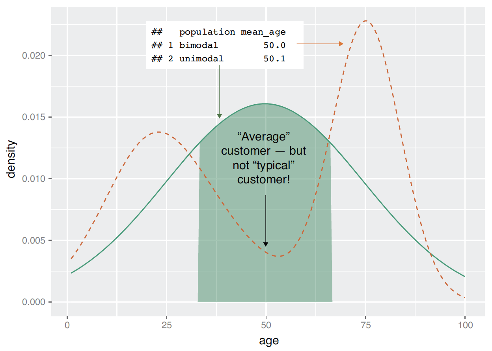
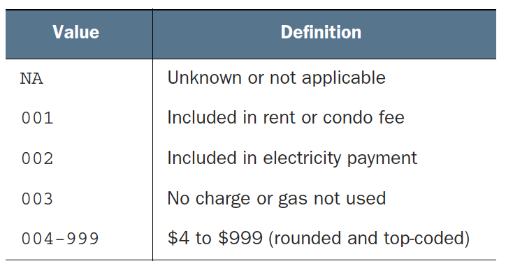
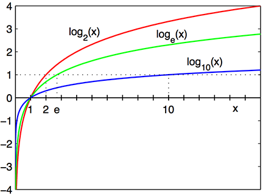

```{r setup, include = FALSE}
library(knitr)
library(kableExtra)
library(tidyverse)
library(NHSRtheme)
library(fontawesome)

# set default options
opts_chunk$set(echo = FALSE,
               fig.width = 7.252,
               fig.height = 4,
               comment = "#",
               dpi = 300)

knitr::knit_engines$set("markdown")

xaringanExtra::use_tile_view()
xaringanExtra::use_panelset()
xaringanExtra::use_clipboard()
xaringanExtra::use_webcam()
xaringanExtra::use_broadcast()
xaringanExtra::use_share_again()
xaringanExtra::style_share_again(
  share_buttons = c("twitter", "linkedin", "pocket")
)


xaringanExtra::use_extra_styles(
  hover_code_line = TRUE,         #<<
  mute_unhighlighted_code = F  #<<
)

# uncomment the following lines if you want to use the NHS-R theme colours by default
# scale_fill_continuous <- partial(scale_fill_nhs, discrete = FALSE)
# scale_fill_discrete <- partial(scale_fill_nhs, discrete = TRUE)
# scale_colour_continuous <- partial(scale_colour_nhs, discrete = FALSE)
# scale_colour_discrete <- partial(scale_colour_nhs, discrete = TRUE)
```

class: title-slide, left, bottom

# `r rmarkdown::metadata$title`
----
## **`r rmarkdown::metadata$subtitle`**
### `r rmarkdown::metadata$author`
### `r rmarkdown::metadata$date`


---
# Announcement

### <p style="color:#00449E"> Tutoring/TA-ing at Data Analytics Lab (South 321) </p>

- Marcie Hogan (Tutor for DANL 100):
  1. Sunday, 2:00 PM--5:00 PM 
  2. Wednesday, 12:30 PM--1:30 PM


- Andrew Mosbo (Tutor): 
  1. Mondays, 4:00 PM--5:00 PM
  2. Wednesdays, 11:00 A.M.--noon
  3. Thursdays, 5:00 PM--6:00 PM


- Emine Morris (TA): 
  1. Mondays and Wednesdays, 5:00 PM--6:30 PM
  2. Tuesdays and Thursdays, 3:00 PM--4:45 PM


---
# Announcement

### <p style="color:#00449E"> Homework Assignment 1 </p>

- I have corrected typos in a web-version of Homework Assignment 1 ([https://bcdanl.github.io/DANL200_hw1q.html](https://bcdanl.github.io/DANL200_hw1q.html)), so that there should not be the same questions in the Homework.

- In the starting R script, **DANL200_hw1_q.R**, I have not found critical typos yet.
  - Let me know if you find any errors in homework.


---
# Style of Coding and Commenting for Homework Assignment

```{r, echo = T, eval = F}
####
# Q2b. Provide both (1) `ggplot` codes and 
# (2) a couple of sentences
# to describe the distribution of `cnt`.
####

####
# Answer for Q2b
####
ggplot(data = ... ) +
  geom_*(mapping = aes( ... ))    # *** *** ***

# The peak value ...
# The distribution is .... skewed
# Variable `cnt` is concentrated in an interval ...
```


---
# Style of Coding and Commenting for Homework Assignment

```{r, echo = T, eval = F}
####
# Q2g. Provide both (1) `ggplot` codes and 
# (2) a couple of sentences
# to describe the relationship between `temp` and `cnt`.
####

####
# Answer for Q2g
####
ggplot(data = ... ) +
  geom_*(mapping = aes( ... ))    # *** *** ***

# `temp` is .... associated with ....
# ....
```


---
# Workflow
### <p style="color:#00449E"> Shortcuts for RStudio and RScript </p>

.pull-left[
**Mac**

- **command + shift + N** opens a new RScript.
- **command + return** runs a current line or selected lines.
- **command + shift + C** is the shortcut for # (commenting).
- **option + - ** is the shortcut for `<-`.
]

.pull-right[
**Windows**

- **Ctrl + Shift + N** opens a new RS-cript.
- **Ctrl + return** runs a current line or selected lines.
- **Ctrl + Shift + C** is the shortcut for # (commenting).
- **Alt + - ** is the shortcut for `<-`.
]


---
# Workflow

- **Home/End** moves the blinking cursor bar to the beginning/End of the line.
  - **Ctrl** (**command/fn** for Mac Users) **+** `r fa("arrow-left")` / `r fa("arrow-right")` works too.


- **PgUp/PgDn** moves the blinking cursor bar to the top/bottom line of the script on the screen. 
  - **Fn + ** `r fa("arrow-up")` / `r fa("arrow-down")` works too.


- **Ctrl** (**command** for Mac Users) **+ Z** undoes the previous action.
- **Ctrl** (**command** for Mac Users) **+ Shift + Z** redoes when undo is executed.


- **Ctrl** (**command** for Mac Users) **+ F** is useful when finding a phrase (and replace the phrase) in the RScript.


- **Ctrl** (**command** for Mac Users) **+ D** deletes a current line.


---
class: inverse, center, middle

# Statistical Transformation
<html><div style='float:left'></div><hr color='#EB811B' size=1px width=796px></html>


---
# Statistical Transformations

- Bar charts seem simple, but they are interesting because they reveal something subtle about plots. 

- Consider a basic bar chart, as drawn with `geom_bar()`. 

- The following bar chart displays the total number of diamonds in the `ggplot2::diamonds` dataset, grouped by `cut`. 

```{r, echo = T, eval = F}
ggplot(data = diamonds) + 
  geom_bar(mapping = aes(x = cut))
```

- The `diamonds` dataset comes in `ggplot2` and contains information about ~54,000 diamonds, including the `price`, `carat`, `color`, `clarity`, and `cut` of each diamond. 


---
# Statistical Transformations


- The algorithm used to calculate new values for a graph is called a `stat`, short for statistical transformation. 

- The figure below describes how this process works with `geom_bar()`.


```{r, echo=FALSE, out.width = '96%', fig.align='center'}
knitr::include_graphics("../lec_figs/r4s_370_1.png")
```


---
# Statistical Transformations

- Many graphs, including bar charts, calculate new values to plot:


.panelset[
.panel[.panel-name[histogram]
, `geom_histogram()` and `geom_freqpoly()` bin your data and then plot bin counts, the number of observations that fall in each bin.
.pull-left[
```{r, echo = T, eval = F}
ggplot(data = mpg,
       mapping = aes(x = hwy)) +
  geom_histogram(binwidth = 1, 
                 fill = NA, 
                 color = "blue") + 
  geom_freqpoly(binwidth = 1, 
                color = "red") 
```
]
.pull-right[
```{r, echo = F, eval = T}
ggplot(mpg, aes(x = hwy)) +
  geom_histogram(binwidth = 1, fill = NA, color = "blue") + 
  geom_freqpoly(binwidth = 1, color = "red") 
```
]
]

.panel[.panel-name[density function]
- `geom_density()` plots a probability density function.
  - The area under the density plot is re-scaled to equal one.
  - We can think of a density plot as a continuous histogram of a variable.
.pull-left[
```{r, echo = T, eval = F}
ggplot(data = mpg,
       mapping = 
         aes(x = hwy)) +
  geom_density() 
```
]
.pull-right[
```{r, echo = F, eval = T}
ggplot(data = mpg,
       mapping = aes(x = hwy)) +
  geom_density() 
```
]
]

.panel[.panel-name[bar chart]
`geom_bar()` is a histogram for discrete data.

.pull-left[
```{r, echo = T, eval = F}
ggplot(data = diamonds) + 
  geom_bar(mapping = 
             aes(x = cut))
```
]
.pull-right[
```{r, echo = F, eval = T}
ggplot(data = diamonds) + 
  geom_bar(mapping = 
             aes(x = cut))
```
]

]

.panel[.panel-name[boxplot]
- `geom_boxplot()` compute a summary of the distribution and then display a specially formatted box.

.pull-left[
```{r, echo = T, eval = F}
ggplot(data = diamonds) + 
  geom_boxplot(mapping = 
                 aes(x = cut, 
                     y = price))
```
]
.pull-right[
```{r, echo = F, eval = T}
ggplot(data = diamonds) + 
  geom_boxplot(mapping = 
                 aes(x = cut, y = price))
```
]
]
.panel[.panel-name[fitted line]
- `geom_smooth()` fits a model to your data and then plot predicted values of `y` from the model.

.pull-left[
```{r, echo = T, eval = F}
ggplot(data = mpg, mapping = 
         aes(x = hwy, y = cty)) + 
  geom_point(alpha = .25) +
  geom_smooth(method = lm, 
              color = 'red') +
  geom_smooth(linetype = 2, 
              se = FALSE)
```
]
.pull-right[
```{r, echo = F, eval = T, message = F, warning = F}
ggplot(data = mpg, 
       mapping = aes(x = hwy, y = cty)) + 
  geom_point(alpha = .25) +
  geom_smooth(method = lm, 
              color = 'red') +
  geom_smooth(linetype = 2, se = FALSE)
```
]
]

]


---
# Statistical Transformations
### <p style="color:#00449E"> Observed Value vs. Number of Observations
- There are three reasons we might need to use a `stat` explicitly:

  -  *1*. We might want to override the default `stat`. 

```{r, echo = T, eval = F}
demo <- tribble(         # for a simple data.frame
  ~cut,         ~freq,
  "Fair",       1610,
  "Good",       4906,
  "Very Good",  12082,
  "Premium",    13791,
  "Ideal",      21551 )

ggplot(data = demo) +
  geom_bar(mapping = aes(x = cut, y = freq), 
*          stat = "identity")
```


---
# Statistical Transformations
### <p style="color:#00449E"> Count vs. Proportion
- There are three reasons we might need to use a `stat` explicitly:

  - *2*. We might want to override the default mapping from transformed variables to aesthetics. 


```{r, echo = T, eval = F}
ggplot(data = diamonds) + 
  geom_bar(mapping = aes(x = cut, 
*                        y = after_stat(prop), 
                         group = 1))
```


---
# Statistical Transformations
### <p style="color:#00449E"> Stat summary
- There are three reasons we might need to use a `stat` explicitly:

  - *3*. We might want to draw greater attention to the statistical transformation in our code.  


```{r, echo = T, eval = F}
ggplot(data = diamonds) + 
* stat_summary(
    mapping = aes(x = cut, y = depth),
    fun = median,
    fun.min = min,
    fun.max = max
  )
```


---
# Statistical Transformations
### <p style="color:#00449E"> Exercises

- What is the default geom associated with `stat_summary()`? How could you rewrite the previous plot to use that geom function instead of the stat function?

- What does `geom_col()` do? How is it different to `geom_bar()`?

- Most `geoms` and `stats` come in pairs that are almost always used in concert. Read through the documentation and make a list of all the pairs. What do they have in common?

- What variables does `stat_smooth()` compute? What parameters control its behavior?


---
# Statistical Transformations
### <p style="color:#00449E"> Exercises

- In our proportion bar chart, we need to set `group = 1`. Why? In other words what is the problem with these two graphs?

```{r, echo = T, eval = F}
ggplot(data = diamonds) + 
  geom_bar(mapping = aes(x = cut, y = stat(prop) ) )

ggplot(data = diamonds) + 
  geom_bar(mapping = aes(x = cut, y = stat(prop), 
*                        fill = color ) )
```


---
class: inverse, center, middle

# Position Adjustment
<html><div style='float:left'></div><hr color='#EB811B' size=1px width=796px></html>


---
# Position Adjustments
### <p style="color:#00449E"> `color` and `fill` aesthetic


- We can color a bar chart using either the `color` aesthetic, or, more usefully, `fill`:

.panelset[
.panel[.panel-name[`color`]

.pull-left[
```{r, echo = T, eval = F}
ggplot(data = diamonds) + 
  geom_bar(mapping = 
             aes(x = cut, 
*                [?] = cut))
```
]
.pull-right[
```{r, echo = F, eval = T}
ggplot(data = diamonds) + 
  geom_bar(mapping = aes(x = cut, 
                        color = cut))
```
]

]
.panel[.panel-name[`fill`]
.pull-left[
```{r, echo = T, eval = F}
ggplot(data = diamonds) + 
  geom_bar(mapping = 
             aes(x = cut, 
*                [?] = cut))
```
]
.pull-right[
```{r, echo = F, eval = T}
ggplot(data = diamonds) + 
  geom_bar(mapping = aes(x = cut, 
                        fill = cut))
```
]
]

]

---
# Position Adjustments
### <p style="color:#00449E"> Stacked bar charts with `fill` aesthetic


- Note that the bars are automatically stacked if we map the `fill` aesthetic to another variable.

.pull-left[
```{r, echo = T, eval = F}
ggplot(data = diamonds) + 
  geom_bar(mapping = 
             aes(x = cut, 
*                fill = clarity) )
```
]
.pull-right[
```{r, echo = F, eval = T}
ggplot(data = diamonds) + 
  geom_bar(mapping = aes(x = cut, 
                         fill = clarity) )
```
]


---
# Position Adjustments
### <p style="color:#00449E"> Stacked bar charts with `fill` aesthetic

- The `stack`ing is performed automatically by the **position adjustment** specified by the `position` argument. 

.pull-left[
```{r, echo = T, eval = F}
ggplot(data = diamonds) + 
  geom_bar(mapping = 
             aes(x = cut, 
                 fill = clarity),
*          position = "stack")
```
]
.pull-right[
```{r, echo = F, eval = T}
ggplot(data = diamonds) + 
  geom_bar(mapping = aes(x = cut, 
                        fill = clarity),
           position = "stack")
```
]


---
# Position Adjustments
### <p style="color:#00449E">  `position = "fill"` and `position = "dodge"`  

- If we don't want a stacked bar chart with counts, we can use one of two other `position` options: `fill` or `dodge`.


.panelset[

.panel[.panel-name[`position = "fill"`]

- `position = "fill"` works like stacking, but makes each set of stacked bars the same height. 

    - This makes it easier to compare proportions across groups.

```{r, echo = T, eval = F}
ggplot(data = diamonds) + 
  geom_bar(mapping = aes(x = cut, fill = clarity), position = [?])
```


] <!---->


.panel[.panel-name[`position = "dodge"`]

- `position = "dodge"` places overlapping objects directly beside one another. 

```{r, echo = T, eval = F}
ggplot(data = diamonds) + 
  geom_bar(mapping = aes(x = cut, fill = clarity), position = [?])
```

] <!---->

]

  

---
# Position Adjustments
### <p style="color:#00449E"> Overplotting and `position = "jitter"`

- The values of `hwy` and `displ` are rounded so the points appear on a grid and many points overlap each other. 
  - This problem is known as **overplotting**. 

- We can avoid the overlapping problem by setting the position adjustment to `jitter`. 
  - `position = "jitter"` adds a small amount of random noise to each point. 


```{r, echo = T, eval = F}
ggplot(data = mpg) + 
  geom_point(mapping = aes(x = displ, y = hwy), position = [?])
```


---
# Position Adjustments
### <p style="color:#00449E"> Exercises

- What is the problem with this plot? How could you improve it?

```{r, echo = T, eval = F}
ggplot(data = mpg, mapping = aes(x = cty, y = hwy)) + 
  geom_point()
```

- What parameters to `geom_jitter()` control the amount of jittering?

- Compare and contrast `geom_jitter()` with `geom_count()`.

- What’s the default position adjustment for `geom_boxplot()`? Create a visualization of the `mpg` dataset that demonstrates it.


---
class: inverse, center, middle

# Coordinate
<html><div style='float:left'></div><hr color='#EB811B' size=1px width=796px></html>


---
# Coordinate Systems

- The default coordinate system is the Cartesian coordinate system where the `x` and `y` positions act independently to determine the location of each point. 

- There are a number of other coordinate systems that are occasionally helpful.


---
# Coordinate Systems
### <p style="color:#00449E"> `coord_flip()`

- `coord_flip()` switches the `x` and `y` axes. 

- This is useful (for example), if we want horizontal boxplots. 

- It's also useful for long labels: it's hard to get them to fit without overlapping on the `x`-axis.

```{r, echo = T, eval = F}
ggplot(data = mpg, mapping = aes(x = class, y = hwy)) + 
  geom_boxplot()

ggplot(data = mpg, mapping = aes(x = class, y = hwy)) + 
  geom_boxplot() +
* coord_flip()
```


---
# Coordinate Systems
### <p style="color:#00449E"> `coord_quickmap()`

- `coord_quickmap()` sets the aspect ratio correctly for maps. 

```{r, echo = T, eval = F}
county <- map_data("county")   # Map data for US Counties
ny <- filter(county,      # We will discuss 'filter()' in the next chapter
             region == "new york")

ggplot(ny, aes(long, lat, group = group)) +
  geom_polygon(fill = "white", color = "black")

ggplot(ny, aes(long, lat, group = group)) +
  geom_polygon(fill = "white", color = "black") +
  coord_quickmap()
```


---
# Coordinate Systems
### <p style="color:#00449E"> Exercises

- What does `labs()` do? Read the documentation.

- What does the plot below tell you about the relationship between city and highway mpg? Why is `coord_fixed()` important? What does `geom_abline()` do?

```{r, echo = T, eval = F}
ggplot(data = mpg, mapping = aes(x = cty, y = hwy)) +
  geom_point() + 
  geom_abline() +
  coord_fixed()
```


---
class: inverse, center, middle

# `ggplot` Grammar
<html><div style='float:left'></div><hr color='#EB811B' size=1px width=796px></html>


---
# The Layered Grammar of Graphics


- Let's add position adjustments, stats, coordinate systems, and faceting to our code template.


```{r, echo = T, eval = F}
ggplot(data = <DATA>) + 
  <GEOM_FUNCTION>(
     mapping = aes(<MAPPINGS>),
     stat = <STAT>, 
     position = <POSITION>) +
  <COORDINATE_FUNCTION> +
  <FACET_FUNCTION>
```

- The seven parameters---(1) a dataset, (2) a geom, (3) a set of mappings, (4) a stat, (5) a position adjustment, (6) a coordinate system, and (7) a faceting scheme---in the template compose the **grammar of graphics**, a formal system for building plots. 


---
class: inverse, center, middle

# Exploraty Data Analysis I
<html><div style='float:left'></div><hr color='#EB811B' size=1px width=796px></html>


---
# Exploraty Data Analysis
### <p style="color:#00449E"> Get to know data before modeling

- We need to explore the data before building the model.
  - No dataset is perfect.
  - We'll have a more specific idea of what information most accurately predicts the outcome.


- Data exploration uses a combination of ...
  - Summary statistics
  - Visualization
  - Data transformation


---
# Exploraty Data Analysis
### <p style="color:#00449E"> Example

- Suppose your goal is to build a model to predict which of our customers don't have health insurance. 

- We've collected a dataset of customers whose health insurance status you know. 
  
- We've also identified some customer properties that you believe help predict the probability of insurance coverage: 
  - age
  - employment status
  - income
  - information about residence and vehicles, and so on


---
class: inverse, center, middle
# Summary Statistics

<html><div style='float:left'></div><hr color='#EB811B' size=1px width=796px></html>


---
# Summary Statistics

- Use the `summary()` or `skimr::skim()` command to take your first look at the data.
  - They report a variety of summary statistics on the numerical variables of the data frame, and count statistics on any categorical variables.

```{r, echo = T, eval = F}
library(tidyverse)
library(skimr)
path <- "PATH_NAME_FOR_THE_FILE_custdata.RDS"
customer_data <- readRDS(path)

# The following is the same data file in my website.
path_web <- "https://bcdanl.github.io/data/custdata.csv"
customer_data <- read.table(path_web, 
                            sep = ',', 
                            header = TRUE)
skim(customer_data)
```


---
# Summary Statistics
### <p style="color:#00449E"> Typical problems revealed by data summaries

- At this stage, we're looking for several common issues:
  - Missing values
  - Invalid values and outliers
  - Data ranges that are too wide or too narrow
  - The units of the data

- Generally, the goal of modeling is to make good predictions on typical cases, or to identify causal relationships.

- A model that is highly skewed to predict a rare case correctly may not always be the best model overall.


---
# Summary Statistics
### <p style="color:#00449E"> Missing values

- The variable `is_employed` is missing for more than a third of the data.

  - Why?

```{r, echo = T, eval = F}
## is_employed
## FALSE: 2321
## TRUE :44887
## NA's :24333
```


---
# Summary Statistics
### <p style="color:#00449E"> Data range and variation
- We should pay attention to how much the values in the data vary. 

  - Outliers are data points that fall well out of the range of where you expect the data to be.

```{r, echo = T, eval = F}
skim(customer_data$income)
skim(customer_data$age)
```


---
# Summary Statistics
### <p style="color:#00449E"> Units

- We may not know that variable `IncomeK` is defined as 

$$IncomeK = \text{customer\_data}\$income/1000.$$ 

- Looking only at the summary, the values could plausibly be interpreted to mean either "hourly wage" or "yearly income in units of $1,000."

```{r, echo = T, eval = F}
IncomeK <- customer_data$income/1000
skim(IncomeK)
```


- This is actually something that we’ll catch by checking data definitions in *data dictionaries or documentation*, rather than in the summary statistics.


---
class: inverse, center, middle
# Visualization

<html><div style='float:left'></div><hr color='#EB811B' size=1px width=796px></html>

---

# Key Points in Visualization

1. A graphic should display as much information as it can, with the lowest possible cognitive strain to the viewer.

2. Strive for clarity. Make the data stand out. Specific tips for increasing clarity include these:
    - Avoid too many superimposed elements, such as too many curves in the
      same graphing space.
    - Find the right aspect ratio and scaling to properly bring out the details of the
      data.
    - Avoid having the data all skewed to one side or the other of your graph.

3. Visualization is an iterative process. Its purpose is to answer questions about the data.


---
# Visualization
### <p style="color:#00449E"> Visually checking distributions for a single variable

- We will look at histograms, density plots, bar charts, and dot plots.
- The above visualizations help us answer questions like these:

  - What is the peak value of the distribution?
  
  - How many peaks are there in the distribution (unimodality versus bimodality)?
  
  - How *normal* is the data? 
  
  - How much does the data vary? Is it concentrated in a certain interval or in a certain category?


---
# Visualization
### <p style="color:#00449E"> Visually checking distributions for a single variable

- One of the things that’s easy to grasp visually is the shape of the distribution of variable. 

```{r, echo = T, eval = F}
ggplot(data = customer_data) + 
  geom_density( mapping = aes(x = age) ) 
```

- The graph here is somewhat flattish between the ages of about 25 and about 60, falling off slowly after 60. 
- There seems to be a peak at around the late-20s to early 30s range, and another in the early 50s. 
- This data has multiple peaks: it is not unimodal.
  - Distribution peaks around mid/late 20s. Peaks again in early 50s.


---
# Visualization
### <p style="color:#00449E"> Visually checking distributions for a single variable

```{r, echo=FALSE, out.width = '66%', fig.align='center'}

```


---
# Visualization
### <p style="color:#00449E"> Histograms

- A basic histogram bins a variable into fixed-width buckets and returns the number of data points that fall into each bucket as a height.

- A histogram tells you where your data is concentrated. It also visually highlights outliers and anomalies.


```{r, echo = T, eval = F}
ggplot( data = customer_data, aes(x=gas_usage) ) +
  geom_histogram( binwidth=10, fill="gray" )
  
skim(customer_data$gas_usage)
```


---
# Visualization
### <p style="color:#00449E"> Data dictionary entry for `gas_usage`


```{r, echo=FALSE, out.width = '50%', fig.align='center'}

```

- Treat values `001`, `002`, and `003` as numerical values could potentially lead to incorrect conclusions in our analysis.


---
# Visualization
### <p style="color:#00449E"> Density plots

- We can think of a density plot as a continuous histogram of a variable.

  - The area under the density plot is re-scaled to equal one.
  - We can think of a density plot as a continuous histogram of a variable.


```{r, echo = T, eval = F}
library(scales)   # to denote the dollar sign in axes

ggplot(customer_data, aes(x=income)) + 
	geom_density() +
	scale_x_continuous(labels=dollar)
```


---
# Visualization
### <p style="color:#00449E"> A Little Bit of Math for Logarithm

.panelset[

.panel[.panel-name[log functions]

- The logarithm function, $y = \log_{b}\,(\,x\,)$, looks like ....

```{r, echo=FALSE, out.width = '42%', fig.align='center'}

```
]

.panel[.panel-name[log examples]
- $\log_{10}\,(\,100\,)$: the base 10 logarithm of 100 is 2, because $10^{2} = 100$

- $\log_{e}\,(\,x\,)$: the base $e$ logarithm is called the natural log, where ``$e = 2.718\cdots$'' is the mathematical constant,  the Euler's number.

- $\log\,(\,x\,)$ or $\ln\,(\,x\,)$: the natural log of $x$ .

- $\log_{e}\,(\,7.389\cdots\,)$: the natural log of $7.389\cdots$ is 2, because $e^{2} = 7.389\cdots$.
]

]


 
---
# Visualization
### <p style="color:#00449E"> Log Transformation

- We should use a logarithmic scale when percent change, or change in orders of magnitude, is more important than changes in absolute units.

- A difference in income of $5,000 means something very different across people with different income levels.

<!-- - For small changes in $y$, the following can be shown that -->

<!-- $$\Delta\,\log(y)&\,=\, \log(y_{1}) \,-\, \log(y_{0}) \\ -->
<!-- &\approx\, \frac{y_{1}} \,-\, y_{0}}{y_{0}} \\ -->
<!-- &=\, \frac{\Delta\, y}{y_{0}}.$$ -->

  - We should also consider using a log scale to reduce a variance of residuals when a variable is heavily skewed.

---
# Visualization
### <p style="color:#00449E"> Log Transformation

- The log transformation makes the skewed distribution of income more normal.

```{r, echo = T, eval = F}
ggplot(customer_data, aes(x=income)) +
  geom_density() +
  scale_x_log10(breaks = c(10, 100, 1000, 10000, 100000, 1000000),
                labels=dollar) 
```


---
# Visualization
### <p style="color:#00449E"> Bar Charts and Dotplots

- A bar chart is a histogram for discrete data.
  - It records the frequency of every value of a categorical variable.


```{r, echo = T, eval = F}
ggplot( data = customer_data, 
		    mapping =  aes( x = marital_status )  ) + 
  geom_bar( fill="gray" )
```


---
# Visualization
### <p style="color:#00449E"> Bar Charts and Dotplots

- Bar charts are most useful when the number of possible values is fairly large, like state of residents.


```{r, echo = T, eval = F}
ggplot(customer_data, aes(x=state_of_res)) +
  geom_bar(fill="gray") +
  coord_flip()
```

- A horizontal bar chart can be easier to read when there are several categories with long names.


---
# Visualization
### <p style="color:#00449E"> Bar Charts and Dotplots

- Sometimes it is better to sort the data when plotting a bar chart or dot plot.


```{r, echo = T, eval = F}
library(WVPlots)    # install.package("WVPlots") if you have not
ClevelandDotPlot(customer_data, "state_of_res",
                 sort = 1, title="Customers by state") +
  coord_flip()
```


- Sorted bar chart or dot plot can allow use to extract insight more efficiently from the data. 

---
# Visualization
### <p style="color:#00449E"> Visually checking relationships between two variables

- We'll often want to look at the relationship between two variables.

  - Is there a relationship between the two inputs---age and income---in my data?
  
  - If so, what kind of relationship, and how strong?
  
  - Is there a relationship between the input, marital status, and the output, health insurance? How strong?


---
# Visualization
### <p style="color:#00449E"> A relationship between age and income

- Reasonable age and income values can be selected.
  - We'll discuss the `filter()` function soon.

```{r, echo = T, eval = F}
customer_data2 <- filter(customer_data,
                         0 < age & age < 100 &
                         0 < income & income < 200000)
                           
cor(customer_data$age, customer_data$income)
```


---
# Visualization
### <p style="color:#00449E"> A relationship between age and income

```{r, echo = T, eval = F}
ggplot( data = customer_data2 ) +
  geom_smooth( mapping = aes(x = age, y = income) )
  
ggplot(customer_data2, aes(x=age, y=income)) +
  geom_point() +
  geom_smooth() +
  ggtitle("Income as a function of age")

library(hexbin)    # install.packages("hexbin) if you have not.
ggplot(customer_data2, aes(x=age, y=income)) +
  geom_hex() +
  geom_smooth(color = "red", se = F) +
  ggtitle("Income as a function of age")
```


---
# Visualization
### <p style="color:#00449E"> A relationship between marital status and health insurance

- Bar charts can be used to describe a relationship between two categorical variables.


```{r, echo = T, eval = F}
ggplot(customer_data, aes(x=marital_status, fill=health_ins)) +
  geom_bar()

# side-by-side bar chart
ggplot(customer_data, aes(x=marital_status, fill=health_ins)) +
  geom_bar([?])
  
# stacked bar chart
ggplot(customer_data, aes(x=marital_status, fill=health_ins)) +
  geom_bar([?])
```


---
# Visualization
### <p style="color:#00449E"> The Distribution of Marriage Status across Housing Types

```{r, echo = T, eval = F}
cdata <- filter(customer_data, !is.na(housing_type))

ggplot(cdata, aes(x=housing_type, fill=marital_status)) +
  geom_bar(position = "dodge") +
  scale_fill_brewer(palette = "Dark2") +
  coord_flip()

ggplot(cdata, aes(x=marital_status)) +
  geom_bar(fill="darkgray") +
  facet_wrap(~housing_type, scale="free_x") +
  coord_flip()
```


---
# Visualization
### <p style="color:#00449E"> Visually checking relationships between two variables

- Overlaying, faceting, and several aesthetics should always be considered with the following geometric objects:

  - Scatter plot
  - Smoothing curve
  - Bar chart 
    - Stacked bar chart 
    - Side-by-side bar chart 
  - Density plot 
  - Histogram 
  - Frequency ploygon 
  - Hexbin plot 


