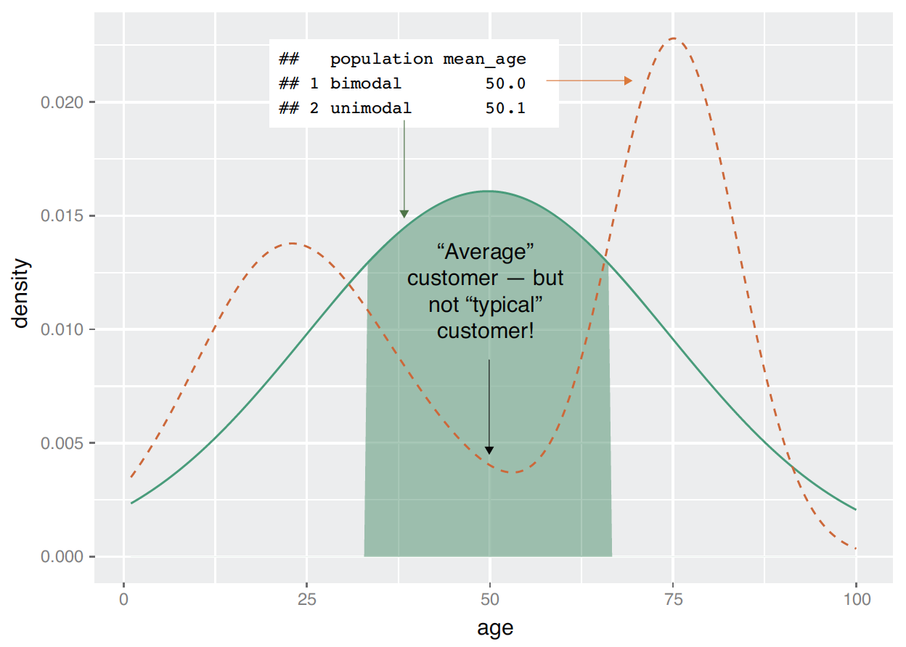
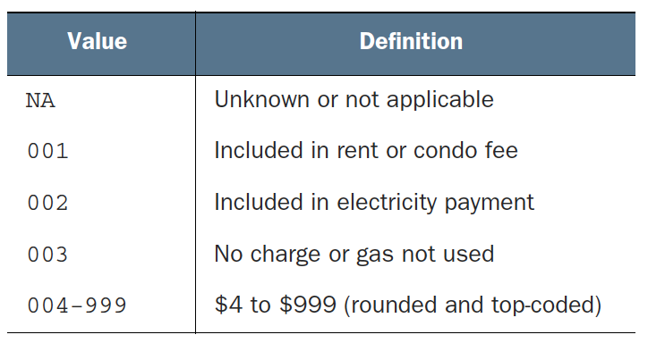

```{r setup, include = FALSE}
library(knitr)
library(kableExtra)
library(tidyverse)
library(NHSRtheme)
library(fontawesome)

# set default options
opts_chunk$set(echo = FALSE,
               fig.width = 7.252,
               fig.height = 4,
               comment = "#",
               dpi = 300)

knitr::knit_engines$set("markdown")

xaringanExtra::use_tile_view()
xaringanExtra::use_panelset()
xaringanExtra::use_clipboard()
xaringanExtra::use_webcam()
xaringanExtra::use_broadcast()
xaringanExtra::use_share_again()
xaringanExtra::style_share_again(
  share_buttons = c("twitter", "linkedin", "pocket")
)


xaringanExtra::use_extra_styles(
  hover_code_line = TRUE,         #<<
  mute_unhighlighted_code = F  #<<
)

# uncomment the following lines if you want to use the NHS-R theme colours by default
# scale_fill_continuous <- partial(scale_fill_nhs, discrete = FALSE)
# scale_fill_discrete <- partial(scale_fill_nhs, discrete = TRUE)
# scale_colour_continuous <- partial(scale_colour_nhs, discrete = FALSE)
# scale_colour_discrete <- partial(scale_colour_nhs, discrete = TRUE)
```


class: title-slide, left, bottom

# `r rmarkdown::metadata$title`
----
## **`r rmarkdown::metadata$subtitle`**
### `r rmarkdown::metadata$author`
### `r rmarkdown::metadata$date`


---
# Announcement 

### <p style="color:#00449E"> Tutoring/TA-ing at Data Analytics Lab (South 321) </p>

- Emine Morris (TA for Byeong-Hak): 
  1. Mondays and Wednesdays, 5:00 PM--6:30 PM
  2. Tuesdays and Thursdays, 3:00 PM--4:45 PM


---
# Workflow
### <p style="color:#00449E"> Shortcuts for RStudio and RScript </p>

.pull-left[
**Mac**

- **command + shift + N** opens a new RScript.
- **command + return** runs a current line or selected lines.
- **command + shift + C** is the shortcut for # (commenting).
- **option + - ** is the shortcut for `<-`.
]

.pull-right[
**Windows**

- **Ctrl + Shift + N** opens a new RS-cript.
- **Ctrl + return** runs a current line or selected lines.
- **Ctrl + Shift + C** is the shortcut for # (commenting).
- **Alt + - ** is the shortcut for `<-`.
]


---
# Workflow

- **Home/End** moves the blinking cursor bar to the beginning/End of the line.
  - **Ctrl** (**command/fn** for Mac Users) **+** `r fa("arrow-left")` / `r fa("arrow-right")` works too.


- **PgUp/PgDn** moves the blinking cursor bar to the top/bottom line of the script on the screen. 
  - **Fn + ** `r fa("arrow-up")` / `r fa("arrow-down")` works too.


- **Ctrl** (**command** for Mac Users) **+ Z** undoes the previous action.
- **Ctrl** (**command** for Mac Users) **+ Shift + Z** redoes when undo is executed.


- **Ctrl** (**command** for Mac Users) **+ F** is useful when finding a phrase (and replace the phrase) in the RScript.


- **Ctrl** (**command** for Mac Users) **+ D** deletes a current line.


---
class: inverse, center, middle

# Exploraty Data Analysis
<html><div style='float:left'></div><hr color='#EB811B' size=1px width=796px></html>


---
# Exploraty Data Analysis
### <p style="color:#00449E"> Get to know data before modeling

- Through exploratory data analysis (EDA), ...
  - We generate questions about our data.
  - We search for answers by visualizing and transforming our data.
  - We use what we learn to refine our questions and/or generate new questions.
  
  
- EDA and statistical analysis are an iterative cycle to answer questions we identify from data.


- EDA uses a combination of ...
  - Summary statistics
  - Visualization
  - Data transformation


---
# Visualization for Exploraty Data Analysis
### <p style="color:#00449E"> Example

- Suppose our goal is to identify what kind of characteristics of customers determine customers' health insurance status.

- We've collected a dataset of customers whose health insurance status we know. 
  
- We've also identified some customer properties that we believe help predict the probability of insurance coverage: 
  - age
  - employment status
  - income
  - information about residence and vehicles, and so on


---

# Key Points in Visualization

1. A graphic should display as much information as it can, with the lowest possible cognitive strain to the viewer.

2. Strive for clarity. Make the data stand out. Specific tips for increasing clarity include these:
    - Avoid too many superimposed elements, such as too many curves in the
      same graphing space.
    - Find the right aspect ratio and scaling to properly bring out the details of the
      data.
    - Avoid having the data all skewed to one side or the other of our graph.

3. Visualization is an iterative process. Its purpose is to answer questions about the data.


---
# Visualization
### <p style="color:#00449E"> Visually checking distributions for a single variable

- We will look at histograms, density plots, bar charts, and dot plots to see how varying a variable is.
- The above visualizations help us answer questions like these:

  - What is the peak value of the distribution?
  
  - How many peaks are there in the distribution (unimodality versus bimodality)?
  
  - How *normal* is the data? 
  
  - How much does the data vary? Is it concentrated in a certain interval or in a certain category?


---
# Visualization
### <p style="color:#00449E"> Visually checking distributions for a single variable

- One of the things that’s easy to grasp visually is the shape of the distribution of variable. 

```{r, echo = T, eval = F}
ggplot(data = customer_data) + 
  geom_density( mapping = aes(x = age) ) 
```

- The graph here is somewhat flattish between the ages of about 25 and about 60, falling off slowly after 60. 
- There seems to be a peak at around the late-20s to early 30s range, and another in the early 50s. 
- This data has multiple peaks: it is not unimodal.
  - Distribution peaks around mid/late 20s. Peaks again in early 50s.


---
# Visualization
### <p style="color:#00449E"> Visually checking distributions for a single variable

```{r, echo=FALSE, out.width = '66%', fig.align='center'}

```


---
# Visualization
### <p style="color:#00449E"> Histograms

- A basic histogram bins a variable into fixed-width buckets and returns the number of data points that fall into each bucket as a height.

- A histogram tells us where our data is concentrated. It also visually highlights outliers and anomalies.


```{r, echo = T, eval = F}
ggplot( data = customer_data, aes(x=gas_usage) ) +
  geom_histogram( binwidth = 10, fill = "gray" )
  
skim(customer_data$gas_usage)
```

- When using `geom_histogram()/geom_freqpoly`, we should try several times with different values for `binwidth` or `bins`.

---
# Visualization
### <p style="color:#00449E"> Data dictionary entry for `gas_usage`


```{r, echo=FALSE, out.width = '50%', fig.align='center'}

```

- Treat values `001`, `002`, and `003` as numerical values could potentially lead to incorrect conclusions in our analysis.


---
# Visualization
### <p style="color:#00449E"> Density plots

- We can think of a density plot as a continuous histogram of a variable.

  - The area under the density plot is re-scaled to equal one.
  - We can think of a density plot as a continuous histogram of a variable.


```{r, echo = T, eval = F}
ggplot(customer_data, aes( x = income ) ) +
  geom_density() 
```


---
# Visualization
### <p style="color:#00449E"> A Little Bit of Math for Logarithm

.panelset[

.panel[.panel-name[log functions]

- The logarithm function, $y = \log_{b}\,(\,x\,)$, looks like ....

```{r, echo=FALSE, out.width = '42%', fig.align='center'}
knitr::include_graphics("../lec_figs/logarithm_plots.png")
```
]

.panel[.panel-name[log examples]
- $\log_{10}\,(\,100\,)$: the base $10$ logarithm of $100$ is $2$, because $10^{2} = 100$

- $\log_{e}\,(\,x\,)$: the base $e$ logarithm is called the natural log, where $e = 2.718\cdots$ is the mathematical constant,  the Euler's number.

- $\log\,(\,x\,)$ or $\ln\,(\,x\,)$: the natural log of $x$ .

- $\log_{e}\,(\,7.389\cdots\,)$: the natural log of $7.389\cdots$ is $2$, because $e^{2} = 7.389\cdots$.
]

]

 
---
# Visualization
### <p style="color:#00449E"> Log Transformation

- We should use a logarithmic scale when percent change, or change in orders of magnitude, is more important than changes in absolute units.

  - For small changes in variable $x$ from $x_{0}$ to $x_{1}$, the following can be shown: 
  
$$\Delta \log(x) \,= \, \log(x_{1}) \,-\, \log(x_{0}) 
\approx\, \frac{x_{1} \,-\, x_{0}}{x_{0}} 
\,=\, \frac{\Delta\, x}{x_{0}}.$$

- A difference in income of $5,000 means something very different across people with different income levels.

<!-- - For small changes in $y$, the following can be shown that -->

<!-- $$\Delta\,\\log(y)&\,=\, \\log(y_{1}) \,-\, \\log(y_{0}) \\ -->
<!-- &\approx\, \frac{y_{1}} \,-\, y_{0}}{y_{0}} \\ -->
<!-- &=\, \frac{\Delta\, y}{y_{0}}.$$ -->

  - We should also consider using a log scale to reduce a variance of residuals when a variable is heavily skewed.

---
# Visualization
### <p style="color:#00449E"> Log Transformation

- The log transformation makes the skewed distribution of income more normal.

```{r, echo = T, eval = F}
ggplot(customer_data, aes( x = income ) ) +
  geom_density() 

ggplot(customer_data, aes( x = log(income) ) ) +
  geom_density() 

ggplot(customer_data, aes( x = log10(income) ) ) +
  geom_density() 
```


---
# Visualization
### <p style="color:#00449E"> Bar Charts and Dotplots

- A bar chart is a histogram for discrete data.
  - It records the frequency of every value of a categorical variable.


```{r, echo = T, eval = F}
ggplot( data = customer_data, 
		    mapping =  aes( x = marital_status )  ) + 
  geom_bar( fill = "gray" )
```


---
# Visualization
### <p style="color:#00449E"> Bar Charts and Dotplots

- Bar charts are most useful when the number of possible values is fairly large, like state of residents.


```{r, echo = T, eval = F}
ggplot(customer_data, aes( x = state_of_res ) ) +
  geom_bar(fill = "gray") +
  coord_flip()
```

- A horizontal bar chart can be easier to read when there are several categories with long names.


---
# Visualization
### <p style="color:#00449E"> Bar Charts and Dotplots

- Sometimes it is better to sort the data when plotting a bar chart or dot plot.


```{r, echo = T, eval = F}
library(WVPlots)    # install.package("WVPlots") if you have not
ClevelandDotPlot(customer_data, "state_of_res",
                 sort = 1, title="Customers by state") +
  coord_flip()
```


- Sorted bar chart or dot plot can allow use to extract insight more efficiently from the data. 

---
# Visualization
### <p style="color:#00449E"> Visually checking relationships between two variables

- We'll often want to look at the relationship between two variables.

  - Is there a relationship between the two inputs---age and income---in my data?
  
  - If so, what kind of relationship, and how strong?
  
  - Is there a relationship between the input, marital status, and the output, health insurance? How strong?


---
# Visualization
### <p style="color:#00449E"> A relationship between age and income

- Reasonable age and income values can be selected.
  - We'll discuss the `filter()` function soon.

```{r, echo = T, eval = F}
customer_data2 <- filter(customer_data,
                         0 < age & age < 100 &  # 0 < age < 100
                         0 < income & income < 200000)   # 0 < income < 200000
                           
cor(customer_data$age, customer_data$income)
```


---
# Visualization
### <p style="color:#00449E"> A relationship between age and income

```{r, echo = T, eval = F}
ggplot( data = customer_data2 ) +
  geom_smooth( mapping = aes(x = age, y = income) )
  
ggplot(customer_data2, aes(x = age, y = income)) +
  geom_point() +
  geom_smooth() +

library(hexbin)    # install.packages("hexbin") if you have not.
ggplot(customer_data2, aes(x=age, y=income)) +
  geom_hex() +
  geom_smooth(color = "red", se = F) +
```


---
# Visualization
### <p style="color:#00449E"> A relationship between marital status and health insurance

- Bar charts can be used to describe a relationship between two categorical variables.


```{r, echo = T, eval = F}
ggplot(customer_data, aes(x = marital_status, fill = health_ins)) +
  geom_bar()

# side-by-side bar chart
ggplot(customer_data, aes(x = marital_status, fill = health_ins)) +
  geom_bar([?])
  
# stacked bar chart
ggplot(customer_data, aes(x = marital_status, fill = health_ins)) +
  geom_bar([?])
```


---
# Visualization
### <p style="color:#00449E"> The Distribution of Marriage Status across Housing Types

```{r, echo = T, eval = F}
cdata <- filter(customer_data, !is.na(housing_type))

ggplot(cdata, aes(x = housing_type, fill = marital_status)) +
  geom_bar(position = "dodge") +
  coord_flip()

ggplot(cdata, aes(x=marital_status)) +
  geom_bar(fill="darkgray") +
  facet_wrap(~housing_type, scale="free_x") +  # try without scale="free_x"
  coord_flip()
```


---
# Visualization
### <p style="color:#00449E"> Visually checking relationships between two variables

- **Overlaying**, **faceting**, and **several aesthetics** should always be considered with the following geometric objects:

.pull-left[

- Scatter plot
- Hexbin plot
- Smoothing curve


- Histogram 
- Frequency ploygon
- Density plot 
- Boxplot
]

.pull-right[

- Bar chart
- Stacked bar chart 
- Stacked proportion bar chart 
- Side-by-side bar chart 
- Side-by-side proportion bar chart 


- Dot plot


- Line plot
]
  
    

---
class: inverse, center, middle

# Data Transformation
<html><div style='float:left'></div><hr color='#EB811B' size=1px width=796px></html>
  


---
# Data Transformation

- It is rare that we get the data in exactly the right form we need.

- We'll need to create some new variables, summaries, rename the variables or reorder the observations in order to make the data a little easier to work with.

- We'll discuss how to transform data using the `dplyr` package and a dataset on flights departing New York City in 2013.


```{r, echo = T, eval = F}
library(tidyverse)
library(nycflights13)
head(flights)
View(flights) 
?flights
```


---
# Data Transformation
### <p style="color:#00449E"> `dplyr` basics </p>

- We are going to discuss the five key `dplyr` functions to solve various data manipulation challenges:
  - Pick observations by their values (`filter()`).
  - Reorder the rows (`arrange()`).
  - Pick variables by their names (`select()`).
  - Create new variables with functions of existing variables (`mutate()`).
  - Collapse many values down to a single summary (`summarise()`).


---
# Data Transformation
### <p style="color:#00449E"> `dplyr` basics </p>

- `filter(<DATA.FRAME>, LOGICAL_STATEMENT)`
- `arrange(<DATA.FRAME>, ...)`
- `select(<DATA.FRAME>, ...)`
- `mutate(<DATA.FRAME>, ...)`
- `summarise(<DATA.FRAME>, ...)`


- The first argument is a data frame.
- The subsequent arguments describe what to do with the data frame, using the variable names.
- The result is a new data frame.


---
class: inverse, center, middle

# `filter()`
<html><div style='float:left'></div><hr color='#EB811B' size=1px width=796px></html>
  


---
# Filter rows with `filter()`

- `filter()` allows us to subset observations based on their values. 

```{r, echo = T, eval = F}
filter(flights, month == 1, day == 1)

jan1 <- filter(flights, month == 1, day == 1)

(dec25 <- filter(flights, month == 12, day == 25))
```


---
# Filter rows with `filter()`
### <p style="color:#00449E"> Comparisons


- R provides the standard comparison operators: `>`, `>=`, `<`, `<=`, `!=` (not equal), and `==` (equal).


```{r, echo = T, eval = F}
filter(flights, month = 1)

sqrt(2) ^ 2 == 2
1 / 49 * 49 == 1

near(sqrt(2) ^ 2,  2)
near(1 / 49 * 49, 1)
```


---
# Filter rows with `filter()`
### <p style="color:#00449E"> Logical Operators


- Multiple arguments to `filter()` are often combined with logical operators.


```{r, echo=FALSE, out.width = '66%', fig.align='center', fig.cap="Complete set of boolean operations in `R`"}
knitr::include_graphics("../lec_figs/transform-logical.png")
```


---
# Filter rows with `filter()`
### <p style="color:#00449E"> Logical Operators


- De Morgan’s law: 

- `!(x \& y)` is the same as `!x | !y`. 
- `!(x | y)` is the same as `!x & !y`.

- For example, comparison and logical operators can be used with `filter()` as follows:


```{r, echo = T, eval = F}
filter(flights, month == 11 | month == 12)
nov_dec <- filter(flights, month %in% c(11, 12))

filter(flights, !(arr_delay > 120 | dep_delay > 120))
filter(flights, arr_delay <= 120, dep_delay <= 120)
```


---
# Filter rows with `filter()`
### <p style="color:#00449E"> Missing values


- Almost any operation involving an unknown value will also be unknown.


```{r, echo = T, eval = F}
NA > 5
10 == NA
NA + 10
NA / 2

NA == NA
```


---
# Filter rows with `filter()`
### <p style="color:#00449E"> Missing values


- Let x be Mary's age. We don't know how old she is.
- Let y be John's age. We don't know how old he is.
- Are John and Mary the same age?


```{r, echo = T, eval = F}
x <- NA
y <- NA
x == y
```


---
# Filter rows with `filter()`
### <p style="color:#00449E"> Missing values


- If we want to determine if a value is missing, use `is.na()`.
- If we want to preserve missing values, ask `filter()` for them explicitly.


```{r, echo = T, eval = F}
x <- NA
is.na(x)

df <- tibble(y = c(1, NA, 3))
filter(df, y > 1)
filter(df, is.na(y) | y > 1)
```


---
# Filter rows with `filter()`
### <p style="color:#00449E"> Exercises

- Find all flights that
  - Had an arrival delay of two or more hours
  - Flew to Houston (`IAH` or `HOU`)
  - Were operated by United, American, or Delta
  - Departed in summer (July, August, and September)
  - Arrived more than two hours late, but didn’t leave late
  - Were delayed by at least an hour, but made up over 30 minutes in flight
  - Departed between midnight and 6am (inclusive)


---
# Filter rows with `filter()`
### <p style="color:#00449E"> Exercises

- Another useful `dplyr` filtering helper is `between()`. What does it do? Can you use it to simplify the code needed to answer the previous challenges?

- How many flights have a missing `dep_time`? What other variables are missing? What might these rows represent?

- Why is `NA^0` not missing? Why is `NA | TRUE` not missing? Why is `FALSE & NA` not missing? Can you figure out the general rule? (`NA * 0` is a tricky counterexample!)


---
class: inverse, center, middle

# `arrange()`
<html><div style='float:left'></div><hr color='#EB811B' size=1px width=796px></html>


---
# Arrange rows with `arrange()`

- `arrange()` changes their order.

- If we provide more than one column name, each additional column will be used to break ties in the values of preceding columns.

- Use `desc()` to re-order by a column in descending order.


```{r, echo = T, eval = F}
arrange(flights, year, month, day)

# re-order observations by dep_delay in descending order.
arrange(flights, [?])
```


---
# Arrange rows with `arrange()`
### <p style="color:#00449E"> Exercises

- How could you use `arrange()` to sort all missing values to the start? (Hint: use `is.na()`).

- Sort flights to find the most delayed flights. Find the flights that left earliest.

- Sort flights to find the fastest (highest speed) flights.

- Which flights traveled the farthest? Which traveled the shortest?


---
class: inverse, center, middle

# `select()`
<html><div style='float:left'></div><hr color='#EB811B' size=1px width=796px></html>


---
# Select columns with `select()`

- It’s not uncommon to get datasets with hundreds or even thousands of variables.
- `select()` allows us to narrow in on the variables we're actually interested in. 


```{r, echo = T, eval = F}
select(flights, year, month, day)

select(flights, year:day)

select(flights, -(year:day))
```


---
# Select columns with `select()`

- There are a number of helper functions we can use within `select()`:

- `starts_with("abc")`: matches names that begin with "abc".

- `ends_with("xyz")`: matches names that end with "xyz".

- `contains("ijk")`: matches names that contain "ijk".

- `num_range("x", 1:3)`: matches x1, x2 and x3.


---
# Select columns with `select()`
### <p style="color:#00449E"> Rename variables with `rename()`


- `rename()` can be used to rename variables:

  - `rename(<DATA>, <NEW_VARIABLE> = <EXISTING_VARIABLE>)`


```{r, echo = T, eval = F}
rename(flights, tail_num = tailnum)
```


---
# Select columns with `select()`
### <p style="color:#00449E"> Change the order of variables


- The function, `everything()`, can be used to move variables to the start of the data frame:


```{r, echo = T, eval = F}
select(flights, time_hour, air_time, [?])
```


---
# Select columns with `select()`
### <p style="color:#00449E"> Exercises

- Brainstorm as many ways as possible to select `dep_time`, `dep_delay`, `arr_time`, and `arr_delay` from flights.

- What happens if we include the name of a variable multiple times in a `select()` call?

- What does the `any_of()` function do? Why might it be helpful in conjunction with this vector?

```{r, echo = T, eval = F}
vars <- c("year", "month", "day", "dep_delay", "arr_delay")
```


---
# Select columns with `select()`
### <p style="color:#00449E"> Exercises

- Does the result of running the following code surprise us? How do the select helpers deal with case by default? How can we change that default?

```{r, echo = T, eval = F}
select(flights, contains("TIME"))
```


---
class: inverse, center, middle

# `mutate()`
<html><div style='float:left'></div><hr color='#EB811B' size=1px width=796px></html>

---
# Add new variables with `mutate()`


- `mutate()` is useful to add new columns that are functions of existing columns.


```{r, echo = T, eval = F}
flights_sml <- select(flights, 
                      year:day, 
                      ends_with("delay"), 
                      distance, 
                      air_time )

mutate(flights_sml,
  gain = dep_delay - arr_delay,
  speed = distance / air_time * 60 )

mutate(flights_sml,
  gain = dep_delay - arr_delay,
  hours = air_time / 60,
  gain_per_hour = gain / hours )
```


---
# Add new variables with `mutate()`
- If we only want to keep the new variables, use `transmute()`.


```{r, echo = T, eval = F}
transmute(flights,
  gain = dep_delay - arr_delay,
  hours = air_time / 60,
  gain_per_hour = gain / hours
)
```


---
# Add new variables with `mutate()`
### <p style="color:#00449E"> Useful creation functions

- There are many functions for creating new variables that we can use with `mutate()`.

- Arithmetic operators: `+`, `-`, `*`, `/`, `^`.
- Modular arithmetic: `%/%` (integer division) and `%%` (remainder).


```{r, echo = T, eval = F}
transmute(flights,
  dep_time,
  hour = dep_time %/% 100,
  minute = dep_time %% 100
)
```


---
# Add new variables with `mutate()`
### <p style="color:#00449E"> Useful creation functions

- There are many functions for creating new variables that we can use with `mutate()`.

- Offsets: `lead()` and `lag()` allow us to refer to leading or lagging values. 

- Cumulative and rolling aggregates: R provides functions for running sums, products, mins and maxes: `cumsum()`, `cumprod()`, `cummin()`, `cummax()`, and `cummean()`


```{r, echo = T, eval = F}
(x <- 1:10)
lag(x)
lead(x)
cumsum(x)
cummean(x)
```


---
# Add new variables with `mutate()`
### <p style="color:#00449E"> Useful creation functions

- There are many functions for creating new variables that we can use with `mutate()`.


- Ranking: `min_rank()`, `dense_rank()`, `row_number()`, , `percent_rank()`, and `cume_dist()`.


```{r, echo = T, eval = F}
y <- c(1, 2, 2, NA, 3, 4)
min_rank(y)
min_rank(desc(y))
row_number(y)
dense_rank(y)
percent_rank(y)
cume_dist(y)
```


---
# Add new variables with `mutate()`
### <p style="color:#00449E"> Useful creation functions

- To create new variables based on a condition, we can use the `if_else()` and `ifelse()` functions. 
  - `if_else(<condition>, <if TRUE>, <else>)`
  - `ifelse(<condition>, <if TRUE>, <else>)`


```{r, echo = T, eval = F}
flight_season <-mutate(flights,
    summer_month = if_else(month %in% c(6, 7, 8), TRUE, FALSE))

flight_season <-mutate(flights,
    summer_month = if_else(month %in% c(6, 7, 8), TRUE, 0))

flight_season <-mutate(flights,   # ifelse() is less restrictive
    summer_month = ifelse(month %in% c(6, 7, 8), TRUE, 0))
```


---
# Add new variables with `mutate()`
### <p style="color:#00449E"> Exercises
 
- Currently `dep_time` and `sched_dep_time` are convenient to look at, but hard to compute with because they’re not really continuous numbers. Convert them to a more convenient representation of number of minutes since midnight.

- Compare `air_time` with `arr_time - dep_time`. What do you expect to see? What do you see? What do you need to do to fix it?

- Compare `dep_time`, `sched_dep_time`, and `dep_delay.` How would you expect those three numbers to be related?

- Find the 10 most delayed flights using a ranking function. How do you want to handle ties? 
