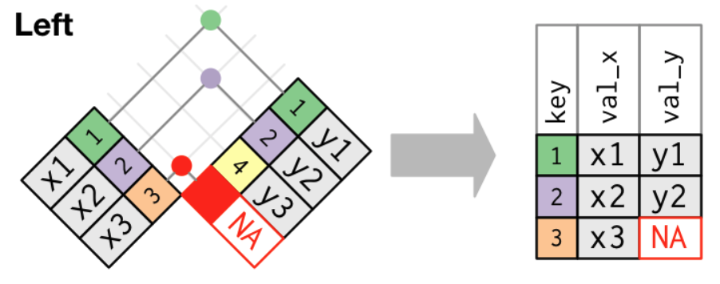
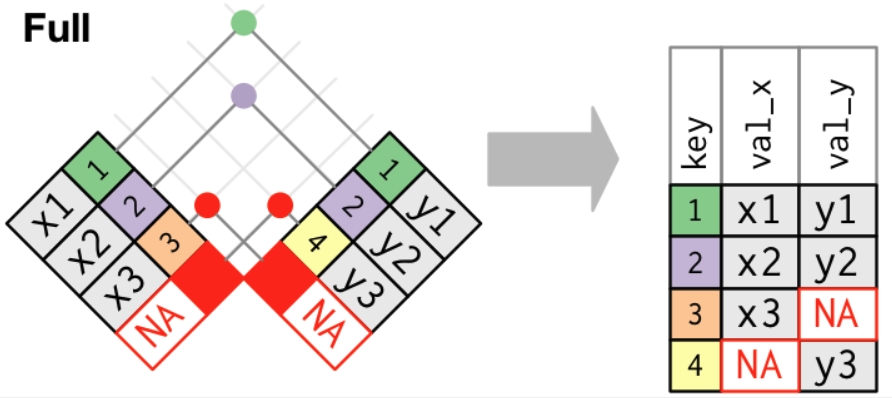

```{r setup, include = FALSE}
library(knitr)
library(kableExtra)
library(tidyverse)
library(NHSRtheme)
library(fontawesome)

# set default options
opts_chunk$set(echo = FALSE,
               fig.width = 7.252,
               fig.height = 4,
               comment = "#",
               dpi = 300)

knitr::knit_engines$set("markdown")

xaringanExtra::use_tile_view()
xaringanExtra::use_panelset()
xaringanExtra::use_clipboard()
xaringanExtra::use_webcam()
xaringanExtra::use_broadcast()
xaringanExtra::use_share_again()
xaringanExtra::style_share_again(
  share_buttons = c("twitter", "linkedin", "pocket")
)


xaringanExtra::use_extra_styles(
  hover_code_line = TRUE,         #<<
  mute_unhighlighted_code = F  #<<
)

# uncomment the following lines if you want to use the NHS-R theme colours by default
# scale_fill_continuous <- partial(scale_fill_nhs, discrete = FALSE)
# scale_fill_discrete <- partial(scale_fill_nhs, discrete = TRUE)
# scale_colour_continuous <- partial(scale_colour_nhs, discrete = FALSE)
# scale_colour_discrete <- partial(scale_colour_nhs, discrete = TRUE)
```


class: title-slide, left, bottom

# `r rmarkdown::metadata$title`
----
## **`r rmarkdown::metadata$subtitle`**
### `r rmarkdown::metadata$author`
### `r rmarkdown::metadata$date`


---
# Announcement

Here are some virtual and in-person events offering our students the opportunity to connect with alumni in the next week or two.

- Nov. 2nd: 1:00 pm - 1:30 pm. SMIF Virtual session with one of our alumni supporters, **Steve Mattus**, UBS. See geneseobusiness instagram for zoom ID and passcode.	

- Nov. 2nd -6:00 pm - 7:00 pm. AlphaSights virtual session with alumni **Talia Itozcowitz**, actively recruiting for a range of internships and F/T. Registration link for session	[here](https://alphasights.zoom.us/webinar/register/WN_oi_KeBoJSoaRxnYh4oOcHw)


- Nov. 4th: 8:30 am - 4:00 pm, **Annual Economics Research and Career Day**, Doty 300. No RSVP required, if interested in lunch, stop in South 110. See Professor Stone with questions.	


---
# Announcement

Here are some virtual and in-person events offering our students the opportunity to connect with alumni in the next week or two.

- Nov. 11th: **Buffalo Business Expo day**, bus transportation provided for students to visit 3 exciting employers in a range of fields. Leave campus at 8:00 am - return at 4:00 pm. Stop in South 110 to reserve your spot, first 30 students accepted. Open to all SoB majors.

- Nov. 16: 4:00 pm - 5:00 pm. **NBT Bank**, virtual session with Chief Investment Officer & Economist Ken Entenmann on the fundamentals of investing. Register here: [NBT Bank Registration](https://teams.microsoft.com/registration/eeSfpvYNRUutvTks2SAGZg,xVDkQ0KpnEmieUwWmiWW2Q,jTw-tKIg50uH3x4OF_eUGg,E_62TH_s40KvLjGiFnQUNg,ZtN_uksEa0mln1HzB_5u6Q,ip0yaRh4zkW52znTN0m6Mg?mode=read&tenantId=a69fe479-0df6-4b45-adbd-392cd9200666)


---
class: inverse, center, middle

# Tidy Data
<html><div style='float:left'></div><hr color='#EB811B' size=1px width=796px></html>
  

---
# Tidy Data
### <p style="color:#00449E"> What are tidy data? </p>

<blockquote>

"Happy families are all alike; every unhappy family is unhappy in its own way." –– Leo Tolstoy 

</blockquote>


<blockquote>

"Tidy datasets are all alike, but every messy dataset is messy in its own way." –– Hadley Wickham, Chief Scientist at Posit (formerly RStudio)

</blockquote>


---
# Tidy Data
### <p style="color:#00449E"> What are tidy data? </p>

- There are three rules which make a dataset tidy:

  1. Each **variable** must have its own *column*.
  2. Each **observation** must have its own *row*.
  3. Each **value** must have its own *cell*.


```{r, echo=FALSE, out.width = '75%', fig.align='center'}
knitr::include_graphics("../lec_figs/tidy-1.png")
```


---
# Tidy data

- We can represent the same underlying data in multiple ways. 

```{r, echo = T, eval = F}
library(tidyverse)
table1
table2
table3

# Spread across two tibbles
table4a  # cases
table4b
```


---
class: inverse, center, middle

# Pivoting
<html><div style='float:left'></div><hr color='#EB811B' size=1px width=796px></html>
  

---
# Pivoting


- The first step is always to figure out what form of the *variables* and *observations* we need. 

- The second step is to resolve one of two common problems:

  - One variable might be spread across *multiple columns*.

  - One observation might be scattered across *multiple rows*.

- To fix these problems, we may need the two most important functions in the `tidyr` package: `pivot_longer()` and `pivot_wider()`.


---
# Pivoting
### <p style="color:#00449E"> Longer

- Some of the *column names* are not names of variables, but **values** of a variable.

```{r, echo = T, eval = F}
table4a
```

- We use `pivot_longer()` when a variable might be spread across *multiple columns*.


---
# Pivoting
### <p style="color:#00449E"> Longer

- To tidy a dataset like `table4a`, we need to pivot the offending columns into a new pair of variables.

- To use `pivot_longer()`, we need to the following three parameters:
  - The *set of columns* (`cols`) whose names are values, not variables.
  - The name of the variable to move the column *names to* (`names_to`).
  - The name of the variable to move the column *values to* (`values_to`).

```{r, echo = T, eval = F}
table4a %>% 
  pivot_longer(cols = c(`1999`, `2000`), 
               names_to = "year", 
               values_to = "cases")
```


---
# Pivoting
### <p style="color:#00449E"> Longer
```{r, echo=FALSE, out.width = '100%', fig.align='center', caption = "Pivoting `table4` into a longer, tidy form"}
knitr::include_graphics("../lec_figs/tidy-9.png")
```


---
# Pivoting
### <p style="color:#00449E"> Wider

- One observation might be scattered across *multiple rows*.

```{r, echo = T, eval = F}
table2
```

- We use `pivot_wider()` when an observation is scattered across multiple rows.


---
# Pivoting
### <p style="color:#00449E"> Wider

- To use `pivot_wider()`, we need two parameters:
  - The column to take variable *names from*.
  - The column to take *values from*.

- We can add the optimal parameter, `names_prefix`, for the prefix of column names.

```{r, echo = T, eval = F}
table2
table2 %>%
    pivot_wider(names_from = type, values_from = count)
```


---
# Pivoting
### <p style="color:#00449E"> Wider
```{r, echo=FALSE, out.width = '100%', fig.align='center', caption = "Pivoting `table2` into a wider, tidy form"}
knitr::include_graphics("../lec_figs/tidy-8.png")
```


---
class: inverse, center, middle

# Separating and Uniting
<html><div style='float:left'></div><hr color='#EB811B' size=1px width=796px></html>
  

---
# Separating and Uniting
### <p style="color:#00449E">`separate`

- `table3` has one column (`rate`) that contains two variables (`cases` and `population`).

- `separate()` takes the name of the column to separate, and the names of the columns to separate into.

```{r, echo = T, eval = F}
table3

table3 %>% 
  separate(rate, into = c("cases", "population"))
```


---
# Separating and Uniting
### <p style="color:#00449E">`separate`

- If we want to use a specific chracter to seprate a column, we can pass the character to the `sep` parameter.


```{r, echo = T, eval = F}
table3 %>% 
  separate(rate, into = c("cases", "population"), sep = "/")
```


---
# Separating and Uniting
### <p style="color:#00449E">`separate`

- By default, `separate()` leaves the type of the column as is.

```{r, echo = T, eval = F}
table3 %>% 
  separate(rate, into = c("cases", "population"))
```


---
# Separating and Uniting
### <p style="color:#00449E">`separate`

- `separate()` will interpret the integers as positions to split at.

  - We can also pass a vector of integers to `sep`.
  
  - `separate()` will interpret the integer as positions to split at.


```{r, echo = T, eval = F}
table3 %>% 
  separate(year, into = c("century", "year"), sep = 2)
```


---
# Separating and Uniting
### <p style="color:#00449E"> `unite`

- `unite()` combines multiple columns into a single column. 

- The default will place an underscore (`_`) between the values from different columns.


```{r, echo = T, eval = F}
table5 %>% 
  unite(new, century, year)
  
table5 %>% 
  unite(new, century, year, sep = "")
```


---
class: inverse, center, middle

# Relational Data
<html><div style='float:left'></div><hr color='#EB811B' size=1px width=796px></html>


---
# Relational data


- It's rare that a data analysis involves only a single data frame.

- Collectively, multiple data frames are called *relational data*.

-  To work with relational data, we need verbs that work with pairs of data frames. 

  - **join** methods add new variables to one data frame from matching observations in another data frame.


---
# Relational data
### <p style="color:#00449E"> `nycflights13`

- `nycflights13` contains four data frames that are related to the data frame, `flights`, that we used in data transformation.


```{r, echo = T, eval = F}
library(nycflights13)
flights
airlines
airports
planes
weather
```


---
# Relational data
### <p style="color:#00449E"> `nycflights13`

- `flights` connects to ...

- `planes` via a single variable, `tailnum`.

- `airlines` through the `carrier` variable.

- `airports` in two ways: via the `origin` and `dest` variables.

- `weather` via `origin` (the location), and `year`, `month`, `day` and `hour` (the time).


---
# Relational data
### <p style="color:#00449E"> `nycflights13`

```{r, echo=FALSE, out.width = '66%', fig.align='center'}
knitr::include_graphics("../lec_figs/relational-nycflights.png")
```


---
# Relational data
### <p style="color:#00449E"> Keys

- A key is a variable (or a set of variables) that uniquely identifies an observation.
- Keys are used to connect each pair of data frames.
- There are two types of keys:

*1*. A **primary key** uniquely identifies an observation in its own data frame
  - E.g., `planes$tailnum` is a primary key for the `planes` data frame because it uniquely identifies each plane in the `planes` data frame.


*2*. A **foreign key** uniquely identifies an observation in another data frame. 
  - E.g,, `flights$tailnum` is a foreign key because it appears in the `flights` data frame where it matches each flight to a unique plane in `planes` data frame.


---
# Relational data
### <p style="color:#00449E"> Keys

- A variable can be both a primary key and a foreign key. 

  - E.g., `origin` is part of the `weather` primary key, and is also a foreign key for the `airports` data frame.


---
# Relational data
### <p style="color:#00449E"> Keys

- If a data frame lacks a primary key, it's sometimes useful to add **a surrogate key** that uniquely identifies an observation in the data frame.
  - A surrogate key can act as a primary key.
  - A primary key and the corresponding foreign key in another table form a **relation**.


- Relations between tables could be ...
  - One-to-one;
  - One-to-many (e.g., `airlines` and `airports`);
  - Many-to-one;
  - Many-to-many (e.g., `flights` and `airplanes`).


---
# Relational data
### <p style="color:#00449E"> Joins


- A join allows us to combine two data frames via key variables. 
- It first matches observations by their keys, then copies across variables from one data frame to the other.


```{r, echo = T, eval = F}
flights2 <- flights %>% 
  select(year:day, hour, origin, dest, tailnum, carrier)
flights2
airlines

flights2 %>%
  select(-origin, -dest) %>% 
  left_join(airlines, by = "carrier")
```


---
# Relational data
### <p style="color:#00449E"> Joins

```{r, echo=FALSE, out.width = '20%', fig.align='center'}
knitr::include_graphics("../lec_figs/join-setup.png")
```

.pull-left[
```{r, echo = T, eval = F}
x <- tribble(
  ~key, ~val_x,
     1, "x1",
     2, "x2",
     3, "x3" )
```
]
.pull-right[
```{r, echo = T, eval = F}
y <- tribble(
  ~key, ~val_y,
     1, "y1",
     2, "y2",
     4, "y3" )
```
]

- The colored column represents the "key" variable.
- The grey column represents the "value" column.


---
# Joins
### <p style="color:#00449E"> Inner join

- An **inner join** matches pairs of observations whenever their keys are equal:

```{r, echo=FALSE, out.width = '50%', fig.align='center'}
knitr::include_graphics("../lec_figs/join-inner.png")
```


```{r, echo = T, eval = F}
x %>% 
  inner_join(y, by = "key")
```


---
# Joins
### <p style="color:#00449E"> Outer join

- An *outer join* keeps observations that appear in at least one of the tables.


- A **left join** keeps all observations in `x`.
- A **right join** keeps all observations in `y`.
- A **full join** keeps all observations in `x` and `y`.


---
# Joins
### <p style="color:#00449E"> Outer join
.pull-left[
```{r, echo=FALSE, out.width = '100%', fig.align='center'}

```
]
.pull-right[
```{r, echo=FALSE, out.width = '100%', fig.align='center'}
knitr::include_graphics("../lec_figs/join-right.png")
```
]
```{r, echo=FALSE, out.width = '45%', fig.align='center'}

```


---
# Joins
### <p style="color:#00449E"> Left join

- The most commonly used join is the left join: 

- It preserves the original observations even when there isn't a match. 


---
# Joins
### <p style="color:#00449E"> Duplicate keys

- One data frame has duplicate keys (a one-to-many relationship). 
```{r, echo=FALSE, out.width = '40%', fig.align='center'}
knitr::include_graphics("../lec_figs/join-one-to-many.png")
```

.pull-left[
```{r, echo = T, eval = F}
x <- tribble(
  ~key, ~val_x,
     1, "x1",
     2, "x2",
     2, "x3",
     1, "x4")
```

]
.pull-right[
```{r, echo = T, eval = F}
y <- tribble(
  ~key, ~val_y,
     1, "y1",
     2, "y2")

left_join(x, y, by = "key")
```

]


---
# Joins - Duplicate keys

- Both data frames have duplicate keys (many-to-many relationship).
```{r, echo=FALSE, out.width = '35%', fig.align='center'}
knitr::include_graphics("../lec_figs/join-many-to-many.png")
```


.pull-left[
```{r, echo = T, eval = F}
x <- tribble(
  ~key, ~val_x,
     1, "x1",
     2, "x2",
     2, "x3",
     3, "x4" )
```

]

.pull-right[
```{r, echo = T, eval = F}
y <- tribble(
  ~key, ~val_y,
     1, "y1",
     2, "y2",
     2, "y3",
     3, "y4" )
left_join(x, y, by = "key")
```
]


---
# Joins
### <p style="color:#00449E"> Defining the key columns

- `by = NULL`: uses all variables that appear in both tables.
- `by = "a"`: uses only variable `a`.
- `by = c("a" = "b")`: match variable `a` in data frame `x` to variable `b` in data frame `y`.

.pull-left[
```{r, echo = T, eval = F}
flights2 %>% 
  left_join(weather)
  
flights2 %>% 
  left_join(planes, 
            by = "tailnum")
```
]

.pull-right[
```{r, echo = T, eval = F}
flights2 %>% 
  left_join(airports, 
            c("dest" = "faa"))
  
flights2 %>% 
  left_join(airports, 
            c("origin" = "faa"))
```
]


---
class: inverse, center, middle

# Strings
<html><div style='float:left'></div><hr color='#EB811B' size=1px width=796px></html>


---
# Strings
### <p style="color:#00449E"> Combining strings

- To count the length of string, use `str_length()`.
- To combine two or more strings, use `str_c()`:

- To control how strings are separated, add the `sep`.
- To collapse a vector of strings into a single string, add the `collapse`.

```{r, echo = T, eval = F}
str_length(c("a", "R for data science", NA))
str_c("x", "y", "z")
str_c(c("x", "y", "z"), sep = ", ")
str_c("prefix-", c("a", "b", "c"), "-suffix")
str_c(c("x", "y", "z"), collapse = ", ")
```


---
# Strings
### <p style="color:#00449E"> Subsetting strings

- We can extract parts of a string using `str_sub()`:

- `str_sub()` takes `start` and `end` arguments which give the position of the substring:.


```{r, echo = T, eval = F}
x <- c("Apple", "Banana", "Pear")
str_sub(x, 1, 3)

# negative numbers count backwards from end
str_sub(x, -3, -1)
```


---
# Strings
### <p style="color:#00449E"> Matching a pattern of strings

- To determine if a character vector matches a pattern, use `str_detect()`.
- `str_count()` tells us how many matches there are in a string.
- `str_replace()` and `str_replace_all()` allow us to replace matches with new strings.
- `str_replace_all()` can perform multiple replacements by supplying a named vector.

```{r, echo = T, eval = F}
x <- c("apple", "banana", "pear")

str_detect(x, "e")
str_count(x, "a")
str_replace(x, "a", "-")
str_replace_all(x, "a", "-")
```

---
# Strings
### <p style="color:#00449E"> Splitting strings

- Use `str_split()` to split a string up into pieces. 


```{r, echo = T, eval = F}
sentences %>%
  head(5) %>% 
  str_split(" ")
```


---
class: inverse, center, middle

# Factors
<html><div style='float:left'></div><hr color='#EB811B' size=1px width=796px></html>


---
# Factors
### <p style="color:#00449E"> Creating factors

- In `R`, factors are categorical variables, variables that have a fixed and known set of possible values.

```{r, echo = T, eval = F}
x1 <- c("Dec", "Apr", "Jan", "Mar")
```

- Using a string to record variable `x1` has two problems:
  1. There are only twelve possible months, and there's nothing saving us from typos.
  2. It doesn't sort in a useful way.

```{r, echo = T, eval = F}
x2 <- c("Dec", "Apr", "Jam", "Mar")
sort(x1)
```


---
# Factors
### <p style="color:#00449E"> Creating factors with `factor()`

- We can fix both of these problems with `factor()`. 
- To create a factor, we must start by creating a list of the valid `levels`.
- Any values not in the set will be silently converted to `NA`.
- If we omit the `levels`, they'll be taken from the data in alphabetical order:

.pull-left[
```{r, echo = T, eval = F}
months <- c(
  "Jan", "Feb", "Mar", "Apr", 
  "May", "Jun", "Jul", "Aug", 
  "Sep", "Oct", "Nov", "Dec")
x1 <- 
  c("Dec", "Apr", "Jan", "Mar")
y1 <- factor(x1, 
             levels = months)
sort(y1)
```
]

.pull-right[
```{r, echo = T, eval = F}
x2 <- 
  c("Dec", "Apr", "Jam", "Mar")

y2 <- factor(x2, 
             levels = months)
y2

factor(x1)
```
]


---
# Factors
### <p style="color:#00449E"> Creating factors with `factor()`

-  Sometimes we'd prefer that the order of the levels match the order of the first appearance in the data. 

- We can do that when creating the factor by setting levels to `unique()`.

- If we ever need to access the set of valid levels directly, we can do so with `levels()`.

```{r, echo = T, eval = F}
x1

f1 <- factor(x1, levels = unique(x1))
f1

levels(f1)
```


---
# Factors
### <p style="color:#00449E"> General Social Survey

- We're going to focus on the data frame, `forcats::gss_cat`.which is a sample of data from the General Social Survey.

- When factors are stored in a data frame, we can see them with `count()`.

```{r, echo = T, eval = F}
gss_cat

gss_cat %>%
  [?](race)
```


---
# Factors
### <p style="color:#00449E"> Modifying factor order

- It's often useful to change the order of the factor levels in a visualization.

- Imagine we want to explore the average number of hours spent watching TV per day across `relig`:

.pull-left[
```{r, echo = T, eval = F}
relig_summary <- gss_cat %>%
  group_by([?]) %>%
  summarize(
    age = [?](age, [?]),
    tvhours = [?](tvhours, [?]),
    n = [?]
  )
```
]
.pull-right[
```{r, echo = T, eval = F}
ggplot(relig_summary, 
       aes(tvhours, relig)) + 
  [?]()
```
]


---
# Factors
### <p style="color:#00449E"> Modifying factor order

- We can reorder the levels using `fct_reorder(f, x, fun)`, which can take three arguments.

- `f`: the factor whose levels we want to modify.
- `x`: a numeric vector that we want to use to reorder the levels.
- Optionally, `fun`: a function that's used if there are multiple values of `x` for each value of `f`. The default value is *median*.


```{r, echo = T, eval = F}
relig_summary %>%
  mutate(relig = [?](relig, tvhours)) %>%
  ggplot(aes(tvhours, relig)) + [?]()
```


---
# Factors
### <p style="color:#00449E"> Modifying factor order

- We can use `relevel()` to set the first level (*reference level*). 
- `relevel(x, ref = ...)` takes at least the two arguments: 
  - `x`: factor variable 
  - `ref`: reference level or first level
  
.pull-left[
```{r, echo = T, eval = F}
rincome_summary <- gss_cat %>%
  group_by([?]) %>%
  summarize(
    age = [?](age, [?]),
    tvhours = [?](tvhours, [?]),
    n = [?]
  )
```

]

.pull-right[
```{r, echo = T, eval = F}
ggplot(rincome_summary, 
       aes(age, [?](rincome, age) ) )  + 
  geom_point()
ggplot(rincome_summary, 
       aes(age, 
           [?](rincome, 
               "Not applicable") ) ) +
  geom_point()
```

]


---
class: inverse, center, middle

# Dates and Times
<html><div style='float:left'></div><hr color='#EB811B' size=1px width=796px></html>


---
# Dates and times


- The `lubridate` package makes it easier to work with dates and times in `R`.

```{r, echo = T, eval = F}
library(tidyverse)
library(lubridate)
library(nycflights13)
```


---
# Dates and times
### <p style="color:#00449E"> Creating date/times

- To get the current date or date-time we can use `today()` or `now()`.
- The `lubridate` functions are a combination of y, m, d, h, m, and s.

.pull-left[
```{r, echo = T, eval = F}
today()
now()
```
]
.pull-right[
```{r, echo = T, eval = F}
ymd("2017-01-31")
[?]("January 31st, 2017")
[?]("31-Jan-2017")

[?](20170131)

[?]("2017-01-31 20:11:59")
[?]("01/31/2017 08:01")

[?](20170131, [?] = "UTC")
```
]


---
# Dates and times
### <p style="color:#00449E"> Creating date/times

- To create a date/time from individual components, use `make_date()` for dates, or `make_datetime()` for date-times:


```{r, echo = T, eval = F}
flights %>% 
  select(year, month, day, hour, minute)
  
flights %>% 
  select(year, month, day, hour, minute) %>% 
  mutate(departure = [?](year, month, day, hour, minute))
  
flights %>% 
  select(year, month, day, hour, minute) %>% 
  mutate(departure = [?](year, month, day))
```


---
# Dates and times
### <p style="color:#00449E"> Creating date/times

- We can visualize time series data using `lubridate` functions.

```{r, echo = T, eval = F}
flights_dt %>% 
  ggplot(aes(dep_time)) + 
  geom_freqpoly(binwidth = 86400) # 86400 seconds = 1 day
  
flights_dt %>% 
  filter(dep_time < ymd(20130102)) %>% 
  ggplot(aes(dep_time)) + 
  geom_freqpoly(binwidth = 600) # 600 s = 10 minutes
```


---
# Dates and times
### <p style="color:#00449E"> Creating date/times

- `as_datetime()` and `as_date()` switch between a date-time and a date.


```{r, echo = T, eval = F}
[?](today())
[?](now())
```


