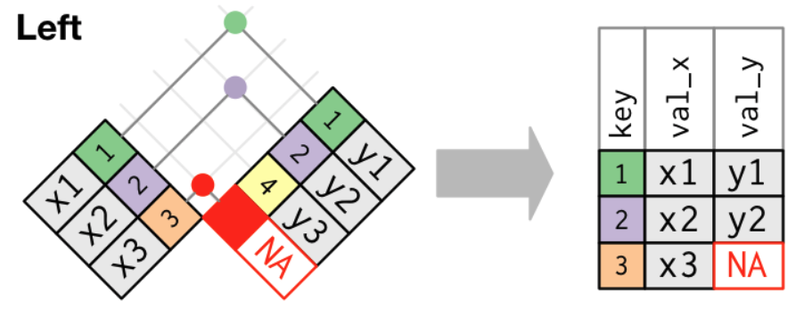
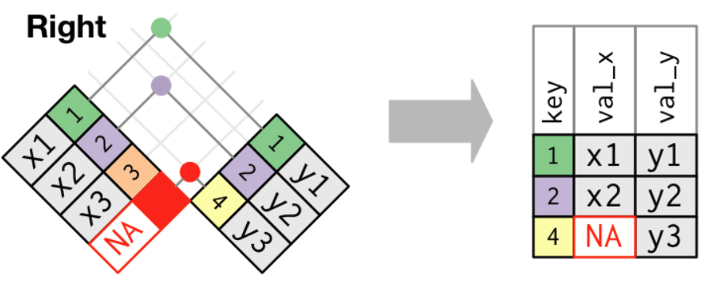
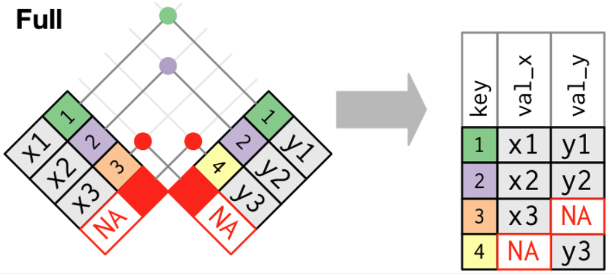
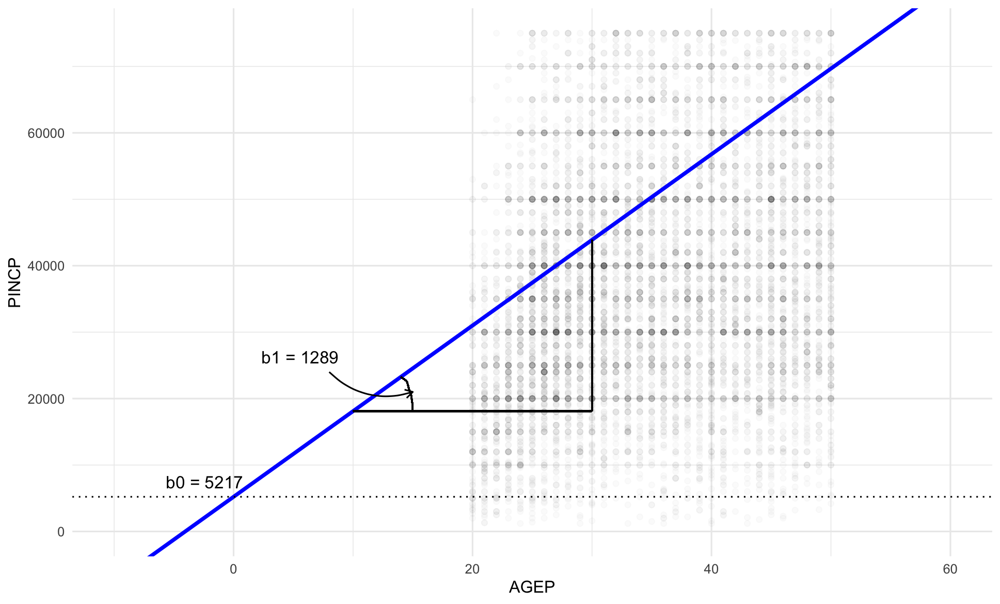
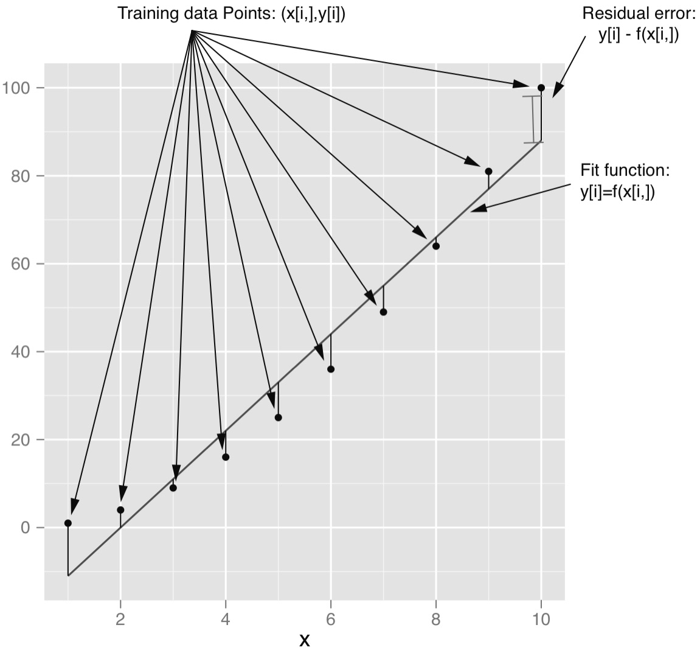
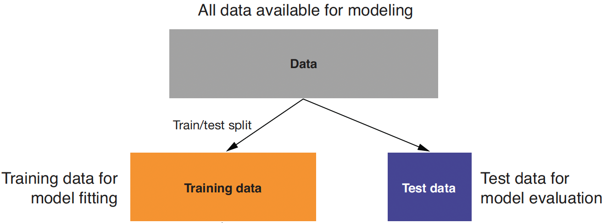
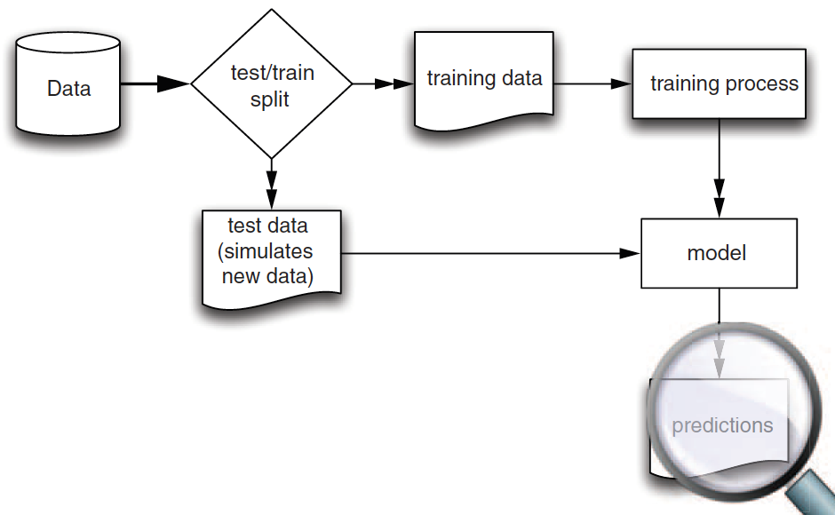
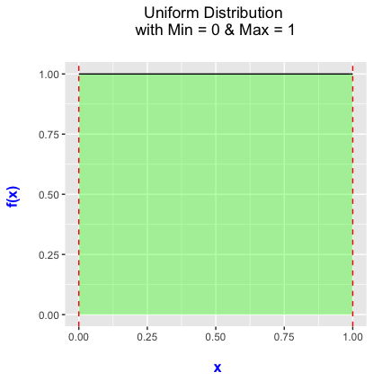

```{r setup, include = FALSE}
library(knitr)
library(kableExtra)
library(tidyverse)
library(NHSRtheme)
library(fontawesome)

# set default options
opts_chunk$set(echo = FALSE,
               fig.width = 7.252,
               fig.height = 4,
               comment = "#",
               dpi = 300)

knitr::knit_engines$set("markdown")

xaringanExtra::use_tile_view()
xaringanExtra::use_panelset()
xaringanExtra::use_clipboard()
xaringanExtra::use_webcam()
xaringanExtra::use_broadcast()
xaringanExtra::use_share_again()
xaringanExtra::style_share_again(
  share_buttons = c("twitter", "linkedin", "pocket")
)


xaringanExtra::use_extra_styles(
  hover_code_line = TRUE,         #<<
  mute_unhighlighted_code = F  #<<
)

# uncomment the following lines if you want to use the NHS-R theme colours by default
# scale_fill_continuous <- partial(scale_fill_nhs, discrete = FALSE)
# scale_fill_discrete <- partial(scale_fill_nhs, discrete = TRUE)
# scale_colour_continuous <- partial(scale_colour_nhs, discrete = FALSE)
# scale_colour_discrete <- partial(scale_colour_nhs, discrete = TRUE)
```


class: title-slide, left, bottom

# `r rmarkdown::metadata$title`
----
## **`r rmarkdown::metadata$subtitle`**
### `r rmarkdown::metadata$author`
### `r rmarkdown::metadata$date`


---
# Announcement
### <p style="color:#00449E"> Asynchronous Online Class

- We will have an asynchronous online class on November 22, 2022.

  - On Canvas, I will leave the web-link for the class recording before 8:00 AM, November 22, 2022.

---
class: inverse, center, middle

# Relational Data
<html><div style='float:left'></div><hr color='#EB811B' size=1px width=796px></html>


---
# Relational data


- It's rare that a data analysis involves only a single data frame.

- Collectively, multiple data frames are called *relational data*.

-  To work with relational data, we need verbs that work with pairs of data frames. 

  - **join** methods add new variables to one data frame from matching observations in another data frame.


---
# Relational data
### <p style="color:#00449E"> `nycflights13`

- `nycflights13` contains four data frames that are related to the data frame, `flights`, that we used in data transformation.


```{r, echo = T, eval = F}
library(nycflights13)
flights
airlines
airports
planes
weather
```


---
# Relational data
### <p style="color:#00449E"> `nycflights13`

- `flights` connects to ...

- `planes` via a single variable, `tailnum`.

- `airlines` through the `carrier` variable.

- `airports` in two ways: via the `origin` and `dest` variables.

- `weather` via `origin` (the location), and `year`, `month`, `day` and `hour` (the time).


---
# Relational data
### <p style="color:#00449E"> `nycflights13`

```{r, echo=FALSE, out.width = '66%', fig.align='center'}
knitr::include_graphics("../lec_figs/relational-nycflights.png")
```


---
# Relational data
### <p style="color:#00449E"> Keys

- A key is a variable (or a set of variables) that uniquely identifies an observation.
- Keys are used to connect each pair of data frames.
- There are two types of keys:

*1*. A **primary key** uniquely identifies an observation in its own data frame
  - E.g., `planes$tailnum` is a primary key for the `planes` data frame because it uniquely identifies each plane in the `planes` data frame.


*2*. A **foreign key** uniquely identifies an observation in another data frame. 
  - E.g,, `flights$tailnum` is a foreign key because it appears in the `flights` data frame where it matches each flight to a unique plane in `planes` data frame.


---
# Relational data
### <p style="color:#00449E"> Keys

- A variable can be both a primary key and a foreign key. 

  - E.g., `origin` is part of the `weather` primary key, and is also a foreign key for the `airports` data frame.


---
# Relational data
### <p style="color:#00449E"> Keys

- If a data frame lacks a primary key, it's sometimes useful to add **a surrogate key** that uniquely identifies an observation in the data frame.
  - A surrogate key can act as a primary key.
  - A primary key and the corresponding foreign key in another table form a **relation**.


- Relations between tables could be ...
  - One-to-one;
  - One-to-many (e.g., `airlines` and `airports`);
  - Many-to-one;
  - Many-to-many (e.g., `flights` and `airplanes`).


---
# Relational data
### <p style="color:#00449E"> Joins


- A join allows us to combine two data frames via key variables. 
- It first matches observations by their keys, then copies across variables from one data frame to the other.


```{r, echo = T, eval = F}
flights2 <- flights %>% 
  select(year:day, hour, origin, dest, tailnum, carrier)
flights2
airlines

flights2 %>%
  select(-origin, -dest) %>% 
  left_join(airlines, by = "carrier")
```


---
# Relational data
### <p style="color:#00449E"> Joins

```{r, echo=FALSE, out.width = '20%', fig.align='center'}
knitr::include_graphics("../lec_figs/join-setup.png")
```

.pull-left[
```{r, echo = T, eval = F}
x <- tribble(
  ~key, ~val_x,
     1, "x1",
     2, "x2",
     3, "x3" )
```
]
.pull-right[
```{r, echo = T, eval = F}
y <- tribble(
  ~key, ~val_y,
     1, "y1",
     2, "y2",
     4, "y3" )
```
]

- The colored column represents the "key" variable.
- The grey column represents the "value" column.


---
# Joins
### <p style="color:#00449E"> Inner join

- An **inner join** matches pairs of observations whenever their keys are equal:

```{r, echo=FALSE, out.width = '50%', fig.align='center'}
knitr::include_graphics("../lec_figs/join-inner.png")
```


```{r, echo = T, eval = F}
x %>% 
  inner_join(y, by = "key")
```


---
# Joins
### <p style="color:#00449E"> Outer join

- An *outer join* keeps observations that appear in at least one of the tables.


- A **left join** keeps all observations in `x`.
- A **right join** keeps all observations in `y`.
- A **full join** keeps all observations in `x` and `y`.


---
# Joins
### <p style="color:#00449E"> Outer join
.pull-left[
```{r, echo=FALSE, out.width = '100%', fig.align='center'}

```
]
.pull-right[
```{r, echo=FALSE, out.width = '100%', fig.align='center'}

```
]
```{r, echo=FALSE, out.width = '45%', fig.align='center'}

```


---
# Joins
### <p style="color:#00449E"> Left join

- The most commonly used join is the left join: 

- It preserves the original observations even when there isn't a match. 


---
# Joins
### <p style="color:#00449E"> Duplicate keys

- One data frame has duplicate keys (a one-to-many relationship). 
```{r, echo=FALSE, out.width = '40%', fig.align='center'}
knitr::include_graphics("../lec_figs/join-one-to-many.png")
```

.pull-left[
```{r, echo = T, eval = F}
x <- tribble(
  ~key, ~val_x,
     1, "x1",
     2, "x2",
     2, "x3",
     1, "x4")
```

]
.pull-right[
```{r, echo = T, eval = F}
y <- tribble(
  ~key, ~val_y,
     1, "y1",
     2, "y2")

left_join(x, y, by = "key")
```

]


---
# Joins - Duplicate keys

- Both data frames have duplicate keys (many-to-many relationship).
```{r, echo=FALSE, out.width = '35%', fig.align='center'}
knitr::include_graphics("../lec_figs/join-many-to-many.png")
```


.pull-left[
```{r, echo = T, eval = F}
x <- tribble(
  ~key, ~val_x,
     1, "x1",
     2, "x2",
     2, "x3",
     3, "x4" )
```

]

.pull-right[
```{r, echo = T, eval = F}
y <- tribble(
  ~key, ~val_y,
     1, "y1",
     2, "y2",
     2, "y3",
     3, "y4" )
left_join(x, y, by = "key")
```
]


---
# Joins
### <p style="color:#00449E"> Defining the key columns

- `by = NULL`: uses all variables that appear in both tables.
- `by = "a"`: uses only variable `a`.
- `by = c("a" = "b")`: match variable `a` in data frame `x` to variable `b` in data frame `y`.

.pull-left[
```{r, echo = T, eval = F}
flights2 %>% 
  left_join(weather)
  
flights2 %>% 
  left_join(planes, 
            by = "tailnum")
```
]

.pull-right[
```{r, echo = T, eval = F}
flights2 %>% 
  left_join(airports, 
            c("dest" = "faa"))
  
flights2 %>% 
  left_join(airports, 
            c("origin" = "faa"))
```
]


---
class: inverse, center, middle

# Strings
<html><div style='float:left'></div><hr color='#EB811B' size=1px width=796px></html>


---
# Strings
### <p style="color:#00449E"> Combining strings

- To count the length of string, use `str_length()`.
- To combine two or more strings, use `str_c()`:

- To control how strings are separated, add the `sep`.
- To collapse a vector of strings into a single string, add the `collapse`.

```{r, echo = T, eval = F}
str_length(c("a", "R for data science", NA))
str_c("x", "y", "z")
str_c(c("x", "y", "z"), sep = ", ")
str_c("prefix-", c("a", "b", "c"), "-suffix")
str_c(c("x", "y", "z"), collapse = ", ")
```


---
# Strings
### <p style="color:#00449E"> Subsetting strings

- We can extract parts of a string using `str_sub()`:

- `str_sub()` takes `start` and `end` arguments which give the position of the substring:.


```{r, echo = T, eval = F}
x <- c("Apple", "Banana", "Pear")
str_sub(x, 1, 3)

# negative numbers count backwards from end
str_sub(x, -3, -1)
```


---
# Strings
### <p style="color:#00449E"> Matching a pattern of strings

- To determine if a character vector matches a pattern, use `str_detect()`.
- `str_count()` tells us how many matches there are in a string.
- `str_replace()` and `str_replace_all()` allow us to replace matches with new strings.
- `str_replace_all()` can perform multiple replacements by supplying a named vector.

```{r, echo = T, eval = F}
x <- c("apple", "banana", "pear")

str_detect(x, "e")
str_count(x, "a")
str_replace(x, "a", "-")
str_replace_all(x, "a", "-")
```

---
# Strings
### <p style="color:#00449E"> Splitting strings

- Use `str_split()` to split a string up into pieces. 


```{r, echo = T, eval = F}
sentences %>%
  head(5) %>% 
  str_split(" ")
```


---
class: inverse, center, middle

# Factors
<html><div style='float:left'></div><hr color='#EB811B' size=1px width=796px></html>


---
# Factors
### <p style="color:#00449E"> Creating factors

- In `R`, factors are categorical variables, variables that have a fixed and known set of possible values.

```{r, echo = T, eval = F}
x1 <- c("Dec", "Apr", "Jan", "Mar")
```

- Using a string to record variable `x1` has two problems:
  1. There are only twelve possible months, and there's nothing saving us from typos.
  2. It doesn't sort in a useful way.

```{r, echo = T, eval = F}
x2 <- c("Dec", "Apr", "Jam", "Mar")
sort(x1)
```


---
# Factors
### <p style="color:#00449E"> Creating factors with `factor()`

- We can fix both of these problems with `factor()`. 
- To create a factor, we must start by creating a list of the valid `levels`.
- Any values not in the set will be silently converted to `NA`.
- If we omit the `levels`, they'll be taken from the data in alphabetical order:

.pull-left[
```{r, echo = T, eval = F}
months <- c(
  "Jan", "Feb", "Mar", "Apr", 
  "May", "Jun", "Jul", "Aug", 
  "Sep", "Oct", "Nov", "Dec")
x1 <- 
  c("Dec", "Apr", "Jan", "Mar")
y1 <- factor(x1, 
             levels = months)
sort(y1)
```
]

.pull-right[
```{r, echo = T, eval = F}
x2 <- 
  c("Dec", "Apr", "Jam", "Mar")

y2 <- factor(x2, 
             levels = months)
y2

factor(x1)
```
]


---
# Factors
### <p style="color:#00449E"> Creating factors with `factor()`

-  Sometimes we'd prefer that the order of the levels match the order of the first appearance in the data. 

- We can do that when creating the factor by setting levels to `unique()`.

- If we ever need to access the set of valid levels directly, we can do so with `levels()`.

```{r, echo = T, eval = F}
x1

f1 <- factor(x1, levels = unique(x1))
f1

levels(f1)
```


---
# Factors
### <p style="color:#00449E"> General Social Survey

- We're going to focus on the data frame, `forcats::gss_cat`.which is a sample of data from the General Social Survey.

- When factors are stored in a data frame, we can see them with `count()`.

```{r, echo = T, eval = F}
gss_cat

gss_cat %>%
  [?](race)
```


---
# Factors
### <p style="color:#00449E"> Modifying factor order

- It's often useful to change the order of the factor levels in a visualization.

- Imagine we want to explore the average number of hours spent watching TV per day across `relig`:

.pull-left[
```{r, echo = T, eval = F}
relig_summary <- gss_cat %>%
  group_by([?]) %>%
  summarize(
    age = [?](age, [?]),
    tvhours = [?](tvhours, [?]),
    n = [?]
  )
```
]
.pull-right[
```{r, echo = T, eval = F}
ggplot(relig_summary, 
       aes(tvhours, relig)) + 
  [?]()
```
]


---
# Factors
### <p style="color:#00449E"> Modifying factor order

- We can reorder the levels using `fct_reorder(f, x, fun)`, which can take three arguments.

- `f`: the factor whose levels we want to modify.
- `x`: a numeric vector that we want to use to reorder the levels.
- Optionally, `fun`: a function that's used if there are multiple values of `x` for each value of `f`. The default value is *median*.


```{r, echo = T, eval = F}
relig_summary %>%
  mutate(relig = [?](relig, tvhours)) %>%
  ggplot(aes(tvhours, relig)) + [?]()
```


---
# Factors
### <p style="color:#00449E"> Modifying factor order

- We can use `relevel()` to set the first level (*reference level*). 
- `relevel(x, ref = ...)` takes at least the two arguments: 
  - `x`: factor variable 
  - `ref`: reference level or first level
  
.pull-left[
```{r, echo = T, eval = F}
rincome_summary <- gss_cat %>%
  group_by([?]) %>%
  summarize(
    age = [?](age, [?]),
    tvhours = [?](tvhours, [?]),
    n = [?]
  )
```

]

.pull-right[
```{r, echo = T, eval = F}
ggplot(rincome_summary, 
       aes(age, [?](rincome, age) ) )  + 
  geom_point()
ggplot(rincome_summary, 
       aes(age, 
           [?](rincome, 
               "Not applicable") ) ) +
  geom_point()
```

]


---
class: inverse, center, middle

# Dates and Times
<html><div style='float:left'></div><hr color='#EB811B' size=1px width=796px></html>


---
# Dates and times


- The `lubridate` package makes it easier to work with dates and times in `R`.

```{r, echo = T, eval = F}
library(tidyverse)
library(lubridate)
library(nycflights13)
```


---
# Dates and times
### <p style="color:#00449E"> Creating date/times

- To get the current date or date-time we can use `today()` or `now()`.
- The `lubridate` functions are a combination of y, m, d, h, m, and s.

.pull-left[
```{r, echo = T, eval = F}
today()
now()
```
]
.pull-right[
```{r, echo = T, eval = F}
ymd("2017-01-31")
[?]("January 31st, 2017")
[?]("31-Jan-2017")

[?](20170131)

[?]("2017-01-31 20:11:59")
[?]("01/31/2017 08:01")

[?](20170131, [?] = "UTC")
```
]


---
# Dates and times
### <p style="color:#00449E"> Creating date/times

- To create a date/time from individual components, use `make_date()` for dates, or `make_datetime()` for date-times:


```{r, echo = T, eval = F}
flights %>% 
  select(year, month, day, hour, minute)
  
flights %>% 
  select(year, month, day, hour, minute) %>% 
  mutate(departure = [?](year, month, day, hour, minute))
  
flights %>% 
  select(year, month, day, hour, minute) %>% 
  mutate(departure = [?](year, month, day))
```


---
# Dates and times
### <p style="color:#00449E"> Creating date/times

- We can visualize time series data using `lubridate` functions.

```{r, echo = T, eval = F}
flights_dt %>% 
  ggplot(aes(dep_time)) + 
  geom_freqpoly(binwidth = 86400) # 86400 seconds = 1 day
  
flights_dt %>% 
  filter(dep_time < ymd(20130102)) %>% 
  ggplot(aes(dep_time)) + 
  geom_freqpoly(binwidth = 600) # 600 s = 10 minutes
```


---
# Dates and times
### <p style="color:#00449E"> Creating date/times

- `as_datetime()` and `as_date()` switch between a date-time and a date.


```{r, echo = T, eval = F}
[?](today())
[?](now())
```


---
class: inverse, center, middle

# Modeling Methods - Linear Regression
<html><div style='float:left'></div><hr color='#EB811B' size=1px width=796px></html>


---
# Linear Regression Methods
### <p style="color:#00449E"> Applications

- With linear regression, we can solve various types of real-world problems:

  - AdWord valuation: how much the company should spend to buy certain AdWords on search engines

  - Estimating price elasticity (the rate at which a price increase will decrease sales, and vice versa) of various products or product classes

  - Estimating the probability that a loan will default
  
  - Predicting how much a marketing campaign will increase traffic or sales


---
# Linear Regression 
### <p style="color:#00449E"> 

- Linear regression is the fundamental method you should always try for your empirical analysis.

  - The predicted outcome;
  
  - The relationship between the explanatory variables and the outcome variable.
  
  
- Issues related to the linear regression methods include ...
  
  - Omitted variable bias: bias in the model because of omitting important explanatory variables that are related with the existing explanatory variables;
  
  - Colinearity: too high correlation between the explanatory variables.
  


---
# Linear Regression 
### <p style="color:#00449E">  Example

- Suppose we want to predict personal income based on how many years a person lives. 

  - In other words, for every person `i`, we want to predict `PINCP[i]` based on `AGEP[i]`.
  
- We also want to estimate how an increase in `AGEP[i]` is associated with `PINCP[i]`.

---
# Linear Regression 
### <p style="color:#00449E">  Linear Relationship

- Linear regression assumes that ...

  - The outcome `PINCP[i]` is linearly related to the input `AGEP[i]`:

$$\texttt{PINCP[i]} \;=\quad \texttt{b0} \,+\, \texttt{b1*AGEP[i]} \,+\, \texttt{e[i]}$$
where `e[i]` is a statistical error term.


---
# Linear Regression 
### <p style="color:#00449E">  The Linear Relationship between `PINCP` and `AGEP`


```{r, echo=FALSE, out.width = '67%', fig.align='center'}

```


---
# Linear Regression 
### <p style="color:#00449E">  Example

- Suppose we also want to estimate how gender will affect personal income. 
- Linear regression assumes that ...
  - The outcome `PINCP[i]` is linearly related to each of the inputs `AGEP[i]` and `SEX[i]`:

$$\texttt{PINCP[i]} \;=\quad \texttt{f(AGEP[i], SEX[i])} \,+\, \texttt{e[i]} \qquad\qquad\qquad\qquad\\
\;=\quad \texttt{b0} \,+\, \texttt{b1*AGEP[i]} \,+\, \texttt{b2*SEX[i]}\,+\, \texttt{e[i]}$$
- A variable on the left-hand side is called an outcome variable.
- Variables on the right-hand side are called explanatory variables or input variables.
- Coefficients $\texttt{b[1]}, ... , \texttt{b[P]}\;$  on the right-hand side are called beta coefficients.


---
# Linear Regression 
### <p style="color:#00449E">  Goals of Linear Regression

-  The goals of linear regression are  ... 
  1. Find the estimated values of `b1` and `b2`: $\quad \hat{\texttt{b1}}$ and $\hat{\texttt{b2}}$.
  
  2. Make a prediction on `PINCP[i]` for each person `i`: $\quad \widehat{\texttt{PINCP}}\texttt{[i]}$.

$$\widehat{\texttt{PINCP}}\texttt{[i]} \;=\quad \hat{\texttt{b0}} \,+\, \hat{\texttt{b1}}\texttt{*AGEP[i]} \,+\, \hat{\texttt{b2}}\texttt{*SEX[i]}$$

- We will use the hat notation $(\,\hat{\texttt{ }}\,)$  to distinguish *estimated* beta coefficients and *predicted* outcomes from *true* values of beta coefficients and *true* values of outcome variables, respectively.

---
# Linear Regression 
### <p style="color:#00449E">  More Assumptions

- Assumptions on the linear regression model are that ...

  - The outcome variable is a linear combination of the explanatory variables.
  
  - Errors have a mean value of 0.
  
  - Errors are *uncorrelated* with explanatory variables.


---
# Linear Regression 
### <p style="color:#00449E"> Beta estimates

- Linear regression finds the beta coefficients $( \texttt{b[0]}, ... , \texttt{b[P]} )$ such that ...

  – The linear function $\texttt{f(x[i, ])}$ is as near as possible to
$\texttt{y[i]}$ for all $\texttt{(x[i, ], y[i])}$ pairs in the data.


- In other words, the estimator for the beta coefficients is chosen to minimize the sum of squares of the *residual errors* (SSR):

  -  $\texttt{Residual_Error[i] = y[i] - } \hat{\texttt{y}}\,\texttt{[i]}$.
  
  -  $\texttt{SSR} = \texttt{Residual_Error[1]}^{2} + \cdots + \texttt{Residual_Error[N]}^{2}$.


---
# Linear Regression 
### <p style="color:#00449E"> Example of Prediction

.pull-left[
- Linear regression often does an excellent job, even when the actual relation between $\texttt{x[i, ]}$ and $\texttt{y[i]}$ is not linear.

  - For example, $y = x^2\;$ vs. $\;f(x) = -22 + 11x$ 

]

.pull-right[

```{r, echo=FALSE, out.width = '100%', fig.align='center'}

```

]


---
# Linear Regression 
### <p style="color:#00449E"> Evaluating Models


- **Training data**: When we're building a model to make predictions or to identify the relationships, we need *data* to build the model.

- **Testing data**: We also need data to test whether the model works well on *new data*.

.pull-left[

- So, we split data into training and test sets when building a linear regression model.
]

.pull-right[
```{r, echo=FALSE, out.width = '100%', fig.align='center'}

```
]


---
# Linear Regression 
### <p style="color:#00449E"> Evaluating Models
- We need to ensure that our model will perform well in the real world.

```{r, echo=FALSE, out.width = '52%', fig.align='center', fig.cap="Schematic of model construction and evaluation"}

```


---
# Linear Regression 
### <p style="color:#00449E"> A Little Bit of Statistics for the Uniform Distribution

.pull-left[

- The probability density function for the uniform distribution looks like:


- With the uniform distribution, any values of $x$ between 0 and 1 is equally likely drawn.

]

.pull-right[

```{r, echo=FALSE, out.width = '75%', fig.align='center'}

```

]
- We will use the uniform distribution when splitting data into training and testing data sets.


---
class: inverse, center, middle

# Linear Regression using **R**
<html><div style='float:left'></div><hr color='#EB811B' size=1px width=796px></html>


---
# Linear Regression 
### <p style="color:#00449E"> Example of Linear Regression using **R**

- We will use the 2016 US Census PUMS dataset.
  - Full-time employees between 20 and 50 years of age with income between $1,000 and $250,000;

- Personal data recorded includes personal income and demographic variables:
  - `PINCP`: personal income
  - `AGEP`: age 
  - `SEX`: sex

- Use summary statistics and visualization to explore the data.


---
# Linear Regression 
### <p style="color:#00449E"> Example of Linear Regression using **R**
```{r, echo = T, eval= F}
# Importing the cleaned small sample of data
psub <- readRDS('YOUR_PATH_NAME_OF_FOLDER/PDSwR2-main/PUMS/psub.RDS')

# Making the random sampling reproducible by setting the random seed.
set.seed(3454351)

# Makes an uniform random variable to group and partition the data, `psub` 
gp <- [?]()

# Splits 50-50 into training and test sets 
# using filter() and gp
dtrain <- [?](psub, [?])
dtest <- [?](psub, [?])
```

