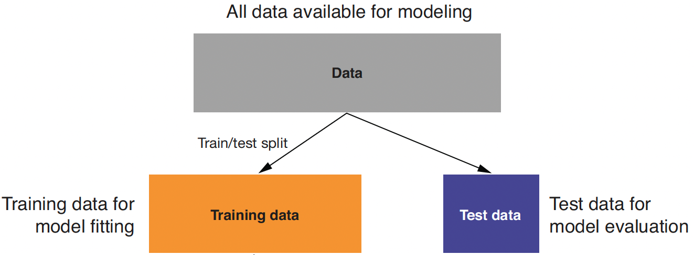

```{r setup, include = FALSE}
library(knitr)
library(kableExtra)
library(tidyverse)
library(NHSRtheme)
library(fontawesome)

# set default options
opts_chunk$set(echo = FALSE,
               fig.width = 7.252,
               fig.height = 4,
               comment = "#",
               dpi = 300)

knitr::knit_engines$set("markdown")

xaringanExtra::use_tile_view()
xaringanExtra::use_panelset()
xaringanExtra::use_clipboard()
xaringanExtra::use_webcam()
xaringanExtra::use_broadcast()
xaringanExtra::use_share_again()
xaringanExtra::style_share_again(
  share_buttons = c("twitter", "linkedin", "pocket")
)


xaringanExtra::use_extra_styles(
  hover_code_line = TRUE,         #<<
  mute_unhighlighted_code = F  #<<
)

# uncomment the following lines if you want to use the NHS-R theme colours by default
# scale_fill_continuous <- partial(scale_fill_nhs, discrete = FALSE)
# scale_fill_discrete <- partial(scale_fill_nhs, discrete = TRUE)
# scale_colour_continuous <- partial(scale_colour_nhs, discrete = FALSE)
# scale_colour_discrete <- partial(scale_colour_nhs, discrete = TRUE)
```


class: title-slide, left, bottom

# `r rmarkdown::metadata$title`
----
## **`r rmarkdown::metadata$subtitle`**
### `r rmarkdown::metadata$author`
### `r rmarkdown::metadata$date`


---
# Announcement
### <p style="color:#00449E"> Asynchronous Online Class

- We will have an asynchronous online class on November 22, 2022.

  - On Canvas, I will leave the web-link for the class recording before 8:00 AM, November 22, 2022.


---
class: inverse, center, middle

# Factors
<html><div style='float:left'></div><hr color='#EB811B' size=1px width=796px></html>


---
# Factors
### <p style="color:#00449E"> Creating factors

- In `R`, factors are categorical variables, variables that have a fixed and known set of possible values.

```{r, echo = T, eval = F}
x1 <- c("Dec", "Apr", "Jan", "Mar")
```

- Using a string to record variable `x1` has two problems:
  1. There are only twelve possible months, and there's nothing saving us from typos.
  2. It doesn't sort in a useful way.

```{r, echo = T, eval = F}
x2 <- c("Dec", "Apr", "Jam", "Mar")
sort(x1)
```


---
# Factors
### <p style="color:#00449E"> Creating factors with `factor()`

- We can fix both of these problems with `factor()`. 
- To create a factor, we must start by creating a list of the valid `levels`.
- Any values not in the set will be silently converted to `NA`.
- If we omit the `levels`, they'll be taken from the data in alphabetical order:

.pull-left[
```{r, echo = T, eval = F}
months <- c(
  "Jan", "Feb", "Mar", "Apr", 
  "May", "Jun", "Jul", "Aug", 
  "Sep", "Oct", "Nov", "Dec")
x1 <- 
  c("Dec", "Apr", "Jan", "Mar")
y1 <- factor(x1, 
             levels = months)
sort(y1)
```
]

.pull-right[
```{r, echo = T, eval = F}
x2 <- 
  c("Dec", "Apr", "Jam", "Mar")

y2 <- factor(x2, 
             levels = months)
y2

factor(x1)
```
]


---
# Factors
### <p style="color:#00449E"> Creating factors with `factor()`

-  Sometimes we'd prefer that the order of the levels match the order of the first appearance in the data. 

- We can do that when creating the factor by setting levels to `unique()`.

- If we ever need to access the set of valid levels directly, we can do so with `levels()`.

```{r, echo = T, eval = F}
x1

f1 <- factor(x1, levels = unique(x1))
f1

levels(f1)
```


---
# Factors
### <p style="color:#00449E"> General Social Survey

- We're going to focus on the data frame, `forcats::gss_cat`.which is a sample of data from the General Social Survey.

- When factors are stored in a data frame, we can see them with `count()`.

```{r, echo = T, eval = F}
gss_cat

gss_cat %>%
  [?](race)
```


---
# Factors
### <p style="color:#00449E"> Modifying factor order

- It's often useful to change the order of the factor levels in a visualization.

- Imagine we want to explore the average number of hours spent watching TV per day across `relig`:

.pull-left[
```{r, echo = T, eval = F}
relig_summary <- gss_cat %>%
  group_by([?]) %>%
  summarize(
    age = [?](age, [?]),
    tvhours = [?](tvhours, [?]),
    n = [?]
  )
```
]
.pull-right[
```{r, echo = T, eval = F}
ggplot(relig_summary, 
       aes(tvhours, relig)) + 
  [?]()
```
]


---
# Factors
### <p style="color:#00449E"> Modifying factor order

- We can reorder the levels using `fct_reorder(f, x, fun)`, which can take three arguments.

- `f`: the factor whose levels we want to modify.
- `x`: a numeric vector that we want to use to reorder the levels.
- Optionally, `fun`: a function that's used if there are multiple values of `x` for each value of `f`. The default value is *median*.


```{r, echo = T, eval = F}
relig_summary %>%
  mutate(relig = [?](relig, tvhours)) %>%
  ggplot(aes(tvhours, relig)) + [?]()
```


---
# Factors
### <p style="color:#00449E"> Modifying factor order

- We can use `relevel()` to set the first level (*reference level*). 
- `relevel(x, ref = ...)` takes at least the two arguments: 
  - `x`: factor variable 
  - `ref`: reference level or first level
  
.pull-left[
```{r, echo = T, eval = F}
rincome_summary <- gss_cat %>%
  group_by([?]) %>%
  summarize(
    age = [?](age, [?]),
    tvhours = [?](tvhours, [?]),
    n = [?]
  )
```

]

.pull-right[
```{r, echo = T, eval = F}
ggplot(rincome_summary, 
       aes(age, [?](rincome, age) ) )  + 
  geom_point()
ggplot(rincome_summary, 
       aes(age, 
           [?](rincome, 
               "Not applicable") ) ) +
  geom_point()
```

]


---
class: inverse, center, middle

# Dates and Times
<html><div style='float:left'></div><hr color='#EB811B' size=1px width=796px></html>


---
# Dates and times


- The `lubridate` package makes it easier to work with dates and times in `R`.

```{r, echo = T, eval = F}
library(tidyverse)
library(lubridate)
library(nycflights13)
```


---
# Dates and times
### <p style="color:#00449E"> Creating date/times

- To get the current date or date-time we can use `today()` or `now()`.
- The `lubridate` functions are a combination of y, m, d, h, m, and s.

.pull-left[
```{r, echo = T, eval = F}
today()
now()
```
]
.pull-right[
```{r, echo = T, eval = F}
ymd("2017-01-31")
[?]("January 31st, 2017")
[?]("31-Jan-2017")

[?](20170131)

[?]("2017-01-31 20:11:59")
[?]("01/31/2017 08:01")

[?](20170131, [?] = "UTC")
```
]


---
# Dates and times
### <p style="color:#00449E"> Creating date/times

- To create a date/time from individual components, use `make_date()` for dates, or `make_datetime()` for date-times:


```{r, echo = T, eval = F}
flights %>% 
  select(year, month, day, hour, minute)
  
flights %>% 
  select(year, month, day, hour, minute) %>% 
  mutate(departure = [?](year, month, day, hour, minute))
  
flights %>% 
  select(year, month, day, hour, minute) %>% 
  mutate(departure = [?](year, month, day))
```


---
# Dates and times
### <p style="color:#00449E"> Creating date/times

- We can visualize time series data using `lubridate` functions.

```{r, echo = T, eval = F}
flights_dt %>% 
  ggplot(aes(dep_time)) + 
  geom_freqpoly(binwidth = 86400) # 86400 seconds = 1 day
  
flights_dt %>% 
  filter(dep_time < ymd(20130102)) %>% 
  ggplot(aes(dep_time)) + 
  geom_freqpoly(binwidth = 600) # 600 s = 10 minutes
```


---
# Dates and times
### <p style="color:#00449E"> Creating date/times

- `as_datetime()` and `as_date()` switch between a date-time and a date.


```{r, echo = T, eval = F}
[?](today())
[?](now())
```


---
class: inverse, center, middle

# Modeling Methods - Linear Regression
<html><div style='float:left'></div><hr color='#EB811B' size=1px width=796px></html>


---
# Linear Regression Methods
### <p style="color:#00449E"> Applications

- With linear regression, we can solve various types of real-world problems:

  - AdWord valuation: how much the company should spend to buy certain AdWords on search engines

  - Estimating price elasticity (the rate at which a price increase will decrease sales, and vice versa) of various products or product classes

  - Estimating the probability that a loan will default
  
  - Predicting how much a marketing campaign will increase traffic or sales


---
# Linear Regression 
### <p style="color:#00449E"> 

- Linear regression is the fundamental method you should always try for your empirical analysis.

  - The predicted outcome;
  
  - The relationship between the explanatory variables and the outcome variable.
  
  
- Issues related to the linear regression methods include ...
  
  - **Omitted variable bias**: bias in the model because of omitting important explanatory variables that are related with the existing explanatory variables;
  
  - **Colinearity**: too high correlation between the explanatory variables.
  


---
# Linear Regression 
### <p style="color:#00449E">  Example

- Suppose we want to predict personal income based on how many years a person lives. 

  - In other words, for every person `i`, we want to predict `PINCP[i]` based on `AGEP[i]`.
  
- We also want to estimate how an increase in `AGEP[i]` is associated with `PINCP[i]`.

---
# Linear Regression 
### <p style="color:#00449E">  Linear Relationship

- Linear regression assumes that ...

  - The outcome `PINCP[i]` is linearly related to the input `AGEP[i]`:

$$\texttt{PINCP[i]} \;=\quad \texttt{b0} \,+\, \texttt{b1*AGEP[i]} \,+\, \texttt{e[i]}$$
where `e[i]` is a statistical error term.


---
# Linear Regression 
### <p style="color:#00449E">  The Linear Relationship between `PINCP` and `AGEP`


```{r, echo=FALSE, out.width = '67%', fig.align='center'}
knitr::include_graphics("../lec_figs/reg_pincp_age.png")
```


---
# Linear Regression 
### <p style="color:#00449E">  Example

- Suppose we also want to estimate how gender will affect personal income. 
- Linear regression assumes that ...
  - The outcome `PINCP[i]` is linearly related to each of the inputs `AGEP[i]` and `SEX[i]`:

$$\texttt{PINCP[i]} \;=\quad \texttt{f(AGEP[i], SEX[i])} \,+\, \texttt{e[i]} \qquad\qquad\qquad\qquad\\
\;=\quad \texttt{b0} \,+\, \texttt{b1*AGEP[i]} \,+\, \texttt{b2*SEX[i]}\,+\, \texttt{e[i]}$$
- A variable on the left-hand side is called an outcome variable.
- Variables on the right-hand side are called explanatory variables or input variables.
- Coefficients $\texttt{b[1]}, ... , \texttt{b[P]}\;$  on the right-hand side are called beta coefficients.


---
# Linear Regression 
### <p style="color:#00449E">  Goals of Linear Regression

-  The goals of linear regression are  ... 
  1. Find the estimated values of `b1` and `b2`: $\quad \hat{\texttt{b1}}$ and $\hat{\texttt{b2}}$.
  
  2. Make a prediction on `PINCP[i]` for each person `i`: $\quad \widehat{\texttt{PINCP}}\texttt{[i]}$.

$$\widehat{\texttt{PINCP}}\texttt{[i]} \;=\quad \hat{\texttt{b0}} \,+\, \hat{\texttt{b1}}\texttt{*AGEP[i]} \,+\, \hat{\texttt{b2}}\texttt{*SEX[i]}$$

- We will use the hat notation $(\,\hat{\texttt{ }}\,)$  to distinguish *estimated* beta coefficients and *predicted* outcomes from *true* values of beta coefficients and *true* values of outcome variables, respectively.

---
# Linear Regression 
### <p style="color:#00449E">  More Assumptions

- Assumptions on the linear regression model are that ...

  - The outcome variable is a linear combination of the explanatory variables.
  
  - Errors have a mean value of 0.
  
  - Errors are *uncorrelated* with explanatory variables.


---
# Linear Regression 
### <p style="color:#00449E"> Beta estimates

- Linear regression finds the beta coefficients $( \texttt{b[0]}, ... , \texttt{b[P]} )$ such that ...

  – The linear function $\texttt{f(x[i, ])}$ is as near as possible to
$\texttt{y[i]}$ for all $\texttt{(x[i, ], y[i])}$ pairs in the data.


- In other words, the estimator for the beta coefficients is chosen to minimize the sum of squares of the *residual errors* (SSR):

  -  $\texttt{Residual_Error[i] = y[i] - } \hat{\texttt{y}}\,\texttt{[i]}$.
  
  -  $\texttt{SSR} = \texttt{Residual_Error[1]}^{2} + \cdots + \texttt{Residual_Error[N]}^{2}$.


---
# Linear Regression 
### <p style="color:#00449E"> Example of Prediction

.pull-left[
- Linear regression often does an excellent job, even when the actual relation between $\texttt{x[i, ]}$ and $\texttt{y[i]}$ is not linear.

  - For example, $y = x^2\;$ vs. $\;f(x) = -22 + 11x$ 

]

.pull-right[

```{r, echo=FALSE, out.width = '100%', fig.align='center'}
knitr::include_graphics("../lec_figs/pds_fig7_3.png")
```

]


---
# Linear Regression 
### <p style="color:#00449E"> Evaluating Models


- **Training data**: When we're building a model to make predictions or to identify the relationships, we need *data* to build the model.

- **Testing data**: We also need data to test whether the model works well on *new data*.

.pull-left[

- So, we split data into training and test sets when building a linear regression model.
]

.pull-right[
```{r, echo=FALSE, out.width = '100%', fig.align='center'}

```
]


---
# Linear Regression 
### <p style="color:#00449E"> Evaluating Models
- We need to ensure that our model will perform well in the real world.

```{r, echo=FALSE, out.width = '52%', fig.align='center', fig.cap="Schematic of model construction and evaluation"}
knitr::include_graphics("../lec_figs/pds_fig6_6.png")
```


---
# Linear Regression 
### <p style="color:#00449E"> A Little Bit of Statistics for the Uniform Distribution

.pull-left[

- The probability density function for the uniform distribution looks like:


- With the uniform distribution, any values of $x$ between 0 and 1 is equally likely drawn.

]

.pull-right[

```{r, echo=FALSE, out.width = '75%', fig.align='center'}
knitr::include_graphics("../lec_figs/unifpdf.png")
```

]
- We will use the uniform distribution when splitting data into training and testing data sets.


---
class: inverse, center, middle

# Linear Regression using **R**
<html><div style='float:left'></div><hr color='#EB811B' size=1px width=796px></html>


---
# Linear Regression 
### <p style="color:#00449E"> Example of Linear Regression using **R**

- We will use the 2016 US Census PUMS dataset.
  - Full-time employees between 20 and 50 years of age with income between $1,000 and $250,000;

- Personal data recorded includes personal income and demographic variables:
  - `PINCP`: personal income
  - `AGEP`: age 
  - `SEX`: sex


---
# Linear Regression 
### <p style="color:#00449E"> Example of Linear Regression using **R**
```{r, echo = T, eval= F}
# Importing the cleaned small sample of data
psub <- readRDS( url('https://bcdanl.github.io/data/psub.RDS') )

# Making the random sampling reproducible by setting the random seed.
set.seed(3454351) # 3454351 is just any number.
# The set.seed() function sets the starting number 
# used to generate a sequence of random numbers.

# The set.seed() ensures that we get the same result 
# if we start with that same seed each time 
# we run the same random process, 
# so that we can replicate the same random numbers.

# Makes a random variable to group and partition the data 
# using  runif(),
# a random number generator from uniform distribution : 
# How many random numbers do we need?
gp <- [?]

# Splits 50-50 into training and test sets 
# using filter() and gp
dtrain <- [?](psub, gp >= .5)
dtest <- [?](psub,  gp < .5)
```


---
# Linear Regression 
### <p style="color:#00449E"> Exploratory Data Analysis

- Use summary statistics and visualization to explore the data, particularly for the following variables:
  - `PINCP`: personal income
  - `AGEP`: age 
  - `SEX`: sex


---
# Linear Regression 
### <p style="color:#00449E"> Building a linear regression model using `lm()`

```{r, echo = T, eval= F}
model <- lm(formula = PINCP ~ AGEP + SEX, 
            data = dtrain)

model <- lm(PINCP ~ AGEP + SEX, 
            data = dtrain)  # we can skip 'formula' parameter in the lm() function.
```

In the above line of R commands, ...
- `model`: R object to save the estimation result of linear regression
-  `lm()`: Linear regression modeling function
- `PINCP $\sim$ AGEP + SEX`:  Formula for linear regression

- `PINCP`: Outcome/Dependent variable
- `AGEP, SEX`: Input/Independent/Explanatory variables

- `dtrain`: Data frame to use for training


---
# Linear Regression using **R**
### <p style="color:#00449E"> Making predictions with a linear regression model using `predict()`

```{r, echo = T, eval= F}
dtest$pred <-  predict(model, 
                       newdata = dtest)
```

In the above line of R commands, ...

- `dtest$pred`: Store the prediction as a new column `pred` in the `dtest` data frame
- `predict()`: Prediction function
- `model`: R object to save the estimation result of linear regression
- `dtest`: Data frame to use in prediction

- We can also make prediction using `dtrain` data frame instead.


---
# Linear Regression using **R**
### <p style="color:#00449E"> Interpreting the Result of Linear Regression using `R`

```{r, echo = T, eval= F}
summary(model)   # This produces the output.
```


```{r, echo=FALSE, out.width = '67%', fig.align='center'}
knitr::include_graphics("../lec_figs/pds_fig7_10a.png")
```


---
# Linear Regression using **R**
### <p style="color:#00449E"> Indicator variables

- Linear regression handles a string-valued categorical variable with `m` possible levels
by converting it to `m-1` indicator variables, and the rest **1** category becomes a reference level.


- E.g., an observation `i` of the indicator variable, `SEXFemale`, is follows: 


$$
&\qquad\texttt{SEXFemale[i] }\notag\\
&= \left\{\begin{matrix}
\texttt{1} & \text{if a person \texttt{i} is \texttt{female}};\\ 
\texttt{0} & \text{otherwise}.\qquad\qquad\qquad\,
\end{matrix}\right.\notag
$$

- The level `male` becomes a reference level.

- The reference level of a variable is the baseline that other values of the variable are compared to.


---
# Linear Regression using **R**
### <p style="color:#00449E"> Running Linear Regression using **R**

- If the independent variable includes categorical/factor variables, you can set a reference level for each categorical/factor variable using `relevel(VARIABLE, ref = "LEVEL")`.


```{r, echo = T, eval= F}
dtrain$SEX, <- relevel(dtrain$SEX, ref = "Male") 

model <- lm(log(PINCP) ~ AGEP + SEX, 
            data = dtrain)
            
summary(model)
```


- E.g., an observation `i` of the indicator variable, `SEXMale`, is follows: 

$$
&\qquad\texttt{SEXMale[i] }\notag\\
&= \left\{\begin{matrix}
\texttt{1} & \text{if a person \texttt{i} is \texttt{male}};\\ 
\texttt{0} & \text{otherwise}.\qquad\qquad\quad
\end{matrix}\right.\notag
$$

- The level `female` now becomes a reference level.


---
# Linear Regression using **R**
### <p style="color:#00449E"> Interpreting Estimated Coefficients
The model is ...
$$
\texttt{PINCP[i]} \;=\quad &\texttt{b0} \,+\, \texttt{b1*AGEP[i]} \,+\, \texttt{b2*SEX.Male[i]}\,+\, \texttt{e[i]}.\notag
$$

All else being equal, ...

- The model gives an estimated bonus of `b1` to the income for being one year older than the equivalent person (same sex but one year younger).

- All else being equal, if `AGEP` increases by one unit, `PINCP` increases by `b1`.


- The model gives an estimated bonus of `b2` to the income for being a male relative to the equivalent female person (same age but different gender).

- All else being equal, if `SEX.Male` increases by one unit, `PINCP` increases by `b2`.


---
# Linear Regression using **R**
### <p style="color:#00449E"> Interpreting Estimated Coefficients
Consider the predicted incomes of the two male persons, `Ben` and `Bob`, whose ages are 51 and 50 respectively.

$$
\widehat{\texttt{PINCP[Ben]}} \;=\quad &\hat{\texttt{b0}} \,+\, \hat{\texttt{b1}}\texttt{*AGEP[Ben]} \,+\, \hat{\texttt{b2}}\texttt{*SEX.Male[Ben]}\notag\\
\widehat{\texttt{PINCP[Bob]}} \;=\quad &\hat{\texttt{b0}} \,+\, \hat{\texttt{b1}}\texttt{*AGEP[Bob]} \,+\, \hat{\texttt{b2}}\texttt{*SEX.Male[Bob]}\notag
$$

$$
&\widehat{\texttt{PINCP[Ben]}} \,-\, \widehat{\texttt{PINCP[Bob]}}  \notag\\
\;=\quad &\hat{\texttt{b1}}\texttt{*}\texttt{(\texttt{AGEP[Ben]} - \texttt{AGEP[Bob]})}\notag\\
\;=\quad &\hat{\texttt{b1}}\texttt{*}\texttt{(51 - 50)}\notag\\
\;=\quad &\hat{\texttt{b1}}\notag
$$


---
# Linear Regression using **R**
### <p style="color:#00449E"> Interpreting Estimated Coefficients
Consider the predicted incomes of the two persons, `Ben` and `Linda`, whose ages are the same as 50. `Ben` is `male` and `Linda` is `female`.

$$
\widehat{\texttt{PINCP[Ben]}} \;=\quad &\hat{\texttt{b0}} \,+\, \hat{\texttt{b1}}\texttt{*AGEP[Ben]} \,+\, \hat{\texttt{b2}}\texttt{*SEX.Male[Ben]}\notag\\
\widehat{\texttt{PINCP[Linda]}} \;=\quad &\hat{\texttt{b0}} \,+\, \hat{\texttt{b1}}\texttt{*AGEP[Linda]} \,+\, \hat{\texttt{b2}}\texttt{*SEX.Male[Linda]}\notag
$$

$$
&\widehat{\texttt{PINCP[Ben]}} \,-\, \widehat{\texttt{PINCP[Linda]}}  \notag\\
\;=\quad &\hat{\texttt{b2}}\texttt{*}\texttt{(\texttt{SEX.Male[Ben]} - \texttt{SEX.Male[Linda]})}\notag\\
\;=\quad &\hat{\texttt{b2}}\texttt{*}\texttt{(1 - 0)}\notag\\
\;=\quad &\hat{\texttt{b2}}\notag
$$


---
# Linear Regression using **R**
### <p style="color:#00449E"> R-squared

- R-squared is a measure of how well the model “fits” the data, or its “goodness of fit.”
- R-squared can be thought of as what fraction of the `y`'s variation is explained by the
independent variables.
- You want R-squared to be fairly large (1.0 is the largest you can achieve) and R-squareds that are similar on test and training.
- R-squared will be higher for models with more input parameters, independent of whether the additional variables actually improve the model or not.

- The adjusted R-squared is the multiple R-squared penalized for the number of input variables.


---
# Linear Regression using **R**
### <p style="color:#00449E"> Running Linear Regression using **R**

- The following two types of visualization from the linear regression are useful to determine the quality of linear regression:

1. Actual vs. predicted outcome plot;
2. Residual plot.


---
# Linear Regression using **R**
### <p style="color:#00449E"> Actual vs. Predicted Outcomes

- The following is a plot of actual income as a function of predicted income.


```{r, echo = T, eval= F}
ggplot( data = dtest, 
        aes(x = pred, y = PINCP) ) +
  geom_point( alpha = 0.2, color = "darkgray" ) +
  geom_smooth( color = "darkblue" ) +  
  geom_abline( color = "red", linetype = 2 )  # Plotting the line, y = x, perfect prediction line
```


---
# Linear Regression using **R**
### <p style="color:#00449E"> Residual Plot

- The following is the plot of residual errors.

- `Residual[i] = y[i] -  Predicted_y[i]`.


```{r, echo = T, eval= F}
ggplot(data = dtest, aes(x = pred,
                         y = PINCP - pred)) +
  geom_point(alpha = 0.2, color = "darkgray") +
  geom_smooth( color = "darkblue" ) +   
  geom_hline( aes( yintercept = 0 ),  # perfect prediction 
              color = "red", linetype = 2) + 
  xlab('Predicted PINCP') +
  ylab("Residual error")
```


---
# Linear Regression using **R**
### <p style="color:#00449E"> Running Linear Regression using **R**


- From the plot of actual vs. predicted outcomes and the plot of residuals, ask the following the two questions yourself:

- On average, are the predictions correct?
- Are there systematic errors?


```{r, echo=FALSE, out.width = '67%', fig.align='center', fig.cap="An example of systematic errors in model predictions"}
knitr::include_graphics("../lec_figs/pds_fig7_8.png")
```


---
# Linear Regression using **R**
### <p style="color:#00449E"> Example of Linear Regression using **R**


- In the 2016 US Census PUMS dataset, personal data recorded includes occupation, level of education, personal income, and many other demographic variables.

- `COW`: class of worker
- `SCHL`: level of education


---
# Linear Regression using **R**
### <p style="color:#00449E"> Example of Linear Regression using **R**

- Suppose we also want to assess how the mean of personal income varies with (1) a bachelor's degree, (2) a class of work on personal income, (3) age, and (4) gender.

1. Conduct the exploratory data analysis.
2. Based on the visualization, set a hypothesis regarding the relationship between having bachelor's degree and `PINCP`.
3. Train the linear regression model.
4. Interpret the beta coefficients from the linear regression result.
5. Calculate the predicted `PINCP` using the testing data.
6. Draw the actual vs. predicted outcome plot and the residual plot.


