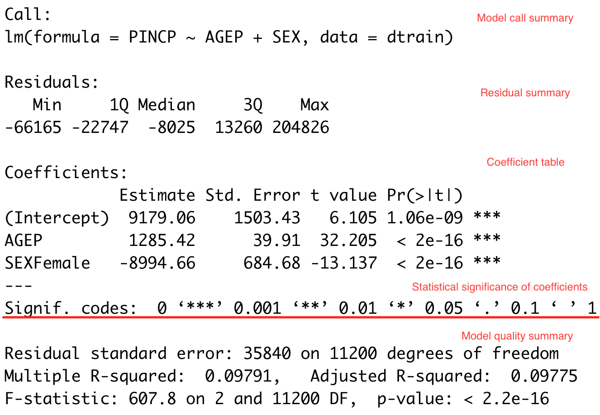
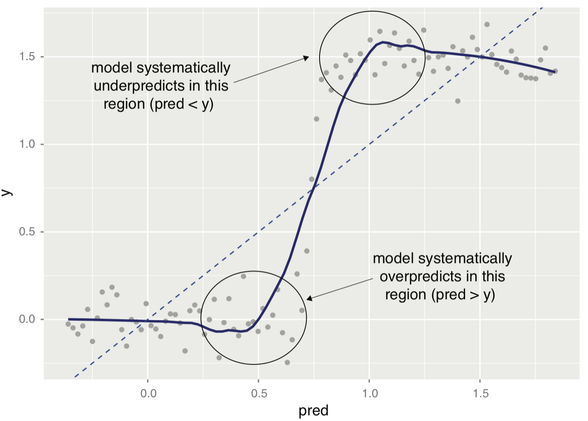
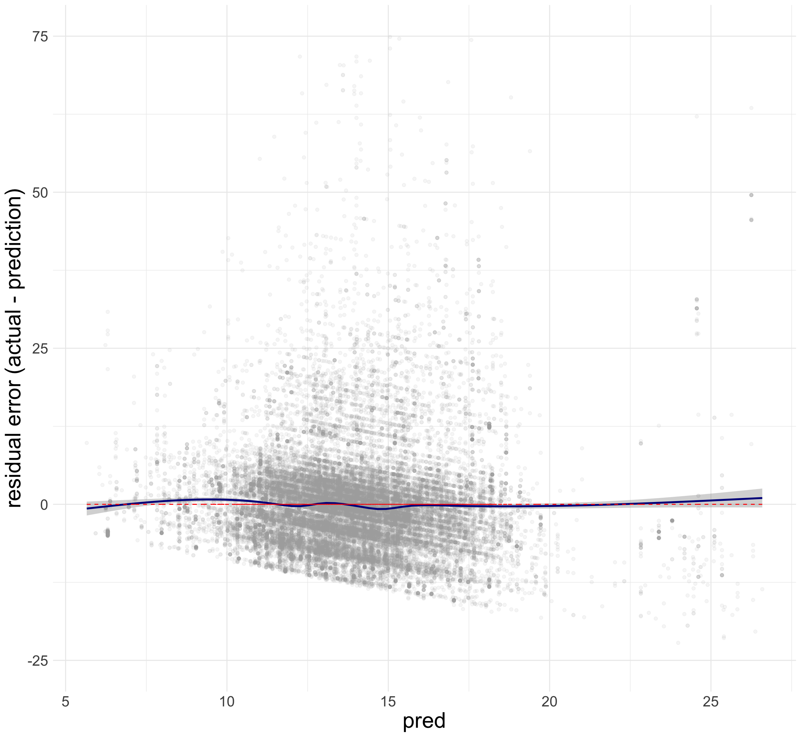

```{r setup, include = FALSE}
library(knitr)
library(kableExtra)
library(tidyverse)
library(NHSRtheme)
library(fontawesome)

# set default options
opts_chunk$set(echo = FALSE,
               fig.width = 7.252,
               fig.height = 4,
               comment = "#",
               dpi = 300)

knitr::knit_engines$set("markdown")

xaringanExtra::use_tile_view()
xaringanExtra::use_panelset()
xaringanExtra::use_clipboard()
xaringanExtra::use_webcam()
xaringanExtra::use_broadcast()
xaringanExtra::use_share_again()
xaringanExtra::style_share_again(
  share_buttons = c("twitter", "linkedin", "pocket")
)


xaringanExtra::use_extra_styles(
  hover_code_line = TRUE,         #<<
  mute_unhighlighted_code = F  #<<
)

# uncomment the following lines if we want to use the NHS-R theme colours by default
# scale_fill_continuous <- partial(scale_fill_nhs, discrete = FALSE)
# scale_fill_discrete <- partial(scale_fill_nhs, discrete = TRUE)
# scale_colour_continuous <- partial(scale_colour_nhs, discrete = FALSE)
# scale_colour_discrete <- partial(scale_colour_nhs, discrete = TRUE)
```


class: title-slide, left, bottom

# `r rmarkdown::metadata$title`
----
## **`r rmarkdown::metadata$subtitle`**
### `r rmarkdown::metadata$author`
### `r rmarkdown::metadata$date`


---
class: inverse, center, middle

# Modeling Methods - Linear Regression
<html><div style='float:left'></div><hr color='#EB811B' size=1px width=796px></html>


---
# Linear Regression 
### <p style="color:#00449E">  Example

- Suppose we also want to estimate how gender will affect personal income. 
- Linear regression assumes that ...
  - The outcome `PINCP[i]` is linearly related to each of the inputs `AGEP[i]` and `SEX[i]`:

$$\texttt{PINCP[i]} \;=\quad \texttt{f(AGEP[i], SEX[i])} \,+\, \texttt{e[i]} \qquad\qquad\qquad\qquad\\
\;=\quad \texttt{b0} \,+\, \texttt{b1*AGEP[i]} \,+\, \texttt{b2*SEX[i]}\,+\, \texttt{e[i]}$$
- A variable on the left-hand side is called an outcome variable or a dependent variable.
- Variables on the right-hand side are called explanatory variables, independent variables, or input variables.
- Coefficients $\texttt{b[1]}, ... , \texttt{b[P]}\;$  on the right-hand side are called beta coefficients.


---
# Linear Regression 
### <p style="color:#00449E">  Goals of Linear Regression

-  The goals of linear regression are  ... 
  1. Find the estimated values of `b1` and `b2`: $\quad \hat{\texttt{b1}}$ and $\hat{\texttt{b2}}$.
  
  2. Make a prediction on `PINCP[i]` for each person `i`: $\quad \widehat{\texttt{PINCP}}\texttt{[i]}$.

$$\widehat{\texttt{PINCP}}\texttt{[i]} \;=\quad \hat{\texttt{b0}} \,+\, \hat{\texttt{b1}}\texttt{*AGEP[i]} \,+\, \hat{\texttt{b2}}\texttt{*SEX[i]}$$

- We will use the hat notation $(\,\hat{\texttt{ }}\,)$  to distinguish *estimated* beta coefficients and *predicted* outcomes from *true* values of beta coefficients and *true* values of outcome variables, respectively.

---
# Linear Regression 
### <p style="color:#00449E">  Assumptions on Linear Regression

- Assumptions on the linear regression model are that ...

  - The outcome variable is a linear combination of the explanatory variables.
  
  - Errors have a mean value of 0.
  
  - Errors are *uncorrelated* with explanatory variables.


---
# Linear Regression 
### <p style="color:#00449E"> Beta estimates

- Linear regression finds the beta coefficients $( \texttt{b[0]}, ... , \texttt{b[P]} )$ such that ...

  – The linear function $\texttt{f(x[i, ])}$ is as near as possible to
$\texttt{y[i]}$ for all $\texttt{(x[i, ], y[i])}$ pairs in the data.


- In other words, the estimator for the beta coefficients is chosen to minimize the sum of squares of the *residual errors* (SSR):

  -  $\texttt{Residual_Error[i] = y[i] - } \hat{\texttt{y}}\,\texttt{[i]}$.
  
  -  $\texttt{SSR} = \texttt{Residual_Error[1]}^{2} + \cdots + \texttt{Residual_Error[N]}^{2}$.


---
# Linear Regression 
### <p style="color:#00449E"> Evaluating Models


- **Training data**: When we're building a model to make predictions or to identify the relationships, we need *data* to build the model.

- **Testing data**: We also need data to test whether the model works well on *new data*.

.pull-left[

- So, we split data into training and test sets when building a linear regression model.
]

.pull-right[
```{r, echo=FALSE, out.width = '100%', fig.align='center'}
knitr::include_graphics("../lec_figs/pds_fig4_12.png")
```
]


---
class: inverse, center, middle

# Linear Regression using **R**
<html><div style='float:left'></div><hr color='#EB811B' size=1px width=796px></html>


---
# Linear Regression 
### <p style="color:#00449E"> Example of Linear Regression using **R**

- Let's use the 2016 US Census PUMS dataset.
  - Full-time employees between 20 and 50 years of age with income between $1,000 and $250,000;

- Personal data recorded includes personal income and demographic variables:
  - `PINCP`: personal income
  - `AGEP`: age 
  - `SEX`: sex


---
# Linear Regression 
### <p style="color:#00449E"> Spliting Data into Training and Testing Data


.panelset[

.panel[.panel-name[Step 1. set.seed()]
```{r, echo = T, eval= F}
# Importing the cleaned small sample of data
psub <- readRDS( url('https://bcdanl.github.io/data/psub.RDS') )

# Making the random sampling reproducible by setting the random seed.
set.seed(3454351) # 3454351 is just any number.
# The set.seed() function sets the starting number 
# used to generate a sequence of random numbers.

# With set.seed(), we can replicate the random number generation:
# If we start with that same seed number in the set.seed() each time, 
# we run the same random process, 
# so that we can replicate the same random numbers.
```

]

.panel[.panel-name[Step 2. runif()]
```{r, echo = T, eval= F}
# How many random numbers do we need?
gp <- runif( nrow(psub) ) 
# a number generation from a random variable that follows Unif(0,1)

# Splits 50-50 into training and test sets 
# using filter() and gp

dtrain <- filter(psub, gp >= .5) 
dtest <- filter(psub,  gp < .5)
# A vector can be used for CONDITION in the filter(data.frame, CONDITION) 
# if the length of the vector is the same as that of the data.frame.


```
]

]

---
# Linear Regression 
### <p style="color:#00449E"> Exploratory Data Analysis (EDA)

- Use summary statistics and visualization to explore the data, particularly for the following variables:

  - `PINCP`: personal income
  - `AGEP`: age 
  - `SEX`: sex


- It's often a better idea to get some sense of how the data behaves through EDA before doing any statistical analysis.

```{r, echo = T, eval = F}
# install.packages("GGally")  # to use GGally::ggpairs()
ggpairs( select(dtrain, PINCP, AGEP, SEX) )  # for correlogram or correlation matrix
```


---
# Linear Regression 
### <p style="color:#00449E"> Building a linear regression model using `lm()`

```{r, echo = T, eval= F}
model <- lm(formula = PINCP ~ AGEP + SEX, 
            data = dtrain)
```
In the above line of R commands, ...
- `model`: R object to save the estimation result of linear regression
-  `lm()`: Linear regression modeling function
- `PINCP ~ AGEP + SEX`:  Formula for linear regression
- `PINCP`: Outcome/Dependent variable
- `AGEP, SEX`: Input/Independent/Explanatory variables
- `dtrain`: Data frame to use for training


---
# Linear Regression using **R**
### <p style="color:#00449E"> Making predictions with a linear regression model using `predict()`

```{r, echo = T, eval= F}
dtest$pred <-  predict(model, 
                       newdata = dtest)
```

- In the above line of R commands, ...
  - `dtest$pred`: Adding a new column `pred` to the `dtest` data frame. `mutate()` also works.
  - `predict()`: Function to get the predicted outcome using `model` and `dtest`
  - `model`: R object to save the estimation result of linear regression
  - `dtest`: Data frame to use in prediction


- We can make prediction using `dtrain` data frame too.


---
# Linear Regression using **R**
### <p style="color:#00449E"> Summary of the regression result

```{r, echo = T, eval= F}
summary(model)   # This produces the output of the linear regression.
```


```{r, echo=FALSE, out.width = '60%', fig.align='center'}

```


---
# Linear Regression using **R**
### <p style="color:#00449E"> Getting Estimates of Beta Coefficients
- `coef()` returns the beta estimates:

```{r, echo = T, eval= F}
coef(model)   
coef(model)['AGEP']
```


---
# Linear Regression using **R**
### <p style="color:#00449E"> Indicator variables

- Linear regression handles a factor variable with `m` possible levels by converting it to `m-1` indicator variables, and the rest `1` category, the first level of the factor variable, becomes a reference level.


- The value of any indicator variable is either 0 or 1.

- E.g., the indicator variable, `SEXFemale`, is follows: 

$$
\texttt{SEXFemale[i] }\\
= \begin{cases}
\texttt{1} & \text{if a person } \texttt{i} \text{ is } \texttt{female};\\\\
\texttt{0} & \text{otherwise}.\qquad\qquad\quad\,
\end{cases}
$$

- The level `male` becomes a reference level when interpreting the beta estimate for `SEXFemale`.


---
# Linear Regression using **R**
### <p style="color:#00449E"> Setting a reference level

- If the independent variable includes factor variables, we can set a reference level for each factor variable using `relevel(VARIABLE, ref = "LEVEL")`.

.panelset[

.panel[.panel-name[code]
```{r, echo = T, eval= F}
dtrain$SEX <- relevel(dtrain$SEX, ref = "Female") 

model <- lm(PINCP ~ AGEP + SEX, 
            data = dtrain)
            
summary(model)
```
]

.panel[.panel-name[variable]

- E.g., the indicator variable, `SEXMale`, is follows: 

$$
\texttt{SEXMale[i] }\\
= \begin{cases}
\texttt{1} & \text{if a person } \texttt{i} \text{ is } \texttt{male};\\\\ 
\texttt{0} & \text{otherwise}.\qquad\qquad\quad
\end{cases}
$$

- The level `Female` now becomes a reference level.

- Note: Changing the reference level does not change the regression result.
]

]


---
# Linear Regression using **R**
### <p style="color:#00449E"> Interpreting Estimated Coefficients
The model is ...


$$\texttt{PINCP[i]} \;=\quad \texttt{b0} \,+\, \texttt{b1*AGEP[i]} \,+\,\texttt{b2*SEX.Male[i]}\,+\, \texttt{e[i]}$$

All else being equal, ...

.panelset[

.panel[.panel-name[`AGEP`]

- All else being equal, an increase in `AGEP` by one unit is associated with an increase in `PINCP` by `b1`.


]

.panel[.panel-name[`SEX.Male`]

- All else being equal, an increase in `SEX.Male` by one unit is associated with an increase in `PINCP` by `b2`.

- All else being equal, being a male relative to being a female is associated with an increase in `PINCP` by `b2`.

]

]


---
# Linear Regression using **R**
### <p style="color:#00449E"> Interpreting Estimated Coefficients
Consider the predicted incomes of the two male persons, `Ben` and `Bob`, whose ages are 51 and 50 respectively.


$$\widehat{\texttt{PINCP[Ben]}} \;=\quad \hat{\texttt{b0}} \,+\, \hat{\texttt{b1}}\texttt{ * AGEP[Ben]} \,+\, \hat{\texttt{b2}}\texttt{ * SEX.Male[Ben]}\\
\widehat{\texttt{PINCP[Bob]}} \;=\quad \hat{\texttt{b0}} \,+\, \hat{\texttt{b1}}\texttt{ * AGEP[Bob]} \,+\, \hat{\texttt{b2}}\texttt{ * SEX.Male[Bob]}$$

$$\Leftrightarrow\qquad\widehat{\texttt{PINCP[Ben]}} \,-\, \widehat{\texttt{PINCP[Bob]}}\qquad  \\
\;=\quad \hat{\texttt{b1}}\texttt{ * }(\texttt{AGEP[Ben]} - \texttt{AGEP[Bob]})\\
\;=\quad \hat{\texttt{b1}}\texttt{ * }\texttt{(51 - 50)}\qquad\qquad\quad\;\;\\
\;=\quad \hat{\texttt{b1}}\qquad\qquad\qquad\qquad\quad\;\;\;\,$$


---
# Linear Regression using **R**
### <p style="color:#00449E"> Interpreting Estimated Coefficients
Consider the predicted incomes of the two persons, `Ben` and `Linda`, whose ages are the same as 50. `Ben` is `male` and `Linda` is `female`.

$$\widehat{\texttt{PINCP[Ben]}} \;=\quad \hat{\texttt{b0}} \,+\, \hat{\texttt{b1}}\texttt{ * AGEP[Ben]} \,+\, \hat{\texttt{b2}}\texttt{ * SEX.Male[Ben]}\;\;\,\\
\widehat{\texttt{PINCP[Linda]}} \;=\quad \hat{\texttt{b0}} \,+\, \hat{\texttt{b1}}\texttt{ * AGEP[Linda]} \,+\, \hat{\texttt{b2}}\texttt{ * SEX.Male[Linda]}$$

$$\Leftrightarrow\qquad\widehat{\texttt{PINCP[Ben]}} \,-\, \widehat{\texttt{PINCP[Linda]}}\qquad\qquad\qquad  \\
\;=\quad \hat{\texttt{b2}}\texttt{ * }(\texttt{SEX.Male[Ben]} - \texttt{SEX.Male[Linda]})\\
\;=\quad \hat{\texttt{b2}}\texttt{ * }\texttt{(1 - 0)}\qquad\qquad\quad\qquad\qquad\quad\;\;\\
\;=\quad \hat{\texttt{b2}}\qquad\qquad\qquad\qquad\quad\qquad\qquad\quad\;$$


---
# Linear Regression using **R**
### <p style="color:#00449E"> Interpreting Estimated Coefficients

- What does it mean for a beta estimate $\hat{\texttt{b}}$ to be statistically significant at 5% level?

  - It means that the null hypothesis $H_{0}: \texttt{b} = 0$ is rejected for a given significance level 5%.
  
  - "2 standard error rule" of thumb: The true value of $\texttt{b}$ is 95% likely to be in the confidence interval $(\, \hat{\texttt{b}} - 2 * \texttt{Std. Error}\;,\; \hat{\texttt{b}} + 2 * \texttt{Std. Error} \,)$.
  
  - The standard error tells us how uncertain our estimate of the coefficient `b` is.
 
  - We should look for the stars!


---
# Linear Regression using **R**
### <p style="color:#00449E"> Interpreting Estimated Coefficients

- Using the "2 standard error rule" of thumb, we could refine our earlier interpretation of beta estimates as follows:

  - All else being equal, an increase in `AGEP` by one unit is associated with an increase in `PINCP` by `b1` $\pm$ `2*Std.Err.b1`.

  - All else being equal, being a male relative to being a female is associated with an increase in `PINCP` by `b2` $\pm$ `2*Std.Err.b2` .


---
# Linear Regression using **R**
### <p style="color:#00449E"> **R-squared**

- **R-squared** is a measure of how well the model “fits” the data, or its “goodness of fit.”
  - **R-squared** can be thought of as *what fraction of the `y`'s variation is explained by the independent variables*.
  
  
- **R-squared** will be higher for models with more explanatory variables, regardless of whether the additional explanatory variables actually improve the model or not.
- We want **R-squared** to be *fairly* large and **R-squareds** that are similar on testing and training.


- The adjusted **R-squared** is the multiple **R-squared** penalized for the number of input variables.


---
# Linear Regression using **R**
### <p style="color:#00449E"> Visualizations to diagnose the quality of modeling results

.panelset[
.panel[.panel-name[Quality?]
- The following two visualizations from the linear regression are useful to determine the quality of linear regression:

  1. Actual vs. predicted outcome plot;
  2. Residual plot.

]


.panel[.panel-name[Actual vs. Predicted]
 

- The following is **the actual vs predicted outcome plot**.


```{r, echo = T, eval= F}
ggplot( data = dtest, 
        aes(x = pred, y = PINCP) ) +
  geom_point( alpha = 0.2, color = "darkgray" ) +
  geom_smooth( color = "darkblue" ) +  
  geom_abline( color = "red", linetype = 2 )  # y = x, perfect prediction line
```
]


.panel[.panel-name[Residuals]


- The following is **the residual plot**.

  - `Residual[i] = y[i] -  Predicted_y[i]`.


```{r, echo = T, eval= F}
ggplot(data = dtest, 
       aes(x = pred, y = PINCP - pred)) +
  geom_point(alpha = 0.2, color = "darkgray") +
  geom_smooth( color = "darkblue" ) +   
  geom_hline( aes( yintercept = 0 ),  # perfect prediction 
              color = "red", linetype = 2) + 
  labs(x = 'Predicted PINCP', y = "Residual error")
```

]


.panel[.panel-name[Q & A]


- From the plot of actual vs. predicted outcomes and the plot of residuals, we should ask the following two questions ourselves:

  - On average, are the predictions correct?
  - Are there systematic errors?

- A well-behaved plot will bounce *randomly* and form a cloud roughly around the perfect prediction line. 

]

.panel[.panel-name[Sys. Errors]
.pull-left[
```{r, echo=FALSE, out.width = '100%', fig.align='center'}

```
]
.pull-right[
```{r, echo=FALSE, out.width = '90%', fig.align='center', fig.cap="An example of systematic errors in model predictions"}

```
]


]

]


---
# Linear Regression using **R**
### <p style="color:#00449E"> Practical considerations in linear regression

.panelset[
.panel[.panel-name[Correlation vs. Causation]

- Correlation does not imply causation:

  - Just because a coefficient is significant, doesn’t mean our explanatory variable causes the response of our outcome variable.
  
  - In order to test cause-and-effect relationships through regression, we would often need data from (quasi-)experiments to remove *selection bias*.


]

.panel[.panel-name[RCT & A/B testing]

- To achieve causality, researchers conduct experiments such as randomized controlled trials (RCT) and A/B testing:
  - The treatment group receives the treatment whose effect the researcher is interested in.
  - The control group receives either no treatment or a placebo. 
  - The treatment variable indicates the status of treatment and control.
 
 
- In linear regression, if all explanatory variables apart from the treatment variable are made equal across the two groups, selection bias is mostly eliminated, so that we may infer *causality* from beta estimates. 
  
]


.panel[.panel-name[Practical significance]
- There is a difference between practical significance and statistical significance:

  - Whether an association between `x` and `y` is *practically significant* depends heavily on *the unit of measurement*.
  
  - E.g., We regressed income (measured in $) on height, and got a statistically significant beta estimate of 100, with a standard error of 20. 
  
  - **Q**. Is 100 a large effect?
]
]


---
# Linear Regression using **R**
### <p style="color:#00449E"> More Explanatory Variables in the Model


- In the 2016 US Census PUMS dataset, personal data recorded includes occupation, level of education, personal income, and many other demographic variables:

  - `COW`: class of worker
  - `SCHL`: level of education


---
# Linear Regression using **R**
### <p style="color:#00449E"> More Explanatory Variables in the Model

- Suppose we also want to assess how personal income (`PINCP`) varies with (1) age (`AGEP`), and (2) gender (`SEX`), and (3) a bachelor's degree (`SCHL`).

  1. Conduct the exploratory data analysis.
  2. Based on the visualization, set a hypothesis regarding the relationship between having bachelor's degree and `PINCP`.
  3. Train the linear regression model.
  4. Interpret the beta coefficients from the linear regression result.
  5. Calculate the predicted `PINCP` using the testing data.
  6. Draw the actual vs. predicted outcome plot and the residual plot.


---
# Linear Regression in R
### <p style="color:#00449E"> The model equation

$$\texttt{PINCP[i]}\qquad\qquad\qquad\qquad\qquad\notag\\ 
\;=\quad \texttt{b0} \,+\, \texttt{b1*AGEP[i]} \,+\, \texttt{b2*SEX.Male[i]}\\
\qquad\qquad\texttt{b3*SCHL.no high school diploma[i]}\,+\, \\
\qquad\qquad\qquad\quad\;\texttt{b4*SCHL.GED or alternative credential[i]}\,+\, \\
\qquad\qquad\qquad\quad\;\;\;\texttt{b5*SCHL.some college credit, no degree[i]}\,+\, \\ 
\qquad\texttt{b6*SCHL.Associate's degree[i]}\,+\, \\
\quad\;\;\texttt{b7*SCHL.Bachelor's degree[i]}\,+\, \\
\;\;\;\texttt{b8*SCHL.Master's degree[i]}\,+\, \\
\qquad\;\;\;\texttt{b9*SCHL.Professional degree[i]}\,+\, \\
\qquad\texttt{b10*SCHL.Doctorate degree[i]}\,+\, \\
\texttt{e[i]}.\qquad\qquad\qquad\qquad\qquad$$

---
class: inverse, center, middle

# Linear Regression with Log-transformed Variables
<html><div style='float:left'></div><hr color='#EB811B' size=1px width=796px></html>


---
# Linear Regression with Log-transformtion
### <p style="color:#00449E"> A Little Bit of Math for Logarithm

.panelset[

.panel[.panel-name[log functions]

- The logarithm function, $y = \log_{b}\,(\,x\,)$, looks like ....

```{r, echo=FALSE, out.width = '42%', fig.align='center'}
knitr::include_graphics("../lec_figs/logarithm_plots.png")
```
]

.panel[.panel-name[log examples]

- $\log_{e}\,(\,x\,)$: the base $e$ logarithm is called the natural log, where $e = 2.718\cdots$ is the mathematical constant,  the Euler's number.

- $\log\,(\,x\,)$ or $\ln\,(\,x\,)$: the natural log of $x$ .

- $\log_{e}\,(\,7.389\cdots\,)$: the natural log of $7.389\cdots$ is $2$, because $e^{2} = 7.389\cdots$.
]

]

 
---
# Linear Regression with Log-transformtion

- We should use a logarithmic scale when percent change, or change in orders of magnitude, is more important than changes in absolute units.

  - For small changes in variable $x$ from $x_{0}$ to $x_{1}$, the following can be shown: 
  
$$\Delta \log(x) \,= \, \log(x_{1}) \,-\, \log(x_{0}) 
\approx\, \frac{x_{1} \,-\, x_{0}}{x_{0}} 
\,=\, \frac{\Delta\, x}{x_{0}}.$$

- A difference in income of $5,000 means something very different across people with different income levels.

  - We should also consider using a log scale to reduce a variance of residuals when a variable is heavily skewed.

---
# Linear Regression with Log-transformtion

- The log transformation makes the skewed distribution of income more normal.

```{r, echo = T, eval = F}
ggplot(dtrain, aes( x = PINCP ) ) +
  geom_density() 

ggplot(dtrain, aes( x = log(PINCP) ) ) +
  geom_density() 
```


---
# Linear Regression with Log-transformtion

$$\log(\texttt{PINCP[i]})\qquad\qquad\qquad\qquad\qquad\notag\\ 
\;=\quad \texttt{b0} \,+\, \texttt{b1*AGEP[i]} \,+\, \texttt{b2*SEX.Male[i]}\\
\qquad\qquad\texttt{b3*SCHL.no high school diploma[i]}\,+\, \\
\qquad\qquad\qquad\quad\;\texttt{b4*SCHL.GED or alternative credential[i]}\,+\, \\
\qquad\qquad\qquad\quad\;\;\;\texttt{b5*SCHL.some college credit, no degree[i]}\,+\, \\ 
\qquad\texttt{b6*SCHL.Associate's degree[i]}\,+\, \\
\quad\;\;\texttt{b7*SCHL.Bachelor's degree[i]}\,+\, \\
\;\;\;\texttt{b8*SCHL.Master's degree[i]}\,+\, \\
\qquad\;\;\;\texttt{b9*SCHL.Professional degree[i]}\,+\, \\
\qquad\texttt{b10*SCHL.Doctorate degree[i]}\,+\, \\
\texttt{e[i]}.\qquad\qquad\qquad\qquad\qquad\quad$$


---
# Linear Regression with Log-transformtion
### <p style="color:#00449E"> A Few Algebras for Logarithm and Exponential Functions

- Rule 1: 
$$\texttt{y} \,=\, \texttt{log(x)}\qquad\Leftrightarrow\qquad \texttt{exp(y)} \,=\, \texttt{x}. $$
- Rule 2: 

$$\texttt{log(x)} \,-\, \texttt{log(z)} \,=\, \texttt{log}\,\left(\,\frac{\texttt{x}}{\texttt{z}}\,\right).$$

- By the rules above,
$$
\texttt{log(x)} \,-\, \texttt{log(z)} \,=\, \texttt{b}\qquad\Leftrightarrow\qquad \frac{\texttt{x}}{\texttt{z}} \,=\,\texttt{exp(b)}.
$$


---
# Linear Regression with Log-transformtion
### <p style="color:#00449E"> Interpreting Beta Estimates

- If we apply the rule above for $\texttt{Bob}$ and $\texttt{Ben}$'s predicted incomes,

$$\Leftrightarrow\qquad\widehat{\texttt{log(PINCP[Ben]})} \,-\, \widehat{\texttt{log(PINCP[Bob])}}\qquad  \\
\;=\quad \hat{\texttt{b1}}\texttt{ * }(\texttt{AGEP[Ben]} - \texttt{AGEP[Bob]})\qquad\\
\;=\quad \hat{\texttt{b1}}\texttt{ * }\texttt{(51 - 50)}\qquad\qquad\qquad\qquad\;\\
\;=\quad \hat{\texttt{b1}}\qquad\qquad\qquad\qquad\qquad\qquad\;\;\;\,$$

So we can have the following:
$$\Leftrightarrow\qquad\frac{\widehat{\texttt{PINCP[Ben]}}}{ \widehat{\texttt{PINCP[Bob]}}} \;=\; \texttt{exp(}\hat{\texttt{b1}}\texttt{)} \quad\Leftrightarrow\quad\widehat{\texttt{PINCP[Ben]}} \;=\; \widehat{\texttt{PINCP[Bob]}} * \texttt{exp(}\hat{\texttt{b1}}\texttt{)}$$


---
# Linear Regression with Log-transformtion
### <p style="color:#00449E"> Interpreting Beta Estimates


- If we apply the rule above for $\texttt{Ben}$ and $\texttt{Linda}$'s predicted incomes,

$$\frac{\widehat{\texttt{PINCP[Ben]}}}{ \widehat{\texttt{PINCP[Linda]}}} \;=\; \texttt{exp(}\hat{\texttt{b2}}\texttt{)} \quad\Leftrightarrow\quad\widehat{\texttt{PINCP[Ben]}} \;=\; \widehat{\texttt{PINCP[Linda]}} * \texttt{exp(}\hat{\texttt{b2}}\texttt{)}$$


- Suppose $\texttt{exp(}\hat{\texttt{b2}}\texttt{)} = 1.18$. 

  - Then $\widehat{\texttt{PINCP[Ben]}}$ is 1.18 times $\widehat{\texttt{PINCP[Linda]}}$.
  
  - It means that being a male is associated with an increase in income by 18% relative to being a female.
  
---
# Linear Regression with Log-transformtion
### <p style="color:#00449E"> Interpreting Beta Estimates

- All else being equal, an increase in `AGEP` by one unit is associated with an increase in `log(PINCP)` by `b1`.

- All else being equal, an increase in `AGEP` by one unit is associated with an increase in `PINCP` by `(exp(b1) - 1)`%.


- All else being equal, an increase in `SEXMale` by one unit is associated with an increase in `log(PINCP)` by `b2`.

- All else being equal, being a male is associated with an increase in `PINCP` by `(exp(b1) - 1)`% relative to being a female.

