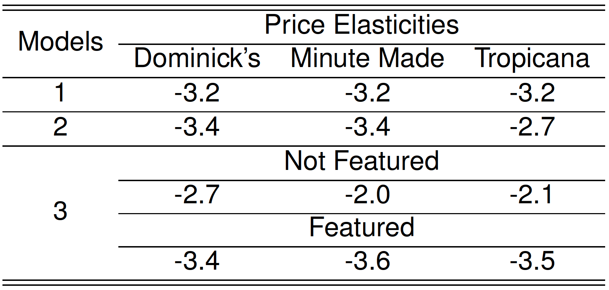

```{r setup, include = FALSE}
library(knitr)
library(kableExtra)
library(tidyverse)
library(NHSRtheme)
library(fontawesome)

# set default options
opts_chunk$set(echo = FALSE,
               fig.width = 7.252,
               fig.height = 4,
               comment = "#",
               dpi = 300)

knitr::knit_engines$set("markdown")

xaringanExtra::use_tile_view()
xaringanExtra::use_panelset()
xaringanExtra::use_clipboard()
xaringanExtra::use_webcam()
xaringanExtra::use_broadcast()
xaringanExtra::use_share_again()
xaringanExtra::style_share_again(
  share_buttons = c("twitter", "linkedin", "pocket")
)


xaringanExtra::use_extra_styles(
  hover_code_line = TRUE,         #<<
  mute_unhighlighted_code = F  #<<
)

# uncomment the following lines if we want to use the NHS-R theme colours by default
# scale_fill_continuous <- partial(scale_fill_nhs, discrete = FALSE)
# scale_fill_discrete <- partial(scale_fill_nhs, discrete = TRUE)
# scale_colour_continuous <- partial(scale_colour_nhs, discrete = FALSE)
# scale_colour_discrete <- partial(scale_colour_nhs, discrete = TRUE)
```


class: title-slide, left, bottom

# `r rmarkdown::metadata$title`
----
## **`r rmarkdown::metadata$subtitle`**
### `r rmarkdown::metadata$author`
### `r rmarkdown::metadata$date`


---
# Announcement
### <p style="color:#00449E"> Student Course Experience (SCE) Survey

- Effective Fall 2022, the Student Course Experience (SCE) survey replaces the Student Observation of Faculty Instruction (SOFI) survey.

- In a web browser, students should visit their [myGeneseo](https://my.geneseo.edu/dashboard) portal, then select KnightWeb, Surveys, then SCE (formerly SOFI) Surveys.


---
# Announcement
### <p style="color:#00449E"> Final Exam

- Final Exam Schedule is mentioned in page 2 in our syllabus.


- School's Final Exam Schedule is available [here](https://www.geneseo.edu/sites/default/files/sites/registrar/2022.03.30%20202209%20Exam%20Schedule.pdf).


- Final Exam covers the following topics:
  - Loading CSV files
  - Summary Statistics
  - Data Visualization
  - Data Transformation
  - Pivoting/Separating/Uniting/Joining
  - String/Factor/Date-Time Data
  - Linear Regression

---
class: inverse, center, middle

# Linear Regression using **R**
<html><div style='float:left'></div><hr color='#EB811B' size=1px width=796px></html>


---
# Linear Regression in R
### <p style="color:#00449E"> R commands to do EDA and linear regression analysis

.panelset[
.panel[.panel-name[Data]
```{r, echo = T, eval = F}
library(tidyverse)
psub <- readRDS( url('https://bcdanl.github.io/data/psub.RDS') )
set.seed(54321)
gp <- runif( nrow(psub) )
# Set up factor variables if needed.
dtrain <- filter(psub, gp >= .5)
dtest <- filter(psub, gp < .5)
```
]

.panel[.panel-name[EDA]
```{r, echo = T, eval = F}
library(skimr)
sum_dtrain <- skim( select(dtrain,
                           PINCP, AGEP, SEX, SCHL) )
library(GGally)
ggpairs( select(dtrain,
                PINCP, AGEP, SEX, SCHL) )
# MORE VISUALIZATIONS ARE RECOMMENDED
```
]


.panel[.panel-name[Training]
```{r, echo = T, eval = F}
model_1 <- lm( PINCP ~ AGEP + SEX,
               data = dtrain )
model_2 <- lm( PINCP ~ AGEP + SEX + SCHL,
               data = dtrain )
```
]


.panel[.panel-name[Summary 1]
- Summary with base-R:
```{r, echo = T, eval = F}
summary(model_1)
summary(model_2)
coef(model_1)
coef(model_2)
# Using the model.matrix() function on our linear model object, 
# we can get the data matrix that underlies our regression. 
df_model_1 <- as_tibble( model.matrix(model_1) )
df_model_2 <- as_tibble( model.matrix(model_2) )
```

]


.panel[.panel-name[Summary 2]

- Summary with R packages:
```{r, echo = T, eval = F}
# install.packages(c("stargazer", "broom"))
library(stargazer)
library(broom)
stargazer(model_1, model_2, 
          type = 'text')  # from the stargazer package
sum_model_2 <- tidy(model_2)  # from the broom package
# Consider filter() to keep statistically significant beta estimates
```


]


.panel[.panel-name[Betas in plot]
```{r, echo = T, eval = F}
ggplot(sum_model_2) +
  geom_pointrange( aes(x = term, 
                       y = estimate,
                       ymin = estimate - 2*std.error,
                       ymax = estimate + 2*std.error ) ) +
  coord_flip()
```

]

.panel[.panel-name[Prediction]
```{r, echo = T, eval = F}
dtest <- dtest %>% 
  mutate( pred_1 = predict(model_1, newdata = dtest),
          pred_2 = predict(model_2, newdata = dtest) )
```
]

.panel[.panel-name[Actual vs. Prediction Plot]
```{r, echo = T, eval = F}
ggplot( data = dtest, 
        aes(x = pred_2, y = PINCP) ) +
  geom_point( alpha = 0.2, color = "darkgray" ) +
  geom_smooth( color = "darkblue" ) +  
  geom_abline( color = "red", linetype = 2 )  # y = x, perfect prediction line

```


]


.panel[.panel-name[Residual Plot]

```{r, echo = T, eval = F}
ggplot(data = dtest, 
       aes(x = pred_2, y = PINCP - pred_2)) +
  geom_point(alpha = 0.2, color = "darkgray") +
  geom_smooth( color = "darkblue" ) +   
  geom_hline( aes( yintercept = 0 ),  # perfect prediction 
              color = "red", linetype = 2) 

```

]


]

---
# Linear Regression in R
### <p style="color:#00449E"> The model equation

$$\texttt{PINCP[i]}\qquad\qquad\qquad\qquad\qquad\notag\\ 
\;=\;\; \texttt{b0} \,+\, \texttt{b1*AGEP[i]} \,+\, \texttt{b2*SEX.Male[i]}\\
\qquad\qquad\texttt{b3*SCHL.no high school diploma[i]}\,+\, \\
\qquad\qquad\qquad\quad\;\texttt{b4*SCHL.GED or alternative credential[i]}\,+\, \\
\qquad\qquad\qquad\quad\;\;\texttt{b5*SCHL.some college credit, no degree[i]}\,+\, \\ 
\qquad\texttt{b6*SCHL.Associate's degree[i]}\,+\, \\
\quad\;\;\texttt{b7*SCHL.Bachelor's degree[i]}\,+\, \\
\;\;\,\texttt{b8*SCHL.Master's degree[i]}\,+\, \\
\qquad\;\;\;\texttt{b9*SCHL.Professional degree[i]}\,+\, \\
\qquad\texttt{b10*SCHL.Doctorate degree[i]}\,+\, \\
\,\texttt{e[i]}.\qquad\qquad\qquad\qquad\qquad$$

---
class: inverse, center, middle

# Linear Regression with Log-transformed Variables
<html><div style='float:left'></div><hr color='#EB811B' size=1px width=796px></html>


---
# Linear Regression with Log-transformtion
### <p style="color:#00449E"> A Little Bit of Math for Logarithm and Exponential Functions


.pull-left[
```{r, eval = T, echo = F, message = F, warning = F, fig.height=8, fig.fullwidth=TRUE}
vec <- seq(-1.5, 2, .1)
vec2 <- seq(.1, 3, .1)

p <- ggplot() +
  geom_line(aes(x = vec, y = exp(vec)), color = 'red') +
  geom_line(aes(x = vec2, y = log(vec2)), color = 'blue') +
  geom_abline(lty = 5) +
  geom_hline(aes(yintercept = 0)) +
  geom_vline(aes(xintercept = 0)) +
  geom_hline(aes(yintercept = 1), lty = 3) +
  geom_vline(aes(xintercept = 1), lty = 3) +
  annotate(geom = "text", x = 2, y = 7.75,
           label = "exp(x)", hjust = 0, color = 'red') +
  annotate(geom = "text", x = 2.5, y = 1.4,
           label = "log(x)", hjust = 0, color = 'blue') +
  annotate(geom = "text", x = 2.5, y = 3.5,
           label = "y = x", hjust = 0) +
  annotate(geom = "text", x = 1.25, y = -1.75,
           label = "x = 1", hjust = 0) +
  annotate(geom = "text", x = -1.25, y = 1.4,
           label = "y = 1", hjust = 0) +
  annotate(geom = "text", x = 3.5, y = -.25,
           label = "x", hjust = 0) +
  annotate(geom = "text", x = -.25, y = 7.75,
           label = "y", hjust = 0) +
  coord_fixed() +
  labs(x = "", y = "" ) +
  xlim(c(-1.25, 3)) + ylim(c(-2, 7)) +
  scale_y_discrete(limits=c(-2, 0, 2, 4, 6)) +
  scale_x_discrete(limits=c(-1, 0, 1, 2, 3)) +
  hrbrthemes::theme_ipsum() +
  theme(plot.title = element_text(size = rel(1.5)),
        axis.title = element_text(size = 25),
        axis.text.x = element_text(size = rel(1.5)),
        axis.text.y = element_text(size = rel(1.5)))
p
```

]

.pull-right[

- $\log_{e}\,(\,x\,)$: the base $e$ logarithm is called **the natural log**, where $e = 2.718\cdots$ is the mathematical constant,  the Euler's number.

- $\log\,(\,x\,)$ or $\ln\,(\,x\,)$: the natural log of $x$.

- $e^x$ or $exp(x)$: the base $e$ exponential function of $x$.
]


 
---
# Linear Regression with Log-transformtion

- We should use a logarithmic scale when **percent change**, or change in orders of magnitude, is more important than changes in absolute units.

  - For small changes in variable $x$ from $x_{0}$ to $x_{1}$, the following equation holds: 
  
$$\Delta \log(x) \,= \, \log(x_{1}) \,-\, \log(x_{0}) 
\approx\, \frac{x_{1} \,-\, x_{0}}{x_{0}} 
\,=\, \frac{\Delta\, x}{x_{0}}.$$


- A change in income of $5,000 means something very different across people with different income levels.
  - A percentage change in income, e.g., 5% of income, may mean somewhat more similar across people with different income levels.


- We can also consider using a log scale to reduce a variance of residuals when a variable is heavily skewed.

---
# Linear Regression with Log-transformtion

- The log transformation makes the skewed distribution of income more normal.

```{r, echo = T, eval = F}
ggplot(dtrain, aes( x = PINCP ) ) +
  geom_density() 

ggplot(dtrain, aes( x = log(PINCP) ) ) +
  geom_density() 
```


---
# Linear Regression with Log-transformtion
### <p style="color:#00449E"> A Few Algebras for Logarithm and Exponential Functions

- Rule 1: 
$$\texttt{y} \,=\, \texttt{log(x)}\qquad\Leftrightarrow\qquad \texttt{exp(y)} \,=\, \texttt{x}. $$
- Rule 2: 

$$\texttt{log(x)} \,-\, \texttt{log(z)} \,=\, \texttt{log}\,\left(\,\frac{\texttt{x}}{\texttt{z}}\,\right).$$

- By the rules above,
$$
\texttt{log(x)} \,-\, \texttt{log(z)} \,=\, \texttt{b}\qquad\Leftrightarrow\qquad \frac{\texttt{x}}{\texttt{z}} \,=\,\texttt{exp(b)}.
$$


---
# Linear Regression with Log-transformtion
- Let's consider the following linear regression model:
$$\qquad\log(\texttt{PINCP[i]})\qquad\qquad\qquad\qquad\\ 
\;=\;\; \texttt{b0} \,+\, \texttt{b1*AGEP[i]} \,+\, \texttt{b2*SEX.Male[i]}\\
\qquad\qquad\texttt{b3*SCHL.no high school diploma[i]}\,+\, \\
\qquad\qquad\qquad\quad\;\texttt{b4*SCHL.GED or alternative credential[i]}\,+\, \\
\qquad\qquad\qquad\quad\;\;\texttt{b5*SCHL.some college credit, no degree[i]}\,+\, \\ 
\qquad\texttt{b6*SCHL.Associate's degree[i]}\,+\, \\
\quad\;\;\texttt{b7*SCHL.Bachelor's degree[i]}\,+\, \\
\;\;\,\texttt{b8*SCHL.Master's degree[i]}\,+\, \\
\qquad\;\;\;\texttt{b9*SCHL.Professional degree[i]}\,+\, \\
\qquad\texttt{b10*SCHL.Doctorate degree[i]}\,+\, \\
\,\texttt{e[i]}.\qquad\qquad\qquad\qquad\qquad$$


---
# Linear Regression with Log-transformtion
### <p style="color:#00449E"> Interpreting Beta Estimates

- Consider $\texttt{Bob}$ and $\texttt{Ben}$: 
  - $\texttt{AGEP[Bob]} = 51$ and $\texttt{AGEP[Ben]} = 50$
  - $\texttt{SEX[Bob]} = \texttt{SEX[Ben]} = \texttt{"Male"}$
  - $\texttt{SCHL[Bob]} = \texttt{SCHL[Ben]} = \texttt{"Bachelor's degree"}$


- Consider $\texttt{Linda}$ and $\texttt{Ben}$: 
  - $\texttt{SEX[Linda]} = \texttt{"Female"}$ and $\texttt{SEX[Ben]} = \texttt{"Male"}$
  - $\texttt{SCHL[Linda]} = \texttt{SCHL[Ben]} = \texttt{"Bachelor's degree"}$
  - $\texttt{AGEP[Linda]} = \texttt{AGEP[Ben]} = 50$


---
# Linear Regression with Log-transformtion
### <p style="color:#00449E"> Interpreting Beta Estimates

- If we apply the rule above for $\texttt{Bob}$ and $\texttt{Ben}$'s predicted incomes,

$$\widehat{\texttt{log(PINCP[Ben]})} \,-\, \widehat{\texttt{log(PINCP[Bob])}}\qquad  \\
\;=\quad \hat{\texttt{b1}}\texttt{ * }(\texttt{AGEP[Ben]} - \texttt{AGEP[Bob]})\qquad\\
\;=\quad \hat{\texttt{b1}}\texttt{ * }\texttt{(51 - 50)}\qquad\qquad\qquad\qquad\;\\
\;=\quad \hat{\texttt{b1}}\qquad\qquad\qquad\qquad\qquad\qquad\;\;\;\,$$

So we can have the following:
$$\frac{\widehat{\texttt{PINCP[Ben]}}}{ \widehat{\texttt{PINCP[Bob]}}} \;=\; \texttt{exp(}\hat{\texttt{b1}}\texttt{)} \quad\Leftrightarrow\quad\widehat{\texttt{PINCP[Ben]}} \;=\; \widehat{\texttt{PINCP[Bob]}} * \texttt{exp(}\hat{\texttt{b1}}\texttt{)}$$


---
# Linear Regression with Log-transformtion
### <p style="color:#00449E"> Interpreting Beta Estimates


- If we apply the rule above for $\texttt{Ben}$ and $\texttt{Linda}$'s predicted incomes,

$$\frac{\widehat{\texttt{PINCP[Ben]}}}{ \widehat{\texttt{PINCP[Linda]}}} \;=\; \texttt{exp(}\hat{\texttt{b2}}\texttt{)} \quad\Leftrightarrow\quad\widehat{\texttt{PINCP[Ben]}} \;=\; \widehat{\texttt{PINCP[Linda]}} * \texttt{exp(}\hat{\texttt{b2}}\texttt{)}$$


- Suppose $\texttt{exp(}\hat{\texttt{b2}}\texttt{)} = 1.18$. 

  - Then $\widehat{\texttt{PINCP[Ben]}}$ is 1.18 times $\widehat{\texttt{PINCP[Linda]}}$.
  
  - It means that being a male is associated with an increase in income by 18% relative to being a female.
  
---
# Linear Regression with Log-transformtion
### <p style="color:#00449E"> Interpreting Beta Estimates

- All else being equal, an increase in `AGEP` by one unit is associated with an increase in `log(PINCP)` by $\hat{\texttt{b1}}$.
  
  - All else being equal, an increase in `AGEP` by one unit is associated with an increase in `PINCP` by $(\texttt{exp(}\hat{\texttt{b1}}\texttt{)} - 1)$%.

- All else being equal, being a male is associated with an increase in `log(PINCP)` by $\hat{\texttt{b2}}$ relative to being a female.
  
  - All else being equal, being a male is associated with an increase in `PINCP` by $(\texttt{exp(}\hat{\texttt{b2}}\texttt{)} - 1)$% relative to being a female.


---
class: inverse, center, middle

# Linear Regression with Interaction Terms
<html><div style='float:left'></div><hr color='#EB811B' size=1px width=796px></html>

---
# Linear Regression with Interaction Terms
### <p style="color:#00449E"> Motivation

- Does the relationship between education and income vary by gender?

  - Suppose we are interested in knowing whether women are being compensated unequally despite having the same levels of education and preparation as men do.

  - How can linear regression address the question above?


---
# Linear Regression with Interaction Terms
### <p style="color:#00449E"> Model

- The linear regression with an interaction between explanatory variables $X_{1}$ and $X_{2}$ are:

$$Y_{\texttt{i}} \,=\, b_{0} \,+\, b_{1}\,X_{1,\texttt{i}} \,+\, b_{2}\,X_{2,\texttt{i}} \,+\, b_{3}\,X_{1,\texttt{i}}\times \color{Red}{X_{2,\texttt{i}}} \,+\, e_{\texttt{i}},$$

- where
  - $\texttt{i}\;$: $\;\;\texttt{i}$-th observation in the training data.frame, $i = 1, 2, 3, \cdots$.
  - $Y_{\texttt{i}}\,$: $\;\texttt{i}$-th observation of outcome variable $Y$.
  - $X_{p, \texttt{i}}\,$: $\texttt{i}$-th observation of the $p$-th explanatory variable $X_{p}$.
  - $e_{\texttt{i}}\;$: $\;\texttt{i}$-th observation of statistical error variable.
  
  

---
# Linear Regression with Interaction Terms
### <p style="color:#00449E"> Model

- The linear regression with an interaction between explanatory variables $X_{1}$ and $X_{2}$ are:

$$Y_{\texttt{i}} \,=\, b_{0} \,+\, b_{1}\,X_{1,\texttt{i}} \,+\, b_{2}\,X_{2,\texttt{i}} \,+\, b_{3}\,X_{1,\texttt{i}}\times \color{Red}{X_{2,\texttt{i}}} \,+\, e_{\texttt{i}}$$.

.panelset[

.panel[.panel-name[Interaction]

- The relationship between $X_{1}$ and $Y$ varies by values of $b_{3}\, X_{2}$:

$$\frac{\Delta Y}{\Delta X_{1}} \,=\, b_{1} + b_{3}\, X_{2}$$.
]


.panel[.panel-name[Example]
- $X_{2}$ is often an indicator variable. If $b_{3} \neq 0$ and $X_{2, \texttt{i}} = 1$,
  
$$\frac{\Delta Y}{\Delta X_{1}} \,=\, b_{1} + b_{3}$$.

]

]

---
# Linear Regression with Interaction Terms
### <p style="color:#00449E"> Motivation

- Is education related with income?

```{r, echo = T, eval = F}
model <- lm( log(PINCP) ~ AGEP + SCHL + SEX,
             data = dtrain )
```

- Does the relationship between education and income vary by gender?

```{r, echo = T, eval = F}
model_int <- lm( log(PINCP) ~ AGEP + SCHL + SEX + 
                              SCHL * SEX,
                 data = dtrain )
# Equivalently,
model_int <- lm( log(PINCP) ~ AGEP + 
                              SCHL * SEX,  # Use this one!
                 data = dtrain )
```


---
# Linear Regression with Interaction Terms

- How could we see how the relationship between education and income vary by gender?

.panelset[
.panel[.panel-name[Code]
```{r, echo = T, eval = F}
summary(model_int)
b_int <- coef(model_int)
# the male's relationship between `Professional degree` and
# `PINCP` relative to male with no high school diploma
exp( b_int['SCHLProfessional degree'] ) - 1

# the female's relationship between `Professional degree` and
# `PINCP` relative to female with no high school diploma
exp( b_int['SCHLProfessional degree'] 
     + b_int['SCHLProfessional degree:SEXFemale'] ) - 1
```
]

.panel[.panel-name[Interpretation]
- All else being equal, female's professional degree is associated with an increase in personal income by 259% relative to female with no high school diploma.

- All else being equal, male's professional degree is associated with an increase in personal income by 199% relative to male with no high school diploma.
]

]

---
class: inverse, center, middle

# Log-Log Linear Regression
<html><div style='float:left'></div><hr color='#EB811B' size=1px width=796px></html>


---
# Log-Log Linear Regression
### <p style="color:#00449E"> Estimating Price Elasticity

- To estimate the price elasticity of orange juice (OJ), we will use sales data for OJ from Dominick’s grocery stores in the 1990s.
  - Weekly `price` and `sales` (in number of cartons "sold") for three OJ brands---Tropicana, Minute Maid, Dominick's
  - An indicator, `feat`, showing whether each `brand` was advertised (in store or flyer) that week.
  

Variable  | Description
----------|-------------------------------
`sales`   | Quantity of OJ cartons sold
`price`   | Price of OJ
`brand`   | Brand of OJ
`feat`    | Advertisement status


---
# Log-Log Linear Regression
### <p style="color:#00449E"> Estimating Price Elasticity

- Let's prepare the OJ data:
```{r, echo = T, eval = F}
oj <- read_csv('https://bcdanl.github.io/data/dominick_oj.csv')

# Split 70-30 into training and testing data.frames
set.seed(14454)
gp <- runif( nrow(oj) )

dtrain <- filter(oj, [?])
dtest <- filter(oj, [?])
```


---
# Log-Log Linear Regression
### <p style="color:#00449E"> Estimating Price Elasticity

- The following model estimates the price elasticity of demand for a carton of OJ:

$$\log(\texttt{sales}_{\texttt{i}}) \,=\, \quad\;\; b_{\texttt{intercept}} \,+\, b_{\,\texttt{mm}}\,\texttt{brand}_{\,\texttt{mm}, \texttt{i}} \,+\, b_{\,\texttt{tr}}\,\texttt{brand}_{\,\texttt{tr}, \texttt{i}}\\
 \,+\, b_{\texttt{price}}\,\log(\texttt{price}_{\texttt{i}}) \,+\, e_{\texttt{i}}$$

- where
  
$$
\texttt{brand}_{\,\texttt{tr}, \texttt{i}}\\
= \begin{cases}
\texttt{1} & \text{ if an orange juice } \texttt{i} \text{ is } \texttt{Tropicana};\\\\
\texttt{0} & \text{otherwise}.\qquad\qquad\quad\,
\end{cases}
$$


  
$$
\texttt{brand}_{\,\texttt{mm}, \texttt{i}}\\
= \begin{cases}
\texttt{1} & \text{ if an orange juice } \texttt{i} \text{ is } \texttt{Minute Maid};\\\\
\texttt{0} & \text{otherwise}.\qquad\qquad\quad\,
\end{cases}
$$


---
# Log-Log Linear Regression
### <p style="color:#00449E"> Estimating Price Elasticity

- The following model estimates the price elasticity of demand for a carton of OJ:

$$\log(\texttt{sales}_{\texttt{i}}) \,=\, \quad\;\; b_{\texttt{intercept}} \,+\, b_{\,\texttt{mm}}\,\texttt{brand}_{\,\texttt{mm}, \texttt{i}} \,+\, b_{\,\texttt{tr}}\,\texttt{brand}_{\,\texttt{tr}, \texttt{i}}\\
 \,+\, b_{\texttt{price}}\,\log(\texttt{price}_{\texttt{i}}) \,+\, e_{\texttt{i}}$$

- When $\texttt{brand}_{\,\texttt{tr}, \texttt{i}}\,=\,0$ and $\texttt{brand}_{\,\texttt{mm}, \texttt{i}}\,=\,0$, the beta coefficient for the intercept $b_{\texttt{intercept}}$ gives the value of Dominick's log sales at $\log(\,\texttt{price[i]}\,) = 0$.

- The beta coefficient $b_{\texttt{price}}$ is the price elasticity of demand.
  - It measures how sensitive the quantity demanded is to its price.


---
# Log-Log Linear Regression
### <p style="color:#00449E"> Estimating Price Elasticity

- For small changes in variable $x$ from $x_{0}$ to $x_{1}$, the following equation holds: 
  
$$\Delta \log(x) \,= \, \log(x_{1}) \,-\, \log(x_{0}) 
\approx\, \frac{x_{1} \,-\, x_{0}}{x_{0}} 
\,=\, \frac{\Delta\, x}{x_{0}}.$$

- The coefficient on $\log(\texttt{price}_{\texttt{i}})$, $b_{\texttt{price}}$, is therefore

$$b_{\texttt{price}} \,=\, \frac{\Delta \log(\texttt{sales}_{\texttt{i}})}{\Delta \log(\texttt{price}_{\texttt{i}})}\,=\, \frac{\frac{\Delta \texttt{sales}_{\texttt{i}}}{\texttt{sales}_{\texttt{i}}}}{\frac{\Delta \texttt{price}_{\texttt{i}}}{\texttt{price}_{\texttt{i}}}}.$$

- All else being equal, an increase in $\texttt{price}$ by 1% is associated with a decrease in $\texttt{sales}$ by $b_{\texttt{price}}$%.


---
# Log-Log Linear Regression
### <p style="color:#00449E"> EDA


.pull-left[
- Describe the relationship between `brand` and `log(price)`.

```{r, echo = T, eval = F}
ggplot(dtrain,
       aes( x = [?], y = [?], 
            fill = [?]) ) +
  geom_boxplot()
```
]


.pull-right[
- Describe the relationship between `log(price)` and `log(sales)` by `brand`.

```{r, echo = T, eval = F}
ggplot(dtrain,
       aes(x = [?], y = [?], 
           color = [?])) +
  geom_point([?]) +
  geom_smooth(method = [?])
```
]


---
# Log-Log Linear Regression
### <p style="color:#00449E"> Estimating Price Elasticity

- Let's train the first model, `model_1`:

$$\log(\texttt{sales}_{\texttt{i}}) \,=\, \quad\;\; b_{\texttt{intercept}} \,+\, b_{\,\texttt{mm}}\,\texttt{brand}_{\,\texttt{mm}, \texttt{i}} \,+\, b_{\,\texttt{tr}}\,\texttt{brand}_{\,\texttt{tr}, \texttt{i}}\\
 \,+\, b_{\texttt{price}}\,\log(\texttt{price}_{\texttt{i}}) \,+\, e_{\texttt{i}}$$
 
```{r, echo = T, eval = F}
model_1 <- lm([?], data = dtrain)
```


---
# Log-Log Linear Regression
### <p style="color:#00449E"> Estimating Price Elasticity

- Here is the inverse demand curve for each brand OJ: 

.pull-left[
```{r, echo = F, eval = T, message= F, warning= F, fig.fullwidth=TRUE, fig.height= 6.3}
oj <- read_csv(
  'https://bcdanl.github.io/data/dominick_oj.csv')
set.seed(14454) 
gp <- runif( nrow(oj) ) 
dtrain <- filter(oj, gp > .33)
dtest <- filter(oj, gp <= .33)

model_1 <- lm(log(sales) ~ brand + log(price), 
            data = dtrain)
beta_1 <- coef(model_1)
q1 <- ggplot(data = dtest) + 
  geom_point(aes(x = log(price), y = log(sales), 
                 color = brand),
             alpha = .2) +
  geom_abline(aes(slope = 
                    beta_1["log(price)"],
                  intercept = 
                    beta_1["(Intercept)"]),
              color = "red") +
  geom_abline(aes(slope = 
                    beta_1["log(price)"],
                  intercept = 
                    beta_1["(Intercept)"] + 
                    beta_1["brandminute.maid"]),
              color = "green") +
  geom_abline(aes(slope = 
                    beta_1["log(price)"],
                  intercept = 
                    beta_1["(Intercept)"] + 
                    beta_1["brandtropicana"]),
              color = "blue") +
  xlim(c(-.2, 1.45))  +  ggtitle("Model 1") +
  hrbrthemes::theme_ipsum()  + 
  theme(legend.position = c(.12, .12))+
  theme(plot.title = element_text(size = rel(1.5)),
        axis.title = element_text(size = 25),
        axis.text.x = element_text(size = rel(1.5)),
        axis.text.y = element_text(size = rel(1.5)))
q1
```
]

.pull-left[
- When $\texttt{brand}_{\,\texttt{tr}, \texttt{i}}\,=\,0$ and $\texttt{brand}_{\,\texttt{mm}, \texttt{i}}\,=\,0$, the beta coefficient $b_{\texttt{intercept}}$ gives the value of Dominick's log sales at $\log(\,\texttt{price[i]}\,) = 0$.
 
]


---
# Log-Log Linear Regression
### <p style="color:#00449E"> Estimating Price Elasticity

- How does the relationship between `log(sales)` and `log(price)` vary by `brand`?

  - Let's train the second model, `model_2`, that addresses the above question:

$$\log(\texttt{sales}_{\texttt{i}}) \,=\, \quad b_{\texttt{intercept}} \,+\, b_{\,\texttt{mm}}\,\texttt{brand}_{\,\texttt{mm}, \texttt{i}} \,+\, b_{\,\texttt{tr}}\,\texttt{brand}_{\,\texttt{tr}, \texttt{i}}\\
 \,+\, b_{\texttt{price}}\,\log(\texttt{price}_{\texttt{i}})  \\
 \qquad\qquad\qquad\,+\, b_{\texttt{price*mm}}\,\log(\texttt{price}_{\texttt{i}})\,\times\,\color{Red} {\texttt{brand}_{\,\texttt{mm}, \texttt{i}}} \\
 \qquad\qquad\qquad\qquad +\, b_{\texttt{price*tr}}\,\log(\texttt{price}_{\texttt{i}})\,\times\,\color{Red} {\texttt{brand}_{\,\texttt{tr}, \texttt{i}}} \,+\, e_{\texttt{i}}$$
 
```{r, echo = T, eval = F}
model_2 <- lm([?], data = dtrain)
```


---
# Log-Log Linear Regression
### <p style="color:#00449E"> Estimating Price Elasticity

- Here are the inverse demand curves from `model_1` and `model_2`: 

.pull-left[
```{r, echo = F, eval = T, message= F, warning= F, fig.fullwidth=TRUE, fig.height= 6.4}
q1
```

]

.pull-right[
```{r, echo = F, eval = T, message= F, warning= F, fig.fullwidth=TRUE, fig.height= 6.3}
model_2 <- lm(log(sales) ~ brand*log(price), 
            data=dtrain)
beta_2 <- coef(model_2)

# inverse demand curves from model 2
q2 <- ggplot(data = dtest) +
  geom_point(aes(x = log(price), y = log(sales), 
                 color = brand),
             alpha = .2) +
  geom_abline(aes(slope = 
                    beta_2["log(price)"],
                  intercept = 
                    beta_2["(Intercept)"]),
              color = "red") +
  geom_abline(aes(slope = 
                    beta_2["log(price)"],
                  intercept = 
                    beta_2["(Intercept)"] + 
                    beta_2["brandminute.maid"]),
              color = "green") +
  geom_abline(aes(slope = 
                    beta_2["log(price)"] + 
                    beta_2["brandtropicana:log(price)"],
                  intercept = 
                    beta_2["(Intercept)"] + 
                    beta_2["brandtropicana"]),
              color = "blue") +
  xlim(c(-.2, 1.45)) +  ggtitle("Model 2") +
  hrbrthemes::theme_ipsum()+ guides(color = "none")+
  theme(plot.title = element_text(size = rel(1.5)),
        axis.title = element_text(size = 25),
        axis.text.x = element_text(size = rel(1.5)),
        axis.text.y = element_text(size = rel(1.5)))
q2
```

]

- Model 2 assumes that the price elasticity of OJ can vary by `brand`.


---
# Log-Log Linear Regression

- How does advertisement play a role in the relationship between sales and prices in the OJ market?
  - Let's train the second model, `model_3`, that addresses the above question:

$$\log(\texttt{sales}_{\texttt{i}}) \,=\, \quad b_{\texttt{intercept}} \,+\, b_{\,\texttt{mm}}\,\texttt{brand}_{\,\texttt{mm}, \texttt{i}} \,+\, b_{\,\texttt{tr}}\,\texttt{brand}_{\,\texttt{tr}, \texttt{i}}\\
 \,+\, b_{\texttt{price}}\,\log(\texttt{price}_{\texttt{i}})  \\
 \qquad\qquad\qquad\,+\, b_{\texttt{price**mm}}\,\log(\texttt{price}_{\texttt{i}})\,\times\,\color{Red} {\texttt{brand}_{\,\texttt{mm}, \texttt{i}}} \\
 \qquad\qquad\qquad\,+\, b_{\texttt{price**tr}}\,\log(\texttt{price}_{\texttt{i}})\,\times\,\color{Red} {\texttt{brand}_{\,\texttt{tr}, \texttt{i}}} \\
\qquad\qquad\quad +\, b_{\,\texttt{feat}}\,\texttt{feat}_{\, \texttt{i}}\,+\, b_{\texttt{price*feat}}\,\log(\texttt{price}_{\texttt{i}})\,\times\,\color{Blue}{\texttt{feat}_{\,\texttt{i}}} \\
 \qquad\qquad\quad +\, b_{\texttt{price*mm*feat}}\,\log(\texttt{price}_{\texttt{i}}) \,\times\,\,\color{Red} {\texttt{brand}_{\,\texttt{mm}, \texttt{i}}}\,\times\, \color{Blue}{\texttt{feat}_{\,\texttt{i}}} \\
 \qquad\qquad\qquad\quad +\, b_{\texttt{price*tr*feat}}\,\log(\texttt{price}_{\texttt{i}}) \,\times\,\,\color{Red} {\texttt{brand}_{\,\texttt{tr}, \texttt{i}}}\,\times\, \color{Blue}{\texttt{feat}_{\,\texttt{i}}}  \,+\, e_{\texttt{i}}$$

 
```{r, echo = T, eval = F}
model_3 <- lm([?], data = dtrain)
```


---
# Log-Log Linear Regression
### <p style="color:#00449E"> Estimating Price Elasticity


- Here are the inverse demand curves from `model_3`:

.pull-left[
```{r, echo = F, eval = T, message= F, warning= F, fig.fullwidth=TRUE, fig.height= 6.1}
model_3 <- lm(log(sales) ~ brand*feat*log(price), 
            data=dtrain)
beta_3 <- coef(model_3)

# inverse demand curves from model 3 when there was no promo
p1 <- ggplot(data = filter(dtrain, feat == 0)) +
  geom_point(aes(x = log(price), y = log(sales), 
                 color = brand),
             alpha = .2) +
  geom_abline(aes(slope = 
                    beta_3["log(price)"],
                  intercept = 
                    beta_3["(Intercept)"]),
              color = "red") +
  geom_abline(aes(slope = 
                    beta_3["log(price)"] + 
                    beta_3["brandminute.maid:log(price)"],
                  intercept = 
                    beta_3["(Intercept)"] + 
                    beta_3["brandminute.maid"]),
              color = "green") +
  geom_abline(aes(slope = 
                    beta_3["log(price)"] + 
                    beta_3["brandtropicana:log(price)"],
                  intercept = 
                    beta_3["(Intercept)"] + 
                    beta_3["brandtropicana"]),
              color = "blue") +
  xlim(c(-.2, 1.45)) + ylim(c(4,12.5)) +
  ggtitle("No Feat") +
  hrbrthemes::theme_ipsum() +
  guides(color = "none")+
  theme(plot.title = element_text(size = rel(1.5)),
        axis.title = element_text(size = 25),
        axis.text.x = element_text(size = rel(1.5)),
        axis.text.y = element_text(size = rel(1.5)))
p1
```

]

.pull-right[
```{r, echo = F, eval = T, message= F, warning= F, fig.fullwidth=TRUE, fig.height= 6.1}
p2 <- ggplot(data = filter(dtrain, feat == 1)) +
  geom_point(aes(x = log(price), y = log(sales), 
                 color = brand),
             alpha = .2) +
  geom_abline(aes(slope = 
                    beta_3["log(price)"] + 
                    beta_3["feat:log(price)"],
                  intercept = 
                    beta_3["(Intercept)"] + 
                    beta_3["feat"]),
              color = "red") +
  geom_abline(aes(slope = 
                    beta_3["log(price)"] + 
                    beta_3["brandminute.maid:log(price)"] + 
                    beta_3["feat:log(price)"] + 
                    beta_3["brandminute.maid:feat:log(price)"],
                  intercept = 
                    beta_3["(Intercept)"] + 
                    beta_3["feat"] + 
                    beta_3["brandminute.maid"] + 
                    beta_3["brandminute.maid:feat"]),
              color = "green") +
  geom_abline(aes(slope = 
                    beta_3["log(price)"] + 
                    beta_3["brandtropicana:log(price)"] + 
                    beta_3["feat:log(price)"] + 
                    beta_3["brandtropicana:feat:log(price)"],
                  intercept = 
                    beta_3["(Intercept)"] + 
                    beta_3["feat"] + 
                    beta_3["brandtropicana"] + 
                    beta_3["brandtropicana:feat"]),
              color = "blue") +
  xlim(c(-.2, 1.45)) + ylim(c(4,12.5)) +
  ggtitle("Feat") + guides(color = "none") +
  hrbrthemes::theme_ipsum() +
  theme(plot.title = element_text(size = rel(1.5)),
        axis.title = element_text(size = 25),
        axis.text.x = element_text(size = rel(1.5)),
        axis.text.y = element_text(size = rel(1.5)))
p2
```

]


---
# Log-Log Linear Regression
### <p style="color:#00449E"> Estimating Price Elasticity

- Describe the relationship between `feat` and `brand` using stacked bar charts.


.pull-left[
```{r, echo = F, eval = T, message= F, warning= F, fig.fullwidth=TRUE, fig.height= 6.1}
r1 <- ggplot(data = dtrain) +
  geom_bar(aes(x = as.factor(feat), y = ..prop..,
               group = brand, fill = brand), 
           position = "fill") +
  hrbrthemes::theme_ipsum() + xlab("feat") +
  guides(fill = "none")+
  theme(plot.title = element_text(size = rel(1.5)),
        axis.title = element_text(size = 25),
        axis.text.x = element_text(size = rel(1.5)),
        axis.text.y = element_text(size = rel(1.5)))
r1
```

]

.pull-right[
```{r, echo = F, eval = T, message= F, warning= F, fig.fullwidth=TRUE, fig.height= 6.1}
r2 <- ggplot(data = dtrain) +
  geom_bar(aes(x = as.factor(feat), 
               group = brand, fill = brand)) +
  hrbrthemes::theme_ipsum() + xlab("feat") + 
  theme(legend.position = c(.775, .75))+
  theme(plot.title = element_text(size = rel(1.5)),
        axis.title = element_text(size = 25),
        axis.text.x = element_text(size = rel(1.5)),
        axis.text.y = element_text(size = rel(1.5)))
r2
```

]

- Model 3 assumes that the relationship between `price` and `sales` can vary by `feat`.


---
# Log-Log Linear Regression
### <p style="color:#00449E"> Estimating Price Elasticity


```{r, echo=FALSE, out.width = '70%', fig.align='center'}

```

- How would you explain different estimation results across different models?

- Which model do you prefer? Why?
