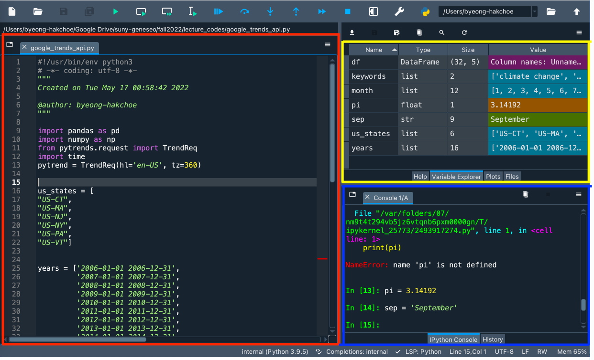

```{r setup, include = FALSE}
library(knitr)
library(kableExtra)
library(tidyverse)
library(NHSRtheme)
library(fontawesome)
# set default options
opts_chunk$set(echo = FALSE,
               fig.width = 7.252,
               fig.height = 4,
               comment = "#",
               dpi = 300)

knitr::knit_engines$set("markdown")

xaringanExtra::use_tile_view()
xaringanExtra::use_panelset()
xaringanExtra::use_clipboard()
xaringanExtra::use_webcam()
xaringanExtra::use_broadcast()
xaringanExtra::use_share_again()
xaringanExtra::style_share_again(
  share_buttons = c("twitter", "linkedin", "pocket")
)


xaringanExtra::use_extra_styles(
  hover_code_line = TRUE,         #<<
  mute_unhighlighted_code = TRUE  #<<
)

# uncomment the following lines if you want to use the NHS-R theme colours by default
# scale_fill_continuous <- partial(scale_fill_nhs, discrete = FALSE)
# scale_fill_discrete <- partial(scale_fill_nhs, discrete = TRUE)
# scale_colour_continuous <- partial(scale_colour_nhs, discrete = FALSE)
# scale_colour_discrete <- partial(scale_colour_nhs, discrete = TRUE)
```

class: title-slide, left, bottom

# `r rmarkdown::metadata$title`
----
## **`r rmarkdown::metadata$subtitle`**
### `r rmarkdown::metadata$author`
### `r rmarkdown::metadata$date`


---
class: inverse, center, middle

# Instructor
<html><div style='float:left'></div><hr color='#EB811B' size=1px width=796px></html>
---

# Instructor
### <p style="color:#00449E"> Current Appointment & Education </p>

- Name: Byeong-Hak Choe.
- Lecturer in Data Analytics at School of Business at SUNY Geneseo.


- Ph.D. in Economics from University of Wyoming.
- M.S. in Economics from Arizona State University.
- M.A. in Economics from SUNY Stony Brook.
- B.A. in Economics & B.S. in Applied Mathematics from Hanyang University at Ansan, South Korea
  - Minor in Business Administration.
  - Concentration in Finance.
  
---

# Instructor
### <p style="color:#00449E"> Data Science and Climate Change </p>

- Choe, B.H., 2021. "Social Media Campaigns, Lobbying and Legislation: Evidence from #climatechange/#globalwarming and Energy Lobbies."

- Question: To what extent do social media campaigns compete with fossil fuel lobbying on climate change legislation?

- Data include:
  - 5.0 million tweets with #climatechange/#globalwarming around the globe;
  - 12.0 million retweets/likes to those tweets;
  - 0.8 million Twitter users who wrote those tweets;
  - 1.4 million Twitter users who retweeted or liked those tweets;
  - 0.3 million US Twitter users with their location at a city level;
  - Firm-level lobbying data (expenses, targeted bills, etc.). 


---
class: inverse, center, middle

# Syllabus
<html><div style='float:left'></div><hr color='#EB811B' size=1px width=796px></html>
---

# Syllabus

### <p style="color:#00449E">Email, Class & Office Hours</p>

- Email: [bchoe@geneseo.edu](bchoe@geneseo.edu)


- Class Homepage: 
  - [https://canvas.geneseo.edu/](https://canvas.geneseo.edu/)
  - [https://bcdanl.github.io](https://bcdanl.github.io)
  
  
- Office: South Hall 117B.
- Office Hours: 
  - Mondays 3:30 PM-5:30 PM.
  - Wednesdays 1:30 PM-3:30 PM.

---
# Syllabus
### <p style="color:#00449E">Course Prerequisites</p>

- Business & Economics Statistics or Equivalent:
  - Economics 205, Geography 278, Mathematics 242, Mathematics 262, Political Science 251, Psychology 250, or Sociology 211.
  
- Programming for Data Analytics:
  - Data Analytics 100.

---
# Syllabus
### <p style="color:#00449E">Textbooks</p>
  
- **Python for Data Analysis** by Wes McKinney
  - A free online version of this book is available at [https://wesmckinney.com/book/](https://wesmckinney.com/book/).


- **Python Data Science Handbook** by Jake VanderPlas
  - A free online version of this book is available at [https://jakevdp.github.io/PythonDataScienceHandbook/](https://jakevdp.github.io/PythonDataScienceHandbook/)


---
# Syllabus
### <p style="color:#00449E">Reference Materials</p>
  
- **Coding for Economists** by Arthur Turrell
  - A free online version of this book is available at [https://aeturrell.github.io/coding-for-economists/](https://aeturrell.github.io/coding-for-economists/).


- **QuantEcon DataScience - pandas** by Chase Coleman, Spencer Lyon, and Jesse Perla
  - A free online version of this book is available at [ttps://datascience.quantecon.org/pandas/index.html](ttps://datascience.quantecon.org/pandas/index.html)

---


# Syllabus

### <p style="color:#00449E">Course Description</p>

- This course aims to provide overview of how one can collect, manipulate, process, clean, and crunch datasets with hands-on and practical case studies.

- This course will cover topics such as (1) loading, cleaning, transforming, merging, and reshaping data, (2) creating informative visualizations (3) dataset slicing, dicing, and summarizing, and (4) collecting data using web scrapping, API, and SQL. 

- We will cover these topics to solve real-world data analysis problems with thorough, detailed examples. 

- During the course, you will work hands-on with the Python programming language and its associated data analysis libraries.

---

# Syllabus

### <p style="color:#00449E">Course Requirements</p>

- Laptop: You should bring your own laptop (**Mac** or **Windows**) to the classroom. 
  - It is recommended to have 2+ core CPU, 4+ GB RAM, and 500+ GB disk storage in your laptop for this course.
  
  
- Homework: There will be six homework assignments.

- Exams: There will be midterm and final exams. 
  - The final exam is comprehensive.

---
# Syllabus
### <p style="color:#00449E">Course Contents</p>

- There will be tentatively 28 class sessions:
  - 27 lectures;
  - 1 midterm exam.


- There will be no class on February 28, 2023. 


- The midterm exam will be tentatively scheduled on March 9, 2023. 


- The final exam will be tentatively scheduled on May 16, 2023, from noon to 2 P.M. 


---
# Syllabus
### <p style="color:#00449E">Course Contents</p>

- Basics in pandas

```{r, out.width='100%', fig.align='center'}
text_tbl <- data.frame(
  Week = c("1", "2", "3", "4", "4"),
  Contents = c("Syllabus, Pandas DataFrame Basics",
"Pandas Data Structures Basics",
"Data Visualization with matplotlib and seaborn",
"Tidy Data",
"Apply Functions"),
  HW = c("1", "1", "1", "2", "2")
  )


kable(text_tbl, format = "html") %>%
  kable_paper(full_width = T) %>%
  column_spec(1, bold = T, border_right = T) %>%
  kable_styling(html_font = 'sans-serif, helvetica, arial',
                bootstrap_options = c("hover", "condensed") )

```


---
# Syllabus
### <p style="color:#00449E">Course Contents</p>

- Data Transformation

```{r, out.width='100%', fig.align='center'}
text_tbl <- data.frame(
  Lecture = c("5", "6--7", "7"),
  Contents = c(
"Relational Data",
"Duplicate Data & Groupby Operations",
"Midterm Exam"),
  HW = c("2", "2", "")
  )


kable(text_tbl, format = "html") %>%
  kable_paper(full_width = T) %>%
  column_spec(1, bold = T, border_right = T) %>%
  kable_styling(html_font = 'sans-serif, helvetica, arial',
                bootstrap_options = c("hover", "condensed") ) 

```

---
# Syllabus
### <p style="color:#00449E">Course Contents</p>
- Data Type

```{r, out.width='100%', fig.align='center'}
text_tbl <- data.frame(
  Lecture = c("8", "8", "9", "9"),
  Contents = c("Missing Data",
               "Data Types",
               "String Data",
               "Dates and Times Data"),
  HW = c("3", "3", "3", "3")
  )


kbl(text_tbl) %>%
  kable_paper(full_width = T) %>%
  column_spec(1, bold = T, border_right = T) %>%
  kable_styling(html_font = 'sans-serif, helvetica, arial', bootstrap_options = c("hover", "condensed"))

```
---
# Syllabus
### <p style="color:#00449E">Course Contents</p>

- Web Scrapping and Databases

```{r, out.width='100%', fig.align='center'}
text_tbl <- data.frame(
  Lecture = c("10--12", "13", "14--15"),
  Contents = c("Web Scrapping with Python selenium",
               "Data Collection with APIs",
               "Databases with SQL and Google BigQuery"),
  HW = c("4--5", "5", "6")
  )


kbl(text_tbl) %>%
  kable_paper(full_width = T) %>%
  column_spec(1, bold = T, border_right = T) %>%
  kable_styling(html_font = 'sans-serif, helvetica, arial', bootstrap_options = c("hover", "condensed"))

```

---
# Syllabus
### <p style="color:#00449E">Attendance</p>
- You are allowed up to 7 absences without penalty. 

- There will be no additional absences available for standard excused reasons (illness, family emergency, transportation problems, etc.).


---
# Syllabus
### <p style="color:#00449E">Grading</p>
- Attendance accounts for 5% of the total percentage grade.

- Project accounts for 10% of the total percentage grade.

- Homework assignments account for 25% of the total percentage grade.

- Exams account for 60% of the total percentage grade.

$$ 
\begin{align}
&\;(\text{Total Percentage Grade})  \notag\\
=&\quad 0.05\times(\text{Attendance Score})  \notag\\
&\,+\, 0.35\times(\text{Total Homework Score}) \,+\, 0.60\times(\text{Total Exam Score}).\notag
\end{align}
$$

---
# Syllabus

### <p style="color:#00449E">Grading</p>

- The lowest homework score will be dropped when calculating the total homework score.

- Each of the four homework accounts for 20% of the total homework score.

---

# Syllabus

### <p style="color:#00449E">Grading</p>

- The total exam score is the maximum between the following two average scores:
  1. the simple average of two exam scores;
  2. the weighted average of them with one-fourth weight on the midterm exam score and three-fourth weight on the final exam score.
  
$$
\begin{align}
&(\text{Total Exam Score}) \notag\\
=\; &\max\,\left\{0.5\times(\text{Midterm Exam Score}) \,+\, 0.5\times(\text{Final Exam Score})\right.,\notag\\ 
&\qquad\;\,\left.0.25\times(\text{Midterm Exam Score}) \,+\, 0.75\times(\text{Final Exam Score})\right\}.\notag
\end{align}
$$

---

# Syllabus

### <p style="color:#00449E">Grading</p>

- Letter grades will be determined by the total percentage grade:
  
$$
\begin{align*}
\! 100\; \geq\; A\;\;\, \geq \;93>\; A- \geq 90;\\
90 >\; B+ \geq 87\; >\; B\;\;\, \geq \;83 >\; B- \geq 80;\\
80 >\; C+ \geq 77\; >\; C\;\;\, \geq \;73 >\; C- \geq 70;\\
70\; >\; D\;\;\, \geq\; 60 >\; E.\qquad\quad\;
\end{align*}
$$


---

# Syllabus

### <p style="color:#00449E">Make-up exams</p>

-  Make-up exams will not be given unless you have either a medically verified excuse or an absence excused by the University.

- If you cannot take exams because of religious obligations, notify me by email at least two weeks in advance so that an alternative exam time may be set.

- A missed exam without an excused absence earns a grade of zero.
  

---

# Syllabus

### <p style="color:#00449E">Academic Integrity and Plagiarism</p>

-  All homework assignments and exams must be the original work by you. 

- Examples of academic dishonesty include:
  - *representing the work, thoughts, and ideas of another person as your own*
  - *allowing others to represent your work, thoughts, or ideas as theirs*, and
  - *being complicit in academic dishonesty by suspecting or knowing of it and not taking action*.


- Geneseo’s Library offers frequent workshops to help you understand how to **paraphrase**, **quote**, and **cite** outside sources properly. 
  - See [https://www.geneseo.edu/library/library-workshops](https://www.geneseo.edu/library/\\library-workshops).
  

---

# Syllabus

### <p style="color:#00449E">Accessibility</p>

-  The Office of Accessibility will coordinate reasonable accommodations for persons with physical, emotional, or cognitive disabilities to ensure equal access to academic programs, activities, and services at Geneseo.

- Please contact me and the Office of Accessibility Services for questions related to access and accommodations.
  


---

# Syllabus

### <p style="color:#00449E">Well-being</p>

- You are strongly encouraged to communicate your needs to faculty and staff and seek support if you are experiencing unmanageable stress or are having difficulties with daily functioning.

- Liz Felski, the School of Business Student Advocate ([felski@geneseo.edu](felski@geneseo.edu), South Hall 303), or the Dean of Students (585-245-5706) can assist and provide direction to appropriate campus resources.

- For more information, see [https://www.geneseo.edu/dean_students](https://www.geneseo.edu/dean_students).
  

---
# Syllabus

### <p style="color:#00449E">Career Design</p>

- To get information about career development, you can visit the Career Development Events Calendar ([https://www.geneseo.edu/career_development/events/calendar](https://www.geneseo.edu/career_development/events/calendar)).

- You can stop by South 112 to get assistance in completing your Handshake Profile [https://app.joinhandshake.com/login](https://app.joinhandshake.com/login).
  - Handshake is ranked #1 by students as the best place to find full-time jobs.
  - 50% of the 2018-2020 graduates received a job or internship offer on Handshake.
  - Handshake is trusted by all 500 of the Fortune 500.
  

---
class: inverse, center, middle

# Installing the Tools
<html><div style='float:left'></div><hr color='#EB811B' size=1px width=796px></html>

---
# Installing the Tools
### <p style="color:#00449E"> Anaconda </p>

- Anaconda is an all-in-one Python distribution.
  - Anaconda includes Python 3.x and its standard modules such as pip, pandas, matplotlib, etc.
  - Anaconda also includes several software applications of integrated development environment (IDE), which is a software for editing codes.
  - For the Python code, we will use **Spyder** IDE.  
    - Do not use RStudio from Anaconda, because RStudio from Anaconda is out-dated.

  
- To install Anaconda, go to the following download page:
  - [https://www.anaconda.com/products/distribution](https://www.anaconda.com/products/distribution).
  - Click the "Download" button.


---
# Installing the Tools
### <p style="color:#00449E"> Spyder IDE </p>

- If Spyder IDE from Anaconda is lagging, consider installing it additionally.
  
- To install Spyder IDE in addition to Anaconda, go to the following download page:
  - [https://www.spyder-ide.org](https://www.spyder-ide.org).
  - Click the "DOWNLOAD" menu.


---
# Installing the Tools
### <p style="color:#00449E"> Spyder Environment </p>
.pull-left[
```{r, echo=FALSE, out.width = '100%', fig.align='center'}

```
]

.pull-right[
- Red box is **Script Editor** where you can create, open and edit files.


]
---
# Installing the Tools
### <p style="color:#00449E"> Spyder Environment </p>
.pull-left[
```{r, echo=FALSE, out.width = '100%', fig.align='center'}

```
]

.pull-right[
- Blue box is **Console Pane** that allows you to interact directly with the Python interpreter and type commands where Python will immediately execute them.

]
---
# Installing the Tools
### <p style="color:#00449E"> Spyder Environment </p>
.pull-left[
```{r, echo=FALSE, out.width = '100%', fig.align='center'}

```
]

.pull-right[
- Yellow box is **Variable Explorer** where you can see the values of variables, data frames, and other objects that are currently stored in memory.
  - Double-clicking a variable will open a specialized viewer, allowing you to inspect its contents.


]


---
# Coding Workflow
### <p style="color:#00449E"> Code and comment style </p>
- The two main principles for coding and managing data are:
  - Make things easier for your future self.
  - Don't trust your future self.

- The `#` mark is Spyder's comment character.
  - `#` indicates that the rest of the line is to be ignored.
  - Write comments before the line that you want the comment to apply to.

- Consider using block commenting for separating code sections.
  - `# %%` defines a coding block in Spyder.

- Break down long lines and long algebraic expressions.


---
# Coding Workflow
### <p style="color:#00449E"> Shortcuts </p>
.pull-left[
### <p style="color:#00449E"> Mac </p>
- **F9** runs a current line (where the blinking cursor is) or selected lines.
- **command + return** runs a current block.
- **command + 1** is the shortcut for #.
- **command + 4** is the shortcut for block comment.
]

.pull-right[
### <p style="color:#00449E"> Windows </p>
- **F9** runs a current line (where the blinking cursor is) or selected lines.
- **Ctrl + Enter** runs a current block.
- **Ctrl + 1** is the shortcut for #.
- **Ctrl + 4** is the shortcut for block comment.
]


---
class: inverse, center, middle

# Getting started with `pandas`

---
#  `pandas`

```{r, echo=FALSE, out.width = '48%', fig.align='center'}
knitr::include_graphics("../lec_figs/pandas-logo.png")
```

- `pandas` is a Python library including the following features:
  - Data manipulation and analysis;
  - Export and import data from files and web;
  - Handling of missing data.

- `pandas` provides high-performance data structures and data analysis tools.

```{python, echo = T, eval = F}
import pandas as pd
```


---
#  `pandas`

- To give Python these enhanced features, Pandas introduces two new data types to Python: `Series` and `DataFrame`. 

  - The `DataFrame` will represent your entire spreadsheet or rectangular data.
  - The `Series` is like a single column of the `DataFrame`. 


---
#  `pandas`
### <p style="color:#00449E"> Learning Objectives </p>
- Use Pandas functions to load a simple delimited data file

- Calculate how many rows and columns were loaded

- Identify the type of data that were loaded

- Name differences between functions, methods, and attributes

- Use methods and attributes to subset rows and columns

- Calculate basic grouped and aggregated statistics from data

- Use methods and attributes to create a simple figure from data


---
#  `pandas`
### <p style="color:#00449E">  Load Your First Data Set </p>


