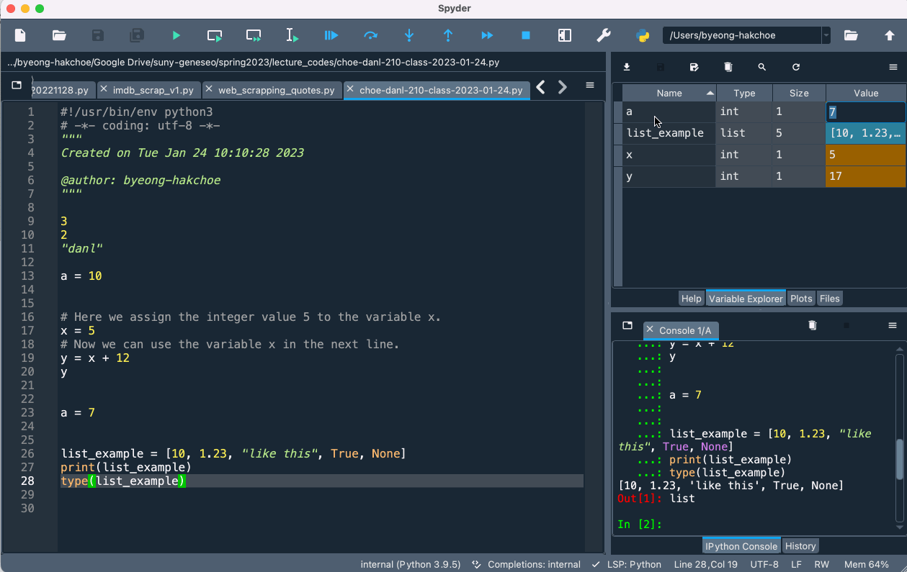
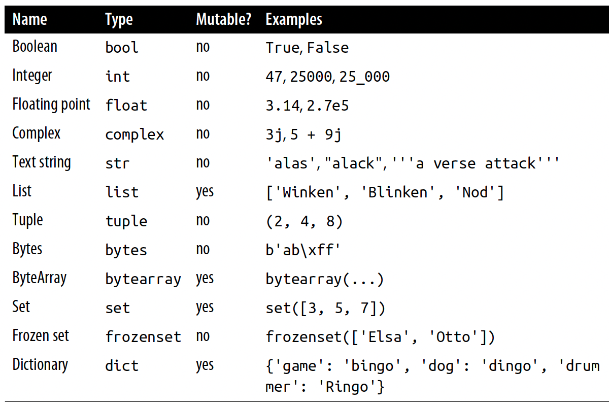

```{r setup, include = FALSE}
library(knitr)
library(kableExtra)
library(tidyverse)
library(NHSRtheme)
library(fontawesome)
# set default options
opts_chunk$set(echo = T, eval = F,
               fig.width = 7.252,
               fig.height = 4,
               comment = "#",
               dpi = 300)

knitr::knit_engines$set("markdown")

xaringanExtra::use_tile_view()
xaringanExtra::use_panelset()
xaringanExtra::use_clipboard()
xaringanExtra::use_webcam()
xaringanExtra::use_broadcast()
xaringanExtra::use_share_again()
xaringanExtra::style_share_again(
  share_buttons = c("twitter", "linkedin", "pocket")
)


xaringanExtra::use_extra_styles(
  hover_code_line = TRUE,         #<<
  mute_unhighlighted_code = TRUE  #<<
)

# uncomment the following lines if you want to use the NHS-R theme colours by default
# scale_fill_continuous <- partial(scale_fill_nhs, discrete = FALSE)
# scale_fill_discrete <- partial(scale_fill_nhs, discrete = TRUE)
# scale_colour_continuous <- partial(scale_colour_nhs, discrete = FALSE)
# scale_colour_discrete <- partial(scale_colour_nhs, discrete = TRUE)
```

class: title-slide, left, bottom

# `r rmarkdown::metadata$title`
----
## **`r rmarkdown::metadata$subtitle`**
### `r rmarkdown::metadata$author`
### `r rmarkdown::metadata$date`

---
# Spyder Environment
### <p style="color:#00449E"> Script Editor </p>
.right-column[
```{r, echo=FALSE, eval = T,  eval = T,out.width = '100%', fig.align='center'}
knitr::include_graphics("../lec_figs/spyder_env.png")
```
]

.left-column[
- From **Script Editor**, we can create, open and edit files.


]
---
# Spyder Environment
### <p style="color:#00449E"> Console Pane </p>

.right-column[
```{r, echo=FALSE, eval = T, out.width = '100%', fig.align='center'}
knitr::include_graphics("../lec_figs/spyder_env.png")
```
]

.left-column[
- From **Console Pane**, we can interact directly with the Python interpreter, and type commands where Python will immediately execute them.

]
---
# Spyder Environment
### <p style="color:#00449E"> Variable Explorer </p>

.right-column[
```{r, echo=FALSE,  eval = T,out.width = '100%', fig.align='center'}
knitr::include_graphics("../lec_figs/spyder_env.png")
```
]

.left-column[
- From **Variable Explorer**, we can see the values of variables, data frames, and other objects that are currently stored in memory.


]


---
# Spyder Environment
### <p style="color:#00449E"> Variable Explorer </p>

.right-column[
```{r, echo=FALSE,  eval = T,out.width = '100%', fig.align='center'}

```
]

.left-column[
- If we doucle-click the objects such as `list` and `DataFrame` objects, we can see what data are contained in such objects.
]


---
# Coding Workflow
### <p style="color:#00449E"> Code and comment style </p>
- The two main principles for coding and managing data are:
  - Make things easier for your future self.
  - Don't trust your future self.

- The `#` mark is Spyder's comment character.
  - `#` indicates that the rest of the line is to be ignored.
  - Write comments before the line that you want the comment to apply to.

- Consider using block commenting for separating code sections.
  - `# %%` defines a coding block in Spyder.

- Break down long lines and long algebraic expressions.


---
# Coding Workflow
### <p style="color:#00449E"> Shortcuts </p>
.pull-left[
### <p style="color:#00449E"> Mac </p>
- **F9** runs a current line (where the blinking cursor is) or selected lines.
- **command + return** runs a current block.
- **command + 1** is the shortcut for #.
- **command + 4** is the shortcut for block comment.
]

.pull-right[
### <p style="color:#00449E"> Windows </p>
- **F9** runs a current line (where the blinking cursor is) or selected lines.
- **Ctrl + Enter** runs a current block.
- **Ctrl + 1** is the shortcut for #.
- **Ctrl + 4** is the shortcut for block comment.
]


---
# Coding Workflow
### <p style="color:#00449E"> Shortcuts </p>


- **Ctrl** (**command** for Mac Users) **+ Z** undoes the previous action.
- **Ctrl** (**command** for Mac Users) **+ Shift + Z** redoes when undo is executed.


- **Ctrl** (**command** for Mac Users) **+ F** is useful when finding a phrase in the Spyder

- **Ctrl** (**command** for Mac Users) **+ R** is useful when replacing a phrase in the Spyder

---
class: inverse, center, middle

# Python Basics


---
#  Python Basics
### <p style="color:#00449E"> Values, Variables, and Types </p>

- A **value** is datum (literal) such as a number or text. 

- There are different **types** of values: 352.3 is known as a *float* or *double*, 22 is an *integer*, and “Hello World!” is a *string*. 

- A **variable** is a name that refers to a value.
  - We can think of a **variable** as a box that has a value, or multiple values, packed inside it.


```{python, echo = T, eval = F}
a = 10
print(a)
```


---
#  Python Basics
### <p style="color:#00449E"> Values, Variables, and Types </p>

- Sometimes you will hear variables referred to as **objects**.

- Everything that is not a literal value, such as 10, is an *object*. 


---
#  Python Basics
### <p style="color:#00449E"> Assignment </p>

- In Python, we use `=` to assign a value to a variable.

```{python, eval = F, echo = T}
# Here we assign the integer value 5 to the variable x.
x = 5   

# Now we can use the variable x in the next line.
y = x + 12  
y
```

- In math, `=` means *equality* of both sides.
- In programs, `=` means **assignment**: *assign the value on the right side to the variable on the left side*.


---
#  Python Basics
### <p style="color:#00449E"> Assignment </p>


- In programs, everything on the right side needs to have a value.
  - The right side can be a literal value, or a variable that has already been assigned a value, or a combination.
  
- When Python reads `y = x + 12`, it does the following:
  - Sees the `=` in the middle.
  - Knows that this is an assignment.
  - Calculates the right side (gets the value of the object referred to by `x` and adds it to `12`).
  - Assigns the result to the left-side variable, `y`.


---
#  Python Basics
### <p style="color:#00449E"> Variables Are Names, Not Places </p>

- In Python, *variables* are just names.


```{r, echo=FALSE,eval = T, out.width = '29%', fig.align='center', fig.cap="Names point to objects (variable `a` points to an integer object with value `7`)"}
knitr::include_graphics("../lec_figs/int-py-fig2-3.png")
```

---
#  Python Basics
### <p style="color:#00449E"> Variables Are Names, Not Places </p>

- The most basic built-in data types that you’ll need to know about are: **integers** 10, **floats** 1.23, **strings** like this, **booleans** True, and **nothing** None.

- Python also has a built-in type called a **list** [10, 15, 20] that can *contain* anything, even different **types** 

```{python, eval = F, echo = T}
list_example = [10, 1.23, "like this", True, None]
print(list_example)
type(list_example)
```


---
#  Python Basics
### <p style="color:#00449E"> Types </p>

.pull-left[
```{r, echo=FALSE, eval = T, out.width = '100%', fig.align='center', fig.cap = "Python’s basic data types"}

```
]

.pull-right[
- The second column (Type) contains the Python name of that type. 

- The third column (Mutable?) indicates whether the value can be changed after creation.
]


---
#  Python Basics
### <p style="color:#00449E"> Brackets </p>

- There are several kinds of brackets in Python, including `[]`, `{}`, and `()`. 


.panelset[

.panel[.panel-name[`[]`]
- `[]` is used to denote a **list** or to signify accessing a *position* using an index.

```{python, echo = T, eval = F}
vector = ['a', 'b']
vector[0]
```


]


.panel[.panel-name[`{}`]
- `{}` is used to denote a **set** or a **dictionary** (with key-value pairs).

```{python, echo = T, eval = F}
{'a', 'b'}
{'first_letter': 'a', 'second_letter': 'b'}
```

]


.panel[.panel-name[`()`]
- `()` is used to denote a **tuple**, or the *arguments* to a *function*, e.g., function(x)  where x is the input passed to the function, or to indicate the order operations are carried out.

```{python, echo = T, eval = F}
num_tup = (1, 2, 3)
sum(num_tup)
```

]

]


---
#  Python Basics
### <p style="color:#00449E"> Lists and Slicing </p>

- Lists are a really useful way to work with lots of data at once. 
  - We can also construct them by appending entries:

```{python, echo = T, eval = F}
list_example = [10, 1.23, "like this", True, None]
list_example.append("one more entry")
print(list_example)
```

- We can access earlier entries using an *index*, which begins at 0 and ends at one less than the length of the list.

```{python, echo = T, eval = F}
print(list_example[0])
print(list_example[-1])
```


---
#  Python Basics
### <p style="color:#00449E"> Lists and Slicing </p>

- Slicing can be even more elaborate than that because we can jump entries using a second colon. 

```{python, echo = T, eval = F}
# range() produces a list of integers from the value to one less than the last
list_of_numbers = list(range(1, 11))
start = 1
stop = -1
step = 2
print(list_of_numbers[ start : stop : step ])
```


---
#  Python Basics
### <p style="color:#00449E"> Operators </p>

- All of the basic operators you see in mathematics are available to use: `+` for addition, `-` for subtraction, `*` for multiplication, `**` for powers, `/` for division, `//` for integer division, and `%` for modulo.

  - These work as you’d expect on numbers. 
  - These operators are sometimes defined for other built-in data types too. 
    - We can ‘sum’ strings (which really concatenates them):

```{python, echo = T, eval = F}
string_one = "This is an example "
string_two = "of string concatenation"
string_full = string_one + string_two
print(string_full)
```


---
#  Python Basics
### <p style="color:#00449E"> Operators </p>

.pull-left[
- It works for lists too:

```{python, echo = T, eval = F}
list_one = ["apples", "oranges"]
list_two = ["pears", "satsumas"]
list_full = list_one + list_two
print(list_full)
```

]

.pull-right[
- We can multiply strings!

```{python, echo = T, eval = F}
string = "apples, "
print(string * 3)
```

]


---
#  Python Basics
### <p style="color:#00449E"> Operators </p>

- We can combine the arithmetic operators with assignment by putting the operator before the `=`.

.pull-left[
- `x += 1` is equivalent to `x = x+1`.
```{python, echo = T, eval = F}
x = 3
x += 1
```
]

.pull-right[
- `a -= 2` is equivalent to `a = a-2`.
```{python, echo = T, eval = F}
a = 2
a -= 2
```
]


---
#  Python Basics
### <p style="color:#00449E"> Operators </p>

**Q**. Using Python operations only, what is
$$\frac{2^5}{7 \cdot (4 - 2^3)} \quad\text{?}$$ 


---
#  Python Basics
### <p style="color:#00449E"> Strings </p>

- From strings, we can access the individual characters via slicing and indexing. 


```{python, echo = T, eval = F}
string = "cheesecake"
print( string[-4:] )
```


- Both lists and strings will allow us to use the `len()` command to get their length:


.pull-left[
```{python, echo = T, eval = F}
string = "cheesecake"
print("String has length:")
print( len(string) )
```
]

.pull-right[
```{python, echo = T, eval = F}
list_of_numbers = range(1, 20)
print("List of numbers has length:")
print( len(list_of_numbers) )
```
]


---
#  Python Basics
### <p style="color:#00449E"> f-string </p>

- `f-string` can combine a number and a string (these begin with an `f` for formatting):
```{python, echo = T, eval = F}
value = 20
sqrt_val = 20 ** 0.5
print(f"The square root of {value:d} is {sqrt_val:.2f}")
```

- The formatting command `:d` is an instruction to treat value like an *integer*, while `:.2f` is an instruction to print it like a *float* with 2 decimal places.


---
#  Python Basics
### <p style="color:#00449E"> Booleans and Conditions </p>

- Boolean data have either `True` or `False` value.


- There are two types of operation that are associated with booleans: boolean operations.
  - Existing booleans are combined, and condition operations, which create a boolean when executed.


```{r, eval = T, echo = F, out.width='100%', fig.align='center'}
text_tbl <- data.frame(
  Operator = c("x and y", "x or y", "not x"),
  Description = c("Are x and y both True?",
"Is at least one of x and y True?",
"Is x False?")
  )


kable(text_tbl, format = "html") %>%
  kable_paper(full_width = T) %>%
  column_spec(1, bold = T, border_right = T) %>%
  kable_styling(html_font = 'sans-serif, helvetica, arial',
                bootstrap_options = c("hover", "condensed") )

```


---
#  Python Basics
### <p style="color:#00449E"> Booleans and Conditions </p>

Conditions are expressions that evaluate as booleans. 

```{r, eval = T, echo = F, out.width='100%', fig.align='center'}
text_tbl <- data.frame(
  Operator = c("x == y", "x != y", "x > y", "x >= y", "x < y", "x <= y", "x is y"),
  Description = c("Is x equal to y?",
"Is x greater than y?",
"Is x greater than or equal to y?",
"Is x greater than or equal to y?",
"Is x less than y?",
"Is x less than or equal to y?",
"Is x the same object as y?" )
)

kable(text_tbl, format = "html") %>%
  kable_paper(full_width = T) %>%
  column_spec(1, bold = T, border_right = T) %>%
  kable_styling(html_font = 'sans-serif, helvetica, arial',
                bootstrap_options = c("hover", "condensed") )

```


---
#  Python Basics
### <p style="color:#00449E"> Booleans and Conditions </p>

- The `==` is an operator that compares the objects on either side and returns `True` if they have the same values

```{python, echo = T, eval = F}
boolean_condition1 = 10 == 20
print(boolean_condition1)

boolean_condition2 = 10 == '10'
print(boolean_condition2)
```

**Q**. What does `not (not True)` evaluate to?


---
#  Python Basics
### <p style="color:#00449E"> Booleans and Conditions </p>

- The real power of conditions comes when we start to use them in more complex examples, such as `if` statements.


```{python, echo = T, eval = F}
name = "Geneseo"
score = 99

if name == "Geneseo" and score > 90:
    print("Geneseo, you achieved a high score.")

if name == "Geneseo" or score > 90:
    print("You could be called Geneseo or have a high score")

if name != "Geneseo" and score > 90:
    print("You are not called Geneseo and you have a high score")
```


---
#  Python Basics
### <p style="color:#00449E"> Booleans and Conditions </p>

- Given that `==` and `!=` test for equality and not equal, respectively, you may be wondering what the keyword `is`  is for.

  - Remember that everything in Python is an object, and that values can be assigned to objects.

  - `==` and `!=` compare values, while `is` compare objects.

.pull-left[
```{python, echo = T, eval = F}
name_list = ["Ada", "Adam"]
name_list_two = ["Ada", "Adam"]
```
]
.pull-right[
```{python, echo = T, eval = F}
# Compare values
print(name_list == name_list_two)

# Compare objects
print(name_list is name_list_two)
```
]


---
#  Python Basics
### <p style="color:#00449E"> Booleans and Conditions </p>

- One of the most useful conditional keywords is `in`. 
  - This one must pop up ten times a day in most coders’ lives because it can pick out a variable or make sure something is where it’s supposed to be.


```{python, echo = T, eval = F}
name_list = ["Lovelace", "Smith", "Hopper", "Babbage"]

print("Lovelace" in name_list)

print("Bob" in name_list)
```

**Q**. Check if “a” is in the string “Sun Devil Arena” using `in`. Is “a” in “Anyone”?


---
#  Python Basics
### <p style="color:#00449E"> Booleans and Conditions </p>

- One conditional construct we're bound to use at some point, is the `if-else` chain:

```{python, echo = T, eval = F}
score = 98

if score == 100:
    print("Top marks!")
elif score > 90 and score < 100:
    print("High score!")
elif score > 10 and score <= 90:
    pass
else:
    print("Better luck next time.")
```


---
#  Python Basics
### <p style="color:#00449E"> Booleans and Conditions </p>


**Q**. Create a new `if-else` chain that prints “well done” if a score is over 90, “good” if between 40 and 90, and “bad luck” otherwise.


---
#  Python Basics
### <p style="color:#00449E"> Booleans and Conditions </p>


- We can make multiple assignment or multiple boolean comparisons in a single line.


```{python, echo = T, eval = F}
a, b = 3, 6
 
1 < a < b < 20
```


---
#  Python Basics
### <p style="color:#00449E"> Casting Variables </p>

- Sometimes we need to explicitly cast a value from one type to another. 

  - We can do this using functions like `str()`, `int()`, and `float()`. 
  - If we try these, Python will do its best to interpret the input and convert it to the output type we’d like and, if they can’t, the code will throw a great big error.

.pull-left[
```{python, echo = T, eval = F}
orig_number = 4.39898498
type(orig_number)
```
]
.pull-right[
```{python, echo = T, eval = F}
mod_number = int(orig_number)
mod_number
type(mod_number)
```
]


---
#  Python Basics
### <p style="color:#00449E"> Tuples and (im)mutability </p>

- A tuple is an object that is defined by parentheses and entries that are separated by commas, for example (15, 20, 32). (They are of type tuple.) 

- Tuples are immutable, while lists are mutable.

- Immutable objects, such as tuples and strings, can’t have their elements changed, appended, extended, or removed. 
  - Mutable objects, such as lists, can do all of these things. 

- In everyday programming, we use lists and dictionaries more than tuples.


---
#  Python Basics
### <p style="color:#00449E"> Indentation </p>

- We have seen that certain parts of the code examples are indented. 

- Code that is part of a function, a conditional clause, or loop is indented. 

- Indention is actually what tells the Python interpreter that some code is to be executed as part of, say, a loop and not to executed after the loop is finished.


---
#  Python Basics
### <p style="color:#00449E"> Indentation </p>

- Here’s a basic example of indentation as part of an `if` statement.

```{python}
x = 10

if x > 2:
    print("x is greater than 2")
```

- The standard practice for indentation is that each sub-statement should be indented by 4 spaces.


---
#  Python Basics
### <p style="color:#00449E"> Loops and List Comprehensions </p>

- A loop is a way of executing a similar piece of code over and over in a similar way. 
  - The most useful loops are **for loops** and **list comprehensions**.


```{python}
name_list = ["Ben", "Chris", "Kate", "Mary"]

for name in name_list:
    print(name)
```

- As long as our object is an iterable, then it can be used in this way in a *for loop*.

- Lists, tuples, strings, and dictionaries are iterable.

---
#  Python Basics
### <p style="color:#00449E"> Loops and List Comprehensions </p>

**Q**. Write a for loop that prints out “coding for data analysts” so that each word is printed in a successive iteration.


---
#  Python Basics
### <p style="color:#00449E"> Loops and List Comprehensions </p>

- A useful trick with for loops is the `enumerate` keyword, which runs through an *index* that keeps track of the place of items in a list:


```{python}
name_list = ["Ben", "Chris", "Kate", "Mary"]

for i, name in enumerate(name_list):
    print(f"The name in position {i} is {name}")
    
for i, name in enumerate(name_list, start=1):
    print(f"The name in position {i} is {name}")
```


---
#  Python Basics
### <p style="color:#00449E"> Loops and List Comprehensions </p>

- Another useful type of for loop is provided by the `zip` function. 
  - We can think of the `zip` function as being like a zipper, bringing elements from two different iterators together in turn. 
  

```{python}
first_names = ["Ada", "Adam", "Grace", "Charles"]
last_names = ["Lovelace", "Smith", "Hopper", "Babbage"]

for forename, surname in zip(first_names, last_names):
    print(f"{forename} {surname}")
```

  

---
#  Python Basics
### <p style="color:#00449E"> Loops and List Comprehensions </p>


.panelset[
.panel[.panel-name[basic]
- **List comprehensions** are a convenient and widely used Python language feature. 
  - The simplest form of list comprehension looks like this:

```{r, echo=FALSE, eval = T, out.width = '66%', fig.align='center'}
knitr::include_graphics("../lec_figs/int-py-list-comprehension.png")
```
]

.panel[.panel-name[example 1]
```{python, echo = T, eval = F}
number_list = [number for number in range(1,6)]
number_list
```
- In the first line, we need the first `number` variable to produce values for the list: that is, to put a result of the loop into `number_list`. 

- The second `number` is part of the for loop.
]

.panel[.panel-name[example 2]
- To show that the first `number` in example 1 is an expression, try this variant:

```{python, echo = T, eval = F}
number_list = [number - 1 for number in range(1,6)]
number_list
```
- The list comprehension moves the loop inside the square brackets.
]


.panel[.panel-name[with if]
- A list comprehension can include a conditional expression, looking something like this:

```{r, echo=FALSE, eval = T, out.width = '50%', fig.align='center'}
knitr::include_graphics("../lec_figs/int-py-list-comprehension-if.png")
```


- Let’s make a new comprehension that builds a list of only the odd numbers between 1 and 5.
```{python, echo = T, eval = F}
a_list = [number for number in range(1,6) if number % 2 == 1]
```
]

.panel[.panel-name[traditional `for`]
- Now, the comprehension is a little more compact than its traditional counterpart:
```{python, echo = T, eval = F}
a_list = []
for number in range(1,6):
    if number % 2 == 1:
        a_list.append(number)
```
]


.panel[.panel-name[Q.]
**Q.** Create a list comprehension that multiplies numbers in the range from 1 to 10 by 5.


]

]


---
#  Python Basics
### <p style="color:#00449E"> Dictionaries </p>

.panelset[

.panel[.panel-name[basic]
- Another built-in Python type that is enormously useful is the dictionary. 
  - This provides a mapping one set of variables to another (either one-to-one or many-to-one). 
  
  
- We can obtain keys, values, or key-value paris from dictionaries.

```{python}
cities_to_temps = {"Paris": 28, "London": 22, "Seville": 36, "Wellesley": 29}
cities_to_temps.keys()
cities_to_temps.values()
cities_to_temps.items()
```
]

.panel[.panel-name[loop]

- Another useful pattern when doing for loops with dictionaries is iteration over key-value pairs. 

```{python}
for key, value in cities_to_temps.items():
    print(f"In {key}, the temperature is {value} degrees C today.")
```
]

.panel[.panel-name[Q.]


**Q**. Write a dictionary that maps four cities you know into their respective countries and print the results using the key-value iteration with for-loop.


**Q**. Are the entries in dictionaries mutable or immutable? To help you answer this, a simple dictionary can be defined as

```{python}
my_dict = {"a": 1, "b": 2}
```

and the values are accessed by `dictionary[key]`.


]

]


---
#  Python Basics
### <p style="color:#00449E"> Dictionary </p>

.panelset[

.panel[.panel-name[update]
- We can update a dictionary:

.pull-left[
```{python}
fruit_dict = {
    "Jazz": "Apple",
    "Owari": "Satsuma",
    "Seto": "Satsuma",
    "Pink Lady": "Apple", }
    
# Add an entry
fruit_dict.update(
        {"Cox": "Apple"})
```
]

.pull-right[
```{python}
variety_list = ["Jazz", "Jazz", 
                "Seto", "Cox" ]

fruit_list = [ fruit_dict[x] 
               for x in 
                  variety_list ]
```
]

]

.panel[.panel-name[Q.]

**Q**. Update the `cities_to_temps` dictionary with another two cities.

```{python}
cities_to_temps = {"Paris": 28, "London": 22, 
                   "Seville": 36, "Wellesley": 29}
```


]

]
---
#  Python Basics
### <p style="color:#00449E"> Loops and Dictionary Comprehensions </p>
.panelset[

.panel[.panel-name[`for`]
- Iterating over a dictionary (or its `keys()` function) returns the keys. 

```{python, echo = T, eval = F}
accusation = {'room': 'ballroom', 
              'weapon': 'lead pipe',
              'person': 'Col. Mustard'}
for card in accusation: # or, for card in accusation.keys():
    print(card)
```

]


.panel[.panel-name[`values()`]
- To iterate over the values rather than the keys, we use the dictionary's `values()` function:


```{python, echo = T, eval = F}
accusation = {'room': 'ballroom', 
              'weapon': 'lead pipe',
              'person': 'Col. Mustard'}
for value in accusation.values():
    print(value)
```

]


.panel[.panel-name[`items()`]
- To return both the key and value as a tuple, we can use the `items()` function:


```{python, echo = T, eval = F}
accusation = {'room': 'ballroom', 
              'weapon': 'lead pipe',
              'person': 'Col. Mustard'}
for item in accusation.items():
    print(item)
```

]
.panel[.panel-name[`items()`]
- For each tuple returned by `items()`, let's assign the first value (the key) to *card*, and the second (the value) to *contents*:

```{python, echo = T, eval = F}
accusation = {'room': 'ballroom', 
              'weapon': 'lead pipe',
              'person': 'Col. Mustard'}
for card, contents in accusation.items():
    print('Card', card, 'has the contents', contents)
```

]

]


---
#  Python Basics
### <p style="color:#00449E"> Loops and Dictionary Comprehensions </p>
.panelset[
.panel[.panel-name[syntax]
- Dictionaries also have comprehensions.
  - The simplest form of dictionary comprehension looks like this:

```{r, echo=FALSE, eval = T, out.width = '80%', fig.align='center'}
knitr::include_graphics("../lec_figs/int-py-dict-comprehension.png")
```

]

.panel[.panel-name[e.g.,]

- Let's run a loop over each of the seven letters in the string 'letters' and counting how many times that letter appears.

```{python, echo = T, eval = F}
word = 'letters'
letter_counts = {letter: word.count(letter) for letter in word}
letter_counts
```

- How many times do we count 't' here?
]


.panel[.panel-name[w/ `set()`]

- Let's run a loop over each of the seven letters in the string 'letters' and counting how many times that letter appears.

```{python, echo = T, eval = F}
word = 'letters'
letter_counts = {letter: word.count(letter) for letter in set(word)}
letter_counts
```

- How many times do we count 't' here?

]


.panel[.panel-name[w/ if]
- Dictionary comprehensions can also have *if* tests and multiple *for* clauses:

```{r, echo=FALSE, out.width = '95%', fig.align='center'}
knitr::include_graphics("../lec_figs/int-py-dict-comprehension-if.png")
```

```{python, echo = T, eval = F}
vowels = 'aeiou'
word = 'onomatopoeia'
vowel_counts = {letter: word.count(letter) for letter in set(word) 
                                           if letter in vowels}
vowel_counts
```

]


]


---
#  Python Basics
### <p style="color:#00449E"> While-Loops </p>

- A `while` loop continue to execute code until its conditional expression evaluates to `False`. 
  - If it evaluates to `True` forever, our code will just continue to execute forever.

```{python}
n = 5
while n > 0:
    print(n)
    n -= 1

print("execution complete")
```

- We can use the keyword `break` to break out of a while loop.
  - For example if it’s reached a certain number of iterations without converging.


---
#  Python Basics
### <p style="color:#00449E"> Running on Empty </p>

- Being able to create empty containers is sometimes useful, especially when using loops. 

- The commands to create empty lists, tuples, dictionaries, and sets are `lst = []`, `tup=()`, `dic={}`, and `st = set()` respectively.

**Q.** What is the type of an empty list?

