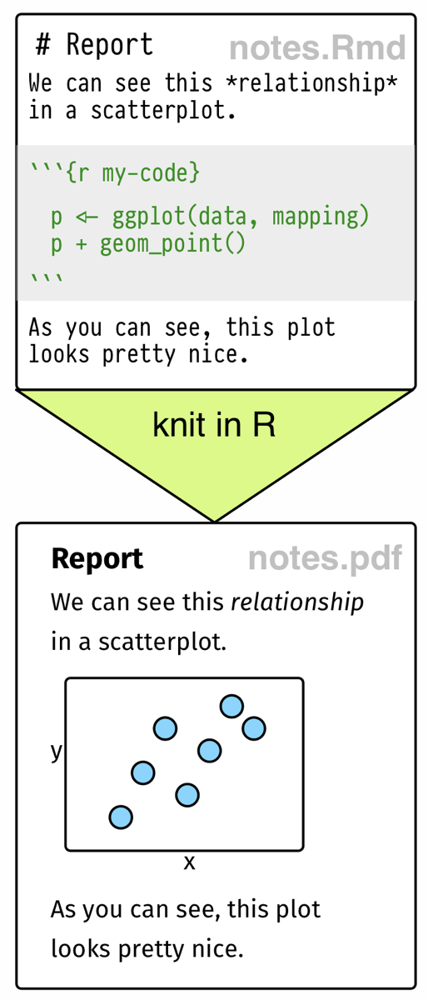
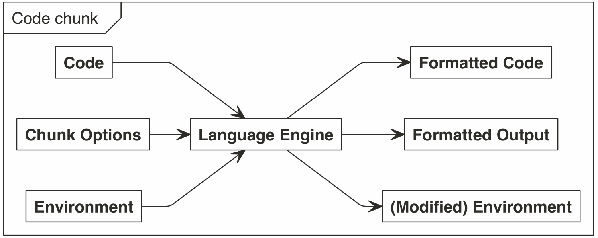
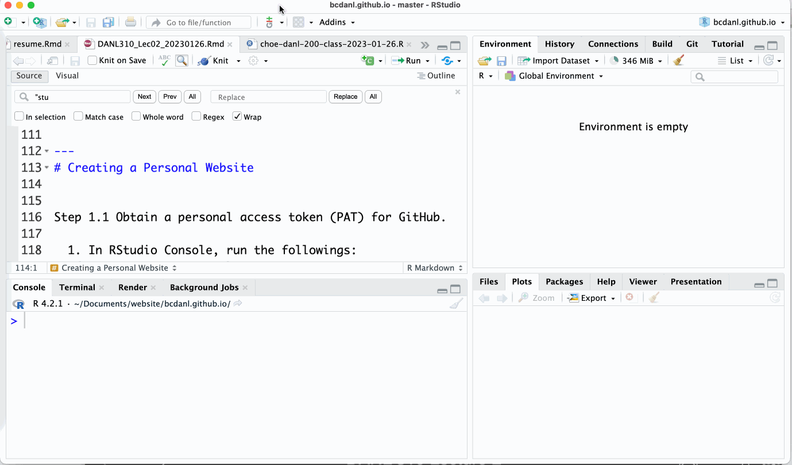

```{r setup, include = FALSE}
library(knitr)
library(kableExtra)
library(tidyverse)
library(NHSRtheme)
library(fontawesome)
# set default options
opts_chunk$set(echo = T, eval = F,
               fig.width = 7.252,
               fig.height = 4,
               comment = "#",
               dpi = 300)

knitr::knit_engines$set("markdown")

xaringanExtra::use_tile_view()
xaringanExtra::use_panelset()
xaringanExtra::use_clipboard()
xaringanExtra::use_webcam()
xaringanExtra::use_broadcast()
xaringanExtra::use_share_again()
xaringanExtra::style_share_again(
  share_buttons = c("twitter", "linkedin", "pocket")
)


xaringanExtra::use_extra_styles(
  hover_code_line = TRUE,         #<<
  mute_unhighlighted_code = TRUE  #<<
)

# uncomment the following lines if you want to use the NHS-R theme colours by default
# scale_fill_continuous <- partial(scale_fill_nhs, discrete = FALSE)
# scale_fill_discrete <- partial(scale_fill_nhs, discrete = TRUE)
# scale_colour_continuous <- partial(scale_colour_nhs, discrete = FALSE)
# scale_colour_discrete <- partial(scale_colour_nhs, discrete = TRUE)
```

class: title-slide, left, bottom

# `r rmarkdown::metadata$title`
----
## **`r rmarkdown::metadata$subtitle`**
### `r rmarkdown::metadata$author`
### `r rmarkdown::metadata$date`

---
class: inverse, center, middle

# Creating a Personal Website using R Markdown, Git, and GitHub
<html><div style='float:left'></div><hr color='#EB811B' size=1px width=796px></html>


---
# Creating a Personal Website
### <p style="color:#00449E"> Updating Your Website </p>

- *1*. Modify `index.Rmd` as follows:

  - Add the following in `index.Rmd`
```{r}
- *Name*: YOUR_NAME
- *Ocupation*: Student
- *Hobbies*: Blogging data analytics. 

Here is a super cool photo. 

<br>

{width=50%}
```

- *2.* Knit it using the shortcut (**Ctrl** (**command** for Mac user) + **Shift** + **K**)


---
# Creating a Personal Website
### <p style="color:#00449E"> Updating Your Website </p>


*3*. In Terminal within RStudio, run the following lines:
```{verbatim, echo = T, eval = F}
git add .
git commit -m "ANY MESSAGE"
git push -u origin main
```


*4*. Go to your website `r emo::ji('smile')`
  1. View `index.html` in web browser.
  2. Go to `https://YOUR_GITHUB_NAME.github.io` . 
  
---
class: inverse, center, middle

# Getting Started with R Markdown
<html><div style='float:left'></div><hr color='#EB811B' size=1px width=796px></html>


---
# Getting Started with R Markdown
### <p style="color:#00449E"> Basics </p>

- R Markdown provides an authoring framework for data science. 


- We can use a single R Markdown file to both
  - save and execute programming codes, and
  - generate high quality reports that can be shared with an audience.


- R Markdown was designed for easier reproducibility.
  - Both the computing code and narratives are in the same document.
  - Results are automatically generated from the source code.
  - It supports output formats, such as static/interactive HTML, PDF, and Word.
  - It supports not only R but also other programming languages, such as Python and SQL.


---
# Getting Started with R Markdown
### <p style="color:#00449E"> Workflow </p>

- Keep the PDF files of "R Markdown Reference Guide" and "R Markdown" Cheatsheet".

- Must-know shortcuts

- **option+command+I** or **Alt+Ctrl+I** : to create a R chunk
- **command+shift+return** or **Ctrl+Shift+Enter** : to run the code in the R chunk
- **command + shift + K** or **Ctrl + Shift + K**: to knit the R Markdown file
- **command + shift + C** or **Ctrl + Shift + C**: to (de-)comment out a line in the R Markdown file (**<!-- YOUR_WORDS_IN_Rmd -->** is used for commenting out `YOUR_WORDS_IN_Rmd`.)


---
# Getting Started with R Markdown
### <p style="color:#00449E"> Basics </p>

- In R Studio, we can create a new R Markdown file from the menu, File -> New File -> R Markdown.

- Open the R Markdown file, `basic_example.Rmd`, from your GitHub website local folder.

- The following syntax is YAML metadata in `basic_example.Rmd`.

```{r}
---
title: "Hello R Markdown"
author: "Awesome Me"
date: "`r format(Sys.time(), '%B %d, %Y')`"
output: html_document
---
```


---
# Getting Started with R Markdown
### <p style="color:#00449E"> YAML </p>


.left-column[
```{r, eval = T, echo = F}

```

]


.right-column[
- An YAML (yet another markup language) header surrounded by `---`.
  - It is commonly used for configuration files (e.g., title, author, date, ...).
  
  
- Chunks of R code surrounded by three backticks, $\text{```}$.
]


---
# Getting Started with R Markdown
### <p style="color:#00449E"> Knitting </p>

- When we knit the document, R Markdown sends the `.Rmd` file to **knitr**, which executes all of the code chunks and creates a new markdown (`.md`) document which includes the code and its output. 

- The markdown file generated by **knitr** is then processed by **pandoc**, which is responsible for creating the output file.

```{r, eval = T, echo = F, fig.align='center', out.width='100%'}
knitr::include_graphics("../lec_figs/rmarkdownflow.png")
```


---
# Getting Started with R Markdown
### <p style="color:#00449E"> Other language engines </p>

- R Markdown supports not only R but also Python, Julia, C++, SQL, and more. 


- The support comes from the `knitr` package, which has provided a large number of language engines. 


```{r, eval = T, echo = F, out.width= '80%', fig.align='center'}

```


---
# Getting Started with R Markdown
### <p style="color:#00449E"> Python engines </p>

- The support for the interaction between R and Python comes from the `reticulate` package.
  - Choose Python or interpreter from Tools -> Global Options -> Python -> Select.
  - Choose Python Interpreter from Conda Environment.


---
# Getting Started with R Markdown
### <p style="color:#00449E"> Python Interpreter in RStudio </p>

```{r, eval = T, echo = F, out.width= '80%', fig.align='center'}

```


---
# Getting Started with R Markdown
### <p style="color:#00449E"> Python </p>

- Install the `reticulate` package.
```{r}
install.packages("reticulate")
```
 
- Try the following with python code with python code chunk ( $\text{```}$ `{python}` PYTHON CODES HERE $\text{```}$ )

```{python, echo = T, eval = F}
import pandas as pd
x = 'hello, python world!'
print(x.split(' '))
```


---
# Getting Started with R Markdown
### <p style="color:#00449E"> Interactive Map </p>
- `leaflet` is one of the most popular open-source JavaScript libraries for interactive maps.

```{r eval= T, echo = F, fig.align='center', out.height= '50%', out.width='95%'}
library(leaflet)
leaflet() %>% addTiles() %>%
  setView(-77.8210, 42.7953, zoom = 18) %>%
  addMarkers(-77.8210, 42.7953) %>% 
  addPopups(
    -77.8210, 42.7953, 
    'Here is the <b>School of Business</b>, SUNY Geneseo'
  )
```


---
# Getting Started with R Markdown and HTML
### <p style="color:#00449E"> Markdown, R Markdown, and HTML </p>

- The very original version of **Markdown** was invented mainly to write HTML content more easily.
  - `- SOME_TEXT` in "\*.md" is equivalent to `<ul><li> SOME_TEXT </li>` in "\*.html"
  
  
- Pandoc makes it possible to convert a Markdown document to a large variety of output formats, such as HTML.


---
# Getting Started with R Markdown and HTML
### <p style="color:#00449E"> YAML </p>

- To create an HTML document from R Markdown, we specify the `html_document` output format in the YAML metadata of our document:


- Open an empty R Markdown file.
  - Copy and paste the following YAML metadata to the empty R Markdown file.

```{verbatim}
---
title: "Habits"
author: YOUR_NAME
date: January 26, 2023
output: 
  html_document
---
```


---
# Getting Started with R Markdown and HTML
### <p style="color:#00449E"> Document Body </p>

- Below the YAML, we provide the document body:

.pull-left[

```{verbatim, echo = T, eval = F}
# Title

## Section X

This is my introduction.

```{r chunk-x}  # We can name the chunk.
x <- 1
print(x)
```

```

]
.pull-right[

````{verbatim, echo = T, eval = F}
      
# Section 1
Wake up
## Section 1.1
Drink water
## Section 1.2
Sleep again

# Section 2
Wake up
````

]


---
# Getting Started with R Markdown and HTML
### <p style="color:#00449E"> Floating TOC </p>

- We can specify the `toc_float` option to float the table of contents to the left of the main document content. 

- The floating table of contents will always be visible. 

```{verbatim, echo = T, eval = F}
---
title: "Habits"
author: YOUR_NAME
date: January 31, 2023
output:
  html_document:
    toc: true
    toc_float: true
---
```


---
# Getting Started with R Markdown and HTML
### <p style="color:#00449E"> Floating TOC </p>

- We may optionally specify a list of options for the `toc_float` parameter which control its behavior. 

  - `collapsed` (defaults to TRUE) controls whether the TOC appears with only the top-level (e.g., H2) headers. 
  
  - If collapsed initially, the TOC is automatically expanded inline when necessary.
  
  - `smooth_scroll` (defaults to TRUE) controls whether page scrolls are animated when TOC items are navigated to via mouse clicks.


---
# Getting Started with R Markdown and HTML
### <p style="color:#00449E"> Floating TOC </p>

```{verbatim, echo = T, eval = F}
---
title: "Habits"
output:
  html_document:
    toc: true
    toc_float: true      
      collapsed: false
      smooth_scroll: false
---
```


---
# Getting Started with R Markdown and HTML
### <p style="color:#00449E"> Section Numbering </p>

- We can add section numbering to headers using the `number_sections` option.
  - We may also use `{.unnumbered}` to unnumber sections.
```{verbatim, echo = T, eval = F}
---
title: "Habits"
output:
  html_document:
    toc: true
    number_sections: true
---
## Next Steps

## Next Next Steps {.unnumbered}
```

---
# Getting Started with R Markdown and HTML
### <p style="color:#00449E"> Tabbed sections </p>
- We can organize content using tabs by applying the `.tabset` class attribute to headers within a document. 
  - This will cause all sub-headers of the header with the `.tabset` attribute to appear within tabs rather than as standalone sections. 
  
````{verbatim}
## Quarterly Results {.tabset}

### By Product

(tab content)

### By Region

(tab content)
```
  


---
# Getting Started with R Markdown and HTML
### <p style="color:#00449E"> Tabbed sections </p>

- The `.tabset-fade` attribute causes the tabs to fade in and out when switching between tabs. 

- The `.tabset-pills` attribute causes the visual appearance of the tabs to be "pill" rather than traditional tabs.


````{verbatim}
## Quarterly Results {.tabset .tabset-fade .tabset-pills}
```


---
# Getting Started with R Markdown and HTML
### <p style="color:#00449E"> Appearance and Style </p>

- `theme` specifies the Bootstrap theme to use for the page (themes are drawn from the [Bootswatch](https://bootswatch.com) theme library).
  - Valid themes include `default`, `bootstrap`, `cerulean`, `cosmo`, `darkly`, `flatly`, `journal`, `lumen`, `paper`, `readable`, `sandstone`, `simplex`, `spacelab`, `united`, and `yeti`. 
  - Pass `null` for no theme (we can use the `css` file to add our own styles).
  
  
- `highlight` specifies the syntax highlighting style. 
  - Supported styles include `default`, `tango`, `pygments`, `kate`, `monochrome`, `espresso`, `zenburn`, `haddock`, `breezedark`, and `textmate`. 
  - Pass `null` to prevent syntax highlighting.


---
# Getting Started with R Markdown and HTML
### <p style="color:#00449E"> Appearance and Style </p>


````{verbatim}
---
title: "Habits"
output:
  html_document:
    theme: united
    highlight: tango
---
```

- Choose the values for `theme` and `highlight` in the `style.css` file for your website .

---
# Getting Started with R Markdown and HTML
### <p style="color:#00449E"> Custom CSS </p>
- Cascading Style Sheets (CSS) is used to format the layout of a webpage (color, font, text size, background, display, etc.). 
  - HTML will format the architecture of the house;
  - CSS will be the carpet and walls to decorate the house;
  - JavaScript adds interactive elements in the house, such as opening doors and lighting.
  
````{verbatim}
---
title: "Habits"
output:
  html_document:
    css: style.css
---
```
  

---
# Getting Started with R Markdown and HTML
### <p style="color:#00449E"> Custom CSS </p>

- We can also target specific sections of documents with custom CSS by adding ids or classes to section headers within your document. 

````{verbatim}
## Next Steps {#nextsteps .emphasized}
```

- The following CSS would enable us to apply CSS to all of its content using either of the following CSS selectors:

````{verbatim}
#nextsteps {
   color: blue;
}
.emphasized {
   font-size: 1.2em; }
```


---
# Getting Started with R Markdown and HTML
### <p style="color:#00449E"> Figure options </p>

.pull-left[
- There are a number of options that affect the output of figures within HTML documents:

  - `fig_width` and `fig_height` control figure width and height (7x5 is used by default).

  - `fig_caption` controls whether figures are rendered with captions.
]

.pull-right[
````{verbatim}
---
title: "Habits"
output:
  html_document:
    fig_width: 7
    fig_height: 6
    fig_caption: true
---
```
]


---
# Getting Started with R Markdown and HTML
### <p style="color:#00449E"> Figure options </p>

- There are a variety of ways to add images to our R Markdown HTML document!


.panelset[

.panel[.panel-name[Markdown]
```{markdown}
{width=25%}
```

- simple
- not very flexible
]

.panel[.panel-name[HTML]
```{html}

```
- most flexible
- takes time to get used to syntax
]


.panel[.panel-name[HTML+Markdown]
```{html}
<div style="width:25%">

</div>
```

]

.panel[.panel-name[knitr]

````{verbatim}

```{r}
knitr::include_graphics("img/geneseo-logo-vertical.png")
```
````
- pretty flexible
- a little bulky

]
]

---
# Getting Started with R Markdown and HTML
### <p style="color:#00449E"> Data frame printing </p>

.pull-left[
- We can change the default display of data frames via the `df_print` option. 

  - `default` 
  - `kable`
  - `tibble`
  - `paged`
]

.pull-right[
````{verbatim}
---
title: "Habits"
output:
  html_document:
      df_print: paged
---
  
```{r}
ggplot2::mpg
```
````

]


---
# Getting Started with R Markdown and HTML
### <p style="color:#00449E"> Data frame printing </p>

.pull-left[
- There are various options for paged tables.
  - `max.print`:	The number of rows to print.
  - `rows.print`:	The number of rows to display.
  - `cols.print`:	The number of columns to display.
  - `cols.min.print`:	The minimum number of columns to display.
  
]

.pull-right[
  - `pages.print`:	The number of pages to display under page navigation.
  - `paged.print`:	When set to `FALSE` turns off paged tables.
  - `rownames.print`:	When set to `FALSE` turns off row names.
  
````{verbatim}

```{r cols.print=3, rows.print=3}
ggplot2::mpg
```

````
]


---
# Getting Started with R Markdown and HTML
### <p style="color:#00449E"> Code Folding </p>


- The `code_folding: hide` option enables us to include R code but have it hidden by default.

```{verbatim}
---
title: "Habits"
output:
  html_document:
    code_folding: hide
---
```

- We can specify `code_folding: show` to still show all programming codes by default but then allow users to hide the codes if they wish.


---
# Getting Started with R Markdown and HTML
### <p style="color:#00449E"> Update the Date Automatically </p>

- We can use `Sys.Date()` or `Sys.time()` to the date field in YAML to set the date today.


- We can also change the time format:
  - %B %Y: November 2023
  - %d/%m/%y: 02/01/23
  - %a/%d/%b: Thu 07 Jan

.pull-left[
```{verbatim}
title: "Hello R Markdown"
date: "`r Sys.Date()`"
output: 
  html_document
```
]

.pull-right[
```{verbatim}
title: "Hello R Markdown"
date: "`r format(Sys.time(), '%d %B, %Y')`"
output: 
  html_document
```
]


---
# Getting Started with R Markdown and HTML
### <p style="color:#00449E"> Update the Date Automatically </p>
