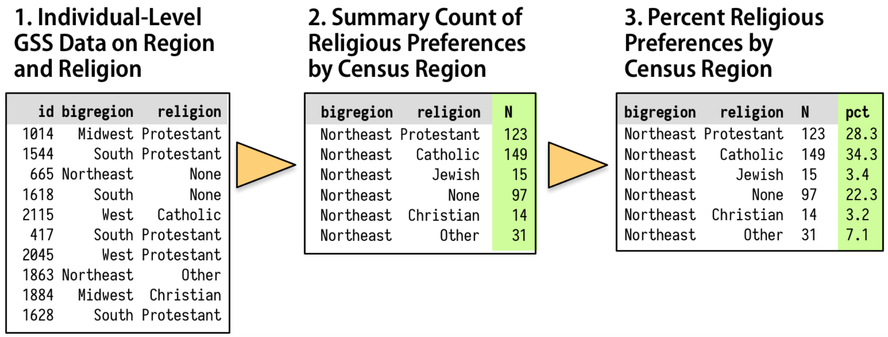

```{r setup, include = FALSE}
library(knitr)
library(kableExtra)
library(tidyverse)
library(NHSRtheme)
library(fontawesome)
library(hrbrthemes)
theme_set(theme_ipsum())
# set default options
opts_chunk$set(echo = T, eval = F,
               fig.width = 7.252,
               fig.height = 4,
               comment = "#",
               dpi = 300)

knitr::knit_engines$set("markdown")

xaringanExtra::use_tile_view()
xaringanExtra::use_panelset()
xaringanExtra::use_clipboard()
xaringanExtra::use_webcam()
xaringanExtra::use_broadcast()
xaringanExtra::use_share_again()
xaringanExtra::style_share_again(
  share_buttons = c("twitter", "linkedin", "pocket")
)


xaringanExtra::use_extra_styles(
  hover_code_line = TRUE,         #<<
  mute_unhighlighted_code = TRUE  #<<
)

# uncomment the following lines if you want to use the NHS-R theme colours by default
# scale_fill_continuous <- partial(scale_fill_nhs, discrete = FALSE)
# scale_fill_discrete <- partial(scale_fill_nhs, discrete = TRUE)
# scale_colour_continuous <- partial(scale_colour_nhs, discrete = FALSE)
# scale_colour_discrete <- partial(scale_colour_nhs, discrete = TRUE)
```

class: title-slide, left, bottom

# `r rmarkdown::metadata$title`
----
## **`r rmarkdown::metadata$subtitle`**
### `r rmarkdown::metadata$author`
### `r rmarkdown::metadata$date`


---
# Workflow
### <p style="color:#00449E"> Shortcuts for Presentation Slides </p>
 
- Use `o` to see the tile view of all the slide pages.

- Use `r fa("arrow-left")` and `r fa("arrow-right")` to turn over the slide pages.

- When you can't turn over slide pages, use **Ctrl + R** (**cmd + R** for mac users) to refresh the webpage.

---
class: inverse, center, middle

# Get Started with `ggplot` visualization
<html><div style='float:left'></div><hr color='#EB811B' size=1px width=796px></html>

---
# Get Started with `ggplot` visualization

*1*. Tell the `ggplot()` function what our **tidy** data is. 
  - `ggplot(data = ...)`


*2*. Tell `ggplot()` what relationships or distributions we want to see.
  - The `ggplot(mapping = aes(...))` 
  - `p <- ggplot(data = ... , aes(...))`
  
  
*3*. Tell `ggplot()` how we want to see the relationships in our data.
  - Choose a `geom_*()`.
  
  
*4*. Layer on `geoms` as needed, by adding them to the `p` object one at a time.


*5*. Use some additional functions to adjust scales, labels, tick marks, titles, etc.


---
# Show the right number
### <p style="color:#00449E"> Facet to make small multiples </p>
- Making a “small multiple” plot by faceting data based on a caterigorical variable allows a lot of information to be presented compactly, and in a consistently comparable way. 
  - `facet_wrap( VAR1 ~ . )` or `facet_wrap( . ~ VAR1 )`
  - `facet_grid( VAR1 ~ . )`: row-wise split
  - `facet_grid( . ~ VAR1 )`: colum-wise split
  - `facet_grid( VAR1 ~ VAR2 )` 

```{r}
library(tidyverse)
library(gapminder)
p <- ggplot(data = gapminder,
            mapping = aes( x = year,
                           y = gdpPercap ) )
p + geom_line( aes( group = country ) ) + 
  facet_wrap(~ continent)
```


---
# Show the right number
### <p style="color:#00449E"> Facet to make small multiples </p>

- Let's have all the facetted plots in a single row:
```{r}
p + geom_line(color="gray70", aes(group = country)) +
    geom_smooth(size = 1.1, method = "loess", se = FALSE) +
    facet_[?] +
    scale_y_log10(labels=scales::dollar) + 
    theme(axis.text.x = element_text(angle = 45),
          axis.title.x = element_text(margin = margin(t = 25))) +
    labs(x = "Year", y = "GDP per capita",
         title = "GDP per capita on Five Continents")
```


---
# Show the right number
### <p style="color:#00449E"> Facet to make small multiples </p>

- In the `facet_*()` functions, the `scales` parameter takes the following options:
  - `"fixed"`: default option, making subplots have the same axis scales.
  - `"free_x"`: allowing subplots to have the different scales for x-axis.  
  - `"free_y"`: allowing subplots to have the different scales for y-axis.
  - `"free"`: allowing subplots to have the different scales for both x-axis and y-axis.


- Having fixed `scales` on a faceted plot helps compare variations across small plots.

---
# Show the right number
### <p style="color:#00449E"> The 2016 General Social Survey data </p>

- The `socviz` package includes the `gss_sm` data frame.
  - `gss_sm` is a dataset containing an extract from the 2016 General Social Survey.

```{r}
install.packages("socviz")
library(socviz)
?gss_sm
glimpse(gss_sm)
skimr::skim(gss_sm)
gss_sm <- gss_sm
```


---
# Show the right number
### <p style="color:#00449E"> Facet to make small multiples </p>

- Describe the relationship between the age of the respondent and the number of children they have using a scatterplot and a fitted curve.

```{r}
p <- ggplot(data = gss_sm,
            mapping = aes( x = age, y = childs ))

p + [?](alpha = 0.2) +
    [?]() 
```


---
# Show the right number
### <p style="color:#00449E"> Facet to make small multiples </p>

- Describe how the relationship between the age of the respondent and the number of children they have varies by `sex` and `race`.

```{r}
p <- ggplot(data = gss_sm,
            mapping = aes( x = age, y = childs ))

p + geom_point(alpha = 0.2) +
    geom_smooth() +
    [?]
```


---
# Show the right number
### <p style="color:#00449E"> Facet to make small multiples </p>

- The `facet_grid()` function is best used when you cross-classify some data by two categorical variables.

  - e.g., the relationship between the age and the number of children by sex and race


```{r}
p <- ggplot(data = gss_sm,
            mapping = aes( x = age, y = childs ))

p + geom_point(alpha = 0.2) +
    geom_smooth() +
    facet_grid(sex ~ race + degree)
```


---
# Show the right number
### <p style="color:#00449E"> Geoms can transform data </p>

- Let's plot a bar char:

```{r}
p <- ggplot(data = gss_sm,
            mapping = aes(x = bigregion))
p + geom_bar()
```


---
# Show the right number
### <p style="color:#00449E"> Geoms can transform data </p>


- Where does count come from? 

  - Bar charts, histograms, and frequency polygons bin your data and then plot bin counts, the number of points that fall in each bin.

  - Smoothers fit a model to your data and then plot predictions from the model.

  - Boxplots compute a robust summary of the distribution and then display a specially formatted box.


---
# Show the right number
### <p style="color:#00449E"> Geoms can transform data </p>


- If we want a chart of relative frequencies rather than counts, we will need to get the `prop` statistic instead.

- Our call to statistic from the `aes()` function generically looks like this: `<mapping> = <..statistic..>`. 

```{r}
p <- ggplot(data = gss_sm,
            mapping = aes(x = bigregion))
p + geom_bar(mapping = aes(y = ..prop..))
```

- What happened?


---
# Show the right number
### <p style="color:#00449E"> Geoms can transform data </p>

- We need to tell ggplot to ignore the x-categories when calculating denominator of the proportion, and use the total number observations instead.

  - To do so we specify `group = 1` inside the `aes()` call. 

```{r}
p <- ggplot(data = gss_sm,
            mapping = aes(x = bigregion))
p + geom_bar(mapping = aes(y = ..prop.., group = 1)) 
```


---
# Show the right number
### <p style="color:#00449E"> Geoms can transform data </p>

- Let’s look at another question from the survey. The `gss_sm` data contains a religion variable derived from a question asking:

  - “What is your religious preference? Is it Protestant, Catholic, Jewish, some other religion, or no religion?”

```{r}
table(gss_sm$religion)
```

---
# Show the right number
### <p style="color:#00449E"> Geoms can transform data </p>

```{r}
p <- ggplot(data = gss_sm,
            mapping = aes(x = religion, color = religion))
p + geom_bar()
```

- If we map religion to `color`, only the border lines of the bars will be assigned colors, and the insides will remain gray.


---
# Show the right number
### <p style="color:#00449E"> Geoms can transform data </p>

-  If the gray bars look boring and we want to fill them with color instead, we can map the religion variable to `fill` in addition to mapping it to `x`.

```{r}
p <- ggplot(data = gss_sm,
            mapping = aes(x = religion, fill = religion))
p + geom_bar() + guides( fill = "none" )
```

-  If we set `guides(fill = "none")`, the legend about the `fill` mapping is removed.


---
# Show the right number
### <p style="color:#00449E"> Frequency plots the slightly awkward way </p>

- A more appropriate use of the `fill` aesthetic with `geom_bar()` is to cross-classify two categorical variables. 

  - The default output of such `geom_bar()` is a stacked bar chart, with counts on the y-axis.


```{r}
p <- ggplot(data = gss_sm,
            mapping = aes(x = bigregion, fill = religion))
p + geom_bar(position = "fill")
```
- An alternative choice is to set the position argument to `"fill"`.
  - It is to compare proportions across groups.


---
# Show the right number
### <p style="color:#00449E"> Frequency plots the slightly awkward way </p>

- We can use `position = "dodge"` to make the bars within each region of the country appear side by side.

```{r}
p <- ggplot(data = gss_sm,
            mapping = aes(x = bigregion, fill = religion))
p + geom_bar(position = "dodge",
             mapping = aes(y = ..prop..))

```

- What happened?

---
# Show the right number
### <p style="color:#00449E"> Frequency plots the slightly awkward way </p>

- In this case we should consider grouping variable, `religion`, so we map `religion` to the `group` aesthetic.

```{r}
p <- ggplot(data = gss_sm,
            mapping = aes(x = bigregion, fill = religion))
p + geom_bar(position = "dodge",
             mapping = aes(y = ..prop.., group = religion))
```


---
# Show the right number
### <p style="color:#00449E"> Frequency plots the slightly awkward way </p>

- How can we have a proportional bar chart such that the sum of all bars in each bigregion is 1?

  - There are various ways to do so, and faceting is one of them.
  - The proportions are calculated within each panel, which is the breakdown we wanted.


```{r}
p <- ggplot(data = gss_sm,
            mapping = aes(x = religion))
p + geom_bar(position = "dodge",
             mapping = aes(y = ..prop.., group = bigregion)) +
    facet_wrap(~ bigregion, ncol = 1)
```


---
# Show the right number
### <p style="color:#00449E"> Histograms and density plots </p>

- ggplot comes with a dataset, `midwest`, containing information on counties in several midwestern states of the USA. 

```{r}
?midwest
glimpse(midwest)
skim(midwest)
view(midwest)
```

---
# Show the right number
### <p style="color:#00449E"> Histograms and density plots </p>

- By default, the `geom_histogram()` function will choose a bin size for us based on a rule of thumb.

```{r}
p <- ggplot(data = midwest,
            mapping = aes(x = area))
p + geom_histogram()
```


- We can also try `geom_freqpoly()` instead.

---
# Show the right number
### <p style="color:#00449E"> Histograms and density plots </p>

- When drawing histograms it is worth experimenting with `bins` and also optionally the origin of the x-axis. 
```{r}
p <- ggplot(data = midwest,
            mapping = aes(x = area))
p + geom_histogram(bins = 10)
```

---
# Show the right number
### <p style="color:#00449E"> Histograms and density plots </p>


- While histograms summarize single variables, it’s also possible to use several at once to compare distributions. 
  - We can facet histograms by some variable of interest.
  - We can also compare them in the same plot using the fill mapping.

```{r}
oh_wi <- c("OH", "WI")

p <- ggplot(data = filter(midwest, 
                          state %in% oh_wi),
            mapping = aes(x = percollege, fill = state) )
p + geom_histogram(alpha = 0.4, bins = 20)
```


---
# Show the right number
### <p style="color:#00449E"> Histograms and density plots </p>

- When working with a continuous variable, an alternative to binning the data and making a histogram is to calculate a kernel density estimate of the underlying distribution with `geom_density()`.

```{r}
p <- ggplot(data = midwest,
            mapping = aes(x = area))
p + geom_density()
```


---
# Show the right number
### <p style="color:#00449E"> Histograms and density plots </p>

- Here we can use `color` (for the lines) and `fill` (for the body of the density curve) for aesthetic mappings. 

```{r}
p <- ggplot(data = midwest,
            mapping = aes(x = area, fill = state, color = state))
p + geom_density(alpha = 0.3)
```


---
# Show the right number
### <p style="color:#00449E"> Histograms and density plots </p>

- For `geom_density()`, the `stat_density()` function can return its default `after_stat(density)` statistic, or `after_stat(scaled)`, which will give a proportional density estimate.

```{r}
p <- ggplot(data = filter(midwest, state %in% oh_wi),
            mapping = aes(x = area, fill = state, color = state))
p + geom_density( alpha = 0.3, mapping =  aes(y = after_stat(scaled) )  )
```


---
# Show the right number
### <p style="color:#00449E"> Avoid transformations when necessary </p>

- When we call `geom_bar()`, it does its calculations on the fly using `stat_count()` behind the scenes to produce the **counts** or **proportions** it displays. 


```{r, echo=FALSE, out.width = '100%', fig.align='center'}
knitr::include_graphics("../lec_figs/r4s_370_1.png")
```


---
# Show the right number
### <p style="color:#00449E"> Avoid transformations when necessary </p>

- But often, our data is in effect already a summary table. 

- Let's consider the `socviz::titanic` data.frame.
```{r}
socviz::titanic
```

- Should we avoid transforming data if we want to describe the relationship between `fate` and `percent`?

```{r}
p <- ggplot(data = titanic,
            mapping = aes(x = fate, y = percent, fill = sex))
p + geom_bar(position = "dodge", stat = "identity") +
  theme(legend.position = "top")
```


---
# Show the right number
### <p style="color:#00449E"> Avoid transformations when necessary </p>

- `geom_col()` has exactly the same as `geom_bar()` except that it assumes that `stat = "identity"`. 

- Let's consider `socviz::oecd_sum` data.frame.
  - It contains information on average life expectancy at birth within the United States, and across other OECD countries.

```{r}
oecd_sum
```

- Let's draw the bar chart that describe the `diff`erence over time using `color = hi_lo`.


---
# Show the right number
### <p style="color:#00449E"> Avoid transformations when necessary </p>


```{r, echo = F, eval = T, warning = F, message = F, out.width = '80%', fig.align = 'center'}
p <- ggplot(data = socviz::oecd_sum,
            mapping = aes(x = year, y = diff, fill = hi_lo))
p + geom_col() + guides(fill = "none") +
  labs(x = NULL, y = "Difference in Years",
       title = "The US Life Expectancy Gap",
       subtitle = "Difference between US and OECD in average life expectancies, 1960-2015",
       caption = "Data: OECD. After a chart by Christopher Ingraham,
                  Washington Post, December 27th 2017.") +
                  theme_minimal()
```


---
# Show the right number
### <p style="color:#00449E"> Bar plots as an alternative to line plots </p>

- `geom_bar()`'s default `position` mapping is `position = "stack"`.


-  Just as `stat = "identity"` means “don’t do any summary calculations”, `position = "identity"` means “just plot the values as given”. 
  - This allows us to do things like, for example, plot a flow of positive and negative values in a bar chart. 
  - This sort of graph is an alternative to a line plot and is often seen in public policy settings where changes relative to some threshold level or baseline are of interest.
  
  
  

---
# Show the right number
### <p style="color:#00449E"> Class Exercises </p>

- Revisit the `gapminder` plots and experiment with different ways to facet the data. 
  - Try plotting population and per capita GDP while faceting on year, or even on country.
  - Experiment changing the height and width of the figure.
  
  
- Investigate the difference between a formula written as `facet_grid(sex ~ race)` versus one written as `facet_grid(~ sex + race)`.


---
# Show the right number
### <p style="color:#00449E"> Class Exercises </p>

- The `geom_bin2d()` function takes two mappings, `x` and `y`. 
  - It divides your plot into a grid and colors the bins by the count of observations in them. 
  - Try using it on the `gapminder` data to plot life expectancy versus per capita GDP. 
  - Like a histogram, we can vary the number or width of the bins for both `x` or `y`, (e.g., `bins = c(20, 50)`). 
  - If we specify `bindwith` instead, we will need to pick values that are on the same scale as the variable we are mapping.
  
  

---
class: inverse, center, middle

# Graph tables, add labels, make notes
<html><div style='float:left'></div><hr color='#EB811B' size=1px width=796px></html>


---
# Graph tables, add labels, make notes
### <p style="color:#00449E">  </p>

- We will learn about how to transform `data.frame` before we send it to `ggplot` to be turned into a figure. 
  - We will learn how to use some of `dplyr`'s “action verbs” to `filter`, `select`, `group`, `mutate`, `summarize` and transform our data.


- We will expand the number of geoms we know about, and learn more about how to choose between them. 
  - Different geoms potentially requires different aesthetic mappings.


- We will learn how to customize the scale, guide, and theme functions in ggplot.
  - These techniques will allow us to produce very sophisticated graphs in a systematic, comprehensible way.
  - [ggThemeAssist](https://github.com/calligross/ggthemeassist) can be helpful.
  
  

---
# Graph tables, add labels, make notes
### <p style="color:#00449E"> Use pipes to summarize data </p>
- Let's describe how the distribution of religious preferences varies by regions in the US using the `socviz::gss_sm` data.frame.

```{r, echo=FALSE, out.width = '100%', fig.align='center'}

```


---
# Graph tables, add labels, make notes
### <p style="color:#00449E"> Use pipes to summarize data </p>

- Group the data into the nested structure we want for our summary, such as “Religion by Region” or “Authors by Publications by Year”.


- Filter or select pieces of the data by row, column, or both. 


- Mutate the data by creating new variables at the current level of grouping.    - This adds new columns to the table without aggregating it.


- Summarize or aggregate the grouped data. 
  - This creates new variables (e.g., means with `mean()`, sums with `sum()`, and counts with `n()`) at a higher level of grouping.


---
# Graph tables, add labels, make notes
### <p style="color:#00449E"> Use pipes to summarize data </p>

- We use the dplyr functions, `group_by()`, `filter()`, `select()`, `mutate()`, and `summarize()`, to carry out these data transformation tasks within our pipeline (`%>%`, **Ctrl/Cmd + Shift + M**). 

- Let's create a new data.frame called `rel_by_region`.

```{r}
library(socviz)
rel_by_region <- gss_sm %>%
    group_by( bigregion, religion ) %>%
    summarize( N = n() ) %>%
    mutate( freq = N / sum(N),
            pct = round( (freq*100), 0) )

rel_by_region
```


---
# Graph tables, add labels, make notes
### <p style="color:#00449E"> Use pipes to summarize data </p>

- Now that we are working directly with percentage values in a summary table, we can use `geom_col()` instead of `geom_bar()`.

```{r, eval = T, echo = F, warning=F, message=F}
library(socviz)
rel_by_region <- gss_sm %>%
    group_by( bigregion, religion ) %>%
    summarize( N = n() ) %>%
    mutate( freq = N / sum(N),
            pct = round( (freq*100), 0) )
```

.pull-left[
```{r}
p <- ggplot( rel_by_region, 
             aes( x = bigregion, 
                  y = pct, 
                  fill = religion))

p + geom_col( position = "dodge2" ) +
    labs(x = "Region", 
         y = "Percent", 
         fill = "Religion") +
    theme(legend.position 
            = "top") 
```
]
.pull-right[
```{r, echo = F, eval = T}
p <- ggplot( rel_by_region, 
             aes( x = bigregion, 
                  y = pct, 
                  fill = religion))

p + geom_col( position = "dodge2" ) +
    labs(x = "Region", 
         y = "Percent", 
         fill = "Religion") +
    theme(legend.position 
            = "top") 
```
]


---
# Graph tables, add labels, make notes
### <p style="color:#00449E"> Use pipes to summarize data </p>

- Let's replicate the following bar chart:

```{r, echo = F, eval = T, message = F, warning = F, out.width='85%', fig.align='center'}
p <- ggplot(rel_by_region, aes(x = religion, y = pct, fill = religion))
p + geom_col(position = "dodge2") +
    labs(x = NULL, y = "Percent", fill = "Religion") +
    guides(fill = FALSE) + 
    coord_flip() + 
    facet_grid(~ bigregion)
```


---
# Graph tables, add labels, make notes
### <p style="color:#00449E"> Continuous variables by group or category </p>

- Let’s move to a new dataset, the `socviz::organdata` data.frame. 

```{r}
organdata
skimr::skim(organdata)
```

- We can take a look at a simple scatterplot of donors vs year.

```{r, echo = F, eval = T, warning = F, message= F, out.width='85%', fig.align='center'}
p <- ggplot(data = organdata,
            mapping = aes(x = year, y = donors))
p + geom_point()
```


---
# Graph tables, add labels, make notes
### <p style="color:#00449E"> Continuous variables by group or category </p>

- Let's draw a yearly trend of `donors` for each country.

```{r, echo = F, eval = T, warning = F, message= F, out.width='85%', fig.align='center'}
p <- ggplot(data = organdata,
            mapping = aes(x = year, y = donors))
p + geom_line(aes(group = country)) + facet_wrap(~ country)

```


---
# Graph tables, add labels, make notes
### <p style="color:#00449E"> Continuous variables by group or category </p>

- Let’s focus on the country-level variation of `donors` using `geom_boxplot()`, but without paying attention to the time trend.

```{r, echo = F, eval = T, warning = F, message= F, out.width='85%', fig.align='center'}

p <- ggplot(data = organdata,
            mapping = aes(y = country, x = donors))
p + geom_boxplot()
```


---
# Graph tables, add labels, make notes
### <p style="color:#00449E"> Continuous variables by group or category </p>


- We can reorder the levels using `fct_reorder(f, x, fun)`, which can take three arguments.

- `f`: the factor whose levels we want to modify.
- `x`: a numeric vector that we want to use to reorder the levels.
- Optionally, `fun`: a function that's used if there are multiple values of `x` for each value of `f`. The default value is *median*.


```{r}
organdata <- organdata %>%
  mutate(country = fct_reorder(country, tvhours, na.rm = T) ) 

p <- ggplot(data = organdata,
            mapping = aes(x = country, y = donors))
p + geom_boxplot() +
    labs(x = NULL) +
    coord_flip()

```


---
# Graph tables, add labels, make notes
### <p style="color:#00449E"> Continuous variables by group or category </p>

- Let’s replicate the following boxplot:

```{r, echo = F, eval = T, warning = F, message= F, out.width='85%', fig.align='center'}
p <- ggplot(data = organdata,
            mapping = aes(x = reorder(country, donors, na.rm=TRUE),
                          y = donors, fill = world))
p + geom_boxplot() + labs(x=NULL) +
    coord_flip() + theme(legend.position = "top")

```


---
# Graph tables, add labels, make notes
### <p style="color:#00449E"> Continuous variables by group or category </p>

- Sometimes it is better to sort the data with a categorical variable when plotting a bar chart or a Cleveland dotplot.


---
# Graph tables, add labels, make notes
### <p style="color:#00449E"> Continuous variables by group or category </p>

- Let's summarize the data.frame `organdata` to calculate the mean and the standard deviation of each numeric variable for each `consent_law`-`country` pair.

```{r}
by_country <- organdata %>% group_by(consent_law, country) %>%
    summarize(donors_mean= mean(donors, na.rm = TRUE),
              donors_sd = sd(donors, na.rm = TRUE),
              gdp_mean = mean(gdp, na.rm = TRUE),
              health_mean = mean(health, na.rm = TRUE),
              roads_mean = mean(roads, na.rm = TRUE),
              cerebvas_mean = mean(cerebvas, na.rm = TRUE))

by_country
```

- Would there be a simpler way to do the task above?


---
# Graph tables, add labels, make notes
### <p style="color:#00449E"> Continuous variables by group or category </p>

- What we would like to do is apply the `mean()` and `sd()` functions to every numerical variable in `organdata`, but only the numerical ones. 

  - `summarize_if( is.numeric, lst(mean, sd), na.rm = T)` works really well.

```{r}
by_country <- organdata %>% group_by(consent_law, country) %>%
  summarize_if(is.numeric, lst(mean, sd), na.rm = TRUE) %>%
  ungroup()
```


---
# Graph tables, add labels, make notes
### <p style="color:#00449E"> Continuous variables by group or category </p>

- Let's draw the following dot plot.

```{r, echo = F, eval = T, warning = F, message= F, out.width='85%', fig.align='center'}
by_country <- organdata %>% group_by(consent_law, country) %>%
  summarize_if(is.numeric, lst(mean, sd), na.rm = TRUE) %>%
  ungroup()

p <- ggplot(data = by_country,
            mapping = aes(x = donors_mean, y = reorder(country, donors_mean),
                          color = consent_law))
p + geom_point(size=3) +
    labs(x = "Donor Procurement Rate",
         y = "", color = "Consent Law") +
    theme(legend.position="top")

```


---
# Graph tables, add labels, make notes
### <p style="color:#00449E"> Continuous variables by group or category </p>

- Let's draw the following faceted dot plot.


```{r, echo = F, eval = T, warning = F, message= F, out.width='85%', fig.align='center'}
by_country <- organdata %>% group_by(consent_law, country) %>%
  summarize_if(is.numeric, lst(mean, sd), na.rm = TRUE) %>%
  ungroup()

p <- ggplot(data = by_country,
            mapping = aes(x = donors_mean,
                          y = reorder(country, donors_mean)))

p + geom_point(size=3) +
    facet_wrap(~ consent_law, scales = "free_y", ncol = 1) +
    labs(x= "Donor Procurement Rate",
         y= "") 
```


---
# Graph tables, add labels, make notes
### <p style="color:#00449E"> Continuous variables by group or category </p>

- Cleveland dotplots are generally preferred to bar or column charts.
  - When making them, put the categories on the y-axis and order them in the way that is most relevant to the numerical summary you are providing.
  - This sort of plot is also an excellent way to summarize model results or any data with **error ranges**. 
  
  
- Using `geom_pointrange()`, we can tell ggplot to show us a point estimate and a range around it.
  -  With `geom_pointrange()`, we map our `x` and `y` variables as usual, but the function needs a little more information than `geom_point()`, for example (`ymin`, `ymax`) or (`xmin`, `xmax`). 
  
  

---
# Graph tables, add labels, make notes
### <p style="color:#00449E"> Continuous variables by group or category </p>

- Let's draw the following dot-and-whisker plot.

```{r, echo = F, eval = T, warning = F, message= F, out.width='85%', fig.align='center'}
p <- ggplot(data = by_country, mapping = aes(x = reorder(country,
              donors_mean), y = donors_mean))

p + geom_pointrange(mapping = aes(ymin = donors_mean - donors_sd,
       ymax = donors_mean + donors_sd)) +
     labs(x= "", y= "Donor Procurement Rate") + coord_flip()
```