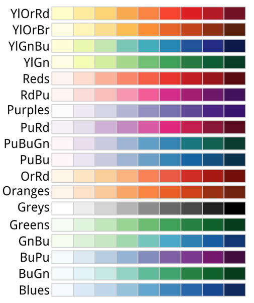
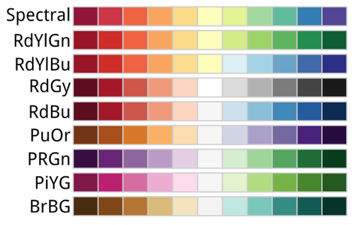
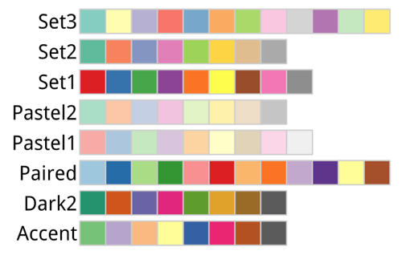

# Refine your plots


## R packages

```{r, echo=T, eval=T, fig.align='center', fig.height=5.5, message=FALSE, warning=FALSE}
library(tidyverse)
library(socviz)
library(ggthemes)
library(ggridges)
library(ggrepel)
library(RColorBrewer)
library(dichromat)
theme_set(theme_minimal())
```

## Use color to your advantage {.build .faster}

- You should choose a color palette based on the types of the data you are plotting.
  - An unordered categorical variable (e.g., 'Sex' or 'Country') requires distinct colors that won’t be easily confused with one another.
  - An ordered categorical variable  (e.g., 'Level of Education') requires a graded color scheme of some kind running from less to more or earlier to later.


## Use color to your advantage {.build .faster}

- We choose color palettes for mappings through one of the `scale_` functions for `color` or `fill`. 

- `RColorBrewer` package provides a wide range of named color palettes.
  - You can access these colors by specifying the `scale_color_brewer()` or `scale_fill_brewer()` functions with `palette` parameter.


## `RColorBrewer`'s sequential palettes
{hight=85%}


## `RColorBrewer`'s diverging palettes
{hight=90%}


## `RColorBrewer`'s qualitative palettes
{hight=90%}


## Use color to your advantage {.build .faster}

```{r, echo=T, eval=F, fig.align='center', fig.height=5.5, message=FALSE, warning=FALSE}
p <- ggplot(data = organdata,
            mapping = aes(x = roads, y = donors, color = world))

p + geom_point(size = 2) + scale_color_brewer(palette = "Set2") +
    theme(legend.position = "top")
```


## Use color to your advantage

```{r, echo=F, eval=T, fig.align='center', fig.height=5.5, message=FALSE, warning=FALSE}
p <- ggplot(data = organdata,
            mapping = aes(x = roads, y = donors, color = world))

p + geom_point(size = 2) + scale_color_brewer(palette = "Set2") +
    theme(legend.position = "top")
```


## Use color to your advantage {.build .faster}

```{r, echo=T, eval=F, fig.align='center', fig.height=5.5, message=FALSE, warning=FALSE}
p <- ggplot(data = organdata,
            mapping = aes(x = roads, y = donors, color = world))

p + geom_point(size = 2) + scale_color_brewer(palette = "Pastel2") +
    theme(legend.position = "top")
```


## Use color to your advantage

```{r, echo=F, eval=T, fig.align='center', fig.height=5.5, message=FALSE, warning=FALSE}
p <- ggplot(data = organdata,
            mapping = aes(x = roads, y = donors, color = world))

p + geom_point(size = 2) + scale_color_brewer(palette = "Pastel2") +
    theme(legend.position = "top")
```


## Use color to your advantage {.build .faster}

```{r, echo=T, eval=F, fig.align='center', fig.height=5.5, message=FALSE, warning=FALSE}
p <- ggplot(data = organdata,
            mapping = aes(x = roads, y = donors, color = world))

p + geom_point(size = 2) + scale_color_brewer(palette = "Dark2") +
    theme(legend.position = "top")
```


## Use color to your advantage

```{r, echo=F, eval=T, fig.align='center', fig.height=5.5, message=FALSE, warning=FALSE}
p <- ggplot(data = organdata,
            mapping = aes(x = roads, y = donors, color = world))

p + geom_point(size = 2) + scale_color_brewer(palette = "Dark2") +
    theme(legend.position = "top")
```


## Use color to your advantage {.build .faster}
- We can also specify colors manually, via `scale_color_manual()` or `scale_fill_manual()`. 
  - These functions take `values` argument that can be specified as vector of color names or hex colors. 

```{r, echo=T, eval=F, fig.align='center', fig.height=5.5, message=FALSE, warning=FALSE}
p <- ggplot(data = organdata,
            mapping = aes(x = roads, y = donors, color = world))

p + geom_point(size = 2) + 
  scale_color_manual(values = c("#3c6ff8", "#afd68d", "#8467ad", "#82857f")) +
  theme_minimal() + theme(legend.position = "top") 
```


## Use color to your advantage

```{r, echo=F, eval=T, fig.align='center', fig.height=5.5, message=FALSE, warning=FALSE}
p <- ggplot(data = organdata,
            mapping = aes(x = roads, y = donors, color = world))

p + geom_point(size = 2) + 
  scale_color_manual(values = c("#3c6ff8", "#afd68d", "#8467ad", "#82857f")) + theme(legend.position = "top") 
```


## Use color to your advantage {.build .faster}
- Even though colorblind people can recognize a wide range of colors, it might be hard to differentiate between certain colors. 

  - `dichromat` package provides a range of safe palettes and some useful functions for helping you approximately see what your current palette might look like to a viewer with one of several different kinds of color blindness.

```{r, include = F}
Default <- brewer.pal(5, "Set2")
types <- c("deutan", "protan", "tritan")
names(types) <- c("Deuteronopia", "Protanopia", "Tritanopia")

color_table <- types %>%
    purrr::map(~ dichromat(Default, .x)) %>%
    as_tibble() %>%
    add_column(Default, .before = TRUE)
color_table
```


```{r, echo=T, eval=T, fig.align='center', fig.height=5.5, message=FALSE, warning=FALSE}
Default <- brewer.pal(5, "Set2")
types <- c("deutan", "protan", "tritan")
names(types) <- c("Deuteronopia", "Protanopia", "Tritanopia")

color_table <- types %>%
    purrr::map(~ dichromat(Default, .x)) %>%
    as_tibble() %>%
    add_column(Default, .before = TRUE)

color_table
```


## Use color to your advantage 

- Let's compare a default color palette with an approximation of how the same palette appears to people with one of three kinds of color blindness.

```{r, echo=T, eval=T, fig.align='center', fig.height=5.5, message=FALSE, warning=FALSE}
color_comp(color_table)
```


## Use color to your advantage 

- `RColorBrewer` provides the color-blind friendly pallets.

```{r, echo=T, eval=T, fig.align='center', fig.height=5.5, message=FALSE, warning=FALSE}
display.brewer.all(n=NULL, type="all", select=NULL, exact.n=TRUE, colorblindFriendly=TRUE)
```


## Use color to your advantage 

- `RColorBrewer` provides the color-blind friendly pallets.

```{r, echo=T, eval=T, fig.align='center', fig.height=5.5, message=FALSE, warning=FALSE}
brewer.pal.info
```


## Layer color and text together {.build .faster}

- Color is very useful when we want to pick out or highlight some aspect of our data.

- Let's do a simple exploratory analysis on the relationship between politics and race using `color`.

-  First, use `county_data` with a value of "No" on the `flipped` variable to draw a scatter plot on the `pop`-`black/100` plane.

```{r, echo=T, eval=F, fig.align='center', fig.height=5.5, message=FALSE, warning=FALSE}
party_colors <- c("#2E74C0", "#CB454A") # DEM Blue and REP Red

p0 <- ggplot(data = subset(county_data,
                           flipped == "No"),
             mapping = aes(x = pop, y = black/100) )

p1 <- p0 + geom_point(alpha = 0.15, color = "gray50") +
    scale_x_log10(labels=scales::comma) 
p1
```


## Layer color and text together

```{r, echo=F, eval=T, fig.align='center', fig.height=5.5, message=FALSE, warning=FALSE}
party_colors <- c("#2E74C0", "#CB454A") # DEM Blue and REP Red


p0 <- ggplot(data = subset(county_data,
                           flipped == "No"),
             mapping = aes(x = pop,
                           y = black/100))

p1 <- p0 + geom_point(alpha = 0.15, color = "gray50") +
    scale_x_log10(labels=scales::comma) 

p1

```


## Layer color and text together {.build .faster}

- Next, we add a second `geom_point()` layer. 
  - We choose the data with "Yes" counties on the `flipped` variable.
  - We map the `partywinner16` variable to the `color` aesthetic using `scale_color_manual(values = party_colors)`.

```{r, echo=T, eval=F, fig.align='center', fig.height=5.5, message=FALSE, warning=FALSE}
p2 <- p1 + geom_point(data = subset(county_data,
                                    flipped == "Yes"),
                      mapping = aes(x = pop, y = black/100,
                                    color = partywinner16)) +
    scale_color_manual(values = party_colors)

p2

```


## Layer color and text together

```{r, echo=F, eval=T, fig.align='center', fig.height=5.5, message=FALSE, warning=FALSE}
p2 <- p1 + geom_point(data = subset(county_data,
                                    flipped == "Yes"),
                      mapping = aes(x = pop, y = black/100,
                                    color = partywinner16)) +
    scale_color_manual(values = party_colors)

p2

```


## Layer color and text together {.build .faster}

- Next, we set the y-axis scale and the labels.

```{r, echo=T, eval=F, fig.align='center', fig.height=5.5, message=FALSE, warning=FALSE}
p3 <- p2 + scale_y_continuous(labels=scales::percent) +
    labs(color = "County flipped to ... ",
         x = "County Population (log scale)",
         y = "Percent Black Population",
         title = "Flipped counties, 2016",
         caption = "Counties in gray did not flip.")

p3

```


## Layer color and text together

```{r, echo=F, eval=T, fig.align='center', fig.height=5.5, message=FALSE, warning=FALSE}
p3 <- p2 + scale_y_continuous(labels=scales::percent) +
    labs(color = "County flipped to ... ",
         x = "County Population (log scale)",
         y = "Percent Black Population",
         title = "Flipped counties, 2016",
         caption = "Counties in gray did not flip.")

p3

```


## Layer color and text together {.build .faster}

- Finally, we add a third layer using the `geom_text_repel()` function.
  - We are interested in the `flipped` counties that have with a relatively high percentage of African-American residents (`black` > 25).

```{r, echo=T, eval=F, fig.align='center', fig.height=5.5, message=FALSE, warning=FALSE}
p4 <- p3 + geom_text_repel(data = subset(county_data,
                                      flipped == "Yes" &
                                      black  > 25),
                           mapping = aes(x = pop,
                                   y = black/100,
                                   label = state), size = 2)

p4 + theme_minimal() +
    theme(legend.position="top")
```


## Layer color and text together

```{r, echo=F, eval=T, fig.align='center', fig.height=5.5, message=FALSE, warning=FALSE}
p4 <- p3 + geom_text_repel(data = subset(county_data,
                                      flipped == "Yes" &
                                      black  > 25),
                           mapping = aes(x = pop,
                                   y = black/100,
                                   label = state), size = 2)

p4 + theme_minimal() +
    theme(legend.position="top")
```

## Layer color and text together
- We are now able to see the mappings, scales, and layers from the ggplot figures:
  - Which variables are mapped to `x` and `y`
  - Which to to `color`, `fill`, `shape`, `label`, and so on. 
  - What `geoms` were used to produce them? 
  - How have the scales been adjusted? 
  - Are the axes transformed? 
  - Are the fill and color legends combined?
  - What is the base layer?
  - What has been drawn on top of it, and in what order?
  - Which upper layers are formed from subsets of the data?
  - Which are new datasets? 
  - Are there annotations?


## Change the appearance of plots with themes
- The following lists the ggplot themes:  

theme              | theme
-------------------|-----------------
theme_grey()       | theme_gray()
theme_bw()         | theme_linedraw()
theme_light()      | theme_dark()
`theme_minimal()`  | theme_classic()
theme_void()       | theme_test()


- `ggthemes` package provides `theme_economist()` and `theme_wsj()`.


## Change the appearance of plots with themes {.build .faster}

- If we want to change the overall look of it all at once, we can do that using ggplot’s theme engine. 
  - Themes can be turned on or off using the `theme_set()` function.
  
```{r, echo=T, eval=F, fig.align='center', fig.height=5.5, message=FALSE, warning=FALSE}
theme_set(theme_economist())
p4 + theme(legend.position="top")
```


## Change the appearance of plots with themes

```{r, echo=F, eval=T, fig.align='center', fig.height=5.5, message=FALSE, warning=FALSE}
theme_set(theme_economist())
p4 + theme(legend.position="top")
```


## Change the appearance of plots with themes {.build .faster}

```{r, echo=T, eval=F, fig.align='center', fig.height=5.5, message=FALSE, warning=FALSE}
theme_set(theme_wsj())
p4 + theme(plot.title = element_text(size = rel(0.6)),
           legend.title = element_text(size = rel(0.35)),
           plot.caption = element_text(size = rel(0.35)),
           legend.position = "top")
```


## Change the appearance of plots with themes

```{r, echo=F, eval=T, fig.align='center', fig.height=5.5, message=FALSE, warning=FALSE}
theme_set(theme_wsj())
p4 + theme(plot.title = element_text(size = rel(0.6)),
           legend.title = element_text(size = rel(0.35)),
           plot.caption = element_text(size = rel(0.35)),
           legend.position = "top")
```


## Change the appearance of plots with themes {.build .faster} 

-  We can adjust the text size using `element_text()` function.

```{r, echo=T, eval=F, fig.align='center', fig.height=5.5, message=FALSE, warning=FALSE}
theme_set(theme_wsj())
p4 + theme(plot.title = element_text(size = rel(0.6)),
           legend.title = element_text(size = rel(0.35)),
           plot.caption = element_text(size = rel(0.35)),
           legend.position = "top")
```


## Change the appearance of plots with themes

```{r, echo=F, eval=T, fig.align='center', fig.height=5.5, message=FALSE, warning=FALSE}
theme_set(theme_wsj())
p4 + theme(plot.title = element_text(size = rel(0.6)),
           legend.title = element_text(size = rel(0.35)),
           plot.caption = element_text(size = rel(0.35)),
           legend.position = "top")
```


## Change the appearance of plots with themes {.build .faster} 

- `cowplot` package provides `theme_cowplot()`.

```{r, echo=T, eval=F, fig.align='center', fig.height=5.5, message=FALSE, warning=FALSE}
# install.packages("cowplot")
library(cowplot)
theme_set(theme_cowplot())
p4 + theme(legend.position="top")
```


## Change the appearance of plots with themes

```{r, echo=F, eval=T, fig.align='center', fig.height=5.5, message=FALSE, warning=FALSE}
# install.packages("cowplot")
library(cowplot)
theme_set(theme_cowplot())
p4 + theme(legend.position="top")
```


## Change the appearance of plots with themes {.build .faster} 

- `hrbrthemes` package provides `theme_ipsum()`, which is similar to the theme used in our textbook.

```{r, echo=T, eval=F, fig.align='center', fig.height=5.5, message=FALSE, warning=FALSE}
# install.packages("hrbrthemes")
library(hrbrthemes)
theme_set(theme_ipsum())
p4 + theme(legend.position="top")
```


## Change the appearance of plots with themes

```{r, echo=F, eval=T, fig.align='center', fig.height=5.5, message=FALSE, warning=FALSE}
# install.packages("hrbrthemes")
library(hrbrthemes)
theme_set(theme_ipsum())
p4 + theme(legend.position="top")
```


## Change the appearance of plots with themes {.build .faster} 

- We can also change font and color of the text.

```{r, echo=T, eval=F, fig.align='center', fig.height=5.5, message=FALSE, warning=FALSE}
p4 + theme(legend.position = "top",
           plot.title = element_text(size=rel(2),
                                     lineheight=.5,
                                     family="Times",
                                     face="bold.italic",
                                     colour="orange"),
           axis.text.x = element_text(size=rel(1.1),
                                      family="Courier",
                                      face="bold",
                                      color="purple"))
```


## Change the appearance of plots with themes

```{r, echo=F, eval=T, fig.align='center', fig.height=5.5, message=FALSE, warning=FALSE}
p4 + theme(legend.position = "top",
           plot.title = element_text(size=rel(2),
                                     lineheight=.5,
                                     family="Times",
                                     face="bold.italic",
                                     colour="orange"),
           axis.text.x = element_text(size=rel(1.1),
                                      family="Courier",
                                      face="bold",
                                      color="purple"))
```


## Change the appearance of plots with themes {.build .faster} 

- We can also use `element_blank()` to remove a number of elements by naming them and making them disappear.

```{r, echo=T, eval=F, fig.align='center', fig.height=5.5, message=FALSE, warning=FALSE}
p4 + theme(legend.position = "top",
           plot.title = element_text(size=rel(2),
                                     lineheight=.5,
                                     family="Times",
                                     face="bold.italic",
                                     colour="orange"),
           axis.text.x = element_blank())
```


## Change the appearance of plots with themes

```{r, echo=F, eval=T, fig.align='center', fig.height=5.5, message=FALSE, warning=FALSE}
p4 + theme(legend.position = "top",
           plot.title = element_text(size=rel(2),
                                     lineheight=.5,
                                     family="Times",
                                     face="bold.italic",
                                     colour="orange"),
           axis.text.x = element_blank())
```


## Change the appearance of plots with themes {.build .faster} 

- Let's create an effective small multiple of the age distribution of General Social Survey (GSS) respondents over the years using `gss_lon` data. 

- First, we need to calculate the mean age of the respondents for each year of interest. 

- We will look at distributions about every four years since the beginning.

```{r, include= F}
yrs <- c(seq(1972, 1988, 4), 1993, seq(1996, 2016, 4))

mean_age <- gss_lon %>%
    filter(age %nin% NA && year %in% yrs) %>%
    group_by(year) %>%
    summarize(xbar = round(mean(age, na.rm = TRUE), 0))
mean_age$y <- 0.3 

yr_labs <- data.frame(x = 85, y = 0.8, year = yrs)
```


```{r, echo=T, eval=F, fig.align='center', fig.height=5.5, message=FALSE, warning=FALSE}
yrs <- c(seq(1972, 1988, 4), 1993, seq(1996, 2016, 4))

mean_age <- gss_lon %>%
    filter(age %nin% NA && year %in% yrs) %>%
    group_by(year) %>%
    summarize(xbar = round(mean(age, na.rm = TRUE), 0))

mean_age$y <- 0.3 # to position the age as a text label. 

yr_labs <- data.frame(x = 85, y = 0.8,
                      year = yrs)
```


## Change the appearance of plots with themes {.build .faster} 

```{r, include=F}
p <- ggplot(data = subset(gss_lon, year %in% yrs),
            mapping = aes(x = age))

p1 <- p + geom_density(fill = "black", color = FALSE,
                       alpha = 0.9, mapping = aes(y = ..scaled..)) +
    geom_vline(data = subset(mean_age, year %in% yrs),
               aes(xintercept = xbar), color = "white", size = 0.5) +
    geom_text(data = subset(mean_age, year %in% yrs),
              aes(x = xbar, y = y, label = xbar), nudge_x = 7.5,
              color = "white", size = 3.5, hjust = 1) +
    geom_text(data = subset(yr_labs, year %in% yrs),
              aes(x = x, y = y, label = year)) +
    facet_grid(year ~ ., switch = "y")
p1
```


```{r, echo=T, eval=F, fig.align='center', fig.height=5.5, message=FALSE, warning=FALSE}
p <- ggplot(data = subset(gss_lon, year %in% yrs),
            mapping = aes(x = age))
p1 <- p + geom_density(fill = "black", color = FALSE,
                       alpha = 0.9, mapping = aes(y = ..scaled..)) +
    geom_vline(data = subset(mean_age, year %in% yrs),
               aes(xintercept = xbar), color = "white", size = 0.5) +
    geom_text(data = subset(mean_age, year %in% yrs),
              aes(x = xbar, y = y, label = xbar), nudge_x = 7.5,
              color = "white", size = 3.5, hjust = 1) +
    geom_text(data = subset(yr_labs, year %in% yrs),
              aes(x = x, y = y, label = year)) +
    facet_grid(year ~ ., switch = "y")
p1
```


- The first `geom_text()` call uses a `nudge` argument to push the label slightly to the right of its x-value (`nudge_x`).

- In the `facet_grid()` we use the `switch` argument to move the labels to the left.


## Change the appearance of plots with themes {.build .faster} 

- With the structure of the plot in place, we then style the elements in the way that we want, using a series of instructions to `theme()`.


```{r, echo=T, eval=F, fig.align='center', fig.height=5.5, message=FALSE, warning=FALSE}
p2a <- p1 + theme(plot.title = element_text(size = 16),
           axis.text.x= element_text(size = 12),
           axis.line.x = NULL,
           axis.title.y=element_blank(),
           axis.text.y=element_blank(),
           axis.ticks.y = element_blank(),
           strip.background = element_blank(),
           strip.text.y = element_blank(),
           panel.grid.major = element_blank(),
           panel.grid.minor = element_blank()) +
  labs(x = "Age",
       y = NULL,
       title = "Age Distribution of\nGSS Respondents")
p2a
```


```{r, include=F}
p2a <- p1 + theme(plot.title = element_text(size = 16),
           axis.text.x= element_text(size = 12),
           axis.line.x = NULL,
           axis.title.y=element_blank(),
           axis.text.y=element_blank(),
           axis.ticks.y = element_blank(),
           strip.background = element_blank(),
           strip.text.y = element_blank(),
           panel.grid.major = element_blank(),
           panel.grid.minor = element_blank()) +
  labs(x = "Age",
       y = NULL,
       title = "Age Distribution of\nGSS Respondents")
p2a
```


## Change the appearance of plots with themes {.build .faster} 

- `ggridges` allows the distributions to overlap vertically.
  - It is especially useful for repeated distributional measures that change in a clear direction. 

```{r, echo=T, eval=F, fig.align='center', fig.height=5.5, message=FALSE, warning=FALSE}
p <- ggplot(data = gss_lon,
            mapping = aes(x = age, y = factor(year, levels = rev(unique(year)),
                                     ordered = TRUE)))
p2b <- p + geom_density_ridges(alpha = 0.6, fill = "lightblue", scale = 1.5) +
    scale_x_continuous(breaks = c(25, 50, 75)) +
    scale_y_discrete(expand = c(0.01, 0)) + 
    labs(x = "Age", y = NULL,
         title = "Age Distribution of\nGSS Respondents") +
    theme_ridges() +
    theme(title = element_text(size = 16, face = "bold"))
p2b
```


## Change the appearance of plots with themes

```{r, echo=F, eval=T, fig.align='center', fig.height=5.5, message=FALSE, warning=FALSE}
p <- ggplot(data = gss_lon,
            mapping = aes(x = age, y = factor(year, levels = rev(unique(year)),
                                     ordered = TRUE)))

p2b <- p + geom_density_ridges(alpha = 0.6, fill = "lightblue", scale = 1.5) +
    scale_x_continuous(breaks = c(25, 50, 75)) +
    scale_y_discrete(expand = c(0.01, 0)) + 
    labs(x = "Age", y = NULL,
         title = "Age Distribution of\nGSS Respondents") +
    theme_ridges() +
    theme(title = element_text(size = 16, face = "bold"))
p2b
```


## Arrange plots with `grid.arrange()` {.build .faster} 

- `gridExtra` package provides `grid.arrange()` function.
  - `grid.arrange()` arranges multiple `ggplot` objects on a page, and draw tables of figures. 

```{r, echo=T, eval=F, fig.align='center', fig.height=5.5, message=FALSE, warning=FALSE}
library(gridExtra)
grid.arrange(p2a, p2b, nrow = 1)   # sub-figures
```


## Arrange plots with `grid.arrange()`

```{r, echo=F, eval=T, fig.align='center', fig.height=5.5, message=FALSE, warning=FALSE}

library(gridExtra)
grid.arrange(p2a, p2b, nrow = 1)   # sub-figures

```


