```{r setup, include = FALSE}
library(knitr)
library(readxl)
library(skimr)
library(tidyverse)
library(NHSRtheme)
library(stargazer)
# set default options
opts_chunk$set(echo = FALSE,
               fig.width = 7.252,
               fig.height = 4,
               comment = "#",
               dpi = 300)

knitr::knit_engines$set("markdown")

xaringanExtra::use_tile_view()
xaringanExtra::use_panelset()
xaringanExtra::use_clipboard()
xaringanExtra::use_webcam()
xaringanExtra::use_broadcast()
# xaringanExtra::use_share_again()
# xaringanExtra::style_share_again(
#   share_buttons = c("twitter", "linkedin", "pocket")
# )


xaringanExtra::use_extra_styles(
  hover_code_line = TRUE,         #<<
  mute_unhighlighted_code = TRUE  #<<
)

# uncomment the following lines if you want to use the NHS-R theme colours by default
# scale_fill_continuous <- partial(scale_fill_nhs, discrete = FALSE)
# scale_fill_discrete <- partial(scale_fill_nhs, discrete = TRUE)
# scale_colour_continuous <- partial(scale_colour_nhs, discrete = FALSE)
# scale_colour_discrete <- partial(scale_colour_nhs, discrete = TRUE)


```

class: title-slide, left, bottom

# `r rmarkdown::metadata$title`
----
## **`r rmarkdown::metadata$subtitle`**
### `r rmarkdown::metadata$author`
### `r rmarkdown::metadata$date`


---
class: inverse, center, middle

# Questions facing the COVID-19 Pandemic
<html><div style='float:left'></div><hr color='#EB811B' size=1px width=796px></html>
---

<!--  What have we learned about facing the effects of a pandemic, globally? -->
<!--  Are we better prepared for the NEXT health crisis? -->
<!--  When looking at the Bloomberg and Oxford studies consider how the rankings were constructed. What data did they use? How can we characterize responses? What is the range of responses across countries? Based on our analysis, what advice can we give our colleagues in other countries?” -->


# Questions facing the COVID-19 Pandemic
- What have we learned about facing the effects of a pandemic, globally?

- Are we better prepared for the NEXT health crisis?

- What data did the Bloomberg and Oxford studies use? 
  - How can we characterize responses? 
  - What is the range of responses across countries? 
  - Based on our analysis, what advice can we give our colleagues in other countries?


---
class: inverse, center, middle

# Bloomberg Studies
<html><div style='float:left'></div><hr color='#EB811B' size=1px width=796px></html>
---


# Bloomberg Covid Resiliency

## Covid Resilience Ranking for 53 largest economies
  - Country rank is based on their success with controlling the virus with the least amount of social economic disruptions.
  
  - Data taken since June 2021

## How Current is Data?
  - Use the most up-to-date datasets where possible
  
  - Maximum lag time of about one year at the start of ranking
  
  - Nine indicators refreshed daily, one weekly, and two annually

<!-- ## Who Collects the Data? -->
<!--   - Data is compiled by Bloomberg or indicators from “reputable third-party organizations with track records of collation and analysis” -->


---
## Bloomberg's Covid Resilience Ranking


```{r, out.width='100%', fig.align='center', fig.cap='Building the Covid Resilience Ranking'}
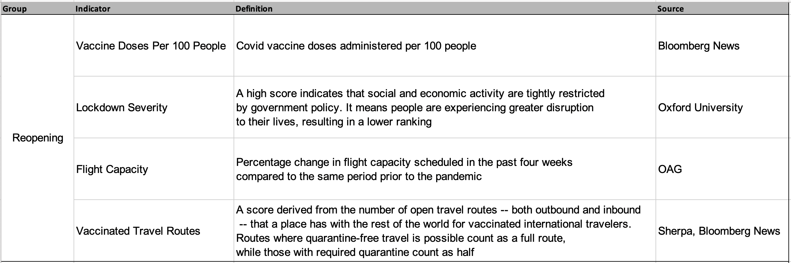
```

---
## Bloomberg's Covid Resilience Ranking


```{r, out.width='100%', fig.align='center', fig.cap='Building the Covid Resilience Ranking'}
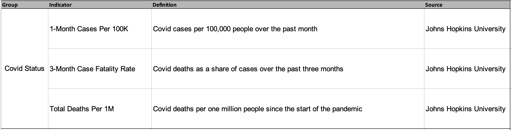
```


---
## Bloomberg's Covid Resilience Ranking


```{r, out.width='100%', fig.align='center', fig.cap='Building the Covid Resilience Ranking'}
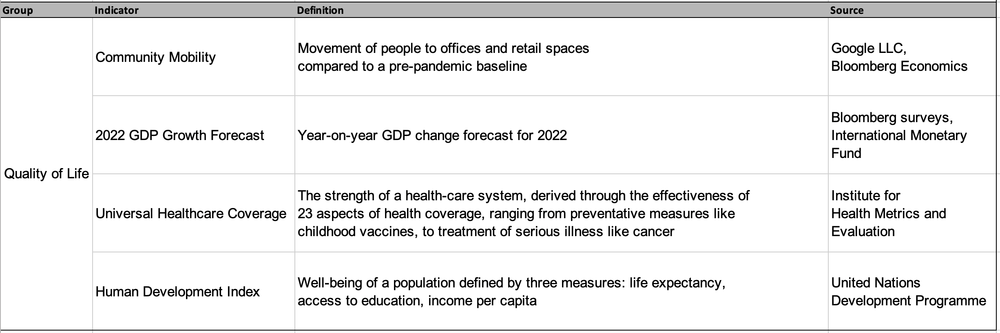
```


---
# Bloomberg's methods
 
## How is the Ranking Aggregated?
- Aggregated through the “max-min” method
    - Used to convert metrics expressed in different scales into a common one

- All indicators are scored 0-100
  - 100 indicates best performance
  - 0 indicates worst
  - The final score is determined by averaging country’s performance across 12 indicators with equal weight.

<!-- --- -->
<!-- # Bloomberg's methods -->

<!-- ## Reopening Progress tag -->
<!--   - New reopening tab introduced in June -->

<!--   - 4 indicators that help measure country’s path toward opening up -->

<!--   - Include vaccination progress and lockdown severity -->

<!--   - 2 new data sets, flight capacity and vaccinated travel routes -->

<!--   - Flight capacity calculates the provision of plane seats in each place -->

<!--   - Vaccination routes: look at entry restrictions on the destination end to determine openness of a route. Some country specific requirements are not factored in -->

<!-- --- -->
<!-- # Bloomberg's methods -->

<!-- ## Vaccine Doses per 100 -->
<!--   -  Previous indicator approximated percentage of a country’s population that is fully inoculated by looking at total doses administered and mix of vaccine types -->

<!--   -  Boosters risked harming the calculation by marking those getting a third shot as “newly vaccinated” -->

<!--   - Determined doses per 100 people was a better metric -->

<!-- ## Lockdown Severity -->
<!--   - Based on index produced by University of Oxford -->

<!--   - Restrictive Government policies interpreted as negative in strictness ranking -->
<!--     - Seen as a failure to progress -->

<!-- --- -->
<!-- # Bloomberg's methods -->

<!-- ## Does Lockdown Severity reflect conditions across an entire economy? -->
<!--   - Index reflects the most stringent conditions in place anywhere in a given economy -->

<!--   - Will naturally penalize larger countries such as US and China -->

<!--   - Effects smaller places with a developed system of government -->

<!-- ## Why 2 data points on virus deaths? -->
<!--   - Case-fatality rate is an indicator of whether a palace is effectively treating infected and preventing COVID-19 deaths -->

<!--   - Does not cover total deaths properly -->

<!--   - Total deaths per 1 million shows long term effects in order to balance out scores -->


<!-- --- -->
<!-- # Bloomberg's methods -->

<!-- ## What does the positive test rate show -->
<!--   - Positive test rate is considered by experts as the most reliable way to determine if a -->
<!--   place is testing enough -->

<!--   - High rates of positive means authorities are probably only testing sick people -->

<!--   - Economies that don't report daily positives -->
<!--     - Number of cases/ total tests administered on the last day the data was disclosed -->

<!-- ## What does community mobility show -->
<!--   - Tracks people's real time movements and helps round out our understanding of how they are responding to virus restrictions in their everyday loss -->

<!--   - Tracks movement from retail, recreational, and work places -->

<!--   - 30 day periods to smooth out holiday periods -->


<!-- --- -->
<!-- # Bloomberg's methods -->

<!-- ## What does the GDP measure Track -->
<!-- - Reflects the percentage contraction or expansion projected this year -->

<!-- - Ranking is meant to show the best place to be currently -->

<!-- ## Why is the state of pre-pandemic health care relevant to COVID-19 -->
<!--   - Universal healthcare indicator draws from a 2019 dataset published by Institute for -->
<!--   health metrics and evaluation -->
<!--     - Maps the effectiveness of 23 preventative and treatment measures ranging from access to basic non-covid vaccines to cancer care -->

<!--   - Reflects an economy’s ability to effectively prevent, detect and treat illness across a population -->


<!-- --- -->
<!-- # Bloomberg's methods -->

<!-- ## What’s the point of including the Human Development Index? -->
<!--   - Produced annually by the United Nations Development Programme -->

<!--   - Has three parts -->
<!--     - Life expectancy at birth -->
<!--     - Years of schooling -->
<!--     - Wealth per capita -->

<!--   - Chosen to represent the overall well-being of society -->

<!--   - Years of schooling reflects -->
<!--     - Access to education, proxy for populations trust in science (experts say is key) -->

<!--   - Wealth per capita reflects people’s income adjusted for purchasing power -->

<!--   - Life expectancy is a proxy for whether access to health-care is equitable across a -->
<!--   population -->


---
# How can we characterize government responses from Bloomberg data? 

- We used clustering analysis to discover countries that had similar government responses.

- We used principal component (PC) analysis to characterize twelve Bloomberg indices into the two PCs that best explain the variance of the Bloomberg indices.

---
# Clustering and PC Analysis on Bloomberg Indices


```{r, out.width='91%', fig.align='center'}
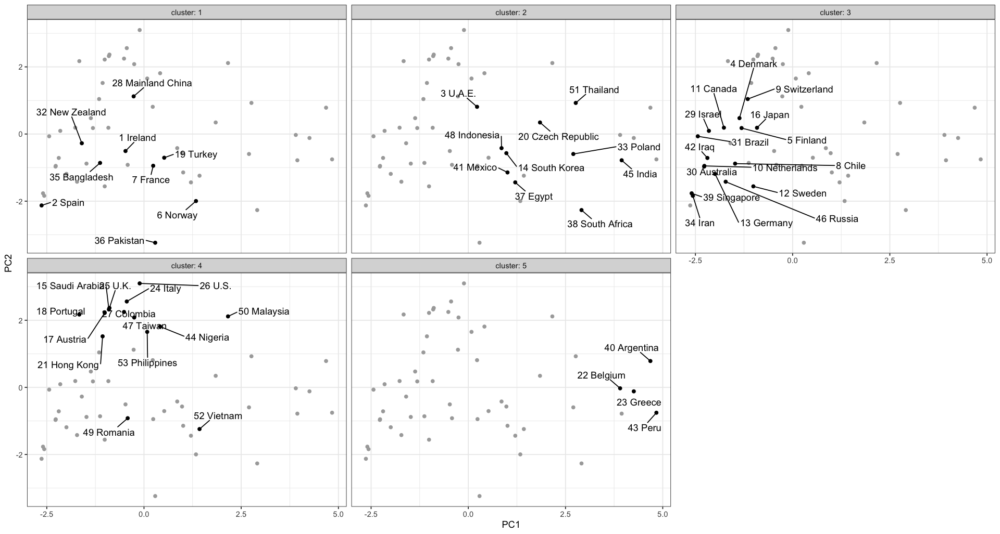
```


---
class: inverse, center, middle

# Oxford's Studies
<html><div style='float:left'></div><hr color='#EB811B' size=1px width=796px></html>
---


# Overview
- Oxford’s goal is to track covid policy data consistently and use it to compare policy responses to COVID-19.

- They collect data on 180 different countries and 23 different indicators.

- The data collection began on January 1st, 2020 which marks the very early stages of the global pandemic.

---

# Indicators Utilized
- There are 21 live indicators that are inputted into the dataset daily.

- Containment and Closure Policies: Marked as C1-C8 on the dataset.

- Economic Policies: E1-E4

- Health System Policies: H1-H8

- Vaccine Policies: V1-V4

<!-- --- -->
<!-- # Data Types -->
<!-- - Five kinds of data are utilized in the dataset. -->

<!-- - Ordinal: On a simple scale of severity. -->

<!-- - Numeric: Specific number typically in U.S. dollars. -->

<!-- - Text: An open ended free response. -->

<!-- - Categorical: Range of eligible options to select and occasionally rank. -->

<!-- - Binary: Present (1) or absent (0). -->

---
# Policy Indices (1 of 2)
- Overall Government Response Index: 
  - Calculated using ordinal indicators
  
- Containment and Health Index: 
  - Combines lockdown restrictions and closure measures with health variables such as testing policy, contact tracing, and others. 
  - Calculated using all ordinal containment and closure policy indicators and health system policy indicators.
  

---
# Policy Indices (2 of 2)

- Stringency Index: 
  - Measures the strictness of lockdown style. 
  - Calculated using all ordinal containment and closure policy indicators, plus an indicator recording public information campaigns.

- Economic Support Index: 
  - Measures income support and debt relief. 
  - Calculated using all ordinal economic policy indicators

<!-- - Risk of Openness Index: -->
<!--   - Based on the recommendations set out by the World Health Organization of measures that should be put in place before COVID-19 response policies can be safely relaxed. -->

---
# Calculation of Policy Indices
- Policy indices are averages of the individual component indicators.

$\hspace{3cm}\textit{index} = \dfrac{1}{k}\sum_{j=1}^{k} I_{j}$

  - $k$: the number of component indicators in an index; 
  - $I_{j}$: the sub-index score for an individual indicator.
  
  
---

# Relation between National and Sub-National Data 
- So far, Oxford has incorporated data for Brazilian states, Canadian provinces and territories, Chinese provinces, UK developed nations, and U.S. States.

- 3 main usage for the OxCGRT data:
  1. Describe all government responses relevant to a certain country
  2. Describe policies put in place by a given level and lower levels of government
  3. Compare government responses across different levels of government

---

<!-- # Variation in Government Response -->
<!-- -Government responses have become stronger as time continues during the pandemic and the response picked up in March of 2020. -->

<!-- - There are variations across countries however, the variation is becoming less overtime as countries create more comprehensive plans. -->


<!-- --- -->

# Variation in Government Response


```{r, out.width='90%', fig.align='center', fig.cap='Stringency Index Across Continents'}
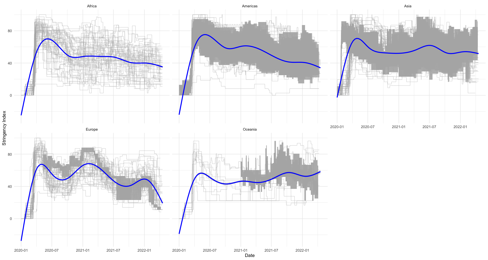
```


---

# Variation in Government Response


```{r, out.width='90%', fig.align='center', fig.cap='Economic Support Index Across Continents'}
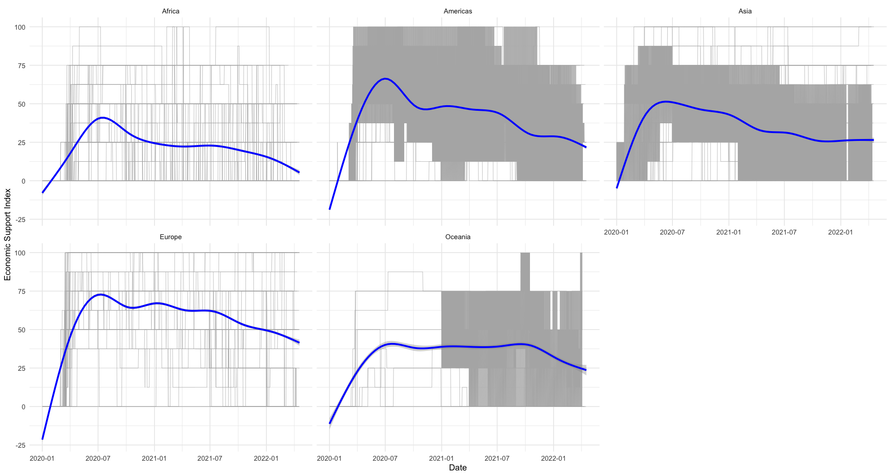
```


<!-- --- -->
<!-- # Variation in Government Response -->
<!-- - A graph showing the reported number of new cases and the government response index showed there are differences between the countries response. -->

<!-- - Brazil and America were similar in their government response index being below the number of reported new cases while Canada, Italy, and the United Kingdom’s index closely matched the number of reported new cases. -->

<!-- - China on the other hand, had the government response ratio higher than the number of reported new cases. -->


---
class: inverse, center, middle

# Regresssion Analysis
<html><div style='float:left'></div><hr color='#EB811B' size=1px width=796px></html>
---


# Regresssion Analysis

- We used the fixed effect (FE) linear regression models to estimate the effect of COVID-19 on various outcomes.

- Panel data allows us to control for variables we cannot observe or measure like cultural factors or differences in social norms across countries.

---


# Reproduction Rate of COVID-19

- The reproduction rate is the average number of secondary cases produced by a primary case.

<!-- - It may vary over time with different control rates, contact rates, and climate conditions. -->

- It is greater than one when the number of infected individuals are increasing.

- Here we estimated to what extent COVID-19 policies impacted the reproduction rate.

---

# Reproduction Rate of COVID-19


```{r, out.width='90%', fig.align='center', fig.cap='Reproduction Rates Across Continents'}
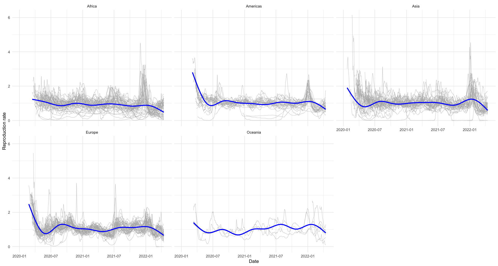
```

---


# The Effect of COVID-19 Policies on the Reproduction Rate

```{r, out.width='77%', fig.align='center'}
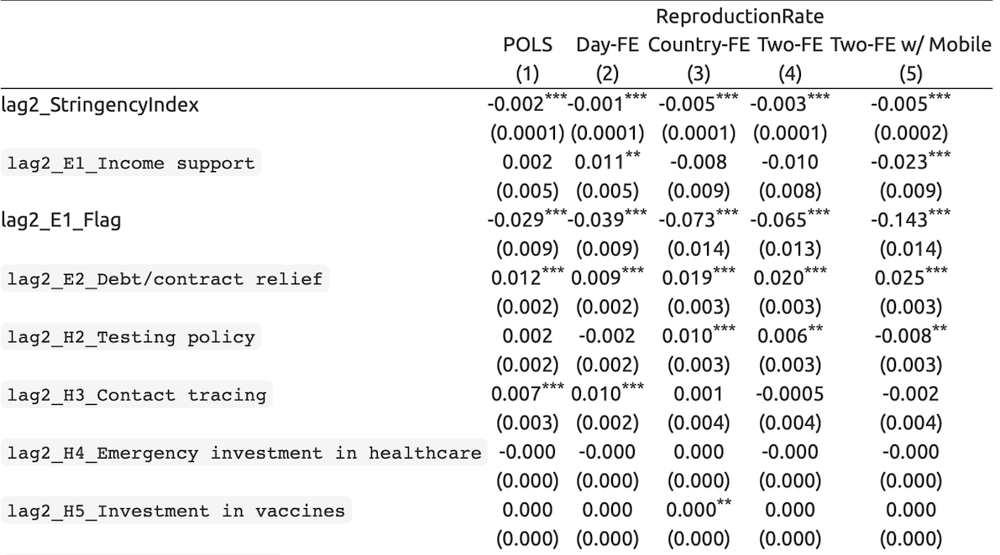
```


---

# The Effect of COVID-19 Policies on the Reproduction Rate

```{r, out.width='77%', fig.align='center'}
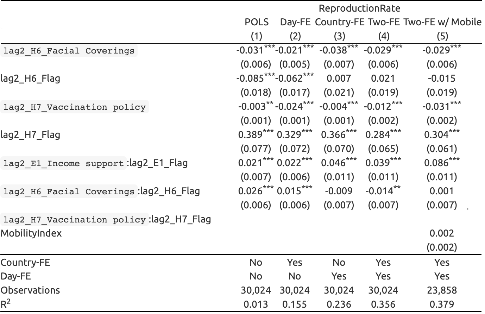
```


---
# The Effect of COVID-19 Policies on the Reproduction Rate

```{r, out.width='62.5%', fig.align='center'}
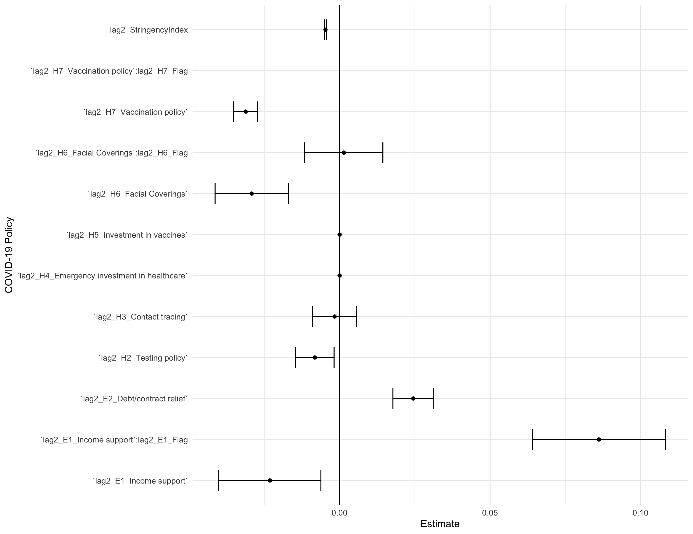
```

---
# The Effect of COVID-19 Policies on the Death per capita

- We estimated to what extent COVID-19 policies impacted the death per capita.


---

# Death per capita

```{r, out.width='90%', fig.align='center', fig.cap='Death per capita Across Continents'}
knitr::include_graphics('trend_death.png')
```


---


# The Effect of COVID-19 Policies on the Death per capita

```{r, out.width='95%', fig.align='center'}
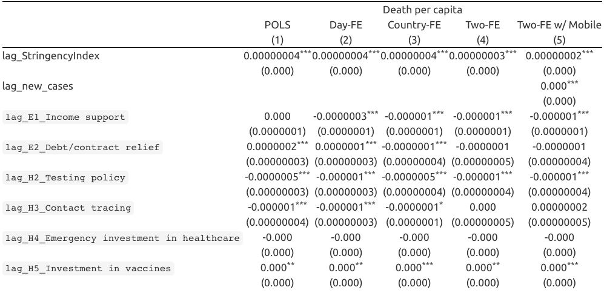
```


---

# The Effect of COVID-19 Policies on the Death per capita

```{r, out.width='95%', fig.align='center'}
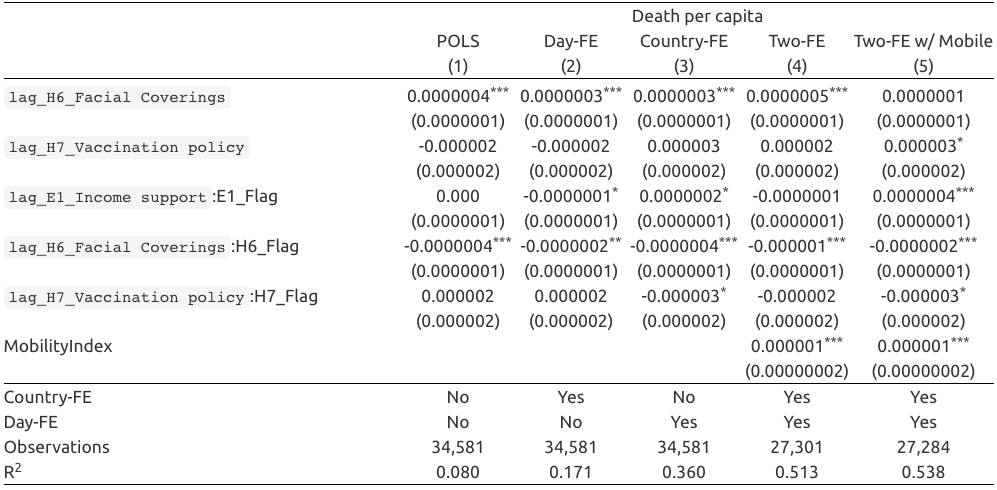
```


---
# The Effect of COVID-19 Policies on the Death per capita

```{r, out.width='62.5%', fig.align='center'}
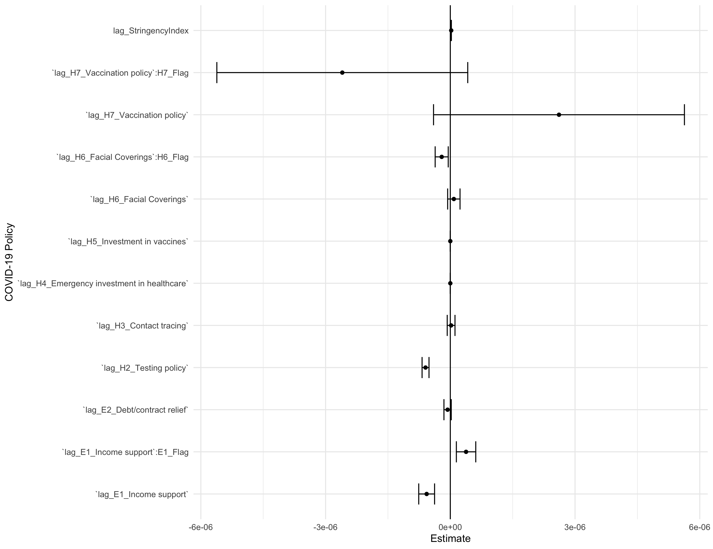
```


---

# The Effect of COVID-19 on the Economic Growth

- We estimated the effect of the COVID-19 Pandemic on economic growth using the Solow growth model.

---


# Growth Rate of GDP per Worker

```{r, out.width='90%', fig.align='center'}
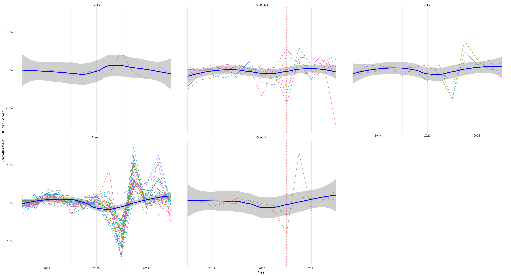
```


---
# The Effect of COVID-19 on the Economic Growth

```{r, out.width='80%', fig.align='center'}
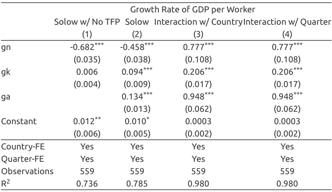
```


---
# The Effect of COVID-19 on the Economic Growth

```{r, out.width='62.5%', fig.align='center'}
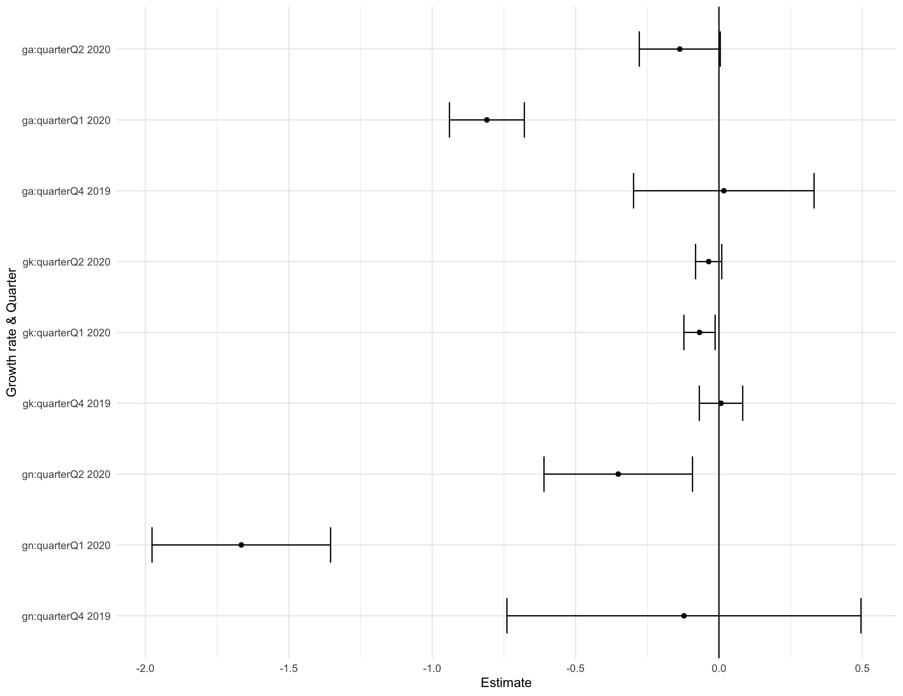
```


---

# Conclusion

- Utilizing the data provided to us, we were able to visualize and analyze the effect of COVID-19 policies.

- Using what we learned from the data, we know what type of government response might influence the magnitude of the pandemic and economic impact.

- We now understand the importance of collecting accurate data. This could help influence  evidence-based government policies in the future.


---
# References

- Chang, Rachel, and Felix Tam. “Methodology: Inside Bloomberg's Covid Resilience Ranking.” Bloomberg.com, 24 November 2020, https://www.bloomberg.com/news/articles/2020-11-24/inside-bloomberg-s-covid-resilience-ranking. Accessed 19 April 2022.

- Francisco Arroyo-Marioli,  Francisco Bullano,  Simas Kucinskas,  Carlos Rondón-Moreno. (2021). "Tracking R of COVID-19: A new real-time estimation using the Kalman filter," PLOS One. https://journals.plos.org/plosone/article?id=10.1371/journal.pone.0244474#pone.0244474.ref024

- Google. (2022). "Community Mobility Report." https://www.google.com/covid19/mobility/

- IMF eLibrary Data. (2022). https://data.imf.org/

---

# References

- Hale, Thomas, Jessica Anania, Noam Angrist, Thomas Boby, Emily Cameron-Blake, Martina Di Folco, Lucy Ellen, Rafael Goldszmidt, Laura Hallas, Beatriz Kira, Maria Luciano, Saptarshi Majumdar, Radhika Nagesh, Anna Petherick, Toby Phillips, Helen Tatlow, Samuel Webster, Andrew Wood, Yuxi Zhang, “Variation in Government Responses to COVID-19” Version 12.0. Blavatnik School of Government Working Paper. 11 June 2021. Available: www.bsg.ox.ac.uk/covidtracker


- Thomas Hale, Noam Angrist, Rafael Goldszmidt, Beatriz Kira, Anna Petherick, Toby Phillips, Samuel Webster, Emily Cameron-Blake, Laura Hallas, Saptarshi Majumdar, and Helen Tatlow. (2021). “A global panel database of pandemic policies (Oxford COVID-19 Government Response Tracker).” Nature Human Behaviour. https://doi.org/10.1038/s41562-021-01079-8

- World Economic Forum, “Global Risks Report 2022,” 11 Jan. 2022, https://www.weforum.org/reports/global-risks-report-2022/in-full/chapter-6-refreshing-resilience-from-covid-19-lessons-to-a-whole-of-society-response. 


